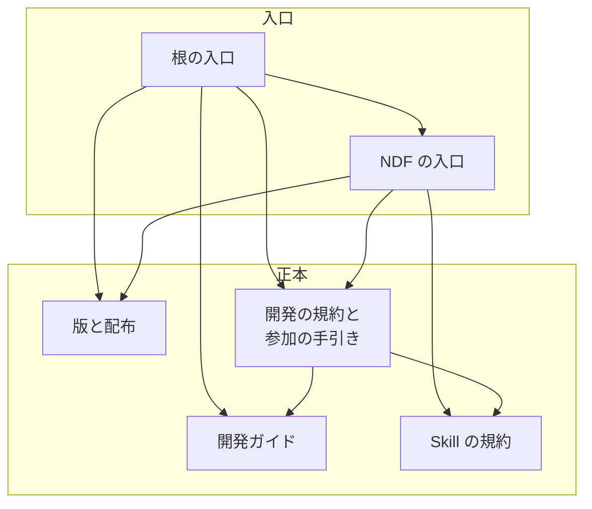
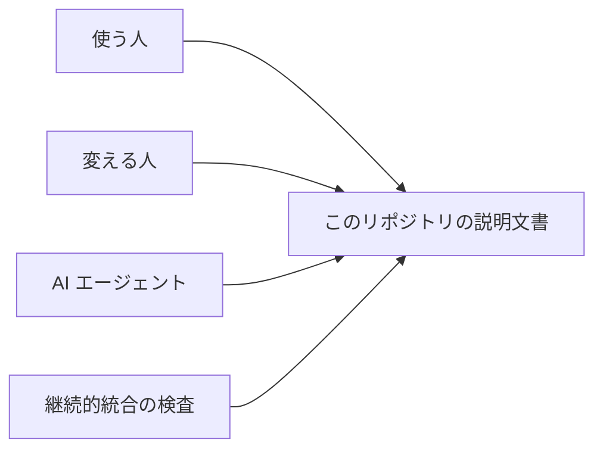
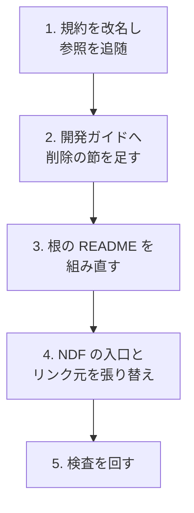

# #500: README.md 22 本を役割で分け、役割に合わない 3 本だけを手入れする

要求と受け入れ条件は [issue-500-requirements.md](issue-500-requirements.md) にある。この文書は
「どう作るか」だけを扱う。行番号はすべて `origin/develop`（`55d94f9`）のものである。

## 作るもの

**新しいファイルは作らない。** 規約の 1 本を改名し、既存の文書を手入れする。

| 区分 | ファイル | 何をするか |
| --- | --- | --- |
| 改名 | `plugins/ndf/skills/README.md` → `plugins/ndf/skills/AUTHORING.md` | 本文は変えない（決定 2） |
| 変更 | `README.md` | 変える人向けの節と、正本と重なる手順を外す（「根の README から外す節と正本」） |
| 変更 | `docs/plugin-development-guide.md` | 「既存プラグインの削除」を受け取る（決定 4） |
| 変更 | `plugins/ndf/README.md` / `CONTRIBUTING.md` / `docs/project-overview.md` | 節のまとめとリンクの張り替え（「ほかの文書の手入れ」） |
| 変更 | 規約のパスを書いた 11 本 | 改名の追随（「ほかの文書の手入れ」の最終行） |
| 変えない | `docs/versioning-and-distribution.md` / `AGENTS.md` | 正本として指されるだけ（決定 5） |

## 機能一覧

| # | 機能 | 誰が使うか |
| --- | --- | --- |
| 1 | 根の `README.md` を開くと、何ができるかと入れ方だけが並ぶ | 使う人 |
| 2 | 開発版・過去の版・プラグインの作り方は、正本へのリンクから 1 か所で読める | 検証に参加する人・変える人 |
| 3 | Skill の書き方の規約を、名前で見つけられる | Skill を書く人・AI エージェント |

## 22 本の役割

**判定の基準は、節の読み手と、その文書を開く読み手が一致するかである**（決定 1）。一致しない
節を持つものだけを手入れする。

| # | ファイル | 行 | 役割 | 手入れ | 理由 |
| ---: | --- | ---: | --- | --- | --- |
| 1 | `README.md` | 492 | 入口 | する | 変える人向けの「開発ガイドライン」と「マーケットプレイス管理」190 行を持つ。導入・開発版・過去の版の手順が他の文書と重なる |
| 2 | `plugins/ndf/skills/README.md` | 493 | 規約 | する（改名） | 先頭の見出しが「Skill 執筆規約」で、全体が書き方の基準である |
| 3 | `plugins/ndf/README.md` | 356 | 入口 | する | 末尾の「検証」「開発者向け」が変える人向けで、`CONTRIBUTING.md` と重なる |
| 4 | `plugins/mcp/mcp-dbhub/README.md` | 198 | 入口 | しない | 設定・使用例・注意事項はどれも使う人向け |
| 5 | `plugins/mcp/mcp-playwright/README.md` | 192 | 入口 | しない | 更新案内 2 節は入れ替えの操作で、使う人向け（決定 8） |
| 6 | `plugins/mcp/mcp-redash/README.md` | 169 | 入口 | しない | 「ファイル構成」「設計意図」は suffix を足す運用を使う人が理解するための説明 |
| 7 | `plugins/playwright-kit/skills/playwright-kit-ops/templates/runtime-README.md` | 133 | 雛形 | しない | 生成先の入口になる素。このリポジトリの読み手向けではない |
| 8 | `docs/presentations/README.md` | 125 | 索引 | しない | ビルドと追加の手順の読み手は、このディレクトリを開く資料の作り手と一致する |
| 9 | `plugins/mcp/mcp-bigquery/README.md` | 113 | 入口 | しない | 使う人向けだけ |
| 10 | `plugins/mcp/mcp-devin/README.md` | 112 | 入口 | しない | 使う人向けだけ |
| 11 | `plugins/playwright-kit/README.md` | 100 | 入口 | しない | 「分離した理由」は、別途の導入が要る理由を使う人へ伝える |
| 12 | `plugins/mcp/mcp-notion/README.md` | 97 | 入口 | しない | 使う人向けだけ |
| 13 | `plugins/ndf/scripts/lib/README.md` | 86 | 索引 | しない | 「置いてよいもの」の読み手は、このディレクトリへ部品を置く人と一致する |
| 14 | `plugins/mcp/mcp-aws-docs/README.md` | 85 | 入口 | しない | 使う人向けだけ |
| 15 | `plugins/playwright-kit/skills/playwright-planning/docs/README.md` | 79 | 索引 | しない | 構成と利用の流れを案内する |
| 16 | `plugins/mcp/mcp-markitdown/README.md` | 79 | 入口 | しない | 使う人向けだけ |
| 17 | `plugins/mcp/mcp-chrome-devtools/README.md` | 77 | 入口 | しない | 使う人向けだけ |
| 18 | `tests/runtime-smoke/README.md` | 66 | 入口 | しない | 実行の手順の読み手は、試験を走らせる人と一致する |
| 19 | `plugins/mcp/mcp-serena/README.md` | 63 | 入口 | しない | 更新案内 2 節は使う人向け（決定 8） |
| 20 | `issues/old/README.md` | 56 | 索引 | しない | 完了した記録の案内 |
| 21 | `issues/README.md` | 41 | 索引 | しない | 「ファイル名の付け方」の読み手は、`issues/` へ置く人と一致する |
| 22 | `docs/specifications/README.md` | 16 | 索引 | しない | 確定仕様の置き場所の案内 |

入口 14 本・索引 6 本・規約 1 本・雛形 1 本、計 3228 行である。

## 根の README から外す節と正本

**正本へ足すのは「プラグインの削除」だけである**（決定 3・4）。他の節は、同じ主題を持つ文書に
すべて載っていることを確かめた。

| 節 | 行 | 扱い | 正本 | 重複と判定した根拠 |
| --- | --- | --- | --- | --- |
| 利用方法 > Kiro CLI の選択肢・Slack の設定・既定エージェント | 78-108 | 正本へのリンク | `plugins/ndf/README.md` の「Kiro CLI」「Slack 通知」、`plugins/ndf/docs/kiro-cli.md` | 同じ選択肢を持ち、正本の側は `--dry-run` と版数の確かめ方も持つ |
| 利用方法 > agy の複製の中身と入れ替え | 128-139 | 正本へのリンク | `plugins/ndf/README.md` の「agy」 | 根は Skill を「33 個」とし、正本は 43 個と `install-hooks.sh` の手順を持つ。**根の側が古い** |
| 利用方法 > Codex の同名追加の注意、開発版を試す | 64-65、141-195 | 正本へのリンク | `docs/versioning-and-distribution.md` の「開発版を試す」「ランタイムごとの取得と導入」「チャネルと ref」 | コマンドは同じ。根の Codex の手順には、同名の取得元を先に外す `marketplace remove` が無い。**根の側が古い** |
| 開発版を試す > 開発に参加する場合 | 196-202 | 正本へのリンク | `CONTRIBUTING.md` の「開発の進め方」、`AGENTS.md` の「Git運用ルール」 | `--base develop` と `check-pr-base.sh` の記載がある |
| 過去の版へ戻す | 204-223 | 正本へのリンク | `docs/versioning-and-distribution.md` の「利用者が過去の版へ戻る」 | 最初のタグ・他のプラグインも戻る点・同時に有効にしない点がすべてある |
| 開発ガイドライン > ディレクトリ構造 | 242-255 | 消す | `AGENTS.md` の「マーケットプレイスの構造」 | 根の図は正本の図の部分集合 |
| 開発ガイドライン > Runtime plugin の検証 | 257-279 | 消す | `docs/plugin-development-guide.md` の「Runtime plugin 検証」、`tests/runtime-smoke/README.md` | 同じコマンドがある。開発ガイドから `tests/runtime-smoke/README.md` へのリンクだけを足す |
| 開発ガイドライン > 新しいプラグインの作成手順 | 281-363 | 消す | `docs/plugin-development-guide.md` の「新しいプラグインの追加」「plugin.json の作成」「マーケットプレイスの構造」「ドキュメント要件」 | 同じ手順を持つ。根の「テストとコミット」は `file://` の取得元の追加と直接 push で、正本の「ローカルテスト」と `AGENTS.md` に反する。SKILL.md の例の `name: スキル名` は規約の「名前と親ディレクトリ名を一致させる」に反する |
| 開発ガイドライン > 開発のベストプラクティス | 365-381 | 消す | `AGENTS.md` の「ベストプラクティス」「セキュリティ要件」、開発ガイドの「検証チェックリスト」 | 12 項目すべてがどちらかにある |
| マーケットプレイス管理 > プラグインの更新 | 385-398 | 消す | `docs/plugin-development-guide.md` の「既存プラグインの更新」 | 同じ手順を持つ |
| マーケットプレイス管理 > プラグインの削除 | 400-413 | **移す** | `docs/plugin-development-guide.md` に新しい節「既存プラグインの削除」 | 正本が無い（決定 4） |
| マーケットプレイス管理 > バージョン管理ルール | 415-427 | 消す | `docs/versioning-and-distribution.md` の「版の付け方と開発版の配布」 | MAJOR / MINOR / PATCH の区分がある。例 3 行は区分の言い換えで、持ち込まない（決定 5） |

残す節は「概要」「利用方法」（各ランタイムの最初の 1 手）「利用可能なプラグイン」「変更履歴」
「リファレンス」「コントリビューション」「サポート」「ライセンス」である。**「リファレンス」は
「開発ガイドライン」の下から 2 段の見出しへ上げ**、プロジェクト内ドキュメントの一覧へ開発ガイドと
版と配布の正本を足す。

## 手入れ後の根の README

```text
# AI Plugins
## 概要                      … 変えない（検査 A・B・C・G が読む）
## 利用方法                  … チャネルの表と、開発版の正本へのリンク
### Claude Code / Codex      … 取得元の登録と ndf の導入の 2 行
### Kiro CLI / agy           … clone と導入の 1 行、選択肢は NDF の入口へ
### 開発版を試す             … 正本へのリンクだけ
### 過去の版へ戻す           … 正本へのリンクだけ
### 利用可能なプラグイン     … 変えない（検査 H が読む）
### 変更履歴                 … 変えない
## リファレンス              … 2 段へ上げ、開発ガイドと版と配布の正本を足す
## コントリビューション / サポート / ライセンス … 変えない
```

見込みは 190 行前後である。

## ほかの文書の手入れ

| ファイル | 変えること |
| --- | --- |
| `plugins/ndf/README.md` | レイアウト図の `skills/README.md` を改名先へ。「インストール」の開発版へのリンクを版と配布の正本の「開発版を試す」へ。「検証」「開発者向け」の 2 節を、`CONTRIBUTING.md` の「手元での検証」と規約へのリンク 1 節にまとめる（`validate-runtime-plugins.sh` が JSON の検査と Kiro の `--dry-run` を回すため、失う手順は無い） |
| `docs/plugin-development-guide.md` | 「既存プラグインの削除」を足す。「Runtime plugin 検証」に `tests/runtime-smoke/README.md` へのリンクを足す。見込みは 249 行から 265 行前後 |
| `docs/project-overview.md` | 開発版へのリンク（L42）を版と配布の正本の「開発版を試す」へ |
| `CONTRIBUTING.md` | 規約のリンク（L113）を改名先へ。「新しいプラグインの作成手順」（L115）を開発ガイドの「新しいプラグインの追加」へ |
| 規約の改名の追随 | `CLAUDE.md` L34、`.github/ISSUE_TEMPLATE/skill_proposal.yml` L11、`docs/specifications/ndf-design-phase.md` L137、`docs/specifications/ndf-skill-inventory/` の 3 本、`plugins/ndf/skills/release/references/form-package-plugin.md` L92、`plugins/ndf/skills/skill-stats/scripts/skill-stats.py` L101、`scripts/check-skill-frontmatter.py` L4・L37・L222、`scripts/check-skill-repo-assumptions.py` L8・L311、`scripts/tests/doc_staleness_helpers.py` L179 |

**「既存プラグインの削除」は、根の手順 3 つのうち 2 つを移し、コミットの手順を書き換える。**
根の手順は `git add .` から `git push` までを直接行う形で、`AGENTS.md` の「Git運用ルール」に
反する。移す先ではブランチを作って Pull Request を出す形にする。

## 構成要素

| 要素 | 責務 |
| --- | --- |
| 根の入口（`README.md`） | 概要・導入の最初の 1 手・プラグイン一覧・リンク集。規約と手順を持たない |
| NDF の入口（`plugins/ndf/README.md`） | NDF の導入の選択肢・更新・hook・通知。開発の手順を持たない |
| Skill の規約（`plugins/ndf/skills/AUTHORING.md`） | Skill の frontmatter と命名の基準。改名するだけで本文は変えない |
| 開発ガイド（`docs/plugin-development-guide.md`） | プラグインを作る・変える・消す手順の正本。削除の節を受け取る |
| 版と配布の正本（`docs/versioning-and-distribution.md`） | 開発版・過去の版の正本。この変更では書き換えない（決定 5） |
| 開発の規約（`AGENTS.md`）・参加の手引き（`CONTRIBUTING.md`） | 構造・ベストプラクティス・検証の正本。`AGENTS.md` は変えず、`CONTRIBUTING.md` はリンクの張り替えだけを受ける |



矢印はリンクの向きである。**正本から入口へのリンクは張らない。**

## 文脈



検査が読む先は変わらない。`check-doc-staleness.py` が根の `README.md` から読む記載は「概要」と
「利用可能なプラグイン」にあり、どちらも残る。`check-skill-frontmatter.py` と
`check-skill-repo-assumptions.py` は規約のパスを案内文とコメントに書くだけで、ファイルを開かない。

## 配置

| 置き場所 | 利用者の手元へ届くか | この変更で触るもの |
| --- | --- | --- |
| `plugins/` 配下 | 届く（取得元の clone と導入の実体） | NDF の入口、Skill の規約、`release` の参照 1 本、`skill-stats.py` のコメント |
| それ以外 | 届かない（GitHub で読む） | 根の入口、開発ガイド、`CONTRIBUTING.md`、`CLAUDE.md`、`docs/` のリンク元、検査スクリプトとテストの雛形 |

**Skill の規約の改名は配布物に現れる。** `main` へ出た時点で、GitHub 上の旧いパスの URL は
開けなくなる（未確認のまま残ること）。

## 処理の流れ



**2 を 3 より先に置く。** 根から節を消す時点で、移す先の見出しが実在している状態にする。
**4 は 3 の後に置く。** 張り替える先のアンカーを、組み直した後の見出しで確かめる。

## 決定の記録

### 決定 1: 手入れの判定を「節の読み手と、文書を開く読み手が一致するか」で行う

規約は入口に規約と手順を書かないと定めるが、索引や試験の入口は、開く人が規約と手順の読み手
そのものである。一致を基準にすると、`issues/README.md` の「ファイル名の付け方」のように、
置き場所の規則をそのディレクトリへ置く形を残せる。役割は先頭の見出しと本文の過半で決める。

「規約・手順の語に当たる節をすべて移す」基準は採らなかった。索引 3 本と試験の入口から、読み手が
最初に探す節を別の場所へ追い出すことになる。

### 決定 2: 規約の README を同じディレクトリで `AUTHORING.md` へ改名する

Skill を足す人は `plugins/ndf/skills/` を開いて規約を探す。置き場所を変えなければ、検査の案内文と
`CONTRIBUTING.md` の表が指す場所の感覚も変わらない。`AUTHORING.md` は `CONTRIBUTING.md` と同じく
中身を表す慣用の名前で、先頭の見出し「Skill 執筆規約」と対応する。

`docs/` へ移す案は採らなかった。規約が律する Skill の実体から離れ、配布物から規約が消える。

### 決定 3: 根の README から外す節の正本は既存の文書にし、新しい文書を作らない

外す 12 節のうち 11 節は、同じ主題が既存の文書にあることを確かめた（「根の README から外す節と
正本」）。そのうち 3 節は根の側が古い。新しい文書を作ると、正本が 3 か所目に増える。

### 決定 4: 「プラグインの削除」だけを開発ガイドへ移す

削除の手順は他の文書に無い。開発ガイドは作る・変える手順を持つため、消す手順を同じ文書に置くと
プラグインの一生が 1 か所で読める。移す際にコミットの手順を運用の規則へ合わせる。規則に反する
手順をそのまま移すと、正本が規則と食い違う。

### 決定 5: 版と配布の正本を書き換えない

根の「開発版を試す」「過去の版へ戻す」「バージョン管理ルール」の中身は、版と配布の正本の章 1〜4 と章 9 に
すべてある。#499 の設計は、#500 がこれらを章 2・4・7・9 へ寄せると見込んだが、寄せるものが無い。
版と配布の正本に触れなければ、#566（設計 PR #604）が固定する章 2 の位置の語と重ならず、どちらが先に
`develop` へ入っても取り込み直しが要らない。

「バージョン管理ルール」の例 3 行（`1.0.0 → 1.0.1` など）を章 2 へ持ち込む案は採らなかった。
区分の定義の言い換えで、囲めば検査 J が現行版より古い版数として落とす。

### 決定 6: 導入は、最初の 1 手を根に残し、選択肢と後続の手順を NDF の入口へ寄せる

規約は入口に「導入と最初の 1 手」を書くと定める。根と NDF の入口はどちらも入口であるため、
最初の 1 手は両方に置く。Kiro CLI の選択肢・Slack の設定・agy の hook の差し込みは NDF に
固有で、根の側が既に古くなっている（agy の Skill 数）。

根から導入の手順をすべて外し、一覧表から各プラグインの README へ渡す案は採らなかった。
根を開いた人が、最初の 1 手へ 1 回のリンクを余計に踏む。

### 決定 7: 記録の中の旧いパスと節名は書き換えない

`issues/` と `docs/development-history/` は起きたことを残す文書で、リンク検査の走査にも入らない。
書き換えると、当時の記録がどのファイルを指していたかが読めなくなる。

### 決定 8: 更新案内（「vX へ更新するとき」）は入口に残す

規約が入口に書かないとする「版ごとの変更点」は変更の一覧であり、更新案内は入れ替えに要る操作で
ある。使う人が導入の次に開く節で、NDF の入口の更新案内は版数を持つ 15 箇所の 1 つとして検査が
読む。

## テスト設計

| 受け入れ条件 | 何で確かめるか |
| --- | --- |
| AC1 | この文書の「22 本の役割」が 22 行で、`git ls-files -z '*README.md' \| xargs -0 wc -l` の本数と一致する |
| AC2 | `git ls-files '*README.md' \| grep -x plugins/ndf/skills/README.md` が 0 件 |
| AC3 | `grep -nE '^#+ (開発ガイドライン\|マーケットプレイス管理\|バージョン管理ルール\|新しいプラグインの作成手順)$' README.md` が 0 件 |
| AC4 | この文書の「根の README から外す節と正本」が 12 行で、各行の正本と根拠が埋まっている |
| AC5 | `grep -n '^## 既存プラグインの削除' docs/plugin-development-guide.md` が 1 件。他の行は正本の見出しを `grep` で引く |
| AC6 | `grep -nE '^#+ (概要\|利用方法\|利用可能なプラグイン\|コントリビューション\|サポート\|ライセンス)$' README.md` が 6 件 |
| AC7 | `git grep -n 'skills/README' -- ':!issues' ':!docs/development-history' ':!docs/presentations'` が 0 件 |
| AC8 | `git grep -nE '開発版を試す開発者向け\|新しいプラグインの作成手順\|バージョン管理ルール\|マーケットプレイス管理' -- ':!issues' ':!docs/development-history' ':!docs/presentations'` が 0 件 |
| AC9〜AC13 | 要求仕様に書いたコマンドの終了コード |
| AC14 | `git diff --stat origin/develop -- docs/versioning-and-distribution.md` が空 |

## 未確認のまま残ること

| 項目 | 内容 |
| --- | --- |
| 検査 E とレイアウト図 | `plugins/ndf/README.md` のレイアウト図の `skills/README.md` の行を書き換えても、検査 E が読む `skills/` の行（Skill 数）を読み違えないか。**実装で AC9 を回して確かめる** |
| 配布の走査 | `skills/` 直下のファイル名が変わっても `build-runtime-plugins.sh --check` と Kiro の installer が影響を受けないか。どちらもディレクトリか manifest だけを見るとコードからは読めるが、実行はしていない。**実装で AC12 を回して確かめる** |
| 外部からのリンク | リポジトリの外（issue のコメント、他のリポジトリ、チャット）から `blob/main/plugins/ndf/skills/README.md` を指す URL は、`main` へ出た時点で開けなくなる。数は測れない |
| issue テンプレートのリンク | `skill_proposal.yml` の URL は `main` を指す。テンプレートと規約のファイルは同じ配布で `main` に入るため、食い違う期間は無いと見込むが、GitHub が既定ブランチのテンプレートを読むことは実機で確かめていない |
