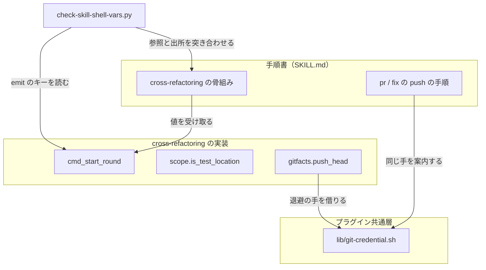
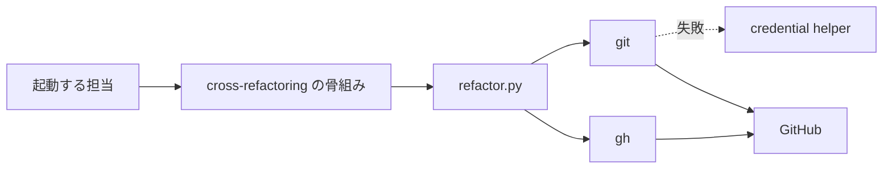
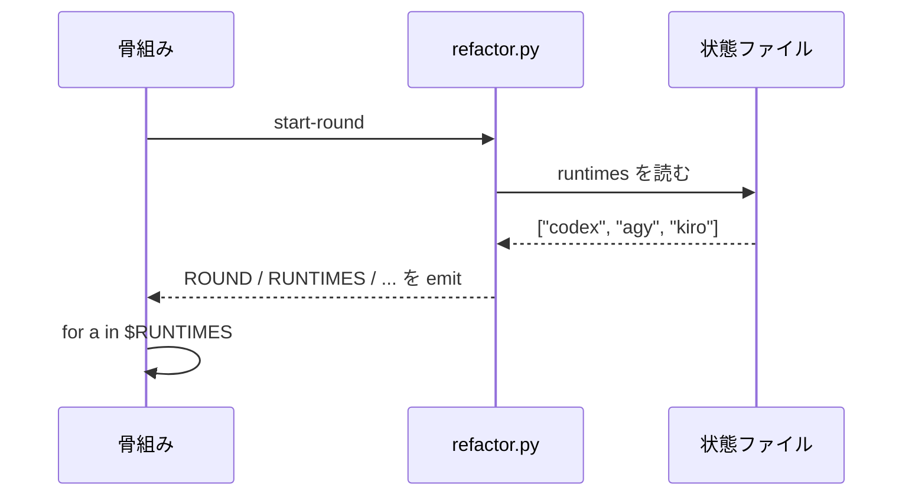
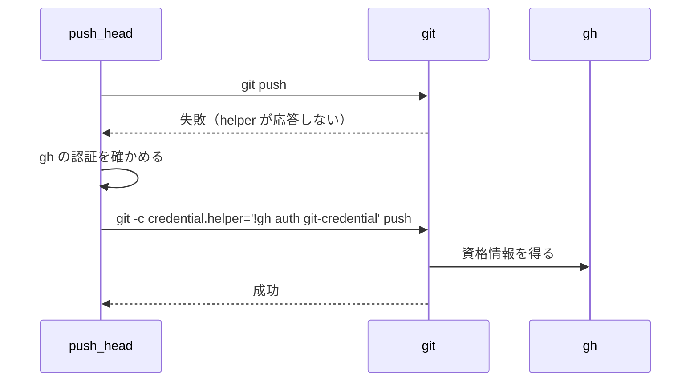
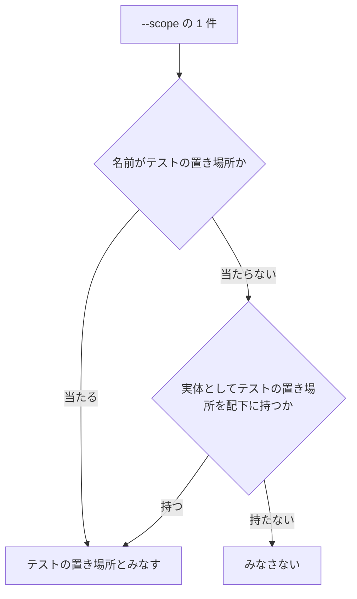

# 518 / 524: 工程が止まる 2 件を直す

要求と受け入れ条件は `issues/issue-518-524-workflow-blockers.md` にある。この文書は
「どう作るか」だけを扱う。

## 機能一覧

| # | 機能 | 誰が使うか |
| --- | --- | --- |
| 1 | 繰り返しの中で提案・レビューの母集合を得る | `cross-refactoring` を起動する担当 |
| 2 | 骨組みが参照する変数の出所を機械で検査する | 手順書を変える担当、継続的統合 |
| 3 | テストの実体を持つ親ディレクトリを `--scope` が受ける | `cross-refactoring` を起動する担当 |
| 4 | credential helper が応答しないときに push を退避する | 進行側（`refactor.py`）、手で push する担当 |

## 構成要素

| 要素 | 責務 |
| --- | --- |
| `commands/setup.py` の `cmd_start_round` | ラウンドの値に母集合（`RUNTIMES` / `RUNTIMES_CSV`）を足して返す |
| `scripts/check-skill-shell-vars.py`（新設） | 骨組みが参照する変数が、その行より前のコマンドで得られることを検査する |
| `refactor_lib/scope.py` の `is_test_location` | 名前で当たらないとき、実体を 1 段だけ走査して判定する |
| `scripts/lib/git-credential.sh`（新設） | helper を退避した `git` の呼び出し方を 1 か所で持つ |
| `refactor_lib/gitfacts.py` の `push_head` | 失敗したときに退避して 1 度だけ再試行する |
| `pr` / `fix` / `cross-refactoring` の `SKILL.md` | 退避の手を手順として書く |



## システム構成（文脈と配置）

**変更はプラグインの配布物の中で閉じる。** 外側にあるのは GitHub と、利用者の環境の
credential helper である。



`git` が helper の応答を得られないとき、`gh` は同じ資格情報で GitHub へ届く。**退避は
この差を使う。**

## パッケージ・モジュール構成

```text
plugins/ndf/
├── scripts/
│   └── lib/
│       └── git-credential.sh          # 新設。退避した git の呼び出し方
└── skills/
    └── cross-refactoring/
        ├── SKILL.md                   # 骨組みと push の手順
        └── scripts/refactor_lib/
            ├── scope.py               # --scope の関門
            ├── gitfacts.py            # push_head
            └── commands/setup.py      # cmd_start_round
scripts/
├── check-skill-shell-vars.py          # 新設。骨組みの変数の検査
└── tests/test_skill_shell_vars.py     # 新設
```

## 入出力の契約

**変える約束は `refactor.py` の副コマンドの出力である。** これは骨組みが `eval` して
受け取る値であり、呼ばれる側と呼ぶ側の約束にあたる。

| 名前 | `refactor.py start-round <id>` |
| --- | --- |
| 入力 | 状態ファイルの識別子（変更なし） |
| 出力（追加） | `RUNTIMES`（空白区切り） / `RUNTIMES_CSV`（コンマ区切り） |
| 出力（既存） | `ROUND` / `ROUND_KIND` / `PROPOSE_PHASE` / `IMPL` / `IMPL_MODEL` / `REVIEWERS` / `REVIEWERS_CSV` / `MAX_FIX_ROUNDS` |
| 失敗の形 | 変更なし（終了コード 1 = 繰り返し終了、4 = 中断） |
| 互換性 | **足すだけで、既存の値は変えない。** 既存の呼び出し側は影響を受けない |
| 検査の手段 | `scripts/check-skill-shell-vars.py` と `plugins/ndf/skills/cross-refactoring/tests/` |

**値の出所は状態ファイルの `runtimes` である。** `init` が返すものと同じ配列を読むため、
2 つの副コマンドが違う母集合を返すことはない。

`git-credential.sh` は呼ばれる約束を持つ。

| 名前 | `ndf_git_with_fallback <git の引数...>` |
| --- | --- |
| 入力 | `git` へ渡す引数 |
| 出力 | `git` の出力をそのまま通す |
| 失敗の形 | 1 度目の失敗で退避して再試行し、それも失敗すれば `git` の終了コードを返す |
| 互換性 | 新設のため既存の呼び出し側は無い |

## 処理の流れ

**図に含めないものが 2 つある。** 検査（`check-skill-shell-vars.py`）と
手順書の記述は、値が渡る経路を持たない。図は値と失敗が渡る 3 つの経路だけを描く。

### 母集合の受け渡し（#518-1）



### push の退避（#524）



**退避を先に試さないのは、既定の経路で通る環境が多数だからである。** 先に退避すると、
helper が正しく動く環境でも `gh` への依存が入る。

### `--scope` の判定（#518-2）



## 非機能の実現方式

| 大項目 | 実現方式 | 確かめ方 |
| --- | --- | --- |
| 可用性 | 退避の再試行は 1 度だけ。繰り返さない | 単体テストで呼び出し回数を数える |
| セキュリティ | 資格情報は `gh` が渡し、コマンドの引数にも出力にも現れない | 退避のコマンド列を単体テストで突き合わせる |
| 保守性 | 骨組みと実装の食い違いを機械で見る | `check-skill-shell-vars.py` を継続的統合へ載せる |
| 移行性 | 出力は足すだけで、既存の値と失敗の形を変えない | 既存テストがそのまま通ること |
| 性能 | 実体の走査は `--scope` の 1 件につき 1 段（配下のディレクトリ名のみ） | 走査の深さを単体テストで固定する |
| システム環境 | 退避は `gh` が使えることを条件とする。無ければ退避せず失敗を返す | `gh` の不在を模した単体テスト |

## 決定の記録

### 決定 1: 母集合は `start-round` も返す

繰り返しの中で使う値は、繰り返しの中で得られるようにする。`init` だけが返す形では、
状態ファイルから再開する経路と、骨組みを抜粋して写す経路の両方で未定義になる。値の出所は
どちらも状態ファイルの `runtimes` であるため、2 つの副コマンドが食い違うことはない。

骨組みの側だけを直す案は採らない。`init` を飛ばす経路が残る。

### 決定 2: 骨組みの検査は、参照と出所の突き合わせで行う

`SKILL.md` の bash ブロックから参照する変数を集め、その行より前の代入と、`refactor.py` の
副コマンドが `emit` するキーを出所として突き合わせる。`emit` のキーは Python の構文木から
読む（実測で取得できることを確かめた）。

シェルの構文解析器を導入する案は採らない。骨組みは代入・`for`・コマンド置換に限られており、
この範囲は後ろ向きの状態だけで読める（#201 で同じ判断をしている）。

### 決定 3: `--scope` の判定は、名前で当たらないときだけ実体を見る

名前だけの判定は「まだ存在しないテストの置き場所を指す」経路のために残す。実体を見るのは
名前で当たらなかったときに限り、走査は配下の 1 段だけにする。深く潜ると、無関係な階層の
テストを根拠にして関門が素通りする。

実体だけで判定する案は採らない。`--scope tests/services` のように、これから作る置き場所を
渡す運用が通らなくなる。

### 決定 4: 退避は失敗してから 1 度だけ行う

既定の経路を変えず、`git` が失敗したときに退避して再試行する。helper が正しく動く環境の
振る舞いを変えないためである。再試行を 1 度に限るのは、認証以外の理由（参照の競合、
ネットワークの不通）で失敗したときに同じ失敗を繰り返さないためである。

常に退避する案は採らない。helper が動く環境でも `gh` への依存が入る。

### 決定 5: 退避の手は共通層に置き、手順書は同じ手を案内する

`pr` / `fix` は人が実行する手順であり、`cross-refactoring` は実装が実行する。**同じ退避の
コマンドが 2 か所に書かれると、片方だけが更新される。** 共通層の 1 本を実装が読み、手順書は
同じコマンドを案内する。

## テスト設計

| 受け入れ条件 | 何で確かめるか |
| --- | --- |
| `start-round` が母集合を返す | `tests/test_start_round_emits_runtimes.py`（新設）。emit のキーと値を突き合わせる |
| 骨組みの変数の出所を機械で検査する | `scripts/tests/test_skill_shell_vars.py`（新設）。未定義を混ぜた骨組みで落ちること、現行の骨組みで通ること |
| 提案が母集合の全員に対して起動する | 同上。`for a in $RUNTIMES` の参照が母集合を指すこと |
| 実体を持つ親ディレクトリが関門を通る | `tests/test_scope_gate.py` へ追加。`tests/` を持つ親を渡して通ること |
| 実体も名前も当たらない `--scope` は止まる | 同上。テストを持たないディレクトリで止まること |
| 名前で渡す経路は通る | 同上。存在しない `tests/services` で通ること |
| 進行側の push が退避して再試行する | `tests/test_git_facts.py` へ追加。1 度目の失敗を模し、2 度目の引数に退避が入ること |
| 退避も失敗したときの出力 | 同上。終了コードと、原因が認証の未実施ではないことを示す出力 |
| 手順書に退避の手がある | `scripts/tests/` の文書検査。3 本の `SKILL.md` に退避のコマンドがあること |

## 未確認のまま残ること

| 項目 | 内容 |
| --- | --- |
| #518-1 の実測環境 | 報告にある `crf-loop.sh` の全文が残っていない。`init` を含む骨組みでは再現しないため、直しは出所の構造を変えることで担保する |
| helper の不全の再現 | 応答しない helper を手元に用意していない。退避の経路は `git` の呼び出しを模したテストで確かめる |
| 他の Skill の push | `git push` を書く Skill の全数は数えていない。#524 が挙げた 3 本に絞る |
