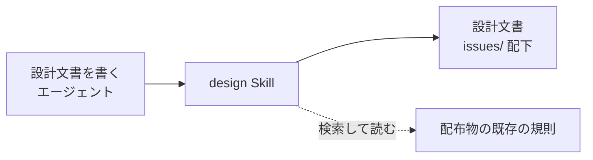
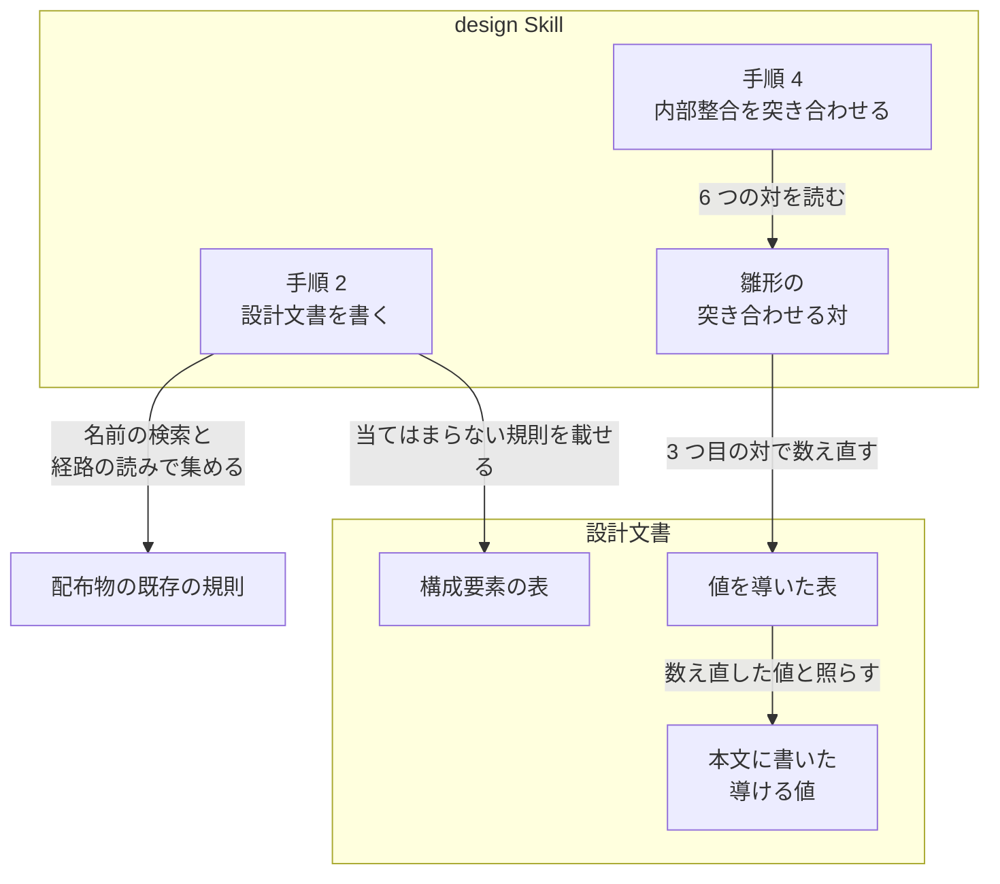
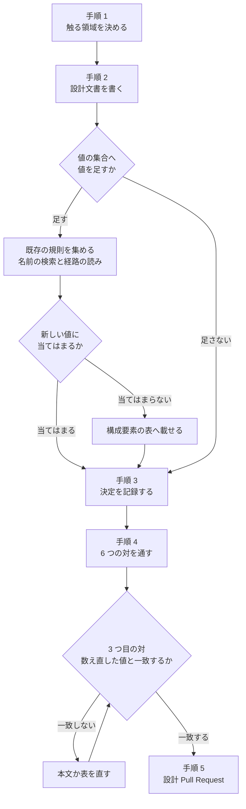

# #526: 設計文書で、表から導ける値を数え直す

要求と受け入れ条件は [issue-526-requirements.md](issue-526-requirements.md) にある。この文書は
「どう作るか」だけを扱う。

## 機能一覧

| # | 機能 | 誰が使うか |
| --- | --- | --- |
| F1 | 本文に書いた導ける値を、表を数え直した値と照らす | 設計文書を書くエージェント |
| F2 | 表を直したときに、その表から導いた記述を数え直す | 設計文書を書くエージェントと、レビューの指摘を直すエージェント |
| F3 | 値の集合へ値を足す設計で、その集合を前提にした既存の規則を集めて判定する | 設計文書を書くエージェント |

## 構成要素

| 要素 | 責務 | 変え方 |
| --- | --- | --- |
| 雛形の「進む前に突き合わせる対」 | 同じ文書の中だけで確かめる対を並べる（F1・F2） | 3 つ目の対を広げ、表を直したときの段落を足す |
| `SKILL.md` の手順 2（設計文書を書く） | 設計文書の書き方の入口（F3） | 値の集合へ値を足す設計の段落を足す |
| `SKILL.md` の手順 4（内部整合を突き合わせる） | 対を通すことを求める | 変えない。対の数は 6 のまま |

### 文脈



**配布物の既存の規則は、この変更では変えない。** 手順 2 が読みに行く先であって、変える対象は
設計のたびに決まる。

### 構成要素の関係



### 置き場所

```text
plugins/ndf/skills/design/
├── SKILL.md                    # 手順 2 に段落を足す
└── references/
    └── design-template.md      # 3 つ目の対を広げ、段落を足す
```

## 変更後の本文

**実装はこの節の本文をそのまま置く。** 置く位置も書く。

### 雛形の 3 つ目の対（行を差し替える）

変更前:

```markdown
| 件数の記述 ↔ 表の行数 | 「次の N か所」と書いた直下の表が N 行あるか |
```

変更後:

```markdown
| 導ける値の記述 ↔ その値を導いた表 | 本文に書いた件数・最大と最小・「すべて」が、表を数え直した値と一致するか。直下の表に限らない |
```

### 雛形の対の節に足す段落

「**確かめた結果は残さない。**」の段落の直後に置く。

```markdown
**3 つ目の対は、書いたときの値ではなく数え直した値で照らす。** 「最も多い」「N 件」
「すべて」は表を数えれば決まるが、書いた側が数えていなければ自分では誤りに気づけない。
値を導いた表が別の節にあっても、分割した別のファイルにあっても対象にする。

**表を直したときは、その表から導いた記述を数え直す。** レビューの指摘を直すときも同じである。
表だけを直すと、本文の値が古いまま残る。
```

### `SKILL.md` の手順 2 に足す段落

「**タスクを機械的に導けるだけの情報を書く。**」の段落の直後に置く。

```markdown
**値の集合へ値を足す設計では、その集合を前提にした既存の規則を集め、新しい値に当てはまるかを
1 つずつ判定する。** モード・出力の形・種類のような集合へ値を足すと、それまでの値だけを想定して
書かれた規則が、新しい値に当てはまらないまま残る。規則は 2 つの経路で集める。

- 集合の名前と既存の値の名前で配布物を検索する。値ごとに分岐する規則が集まる
- **新しい値が通る手順を読む。** 値の名前を書かずに、すべての値へ同じように当たる規則は、
  検索に掛からない

**当てはまらない規則は、変える対象として構成要素の表へ載せる。** 当てはまる規則は記録しない。

この判定は文書の外を見るため、手順 4 の突き合わせには含めない。
```

## 処理の流れ

`design` を通すときの流れのうち、この変更が足す分岐を示す。手順 1・3・5 の中身は変えない。



**表を直したときに数え直す（F2）のは、上の「本文か表を直す」から 3 つ目の対へ戻る辺にあたる。**
6 つの対すべてへは戻らない（決定 2）。レビューの指摘で表を直す場合も、同じ辺を通る。

## 決定の記録

### 決定 1: 3 つ目の対を広げ、7 つ目の対を足さない

行数は導ける値の 1 つである。**別の対として足すと、行数を見る対と導ける値を見る対が重なり、
どちらで見るかを読み手が決めることになる。** 広げれば、PR #516 の 2 件（列ごとの数の比較と、
セルの数の合計）が同じ 1 つの対に入る。

対の数も変わらない。対の数は `SKILL.md` の手順 4 と対の節の冒頭の 2 箇所に書かれており、
#493 が 7 つ目の対を足すときにもこの 2 箇所を書き換える。**2 つの変更がどちらも数を 7 に
すると、後にマージした側で数と表の行数が食い違う。** これ自体がこの課題の扱う誤りである。

issue の案にある「執筆の段へ 1 行足す」形は採らない。書いた後に確かめる手順は手順 4 が持って
おり、執筆の段へ置くと内部整合の確かめ方が 2 箇所に分かれる。

### 決定 2: 表を直したときの数え直しを、対の節に書く

手順 4 は「進む前」に 1 度通す手順で、その後に表を直す場面を含まない。PR #516 でも、指摘を
直すのはレビューの往復の中である。**直した時点で数え直すことを対のそばに書けば、手順 4 を
通した後の修正にも掛かる。**

手順 4 を「表を直すたびに通し直す」形にする案は採らない。6 つの対すべてを通し直すことになり、
表に関係しない対まで繰り返す。

### 決定 3: 値の集合へ値を足す規則を同じ変更に入れ、手順 2 に置く

**同じ誤りの形の、文書の外にある版である。** 集合から導いた記述が、集合を変えたときに古いまま
残る。文書の中なら表と本文、文書の外なら値の集合と既存の規則になる。issue も「あわせて」として
同じ本文に挙げている。

**対の表には置かない。** 対は同じ文書の中だけで確かめられるものに限り、外部を要するものは
レビューが拾う、という境界が雛形にある。検索を要する判定を対へ混ぜると、この境界が崩れる。

**集め方を検索だけにしない。** PR #519 で直した 3 件の、直す前の本文を読むと、どれも
`documentation` の名前も形の名前も含まない（コミット 889ad63 の差分の削除行）。

| 規則の場所 | 直す前の本文 | 通る手順 |
| --- | --- | --- |
| `release/SKILL.md` の手順 1 | 文書だけの変更で配布物が動かないことがある | 配布 |
| `document-systems/SKILL.md` | 提出先の宣言が決める | システムの選び方 |
| `document-systems/references/system-repo.md` | 取り込みは要らない | 取り込み |

すべての値へ同じように当たる規則として書かれていたため、名前では集まらない。3 件とも、
`documentation` の変更が通る手順の上にある。

**手順 2 に置くのは、判定の結果が構成要素の表へ入るためである。** 表に載れば、手順 4 の
1 つ目の対（構成要素の表 ↔ 処理の流れの図）が、その規則を図にも現れるかで見る。

別の issue に分ける案は採らない。どちらも `design` の手順を触り、分けると同じ誤りの直し方が
2 つの変更に割れる。`implementation-plan` に置く案も採らない。変える対象は設計の構成要素で
決まり、計画の時点では構成要素の表がすでに固まっている。

### 決定 4: 機械で確かめる検査を作らない

**`design` は配布する Skill であり、設計文書は利用者のリポジトリで書かれる。** このリポジトリに
検査を置いても、利用者の設計文書には掛からない。

このリポジトリの中でも掛からない。設計文書を置く `issues/` は、既存の文書の検査のどちらにも
入っていない。

| 検査 | `issues/` の扱い |
| --- | --- |
| リンクの検査（`check-markdown-links.py`） | 走査するのは `README.md` / `AGENTS.md` / `CLAUDE.md` / `KIRO.md` / `docs/` / `plugins/` だけ |
| 分量の検査（`check-doc-line-limit.py`） | 記録の置き場所として除く |

**導ける値の記述は形が決まらない。** 「最も多い」「N 件」「すべて」「どれも」があり、どの表の
どの列から導いたかは本文の意味を読まないと決まらない。周囲の固定の語で位置を決める
`check-doc-staleness.py` の方式が使えない。「次の N か所」と直下の表の行数だけを見る検査なら
書けるが、PR #516 の 2 件はどちらもその形ではない。

## テスト設計

**変更は Skill の本文だけで、振る舞いを持つコードを含まない。** 自動テストは足さず、差分の本文を
読んで判定する。

| 受け入れ条件 | 何で確かめるか |
| --- | --- |
| 1: 導ける値と表を数え直した値を照らす対がある | 雛形の対の表の 3 行目を読む |
| 2: 行数に加えてセルの数・最大と最小・「すべて」を含む | 同じ行の「何を見るか」を読む |
| 3: 別の節・別のファイルの表も対象にする | 3 行目の「直下の表に限らない」と、足した段落の 1 つ目を読む |
| 4: 表を直したときの数え直しが対の節にある | 足した段落の 2 つ目を読む |
| 5: 対の数を書いた 2 箇所が表の行数と一致する | `SKILL.md` の手順 4 と対の節の冒頭の数を、表の行を数えた値と照らす |
| 6: 手順 2 に値の集合へ値を足す設計の手順がある | `SKILL.md` の手順 2 を読む |
| 7: 集め方が名前の検索と、新しい値が通る手順を読むことの 2 つである | 手順 2 に足した箇条書きを読む |
| 8: 手順 2 の規則が対の表にも手順 4 にも無い | 対の表と手順 4 に、規則を集める記述が無いことを読む |
| 9: 4 つの検査が終了コード 0 で終わる | 仕様の「検証手段」の 4 コマンドを実行する |

## 未確認のまま残ること

| 項目 | 内容 |
| --- | --- |
| 効果 | 数え直しの指摘がレビューから減るかは、この変更の後の設計 Pull Request で見るまで分からない |
| 経路の読みで集めきれるか | PR #519 の 3 件は名前では集まらず、新しい値が通る手順の上にあった（決定 3）。通る手順をどこまで読めば足りるかの基準は置いていない |

## #493 への申し送り

#493 は同じ対の表へ 7 つ目の対を足す。**この変更には取り込まない**が、同じ箇所を触るため、
重なる点を残す（2026-09-13 の `develop`）。

| 観点 | この変更 | #493 |
| --- | --- | --- |
| 対の表 | 3 行目を差し替える | 6 行目の後へ 1 行足す |
| 対の数（`SKILL.md` の手順 4 と対の節の冒頭） | 変えない（6 のまま） | 7 へ書き換える |
| 対の節の段落 | 「確かめた結果は残さない。」の直後へ 2 段落足す | #493 の本文は段落の変更を挙げていない |

**数を書き換えるのは #493 だけになる。** どちらが先にマージしても、数は後から #493 が 7 にする
1 回で揃う。#493 を実装するときは、この変更で広げた 3 つ目の対に照らして、数と表の行数を
数え直す。
