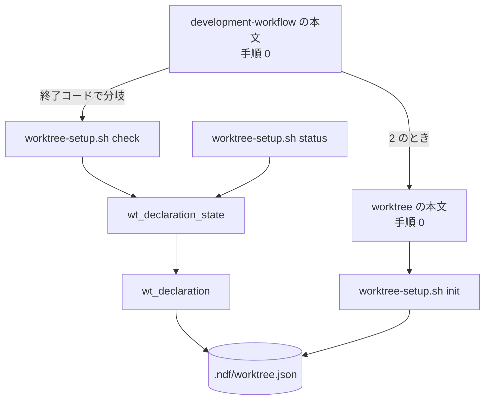
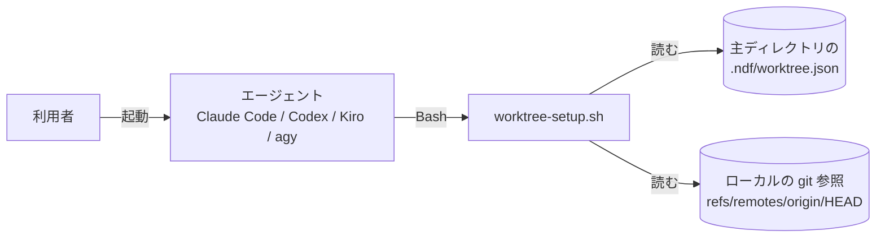
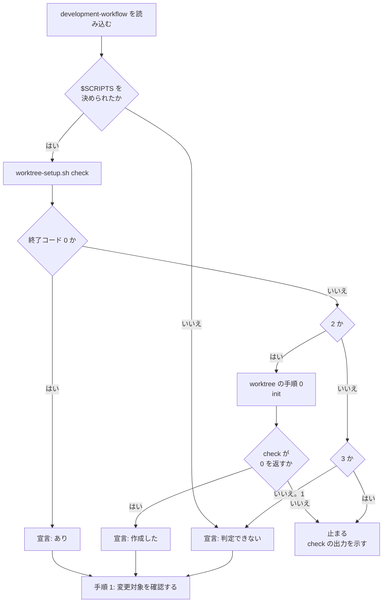

# #527: `development-workflow` の起動時に作業ツリーの宣言を確かめる — 設計

要求と受け入れ条件は [issue-527-requirements.md](issue-527-requirements.md) にある。この文書は
「どう作るか」だけを扱う。

## 機能一覧

| # | 機能 | 誰が使うか |
| --- | --- | --- |
| 1 | 宣言の状態を終了コードで返す（`worktree-setup.sh check`） | `development-workflow` の本文の手順、利用者 |
| 2 | 起動時に宣言を確かめ、無ければ `worktree` の手順 0 を通してから進む | `development-workflow` を読み込んだエージェント |
| 3 | 判定結果の出力へ宣言の状態を載せる | 呼び出し側（親のエージェント・利用者） |

## 決定の記録

### 決定 1: 確認は `development-workflow` の本文の「判定の手順」の先頭に置く

`light` と `operation` は作業場所の用意を飛ばしうるため、`worktree` の工程に置くと確認そのものが
通らない。`guard.allow_paths` が宣言に依存し、その例外に当たるかの判断もモード判定の後で行う
ため、**モード判定より前**でなければ例外の判定が既定値のまま進む。要求と受け入れ条件は
`issues/` に書き、宣言が無くても主ディレクトリで書けるが、Skill を読み込んだ時点で最初に
通す位置にすれば、工程の順序の議論と独立に「起動したら最初に」と言える。

作業場所の用意の行に書く案は、`light` / `operation` の例外で通らないため採らなかった。

### 決定 2: 拒否しない。手順の前提条件として置き、状態を判定結果の出力へ載せる

**止める引き金が、起動の時点に無い。** 機械で止める手段は tool 実行前の hook だけで、これは
次に何かのコマンドが走ったときにしか働かない。「先へ進む前に」を満たすには、起動した直後に
読む本文の手順が要る。

**案内だけで v10.5.0 を再現させないために、判定結果の出力へ `宣言:` の行を足す。** あのときは
工程を飛ばしたことが配布まで表に出なかった。出力に行があれば、呼び出し側（親のエージェント・
利用者）が「行が無い」「判定できない」を読める。

**読めない宣言だけは先へ進まない。** 上書きすると書き加えた内容が消え、進めると運用が無効の
まま進む。どちらを選んでも取り返しにくいため、利用者の判断を待つ。**これは関門ではない。**
承認を求めるのではなく、直すまで判定の入力が揃わないことを示す。

#424 の「拒否しない」は理由（記録の遅れ）がこの件に当たらず、承認の印の fail-closed は理由
（取り消せないマージ）がこの件に当たらない。どちらの前例も流用せず、上の 2 点で決めた。

### 決定 3: 判定の実体は `wt_declaration_state` の 1 関数に置く

本文は `check` の終了コードで分岐するだけで、ファイルの存在を自分で調べない。`status` も同じ
関数を呼ぶよう寄せる。**`status` の分岐を残したまま `check` を足すと、状態を分ける基準が
2 か所になる。**

本文に `[ -f .ndf/worktree.json ]` を書く案は、壊れた JSON と未対応の版を「あり」と読むため
採らなかった。`status` の終了コードを変える案は、既存の呼び出し側とテストの期待
（常に 0）を変えるため採らなかった。

### 決定 4: `workflow-guard.sh` と frontmatter の `hooks` には置かない

理由は 3 つある。

| 理由 | 根拠 |
| --- | --- |
| 現在の環境で発火していない可能性が高い | #565。置いても受け入れ条件 5 を実機で確かめられない |
| Claude Code でしか働かない | `hooks` は Agent Skills 仕様の 6 項目に無い。Codex / Kiro / agy の本文には同じ手順が要る |
| 起動の時点に引き金が無い | `PreToolUse` の `Bash` は、後続のコマンドを止めることしかできない（決定 2） |

**#565 が直った後に機械の見張りを足すときは、`check` を呼ぶ。** 基準を書き写さない。足すか
どうかはこの変更では決めない。

### 決定 5: 宣言を作る手は `worktree` の手順 0 のまま、`check` は読むだけにする

`check` に作成まで持たせると、宣言を作る入口が 2 つになる。`init` の「上書きしない」と
`--force` の扱いを 2 か所で揃え続けることになる。

### 決定 6: 判定できないときは止めない

`jq` が無い環境では、宣言があっても作業ツリー運用のスクリプトがすべて動かない。止めても
直す手段が本文の中に無く、工程だけが進まなくなる。**判定できないことを出力へ残し、
呼び出し側が読める形にする。** 測れなかったことを「あり」とも「なし」とも書かない。

### 決定 7: 宣言を作る前に承認を求めない

**関門は 2 つで、増やさない**（`development-workflow` の「人手の承認を求める関門」）。宣言の
作成は主ディレクトリの 1 ファイルで、コミットするまでは消せば戻る。`development-workflow` を
起動したこと自体を、このリポジトリで作業ツリー運用を使う意思表示として扱う。

### 決定 8: `base_branch` / `production_branch` は案内だけにし、推測で書かない

どちらも既定ブランチへ落ちると、issue の「直さないと何が起きるか」の 2 と 3 が残る。しかし
正しい値はリポジトリの運用が決めるもので、スクリプトからは分からない。**`check` の 2 行目と
3 行目、および出力の `宣言: 作成した（…）` が、既定ブランチへ落ちていることを示す。** 書き
加えるかは利用者が決める。

## 構成要素

| 要素 | 変更 | 責務 |
| --- | --- | --- |
| `wt_declaration_state`（`plugins/ndf/scripts/lib/worktree-common.sh`） | 新設 | **宣言の状態を分ける唯一の場所。** `present` / `absent` / `unreadable` を出力する。読むのは既存の `wt_declaration` |
| `worktree-setup.sh check` | 新設 | 状態を終了コードへ写し、人が読む 3 行を出す。読み取り専用 |
| `worktree-setup.sh status` | 変更 | 「宣言ファイル:」の行の分岐を `wt_declaration_state` へ置き換える。出力は変えない |
| `development-workflow/SKILL.md` | 変更 | 「判定の手順」の先頭に手順 0 を置く。「この文書が受け取る値」の表と、出力の `宣言:` の行を足す |
| `worktree/SKILL.md` | 変更 | 手順 0 の末尾で `check` を案内する |
| `worktree/tests/test_setup.py` | 変更 | `check` の終了コードと、ファイルを作らないことを検査する |
| `development-workflow/tests/test_declaration_check.py` | 新設 | 本文の手順 0 の位置・分岐・拒否しない理由と、判定の実体が 1 か所であることを検査する |

**次の 5 つは変えない。** いずれも宣言の無いリポジトリで何もしない性質か、#565 の対象を持つ。

| 変えない要素 | 理由 |
| --- | --- |
| `hooks/claude.json` / `hooks/codex.json` | 起動していない会話の振る舞いを変えない |
| `worktree-guard.sh` | 同上 |
| `worktree-session.sh` | 同上 |
| `workflow-guard.sh` | 決定 4 |
| `development-workflow` の frontmatter | 決定 4。#565 の対象 |



**図に含めないものは 2 種類ある。** 上の表の変えない 5 つと、テストの 2 ファイルである。テストは検査する側で、実行時の依存を持たない。

## システムの文脈と触るファイル

### 配置

**動く場所は利用者の手元の 1 か所だけである。** `check` は主ディレクトリのファイルと
ローカルの git の参照だけを読み、origin へ問い合わせない。



### 触るファイル

```text
plugins/ndf/
├── scripts/
│   ├── lib/worktree-common.sh          # wt_declaration_state を足す
│   └── worktree-setup.sh               # check を足し、status の分岐を関数へ寄せる
└── skills/
    ├── development-workflow/
    │   ├── SKILL.md                    # 手順 0・受け取る値・出力の行
    │   └── tests/test_declaration_check.py   # 新設
    └── worktree/
        ├── SKILL.md                    # 手順 0 から check を案内する
        └── tests/test_setup.py         # check の検査を足す
```

## 入出力の契約

### `wt_declaration_state <主ディレクトリ>`

| 項目 | 内容 |
| --- | --- |
| 入力 | 主ディレクトリの絶対パス（必須） |
| 出力 | `present` / `absent` / `unreadable` のいずれか 1 語を標準出力へ 1 行 |
| 判定 | `wt_declaration` が 0 → `present`。1 のうち `.ndf/worktree.json` が存在しない → `absent`。存在する → `unreadable` |
| 失敗の形 | 引数が空なら何も出さず 1 を返す |
| 前提 | `jq` があること。無いと読める宣言も `unreadable` になるため、**呼び出し側が先に `jq` を確かめる**（`worktree-setup.sh` は冒頭で確かめている） |

### `worktree-setup.sh check`

| 項目 | 内容 |
| --- | --- |
| 入力 | 引数なし。現在地から主ディレクトリを解決する（作業ツリーの中からでも同じ主ディレクトリを見る） |
| 副作用 | 無い。ファイルを作らず、通信しない |
| 互換性 | `init` / `status` の出力と終了コードは変えない |

終了コードは状態ごとに分ける。**本文の手順はこの値だけで分岐する。**

| 終了コード | 状態 | 標準出力 |
| --- | --- | --- |
| 0 | あり | 3 行（下の例） |
| 1 | 判定できない（git・jq が無い / リポジトリの外 / 知らない引数） | 無し。理由は標準エラー（既存の冒頭の検査と同じ） |
| 2 | なし | 3 行 |
| 3 | 読めない | 3 行 |

**1 を「判定できない」に充てるのは、このスクリプトの既存の規約（1 = 処理できなかった）に
合わせるためである。** 冒頭の `git` / `jq` / リポジトリの検査は、副コマンドへ分岐する前に
1 で終わる。

標準出力は人が読む 3 行である。本文はこれを解析しない。

```text
宣言ファイル: なし（.ndf/worktree.json）
開発の起点: main（未宣言。既定ブランチ）
本番のチャネル: main（未宣言。既定ブランチ）
```

| 行 | 値の取り方 |
| --- | --- |
| 宣言ファイル | `あり` / `なし` / `読めません` |
| 開発の起点 | 宣言の `base_branch` が文字列なら `<値>（宣言）`。無ければ `wt_default_branch` の値に `（未宣言。既定ブランチ）` |
| 本番のチャネル | `production_branch` について同じ。既定ブランチも取れなければ `不明（origin/HEAD が未設定）` |

**2 行目と 3 行目は、宣言に書かれた名前の実在を確かめない。** 確かめる `wt_branch_exists` は
origin へ問い合わせることがあり、起動のたびに通信が走る。実在の確認は、その名前を使う時点の
`wt_base_branch` / `wt_production_branch` が既に持つ。

### `development-workflow` の本文の手順 0

「判定の手順」の見出しの直下、`### 1. 変更対象を確認する` の前に置く。

```bash
# 「$SCRIPTS を決める」の手順でパスを決めてから実行する。
bash "$SCRIPTS/worktree-setup.sh" check; echo "exit=$?"
```

| 終了コード | 本文の指示 | 判定結果の出力の `宣言:` の行 |
| --- | --- | --- |
| 0 | そのまま手順 1 へ進む | `宣言: あり` |
| 2 | `worktree` の「0. 宣言ファイルを用意する」を通し、`check` が 0 を返してから手順 1 へ進む | `宣言: 作成した（起点 <名前> / 本番 <名前>。未宣言なら既定ブランチ）` |
| 3 | **先へ進まない。** `init --force` を実行せず、`check` の出力を示して利用者に直してもらう | 出力しない（判定まで進まないため） |
| 1、または `$SCRIPTS` を決められない | 止めずに手順 1 へ進む | `宣言: 判定できない（<理由>）` |

判定結果の出力の例は次の形になる。

```text
mode: standard
根拠: 注文確定の振る舞いを変更する。公開 API とスキーマは変えない
宣言: あり
必須工程: worktree → requirements-design → ...
```

## 処理の流れ



**`init` の後にもう一度 `check` を通すのは、`init` が読めない宣言を「既にあります」と報告して
0 で終わるためである**（実測。#573）。`init` の終了コードだけを見ると、作れなかったことが
表に出ない。

**起動していない会話はこの図に入らない。** 宣言の無いリポジトリで動くのは `worktree-guard.sh` と
`worktree-session.sh` だけで、どちらも変更前と同じく `wt_declaration` の 1 で何もせずに終わる。

## 非機能の実現方式

| 大項目 | 実現方式 | 確かめ方 |
| --- | --- | --- |
| 性能・拡張性 | `check` は `wt_declaration`（ファイル読み取りと `jq`）と `git symbolic-ref` だけを使い、`ls-remote` を呼ばない | テストで origin を持たない一時リポジトリに対して実行し、終了コードが期待どおりであること |
| 運用・保守性 | 状態を判定結果の出力の `宣言:` の行へ残す | 実機の確認で出力に行が載ること（受け入れ条件 5・6） |
| システム環境 | 判定を本文の手順とスクリプトに置き、ランタイムごとの hook の対応に依存しない | 本文は 4 ランタイムで同じファイル。`bash scripts/validate-runtime-plugins.sh` が配布物の一致を見る |

## テスト設計

| 受け入れ条件 | 何で確かめるか |
| --- | --- |
| 1（なし → 2、作らない） | `test_setup.py`: 一時リポジトリで `check` を実行し、終了コード 2 と `.ndf/` が無いことを見る |
| 2（読めない 3 / あり 0 / 外 1） | `test_setup.py`: 壊れた JSON・`version: 99`・`init` の直後・`tmp_path`（リポジトリ外）の 4 通り |
| 3（`status` の出力が一致） | 既存の `test_status_reports_*` が通ること。加えて `worktree-setup.sh` の `do_status` が `wt_declaration_state` を呼ぶことを本文の走査で見る |
| 4（手順 0 の位置と分岐） | `test_declaration_check.py`: 本文の「判定の手順」で、`check` を含むブロックが `### 1.` より前にあり、終了コード 2 の行が `worktree` の手順 0 を指す |
| 5（なし → 作られる、実機） | `claude -p --plugin-dir <作業ツリー>/plugins/ndf` を宣言の無い一時リポジトリで実行する。実行後に `.ndf/worktree.json` があり、出力に `宣言: 作成した` がある。記録を実装 PR に貼る |
| 6（あり → 変わらない、実機） | 同じ手順を宣言のあるリポジトリで実行し、`cksum` が前後で一致し、出力に `宣言: あり` がある |
| 7（起動していない会話） | 既存の `worktree` の hook のテストが通ること。加えて宣言の無い一時リポジトリへ 2 つの hook の入力を流し、出力が空で終了コード 0 |
| 8（hook を触らない） | `git diff --name-only origin/develop...HEAD` に対象のパスが無いことを `quality-gates` の証跡にする |
| 9（拒否しない理由） | `test_declaration_check.py`: 本文に「拒否しない」と #565 への言及がある |
| 10（実体が 1 か所） | `test_declaration_check.py`: `worktree.json` の文字列が `development-workflow/SKILL.md` の手順 0 と `workflow-guard.sh` に現れない。`unreadable` を返す分岐が `worktree-common.sh` だけにある |
| 11（読めない → 止まる） | `test_declaration_check.py`: 手順 0 の表の終了コード 3 の行に「進まない」があり、`--force` を指示しない |
| 12（判定できない → 止めない） | `test_declaration_check.py`: 終了コード 1 の行に「判定できない」が出力へ載ると書かれている |

## 未確認のまま残ること

| 項目 | 内容 |
| --- | --- |
| Codex / Kiro / agy で手順 0 が守られるか | 本文は同じだが、実機で確かめるのは Claude Code だけを予定する。他の 3 つを通すかは実装で決める |
| 実機の確認の再現性 | エージェントが本文に従うかは確率的である。条件 5・6 は 1 回通した記録で判定し、繰り返しの回数は置かない |
| #565 の修正との重なり | #565 が frontmatter の `hooks` を `hooks/*.json` へ移すなら、この変更は同じ `SKILL.md` の別の箇所（本文の「判定の手順」）を触る。文字の衝突は起きにくいが、どちらが先にマージされるかで再基点化が要る |
| 手順 0 の位置と `要求と受け入れ条件 → モード判定` の順序の記述 | 「判定する単位」の節が書く工程の順序へ手順 0 を書き足すかは、本文の走査テストと合わせて実装で決める |
