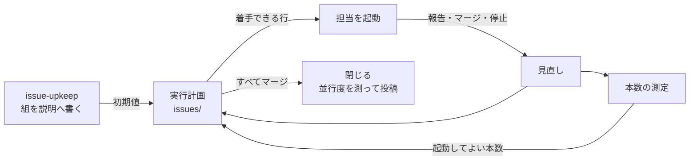
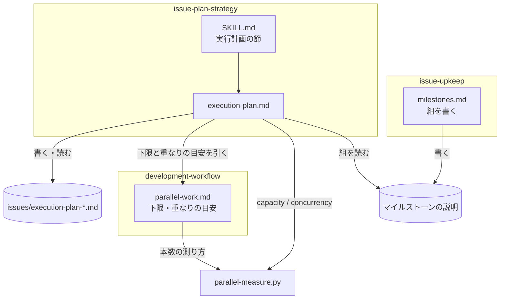
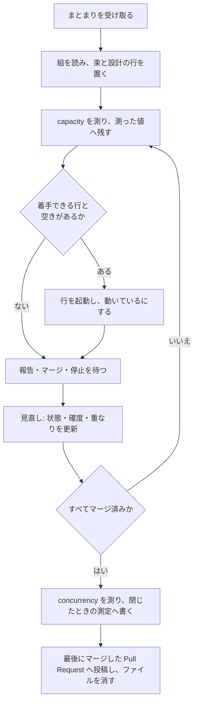
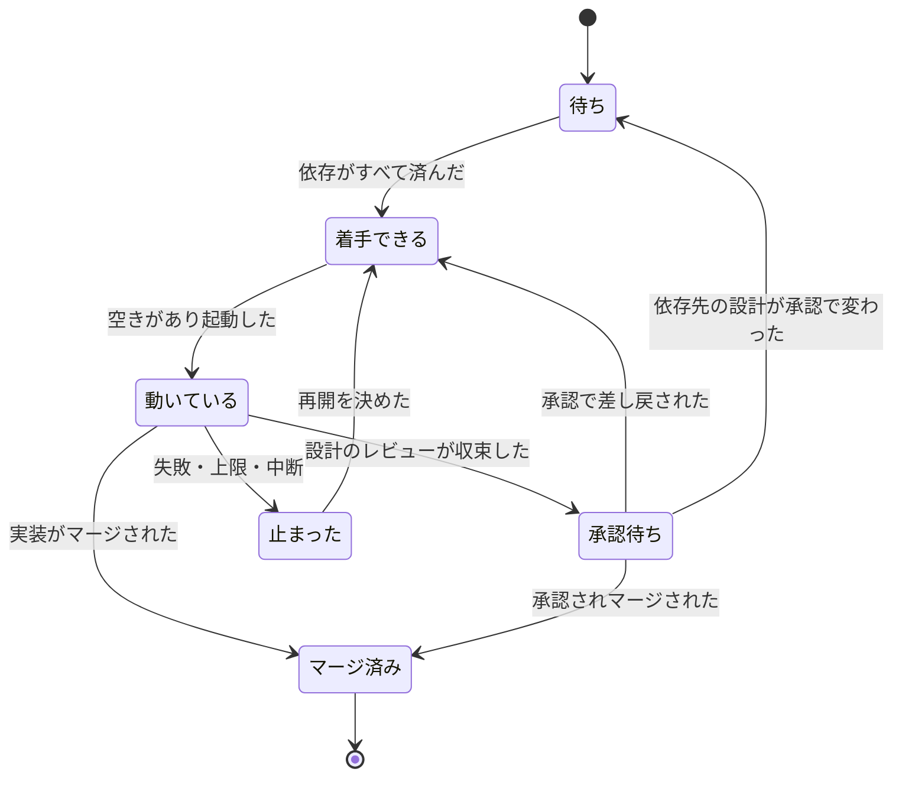
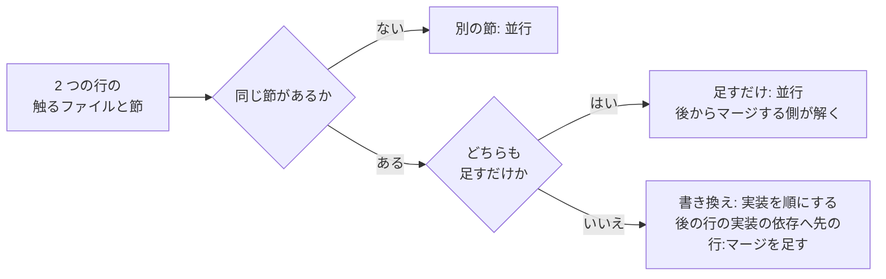

# #540 / #541 / #621: 並列の実行計画を初めに作り、メモリの見る本数の中で重なりを許して進める

要求と受け入れ条件は [issue-540-541-621-requirements.md](issue-540-541-621-requirements.md) にある。この文書は「どう作るか」だけを扱う。
実行計画の形・マイルストーンの組の形・測定のコマンドの入出力・下限の文言は [契約の文書](issue-540-541-621-design-contracts.md) が持つ。

**進行側は、まとまりを渡されたら最初の担当を起動する前に実行計画を書き、工程の終わりごとに読み直す。**
読み直すたびに本数を測り、依存が済んで空きがある行を起動する。



## 機能一覧

| # | 機能 | 誰が使うか |
| --- | --- | --- |
| F1 | まとまりを渡されたとき、束・工程ごとの依存・触るファイルと節を実行計画に書く | 進行側 |
| F2 | 見直しのたびに、依存が済んで本数に空きがある行を起動する | 進行側 |
| F3 | 触る箇所の重なりを 3 つの区分で判定し、並行するか順にするかを決める | 進行側・設計を書く担当 |
| F4 | 競合を後からマージする側が解き、解いた後の差分でレビューを収束させる | 担当 |
| F5 | ホストのメモリと OOM Killer の発生から、起動してよい本数を出す | 進行側 |
| F6 | Pull Request の一覧から、並行度と最大同時本数を出す | 進行側・振り返りを書く人 |
| F7 | マイルストーンへ課題を入れるとき、組（触る場所の見込みと依存）を説明へ書く | `issue-upkeep` を回す人 |

## 決定の記録

### 決定 1: 実装を 3 本に分け、測定と組を並行し、実行計画を測定の後に入れる

**本数の測定（#621）と組（#541）は触るファイルが重ならないため並行する。** 実行計画（#540）は
測定のコマンドを手順から呼び、`parallel-work.md` の「守る下限」の表で測定と隣り合う行を書き換えるため、
測定のマージの後に実装する。この分け方は、決定 4 の重なりの目安をこの設計自身に当てた結果である。

| 順 | Pull Request | 課題 | 触るファイル | 実装の依存 | 受け入れ条件 |
| ---: | --- | --- | --- | --- | --- |
| 1 | 本数の測定 | #621 | 測定のコマンド・そのテスト・`parallel-work.md` の下限 6 と振り分けの行 6・`test_parallel_work_bounds.py`（新設） | なし | AC30〜AC36、AC40、AC42 |
| 1 | マイルストーンの組 | #541 | `issue-upkeep/references/milestones.md`・`test_issue_upkeep_layout.py` | なし | AC20〜AC22、AC24 |
| 2 | 実行計画 | #540 | `parallel-work.md` の下限 4・5 と重なりの目安・`issue-plan-strategy`・`issues/README.md`・`test_approval_gates.py` の下限の組・`test_parallel_work_bounds.py` へのテストの追加・`issue-plan-strategy` のテスト | 本数の測定のマージ | AC1〜AC14、AC23、AC37、AC41 |

**組の形は契約の文書が持つ。** 実行計画は組を読む側、`milestones.md` は書く側で、両方が同じ形を写す。
形を先に決めたため、書く側のマージを待たずに読む側を実装できる。AC50〜AC52 は 3 本がそろった後の配布と
リリース後テストで確かめる。

1 本にまとめると、スクリプトとテストと 3 つの文書の差分が同じレビューに載る。実行計画を先に入れると、
手順が呼ぶコマンドがまだ無い。

### 決定 2: 依存を工程の対で書き、実装の順序の依存は次の設計を止めない

**依存は「B のどの工程が、A のどの時点を入力にするか」で書く。** 時点は 2 つだけで、`収束`
（Pull Request のレビューが収束した）と `マージ` である。B の設計が A の決定を読むなら `A-設計:収束`、
B の実装が A の実装を前提にするなら `A-実装:マージ` を B の実装の行に書く。**B の設計の行には、B の実装の
依存を書かない。**

v10.11.0 の後半 3 回は、この 2 つを区別しなかったために設計が実装のマージを待った（#540 のコメント）。
設計の依存に `マージ` ではなく `収束` を採るのは、承認の関門をまとめて通すためである。承認で A の設計が
変わったら、見直しで承認を待っている B の設計の行を `待ち` に戻す。

「長い待ちに入ったら次の設計に着手する」を下限に足す形は採らない。工程を窓へ出す運転（G3）では、
窓の中の待ちは進行側から見えず、契機として観測できない。依存と本数だけで着手を決めれば、待ちを
知らなくても次の設計が起動される。

### 決定 3: 競合は後からマージする側が解き、解いた後の head でレビューを収束させる

**下限 5 を「同じファイルを触るものを並行させない」から「競合を解いた差分を、レビューを通さずに
マージしない」へ書き換える。** 元の下限が守ろうとしたのは、レビューした差分と入る差分が食い違わない
ことであり、並行しないことはその手段だった。手段を条件へ置き換えれば、並行しても守るものは残る。

**解くのは、後からマージする Pull Request である。** 先にマージした側は、解く時点で既に閉じている。
解いた後は同じ Pull Request で実装レビューのラウンドを回し、収束してからマージする。`cross-review` は
Pull Request の head を読むため、新しい手順は要らない。

競合を先に避けるために、並行する組ごとにレビューの観点で分担を決める形（`issue-plan-strategy` の
Step 5 の現行の記述）は採らない。分担を決めても、同じ節を書き換えれば競合は起きる。

### 決定 4: 重なりを節の単位で 3 つに分け、書き換えの重なりだけ実装を順にする

**区分は「別の節」「同じ節に足すだけ」「同じ節を書き換える・移す・消す」の 3 つである。** 前の 2 つは
並行し、3 つ目は実装だけを順にする。設計文書は束ごとに別のファイルへ書くため、**設計の工程どうしは
どの区分でも並行する。**

節の単位を採るのは、設計の時点で分かる最も細かい単位だからである。行の単位は実装の後にしか
分からず、ファイルの単位ではマイルストーン 04 の #643 と #646 のように、別の関数を触る組まで順になる。
「足すだけ」を並行へ入れるのは、git の競合が起きても解き方が両方を残すことに決まっているためで、
利用者の示した「多少の重なりは並行し、後で直す」に当たる。書き換えの重なりは、解くときにどちらの
意図を採るかの判断が要り、決定 3 のレビューで初めて食い違いが見つかる。

目安をファイルの数や行の数で置く形は採らない。数は設計の時点で決まらず、1 行の書き換えでも意図が
ぶつかる。

### 決定 5: 実行計画は主ディレクトリの `issues/` に 1 ファイルで持ち、開いている間はコミットしない

**置き場所は `issues/execution-plan-<キー>.md` である。** キーはマイルストーンの名前の 2 桁の連番、
マイルストーンが無いときは `issue-<束ねた課題の最小の番号>` にする。主ディレクトリの `issues/` は
作業ツリーの外で編集してよい場所で（`AGENTS.md`）、進行側が落ちてもディスクに残る。

**開いている間はコミットしない。** 見直しのたびに Pull Request を通すと、計画の更新がマージを待ち、
実行計画が進み具合に遅れる。**閉じるときに、測定を書き足した全文をまとまりで最後にマージした
Pull Request へコメントとして投稿し、ファイルを消す。** 振り返りはそのコメントを読む。

採らなかった置き場所は 3 つある。マイルストーンの説明は、説明の中の節だけを差し替える仕組みが要り、
マイルストーンを使わないリポジトリで置き場所が別になる。追跡用の issue は、`issue-upkeep` の段 1 が
マイルストーンの付いていない課題として拾い、除く規則が増える。`.git/ndf/` は作業ツリーの台帳の前例が
あるが、人がたどり着かない。

**既存の `parallel-batch-<連番>/` の規約は置き換える。** 最後に使われたのは 2026-09-02 のバッチ 08 で、
全体指示書を主ディレクトリへコミットする運用は `develop` への直接のコミットの禁止と両立しない。

### 決定 6: 実行計画の行は Pull Request の単位にし、設計が収束したら実装の行を足す

**束 1 つにつき、最初は設計の行だけを置く。** 実装を何本に分けるかは設計文書の決定が持つため、
着手の時点では書けない。設計のレビューが収束した見直しで、設計文書の分け方の表から実装の行を足し、
触るファイルと節の確度を `見込み` から `確定` へ変える。

行の状態は `待ち` / `着手できる` / `動いている` / `承認待ち` / `止まった` / `マージ済み` の 6 つである。
**本数に数えるのは `動いている` だけである。** 承認待ちの担当は報告を返して終わっており、CLI も
テストも動かしていない。

課題の単位で行を持つ形は採らない。1 つの課題が設計と実装で別の Pull Request になり、依存は
Pull Request どうしの間で起きる。

### 決定 7: 本数は空きメモリから導き、スワップと OOM Killer で下げ、上限で抑える

**起動してよい本数は `min(上限, ⌊(空きメモリ − 予備) ÷ 1 本の見込み⌋)` である。** スワップの空きが
全体の 25% を下回れば 1 減らし、OOM Killer の回数が実行計画に控えた起点から増えていれば、
いま動いている本数 − 1 以下に抑える。**どの場合も 1 を下回らない。** 0 本では進行が止まり、
逐次で進めた過去 11 版で本体は落ちていない。

| 値 | 初期値 | 根拠 |
| --- | ---: | --- |
| 予備 | 2048 MiB | 進行側の claude 本体（約 470MiB）と、同じ VM に常駐する他のプロセスの揺れ |
| 1 本の見込み | 2048 MiB | 5〜6 本のとき cgroup の最大使用量が 7.4GiB（#621）。1 本あたり約 1.2GiB に、テストとコンテナの山を足した |
| 上限 | 3 | 5〜6 本で 2 回落ち、3 本では落ちなかった（#621）。収束レビューが共有する CLI も同じ上限で抑える |
| スワップの閾値 | 25% | 2026-09-17 の値（空き 9.5GiB・スワップの空き 15%）で 2 本になり、進行側が実際に選んだ本数と一致する |

**初期値はコマンドの中の 1 か所だけが持ち、引数で上書きできる。** 実行計画の「測った値」の表が
起動のたびの値と結果を残し、初期値を直す根拠になる。

**空きメモリは `/proc/meminfo` の `MemAvailable` から取る。** このホストの cgroup の上限は `max` で、
落ちる境目を決めるのは VM 全体の空きだからである。cgroup に上限があるホストでは、その残りの方が
小さいことがある。その扱いは未確認として残す（U2）。

### 決定 8: 測定はコマンドが行い、起動の拒否はしない

**測定のコマンドは本数を出すだけで、担当の起動を止めない。** 担当は Agent ツールで起動され、
サブエージェントは本体のプロセスの中で動くため、フックで本数を数える手がかりが無い。数えられないものを
拒否の条件にすると、止める必要の無い起動を止めるか、止めないまま「機械が見ている」と読まれる。

`parallel-work.md` の振り分けの表では、本数の行を「測定は機械、判断は手順」とする。起動の前にメモリを
見る手順だけを文書に書く形は採らない。値の読み方（`MemAvailable` と cgroup の違い、スワップ）を
毎回人が判断することになり、2026-09-13 は落ちた後に初めて見た。

### 決定 9: コンテナを起動する検査を持つ担当は同時に 1 本にする

**runtime-smoke のようにコンテナを起動する担当は、他の担当と並べても 1 本までにする。** コンテナは
担当の cgroup の外（同じ VM の別の cgroup）で動くため、担当の使用量として測れず、1 本の見込みの
外側で空きを食う。2026-09-13 の 2 回目の落ち方では、後片付けの漏れで残ったコンテナが 238 個あった。

後片付けの漏れを並行の前提条件として下限に足す形は採らない。#597 で `trap EXIT` へ直してあり、
漏れが再び起きても空きメモリの低下として決定 7 の測定に現れる。

### 決定 10: マイルストーンの型を宣言せず、束ね直さず、説明に組を書く

**組はマイルストーンの中の単位で、マイルストーンの構造を変えない。** 型を宣言しても組み替えは起きず、
束ね直すと連番が表す着手の順序と既存の説明の意味が動く。#541 の実測では、型に関わらず性質で集めた
束も 0.0% だったため、効くのは組み方ではなく進め方（決定 2〜4）である。

組の触る場所は、段 2A が既に控える修正レイヤーから写す。**同じ修正レイヤーの課題は同じ組、違えば
別の組にする。** 依存は段 2A の「依存する課題の番号」から写す。新しく調べる項目を増やさない。

**組は見込みである。** #541 のコメントのとおり、触るファイルは設計の後にしか確定しない。確定の値は
実行計画が持ち、マイルストーンの説明へ書き戻さない。書き戻すと 2 か所が同じ事実を持つ。

### 決定 11: 組の表が無い既存のマイルストーンは、課題を足すときに足した課題だけを載せる

**既存のマイルストーンの説明を一括で書き直さない。** 課題を足す時点で、その課題の行だけを持つ表を
説明の末尾に作る。表に無い課題は、実行計画を作る進行側が本文から読む。

一括で書き直す形は採らない。段 2A が控えるのは棚卸の対象の課題だけで、マイルストーンの残りの課題の
修正レイヤーは控えに無い。

## 構成要素

| 要素 | 新設 / 変更 | 責務 |
| --- | --- | --- |
| `plugins/ndf/scripts/parallel-measure.py` | 新設 | `capacity`（起動してよい本数）と `concurrency`（並行度）。本数の初期値を持つ唯一の場所 |
| `plugins/ndf/scripts/tests/test_parallel_measure.py` | 新設 | 入力のファイルを差し替えて値を固定する |
| `development-workflow/references/parallel-work.md` の「守る下限」 | 変更 | 下限 4・5・6 の文言と理由（契約の文書の「下限の文言」） |
| 同「機械が見るものと、手順として書くもの」 | 変更 | 行 4・5・6 の見る主体と場所 |
| 同「重なりの目安」 | 新設の節 | 3 つの区分と、区分ごとの並行の可否と待つもの |
| 同「`issue-plan-strategy` との境界」 | 変更 | 実行計画の形と見直しを `issue-plan-strategy` が持つ行 |
| `development-workflow/tests/test_approval_gates.py` の下限の組 | 変更 | 下限 4・5 の文言（F8・F9） |
| `development-workflow/tests/test_parallel_work_bounds.py` | 新設 | メモリの理由・コンテナの 1 本（本数の測定）、重なりの目安・競合の解き方（実行計画が足す） |
| `issue-plan-strategy/SKILL.md` | 変更 | 実行計画の節（入口と参照）、Step 1 の分割計画の列、Step 5 の分担の記述の置き換え |
| `issue-plan-strategy/references/execution-plan.md` | 新設 | 実行計画の置き場所・形・作る手順・見直す時点と手順・閉じる手順 |
| `issue-plan-strategy/tests/test_execution_plan_doc.py` | 新設 | 実行計画の規約の語と表 |
| `issue-upkeep/references/milestones.md` | 変更 | 「組を書く」の節 |
| `issue-upkeep/tests/test_issue_upkeep_layout.py` | 変更 | 組の節のテスト |
| `issues/README.md` | 変更 | `parallel-batch-<連番>/` の段落を実行計画の置き場所へ置き換える |



図には読み書きと呼び出しの関係だけを描く。テストと `issues/README.md` は文書と部品を検査・案内する
もので、呼び出しの関係を持たないため図に含めない。

## 文脈と配置

| 実行の単位 | 動く場所 | 境界 |
| --- | --- | --- |
| 進行側 | 利用者の端末の Claude Code（G3 の親） | 実行計画を書く唯一の主体 |
| 担当 | 進行側と同じプロセスのサブエージェント | 実行計画を書き換えない。報告で状態を返す |
| `parallel-measure.py capacity` | 進行側の Bash | `/proc/meminfo` と cgroup の `memory.events` を読むだけ。ネットワークを使わない |
| `parallel-measure.py concurrency` | 同上 | `gh pr view` で読むだけ。GitHub へ書き込まない |
| 実行計画 | 主ディレクトリの `issues/` | 作業ツリーから絶対パスで読める。コミットしない |

## パッケージ構成

```text
plugins/ndf/
├── scripts/
│   ├── parallel-measure.py                     # 新設
│   └── tests/test_parallel_measure.py          # 新設
└── skills/
    ├── development-workflow/
    │   ├── references/parallel-work.md         # 変更
    │   └── tests/
    │       ├── test_approval_gates.py          # 変更（下限の組）
    │       └── test_parallel_work_bounds.py    # 新設
    ├── issue-plan-strategy/
    │   ├── SKILL.md                            # 変更
    │   ├── references/execution-plan.md        # 新設
    │   └── tests/test_execution_plan_doc.py    # 新設
    └── issue-upkeep/
        ├── references/milestones.md            # 変更
        └── tests/test_issue_upkeep_layout.py   # 変更
issues/README.md                                # 変更
```

## 処理の流れ

### 実行計画の一生



**見直しの契機は 5 つである。**

| # | 契機 |
| ---: | --- |
| 1 | 担当の報告を受け取った（要求が書けた・設計のレビューが収束した・実装のレビューが収束した） |
| 2 | Pull Request がマージされた |
| 3 | 担当が止まった |
| 4 | 測定で OOM Killer の回数が増えていた |
| 5 | 進行側が再起動して、実行計画を読み直した |

### 行の状態



**依存先の設計が承認で変わったときは、承認を待っている設計の行を `待ち` へ戻す。** 読んだ決定が
変わったため、設計を読み直す必要がある。戻したことは見直しの表へ理由とともに残す。

### 重なりの判定

設計のレビューが収束した見直しで、確定した触るファイルと節を他の行と突き合わせる。



## 非機能の実現方式

| 大項目 | 要求 | 実現方式 | 確かめ方 |
| --- | --- | --- | --- |
| 可用性 | 本数を決める値が OOM Killer の発生より前に出る。再起動した後も読み直せる | 起動の前に毎回 `capacity` を測る（決定 7）。実行計画をディスクに置き、`oom_kill` の起点を控える（決定 5） | 実行計画の「測った値」の表に起動ごとの行がある |
| 運用・保守性 | 初期値を直す場所が 1 か所。測った値が残る | 初期値は `parallel-measure.py` の定数だけが持ち、文書は値を写さない（決定 7） | 文書に初期値の数値が無いことをテストで見る |
| セキュリティ | 書き込まない。本文・トークンを出さない | 2 つの副コマンドは読み取りだけを行い、出力は数値と時刻だけにする | 偽の `gh` が受けた引数が `pr view` だけであることをテストで見る |
| システム環境 | Linux で測れる。測れない環境でも止まらない | `/proc/meminfo` が無ければ終了コード 3。`memory.events` が無ければ `oom_kill=unknown` で続ける。3 のときは実行計画に「測れない」と書き、上限の 3 ではなく 1 本で進める | 入力のファイルを消したテスト |

## テスト設計

| 受け入れ条件 | 何で確かめるか |
| --- | --- |
| AC1〜AC4・AC9〜AC11・AC23・AC37・AC41 | `test_execution_plan_doc.py`: `SKILL.md` に実行計画の節と参照があること。`execution-plan.md` に置き場所（`issues/execution-plan-`）・コミットしないこと・行の列（契約の文書の列名すべて）・確度の 2 値・状態の 6 値・測った値の列・見直しの契機 5 つ・見直しの表・閉じる手順（`concurrency`・投稿・削除）・組を読むこととその無いときの作り方・`capacity` を起動の前に実行することがあること。課題 1 件で 1 本のときは書かない、の文があること |
| AC5〜AC8・AC30・AC36 | `test_approval_gates.py` の下限の組（F8・F9 の新しい文言、F10 は変えない）と `test_parallel_work_bounds.py`: 重なりの目安の表に 3 区分と「並行」「待つもの」の列、設計の工程どうしは並行する文、後からマージする側が解く文、解いた後にレビューを収束させる文、下限 6 の理由に「メモリ」と「21GiB」、コンテナを起動する担当は 1 本の文があること |
| AC12・AC13 | 既存の `test_approval_gates.py`（関門の数・下限 F5〜F7・機械の振り分け）がそのまま通ること |
| AC14 | 完了判定で `git diff --stat origin/develop -- plugins/ndf/skills/development-workflow/SKILL.md` が空であること。既存の `test_every_stage_says_which_unit_it_moves_in` が通ること |
| AC20〜AC22・AC24 | `test_issue_upkeep_layout.py`: `milestones.md` に「組を書く」の節、組の表の列（契約の文書）、修正レイヤーと依存する課題の番号から写す文、見込みであり確定は実行計画が持つ文があること。既存の名前と連番のテストがそのまま通ること。段 2A の控える項目の表の行数が変わらないこと |
| AC31・AC33・AC34 | `test_parallel_measure.py`: 空き 9742MiB・スワップ 2047/310MiB の入力で `allowed=2`、スワップが十分な入力で `allowed=3`、空き 3000MiB で `allowed=1`（下限の 1）、`--per-lane-mib 1024 --max 8` の上書きで値が変わること |
| AC32 | 同上: `--meminfo` に存在しないパスを渡すと終了コード 3 で、標準出力に `allowed=` を出さないこと。`--memory-events` が無いときは終了コード 0 で `oom_kill=unknown` |
| AC35 | 同上: `--oom-baseline 1 --running 3` と `oom_kill 2` の入力で `oom_kill_increased=yes` と `allowed=2`、増えていない入力で `oom_kill_increased=no` |
| AC40 | 同上: `--input` に 3 本の区間（重なりあり・端が接するだけ・開いたまま）を渡し、`overlap_minutes`・`concurrency_pct`・`max_open` を固定する。端が接するだけの組は重ならない |
| AC42 | 同上: `PATH` の先頭に置いた偽の `gh` が受けた引数を記録し、`pr view` 以外が無いこと |
| AC50〜AC52 | リリース後テスト。次に複数の束を持つまとまりを進めた進行側が、閉じた実行計画のコメント（見直しの表・測った値・閉じたときの測定）と振り返りを読む |

文書のテストは `uv run --with pytest pytest scripts/tests plugins/ndf -q` で走る。
本数の初期値の数値（2048・25%）は `parallel-work.md` と `execution-plan.md` に現れない。これも
`test_parallel_work_bounds.py` で見る（決定 7 の 1 か所）。

## 他の束との境界

| 束 | 重なりうるもの | 扱い |
| --- | --- | --- |
| G1（#561 #623） | `development-workflow/SKILL.md` の関門の節と、`parallel-work.md` の「承認は関門でまとめる」の参照先。`test_approval_gates.py` | G2 は `SKILL.md` を編集しない。「承認は関門でまとめる」の節は変えない。`test_approval_gates.py` は G2 が下限の組だけ、G1 が関門のテストを触り、別の節に当たるため並行する |
| G3（#550 #657） | `stage-windows.md` が並行の本数を `parallel-work.md` から引く。親が着手の判定で `issue-plan-strategy` を起動する | G2 は `stage-windows.md`・`context-window.md`・`retrospective`・`skill-stats` を編集しない。G3 の窓は G2 の「担当」に含まれ、本数に数える（前提 7）。G3 の窓の報告を受け取った時点が、実行計画の見直しの契機になる |
| G4（#554） | なし | — |
| #542（マイルストーン 06） | 設計 Pull Request のレビューのラウンド | 触らない |

**G3 の運転の Pull Request と G2 の実行計画の Pull Request には、実装の依存を置かない。** G3 の
`stage-windows.md` は `parallel-work.md` を名前で参照するだけで、下限の文言を写さないため、どちらが先に
入っても読み手の指す先は変わらない。

## 未確認のまま残ること

| # | 項目 | 内容 | いつ決まるか |
| --- | --- | --- | --- |
| U1 | 1 本の見込み 2048MiB が CLI を起動した担当の実際に合うか | 5〜6 本のときの cgroup の最大使用量からの推定で、CLI ごとの常駐の値は測っていない。合わなければ実行計画の測った値の表から直す | リリース後テスト |
| U2 | cgroup の上限が `max` でないホストで、`memory.max − memory.current` を空きと比べて小さい方を採るか | このホストでは上限が `max` で確かめられない。採るなら `capacity` の出力へ `cgroup_available_mib` を足し、`by_memory` の元にする | 本数の測定の Pull Request の実装 |
| U3 | `scripts/build-runtime-plugins.sh` と `validate-runtime-plugins.sh` が `plugins/ndf/scripts/` の新しいファイルを一覧で持つか | 一覧で持つなら同じ Pull Request で足す | 同上 |
| U4 | 閉じた実行計画のコメントが、GitHub のコメントの長さの上限に収まるか | 行が数十本のまとまりで超えるなら、`<details>` で見直しの表だけを畳む | 実行計画の Pull Request の実装 |
| U5 | `issue-plan-strategy` の `description` に実行計画の語を足すか | 足すと発動の候補が変わる。`AUTHORING.md` の規約と `check-skill-frontmatter.py` で判断する | 同上 |
