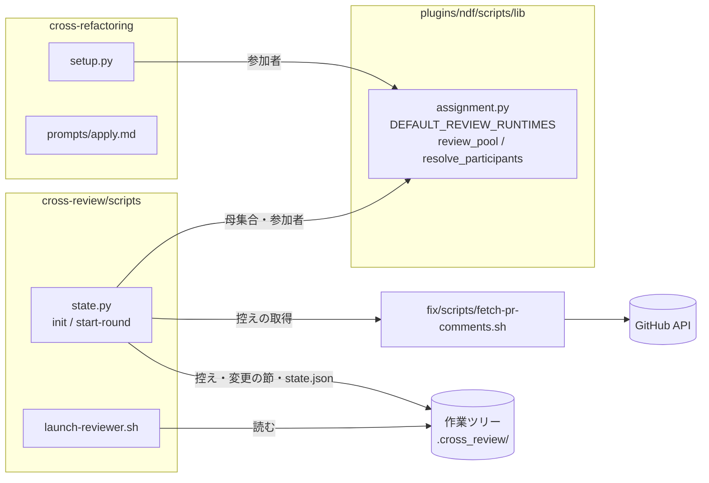
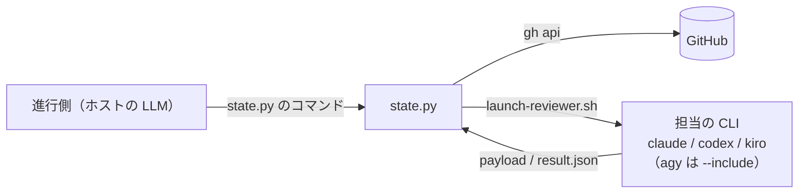
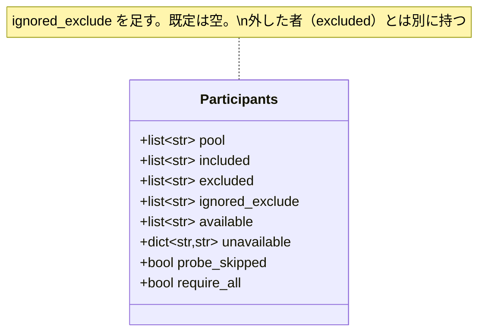
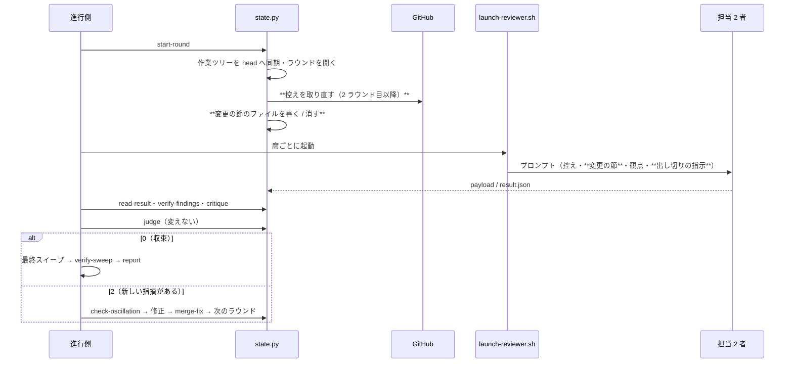

# #542 #786: cross-review のラウンドを減らす — 設計

要求と受け入れ条件は [issue-542-786-requirements.md](issue-542-786-requirements.md) にある。決定の理由は
[issue-542-786-design-decisions.md](issue-542-786-design-decisions.md) にある。この文書は「どう作るか」だけを扱う。

> **決定 4 と AC9〜AC11 は #934 へ移した**（2026-09-23 利用者の判断。決定 3 の効果を確かめてから入れる）。F4・「前のラウンドからの変更の節」の節・AC9〜AC11 のテスト設計は #934 のための記録として残し、PR #930 では実装しない。

## 例: 同じ PR の 2 ラウンド目で担当が受け取るもの

設計 PR（`issues/issue-900-design.md` を変える）の 1 ラウンド目で major 3 件・minor 2 件が出て、修正が
2 コミット入った後の 2 ラウンド目。`start-round` は次の 2 つを書く。

- 既存コメントの控え（取り直し）: 1 ラウンド目の 5 件の指摘と、各件への「対応しました（<SHA>）」の返信の行
- 前のラウンドからの変更: `cross-review-pr900-round2-changes.md`

```markdown
## 前のラウンドからの変更

前のラウンド（round 1）の head `1a2b3c4` から今の head `5d6e7f8` までに、次のファイルが変わった。

- issues/issue-900-design.md
- issues/issue-900-requirements.md

差分は作業ツリーで `git diff 1a2b3c4 5d6e7f8` を実行して読む。
**変わった節と、それを参照する節・同じ契約を使う節を先に見る。** 修正が新しく作った経路（状態・分岐・引数）に
穴が無いかを確かめる。直った指摘を繰り返さない（既存コメントの控えに返信がある）。
```

担当のプロンプトには、この節と、控えと、観点テンプレート（`common` / `docs_only` / `design`）が入る。担当は
修正が入った節から読み、その修正が作った穴を 2 ラウンド目のうちに出す。収束の判定は変えない。

## 機能一覧

| # | 機能 | 誰が使うか |
| --- | --- | --- |
| F1 | 既定の母集合を claude / codex / kiro とホストにする | `init`（cross-review） |
| F2 | 既定の母集合に無い者を外す指定を、止めずに無視する | `init`（cross-review / cross-refactoring） |
| F3 | ラウンドの開始ごとに既存コメントの控えを取り直す | `start-round` |
| F4 | 前のラウンドからの変更の節を書く（#934 へ移した） | `start-round` → `launch-reviewer.sh` |
| F5 | 出し切りの指示・テストと背景の処理を起動しない指示をプロンプトに入れる | `launch-reviewer.sh` |
| F6 | 設計 PR を分類し、設計向けの観点を渡す | `init`（観点の組み立て） |
| F7 | 適用担当に、背景で起動したテストを残して終わらないよう求める | cross-refactoring の適用のプロンプト |

## 構成要素

| 要素 | 責務 | 変更 |
| --- | --- | --- |
| `plugins/ndf/scripts/lib/assignment.py` | 母集合と座席と参加者の解決 | 定数 `DEFAULT_REVIEW_RUNTIMES` を足し、`review_pool` をそれとホストから作る。`resolve_participants` は母集合に無い者の除外を無視し、`Participants.ignored_exclude` に残す。`only` が母集合・`--include`・`--exclude` のどれにも無いときは足す者として扱う（決定 12）。`Participants.to_state()` は `ignored_exclude` を含む 8 項目を返す |
| `plugins/ndf/skills/cross-review/scripts/state.py` | 状態ファイル・観点・参加者の解決・ラウンドの開始 | 控えの取得を関数 `_fetch_existing_comments` に分け、`start-round` からも呼ぶ。`start-round` が変更の節のファイルを書く。分類 `design` と `DESIGN_REVIEW_TEMPLATE` を足す。`_resolve_reviewers` が無視した除外を 1 行で出す。`report` の参加者の節に「--exclude で指定したが既定の母集合に無かった者」の 1 行を足し、`ignored_exclude` を出す。再開の参加者の作り直しは、`--exclude` を渡さないとき `excluded` と `ignored_exclude` の両方を足し戻す。`ignored_exclude` の名前を `--include` にも渡したときだけ、その名前を足し戻さない（新しい指定を優先する）。`excluded` の名前と `--include` の重なりは今どおり止める |
| `plugins/ndf/skills/cross-review/scripts/launch-reviewer.sh` | レビューのプロンプトを組んで担当を起動する | 変更の節のファイルがあれば埋め込む。出し切りの指示と、テストと背景の処理を起動しない指示を足す。先頭のコメントの「母集合が 4 者」を「担当は 4 ランタイムのどれでもなりうる」へ直す（`launch-codex.sh`・`launch-agy.sh` の同じコメントも） |
| `plugins/ndf/skills/fix/scripts/fetch-pr-comments.sh` | 既存コメントの 3 つの取得元を 1 本で取る | 引数 `--strict` を足す。付けたときは 3 つのどれか 1 つでも失敗すれば終了コード 1（付けないときは今どおり 3 つとも失敗したときだけ 1） |
| `plugins/ndf/skills/cross-refactoring/scripts/refactor_lib/commands/setup.py` | cross-refactoring の参加者の解決 | 無視した除外を 1 行で出す。再開（`_resume`）の作り直しは state.py と同じ規則で `ignored_exclude` も足し戻す |
| `plugins/ndf/skills/cross-refactoring/scripts/refactor_lib/commands/report.py` | cross-refactoring の完了報告 | cross-review の `report` と同じく「--exclude で指定したが既定の母集合に無かった者」の 1 行を足す |
| `plugins/ndf/skills/cross-refactoring/tests/test_init.py` | cross-refactoring の `init` のテスト | 「母集合に無い者は外せない」の中断の期待を、無視して続ける期待へ替える |
| `plugins/ndf/skills/cross-refactoring/prompts/apply.md` | 適用担当のプロンプト | テストを前景で終わるまで待つ指示を足す |
| 文書 | 使い方と仕様 | `cross-review/docs/01-state-and-review.md`（Step 1 の `start-round` に、控えの取り直し・失敗しても続けること・変更の節のファイルを書く / 消すことを足す）・`cross-review/SKILL.md`・`docs/02-fix-and-rotation.md`・`docs/05-pool-and-convergence.md`・`docs/06-evidence.md`・`docs/specifications/cross-review-participants-and-seats.md`・`plugins/ndf/README.md`・`CLAUDE.md` の cross-review 節。cross-refactoring の `docs/01-state-and-propose.md`（参加者の確定の段）と `docs/specifications/cross-refactoring-participants.md`（中断の表の「名前の矛盾」の行と、203 行の「共通層が返す 7 項目」）。`cross-review/docs/04-contracts.md`（`participants` の 8 項目と一時ファイルの一覧）と確定仕様 `cross-review-participants-and-seats.md` の参加者の記録の表（8 項目）は、`ignored_exclude` と変更の節のファイルを足して 9 項目・一時ファイル 1 つ増へ直す |
| テスト | 下の「テスト設計」 | 既存の母集合のテストを直し、新しい分岐のテストを足す |

変えないもの:

| 対象 | 持つもの |
| --- | --- |
| `review_seats` | 輪番の式 |
| `_new_finding_count` / `_evaluate_convergence` | 新しい指摘の数え方と収束の判定 |
| `cmd_check_oscillation` | 振動の検知 |
| `_handle_no_result_round` | 結果が無い担当の起動し直し |
| `fix/scripts/fetch-pr-comments.sh` の出力 | 控えの形（取得の失敗を返す引数だけを足す） |
| `refactor_pool` | cross-refactoring の母集合 |

### 構成要素図



### システムの文脈と配置

変更はすべて利用者の手元で動くスクリプトの中に閉じる。外との境界は GitHub API（控えの取得。今は `init` の 1 回、
変更後はラウンドごと）と、担当の CLI（codex / kiro / claude / agy。プロンプトのファイルを受け取る）の 2 つで、
どちらの境界の形も変わらない。担当の CLI の数が既定で 1 つ減る（agy）。



### パッケージ・モジュール構成

```text
plugins/ndf/
├── scripts/lib/assignment.py                 # 変える
├── scripts/tests/test_lib_assignment.py      # 変える
└── skills/
    ├── cross-review/
    │   ├── SKILL.md                          # 変える
    │   ├── docs/02-fix-and-rotation.md       # 変える
    │   ├── docs/05-pool-and-convergence.md   # 変える
    │   ├── docs/06-evidence.md               # 変える
    │   ├── scripts/state.py                  # 変える
    │   ├── scripts/launch-reviewer.sh        # 変える
    │   └── tests/                            # 変える・足す
    ├── fix/scripts/fetch-pr-comments.sh     # 変える（--strict）
    └── cross-refactoring/
        ├── prompts/apply.md                  # 変える
        ├── scripts/refactor_lib/commands/setup.py  # 変える
        ├── docs/01-state-and-propose.md      # 変える
        └── tests/test_assignment.py / test_init.py  # 変える
```

## 構造

変える型は `assignment.Participants`（参加者の解決の結果）の 1 つで、項目を 1 つ足す。



## 入出力の契約

### 母集合と参加者（`assignment.py`）

```python
DEFAULT_REVIEW_RUNTIMES = ("claude", "codex", "kiro")  # ホストを除いた部分。agy は --include で足す

def review_pool(host: str) -> list[str]:
    # ホストになれない名前は今と同じく AssignmentError
    return _in_fixed_order((*DEFAULT_REVIEW_RUNTIMES, host))
```

| ホスト | `review_pool` | 引数なしの座席（round 1 / 2 / 3） |
| --- | --- | --- |
| claude / codex / kiro | `[claude, codex, kiro]` | codex+kiro / claude+kiro / claude+codex |
| agy | `[claude, codex, agy, kiro]` | codex+agy / agy+kiro / claude+kiro（今の既定と同じ輪番） |

`resolve_participants` の除外の検査を次のように変える。

| 除外に書いた名前 | 今 | 変更後 |
| --- | --- | --- |
| 母集合か `--include` にある | 外す | 外す（同じ） |
| 綴りの正しいランタイム名で、母集合にも `--include` にも無い | `AssignmentError`（終了コード 1） | 外さずに無視し、`Participants.ignored_exclude` に固定順で残す |
| 綴りの誤り | 引数の型が弾く（終了コード 2。共通層まで届かない） | 同じ |

`Participants` に `ignored_exclude: list[str]`（既定は空）を足す。呼び出し側（cross-review の `_resolve_reviewers`、
cross-refactoring の `setup.py`）は、空でなければ次の 1 行を標準エラーへ出して続ける。

```text
ℹ --exclude agy は既定の母集合に無いため無視しました（母集合: claude, codex, kiro）
```

状態ファイルの `participants` には `ignored_exclude` を書き足す（`excluded` には入れない。外した者と区別するため）。

**`--only` で名指しした者は、既定の母集合に無くても参加者にする**（決定 12）。`resolve_participants` は、まず `only` が
ランタイムの名前（`ALL_RUNTIMES`）かを確かめ、違えば今の綴りの検査と同じく `AssignmentError` にする。名前が正しく、
母集合にも `--include` にも無く、`--exclude` にも無いとき、`only` を足す者として扱ってから今の検査を通す。
`--only agy` は `--include agy` 無しで今と同じく agy 1 者で回る。`--only agy --exclude agy` は今どおり矛盾で止まる。
足した名前は `participants.included` に書かない（記録は `only` だけが持つ）。再開で `--only none` を渡すと、
既定の母集合へ戻り、agy は参加者から外れる。

**この共有層の変更は cross-refactoring にも及ぶ。** cross-refactoring の `init` は、母集合に無い者の除外で今は
中断する（終了コード 4）。変更後は無視して `ℹ` の 1 行を出し、続ける。重なり（足す者と外す者に同じ名前）と
`none` と名前の混在は、今どおり終了コード 4 で中断する。

### 既存コメントの控え（`state.py`）

```python
def _fetch_existing_comments(repo: str, pr: int, path: pathlib.Path, *, strict: bool) -> str | None:
    """fetch-pr-comments.sh を呼び、成功なら path へ書いて None、失敗なら理由の文を返す。

    strict=True なら --strict を付け、一時の名前へ書いてから成功したときだけ path へ改名する。
    """
```

| 呼ぶ場所 | 失敗したとき |
| --- | --- |
| `init` の新規開始（今の場所）。`strict=False` で呼ぶ | 今と同じく、3 つとも失敗したときだけ `die`（終了コード 1）。1〜2 つの失敗は今どおり続ける |
| `start-round`（状態ファイルの通しで 2 ラウンド目以降。round エントリを状態ファイルへ保存する前。PR #930 のレビューで、保存の後に取ると割り込みで結果の無い round だけが残るため前へ移した）。起動できない（`OSError`）ときも失敗の理由として返す。`strict=True` で呼ぶ（`--strict` を付け、出力を一時の名前のファイルへ書いてから、成功したときだけ控えへ改名する） | 3 つの取得元のどれか 1 つでも失敗したら（終了コード 1）、前の控えを残し、`⚠ 既存コメントの控えを取り直せませんでした（<理由の先頭 200 字>）。前の控えのまま進めます` を標準エラーへ出して続ける |

| 項目 | 値 |
| --- | --- |
| 取り直す時点 | 状態ファイルの通しのラウンドが 2 以上のとき（`round_in_pr` ではない）。通しの 1 ラウンド目は `init` が取った直後であるため取り直さない |
| 取得する PR | `current_pr`（PR の巻き直しの後は新しい PR） |
| 書く先 | `$TMP_DIR/cross-review-pr<STATE_PR>-existing-comments.txt`（今の置き場所。`launch-reviewer.sh` が読む名前は変えない） |
| 巻き直しの直後 | 取り直す（新しい PR の既存コメントに置き換わる）。同じ PR の前のラウンドが無いため、変更の節は書かない |

控えの形（1 行 1 件、`[PR-COMMENT]` などの接頭辞）は変えない。

### 前のラウンドからの変更の節（`state.py start-round` → `launch-reviewer.sh`）

> #934 へ移した（決定 4）。PR #930 では実装しない。

`start-round` はラウンドを開いた後に `$TMP_DIR/cross-review-pr<STATE_PR>-round<ROUND>-changes.md` を扱う。

| 条件 | ファイル |
| --- | --- |
| 同じ PR の前のラウンドが無い（1 ラウンド目・PR の切り替え直後） | 書かない |
| 比べる前のラウンド（今のラウンドより前で、`pr` が `current_pr` と同じもののうち最も新しいもの）か今のラウンドの `head_sha` が無い | 書かない |
| 2 つの `head_sha` が同じ | 書かない |
| 違う | 書く（形は冒頭の例） |
| `git diff --name-only <前> <今>` が失敗した | 書かず、`⚠ 前のラウンドからの変更を取れませんでした` を出して続ける |

- 変わったファイルは `git -C <worktree> diff --name-only <前> <今>` の出力の順に並べる。50 件に達するか、一覧の行の
  バイト数の合計が次の 1 行で 5,000 を超えるところで打ち切り、残りは「ほか N 件」の 1 行にする
- 差分の本文は書かない
- 同じ名前のファイルが前の起動で残っていれば、書かない場合も消す（古い節を次のプロンプトへ入れないため）

`launch-reviewer.sh` は、このファイルが空でなければ中身を「既存コメントスナップショット」の節の後、追加レビュー観点（`$EXTRA_REVIEW_BLOCK`）の前へ入れる。
無ければ何も入れない。

### プロンプトに足す指示（`launch-reviewer.sh`）

| 置く節 | 足す指示 |
| --- | --- |
| `## 指摘に含めてはいけないもの` の直前 | 「見つけた指摘はこのラウンドですべて出す。次のラウンドへ回さない。重要度が minor のものも書く」 |
| `## 守るべきこと` | 「テストを実行しない。実行して確かめる手順は `suggested_check` に書く（進行側の `verify-findings` が実行する）」「背景で処理を起動しない。起動した処理の終わりを待たずに結果のファイルを書かないまま終わると、結果が無い担当として扱われる」 |

### 設計向けの観点（`state.py`）

分類の述語 `_is_design_doc_path(path)` は、次の 2 つを満たすパスで真を返す。

- `issues/` で始まる
- ファイル名が `-requirements.md` / `-design.md` / `-design-decisions.md` のどれかで終わる

2 つの表へ 1 行ずつ足す。

| 表 | 足す行 |
| --- | --- |
| `PATH_CATEGORY_RULES` | `("design", _is_design_doc_path)` |
| `CATEGORY_TEMPLATES` | `"design": DESIGN_REVIEW_TEMPLATE` |
`docs_only` の判定は変えない
（設計 PR は `common` / `docs_only` / `design` の 3 つになる）。

```text
### 設計 PR
- 要求・設計・決定の記録の 3 文書で、受け入れ条件ごとに設計の要素とテスト設計の行があるか。決定で退けた案が他の節に残っていないか
- 状態（ファイル・環境変数・状態ファイルの項目・引数）ごとに、書き手と読み手を並べる。同じ状態を 2 つの経路が書く・読む側が書く側より先に動く・失敗した書き手の後に読む、の矛盾が無いか
- 外部コマンド・外部ツールの挙動（優先順位・終了コード・一致の範囲）を断定する記述に、実測の根拠（コマンドと出力）があるか
```


## 処理の流れ

### 1 ラウンド（変わる段を太字にする）

図に含めないもの: cross-refactoring の `setup.py` と `prompts/apply.md`（cross-review のラウンドを通らない。
変わるのは参加者の解決の 1 行の表示と、適用担当への指示の文だけである）。




## 非機能の実現方式

| 条件 | 実現方式 |
| --- | --- |
| 変更の節は 6,000 バイト以下 | ファイル名だけを並べ、差分の本文を入れない。一覧は 5,000 バイトで打ち切る（長いパスでも超えない）。定型の文は約 600 バイト、「ほか N 件」の行は 30 バイト以下 |
| 控えの増分は同じ実行の前のラウンドの分だけ | 取り直しは `fetch-pr-comments.sh` の全件の取得で、増えるのは前の取得の後に投稿された行だけである |

## 決定の記録

決定の見出し・理由・採らなかった案は [issue-542-786-design-decisions.md](issue-542-786-design-decisions.md) にある（12 件）。

## テスト設計

`.md` の文言は固定しない（#885）。プロンプトは節の有無と、条件で入る・入らないの分岐を見る。

| 受け入れ条件 | 何で確かめるか |
| --- | --- |
| AC1 AC2 AC3 | `test_lib_assignment.py`: `review_pool(h)` をホスト 4 通りで比べる。`resolve_participants` + `review_seats` で host=claude の round 1〜3 を比べる |
| AC4 | 同上: `--include agy` の座席が今の既定の輪番と一致する。`--exclude agy` が例外を出さず `ignored_exclude == ["agy"]`、`available` に agy が無い。`test_state_review_pool.py`: `init --exclude agy` が終了コード 0 で `ℹ` の行を出し、状態ファイルに `ignored_exclude` が残る。綴りの誤りは今どおり 2 |
| AC4b | `test_lib_assignment.py`: `only="agy"` で `include` 無しでも参加者が `[agy]` になり、`included` は空。`only="agy", exclude=["agy"]` は今どおり `AssignmentError`。`only="typo"` は `probe` を呼ぶ前に `AssignmentError`。`test_state_resume_args.py`: `--only agy` で始めた実行を `--only none` で再開すると、参加者が既定の 3 者に戻る |
| AC4c | cross-refactoring の `test_init.py`: `{"exclude": [["agy"]]}` が中断せず `ℹ` の行を出す。重なりの指定は今どおり終了コード 4。報告のテスト: その状態から作った完了報告に「既定の母集合に無かった者: agy」の行が出る |
| AC4d | 上の表の `test_the_report_lists_who_took_part` の書き換え。`test_state_resume_args.py`: `--exclude agy` で始めた実行を `--include codex` だけで再開しても、`ignored_exclude == ["agy"]` が残り報告に出る。`--exclude agy` で始めて `--include agy` で再開すると agy が参加者に戻る。`--exclude kiro` で始めて `--include kiro` で再開すると今どおり止まる。cross-refactoring の `test_init.py` の再開のテスト: `--exclude agy` で始めて `--include` だけで再開しても `ignored_exclude == ["agy"]` が残り、完了報告に出る |
| AC5 | 目で見る。`grep -rn "4 者" plugins/ndf/skills/cross-review CLAUDE.md plugins/ndf/README.md docs/specifications/cross-review-participants-and-seats.md` の当たりのうち、現行の説明は 0 件。出た版の変更点の記録（`plugins/ndf/README.md` の 10.17.3 の更新案内）は書き換えない |
| AC6 AC7 AC8 | 目で見る（文言）。`test_launch_reviewer_prompt_context.py` の既存の組み立てのテストが通る |
| AC9（#934） | `start-round` のテスト（新規 `test_state_round_changes.py`）: 一時の git リポジトリで 2 つの head を作り、2 ラウンド目で変更の節のファイルが書かれ、2 つの SHA とファイル名が入る。`launch-reviewer.sh` の組み立てで、ファイルがあるときプロンプトに節が入る |
| AC10（#934） | 同上: 1 ラウンド目・同じ head・`head_sha` の無いラウンドでファイルが無く、前の起動の残りも消える。プロンプトに節が入らない |
| AC11（#934） | 同上: 53 ファイルの差分で一覧が 50 件と「ほか 3 件」。名前が 200 バイトのファイル 40 件の差分で、一覧が 5,000 バイトで打ち切られ、ファイルの大きさが 6,000 バイト以下 |
| AC12 AC12b | 同上: `fetch-pr-comments.sh` を差し替えた偽物で、2 ラウンド目の `start-round` が呼び、控えが新しい中身になる。1 ラウンド目では呼ばない。`set-current-pr` の後の `start-round` は新しい PR の番号で呼ぶ |
| AC12a | 同上: 偽物の `fetch-pr-comments.sh --strict` が 3 つのうち 1 つの失敗で 1 を返すと、控えが前の中身のまま残る。`init`（`strict=False`）では 1 つの失敗でも控えを書いて続け、3 つとも失敗すると終了コード 1。`fix` の側のテスト: `--strict` 無しでは今どおり 1 つの失敗で 0 |
| AC13 | 同上: 偽物が失敗すると `start-round` が終了コード 0 で `⚠` の行を出し、控えは前の中身のまま |
| AC14 AC16 | `test_state_auto_review_templates.py`: `issues/issue-1-design.md` を含む変更が `common` / `docs_only` / `design` に、`issues/notes.md` と `docs/x-design.md` だけの変更が `design` を含まない |
| AC15 | 目で見る（テンプレートの文言） |
| AC17 | 既存の `test_classify_findings.py`（minor は数えない区分へ落ちる）と judge のテストが変更なしで通る |
| AC18 | 既存の `test_state_check_oscillation.py`・`test_judge_no_result_reason.py` が変更なしで通る |
| AC19 | `_evaluate_convergence` と `review_seats` を変えない（差分に現れない）ことを実装の PR で確かめる |
| AC20 | `uv run --project plugins/playwright-kit/skills/playwright-kit-ops --with pytest pytest . -q -n 4` が通る |

**期待を書き換える既存のテスト**（決定 1・2・12 で振る舞いが変わるため）:

| テスト | 今の期待 | 変更後の期待 |
| --- | --- | --- |
| `cross-review/tests/test_state_review_pool.py` の `--only` のテスト（264 行・292 行付近） | 既定の母集合が 4 者 | 3 者（`--only agy` は AC4b） |
| 同じファイルの除外のテスト（422〜435 行付近） | `--exclude agy` で `excluded == ["agy"]` | `excluded == []`・`ignored_exclude == ["agy"]` |
| 同じファイルの、`new_init` の既定の母集合を 4 者と期待する残りのテスト（400〜402・442・452・498〜500・507・552〜554・569 行付近） | 母集合・`available`・`calls` が agy を含む 4 者 | 既定の 3 者（agy を含む期待は `--include agy` を渡す形へ） |
| 同じファイルの `test_the_report_lists_who_took_part`（727 行付近） | 静的な参加者の記録から報告を作る | `init --exclude agy` で作った状態から報告を作り、「既定の母集合に無かった者: agy」の行が出る |
| `cross-refactoring/tests/test_assignment.py`（56〜58 行） | `review_pool(host) == list(ALL_RUNTIMES)` | 既定の 3 者とホスト |
| `scripts/tests/test_lib_assignment.py`（66 行付近） | `review_pool` が 4 者 | 同上 |
| `cross-refactoring/tests/test_init.py`（285 行） | `--exclude agy` で中断（終了コード 4） | 続ける（AC4c） |
| `scripts/tests/test_lib_participants.py`（147 行付近） | 母集合に無い者の除外は例外 | 無視して `ignored_exclude` に残す |
| 同じファイル（193 行付近） | `to_state()` が 7 項目と完全一致 | `ignored_exclude` を含む 8 項目 |
| `cross-review/tests/test_state_resume_args.py` の `test_exclude_reruns_the_probe_and_drops_the_name`・`test_the_participants_are_recorded_as_one_change`・`test_unpassed_arguments_come_from_the_state_file` | 再開の `--exclude agy` が `excluded` に残る | 既定の母集合では `ignored_exclude` に残り、`excluded` は空 |

## 未確認のまま残ること

| 項目 | 内容 |
| --- | --- |
| ラウンドが実際に減るか | この変更の効果は、配布後の設計 PR のラウンド数で見る。比べる手段は #893 が作る。手元では退避された状態ファイル（`.git/ndf/worktree-trash/*/.cross_review/`）の `rounds` を数えて比べられる |
| 出し切りの指示で 1 ラウンド目の出力が増えるか | 増えると担当の所要が延びる。既定の担当の無進捗の許容は codex 180 秒・kiro 480 秒・claude 900 秒で、実装の PR の cross-review で 3 者の所要と打ち切りの有無を見る |
| 控えの大きさ | #908 の実行 3 で控えは 54,957 バイトだった。取り直しで同じ実行の指摘と返信の行が増える。実装の PR の cross-review で大きさを見る（圧縮は範囲外） |
| #892 の後の母集合で動いた実行が無い | claude が座席に入った実行は手元の記録にまだ無い。この変更の後の既定（claude / codex / kiro）で 2 ラウンド目に claude が座る |
| 設計 PR の見分けの取りこぼし | ファイル名の規約（`-requirements.md` / `-design.md` / `-design-decisions.md`）から外れた設計文書は `design` に分類されない。`issues/` 配下の既存の設計文書の名前は、実装の時点で `ls issues/*design*` で確かめる |
