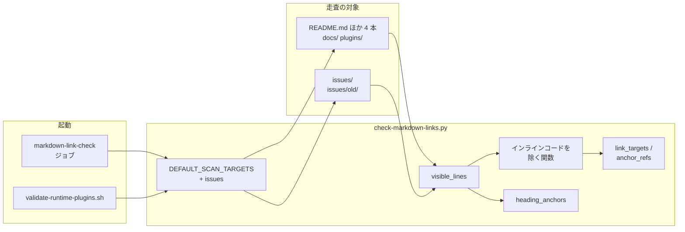
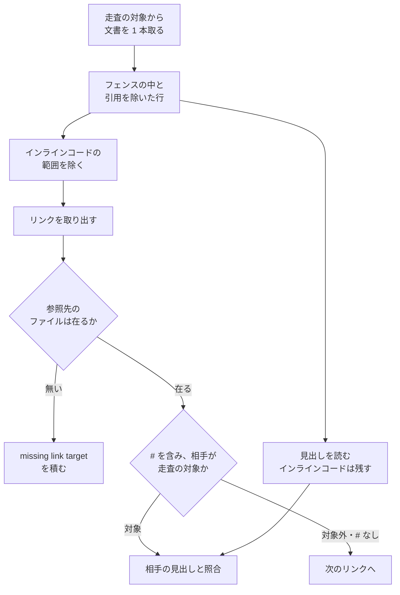

# #543: issues/ の Markdown をリンクの検査の走査へ入れる — 設計

要求と受け入れ条件は [issue-543-requirements.md](issue-543-requirements.md) にある。この文書は
「どう作るか」だけを扱う。

## 機能一覧

| # | 機能 | 誰が使うか |
| --- | --- | --- |
| F1 | `issues/` の文書の壊れた参照で、検査が落ちる | `issues/` を変える Pull Request の作成者、継続的統合 |
| F2 | インラインコードの中の記法の例を、リンクとして読まない | 記法を説明する文書の書き手 |
| F3 | `issues/old/` へ移すときの参照の直し方を知る | 完了した記録を移す人 |

## 構成要素

**新設は無い。** 既存のスクリプト 1 本とテスト 1 本と文書 1 本とワークフロー 1 本を変え、記録 10 本の参照を直す。

| 要素 | 変更 | 責務 |
| --- | --- | --- |
| `scripts/check-markdown-links.py` の `DEFAULT_SCAN_TARGETS` | `"issues"` を足す | 走査の対象を決める（決定 1） |
| `scripts/check-markdown-links.py` のインラインコードを除く関数 | 足す | リンクを取り出す前の本文から、インラインコードの範囲を取り除く（決定 4） |
| `scripts/check-markdown-links.py` の `main` | 変える | リンクの取り出し（`link_targets` / `anchor_refs`）へ、インラインコードを除いた本文を渡す |
| `scripts/tests/test_check_markdown_links.py` | 足す・変える | 受け入れ条件 1〜6 を固定する。対象外の例に `issues/` を使う 2 件は例のディレクトリを移す |
| `issues/` の記録 10 本 | 直す | 壊れた参照 27 件の参照先（「直す参照の一覧」、決定 2・3） |
| `issues/README.md` | 足す | `old/` へ移すときの直し方（決定 7） |
| `.github/workflows/runtime-plugin-validate.yml` | 変える | `push` の `paths` へ `issues/**` を足す（決定 6） |

**見出しの読み方（`visible_lines` / `heading_anchors` / `slugify`）は変えない。** インライン
コードを除くのはリンクを取り出す経路だけである。見出しの経路で除くと、#445 が固定した
`` ### `<worktree-base>` の解決順 `` の名前が `worktree-base-の解決順` から `の解決順` に変わる。

図には検査の実行に関わる要素だけを描く。テスト・`issues/README.md`・記録の参照の修正は描かない。

## 処理の流れ

1 本の文書に対する処理である。**変わるのは、リンクを取り出す前にインラインコードを除く 1 段
だけである。**

### インラインコードの範囲

| 規則 | 内容 |
| --- | --- |
| 範囲 | 1 行の中で、N 本のバッククォートの列から、次に現れる同じ N 本の列までを 1 つのインラインコードとする |
| 本数の一致 | 前後に別のバッククォートが続く列は、N 本の列として数えない（`` `` ` `` `` のように本数の違う列を中に含められる） |
| 閉じない列 | 同じ本数の列が行の中に無ければ、インラインコードにしない。後ろの本文はリンクとして読む |
| 行をまたぐもの | 読まない（走査の対象に 0 件。未確認のまま残ること） |
| 除いた後 | 範囲を空白 1 つへ置き換える。前後の文字がつながって別のリンクの形にならないようにする |

## 直す参照の一覧

`origin/develop`（`91ee858` / `08c370a`）での位置である。**変えるのは `](` と `)` の間だけである**（決定 3）。

### 文書を移し、相対パスの深さが変わったもの（23 件）

| 文書 | 行 | いまの参照先 | 直した参照先 |
| --- | ---: | --- | --- |
| `issues/old/issue-113-cross-refactoring.md` | 5 | `old/` | `./` |
| 同 | 9, 27 | `old/issue-113-cross-refactoring-7th-trial-report.md` | `issue-113-cross-refactoring-7th-trial-report.md` |
| 同 | 11 | `old/issue-113-cross-refactoring-fix-handoff.md` | `issue-113-cross-refactoring-fix-handoff.md` |
| 同 | 21〜26 | `old/issue-113-cross-refactoring-<名前>.md`（`<名前>` は `trial-report` / `retrial` / `re-retrial` / `4th-trial-report` / `5th-trial-report` / `6th-trial-report`） | 先頭の `old/` を除いたもの |
| 同 | 10, 183 | `issue-158-llm-ensemble-for-agentic-development.md` | `../issue-158-llm-ensemble-for-agentic-development.md` |
| `issues/old/issue-421-423-391-modes-and-stages/01-requirements.md` | 188, 189 | `../../docs/specifications/<名前>.md` | `../../../docs/specifications/<名前>.md` |
| `issues/old/issue-421-423-391-modes-and-stages/02-design.md` | 49 | `../../plugins/ndf/skills/README.md` | `../../../plugins/ndf/skills/README.md` |
| 同 | 334, 484 | `../../docs/specifications/ndf-workflow-unit-and-gates.md` | `../../../docs/specifications/ndf-workflow-unit-and-gates.md` |
| `issues/old/parallel-batch-03/00-overview.md` | 146 | `../old/parallel-batch-01/00-overview.md` | `../parallel-batch-01/00-overview.md` |
| `issues/old/parallel-batch-04/00-overview.md` | 154 | `../old/parallel-batch-03/00-overview.md` | `../parallel-batch-03/00-overview.md` |
| 同 | 155 | `../../docs/development-history/09-2026-09-02.md` | `../../../docs/development-history/09-2026-09-02.md` |
| `issues/old/parallel-batch-05/00-overview.md` | 19, 320 | `../old/parallel-batch-04/00-overview.md` | `../parallel-batch-04/00-overview.md` |
| 同 | 321 | `../../docs/development-history/10-2026-09-02.md` | `../../../docs/development-history/10-2026-09-02.md` |

### 指す先の文書が移った・分割されたもの（4 件）

| 文書 | 行 | いまの参照先 | 直した参照先 |
| --- | ---: | --- | --- |
| `issues/issue-158-llm-ensemble-for-agentic-development.md` | 8 | `issue-113-cross-refactoring.md` | `old/issue-113-cross-refactoring.md` |
| `issues/issue-159-telemetry.md` | 8 | `issue-113-cross-refactoring.md` | `old/issue-113-cross-refactoring.md` |
| `issues/old/README.md` | 10 | `../issue-113-cross-refactoring.md` | `issue-113-cross-refactoring.md` |
| `issues/old/ndf-skill-footprint.md` | 5 | `../../docs/specifications/ndf-skill-inventory.md` | `../../docs/specifications/ndf-skill-inventory/` |

### 直さないもの（2 件）

| 文書 | 行 | 本文 | 扱い |
| --- | ---: | --- | --- |
| `issues/old/issue-81-evidence-link-rewrite.md` | 18 | `` `[文言](位置)` の書き方 `` | インラインコードの中の記法の例。決定 4 で照合から外れる |
| 同 | 218 | `` `[trace](位置)` の形で書き出す `` | 同上 |

## 決定の記録

### 決定 1: `issues/old/` も含めて `issues/` を走査へ足し、除外の一覧を置かない

29 件のうち 23 件は、文書を `issues/old/` へ移したときに相対パスの深さが変わって壊れた。
`old/` を除外すると、この壊れ方がこれからも見えないまま積もる。`old/` の記録は
`docs/ndf-version-decisions.md` などの「詳細は」の行から読みに来られるため、壊れた参照は
読み手の実害になる。

`old/` を除いて足す形は採らない。直下の 2 件しか直らず、除外の宣言という新しい設定が増える。
`check-doc-line-limit.py` が `issues/` を除外するのは「記録を分割しない」ためであり、参照が
壊れたままでよい理由にはならない。`AGENTS.md` の「履歴と記録は最初から走査に入らない」も
版数の突き合わせの走査を指し、記録に当時の版数が残るのが正しい状態だから外している。
壊れた参照は正しい状態ではない。何もしない形は、設計文書と計画が同じ `issues/` にあるため
採らない。

### 決定 2: 既存の壊れた参照 27 件は、走査を足す実装の Pull Request で同時に直す

走査を足すと、直していない参照の数だけ継続的統合が落ちる。直す作業と走査を足す作業を別の
Pull Request に分けると、先に入る側だけでは目的を果たさない。1 つの Pull Request の中で、
参照を直すコミットを先に、走査を足すコミットを後に置く。

設計 Pull Request では直さない。設計 Pull Request は要求と設計だけを載せる（`design` の規約）。

### 決定 3: 記録の参照は `](` と `)` の間だけを直し、文言と本文は変えない

記録を書き換えない扱いが守るのは、当時の判断と記述である。参照先の相対パスは読み手を同じ
文書へ運ぶ道筋で、移したことで道筋だけが切れた。道筋を直しても、記録が何を指していたかは
変わらない。文言は当時の名前（`docs/specifications/ndf-skill-inventory.md` など）のまま残す。

指す先の文書が分割されていた `ndf-skill-inventory.md` の 1 件は、分割した先のディレクトリを
指す。分割の後の文書のどれか 1 本を選ぶと、記録が指していなかった範囲へ読み手を運ぶ。

### 決定 4: インラインコードの中の `[文言](参照先)` はリンクとして読まない

`issue-81` の 2 件は記法を説明する例で、GitHub もリンクとして描画しない。記録の本文を
書き換えて検査を通すと決定 3 に反し、検査の誤りも残る。検査の側で直せば、`docs/` と
`plugins/` で同じ例を書いたときにも誤って落ちない。いまの走査の対象でインラインコードの
中にあるリンクの形は外部の URL 1 件で、照合の結果は変わらない。

除くのはリンクを取り出す経路だけにする。見出しの経路で除くと、#445 が固定した見出しの
名前が変わる。

### 決定 5: 走査の母集合は、ファイルシステムから集める今の形を変えない

`issues/` は主ディレクトリで編集してよい場所であり、未追跡の下書きが置かれる。手元での
実行では下書きの壊れた参照でも落ちるが、下書きはいずれ Pull Request に載るため、早く
気づく方に働く。git の追跡から集める形（`check-doc-line-limit.py` と同じ）へ変えると、
`docs/` と `plugins/` の母集合の決め方まで変わる。そのため、この変更の対象にしない。主ディレクトリでの
実測は、未追跡の下書きを含めても 29 件で変わらなかった。

### 決定 6: 継続的統合の `push` の起動条件へ `issues/**` を足す

`pull_request` は起動条件を絞っていないため、Pull Request の検査はこの変更が無くても走る。
`push` の `paths` は各ジョブが読む場所を並べており、`issues/` だけを変えた `develop` への
マージでは検査が走らない。走査の対象と起動条件を揃える。

### 決定 7: `issues/old/` へ移すときの直し方を `issues/README.md` に書く

移すことが 23 件の壊れ方の原因であり、これからも起きる。検査が落ちたときに、決定 3 と
同じ直し方をすればよいことを、移す人が読む場所に置く。移すときに参照を自動で書き換える
道具は作らない。移設はまとめて行う操作で（`develop` の履歴では 8 月 31 日から 9 月 7 日の
5 回で 131 本）、検査が落ちた箇所を直せば足りる。

## テスト設計

テストは `scripts/tests/test_check_markdown_links.py` に置く。既存と同じく、一時ディレクトリへ
文書を作り、検査を別プロセスで実行する。

| 受け入れ条件 | 何で確かめるか |
| --- | --- |
| 1. `issues/` 直下で落ちる | `issues/plan.md` に `[x](無い.md)` を書き、終了コード 1 と `- issues/plan.md: missing link target: 無い.md` を見る |
| 2. `issues/old/` の下で落ちる | `issues/old/batch/00.md` に同じ参照を書く |
| 3. `issues/` の無い見出しで落ちる | 既存の `test_document_outside_scan_scope_is_not_checked_for_headings` の期待を 1 へ変え、対象外の例は別の新しいテストへ移す |
| 4. インラインコードの中は落ちない | `` `[文言](位置)` `` と `` `<a href="無い.md">` `` を書き、終了コード 0 |
| 5. 同じ行のコードの外は落ちる | `` `[文言](位置)` と [x](無い.md) `` を書き、失敗が 1 行だけであることを見る |
| 6. インラインコードを含む見出しが解決する | 既存の `test_heading_with_angle_brackets_in_inline_code_resolves` が通る |
| 7. リポジトリ全体が 0 | `python3 scripts/check-markdown-links.py --root .` の終了コード |
| 8. 変わったのは括弧の中だけ | `git diff -U0 origin/develop -- issues/` の削除行と追加行を対にし、`](…)` の中を空にした文字列が一致することをスクリプトで見る |
| 9. 同じ文書を指す | 「直す参照の一覧」と差分を 1 行ずつ突き合わせる |
| 10. `issue-81` に差分が無い | `git diff --quiet origin/develop -- issues/old/issue-81-evidence-link-rewrite.md` |
| 11. `issues/README.md` の記載 | 差分を読む |
| 12. `push` の `paths` | ワークフローのファイルを読む |
| 13. 既存テストが通る | `uv run --with pytest pytest scripts/tests/test_check_markdown_links.py -q`。`test_iter_markdown_files_collects_root_files_and_scan_dirs` は `issues/plan.md` を含む期待へ変え、対象外の例を別のディレクトリで残す |
| 14. 行数の検査が 0 | `python3 scripts/check-doc-line-limit.py --root .` の終了コード |

## 未確認のまま残ること

| 項目 | 内容 |
| --- | --- |
| 行をまたぐインラインコード | 走査の対象に 0 件で、読まない。書かれたときは中の記法をリンクとして読み、誤って落ちうる |
| 並行する Pull Request | `issues/` に解決できない参照を持つ作業中の Pull Request は、この変更がマージされた後の再実行で落ちる。いま `develop` にある直下の文書では 2 件だけで、作業中のブランチの件数は数えていない |
| 行番号のずれ | 「直す参照の一覧」の行番号は `91ee858` での値である。実装までに `issues/` が変わっていれば、検査の出力で位置を取り直す |
| 移したときの頻度 | 決定 7 の回数は `git log -M` で `issues/old/` へ改名したコミットを数えた過去の値で、今後の頻度は測れない |
