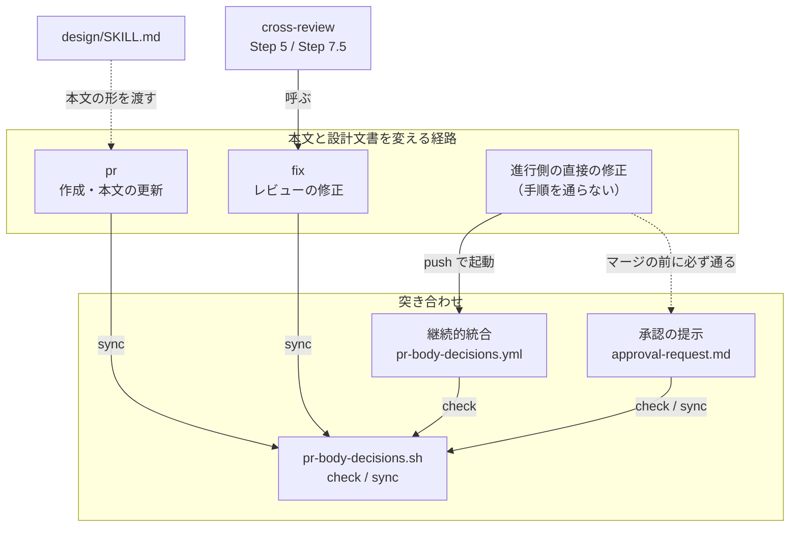
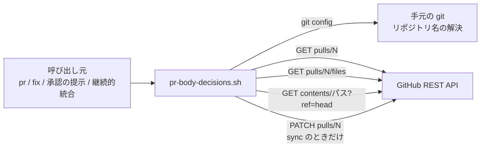
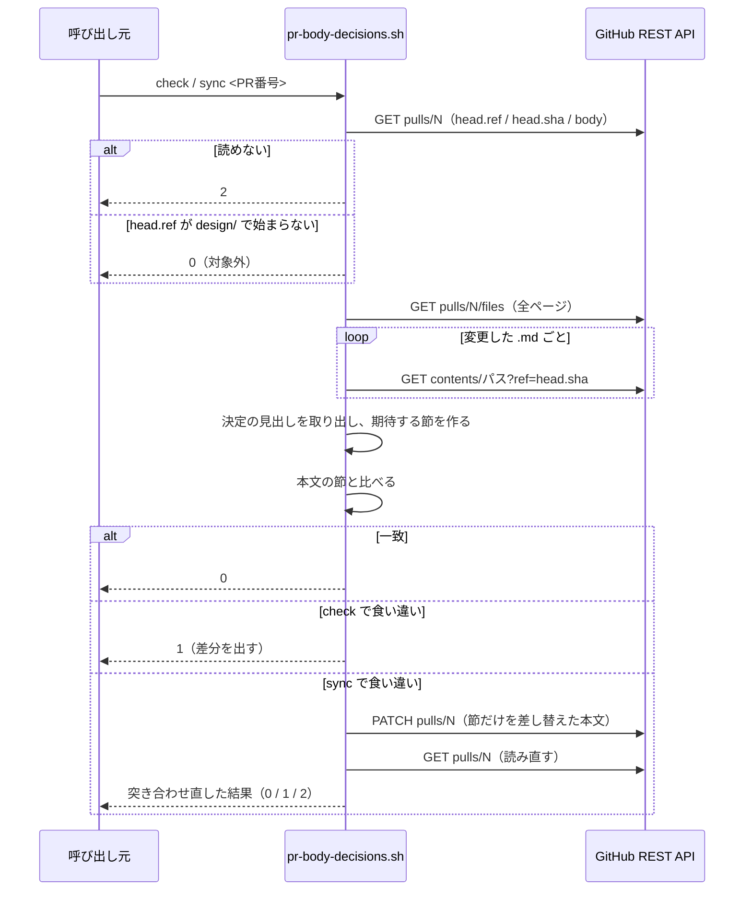

# #545: 設計 Pull Request の本文を設計文書の決定から外れさせない — 設計

要求と受け入れ条件は [issue-545-requirements.md](issue-545-requirements.md) にある。この文書は
「どう作るか」だけを扱う。

## 機能一覧

| # | 機能 | 誰が使うか |
| --- | --- | --- |
| F1 | 本文の決めたことの節が、設計文書の決定の見出しと一致するかを確かめる | `fix` / `pr` を通す担当、承認を求める進行側、継続的統合 |
| F2 | ずれていたら、本文の決めたことの節だけを書き直す | `fix` / `pr` を通す担当、承認を求める進行側 |
| F3 | 設計 Pull Request の本文に何を書くかを決める | `pr` を通す担当 |

## 構成要素

**新設はスクリプト 1 本とテスト 1 本と継続的統合のワークフロー 1 本である。** 残りは
Skill 本文と参照の変更で、呼ぶ時点を書き足す。

| 要素 | 新設 / 変更 | 責務 |
| --- | --- | --- |
| `plugins/ndf/scripts/pr-body-decisions.sh` | 新設 | `check` と `sync` の 2 つの副コマンド。対象の判定・読み取り・突き合わせ・節の差し替えを持つ（F1 / F2） |
| `plugins/ndf/scripts/tests/test_pr_body_decisions.py` | 新設 | `gh` を差し替えて、受け入れ条件 1〜12 と 20 と 22 を確かめる |
| `.github/workflows/pr-body-decisions.yml` | 新設 | このリポジトリの Pull Request で `check` を走らせる。読み取りの権限だけを持つ |
| `plugins/ndf/skills/pr/SKILL.md` | 変更 | 「設計 Pull Request の本文」の節を足す（F3）。手順 5 と「PR説明の更新」の後に `sync` を置く |
| `plugins/ndf/skills/fix/SKILL.md` | 変更 | 修正手順に `sync` を足す（コミットの有無によらず走る）。完了報告に終了コードを載せる |
| `plugins/ndf/skills/development-workflow/references/approval-request.md` | 変更 | 「設計 Pull Request のマージ」の提示の前に `check` を置き、判断に使うものへ「本文との一致」を足す |
| `plugins/ndf/skills/design/SKILL.md` | 変更 | 手順 5 の表の「本文」の行から、本文の形を `pr` の節へ渡す |

### 構成要素の関係

3 つの経路が、どこで突き合わせに合流するかを示す。



**テストのファイルは図に含めない。** 呼び出しの関係を持たないためである。`cross-review` は
変えない呼び出し元として描く（決定 7）。

## 決定の記録

### 決定 1: 本文は決定の中身を持たず、設計文書の決定の見出しだけを写す

本文と設計文書が同じ決定を別の文で持つと、片方だけが直る。#539 はその形で、本文は決定の
説明と区分の表まで写していた。見出しは `decisions.md` の規約で結論を 1 文で表すため、
見出しだけを並べれば本文だけを読む人も結論を追える。理由と採らなかった案は設計文書を読む。

本文から決定を消して参照だけにする形は採らない。承認を求める提示物は決定の見出しを並べる
（`approval-request.md`）ため、本文を開いた承認者が同じ一覧に届かなくなる。

### 決定 2: 写した見出しはスクリプトで突き合わせ、ずれていれば節だけを書き直す

本文が見出ししか持たなければ、見出しの文字列の一致で食い違いを判定できる。#539 では修正の
コミット `0c77982f` で決定 1 の見出しが変わっており、この比べ方で検出できた。書き直しも
節の単位に限れば、人が書いた Summary と Test plan を壊さない（`progress-record.sh` の
`## 進行` と同じ形）。

「決定が変わったら本文も直す」を `fix` の手順へ足すだけの形は採らない。変わったかどうかの
判定が担当に委ねられ、進行側の直接の修正は手順を通らない。

### 決定 3: 突き合わせは承認を求める直前を最後の関門とし、`pr` と `fix` の後でも走らせる

設計 Pull Request のマージは、どの経路で直されたかによらず承認の提示を通る。進行側が直接
直した場合も同じで、手順を持たない 3 つ目の経路が塞がるのはここである。`pr` と `fix` の後に
も走らせるのは、関門で初めて食い違いが見つかり、承認の直前に本文を書き直すことを減らすため
である。

hook（`git push` や `gh pr merge` の直前）で止める形は採らない。agy は導入したプラグインの
`hooks.json` を読まず（`AGENTS.md`）、4 ランタイムで同じように効く保証にならない。

### 決定 4: 対象は head が `design/` で始まる Pull Request に限り、判定はスクリプトが持つ

承認の関門を通るのはこの Pull Request である（`pr/SKILL.md` の「マージに人手の承認が
要るか」と同じ基準）。実装の Pull Request は、確定仕様へ移す設計文書を変更したファイルに含む
ことがあり、対象にすると承認の要らない本文に節が増える。判定を呼び出し元に書くと、3 つの
Skill と継続的統合に同じ条件が 4 回書かれるため、スクリプトが対象外を 0 で返す。

### 決定 5: 設計文書はファイル名ではなく「決定の記録」の節を持つかで見分ける

`design` はファイルの置き場所を `issues/` 配下と決めるが、名前は決めていない。#539 の設計文書は
`issue-156-pr3-design.md` と `issue-156-pr3-contracts.md` だった。名前の型をスクリプトへ書くと、
配布先のリポジトリの命名に合わない。

本文に設計文書のパスを宣言させる形は採らない。突き合わせる対象の本文を、突き合わせの入力に
使うことになる。

### 決定 6: 設計文書は head のコミットから、本文は Pull Request から読み、読めなければ一致と扱わない

手元の作業ツリーには push していない変更があり、継続的統合の checkout はマージの試行の
コミットを指す。どちらも承認される中身と一致しない。本文はコミットに含まれないため、
Pull Request の `body` を読む。読めなかったときに 0 を返すと、
承認の提示で「一致した」と「確かめていない」が区別できないため、2 を返す。

### 決定 7: `cross-review` の手順は変えない

`cross-review` が本文を書き換えうるのは、修正（Step 5）と最終スイープ（Step 7.5）と
ローテーション（Step 6b）である。前の 2 つは `fix` を呼び、最終スイープは `current_pr` を
対象にどの終了経路でも走るため、ローテーションで作り直した本文もそこで `sync` を通る。
Step 6b に足すと同じ規則が 2 箇所に入り、駆動の bash を `scripts/` へ出す #560 とも重なる。

### 決定 8: このリポジトリの継続的統合でも走らせるが、必須の検査にはしない

進行側の直接の修正を、手順を覚えているかによらず機械で見つけられるのは継続的統合だけで
ある。本文の編集（`edited`）でも起動するため、`sync` で直した結果もそこで緑に戻る。

必須の検査へ加えるのはリポジトリの ruleset の変更で、利用者の承認が要る。落ちた検査は
Pull Request の画面に出るため、必須にしなくても承認する人の目に入る。

## 配置と置き場所

### システムの文脈

スクリプトが触る外部は GitHub の REST API だけである。



**配置は 2 つである。** 利用者の手元では認証済みの `gh` の権限で動き、継続的統合では
ワークフローの読み取りの権限で動く。継続的統合は `check` しか呼ばない。

### パッケージ構成

```text
plugins/ndf/
├── scripts/
│   ├── pr-body-decisions.sh          # 新設
│   ├── lib/projects-common.sh        # 既存。pj_repo_slug を読む
│   └── tests/test_pr_body_decisions.py   # 新設
└── skills/
    ├── pr/SKILL.md                   # 変更
    ├── fix/SKILL.md                  # 変更
    ├── design/SKILL.md               # 変更
    └── development-workflow/references/approval-request.md   # 変更
.github/workflows/pr-body-decisions.yml   # 新設（このリポジトリだけ）
```

**`plugins/ndf/scripts/` へ置くのは、呼び出し元が 3 つの Skill にまたがるためである。**
`dev.agy/scripts` は `../scripts` への symlink であるため、配布物の生成を変えずに 4 ランタイムへ
届く。位置は `development-workflow/references/scripts-lookup.md` の手順で決める。

## 入出力の契約

### コマンド

```text
pr-body-decisions.sh check <PR番号> [--repo <所有者>/<リポジトリ>]
pr-body-decisions.sh sync  <PR番号> [--repo <所有者>/<リポジトリ>]
```

`--repo` を省くと、`lib/projects-common.sh` の `pj_repo_slug` で `origin` から決める
（通信しない）。

### 終了コード

| コード | `check` | `sync` |
| --- | --- | --- |
| 0 | 一致した。または対象外（head が `design/` で始まらない） | 一致した（書き込まなかった）、または書き込んだ後の突き合わせで一致した。対象外も 0 |
| 1 | 食い違った。期待する節と本文の節の差分を標準出力へ出す | 書き込んだ後も食い違った |
| 2 | 読めなかった（`gh` が無い・Pull Request が無い・API の失敗） | 読めなかった、または書き込みに失敗した |
| 3 | 呼び出しの誤り（副コマンドが無い・未知の副コマンド・番号が数値でない）。GitHub を読まない | 同左 |

**2 を 0 へ畳まない。** `progress-record.sh` は失敗しても 0 で終わるが、この結果は承認の
提示に使う。確かめられなかったことを一致と報告しない（決定 6）。

## 本文の決めたことの節

### 設計文書から読むもの

1. Pull Request の変更したファイルのうち、状態が `removed` でない `.md` をパスの昇順に並べる
2. 各ファイルを head のコミットから読み、**コードフェンスの外で**行全体が `## 決定の記録` の
   行を探す
3. その行から、次の `# ` または `## ` で始まる行の手前までにある `### ` の行を、現れた順に
   取り出す。`### ` の後ろの文字列が決定の見出しである
4. 見出しが 1 つ以上あるファイルだけを設計文書として扱う

**コードフェンスの外だけを見るのは、規約の文書が雛形を持つためである。** `decisions.md` と
`design-template.md` はフェンスの中に `## 決定の記録` と `### 決定 1: {結論を 1 文で}` を
持つ。数えると、規約を直す Pull Request の本文に雛形の見出しが並ぶ。

### 節の形

設計文書が 2 本あるときの形である。1 本のときはブロックが 1 つになる。

```markdown
## 決めたこと

<!-- 設計文書の「決定の記録」の見出しから pr-body-decisions.sh sync が作る。手で書き換えない -->

`issues/issue-156-pr3-contracts.md`

- 決定 6: …

`issues/issue-156-pr3-design.md`

- 決定 1: 実行してよいコマンドは起動の引数で受け取る
- 決定 2: 実行の結果を担当の支持より先に見る
```

| 規則 | 内容 |
| --- | --- |
| 節の範囲 | コードフェンスの外で、行全体が `## 決めたこと` の行から、次の `# ` または `## ` で始まる行の手前まで。後続の見出しが無ければ本文の末尾まで |
| 比べ方 | 行末の空白を除き、節の前後の空行を除いた文字列の完全一致。改行は `\r\n` も `\n` と同じに扱う |
| 見出しの写し方 | `### ` の後ろをそのまま `- ` の後ろへ置く。言い換えない |
| 設計文書が 0 本 | 期待する節は「無し」。本文に節があれば食い違い |

### 書き直しの規則（`sync`）

| 状況 | 本文への操作 |
| --- | --- |
| 節があり、設計文書がある | 節の範囲だけを期待する節へ置き換える |
| 節があり、設計文書が無い | 節の範囲を取り除く |
| 節が無く、設計文書がある | 行全体が `## Test plan` の行の直前へ足す。その行が無ければ末尾へ足す |

**節の外は 1 バイトも変えない。** 本文の改行が `\r\n` でも、節の外はそのまま残す。書き込みは
REST の `PATCH repos/<所有者>/<リポジトリ>/pulls/<番号>` へ本文だけを送る（`gh pr edit` は
GraphQL を使い、上限に達すると失敗するため。`pr/SKILL.md` の退避と同じ理由）。

## 処理の流れ



## 非機能の実現方式

| 大項目 | 実現方式 | 確かめ方 |
| --- | --- | --- |
| セキュリティ | ワークフローに `permissions: { contents: read, pull-requests: read }` を置き、`check` だけを呼ぶ。ブランチ名と本文はシェルの本文へ埋めず、環境変数と番号で渡す（`pr-base-guard.yml` と同じ） | ワークフローのファイルを読み、`sync` と書き込みの権限が無いことを見る |

## 呼ぶ時点

| 呼び出し元 | 時点 | 副コマンド | 結果の扱い |
| --- | --- | --- | --- |
| `pr` | 手順 5 で作成した直後 / 「PR説明の更新」で本文を書いた直後 | `sync` | 完了報告に終了コードを載せる。2 なら本文の決めたことを確かめられていないと書く |
| `fix` | 返信と Resolve の後、戻り値ファイルを書く前。**コミットの有無によらない** | `sync` | 完了報告に終了コードを載せる |
| 承認の提示 | 設計 Pull Request の提示を組み立てる前 | `check`、1 なら `sync` | 2 なら「本文との一致: 未確認」と書いて提示する |
| 継続的統合 | `pull_request` の `opened` / `synchronize` / `edited` / `reopened` | `check` | 終了コードが検査の結果になる |

**`pr` と `fix` は対象かどうかを判定せずに呼ぶ。** 判定はスクリプトの 1 箇所が持つ（決定 4）。

## テスト設計

| 受け入れ条件 | 何で確かめるか |
| --- | --- |
| 1. 一致で 0 | 単体テスト: 設計文書 1 本と、それから作った節を持つ本文 |
| 2. 見出しが変わると 1 | 単体テスト: #539 の決定 1 の新旧の見出しを入力にし、出力に両方の行が現れる |
| 3. 節が無いと 1 | 単体テスト: 設計文書あり・本文に節なし |
| 4. 設計文書が無いのに節があると 1 | 単体テスト: 変更したファイルが決定の記録を持たない・本文に節あり |
| 5. コードフェンスの中を数えない | 単体テスト: フェンスの中に `## 決定の記録` を持つ文書と、フェンスの中に `## 決めたこと` を持つ本文 |
| 6. 読めなければ 2 | 単体テスト: 差し替えた `gh` が Pull Request の取得で 1 を返す / `gh` が PATH に無い |
| 7. 設計文書を head のコミットから読む | 単体テスト: 差し替えた `gh` が受け取った `contents` の `ref` が head の SHA である |
| 8. 対象外は 0 で読まない | 単体テスト: head が `feature/` のとき、`files` と `contents` の呼び出しが記録に無い |
| 9. 節の外を変えない | 単体テスト: `\r\n` の本文で、書き込んだ本文の節の外が元のバイト列と一致する |
| 10. 節が無ければ Test plan の直前へ足す | 単体テスト: `## Test plan` あり / なしの 2 件 |
| 11. 一致なら書き込まない | 単体テスト: `PATCH` の呼び出しが記録に無い |
| 12. 書き込んだ後に突き合わせ直す | 単体テスト: 書き込み後の読み直しで本文が変わらない `gh` のとき 1、読み直しに失敗する `gh` のとき 2 |
| 13〜17. 手順 | 実装の Pull Request のレビューで本文を読む |
| 18. 継続的統合が走る | 手動: 検証用の `design/` ブランチで下書きの Pull Request を開き、見出しを変えて push すると落ち、`sync` の後に緑へ戻る |
| 19. 読み取りの権限だけ | ワークフローのファイルを読む |
| 20. 対象外に書き込まない | 単体テスト: head が `feature/` で `sync` を呼び、`PATCH` の呼び出しが記録に無い |
| 21. 検査 3 本が 0 | `python3 scripts/check-skill-repo-assumptions.py` / `check-doc-line-limit.py` / `check-markdown-links.py` の終了コード |
| 22. 呼び出しの誤りは 3 | 単体テスト: 副コマンドなし / 未知の副コマンド / 数値でない番号の 3 件で 3 を返し、`gh` の呼び出しが記録に無い |

## 未確認のまま残ること

| 項目 | 内容 |
| --- | --- |
| 書き込みの形 | `gh api -X PATCH ... --input <JSON のファイル>` で、複数行と `\r\n` を含む本文がそのまま保たれるか。**実装で確かめる**（テストは `gh` を差し替えるため、この形を通らない） |
| `edited` の起動 | 本文だけを編集したときに `pull_request` の `edited` で検査が再実行され、結果が更新されるか。**実装で確かめる**（受け入れ条件 18 の手動確認） |
| 自由文の言い換え | Summary が決定を言い換えて書いていても、機械では見つけられない。`pr` の規約に書くだけで、レビューが拾う |
| 必須の検査にするか | ruleset の変更で、利用者が決める。実装のマージの後に判断する |
| 他の担当との重なり | `approval-request.md` は `development-workflow` の配下にあり、#565 / #527 が同じ Skill の `SKILL.md` と `scripts/` を変える。実装の着手時に `develop` との差分を確かめる |
