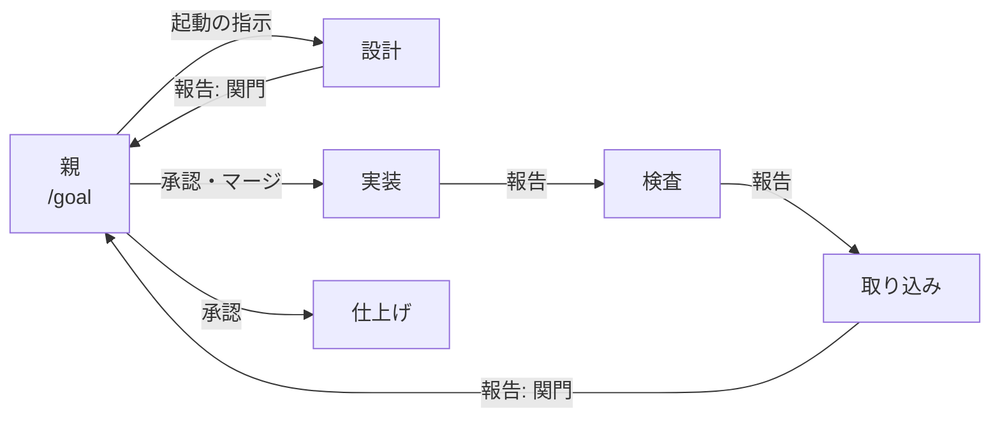
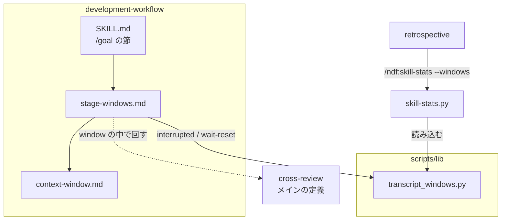
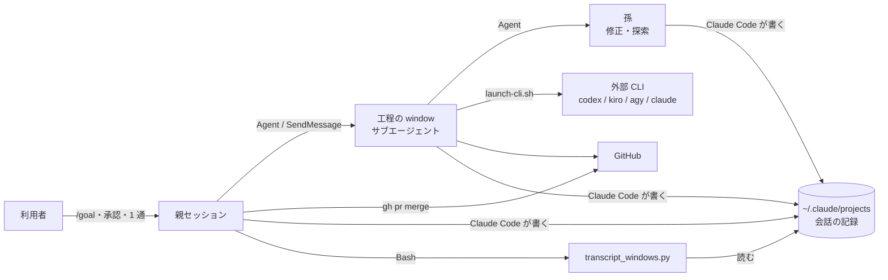
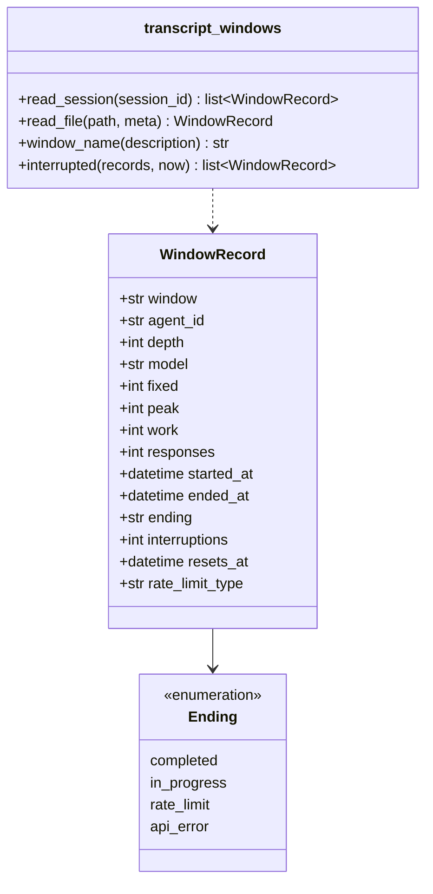
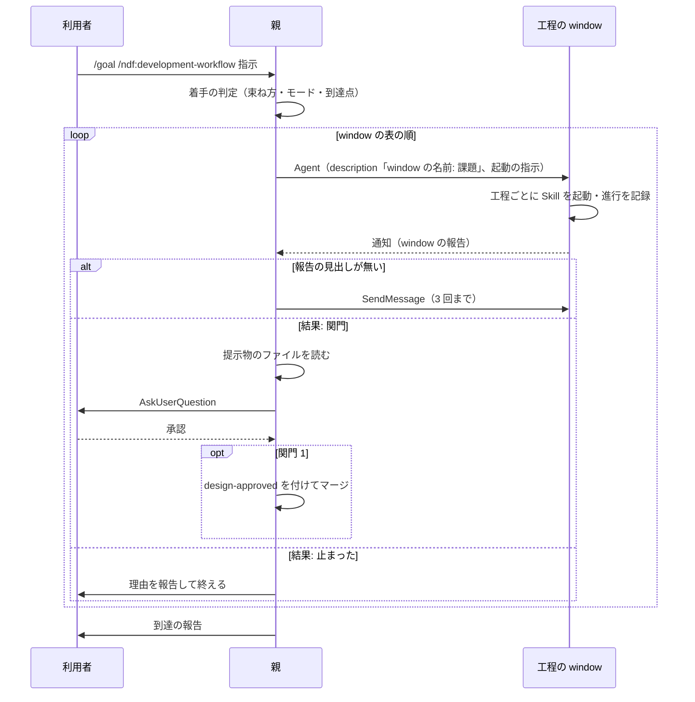
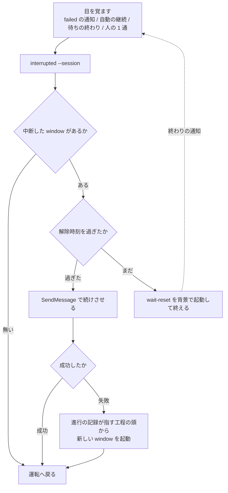

# #550 / #657: 工程を window へ出して無人で通し、window の大きさと中断を扱う

要求と受け入れ条件は [issue-550-657-requirements.md](issue-550-657-requirements.md) にある。この文書は「どう作るか」だけを扱う。
window の表・報告の形・起動の指示・測定の出力の形は [契約の文書](issue-550-657-design-contracts.md) が持つ。

**親は工程を 5 つの window へ分けて使い捨てのサブエージェントへ出し、自分は判定・承認・受け渡しだけを持つ。**
window の大きさと中断は会話の記録から読み、新しい保存先を作らない。



図の矢印は親を経由する受け渡しを省いて描いている。**window どうしが直接呼び合うことはない。** 報告は必ず親へ戻り、親が次の window を起動する。

## 機能一覧

| # | 機能 | 誰が使うか |
| --- | --- | --- |
| F1 | `/goal /ndf:development-workflow <指示>` で、工程を window へ出して関門以外を無人で通す | 利用者（`/goal` を打つ人） |
| F2 | 関門で親が承認を求め、承認の後に次の window を起動する | 利用者 |
| F3 | 報告の形を持たずに終わった window を続けさせる | 親 |
| F4 | window ごとに、window の名前・モデル・固定費・最大充填・実作業・応答数・所要・終わり方などを 1 行で出す（列は契約の文書の出力表） | 振り返りを書く人・`retrospective` |
| F5 | window の名前ごとに束ね、束ねる候補と割る候補を示す | 同上 |
| F6 | 利用上限で中断した window を見分け、解除時刻を過ぎてから再開する | 親 |
| F7 | 規約に、比の基準・モデルに依る目安とリポジトリに依る固定費の区別・「メイン」の定義を持つ | 規約を読む人とエージェント |

## 決定の記録

### 決定 1: 実装を 3 本に分け、測定 → 運転 → 中断と再開の順に入れる

測定を先に入れると、最初の無人の実行（運転の検証）から window の大きさを同じ物差しで読める。中断と再開は、測定が作る記録の読み取り部品で中断した window を一覧するため、測定の後に置く。運転と中断と再開はどちらも `stage-windows.md` を触るが、中断と再開は独立した節を足すだけで、運転の節を書き換えない。

1 本にまとめると、共通層の部品・3 つの Skill の文書・規約の新設が 1 つの差分に載り、レビューで読む単位が分からなくなる。運転を先に入れると、最初の実行の window を測れない。

| 順 | Pull Request | 課題 | 受け入れ条件 |
| ---: | --- | --- | --- |
| 1 | window の測定 | #550 | AC20〜AC35 |
| 2 | 無人の運転 | #550 | AC1〜AC16 |
| 3 | 中断と再開 | #657 | AC40〜AC48 |

AC60〜AC63 は 3 本がそろった後の配布とリリース後テストで確かめる。

### 決定 2: window は 5 つを初期値にし、関門を window の終わりに合わせる

window は **設計 / 実装 / 検査 / 取り込み / 仕上げ** の 5 つである。`context-window.md` の切れ目 4 点で切ると window は 5 つになり、関門 2 つはそれぞれ設計と取り込みの終わりに当たる（`operation` を除く。`operation` では設計の window が本番の系へ届く実行の前で関門 2 を返す。決定 7）。人の承認を待つ時間は数時間から数日に及ぶため、**待つ間に window を持ち続けない。**

| 切れ目（`context-window.md`） | window の境 |
| --- | --- |
| 1 ドキュメントレビューのマージの後 | 設計 → 実装。マージは関門 1 の承認を取った親が行う（決定 6） |
| 2 構造改善と実装レビューの前後 | 実装 → 検査 |
| 3 Pull Request を出した後 | 検査 → 取り込み |
| 4 配布の後 | 取り込み → 仕上げ。本番の承認が要るリポジトリでは、検証への配布の後・本番への配布の前で切る |

#550 の本文の表は、切れ目の側から 4 行で書いている。行を window に読み替えると後片付け〜配布が 1 つの window になり、関門 2 の承認待ちをその window が抱える。

モードごとの window の組み方は契約の文書の「window の表」が持つ。**関門を返さない window で、中身の工程がすべて飛ばされるものは作らない。**

### 決定 3: window の境は比で判断し、値は測定が持つ

**その window の実作業が固定費を上回るなら単独の window にし、下回るなら隣と束ねる。** 1 つの window の最大充填がモデルに依る目安を超えたら割る。固定費はリポジトリで 2.4 倍、同じリポジトリでも 3 倍ばらつくため、値を規約へ書くと導入先で判断が逆になる。

5 つの window は初期値であり、束ねるか割るかは振り返りで測定の表（決定 12）を見て決める。**判定は記録ごとの比で行い、中央値どうしを比べない。** 固定費はセッションの設定で変わるため、別のセッションの記録を束ねた中央値どうしを比べると、どの記録の比でもない値で判断することになる。**関門を返す window は、実作業が固定費を下回っても関門の前で切る。** 承認を待つ間に window を持ち続けない方を優先する。測定は window の名前しか持たないため、束ねる候補から名前で除くのは必ず関門を返す `設計` だけにする。関門を返した `取り込み` に印が付いたときは、振り返りで「関門の前で切るため束ねない」と判断を書く。

### 決定 4: 着手の判定は親が行い、読解だけを委ねる

課題の束ね方・Pull Request ごとのモード・到達点の置き直しは、親が最初の window を起動する前に決める。どの window を作り、どこで関門を返させるかがモードで決まるため、window の起動より先に要る。`context-window.md` の「モード判定は委譲しない」とも合う。

課題が多く本文の読解が親の window を埋めるときは、読解を探索のサブエージェントへ出し、触るファイル・依存・モードの手がかりを表で返させる。判定そのものは親が行う。要求の window （設計）の中で判定させる形は採らない。判定の前に、どの window を起動するかを決められない。

**設計の window が要求を書いた結果、モードを上げるべきだと分かったら、`結果: 止まった` と理由を返す。** 親が判定をやり直す。window は判定を変えない。

### 決定 5: 報告は見出しと項目が決まった形にし、次の window を報告が指す

window は最後の応答の末尾に `## window の報告` の見出しと、決まった 9 項目を置く（契約の文書の「報告の形」）。親は見出しの有無で報告の形を見分け、`次の window` の値で次を起動する。**親は工程表を読まない。**

自由文の要約を受け取ると、親は要約の要約を読むことになる（`context-window.md` の「返させる形を決める」）。承認の提示物は window がファイルへ書き、報告はパスだけを持つ。親は関門のときだけそのファイルを読む。

### 決定 6: 設計 Pull Request のマージは、承認を取った親が行う

親は承認を得た後、`design-approved` の印を付けて設計 Pull Request をマージし、それから実装の window を起動する。マージは 1 つのコマンドで済み、承認の印の判定（`workflow-guard.sh`）は `development-workflow` を起動した親のセッションで確実に働く。

実装の window の最初の手順でマージする形は採らない。印の判定がサブエージェントの Bash に掛かるかは確かめていない（未確認 U1）。掛からないと、設計の window が誤ってマージしたときに止める仕組みが無い。

### 決定 7: 本番の系へ届く操作は、承認を受け取った次の window が行う

配布は `release` の手順そのもので、1 つのコマンドに収まらない。`operation` の実行も `operation-run.md` の手順である。親がこれらを起動すると、親の window に手順が載る。承認は起動の指示の `承認` の項目で渡し、関門の次の window はその操作から始める。

| モード | 関門 2 を返す window | 承認を受け取って操作する window |
| --- | --- | --- |
| `operation` 以外 | 取り込み | 仕上げ（本番への配布から始める） |
| `operation` | 設計（本番の系へ届く実行の前） | 実装（実行から始める） |

設計のマージ（決定 6）と主体が違うのは、承認した操作の大きさが違うためである。印の判定に頼る操作は親が持ち、手順に頼る操作は window が持つ。

### 決定 8: window の中では、関門以外の Skill の確認を提示して進める

`pr` はブランチとファイルを示してから進め、`merged` は削除の一覧を示す。サブエージェントは `AskUserQuestion` を持たないため、確認を待つと window が止まる。起動の指示に「関門以外の確認は提示して進める」を入れる。**関門の 2 つだけは提示して進めず、`結果: 関門` で返す。**

**各 Skill の同意の規則とは次のように噛み合わせる。**

| Skill | その Skill が求める同意 | window の中での扱い |
| --- | --- | --- |
| `pr` | 暗黙に起動したときは push の前に明示の同意 | 起動の指示が工程として `pr` を名指しするため、「依頼が push と Pull Request の作成まで明示的に含む場合」に当たる。提示は行い、報告に含める |
| `merged` | 削除の一覧への同意 | **G1（#561）が取り消せる削除を同意なしにする。** それまでは window の中で止まるため、運転の Pull Request は #561 の実装の後に入れる |

`merged` の確認の要否そのものは G1（#561）が決める。この設計は window の中での扱いだけを決め、`merged` の手順を変えない。

### 決定 9: 報告の形を持たずに終わった window は、同じ window で 3 回まで続けさせる

cross-review / cross-refactoring の待ちで応答を終える事象（#656）は、親から見ると `completed` の通知で届く。親は報告の見出しが無ければ完了として扱わず、`SendMessage` で「報告の形で終えるまで続ける」と送る。**3 回続けても報告が出なければ、window の名前と最後の応答の 1 行を添えて止まる。** 上限の中断からの再開（決定 15）はこの回数に数えない。

回数を持たないと、壊れた window を無人で起こし続け、費用だけが増える。1 回で止めると、#656 の事象（04 の進行で 4 回）で毎回人が要る。

### 決定 10: モデルの既定は親と同じにし、落とす基準を 2 つ置く

`Agent` の `model` を省くと親と同じモデルで動く。**軽いモデルへ落としてよい window は、次の 2 つを両方満たす window である。**

1. window が決定・受け入れ条件・収束の判定を書かない
2. window の出力を、window の外の検査（継続的統合・承認の印の判定・後の window のレビュー）が受け止める

初期値の 5 つの window には、両方を満たすものが無い（取り込みは確定仕様化で文書を書く）。落とすかどうかは、測定で window を割った後に振り返りで決める。工程名で「この window は軽いモデル」と固定すると、束ね方を変えたときに基準と中身が食い違う。

### 決定 11: cross-review の「メイン」を、収束ループを駆動している window と定義する

「メイン context に diff を載せない」の対象は、`state.py` の骨組みを回している window である。無人の運転では設計と検査の window がそれに当たり、親ではない。修正は、その window が起動する孫のサブエージェントで行う（サブエージェントから孫を起動できることは #550 の実測にある）。

「メイン」を親と読むと、window の中で回す cross-review の修正を window が直接行ってよいことになり、window が diff で埋まる。

### 決定 12: window の記録を読む部品を共通層に 1 つ置き、2 つの Skill が読む

会話の記録を window の単位で読む処理は `plugins/ndf/scripts/lib/transcript_windows.py` に置く。`skill-stats` が集計に使い、`development-workflow` が中断した window の一覧と解除の待ちに使う。別の Skill の `scripts/` を呼ぶと、配る Skill を絞る配布先で解決できない（`scripts/check-cross-skill-refs.py`）。

新しい台帳（window を起動するたびに書くファイル）は作らない。記録（`subagents/agent-<id>.jsonl` と `.meta.json`）が工程名・モデル・トークン・時刻・中断をすべて持っており、台帳は同じ値の写しになる。写しは書き漏れたときに記録と食い違う。

### 決定 13: window の名前は起動時の `description` の最初の `: ` より前から取る

window は `<window の名前>: <課題番号…>`（例 `設計: #550 #657`）の `description` で起動する。`.meta.json` の `description` がそのまま残ることは 28 件で一致を確かめてある。最初の `: `（半角のコロンと空白）より前が window の名前のどれでもなければ `工程外` とし、親のセッションは `親` とする。**集計には window の名前だけを出し、`:` の後ろは出さない**（#159）。

### 決定 14: 固定費は最初の合成でない応答で取り、応答は `message.id` で数える

1 つの応答は複数の行に分かれて記録される（1 本の担当で 212 行、固有の応答 126 件）。行で数えると応答数が 7 割近く多く出る。合成の応答はトークンがすべて 0 で、最初の行がそれだと固定費が 0 になる。

`SendMessage` で続けた window は同じファイルへ追記され、固定費は最初の値のまま、最大充填は続けた後も含めた最大になる。**上限の中断から続けた回数を `interruptions` として別の列に出す**ため、続けた window と続けていない window を集計で分けられる。報告なしで続けさせた回数（決定 9）は記録から見分けられないため、この列に入れない。

### 決定 15: 上限の中断は、通知ではなく記録で見分ける

通知の本文は人が読む文言で、書式を約束していない。記録の合成の応答は `apiErrorStatus` と `quotaLimits.resetsAt` を値として持つ。**通知は目を覚ます契機にだけ使い、分類と解除時刻は記録から取る。** 親の window が自動の要約で通知を失っても、同じ一覧が得られる（AC47）。

### 決定 16: 再開は同じ window で続けるのを既定にし、工程の頭からを後段にする

`SendMessage` の再開は実測で成立しており（`Resuming agent`）、window の中の作業の認識を捨てずに済む。外部への書き込み（Pull Request・コメント・進行の記録）を済ませたかを window 自身が覚えているため、重ねて書かない。**`SendMessage` が失敗したときだけ**、進行の記録が指す工程の頭から新しい window を起動する。失敗は `SendMessage` の結果が `"success": true` を持たないことで見分ける（契約の文書の「中断の点検」）。

#657 の候補 2 は工程の頭からを既定にしていた。作業ツリーとブランチは残るため差分は失われないが、window の中で途中まで進めた判断（レビューの指摘のどれを直したか）は失われ、読み直しの費用が固定費に乗る。新しい window は、起動の指示の「書く前に既存を確かめる」規則で重ねる書き込みを防ぐ。

### 決定 17: 解除を待つ手段を 3 段にする

| 段 | 何が親を起こすか | いつ使うか |
| ---: | --- | --- |
| 1 | Claude Code の自動の継続（解除時刻に入力が積まれる） | 親も上限に当たったとき。親は何もできないため、これに頼るしかない |
| 2 | 背景で起動した待ち（`transcript_windows.py wait-reset`）の終わりの通知 | 親は動けるが window だけが中断したとき。解除時刻まで眠り、終わると親が起きる |
| 3 | 人が送る 1 通（例:「続けて」） | 1 と 2 のどちらも起きなかったとき。承認ではなく、関門に数えない |

どの段で起きても、親は同じ「中断の点検」（契約の文書）を 1 回行う。**`/goal` の見回りには頼らない。** 見回りは 120 分の後に止まる（要求の文書の実測）。固定の間隔で起きて一覧を見る形は採らない。上限の間に起きても何もできず、解除の前に再開すると同じ上限で落ちる。

### 決定 18: `StopFailure` フックは使わない

Claude Code 2.1.273 は、API の失敗で応答が終わったときに `StopFailure` を発火する（照合する値に `rate_limit` を持つ）。ただし出力も終了コードも無視されるため、親を起こせない。記録を残す用途なら、同じ値が会話の記録に既にある（決定 12）。

### 決定 19: 中断と再開の規約を、新設の `stage-windows.md` に置く

中断は並行していなくても起きる（window が 1 つでも上限に当たる）。並行の本数や下限を扱う `parallel-work.md` へ置くと、並行しないときに読まれない。`parallel-work.md` は G2（#540 #541 #621）が触るため、節を足すと差分が重なる。**無人でない進行（人が指示して担当を起動する形）にも同じ手順が効くよう、対象を「親が起動した担当」と書く。**

### 決定 20: `/goal` の節は入口だけを残し、細部を参照文書へ移す

`development-workflow/SKILL.md` は 500 行で、分割の基準（`scripts/check-doc-line-limit.py`）に達している。`/goal` の節の「到達点を置き直す」の小節（約 30 行）を `stage-windows.md` へ移し、節には window へ出すことと参照先だけを残す。**節の行数を今より増やさない。** 同じ `SKILL.md` の「人手の承認を求める関門」の節を G1 が触るため、行数の余りを G3 が使い切らない。

### 決定 21: `/goal` でない呼び出しでは window へ出さない

対話で `/ndf:development-workflow` を呼んだときは、人がその場にいて、工程ごとに指示を変えられる。window へ出すのは `/goal` の引数として呼ばれたときだけにし、対話の進め方を変えない（AC14）。

## 構成要素

| 要素 | 新設 / 変更 | 責務 |
| --- | --- | --- |
| `development-workflow/references/stage-windows.md` | 新設 | window の表・親の責務・起動の指示・報告の形・続けさせる回数・モデルの基準・中断と再開・到達点の置き直し。**500 行以下に収める**（`check-doc-line-limit.py`）。超えるときは中断と再開を `stage-interruptions.md` へ分ける |
| 3 つの規約の文書の用語 | 変更 | コンテキストの window を指す語を `window` に揃える（AC16）。対象は `SKILL.md`・`context-window.md`・`stage-windows.md` の本文で、ファイル名は変えない |
| `development-workflow/SKILL.md` の「`/goal` の引数として呼ばれたとき」 | 変更 | window へ出すことと参照先。到達点の置き直しを移した後の入口 |
| `development-workflow/SKILL.md` の「参照」 | 変更 | `stage-windows.md` の 1 行 |
| `development-workflow/references/context-window.md` | 変更 | 比の基準、モデルに依る目安とリポジトリに依る固定費の区別、window の運転への参照 |
| `cross-review/SKILL.md` | 変更 | 「メイン」の定義 |
| `scripts/lib/transcript_windows.py` | 新設 | 記録を window の単位で読む。`list` / `interrupted` / `wait-reset` の 3 つのコマンド |
| `scripts/lib/README.md` | 変更 | 置いてあるものの表の 1 行 |
| `skill-stats/scripts/skill-stats.py` | 変更 | `--windows` / `--session` / `--window-limit` と、window の名前ごとの束ね |
| `skill-stats/SKILL.md` | 変更 | window の測定の使い方と集計項目 |
| `retrospective/SKILL.md` | 変更 | 手順 2 の観点「window」、記録の雛形の window の表 |



図には呼び出しと読み込みの関係だけを描く。`scripts/lib/README.md` と `skill-stats/SKILL.md` は、部品と引数を説明する文書で、呼び出しの関係を持たないため図に含めない。

## 文脈と配置



| 実行の単位 | 動く場所 | 境界 |
| --- | --- | --- |
| 親セッション | 利用者の端末の Claude Code | 承認を取れる唯一の主体 |
| 工程の window・孫 | 親と同じプロセスのサブエージェント | window ごとに文脈が別。利用上限は親と共有する |
| `transcript_windows.py` | 親または window の Bash | 記録を読むだけ。ネットワークを使わない |

## パッケージ構成

```text
plugins/ndf/
├── scripts/
│   ├── lib/
│   │   ├── transcript_windows.py        新設
│   │   └── README.md                    1 行
│   └── tests/
│       ├── test_transcript_windows.py   新設
│       └── fixtures/transcript_windows/ 新設（実物から作った最小の記録）
└── skills/
    ├── development-workflow/
    │   ├── SKILL.md                     /goal の節・参照
    │   ├── references/stage-windows.md  新設
    │   ├── references/context-window.md
    │   └── tests/test_stage_windows_doc.py  新設
    ├── cross-review/SKILL.md            メインの定義
    ├── skill-stats/
    │   ├── SKILL.md
    │   ├── scripts/skill-stats.py
    │   └── tests/test_windows_report.py 新設
    └── retrospective/
        ├── SKILL.md
        └── tests/test_windows_section.py 新設
```

## 構造



## 処理の流れ

### 無人の運転（A）



### 中断の点検（C）



親自身が上限に当たっているときは、B より前で応答が失敗する。そのときは自動の継続（決定 17 の段 1）か人の 1 通が A になる。

## 非機能の実現方式

| 大項目 | 要求 | 実現方式 |
| --- | --- | --- |
| 性能・拡張性 | window 1 つの最大充填が目安を超えない。総消費の増え方を見られる | window の境を関門と切れ目に合わせる（決定 2）。`skill-stats --windows` の window の名前ごとの束ねで、割る候補と束ねる候補に印を付ける（決定 3）。目安は `--window-limit` で渡し、既定は `context-window.md` の「遅くとも切る」値に合わせる |
| 運用・保守性 | 中断・再開・続けさせた回数が残る | 上限の中断と再開は記録の `interruptions` と `ending` に出る（決定 14）。報告なしで続けさせた回数は記録から見分けられないため、親が到達の報告（止まったときは止まる前の報告）に window ごとに載せる（決定 9） |
| セキュリティ | 送信しない。出力にパス・本文・プロンプトを含めない | 部品は標準ライブラリだけで、ネットワークを呼ばない。出力の列は契約の文書の表に限り、`description` は window の名前だけを出す（決定 13）。`agent_id` は `list` と `interrupted` の出力にだけ出し、`skill-stats` の集計には出さない（再開に要る） |
| システム環境 | 自動の継続が無い版でも工程が失われない | 決定 17 の段 3。window の記録はファイルに残るため、どの段で起きても同じ点検で再開できる |

## テスト設計

| 受け入れ条件 | 何で確かめるか |
| --- | --- |
| AC1・AC2・AC5・AC6・AC7・AC60 | リリース後テストで `light` の課題 1 件を `/goal` で通し、親のセッションの記録を読む（人の入力の数、親の報告の window の一覧の回数と記録の `SendMessage` の数の一致、`skill-stats --session`（`--windows` なし）が親の記録だけで数えた Skill の呼び出し数、issue の `## 進行`）。`--session` を付けた Skill の統計が親の記録だけを数えることは `test_windows_report.py` で固定する |
| AC3・AC4・AC5・AC9・AC10・AC12・AC14・AC15 | `test_stage_windows_doc.py`: `stage-windows.md` に window の表（5 つの window と関門の列）・報告の 9 項目・続けさせる回数 3・親の報告の window の一覧（5 列）・モデルの基準 2 つ・関門以外の確認の扱いがあること。規約の文書に `固定費` と並ぶ 5 桁以上の数値が無いこと。`/goal` の節に window へ出すのは `/goal` のときだけと書かれていること |
| AC8・AC62 | 既存の `test_approval_gates.py` / `test_workflow_guard.py` がそのまま通ること。関門の数を数える既存のテスト |
| AC11 | `test_stage_windows_doc.py`: `cross-review/SKILL.md` に「メイン」の定義の文があること |
| AC16 | `test_stage_windows_doc.py`: `SKILL.md`・`context-window.md`・`stage-windows.md` の本文に「窓」が現れないこと |
| AC13 | 同上: `context-window.md` に「モデルに依る」と「リポジトリに依る」の両方の語と、比の基準の文があること。`skill-stats` の `--window-limit` の既定値が `context-window.md` の「遅くとも N 万で切る」の N × 10000 と一致すること（片方だけ書き換わったら落ちる） |
| AC20〜AC25・AC27・AC31 | `test_transcript_windows.py`: フィクスチャ（重複行 3 行・先頭の合成の応答・429 で終わる記録・続けて完了した記録・孫・壊れた行）で各列の値を固定する |
| AC26・AC30 | 同上: `description` が window の名前で始まるもの・始まらないもの・`:` の後ろに課題番号を持つもの。出力の JSON に `description` の後ろ半分・パス・本文が含まれないこと |
| AC21・AC28・AC29・AC32・AC35 | `test_windows_report.py`: 親の行、同じ window の名前でモデルの違う記録が別の行になること、応答 3 回未満の除外件数、束ねる候補（関門を返す window には付かない）と割る候補の印、固定費の違う 2 セッションを渡しても判定が記録ごとの比で決まること、`--windows` を付けない既定の出力が変わらないこと（既定の出力の見出し行の一致） |
| AC33 | `test_windows_section.py`: 手順 2 の表に「window」の行、雛形に window の表があること |
| AC34 | `test_transcript_windows.py`: `socket` を塞いだ状態でコマンドが終了コード 0 で終わる |
| AC40・AC41・AC46・AC47 | `test_transcript_windows.py`: 中断した window が 2 本・完了した window が 1 本のセッションで、`interrupted` が 2 本だけを `resets_at` 付きで返す。429 で止まった孫（深さ 2）は返さない。429 の後に `user` の行が追記された window は `in_progress` になり、`interrupted` に現れない |
| AC44 | 同上: `wait-reset` が解除時刻を過ぎていれば直ちに終わり、未来の時刻なら差の秒数だけ眠る。解除時刻の違う 2 つの window では、早い方の時刻まで眠る（眠る関数を差し替えて秒数を見る） |
| AC42・AC43・AC45・AC48 | 自動の継続が入った後の点検は決定的である（`interrupted` の出力と `SendMessage` の結果だけで分岐する）。`test_transcript_windows.py` で、自動の継続の行（`origin.kind` が `auto-continuation`）が追記された親の記録と 429 で止まった window の記録から、`interrupted` が解除済みの window を返すことを固定する。`test_stage_windows_doc.py` で、点検の契機に自動の継続・人の 1 通・待ちの終わりが並ぶことと手順 1〜4 を固定する。自動の継続の発火そのもの（U2）と実際の再開は、リリース後テストで発生した実行の記録を読む |
| AC61 | #550 #657 のまとまりの振り返り（このまとまり自体は `standard` で、振り返りの工程を通る）の記録に、AC60 の実行の window の表と判断があること |
| AC63 | `python3 scripts/check-skill-frontmatter.py`・`uv run --with pytest pytest scripts/tests plugins/ndf -q`・`python3 scripts/check-doc-line-limit.py` |

## 他の束との境界

| 束 | 重なりうるもの | 扱い |
| --- | --- | --- |
| G1（#561 #623） | `development-workflow/SKILL.md`（G1 は「人手の承認を求める関門」、G3 は「`/goal` の引数として呼ばれたとき」と「参照」）。`merged` の確認の要否 | 節を分ける。G3 は `SKILL.md` の行数を増やさない（決定 20）。**運転の Pull Request（決定 1 の 2 本目）は #561 の実装の後に入れる。** `merged` の削除の同意が残ったままだと、実装と取り込みの window が確認待ちで止まる（決定 8）。測定と中断と再開の Pull Request は #561 に依らない |
| G2（#540 #541 #621） | `parallel-work.md`・`issue-plan-strategy`（親が着手の判定で使う） | G3 は両方とも編集しない。並行の本数と実行計画は G2 の規約に従う、と `stage-windows.md` から参照するだけにする |
| G4（#554） | なし | — |
| #656（マイルストーン 06） | 待ちで応答を終える事象 | G3 は親の側で報告の形を持たない終わりとして拾う（決定 9）。Skill の側の直しは #656 |
| #487（マイルストーン 05） | 進行の記録が 1 回の実行で 1 件 | 起動の指示で「1 回の Bash 実行に 1 件」を課す。#487 が直れば指示の 1 行を消す |

## 未確認のまま残ること

| # | 項目 | 内容 | いつ決まるか |
| --- | --- | --- | --- |
| U1 | 承認の印の判定がサブエージェントに掛かるか | 決定 6 で親がマージするため、掛からなくても関門は保たれる。**掛からないと、window の中の進行の記録が通過工程の控えに積まれない**。その場合は起動の指示で window の最初に `development-workflow` を「判定済み」として起動し、判定を登録させる（固定費が増える分は測定で見る） | 運転の Pull Request の実装 |
| U2 | 自動の継続が 5 時間の上限・見回りが止まった後でも入るか | 入らなければ決定 17 の段 3 で運用する | リリース後テスト |
| U3 | 背景の待ちを数時間続けられるか | 続かなければ、契約の文書の「中断の点検」の手順 4 に `--max-sleep 540` を付ける運用へ切り替える（同じ節の注記） | 中断と再開の Pull Request の実装 |
| U4 | 親を `--resume` で開き直した後も `SendMessage` が効くか | 効かなければ決定 16 の後段へ落ちる | 同上 |
| U5 | window のモデルを親と変えたとき、上限を共有しない場合があるか | `rateLimitType` の値の種類を集める。共有しない場合は決定 17 の段 2 が働く | 同上 |
| U6 | window の名前の `:` を含む `description` が、通知と `.meta.json` で同じ値のまま残るか | 28 件の一致は `:` を含まない値で確かめた | 測定の Pull Request の実装 |
