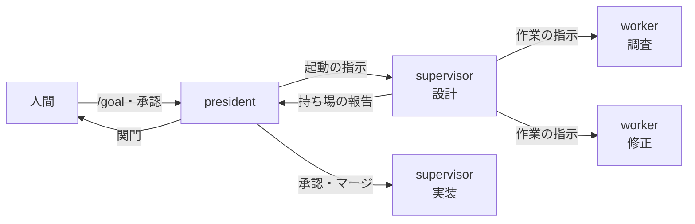
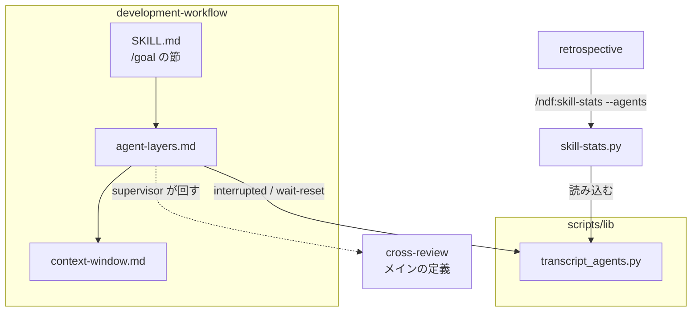
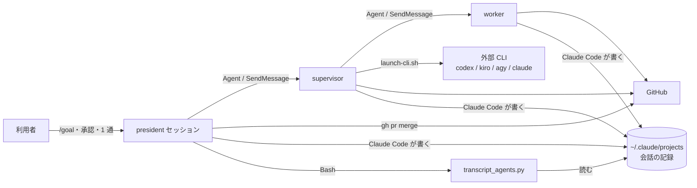
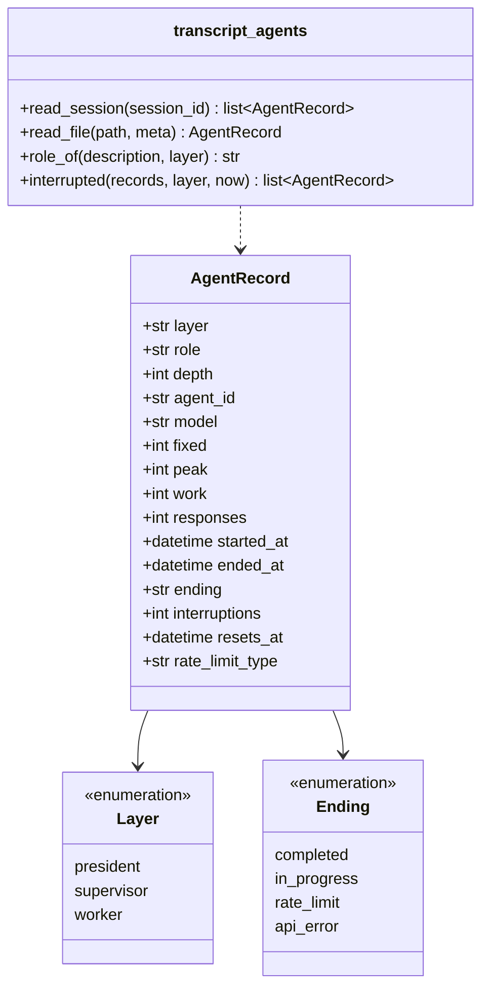
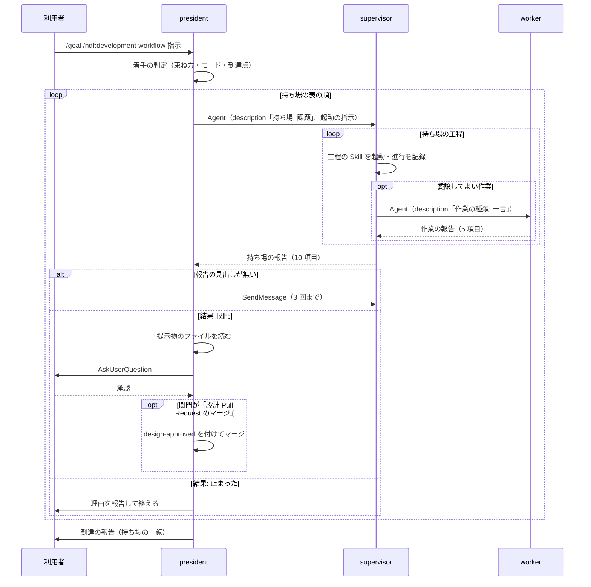
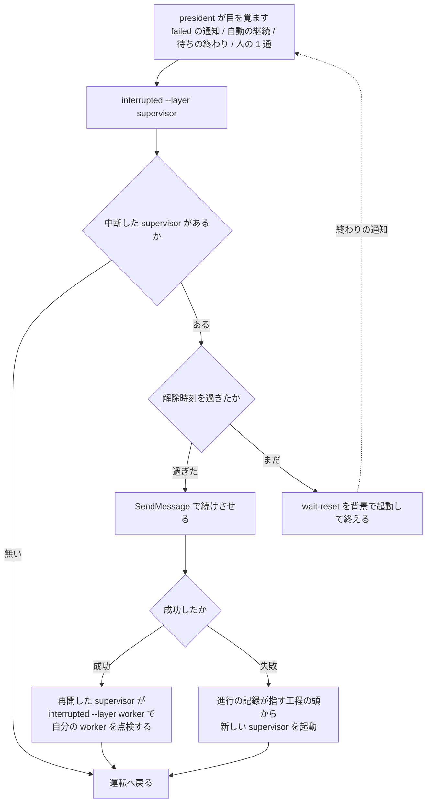

# #550 / #657: 工程を president / supervisor / worker の 3 層で通し、context window を測る

要求と受け入れ条件は [issue-550-657-requirements.md](issue-550-657-requirements.md) にある。この文書は「どう作るか」だけを扱う。
用語（president / supervisor / worker / 持ち場 / context window）は、その文書の「用語」の表が持つ。
持ち場の表・報告の形・起動の指示・測定の出力の形は [契約の文書](issue-550-657-design-contracts.md) が持つ。

**president は人間と話し、supervisor は持ち場を通し、worker は 1 つの作業を行う。**
context window の大きさと中断は会話の記録から読み、新しい保存先を作らない。



図は 1 つの持ち場だけを描いている。**worker の報告は supervisor で畳まれ、president へは持ち場の報告 1 件だけが届く。**

## 機能一覧

| # | 機能 | 誰が使うか |
| --- | --- | --- |
| F1 | `/goal /ndf:development-workflow <指示>` で、工程を 3 層へ出して関門以外を無人で通す | 利用者（`/goal` を打つ人） |
| F2 | 関門で president が承認を求め、承認の後に次の supervisor を起動する | 利用者 |
| F3 | 報告の形を持たずに終わった下の層を、上の層が続けさせる | president / supervisor |
| F4 | 記録 1 件につき、層・持ち場・モデル・固定費・最大充填・実作業などを 1 行で出す（列は契約の文書の出力表） | 振り返りを書く人・`retrospective` |
| F5 | 層ごとの合計と、持ち場ごとの束ねる候補・割る候補・worker を使いすぎの印を出す | 同上 |
| F6 | 利用上限で中断した相手を層ごとに見分け、解除時刻を過ぎてから直下だけを再開する | president / supervisor |
| F7 | 規約に、3 層の責務・比の基準・モデルに依る目安とリポジトリに依る固定費の区別・「メイン」の定義を持つ | 規約を読む人とエージェント |

## 決定の記録

### 決定 1: 実装を 3 本に分け、測定 → 運転 → 中断と再開の順に入れる

測定を先に入れると、最初の無人の実行（運転の検証）から 3 層の context window を同じ物差しで読める。中断と再開は、測定が作る読み取り部品で中断した記録を層ごとに一覧するため、測定の後に置く。運転と中断と再開はどちらも `agent-layers.md` を触るが、中断と再開は独立した節を足すだけで、運転の節を書き換えない。

1 本にまとめると、共通層の部品・3 つの Skill の文書・規約の新設が 1 つの差分に載り、レビューで読む単位が分からなくなる。

| 順 | Pull Request | 課題 | 受け入れ条件 |
| ---: | --- | --- | --- |
| 1 | context window の測定 | #550 | AC20〜AC37 |
| 2 | 無人の運転 | #550 | AC1〜AC19 |
| 3 | 中断と再開 | #657 | AC40〜AC49 |

AC60〜AC64 は 3 本がそろった後の配布とリリース後テストで確かめる。

### 決定 2: 3 層の責務を、問える相手・持つ単位で分ける

**分け方の軸は 2 つである。** 人間へ問えるか（`AskUserQuestion` を持つのは president だけ）と、何の単位を持つか（president はまとまり、supervisor は持ち場、worker は 1 つの作業）である。

| 層 | 持つもの | 起動する相手 | 持たないもの |
| --- | --- | --- | --- |
| president | 着手の判定（束ね方・モード・到達点）、関門での問い、承認の受け渡し、supervisor の起動と再開、最後の報告 | supervisor | 工程の Skill の実行。**`development-workflow` と `issue-plan-strategy` 以外を起動しない** |
| supervisor | 1 つの持ち場の工程、工程の Skill の起動、進行の記録、収束の判定、worker の起動と再開、持ち場の報告 | worker | 人間への問い、マージ（関門 1）、承認のない本番の操作 |
| worker | 1 つの作業（調査・修正・検証・集計）と、その作業の報告 | 起動しない | 人間への問い、進行の記録、収束の判定、設計の決定 |

**worker を葉にするのは、深さ 3 を実測していないためである**（要求の前提 2）。深さ 2 までは #550 の実測で確かめてある。

### 決定 3: supervisor の単位は工程 1 つではなく、切れ目で区切った持ち場にする

**持ち場は 設計 / 実装 / 検査 / 取り込み / 仕上げ の 5 つである。** `context-window.md` の切れ目 4 点で切ると 5 つになり、関門 2 つはそれぞれ設計と取り込みの終わりに当たる（`operation` を除く。`operation` では設計の持ち場が本番の系へ届く実行の前で関門 2 を返す。決定 8）。

**工程 1 つに supervisor 1 つとしない。** 工程表の行は 18 あり、1 行ごとに supervisor を立てると固定費が 18 回掛かる。前の工程の出力がそのまま次の判断の入力になる工程（要求 → モード判定 → 作業場所の用意、1 本の Pull Request の実装）は、`context-window.md` が「切らない」と定めている。

| 切れ目（`context-window.md`） | 持ち場の境 |
| --- | --- |
| 1 ドキュメントレビューのマージの後 | 設計 → 実装。マージは関門 1 の承認を取った president が行う（決定 7） |
| 2 構造改善と実装レビューの前後 | 実装 → 検査 |
| 3 Pull Request を出した後 | 検査 → 取り込み |
| 4 配布の後 | 取り込み → 仕上げ。本番の承認が要るリポジトリでは、検証への配布の後・本番への配布の前で切る |

単位は工程表の単位に合わせる。設計・実装・検査は Pull Request、取り込みと仕上げはまとまりである（契約の文書の「持ち場の表」）。

### 決定 4: worker へ出すのは `context-window.md` の「委譲してよい」の行に限る

**新しい判断基準を作らない。** あの表は既に、委譲してよい対象（探索・全文の読解と要点の取り出し・テストの出力やログや差分の集計・指摘の修正・範囲外の課題の下調べ）と、委譲しない対象（モード判定・関門の判断・収束の判定・設計の決定と理由の記録・受け入れ条件の書き換え）を定めている。

| 作業の種類 | 何をさせるか | 出どころ |
| --- | --- | --- |
| `調査` | どのファイルにあるかの探索、全文の読解と要点の取り出し、範囲外の課題の下調べ | `context-window.md` の委譲の表 |
| `修正` | レビューの指摘の修正と push | 同上（`cross-review` は「必ずサブエージェント」と定める） |
| `検証` | テストと検査のコマンドの実行、失敗の要約 | 同上（テストの出力の集計） |
| `集計` | 差分・ログ・記録の集計 | 同上 |

**supervisor は、委譲しない対象を自分で行う。** worker が返すのは項目と場所と根拠であって、判断ではない。

### 決定 5: 報告を 2 段に分け、worker の報告を president へ転送しない

worker は「作業の報告」（5 項目）を supervisor へ返し、supervisor はそれを畳んで「持ち場の報告」（10 項目）を president へ返す。**president が 1 つの持ち場について読むのは 1 件である。**

`context-window.md` の「数を増やすことは対策にならない」がこの設計の理由である。worker を 5 つ使っても president の読む量が変わらないため、層を増やしたことが president の context window を押し上げない。**押し上がるのは固定費の合計であり、それは測定（決定 17）が見せる。**

### 決定 6: 着手の判定は president が行い、読解だけを worker へ出す

課題の束ね方・Pull Request ごとのモード・到達点の置き直しは、president が最初の supervisor を起動する前に決める。どの持ち場を作り、どこで関門を返させるかがモードで決まるためである。`context-window.md` の「モード判定は委譲しない」とも合う。

課題が多く本文の読解が president の context window を埋めるときは、**読解だけを worker へ出す**（president が直接 worker を起動する唯一の場面である）。判定そのものは president が行う。

**設計の持ち場でモードを上げるべきだと分かったら、supervisor は `結果: 止まった` と理由を返す。** president が判定をやり直す。supervisor は判定を変えない。

### 決定 7: 設計 Pull Request のマージは、承認を取った president が行う

president は承認を得た後、`design-approved` の印を付けて設計 Pull Request をマージし、それから実装の supervisor を起動する。マージは 1 つのコマンドで済み、承認の印の判定（`workflow-guard.sh`）は `development-workflow` を起動した president のセッションで確実に働く。

supervisor の最初の手順でマージする形は採らない。印の判定がサブエージェントの Bash に掛かるかは確かめていない（未確認 U1）。

### 決定 8: 本番の系へ届く操作は、承認を受け取った次の supervisor が行う

配布は `release` の手順そのもので、1 つのコマンドに収まらない。`operation` の実行も `operation-run.md` の手順である。president がこれらを起動すると、president の context window に手順が載る。承認は起動の指示の `承認` の項目で渡す。

| モード | 関門 2 を返す持ち場 | 承認を受け取って操作する持ち場 |
| --- | --- | --- |
| `operation` 以外 | 取り込み | 仕上げ（本番への配布から始める） |
| `operation` | 設計（本番の系へ届く実行の前） | 実装（実行から始める） |

### 決定 9: 関門以外の Skill の確認は、提示して進める

`pr` はブランチとファイルを示してから進め、`merged` は削除の一覧を示す。supervisor も worker も `AskUserQuestion` を持たないため、確認を待つと止まる。起動の指示に「関門以外の確認は提示して進める」を入れる。**関門の 2 つだけは提示して進めず、`結果: 関門` で返す。**

| Skill | その Skill が求める同意 | 3 層での扱い |
| --- | --- | --- |
| `pr` | 暗黙に起動したときは push の前に明示の同意 | 起動の指示が工程として `pr` を名指しするため、「依頼が push と Pull Request の作成まで明示的に含む場合」に当たる |
| `merged` | 削除の一覧への同意 | **G1（#561）が取り消せる削除を同意なしにする。** それまでは supervisor が止まるため、運転の Pull Request は #561 の実装の後に入れる |

### 決定 10: 報告の形を持たずに終わった相手は、同じ相手で 3 回まで続けさせる

cross-review / cross-refactoring の待ちで応答を終える事象（#656）は、上の層から見ると `completed` の通知で届く。**規則は層をまたいで同じにする。** 上の層は報告の見出しが無ければ完了として扱わず、`SendMessage` で「報告の形で終えるまで続ける」と送る。3 回続けても報告が出なければ、相手の名前と最後の応答の 1 行を添えて上へ返す。上限の中断からの再開（決定 19）はこの回数に数えない。

### 決定 11: モデルの既定は上の層と同じにし、落とすのは worker から始める

`Agent` の `model` を省くと上の層と同じモデルで動く。**軽いモデルへ落としてよいのは、次の 2 つを両方満たす相手である。**

1. 決定・受け入れ条件・収束の判定を書かない
2. 出力を、その外の検査（継続的統合・承認の印の判定・後の持ち場のレビュー・supervisor の読み直し）が受け止める

**worker の `調査` と `集計` は 2 つとも満たす。** supervisor は満たさない（収束の判定と進行の記録を持つ）。初期値は全層で既定のモデルとし、落とすかどうかは測定（決定 17）を見て振り返りで決める。

### 決定 12: cross-review の「メイン」を、収束ループを駆動している supervisor と定義する

「メイン context に diff を載せない」の対象は、`state.py` の骨組みを回している層である。3 層では設計と検査の持ち場の supervisor がそれに当たり、president ではない。修正は、その supervisor が起動する worker（作業の種類 `修正`）で行う。

### 決定 13: 記録を読む部品を共通層に 1 つ置き、3 層をまとめて読む

会話の記録を層の単位で読む処理は `plugins/ndf/scripts/lib/transcript_agents.py` に置く。`skill-stats` が集計に使い、`development-workflow` が中断した記録の一覧と解除の待ちに使う。別の Skill の `scripts/` を呼ぶと、配る Skill を絞る配布先で解決できない（`scripts/check-cross-skill-refs.py`）。

新しい台帳（起動のたびに書くファイル）は作らない。記録（`<セッション>.jsonl` と `subagents/agent-<id>.jsonl` と `.meta.json`）が層・持ち場・モデル・トークン・時刻・中断をすべて持つ。

### 決定 14: 層は深さで決め、持ち場と作業の種類は `description` の先頭語から取る

層を `description` へ書かせない。`spawnDepth` が既に深さを持ち、president の記録は `subagents/` の外にある。**書かせると、書き忘れた相手が層の分からない行になる。**

| 層 | 決め方 | `description` の形 |
| --- | --- | --- |
| president | `<セッション>.jsonl`（深さ 0） | — |
| supervisor | `spawnDepth` が 1 | `<持ち場>: <課題番号…>`（例 `設計: #550 #657`） |
| worker | `spawnDepth` が 2 以上 | `<作業の種類>: <一言>`（例 `調査: 既存の規約の突き合わせ`） |

先頭語（最初の `: ` より前）が語彙に無ければ `その他` とする。**集計に出すのは語彙の値だけで、`: ` の後ろは出さない**（#159）。

### 決定 15: 固定費は最初の合成でない応答で取り、応答は `message.id` で数える

1 つの応答は複数の行に分かれて記録される（1 本で 212 行、固有の応答 126 件）。行で数えると応答数が 7 割近く多く出る。合成の応答はトークンがすべて 0 で、最初の行がそれだと固定費が 0 になる。

`SendMessage` で続けた記録は同じファイルへ追記され、固定費は最初の値のまま、最大充填は続けた後も含めた最大になる。**上限の中断から続けた回数を `interruptions` として別の列に出す**（429 の合成の応答のうち、後ろに合成でない応答が続くものの数）。

### 決定 16: 粒度の基準は supervisor に当て、worker には別の印を置く

**「実作業が固定費を上回るなら単独、下回るなら隣と束ねる」は supervisor の持ち場に当てる。** 持ち場は分割と結合の単位であり、worker は使い捨ての読解で、実作業が固定費を下回ってよい（返す量が小さいことが目的である）。

**worker の使いすぎは別の形で見る。** 1 つの持ち場について、supervisor と配下の worker の固定費の合計が supervisor の実作業を上回ったら「worker を使いすぎ」の印を付ける。読む量に対して固定費の方が大きくなった状態であり、`context-window.md` の「読む量が変わらない委譲は、費用だけを増やす」に当たる。

判定は記録ごとの比で行い、中央値どうしを比べない。固定費はセッションの設定で変わるため、別のセッションの記録を束ねた中央値どうしを比べると、どの記録の比でもない値で判断することになる。

### 決定 17: 層ごとの合計を出し、層を増やした費用を見えるようにする

**層を増やすと固定費の合計が増える。** 2 層のときは president + 持ち場の数だけだったものが、3 層では worker の数だけ足される。設計の判断に入れるため、測定は**層ごとの件数・固定費の合計・実作業の合計と、総消費**を 1 つの表に出す（AC36）。

この表は「worker を減らす／束ねる」の判断に使う。**総消費を下げること自体は目的にしない。** 目的は 1 つの context window を劣化の域へ入れないことで、総消費はその代償である（`context-window.md` の「粒度は 2 つの上限のつり合いで決まる」）。

### 決定 18: 上限の中断は、通知ではなく記録で見分ける

通知の本文は人が読む文言で、書式を約束していない。記録の合成の応答は `apiErrorStatus` と `quotaLimits.resetsAt` を値として持つ。**通知は目を覚ます契機にだけ使い、分類と解除時刻は記録から取る。** 上の層が自動の要約で通知を失っても、同じ一覧が得られる（AC47）。

### 決定 19: 再開は直下だけを見る

**上の層は、自分が起動した相手だけを再開する。** president は supervisor（深さ 1）を、supervisor は worker（深さ 2）を再開する。president が worker を直接再開すると、再開した supervisor と worker が同じ作業や外部への書き込みを重ねる。

| 落ちた層 | 検知する側 | 再開する側 | 起こす手段 |
| --- | --- | --- | --- |
| worker | supervisor（失敗の通知）。supervisor も落ちていれば president が supervisor を起こした後に supervisor が見る | supervisor | supervisor が生きていれば `SendMessage`。生きていなければ president → supervisor → worker の順 |
| supervisor | president（失敗の通知） | president | `SendMessage`。失敗したら進行の記録が指す工程の頭から新しい supervisor |
| president | 人間か Claude Code（自動の継続） | president 自身 | 自動の継続・人の 1 通・背景の待ちの終わり（決定 20） |

**3 層は同じ割り当てを共有するため、同時に落ちるのが普通である**（要求の実測）。そのときは president が起きた後に上から順に 1 段ずつ再開する。

### 決定 20: 解除を待つ手段を 3 段にする

| 段 | 何が president を起こすか | いつ使うか |
| ---: | --- | --- |
| 1 | Claude Code の自動の継続（解除時刻に入力が積まれる） | president も上限に当たったとき。president は何もできないため、これに頼るしかない |
| 2 | 背景で起動した待ち（`transcript_agents.py wait-reset`）の終わりの通知 | president は動けるが下の層だけが中断したとき |
| 3 | 人が送る 1 通（例:「続けて」） | 1 と 2 のどちらも起きなかったとき。承認ではなく、関門に数えない |

どの段で起きても、president は同じ「中断の点検」（契約の文書）を 1 回行う。**`/goal` の見回りには頼らない。** 見回りは 120 分の後に止まる（要求の実測）。

### 決定 21: `StopFailure` フックは使わない

Claude Code 2.1.273 は、API の失敗で応答が終わったときに `StopFailure` を発火する（照合する値に `rate_limit` を持つ）。ただし出力も終了コードも無視されるため、president を起こせない。記録を残す用途なら、同じ値が会話の記録に既にある（決定 13）。

### 決定 22: 3 層の規約を新設の `agent-layers.md` に置き、中断と再開も同じ文書へ入れる

中断は並行していなくても起きる（supervisor が 1 つでも上限に当たる）。並行の本数を扱う `parallel-work.md` へ置くと、並行しないときに読まれない。`parallel-work.md` は G2（#540 #541 #621）が触るため、節を足すと差分が重なる。**無人でない進行（人が指示してサブエージェントを起動する形）にも同じ手順が効くよう、対象を「上の層が起動した相手」と書く。**

### 決定 23: `/goal` の節は入口だけを残し、細部を参照文書へ移す

`development-workflow/SKILL.md` は 500 行で、分割の基準（`scripts/check-doc-line-limit.py`）に達している。`/goal` の節の「到達点を置き直す」の小節（約 30 行）を `agent-layers.md` へ移し、節には 3 層へ出すことと参照先だけを残す。**節の行数を今より増やさない。** 同じ `SKILL.md` の「人手の承認を求める関門」の節を G1 が触るため、行数の余りを G3 が使い切らない。

### 決定 24: `/goal` でない呼び出しでは 3 層へ出さない

対話で `/ndf:development-workflow` を呼んだときは、人がその場にいて、工程ごとに指示を変えられる。3 層へ出すのは `/goal` の引数として呼ばれたときだけにし、対話の進め方を変えない（AC14）。

### 決定 25: 識別子とファイル名は層の側を揃え、量を指す名前は window のまま残す

**名前が指しているものに合わせる。** 層や運転を指す名前は 3 層の語にし、context window の量を指す名前は `window` のままにする。

| 名前 | 決め |
| --- | --- |
| `references/agent-layers.md` | 新設。**3 層の責務・持ち場の表・報告・関門・中断と再開**を持つ。前の版の `stage-workers.md` は「worker が工程を持つ」と読めるため使わない |
| `scripts/lib/transcript_agents.py` | 新設。president / supervisor / worker のすべてを読むため、層の総称を名前にする |
| `skill-stats` の `--agents` | 3 層の測定を出す引数。`--workers` としない（president も supervisor も出る） |
| `AgentRecord`、その `layer` / `role` の鍵 | 記録 1 件を表す型。`layer` が 3 層、`role` が持ち場または作業の種類 |
| `agent_summary` / `agents` の配列 | 集計と行の配列 |
| テスト名 | `test_agent_layers_doc.py` / `test_transcript_agents.py` / `test_agents_report.py` / `test_context_window_section.py` |
| `context-window.md`（変えない） | 量の側の規約であり、既存の参照も多い。中身の語は AC16 で揃える |
| `--window-limit`（変えない） | 劣化の目安。context window の長さを指す |
| `fixed` / `peak` / `work`（変えない） | 固定費・最大充填・実作業。量そのもの |

### 決定 26: 並行の本数は supervisor で数え、worker はその 1 本の中に収める

G2（#540 #541 #621）の実行計画は「担当 1 本」をホストのメモリで上から抑える。**3 層では、この 1 本が supervisor 1 つ（＝ 1 つの作業ツリー）に当たる。** worker は supervisor の持ち場の中で動くため、1 本の見込み（G2 の `per_lane`）には supervisor と、その時点で動いている worker の分が含まれる。

**同時に動かす worker は、1 つの supervisor につき既定 1 つとする。** 増やすときは G2 の `parallel-measure.py capacity` を測り直し、1 本の見込みを上げてから増やす。**本数の測り方と実行計画は G2 が持ち、この設計は数える単位だけを決める。**

## 構成要素

| 要素 | 新設 / 変更 | 責務 |
| --- | --- | --- |
| `development-workflow/references/agent-layers.md` | 新設 | 3 層の責務・持ち場の表・起動の指示・報告の形（2 段）・続けさせる回数・モデルの基準・中断と再開・到達点の置き直し。**500 行以下に収める**（`check-doc-line-limit.py`）。超えるときは中断と再開を `agent-interruptions.md` へ分ける |
| 3 つの規約の文書の用語 | 変更 | 層の語を `president` / `supervisor` / `worker`、量を指す語を `context window` に揃える（AC16）。対象は `SKILL.md`・`context-window.md`・`agent-layers.md` の本文で、ファイル名は変えない |
| `development-workflow/SKILL.md` の「`/goal` の引数として呼ばれたとき」 | 変更 | 3 層へ出すことと参照先。到達点の置き直しを移した後の入口 |
| `development-workflow/SKILL.md` の「参照」 | 変更 | `agent-layers.md` の 1 行 |
| `development-workflow/references/context-window.md` | 変更 | 比の基準（supervisor に当てる）、モデルに依る目安とリポジトリに依る固定費の区別、3 層の運転への参照 |
| `cross-review/SKILL.md` | 変更 | 「メイン」の定義（収束ループを駆動している supervisor） |
| `scripts/lib/transcript_agents.py` | 新設 | 記録を層の単位で読む。`list` / `interrupted` / `wait-reset` の 3 つのコマンド |
| `scripts/lib/README.md` | 変更 | 置いてあるものの表の 1 行 |
| `skill-stats/scripts/skill-stats.py` | 変更 | `--agents` / `--session` / `--window-limit` と、層・持ち場・モデルの組ごとの束ね、層ごとの合計 |
| `skill-stats/SKILL.md` | 変更 | 3 層の測定の使い方と集計項目 |
| `retrospective/SKILL.md` | 変更 | 手順 2 の観点「context window」、記録の雛形の 2 つの表 |



図には呼び出しと読み込みの関係だけを描く。`scripts/lib/README.md` と `skill-stats/SKILL.md` は、部品と引数を説明する文書で、呼び出しの関係を持たないため図に含めない。

## 文脈と配置



| 実行の単位 | 動く場所 | 境界 |
| --- | --- | --- |
| president | 利用者の端末の Claude Code | 承認を取れる唯一の主体 |
| supervisor / worker | president と同じプロセスのサブエージェント | 文脈は別。利用上限は 3 層で共有する |
| `transcript_agents.py` | president または supervisor の Bash | 記録を読むだけ。ネットワークを使わない |

## パッケージ構成

```text
plugins/ndf/
├── scripts/
│   ├── lib/
│   │   ├── transcript_agents.py         新設
│   │   └── README.md                    1 行
│   └── tests/
│       ├── test_transcript_agents.py    新設
│       └── fixtures/transcript_agents/  新設（実物から作った最小の記録）
└── skills/
    ├── development-workflow/
    │   ├── SKILL.md                     /goal の節・参照
    │   ├── references/agent-layers.md   新設
    │   ├── references/context-window.md
    │   └── tests/test_agent_layers_doc.py  新設
    ├── cross-review/SKILL.md            メインの定義
    ├── skill-stats/
    │   ├── SKILL.md
    │   ├── scripts/skill-stats.py
    │   └── tests/test_agents_report.py  新設
    └── retrospective/
        ├── SKILL.md
        └── tests/test_context_window_section.py 新設
```

## 構造



## 処理の流れ

### 無人の運転（A）



### 中断の点検（C）



president 自身が上限に当たっているときは、B より前で応答が失敗する。そのときは自動の継続（決定 20 の段 1）か人の 1 通が A になる。

## 非機能の実現方式

| 大項目 | 要求 | 実現方式 |
| --- | --- | --- |
| 性能・拡張性 | supervisor 1 つの最大充填が目安を超えない。層を増やした費用を見られる | 持ち場の境を関門と切れ目に合わせる（決定 3）。粒度の基準を supervisor に当て、worker には固定費の合計の印を置く（決定 16）。層ごとの合計を出す（決定 17）。目安は `--window-limit` で渡し、既定は `context-window.md` の「遅くとも切る」値に合わせる |
| 運用・保守性 | 中断・再開・続けさせた回数が残る | 上限の中断と再開は記録の `interruptions` と `ending` に出る（決定 15）。報告なしで続けさせた回数は記録から見分けられないため、president が到達の報告に持ち場ごとに載せる（決定 10） |
| セキュリティ | 送信しない。出力にパス・本文・プロンプトを含めない | 部品は標準ライブラリだけで、ネットワークを呼ばない。出力の列は契約の文書の表に限り、`description` は語彙の値だけを出す（決定 14）。`agent_id` は `list` と `interrupted` の出力にだけ出す |
| システム環境 | 自動の継続が無い版でも工程が失われない | 決定 20 の段 3。記録はファイルに残るため、どの段で起きても同じ点検で再開できる |

## テスト設計

| 受け入れ条件 | 何で確かめるか |
| --- | --- |
| AC1・AC2・AC5・AC6・AC7・AC60 | リリース後テストで `light` の課題 1 件を `/goal` で通し、president のセッションの記録を読む（人の入力の数、`skill-stats --session`（`--agents` なし）が president の記録だけで数えた Skill の呼び出し数、president の報告の持ち場の一覧と記録の `SendMessage` の数の一致、issue の `## 進行`） |
| AC3・AC4・AC9・AC10・AC12・AC14・AC15・AC17・AC18・AC19 | `test_agent_layers_doc.py`: `agent-layers.md` に 3 層の責務の表・持ち場の表（5 つと関門の列）・supervisor の報告の 10 項目・worker の報告の 5 項目・続けさせる回数 3・モデルの基準 2 つ・委譲しない 5 つ・「worker の報告を president へ転送しない」の文があること。規約の文書に固定費の実測値が無いこと |
| AC8・AC62 | 既存の `test_approval_gates.py` / `test_workflow_guard.py` がそのまま通ること |
| AC11 | `test_agent_layers_doc.py`: `cross-review/SKILL.md` の「メイン」の定義が supervisor を指すこと |
| AC13 | 同上: `context-window.md` に「モデルに依る」と「リポジトリに依る」の両方の語と、比の基準（supervisor に当てる）の文があること。`--window-limit` の既定値が `context-window.md` の「遅くとも N 万で切る」の N × 10000 と一致すること |
| AC16 | 同上: `SKILL.md`・`context-window.md`・`agent-layers.md` の本文に「窓」と「親」が現れないこと |
| AC20〜AC26・AC28・AC31 | `test_transcript_agents.py`: フィクスチャ（深さ 0 / 1 / 2・重複行 3 行・先頭の合成の応答・429 で終わる記録・続けて完了した記録・壊れた行・語彙に無い `description`）で各列の値を固定する |
| AC30 | 同上: 出力の JSON に `description` の後ろ半分・パス・本文が含まれないこと |
| AC21・AC27・AC29・AC32・AC35・AC36・AC37 | `test_agents_report.py`: president の行、複数セッション、層ごとの合計の表、束ねる候補が supervisor の行にだけ付くこと、worker を使いすぎの印（supervisor と worker の固定費の合計 > supervisor の実作業）、`--agents` を付けない既定の出力が変わらないこと |
| AC33 | `test_context_window_section.py`: 手順 2 の表に「context window」の行、雛形に 2 つの表があること |
| AC34 | `test_transcript_agents.py`: `socket` を塞いだ状態でコマンドが終了コード 0 で終わる |
| AC40・AC41・AC46・AC47・AC49 | `test_transcript_agents.py`: 中断した supervisor が 2 本・中断した worker が 1 本・完了した記録が 1 本のセッションで、`interrupted --layer supervisor` が supervisor の 2 本だけを `resets_at` 付きで返し、`--layer worker` が worker の 1 本を返す。429 の後に `user` の行が追記された記録は `in_progress` になり、どちらにも現れない。`test_agent_layers_doc.py` で 3 通りの表の存在を固定する |
| AC42・AC43・AC45・AC48 | 自動の継続が入った後の点検は決定的である（`interrupted` の出力と `SendMessage` の結果だけで分岐する）。`test_transcript_agents.py` で、自動の継続の行（`origin.kind` が `auto-continuation`）が追記された president の記録から `interrupted` が解除済みを返すことを固定する。`test_agent_layers_doc.py` で点検の契機と手順を固定する。実際の再開はリリース後テストで記録を読む |
| AC44 | `test_transcript_agents.py`: `wait-reset` が解除時刻を過ぎていれば直ちに終わり、未来の時刻なら差の秒数だけ眠る。解除時刻の違う 2 件では早い方まで眠る（眠る関数を差し替えて秒数を見る） |
| AC61 | #550 #657 のまとまりの振り返りの記録に、AC60 の実行の 2 つの表と判断があること |
| AC64 | `test_agent_layers_doc.py`: 並行の本数を数える単位が supervisor であることと、同時に動かす worker の既定が書かれていること |
| AC63 | `python3 scripts/check-skill-frontmatter.py`・`uv run --with pytest pytest scripts/tests plugins/ndf -q`・`python3 scripts/check-doc-line-limit.py` |

## 他の束との境界

| 束 | 重なりうるもの | 扱い |
| --- | --- | --- |
| G1（#561 #623） | `development-workflow/SKILL.md`（G1 は「人手の承認を求める関門」、G3 は「`/goal` の引数として呼ばれたとき」と「参照」）。`merged` の確認の要否 | 節を分ける。G3 は `SKILL.md` の行数を増やさない（決定 23）。**運転の Pull Request（決定 1 の 2 本目）は #561 の実装の後に入れる**（決定 9）。測定と中断と再開は #561 に依らない |
| G2（#540 #541 #621） | 並行の本数の単位。`parallel-work.md`・`issue-plan-strategy` | G3 は両方とも編集しない。**G2 の「担当 1 本」は supervisor 1 つ（1 つの作業ツリー）に当たる**（決定 26）。G2 の要求の前提 7 は「G3 の窓も含めて『進行側が起動した実行主体』」と書いており、3 層では supervisor と worker の両方を指してしまう。**G2 側で「担当 = supervisor（1 本 = 1 つの作業ツリー）。worker はその 1 本の中に含める」と書き直す必要がある**（進行側へ申し送り） |
| G4（#554） | なし | — |
| #656（マイルストーン 06） | 待ちで応答を終える事象 | G3 は上の層で報告の形を持たない終わりとして拾う（決定 10）。Skill の側の直しは #656 |
| #487（マイルストーン 05） | 進行の記録が 1 回の実行で 1 件 | 起動の指示で「1 回の Bash 実行に 1 件」を課す。#487 が直れば指示の 1 行を消す |

## 未確認のまま残ること

| # | 項目 | 内容 | いつ決まるか |
| --- | --- | --- | --- |
| U1 | 承認の印の判定がサブエージェントに掛かるか | 決定 7 で president がマージするため、掛からなくても関門は保たれる。**掛からないと、supervisor の進行の記録が通過工程の控えに積まれない**。その場合は起動の指示で supervisor の最初に `development-workflow` を「判定済み」として起動し、判定を登録させる（固定費が増える分は測定で見る） | 運転の Pull Request の実装 |
| U2 | 自動の継続が 5 時間の上限・見回りが止まった後でも入るか | 入らなければ決定 20 の段 3 で運用する | リリース後テスト |
| U3 | 背景の待ちを数時間続けられるか | 続かなければ `wait-reset` を 540 秒で区切って繰り返し、終わりの通知の度に点検する（契約の文書の注記） | 中断と再開の Pull Request の実装 |
| U4 | president を `--resume` で開き直した後も `SendMessage` が効くか | 効かなければ決定 19 の後段（工程の頭から新しい supervisor）へ落ちる | 同上 |
| U5 | 層ごとにモデルを変えたとき、上限を共有しない場合があるか | `rateLimitType` の値の種類を集める | 同上 |
| U6 | supervisor が落ちている間に worker が動き続けられるか | 動き続けるなら、supervisor の再開の後に worker の点検を 1 度行えば足りる。止まるなら 2 段の再開が必ず要る | リリース後テスト |
| U7 | 深さ 3（worker がサブエージェントを起動する形）が動くか | 動くかどうかに関わらず、この設計では worker を葉にする。測るのは記録の `spawnDepth` で足りる | 扱わない（対象範囲の「含まない」） |
