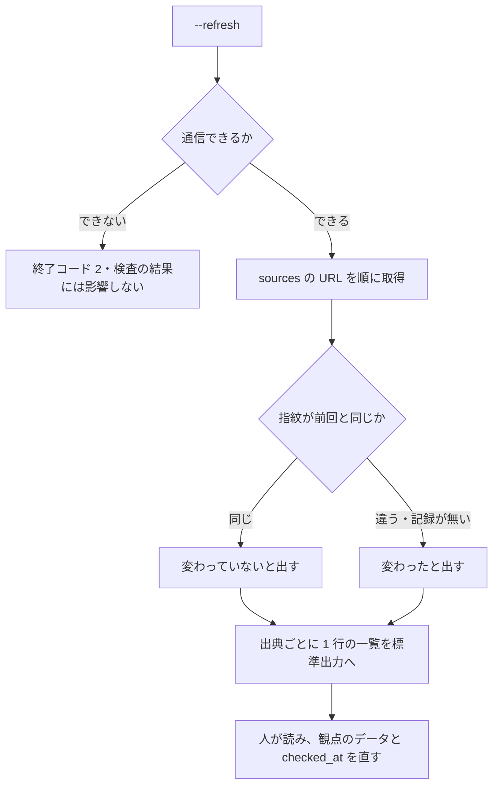
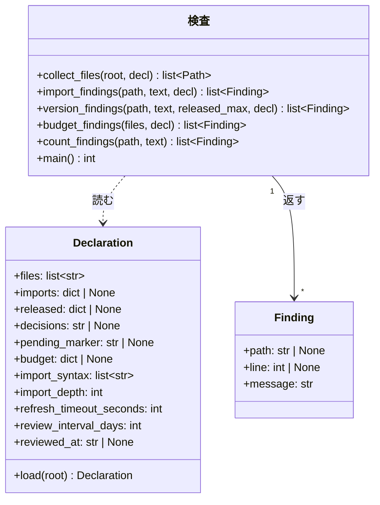

# #554: 指示書はどうあるのが適切か（観点と採否）

この文書が持つのは 5 つである。**観点をどこから導いたか。入れたもの・入れないもの。観点のデータの形。
調べ直しの仕組み。型と判定の手続き。**

| 関連する文書 | 中身 |
| --- | --- |
| [issue-554-design.md](issue-554-design.md) | 設計 |
| [issue-554-design-decisions.md](issue-554-design-decisions.md) | 決定の記録 |
| [issue-554-instruction-research.md](issue-554-instruction-research.md) | 外部調査の記録（2026-09-17） |

## 何を「適切」と呼ぶか

**指示書が適切であるとは、書いたことが実際に守られる状態を指す。** 分量・指示の数・位置・重複は、
どれも**守られる度合い**を下げる方向に効く。外部の出典 23 件（一次情報 22 件・個人ブログ 1 件）から 21 の観点が出ており
（調査の記録の「1. 観点の一覧」）、この課題の検査はその中から選ぶ。

**3 つの土台がある。** どれも一次情報で確かめられている。

| 土台 | 中身 | 出典（名前 / 参照日） |
| --- | --- | --- |
| 長い入力そのものが精度を下げる | 18 モデルで入力長に対する劣化。約 113k トークンの入力は約 300 トークンの絞った入力より落ちる | Chroma「Context Rot」/ 2026-09-17 |
| 指示の数が増えると遵守率が落ちる | 500 指示で最高でも 68%。閾値型のモデルは 150〜200 まで高精度 | IFScale（arXiv 2507.11538）/ 2026-09-17 |
| 中央に置いた情報が最も使われない | 位置による U 字。先頭と末尾が使われ、中央が落ちる | Lost in the Middle（arXiv 2307.03172）/ 2026-09-17 |

**ランタイム側の助言は、この土台を各社が数値へ落としたものである。** 数値は揃っていない
（Claude Code 200 行 / Cursor 500 行 / Copilot 2 ページ / Codex 32 KiB で打ち切り）。
**揃っていないからこそ、閾値を配布物に持たない**（決定 13）。

## 21 の観点と、この検査の扱い

**観点の番号は調査の記録の「1. 観点の一覧」に対応する。**

| # | 観点 | 機械で判定できるか | この検査の扱い |
| ---: | --- | --- | --- |
| 1 | 分量に上限がある | できる | **報告する。** 上限で落とすのは宣言があるときだけ |
| 2 | 指示の数そのものが遵守率を下げる | できる（線は引けない） | **報告する。** 落とさない |
| 3 | 指示の位置が効く | できない | 入れない（土台。順序の妥当性は判定できない） |
| 4 | 長い文脈が精度を下げる | できない | 入れない（土台。観点 1 の根拠） |
| 5 | 具体的で検証できる形で書く | 部分的 | 入れない（文の意味の判定になる） |
| 6 | 否定形より肯定形で書く | 部分的 | 入れない（同上。日本語では語形が多様で、誤検知が増える） |
| 7 | 矛盾した指示を残さない | 部分的 | 入れない（同じ対象を指しているかの判定が要る） |
| 8 | 決定的に強制できるものは指示書に書かない | 部分的 | 入れない（何を hook で強制できるかはリポジトリごとに違う） |
| 9 | 常時要らないものは要求時読み込みへ追い出す | 部分的 | **落とす。** 許可していない即時読み込みとして見る（許可の一覧は宣言が持つ） |
| 10 | コードや履歴から導けることを書かない | 部分的 | 入れない（導けるかどうかは対象のコードを読む判定になる） |
| 11 | 参照は説明を添えて書く | 部分的 | **落とす。** 参照先が存在しないことだけを見る（説明の有無は判定しない） |
| 12 | 階層に分け、重複を持たせない | 部分的 | 入れない（意図した再掲と重複を区別できない） |
| 13 | ランタイム間で食い違わせない | できる（文字列として） | 入れない（一致の単位を決められない。同じ意味の言い換えを食い違いとして出す） |
| 14 | 陳腐化させない | できる | **落とす。** 出た版の段落として見る（宣言があるときだけ） |
| 15 | 増え続けさせない／削除の根拠を残す | できる | **報告する**（観点 1 の量として）。削除の根拠は判定しない |
| 16 | 強調を安売りしない | 部分的 | 入れない（適量の線を引けない。日本語の強調は記法が一定しない） |
| 17 | 構造を持たせる | できる | 入れない（見出しの有無だけでは質を判定できない。落とす根拠にならない） |
| 18 | 書いたコマンドは実際に動くこと | 部分的 | 入れない（実行を伴う。検査が副作用を持つ） |
| 19 | 読み込まれていることを確かめられること | 部分的 | 入れない（ランタイムの対話的な機能に依存する） |
| 20 | 応答の文体・詳細度を指示書で決めない | 部分的 | 入れない（**助言が割れている**。Copilot は禁じ、Anthropic は出力書式の明示を勧める） |
| 21 | 機密情報を書かない | 部分的 | 入れない（秘密の検出は別の道具の領分。一次情報も確かめられていない） |

**落とすのは 4 つ、報告は 2 つ、入れないのは 15 である。**

| 扱い | 観点 | この検査での呼び名 |
| --- | --- | --- |
| 落とす（宣言が要らない） | 11 | 参照先の無い即時読み込み |
| 落とす（宣言があるとき） | 9 | 許可していない即時読み込み |
| 落とす（宣言があるとき） | 14 | 出た版の段落 |
| 落とす（宣言があるとき） | 1 | 読み込みの量の上限 |
| 報告する | 1 / 15 | 指示書ごとの読み込みの量 |
| 報告する | 2 | 指示の数（箇条書きと命令文の数） |

**入れない観点にも理由がある。** 上の表の「この検査の扱い」がその理由である。**判定できないものを
入れると、誤検知を消すための除外の一覧が育ち、検査そのものが読まれなくなる。**

## 出典

**値そのものをこの文書へ写さない。** 版が変わると数字が変わり、写した側だけが古くなる。ここが持つのは
**どの主張をどこから取ったか**である（`context-window.md` の「出典」と同じ扱い）。

| 何を根拠にしたか | 出典（名前） | 参照日 |
| --- | --- | --- |
| 指示書の分量の目安と、超えたときの読み飛ばし | Anthropic の Claude Code ドキュメント「memory」 | 2026-09-17 |
| 分量を抑える助言と、肥大した指示書が無視されること | Anthropic の Claude Code ドキュメント「best practices」 | 2026-09-17 |
| 即時読み込みは文脈量を減らさないこと | 同「memory」の import の節 | 2026-09-17 |
| 合計の大きさで打ち切る実装があること | OpenAI の Codex ドキュメント「AGENTS.md」 | 2026-09-17 |
| 別の行数の目安と、条件付き適用の仕組み | Cursor のドキュメント「Rules」 | 2026-09-17 |
| 分量の別の目安と、外部参照・文体指定を避ける助言 | GitHub の Copilot ドキュメント（custom instructions / response customization） | 2026-09-17 |
| 条件付き読み込みの仕組みと 1 ファイルの粒度 | Kiro のドキュメント「Steering」 | 2026-09-17 |
| 入力長に対する精度の劣化 | Chroma の調査「Context Rot」 | 2026-09-17 |
| 位置による使われ方の偏り | Lost in the Middle（TACL / arXiv） | 2026-09-17 |
| 指示の数と遵守率 | IFScale（arXiv） | 2026-09-17 |
| 設定の smell の分類と出現率（参照切れ・肥大・陳腐化） | Configuration Smells in AGENTS.md Files（arXiv） | 2026-09-17 |
| 指示書が増え続けること | Catastrophic Remembering in Agentic Coding（プレプリント） | 2026-09-17 |
| 強調語と自己検証の助言が版で変わったこと | Anthropic の platform ドキュメント「prompting best practices」 | 2026-09-17 |
| `AGENTS.md` の統治の移管 | Linux Foundation の発表 | 2026-09-17 |

**出典の件数は 23 件**（一次情報 22 件、個人ブログ 1 件）。全文と URL は調査の記録にある。

## 助言が割れている点

**割れているものは検査にしない。** 割れたまま片方を採ると、もう一方のランタイムで誤りになる。

| 観点 | 割れ方 |
| --- | --- |
| 分量の数値 | 200 行 / 500 行 / 2 ページ / 32 KiB。共通の値が無い |
| 外部参照 | 即時読み込みを用意するランタイムと、外部資料の参照を避けよと言うランタイムがある |
| 文体の指示 | 禁じる側と、出力書式の明示を勧める側がある |
| 書式の要求 | 何も要求しない仕様と、frontmatter が必須の形式がある |

## 移り変わりの実例

**あるべき姿は動く。** 一次情報で前後が確かめられたものだけを挙げる（詳細は調査の記録の「3. 移り変わりの証拠」）。

| 何が | 変わった向き |
| --- | --- |
| `AGENTS.md` の統治 | 1 社発の形式 → 財団への移管 |
| Copilot が読むファイル | 独自の 2 種 → `AGENTS.md` / `CLAUDE.md` / `GEMINI.md` を追加 |
| 強調語の使い方 | 強く書く助言 → 過剰発火を理由に弱める助言 |
| 自己検証の指示 | 付けるとよい → 新しいモデルでは削除せよ |
| 指示の置き場所 | 単一のファイル → 条件付きで読む仕組みと、要求時読み込みへの追い出し |

**この 5 つはいずれも 1 年以内に動いた。** 観点の一覧を固定したまま配ると、配った時点の助言で
利用者のリポジトリを縛ることになる。**調べ直しの仕組みが要る理由がこれである**（設計の
「あるべき姿が動くことへの備え」）。

### 観点と出典のデータ

**何を見るかはデータが持ち、コードへ埋め込まない**（決定 15。`refactoring` の「分岐をデータ化」と同じ）。
判定の手続きだけがコードにあり、**どの観点を・どの強さで・宣言が要るかどうか**はこのファイルが決める。

```json
{
  "version": 1,
  "checked_at": "2026-09-17",
  "criteria": [
    {"id": "broken-import", "aspect": 11, "enforce": "error", "needs": [],
     "sources": ["claude-code-memory", "config-smells"]},
    {"id": "unlisted-import", "aspect": 9, "enforce": "error", "needs": ["imports"],
     "sources": ["claude-code-memory"]},
    {"id": "released-version-paragraph", "aspect": 14, "enforce": "error", "needs": ["released"],
     "sources": ["config-smells"]},
    {"id": "read-size", "aspect": 1, "enforce": "report", "needs": [],
     "sources": ["claude-code-memory", "codex-agents-md", "context-rot"]},
    {"id": "read-size-budget", "aspect": 1, "enforce": "error", "needs": ["budget"],
     "sources": ["claude-code-memory", "codex-agents-md"]},
    {"id": "instruction-count", "aspect": 2, "enforce": "report", "needs": [],
     "sources": ["ifscale"]}
  ],
  "sources": [
    {"id": "claude-code-memory", "name": "Claude Code docs: memory",
     "url": "https://code.claude.com/docs/en/memory", "checked_at": "2026-09-17",
     "claim": "指示書の分量の目安と、超えたときの読み飛ばし",
     "fingerprint": "sha256:<前回取得した本文のハッシュ>"},
    {"id": "config-smells", "name": "Configuration Smells in AGENTS.md Files (arXiv)",
     "url": "https://arxiv.org/abs/2606.15828", "checked_at": "2026-09-17",
     "claim": "参照切れ・肥大・陳腐化を smell として分類し、出現率を測った",
     "fingerprint": "sha256:<前回取得した本文のハッシュ>"}
  ]
}
```

| 項目 | 何を決めるか |
| --- | --- |
| `checked_at`（上位） | **最後に調べ直した日。** 古くなると検査が `NOTE:` を出す |
| `criteria[].enforce` | `error`（落とす） / `report`（数えて出すだけ） |
| `criteria[].needs` | その観点が要る宣言の項目。`[]` は宣言が無くても動く |
| 同じ観点の 2 行 | 量は `report`（常に数える）と `error`（`budget` を宣言したときだけ落とす）を**別の行**に持つ。1 行に強さを 2 つ持たせない |
| `criteria[].id` | **判定の手続きへ結び付く名前**（下の対応表）。表に無い `id` があれば終了コード 2 |
| `criteria[].aspect` | 観点の番号（調査の記録に対応）。**根拠をたどる入口** |
| `criteria[].sources` / `sources[]` | 出典の名前・URL・参照日・**その出典から取った主張**（`claim`）・**前回取得した本文の指紋**（`fingerprint`）。**値そのものは持たない**（決定 12） |

**`id` と判定の手続きの対応。**

| `id` | 呼ぶ手続き |
| --- | --- |
| `broken-import` / `unlisted-import` | `import_findings` |
| `released-version-paragraph` | `version_findings` |
| `read-size` / `read-size-budget` | `budget_findings` |
| `instruction-count` | `count_findings` |

**このファイルが読めなければ終了コード 2 で止まる。** 行を消せばその判定は動かず、`enforce` を変えれば
落とすか報告するかが変わる（設定であって、説明ではない）。 何を見るかが決まらないまま走らせない。

**利用者がこのファイルを書き換える前提は置かない。** 配布物であり、更新は NDF の側で行う。リポジトリごとの
違いは宣言（`.ndf/instructions.json`）が持つ。

## あるべき姿が動くことへの備え

**指示書の「適切」は動く。** 1 年以内に、統治の移管・読むファイルの追加・強調語の助言の反転・自己検証の
指示の削除・置き場所の分割が起きている（観点の文書の「移り変わりの実例」）。**観点の一覧を固定したまま
配ると、配った時点の助言で利用者のリポジトリを縛る。**

| 決めること | 決めたこと |
| --- | --- |
| いつ調べ直すか | **3 つの引き金**（下の表）。起動のたびには調べない |
| 何を見に行くか | 観点のデータの `sources[]` が持つ URL。**一次情報だけ**（調査の記録の「5. 調べ直す手がかり」が一覧の出所） |
| どう反映するか | **`--refresh` は提示するだけ。** ファイルを書き換えない。観点のデータを直すのは人 |
| 前回いつ調べたかをどこに残すか | 観点のデータの `checked_at`（全体）と `sources[].checked_at`（出典ごと）。リポジトリ側は宣言の `reviewed_at` |

### 引き金

| 引き金 | 何が起きるか |
| --- | --- |
| 日数（既定 90 日。宣言の `review_interval_days` で変える） | 検査が `NOTE: 観点の一覧を最後に調べ直したのは <日> である` を出す。**落とさない** |
| 配布の工程 | `release` の退避の手順が、同じ `NOTE:` を読んで調べ直しを促す |
| 手で起動する | `--refresh` を実行する |

**ランタイムの版を引き金にしない。** 配布物は 4 ランタイムで動き、実行している CLI の版を確実には取れない。
**日数で代用する** ── 版の但し書きは調べ直しの中で読む（一次情報の側に版番号付きの但し書きが並んでいる）。

### `--refresh` の振る舞い



**機械が判定するのは 2 つだけである。** 取得できたかと、**前回取得した本文の指紋と一致するか**である。
**主張が今も成り立つかは人が読む。** 一次情報は書式も見出しも変わるため、主張の抽出を機械に任せると、
抽出の誤りがそのまま検査の基準になる（決定 14 と同じ理由）。

| 一覧の 1 行が持つもの | 例 |
| --- | --- |
| 出典の名前 | `Claude Code docs: memory` |
| 前回の参照日 | `2026-09-17` |
| 取得の成否 | `取得できた` / `取得できなかった（理由）` |
| 前回と内容が変わったか | `変わった` / `変わっていない` / `前回の記録が無い` |
| その出典から取った主張 | `指示書の分量の目安と、超えたときの読み飛ばし` |

- **書き込みをしない。** 取り消せない操作を自動で行わない（決定 14）
- **通信するのはこの経路だけである。** 既定の検査は通信しない。通信できない環境でも検査は動く
- **出典ごとに有限の待ちを置く**（引数 `--refresh-timeout` > 宣言の `refresh_timeout_seconds` > 既定 10 秒。接続と読み取りの両方）。**待ちを越えたら取得の失敗として扱い**、
  一覧へ理由付きで残す。パケットを捨てる相手でも止まらない
- **取れなかった URL を黙って落とさない。** 取得に失敗した出典を一覧へ残す（調査の記録が「取得できなかったページ」を残しているのと同じ形）

## 型と判定の手続き


**型は指摘と宣言の 2 つである。** 判定の関数は指摘の一覧を返し、終了コードは `main` だけが決める。



**`Declaration` は宣言が無くても作る。** 省略した項目は既定値（`files` は 3 つの名前、残りは `None`）を
持ち、**`None` の項目に対応する判定は動かない**（決定 2）。`imports` も省略時は `None`（未指定）で、
`{}`（許可が 1 つも無い）とは別の値である。
