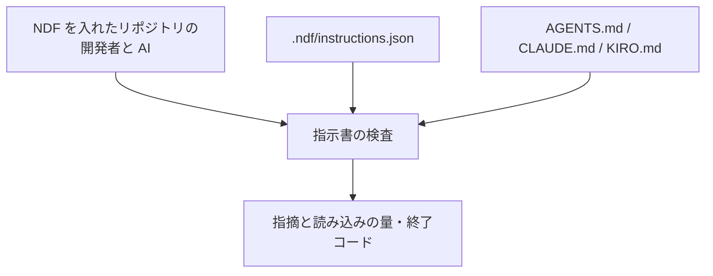
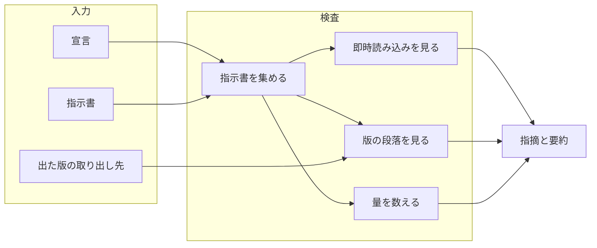
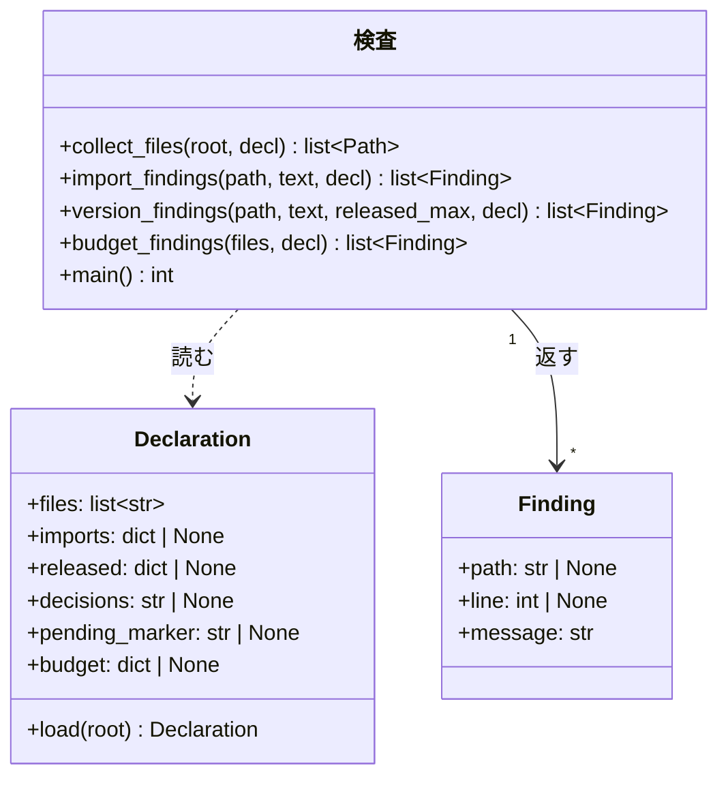
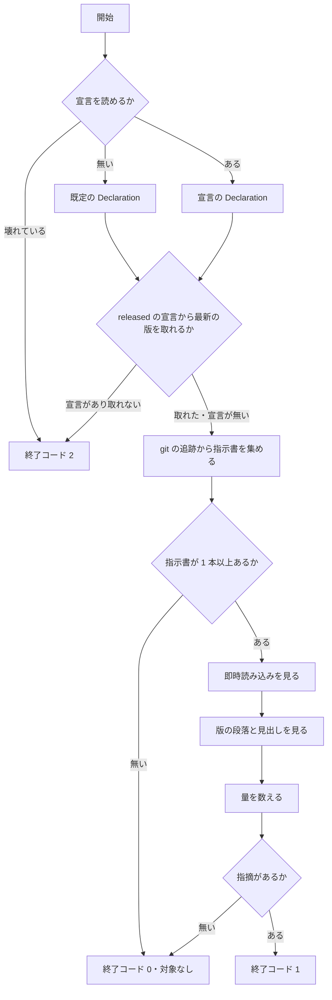

# #554: エージェント向け指示書を適切に保つ検査を NDF から配る

要求と受け入れ条件は [issue-554-requirements.md](issue-554-requirements.md) にある。この文書は「どう作るか」だけを扱う。

## 実例: 宣言の有無で何が動くか

**同じ検査が、リポジトリ側の宣言の有無で違う強さで働く。** 出力の形は次になる（文言は実装で決める）。

```console
$ python3 plugins/ndf/scripts/instructions-check.py --root .
指示書 5 本（根 3 / 配下 2）
AGENTS.md          6,240 バイト（参照先 1 本を含む）
CLAUDE.md          4,010 バイト（参照先 1 本を含む）
KIRO.md            2,230 バイト
NOTE: 宣言（.ndf/instructions.json）が無いため、出た版と許可の判定は動かない
ERROR: docs/AGENTS.md:12: @docs/none.md の参照先が無い。参照を消すか実在するパスへ直す
```

```console
$ python3 plugins/ndf/scripts/instructions-check.py --root .   # 宣言があるリポジトリ
ERROR: CLAUDE.md:38: v10.0.0 の段落が残っている（最新は 10.9.1）。次の見出しまでを docs/ndf-version-decisions.md へ移す
ERROR: CLAUDE.md:36: @docs/ndf-version-decisions.md は許可していない即時読み込み。@ を外すか imports へ理由とともに足す
```

**この 2 つ目は `ai-plugins` の `f56c90d9` で実際に出る形である**（AC36。判定規則の試作を同じ状態へ通し、
出た版の段落 7 件と許可していない即時読み込み 1 件を得た）。

## 機能一覧

| # | 機能 | 誰が使うか |
| --- | --- | --- |
| F1 | 指示書を集め、本数と毎回の読み込みの量を出す | NDF を入れたリポジトリの開発者と AI |
| F2 | 参照先の無い即時読み込みを指摘する | 同上（宣言が無くても動く） |
| F3 | 許可していない即時読み込みを指摘する | 宣言を書いたリポジトリ |
| F4 | 出た版の段落が指示書に残っていることを指摘する | 版の判断を指示書へ書くリポジトリ |
| F5 | 毎回の読み込みの量が上限を超えたことを指摘する | 上限を宣言したリポジトリ |
| F6 | 配布の手順の中で F1〜F5 を実行する | 配布の担当（`release` を通る側） |

## 構成要素

| 要素 | 責務 | 新設 / 変更 |
| --- | --- | --- |
| 指示書の検査（`plugins/ndf/scripts/instructions-check.py`） | 指示書を集め、宣言を読み、F1〜F5 の指摘を出して終了コードを返す | 新設 |
| 宣言の読み取り（同じスクリプトの中） | `.ndf/instructions.json` を読み、無ければ既定へ倒す。壊れていれば止める | 新設 |
| 宣言の定義（`plugins/ndf/skills/release/schemas/instructions.schema.json`） | 宣言の項目と型を持つ。編集時の補完に使う | 新設 |
| 参照（`plugins/ndf/skills/release/references/instruction-files.md`） | 宣言の書き方・判定の一覧・落ちたときの直し方 | 新設 |
| 配布の手順（`plugins/ndf/skills/release/SKILL.md` の「3. 版と説明文書を更新する」の退避の段落） | 退避の直後に検査を実行することと、参照への案内 | 変更（2〜3 行） |
| 単体テスト（`plugins/ndf/scripts/tests/test_instructions_check.py`） | 判定と終了コードを固定する | 新設 |

**Skill は増えない。** `plugins/ndf/skills/` に新しいディレクトリを作らない（決定 1）。

**下の図に描くのは、実行のときに動く要素だけである。** 宣言の定義・参照・単体テストと、`release` の手順は図に現れない。

### 文脈



**外部の系は無い。** 通信も認証も要らず、読むのは作業ツリーの中のファイルと `git` の追跡情報だけである
（タグを宣言したときだけ `git tag` も読む）。

### 構成要素図



### 配置

```mermaid
graph TD
    subgraph 配布物（4 ランタイム共通）
        S[instructions-check.py]
        R[release の手順と参照]
    end
    subgraph 利用者のリポジトリ
        D[.ndf/instructions.json]
        CI[継続的統合]
    end
    R -->|実行する| S
    CI -->|実行する| S
    D -->|判定の強さを決める| S
```

**配布物は 4 ランタイムで同じ実体である。** agy 向けのディレクトリはスクリプトの実体へのリンクを持ち、
Kiro は導入先からプラグインの `scripts/` を直接読む。**ランタイムごとの複製を作らない。**

### 置き場所

```text
plugins/ndf/
├── scripts/
│   ├── instructions-check.py                 # 新設（実体）
│   └── tests/
│       └── test_instructions_check.py        # 新設
└── skills/release/
    ├── SKILL.md                              # 変更（退避の段落へ 2〜3 行）
    ├── references/instruction-files.md       # 新設（宣言の書き方と判定の一覧）
    └── schemas/instructions.schema.json      # 新設（宣言の定義）
```

## 構造

**型は指摘と宣言の 2 つである。** 判定の関数は指摘の一覧を返し、終了コードは `main` だけが決める。



**`Declaration` は宣言が無くても作る。** 省略した項目は既定値（`files` は 3 つの名前、残りは `None`）を
持ち、**`None` の項目に対応する判定は動かない**（決定 2）。`imports` も省略時は `None`（未指定）で、
`{}`（許可が 1 つも無い）とは別の値である。

## データ構造

**宣言は `.ndf/instructions.json` の 1 ファイルである。** 置き場所と「無ければ静かに既定へ倒す」考え方は
`worktree.json` / `projects.json` と揃える（決定 3）。

| 項目 | 型 | 既定 | 何を決めるか |
| --- | --- | --- | --- |
| `$schema` | 文字列 | 無し | 定義ファイルへの参照。編集時の補完に使う。**読み取り側は参照しない**（`worktree.json` と同じ） |
| `version` | 整数 | 必須 | 宣言の形の版。読めない値なら終了コード 2 |
| `files` | 文字列の配列 | `["AGENTS.md", "CLAUDE.md", "KIRO.md"]` | 走査する指示書の名前 |
| `imports` | オブジェクト | 無し（未指定） | 許可する即時読み込み。`{"<指示書>": {"<参照先>": "<理由>"}}`。**書けば許可の外を指摘する。`{}` は「許可が 1 つも無い」であり、参照をすべて指摘する** |
| `released` | オブジェクト | 無し | 出た版の取り出し方。`{"source": "changelog", "path": "...", "pattern": "..."}` または `{"source": "tags", "pattern": "..."}` |
| `decisions` | 文字列 | 無し | 退避先の文書。指摘の文面に出す |
| `pending_marker` | 文字列 | 無し | 版が決まる前の段落の印（例: `の次の版で`） |
| `budget` | オブジェクト | 無し | `{"bytes": 20000}`。毎回の読み込みの上限 |

**`imports` のキーは、リポジトリの根からの相対パスである。** 根の指示書は `CLAUDE.md`、配下の指示書は
`docs/AGENTS.md` と書く。**ファイル名だけにしない** ── 同じ名前の指示書が複数あると、許可が別の場所へも効く。

**`imports` の値は理由を持つ。** 許可を足す人が、毎回読ませる理由を書かずに足せない
（既存の除外の宣言が理由を必須にしているのと同じ形）。

**宣言の例**（`ai-plugins` の場合。「このリポジトリへの適用」で使う）:

```json
{
  "$schema": "<プラグインの skills/release/schemas/instructions.schema.json>",
  "version": 1,
  "files": ["AGENTS.md", "CLAUDE.md", "KIRO.md"],
  "imports": {
    "CLAUDE.md": {"AGENTS.md": "現行の規約そのもので、毎回要る"},
    "KIRO.md": {"AGENTS.md": "同上"}
  },
  "released": {"source": "changelog", "path": "CHANGELOG.md", "pattern": "^## \\[ndf (\\d+\\.\\d+\\.\\d+)\\]"},
  "decisions": "docs/ndf-version-decisions.md",
  "pending_marker": "の次の版で",
  "budget": {"bytes": 30000}
}
```

### 呼び方

**`release` の手順からは、プラグインの `scripts/` を解決してから呼ぶ。** 解決の手順は
`../development-workflow/references/scripts-lookup.md` が持つ（`pr` / `worktree` /
`progress-tracking` が同じ参照を指す）。`release` の配下へ写しを置かない。手順へ書くのは 2 行である。

```bash
python3 "$SCRIPTS/instructions-check.py"; echo "exit=$?"
```

**`$SCRIPTS` を解決せずに相対パスで書かない。** ランタイムごとに導入先が違うため、相対パスでは
どれか 1 つでしか当たらない。**実装では 4 ランタイムの導入先それぞれから起動して、終了コードを確かめる**（AC32）。

## 入出力の契約

| 項目 | 内容 |
| --- | --- |
| 名前 | `python3 <プラグインの scripts>/instructions-check.py [--root <リポジトリの根>] [--report]` |
| 入力 | `--root`（既定は現在地）。`--report` はファイルごとの内訳を足す |
| 成功 | 終了コード 0。標準出力に本数と、**指示書ごとの 1 セッションの読み込みの量**。宣言が無ければ動かない判定を `NOTE:` で 1 行 |
| 指摘あり | 終了コード 1。標準エラーへ 1 件 1 行。`ERROR: <ファイル>:<行>: <理由>`、行を持たない指摘は `ERROR: <理由>` |
| 読み取れない | 終了コード 2。宣言の構造が不正（JSON として読めない・`version` が無いか未対応・項目の型が違う・`pattern` が正規表現として読めない）・`released` から版を 1 つも取れない・`git` が使えない |
| 呼び出しの誤り | 終了コード 3。知らない引数。標準エラーへ使い方 |
| 対象が無い | 終了コード 0。指示書が 1 本も無いことを 1 行出す（AC3） |
| 互換性 | 新設。既存の呼び出し側は無い |

**2 を 0 へ畳まない。** 確かめられなかったことを、通ったと報告しない（既存の配布スクリプトと同じ扱い）。

**止まるなら、何も判定する前に止まる。** 版を取れないことが分かるのは走査の前であり、そこで 2 を返す。
**指示書が 1 本も無いことより、版を取れないことが先に効く** ── 宣言が読めているのに値を取れない状態は、
対象の有無によらず「確かめられなかった」である（AC3 と AC22 の順序）。
判定を一部だけ終えてから 2 を返すと、**その実行で見つけた壊れた即時読み込みが出力に出ないまま消える**
（「処理の流れ」の `MAX` の位置）。

## 処理の流れ



### 指示書を集める

**`git ls-files -z` が返す追跡対象から、`files` の名前と一致するものを集める**（AC1 / AC2）。
非 ASCII のパスを 8 進で表さない形で受け取るため `-z` を使う。

| 位置 | 例 | 量の集計 | 判定 |
| --- | --- | --- | --- |
| 根 | `CLAUDE.md` | 入れる（毎回読まれる） | すべて |
| 配下 | `docs/AGENTS.md` | 入れない（その場所で作業したときだけ読まれる） | すべて |
| 根の指示書が `@` でたどる先 | `AGENTS.md` から引く文書 | 入れる | 指示書としての判定はしない |

**配下の指示書も判定の対象にする。** 読まれる頻度は低いが、参照先が消えていることと出た版の段落が
残っていることは、読まれた時点で同じだけ効く（利用者の言う「インストールされたスコープ全体」の読み方）。

#### 量は根の指示書ごとに数える

**1 セッションが読むのは、根の指示書 1 本とその参照先である。** 3 本を合算した値は、どのセッションでも
読まれない量になる。**根の指示書ごとに 1 つの数を出す。**

| 数える単位 | 中身 |
| --- | --- |
| 根の指示書 1 本 | その本文のバイト数 + `@` でたどった先の推移閉包のバイト数 |

- **同じ参照先を 2 回引いても 1 回だけ数える。** 推移閉包として集めてから合計する（`CLAUDE.md` が
  `AGENTS.md` を引き、`AGENTS.md` も同じ文書を引く形がある）
- **たどるのは存在を判定する参照だけである。** 解決しない形（`~` と作業ツリーの外）は数に入れない
- `budget.bytes` は**根の指示書ごとに**掛ける。1 本でも超えれば指摘する
- 出力は根の指示書ごとに 1 行。`--report` はたどった先の内訳を足す

### 即時読み込みを見る

**判定はコードブロックの外・コードスパンの外で行う。** `@` の直前が行頭・空白・`*`・`_`・`~` のどれかであるものを
参照とし、名前は `@` の直後から続く ASCII のパスの文字（英数字と `.` `_` `-` `/` `~`）の並びとする。並びの末尾の
`.` / `_` / `~` は落とす。並びが空なら参照としない。

**参照先は、その参照を書いた指示書のあるディレクトリから解決する**（Claude Code の読み込みと同じ）。

| 参照の形 | 解決 | 存在の判定 |
| --- | --- | --- |
| `@AGENTS.md` / `@docs/x.md` | 書いた指示書のディレクトリからの相対 | する |
| `@./x.md` / `@../x.md`（作業ツリーの中に収まる） | 同上。正規化してから見る | する |
| `@~/x.md`（利用者の home） | 解決しない | **しない**（機械ごとに違う） |
| `/` で始まる絶対パス、`..` で作業ツリーの外へ出るもの | 解決しない | **しない** |

**存在を見ないものも、許可の判定には掛ける。** 毎回読み込まれることは変わらないためである。宣言の
`imports` には、書いたとおりの文字列で書く。

**読む前に実体のパスが根の中に収まることを確かめる。** 字句の上では作業ツリーの中でも、追跡された
symlink が外を指していれば、開いた先は作業ツリーの外である。**解決した実体のパスが根の外なら、
参照先として読まず、存在も判定しない**（量にも入れない）。指示書そのものが symlink のときも同じに扱う。

| 書き方 | 読み込まれるか（実測） | 検査 |
| --- | --- | --- |
| 空白の直後 `@b.md` | 読み込まれる | 参照として見る |
| 強調の中 `**@a.md**` | 読み込まれる | 参照として見る（名前は `a.md`） |
| コードスパン `` `@c.md` `` / コードブロックの中 | 読み込まれない | 見ない |
| 括弧の直後 `(@g.md)` / `（@d.md）` | 読み込まれない | 見ない |
| 日本語の直後 `直後@f.md` / メール風 `user@h.md` | 読み込まれない | 見ない |

| 実測の条件 | 値 |
| --- | --- |
| CLI 版 | Claude Code 2.1.274 |
| 置いたもの | 空のディレクトリに `CLAUDE.md` と参照先 8 本。参照先の中身は別々の合言葉 |
| 問い | `claude -p "<コンテキストの合言葉を列挙>" --allowedTools ""` |
| 結果 | 応答に出た合言葉は `a.md` と `b.md` の 2 つ |

参照を得たら 2 つを見る。

| 条件 | 指摘 |
| --- | --- |
| 参照先が存在しない | 常に指摘する（F2。宣言は要らない） |
| **`imports` を書いていて**、その指示書の許可に無い | 指摘する（F3） |
| `imports` に書いた許可の指し先が存在しない | 指摘する（宣言の陳腐化）。**存在を判定するパスに限る** ── `~` と作業ツリーの外を指す許可は、存在しないことを理由に指摘しない |

**未指定と `{}` を区別する。** 未指定は「許可の判定をしない」、`{}` は「許可が 1 つも無い」である。
同じに扱うと、**許可を空にしたリポジトリほど検査が働かない**。

### 版の段落を見る

**見るのは書き出しだけである。** 行の種類で 2 つに分け、分岐は行頭が `#` 1〜6 個と空白かどうかで決まる。

| 行の種類 | 見る行 | 見る位置 | 拾う形 |
| --- | --- | --- | --- |
| 見出しの行 | すべて | 見出しの記号と空白の直後 | `v<版数>` または `<版数>` |
| それ以外の行 | **段落の先頭行だけ** | 書き出し（箇条書き記号と強調を読み飛ばした直後） | 同上 |

**段落の先頭行は次のどれかである。**

| 形 | 例 |
| --- | --- |
| ファイルの 1 行目 | 前の行が無い |
| 直前が空行・見出し・フェンスの終わりのいずれか | 段落の 1 行目 |
| **箇条書きの項目の始まり**（先行する空白を許し、`- ` / `* ` / `+ ` / `1. ` で始まる行） | 連続する項目の 2 件目以降と、字下げした項目も含む |
| 表の行・引用の行 | 段落の先頭として扱わない（判定に入れない） |

**段落の途中の行を見ない。** 段落は複数行に折り返され、折り返した先の行が版数で始まることがある。
`ai-plugins` の `f56c90d9` では、段落の先頭に限ると 7 件、行ごとに見ると 9 件になり、後の 2 件は
1 つ前の段落の続きの行である（`v10.3.1 までを …` / `v10.5.0 は …`）。

**見出しでも文字列の途中は見ない。** 見出しには別の道具の版数が入ることがある（`### Node 22 と Python 3.12`）。

| 形 | 指摘する条件 |
| --- | --- |
| 版数（印が続かない） | 基底（接尾辞を除いた数字 3 つ）が最新**以下** |
| 版数 + `pending_marker` | 基底が最新**未満**。印を宣言していなければこの行は判定しない |

**最新は `released` の宣言から取る**（決定 5）。`changelog` は文書とその行の形、`tags` はタグの形を受け取る。
**取れないときは終了コード 2 で止める。** 判定できないことを通過にしない（AC22）。

## 非機能の実現方式

| 大項目 | 要求の条件 | 実現方式 | 確かめ方 |
| --- | --- | --- | --- |
| 運用・保守性 | 指摘は 1 件 1 行で、直し方を含む。外部への通信・CLI の認証を要さない | 指摘の文面に退避先（`decisions`）と宣言の項目名を入れる。読むのは作業ツリーのファイルと `git` だけ | テストが出力の形と、文面に退避先が出ることを見る |
| 移行性 | 宣言が無いリポジトリでも動き、既定の判定だけが働く | `Declaration` の項目を `None` にし、対応する判定を飛ばす（決定 2） | 宣言の無い一時ディレクトリで、出た版の判定が動かないことを見る |
| システム環境 | Python 3 の標準ライブラリだけで動く。浅い clone で動く | `re` / `json` / `argparse` / `pathlib` / `subprocess`（`git ls-files`）だけを使う | タグを使わない宣言で、浅い clone を模したディレクトリを走らせる |

## 決定の記録

**決定 1〜11 は [issue-554-design-decisions.md](issue-554-design-decisions.md) にある。**
この文書が 500 行の基準を超えたため、決定の節だけを分けた。

## このリポジトリへの適用

**配布物の機能とは別立てである。** 実装の Pull Request には入るが、配布物の振る舞いを決めない。

| # | すること | 受け入れ条件 |
| --- | --- | --- |
| 1 | `.ndf/instructions.json` を置く（「データ構造」の例のとおり） | AC35 / AC36 |
| 2 | `.github/workflows/runtime-plugin-validate.yml` へジョブ `instruction-files-check` を足す。Pull Request では絞り込まずに起動し、push の絞り込みへ `CHANGELOG.md` と `.ndf/**` を足す | AC37 / AC38 |
| 3 | `CLAUDE.md` の「版ごとの判断の記録」へ、版が決まる前の印と検査のコマンドを書く | AC39 |
| 4 | `docs/versioning-and-distribution.md` の「バージョン更新時の手順」へ検査を足し、手順 4 の置き場所を直す | AC40 |
| 5 | `CHANGELOG.md` の冒頭の置き場所を直す | AC42 |
| 6 | ruleset（`protect main and develop`）の必須の検査へ `instruction-files-check` を入れ、**同じ時点で** `docs/versioning-and-distribution.md` の「必須の検査 11 個」の数を直す | **実装の差分に入らない。** 入れると決まっており（利用者の判断）、実行は実装 Pull Request のマージ後に進行側が行う（AC41） |

**数と ruleset は同じ時点で変える。** 文書が「12 個」と書いて ruleset が 11 個しか求めない状態では、
`main` へ進めるときの断りの文言（`X of 11 required status checks …`）と文書が食い違う。

**4 と 5 は、規則と逆のことを書いている記載を直す。** どちらも「判断の理由は `CLAUDE.md` に置く」と書いており、
#551 で決めた置き場所（`docs/ndf-version-decisions.md`）と食い違う。

## テスト設計

**テストは一時ディレクトリに最小のリポジトリ（`git init` と指示書）を作り、`--root` で渡す**
（既存の検査のテストと同じ形）。継続的統合は浅い clone で過去のコミットを持たないため、`f56c90d9` は
テストから読まない。**実例の再現（AC36）は実装の Pull Request の本文へ手順と出力を残す。**

| 受け入れ条件 | 何で確かめるか |
| --- | --- |
| AC1 / AC2 / AC3 / AC4 | テスト: 根と配下に指示書を置いた一時リポジトリ、未追跡のファイル、指示書の無いリポジトリ、`files` を足した宣言の 4 通り |
| AC3 と AC22 の順序 | テスト: 指示書が 0 本で、かつ版を取れない宣言を置くと終了コード 2 になる |
| AC5 / AC9 / AC10 / AC11 | テスト: 参照の書き方 8 通りを 1 つの指示書へ書き、指摘される 2 通りだけが出る |
| AC8 | テスト: 根の中を指す symlink の参照先は読み、根の外を指す symlink は読まず存在も判定しない（量にも入らない） |
| AC6 / AC7 | テスト: 配下の指示書に書いた `@x.md` が同じディレクトリのファイルを指す。`@~/x.md` と `@../../x.md` は存在を判定せず、許可を宣言すると判定の対象になる |
| AC12 | テスト: 根の指示書ごとに 1 行出る。**多段の参照**（`CLAUDE.md` → `a.md` → `b.md`）をたどり、2 本が同じ先を引いても 1 回だけ数え、**循環する参照**（`a.md` ⇄ `b.md`）でも止まる。配下の指示書の分は入らない |
| AC13 | テスト: 宣言の無い根で、出た版の段落を書いても指摘されず、`NOTE:` の行が出る |
| AC14 | テスト: `$schema` を書いた宣言が、書かない宣言と同じに読まれる |
| AC15 / AC16 / AC17 | テスト: `imports` を宣言した根で、許可の外の参照と、指し先の無い許可がそれぞれ指摘される。`"imports": {}` では参照がすべて指摘され、未指定では指摘されない |
| AC18 / AC20 | テスト: `changelog` の宣言と、最新以下・最新より新しい版の段落 |
| AC19 | テスト: 出た版の版数で始まる行を段落の 2 行目へ置くと指摘されず（`f56c90d9` で 9 件に増える形）、連続する箇条書きの 2 件目（`- v10.1.0 …`）は指摘される |
| AC21 | テスト: `tags` の宣言でタグを 2 つ打ち、最大値が最新になる |
| AC22 / AC26 | テスト: 版を取れない宣言（壊れた即時読み込みがあっても 2 で止まり、その指摘が出ない）、壊れた JSON、`version` の欠落と未対応、`files` の型違い、読めない `pattern` で終了コード 2 |
| AC23 | テスト: `pending_marker` を宣言し、基底が最新・最新未満の 2 通り |
| AC24 | テスト: 指摘の文面に `decisions` の値が出る |
| AC25 | テスト: 根の指示書 1 本が `budget.bytes` を超えると終了コード 1。2 本の合計が超えても、どちらも上限以下なら通る |
| AC27 / AC28 / AC29 | テスト: 出力の形、指摘が無いときの標準出力、知らない引数で終了コード 3 |
| AC30 | テスト: `plugins/ndf/skills/` に新しいディレクトリが無いことを、配る先の一覧の行数で見る |
| AC31 | 手順: `release` の差分と、新設した参照を読む。`$SCRIPTS` を解決してから呼ぶ 2 行があることを見る |
| AC32 | 手順: 4 ランタイムの導入先それぞれからスクリプトを起動し、一時リポジトリを `--root` に渡して終了コードを記録する |
| AC33 / AC34 / AC43 | 手順: 既存の検査とビルドの確認を実行し、終了コード 0 を見る |
| AC35 / AC36 | 手順: このリポジトリの根での実行と、`git archive f56c90d9 …` を展開した一時ディレクトリでの実行 |
| AC37 / AC38 | 手順: ワークフローの差分を読み、実装の Pull Request の checks を見る |
| AC39 / AC40 / AC42 | 手順: 差分を読む |
| AC41 | 手順: ruleset へ足した後に、その一覧の件数と文書の数字を突き合わせる（実装 Pull Request の差分には入らない） |
| AC44 | 手順: `uv run --with pytest pytest scripts/tests plugins/ndf -q` の失敗の件数が `develop` と同じ（既知の環境要因の 6 件を除く） |

## 未確認のまま残ること

| 項目 | 内容 | いつ決まるか |
| --- | --- | --- |
| Claude Code 以外の即時読み込み | Codex / agy / Kiro が `@<パス>` を読み込むかは測っていない。判定は Claude Code の範囲で決める | 測らない。許可の一覧に載らない参照を指摘しても、読まないランタイムでは害が無い |
| 印を持たない段落 | `pending_marker` を使わずに書いた現行版の段落は検出できない | 次の配布で漏れが出たら、印を必須にするかを別の課題で決める |
| 宣言の項目の過不足 | 他のリポジトリで足りない項目が出るか | 実際に他のリポジトリへ入れたときに分かる。`version` を持つため、足す側の変更ができる |
| 出力の文言 | 「入出力の契約」と実例の文面は形の例で、句読点と語順は実装で決める | 実装 |
| 量の上限の目安 | このリポジトリの `budget.bytes` にどの値を置くか | 実装（現在の実測値を見て決める） |

## 実装の分け方と他の束との関係

**実装は 1 本の Pull Request にする。** 配布物（検査・参照・`release` の 2〜3 行）と適用（宣言・ジョブ・手順の記載）は
同じ規則を指しており、分けると検査だけが入って適用の無い期間か、宣言だけが入って検査の無い期間ができる。

| 束 | 重なり | 扱い |
| --- | --- | --- |
| G1（PR #739） | **`release` SKILL.md を触る** | この設計が触るのは「3. 版と説明文書を更新する」の退避の段落だけである。G1 の実装が同じ節を触るなら、後から入る側が取り込む |
| G2（PR #741） | `scripts/parallel-measure.py` を新設 | 触るファイルが違う |
| G3（PR #740） | `skill-stats` / `retrospective` など | 重ならない |
| 配布の Pull Request | `CHANGELOG.md` の先頭へ版の節を足す | 触るのは冒頭の 1 文で、版の節とは行が離れている。**この検査が入った後の配布から、退避の漏れが配布の Pull Request で落ちる** |
