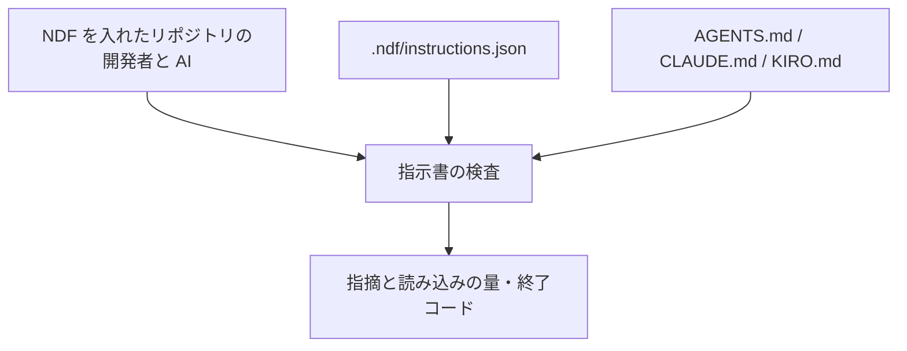
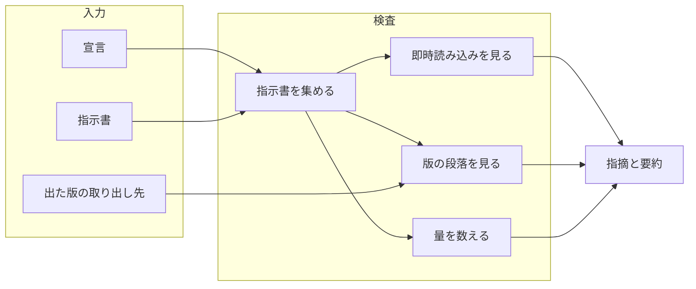
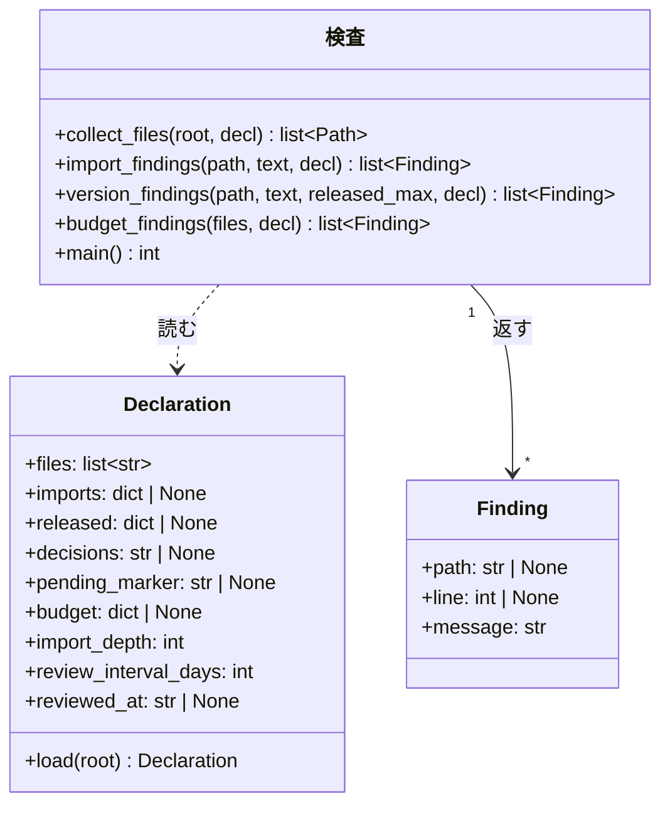
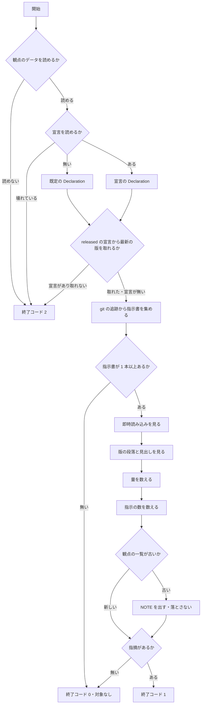

# #554: エージェント向け指示書を適切に保つ検査を NDF から配る

要求と受け入れ条件は [issue-554-requirements.md](issue-554-requirements.md) にある。この文書は「どう作るか」だけを扱う。

| 分けた文書 | 中身 |
| --- | --- |
| [issue-554-design-criteria.md](issue-554-design-criteria.md) | **指示書はどうあるのが適切か。** 21 の観点と、検査に入れたもの・入れないもの、出典 |
| [issue-554-design-decisions.md](issue-554-design-decisions.md) | 決定の記録 |
| [issue-554-instruction-research.md](issue-554-instruction-research.md) | 外部調査の記録（2026-09-17） |

## 実例: 宣言の有無で何が動くか

**同じ検査が、リポジトリ側の宣言の有無で違う強さで働く。** 出力の形は次になる（文言は実装で決める）。

```console
$ python3 plugins/ndf/scripts/instructions-check.py --root .
指示書 5 本（根 3 / 配下 2）
AGENTS.md          6,240 バイト（参照先 1 本を含む）
CLAUDE.md          4,010 バイト（参照先 1 本を含む）
KIRO.md            2,230 バイト
NOTE: 宣言（.ndf/instructions.json）が無いため、出た版と許可の判定は動かない
ERROR: docs/AGENTS.md:12: @docs/none.md の参照先が無い。参照を消すか実在するパスへ直す
```

```console
$ python3 plugins/ndf/scripts/instructions-check.py --root .   # 宣言があるリポジトリ
ERROR: CLAUDE.md:38: v10.0.0 の段落が残っている（最新は 10.9.1）。次の見出しまでを docs/ndf-version-decisions.md へ移す
ERROR: CLAUDE.md:36: @docs/ndf-version-decisions.md は許可していない即時読み込み。@ を外すか imports へ理由とともに足す
```

**2 つ目は `ai-plugins` の `f56c90d9` で実際に出る形である**（AC55）。

## 指示書はどうあるのが適切か

**検査する観点は、外部の出典 23 件（一次情報 22 件・個人ブログ 1 件）から出た 21 の観点から選ぶ。** 選び方と入れない理由は
[issue-554-design-criteria.md](issue-554-design-criteria.md) が持つ。ここに置くのは結論だけである。

| 扱い | 観点（番号は調査の記録に対応） | この検査での呼び名 |
| --- | --- | --- |
| 落とす（宣言が要らない） | 11 参照は説明を添えて書く | 参照先の無い即時読み込み |
| 落とす（宣言があるとき） | 9 常時要らないものは要求時読み込みへ | 許可していない即時読み込み |
| 落とす（宣言があるとき） | 14 陳腐化させない | 出た版の段落 |
| 落とす（宣言があるとき） | 1 分量に上限がある | 読み込みの量の上限 |
| 報告する（落とさない） | 1 分量 / 15 増え続けさせない | 指示書ごとの読み込みの量 |
| 報告する（落とさない） | 2 指示の数が遵守率を下げる | 指示の数（箇条書きと命令文） |
| 入れない | 残る 15 の観点 | — |

**入れない理由は 3 つに分かれる** ── 意味の判定になる、リポジトリごとに違う、助言が割れている。
**判定できないものを入れると、誤検知を消すための除外の一覧が育ち、検査そのものが読まれなくなる。**

**閾値の数値は配布物に持たない。** ランタイムごとに助言の値が違い（200 行 / 500 行 / 2 ページ /
32 KiB）、版が変わると動く。量は常に報告し、**落とすのは宣言に上限を書いたときだけ**である（決定 13）。

## 機能一覧

| # | 機能 | 誰が使うか |
| --- | --- | --- |
| F1 | 指示書を集め、本数と毎回の読み込みの量を出す | NDF を入れたリポジトリの開発者と AI |
| F2 | 参照先の無い即時読み込みを指摘する | 同上（宣言が無くても動く） |
| F3 | 許可していない即時読み込みを指摘する | 宣言を書いたリポジトリ |
| F4 | 出た版の段落が指示書に残っていることを指摘する | 版の判断を指示書へ書くリポジトリ |
| F5 | 毎回の読み込みの量が上限を超えたことを指摘する | 上限を宣言したリポジトリ |
| F6 | 配布の手順の中で F1〜F5 を実行する | 配布の担当（`release` を通る側） |
| F7 | 指示の数（箇条書きと命令文）を報告する | 指示書を編集する開発者と AI |
| F8 | 観点の一覧を外部の一次情報から調べ直し、差分を提示する | 指示書の規約を保つ担当（引き金は「あるべき姿が動くことへの備え」） |

## 構成要素

| 要素 | 責務 | 新設 / 変更 |
| --- | --- | --- |
| 指示書の検査（`plugins/ndf/scripts/instructions-check.py`） | 指示書を集め、宣言を読み、F1〜F5 の指摘を出して終了コードを返す | 新設 |
| 宣言の読み取り（同じスクリプトの中） | `.ndf/instructions.json` を読み、無ければ既定へ倒す。壊れていれば止める | 新設 |
| 観点と出典のデータ（`plugins/ndf/scripts/data/instruction-criteria.json`） | 見る観点・落とすか報告か・宣言が要るか・出典と参照日・最後に調べ直した日 | 新設 |
| 宣言の定義（`plugins/ndf/skills/release/schemas/instructions.schema.json`） | 宣言の項目と型を持つ。編集時の補完に使う | 新設 |
| 参照（`plugins/ndf/skills/release/references/instruction-files.md`） | 宣言の書き方・判定の一覧・落ちたときの直し方 | 新設 |
| 配布の手順（`plugins/ndf/skills/release/SKILL.md` の「3. 版と説明文書を更新する」の退避の段落） | 退避の直後に検査を実行することと、参照への案内 | 変更（2〜3 行） |
| 単体テスト（`plugins/ndf/scripts/tests/test_instructions_check.py`） | 判定と終了コードを固定する | 新設 |

**Skill は増えない。** `plugins/ndf/skills/` に新しいディレクトリを作らない（決定 1）。

**下の図に描くのは、実行のときに動く要素だけである。** 宣言の定義・参照・単体テストと、`release` の手順は図に現れない。

### 文脈



**外部の系は無い。** 通信も認証も要らず、読むのは作業ツリーの中のファイルと `git` の追跡情報だけである
（タグを宣言したときだけ `git tag` も読む）。

### 構成要素図



### 配置

```mermaid
graph TD
    subgraph 配布物（4 ランタイム共通）
        S[instructions-check.py]
        R[release の手順と参照]
    end
    subgraph 利用者のリポジトリ
        D[.ndf/instructions.json]
        CI[継続的統合]
    end
    R -->|実行する| S
    CI -->|実行する| S
    D -->|判定の強さを決める| S
```

**配布物は 4 ランタイムで同じ実体である。** agy 向けのディレクトリは実体へのリンクを持ち、Kiro は
導入先からプラグインの `scripts/` を直接読む。**複製を作らない。**

### 置き場所

```text
plugins/ndf/
├── scripts/
│   ├── instructions-check.py                 # 新設（実体）
│   ├── data/
│   │   └── instruction-criteria.json         # 新設（観点・出典・調べ直した日）
│   └── tests/
│       └── test_instructions_check.py        # 新設
└── skills/release/
    ├── SKILL.md                              # 変更（退避の段落へ 2〜3 行）
    ├── references/instruction-files.md       # 新設（宣言の書き方と判定の一覧）
    └── schemas/instructions.schema.json      # 新設（宣言の定義）
```

## 構造

**型は指摘と宣言の 2 つである。** 判定の関数は指摘の一覧を返し、終了コードは `main` だけが決める。



**`Declaration` は宣言が無くても作る。** 省略した項目は既定値（`files` は 3 つの名前、残りは `None`）を
持ち、**`None` の項目に対応する判定は動かない**（決定 2）。`imports` も省略時は `None`（未指定）で、
`{}`（許可が 1 つも無い）とは別の値である。

## データ構造

**宣言は `.ndf/instructions.json` の 1 ファイルである。** 置き場所と「無ければ静かに既定へ倒す」考え方は
`worktree.json` / `projects.json` と揃える（決定 3）。

| 項目 | 型 | 既定 | 何を決めるか |
| --- | --- | --- | --- |
| `$schema` | 文字列 | 無し | 定義ファイルへの参照。**版を固定した公開の URL を書く**（下の「定義ファイルの指し方」）。編集時の補完に使い、**読み取り側は参照しない**（`worktree.json` と同じ） |
| `version` | 整数 | 必須 | 宣言の形の版。読めない値なら終了コード 2 |
| `files` | 文字列の配列 | `["AGENTS.md", "CLAUDE.md", "KIRO.md"]` | 走査する指示書の名前 |
| `imports` | オブジェクト | 無し（未指定） | 許可する即時読み込み。`{"<指示書>": {"<参照先>": "<理由>"}}`。**書けば許可の外を指摘する。`{}` は「許可が 1 つも無い」であり、参照をすべて指摘する** |
| `released` | オブジェクト | 無し | 出た版の取り出し方。`{"source": "changelog", "path": "...", "pattern": "..."}` または `{"source": "tags", "pattern": "..."}`。**`pattern` は名前付きの捕捉 `(?P<version>…)` を 1 つ持つ**（下の「版の取り出し方」） |
| `decisions` | 文字列 | 無し | 退避先の文書。指摘の文面に出す |
| `pending_marker` | 文字列 | 無し | 版が決まる前の段落の印（例: `の次の版で`） |
| `budget` | オブジェクト | 無し | `{"bytes": 20000}`。根の指示書 1 本あたりの読み込みの上限 |
| `import_depth` | 整数 | `4` | 即時読み込みをたどる深さの上限。量の集計に効く |
| `review_interval_days` | 整数 | `90` | 観点の一覧が古いと知らせるまでの日数 |
| `reviewed_at` | 文字列（`YYYY-MM-DD`） | 無し | **そのリポジトリが観点の一覧を最後に見直した日。** 書けば、配布物の `checked_at` ではなくこちらを起点に日数を数える |

#### 定義ファイルの指し方

**`$schema` にはランタイムに依存しない値を書く。** プラグインの導入先は 4 ランタイムで違い、`.ndf/` から
相対で辿れる保証が無い。**版を固定した公開の URL**（リリースタグを含む生のファイルの URL）を書けば、
どのランタイムで導入していても編集時に解決できる。**版を固定するのは、定義が変わっても手元の宣言の意味が
変わらないようにするためである。**

**この値は検査の動きを変えない。** 読み取り側は `$schema` を見ないため、書かなくても、解決できない値でも
検査は同じに動く（AC28）。

**`imports` のキーは、リポジトリの根からの相対パスである。** 根の指示書は `CLAUDE.md`、配下の指示書は
`docs/AGENTS.md` と書く。**ファイル名だけにしない** ── 同じ名前の指示書が複数あると、許可が別の場所へも効く。

**`imports` の値は理由を持つ。** 許可を足す人が、毎回読ませる理由を書かずに足せない
（既存の除外の宣言が理由を必須にしているのと同じ形）。

**宣言の例**（`ai-plugins` の場合。「このリポジトリへの適用」で使う）:

```json
{
  "$schema": "https://raw.githubusercontent.com/devbasex/ai-plugins/ndf--v<版>/plugins/ndf/skills/release/schemas/instructions.schema.json",
  "version": 1,
  "files": ["AGENTS.md", "CLAUDE.md", "KIRO.md"],
  "imports": {
    "CLAUDE.md": {"AGENTS.md": "現行の規約そのもので、毎回要る"},
    "KIRO.md": {"AGENTS.md": "同上"}
  },
  "released": {"source": "changelog", "path": "CHANGELOG.md",
               "pattern": "^## \\[ndf (?P<version>\\d+\\.\\d+\\.\\d+)\\]"},
  "decisions": "docs/ndf-version-decisions.md",
  "pending_marker": "の次の版で",
  "budget": {"bytes": 30000}
}
```

### 呼び方

**`release` の手順からは、プラグインの `scripts/` を解決してから呼ぶ。** 解決の手順は
`../development-workflow/references/scripts-lookup.md` が持ち、`release` の配下へ写しを置かない。
手順へ書くのは次の 4 行である。

```bash
python3 "$SCRIPTS/instructions-check.py"
rc=$?
echo "exit=$rc"
(exit "$rc")   # このブロックの終了コードを検査の値へ戻す
```

**終了コードを潰さない。** `コマンド; echo "exit=$?"` と書くと、その複合コマンド自身の終了コードは
`echo` の 0 になり、**自動で実行する側が 1 / 2 / 3 を成功として通す**。同じことが表示を最後に置いたブロック
全体にも起きるため、**末尾で検査の値へ戻す**。値を変数へ受けてから表示し、判定にはその値を使う。

**`$SCRIPTS` を解決せずに相対パスで書かない。** ランタイムごとに導入先が違い、相対パスでは 1 つでしか
当たらない。**実装では 4 ランタイムの導入先それぞれから起動して確かめる**（AC51）。

### 観点と出典のデータ

**何を見るかはデータが持ち、コードへ埋め込まない**（決定 15）。ファイルは
`plugins/ndf/scripts/data/instruction-criteria.json` である。

**項目の定義と例、調べ直しの引き金、`--refresh` の振る舞いは
[issue-554-design-criteria.md](issue-554-design-criteria.md) にある。**
節は「観点と出典のデータ」と「あるべき姿が動くことへの備え」で、この文書が 500 行の基準を超えるため分けた。

**このファイルが読めなければ終了コード 2 で止まる。**

## 入出力の契約

| 項目 | 内容 |
| --- | --- |
| 名前 | `python3 <プラグインの scripts>/instructions-check.py [--root <リポジトリの根>] [--report] [--refresh]` |
| 入力 | `--root`（既定は現在地）。`--report` はファイルごとの内訳を足す。**`--refresh` は観点の一覧を外部の一次情報と突き合わせて提示する**（通信するのはこの経路だけ） |
| 成功 | 終了コード 0。標準出力に本数と、**指示書ごとの 1 セッションの読み込みの量**と**指示の数**。宣言が無ければ動かない判定を `NOTE:` で 1 行。観点の一覧が古ければ、その `NOTE:` も 1 行 |
| 指摘あり | 終了コード 1。標準エラーへ 1 件 1 行。`ERROR: <ファイル>:<行>: <理由>`、行を持たない指摘は `ERROR: <理由>` |
| 読み取れない | 終了コード 2。宣言の構造が不正（JSON として読めない・`version` が無いか未対応・項目の型が違う・`pattern` が名前付きの捕捉を持たない / 正規表現として読めない）・**観点のデータを読めない**・`released` から版を 1 つも取れない・`git` が使えない。**`--refresh` は、通信できないときと、1 件でも取得に失敗したときがこの値**（一覧は全件を出したうえで 2 を返す） |
| 呼び出しの誤り | 終了コード 3。知らない引数。標準エラーへ使い方 |
| 対象が無い | 終了コード 0。指示書が 1 本も無いことを 1 行出す（AC3） |
| 互換性 | 新設。既存の呼び出し側は無い |

**2 を 0 へ畳まない。** 確かめられなかったことを、通ったと報告しない。

**止まるなら、何も判定する前に止まる。** 版を取れないことが分かるのは走査の前であり、そこで 2 を返す。
**指示書が 1 本も無いことより、版を取れないことが先に効く** ── 宣言が読めているのに値を取れない状態は、
対象の有無によらず「確かめられなかった」である（AC3 と AC41 の順序）。
判定を一部だけ終えてから 2 を返すと、**その実行で見つけた壊れた即時読み込みが出力に出ないまま消える**
（「処理の流れ」の `MAX` の位置）。

## 処理の流れ



### 指示書を集める

**`git ls-files -z` が返す追跡対象から、`files` の要素と一致するものを集める**（AC1 / AC2）。

| `files` の要素 | 一致の仕方 |
| --- | --- |
| `/` を含まない（`AGENTS.md`） | **ファイル名の一致。** 根と配下のどこにあっても対象になる |
| `/` を含む（`.kiro/steering/ndf-policies.md`） | **根からの相対パスの一致。** その 1 本だけが対象になる |

**`files` を書くと既定の 3 つを置き換える。** 足す形にすると、既定から外したい利用者が外せない。既定を残したいときは 3 つを書いてから足す（AC5）。

非 ASCII のパスを 8 進で表さない形で受け取るため `-z` を使う。

| 位置 | 例 | 量の集計 | 判定 |
| --- | --- | --- | --- |
| 根 | `CLAUDE.md` | 入れる（毎回読まれる） | すべて |
| 配下 | `docs/AGENTS.md` | 入れない（その場所で作業したときだけ読まれる） | すべて |
| 根の指示書が `@` でたどる先 | `AGENTS.md` から引く文書 | 入れる | 指示書としての判定はしない |

**配下の指示書も判定の対象にする。** 読まれる頻度は低いが、読まれた時点では同じだけ効く
（「インストールされたスコープ全体」の読み方）。

#### 量は根の指示書ごとに数える

**1 セッションが読むのは、根の指示書 1 本とその参照先である。** 3 本を合算した値は、どのセッションでも
読まれない量になる。**根の指示書ごとに 1 つの数を出す。**

| 数える単位 | 中身 |
| --- | --- |
| 根の指示書 1 本 | その本文のバイト数 + `@` でたどった先のバイト数（**深さ 4 段まで**） |

- **同じ参照先を 2 回引いても 1 回だけ数える。** 推移閉包として集めてから合計する（`CLAUDE.md` が
  `AGENTS.md` を引き、`AGENTS.md` も同じ文書を引く形がある）
- **たどるのは存在を判定する参照だけである。** 解決しない形（`~` と作業ツリーの外）は数に入れない
- **深さの上限は 4 段である。** Claude Code の即時読み込みが最大 4 段までしか展開しないため、5 段目以降は
  そのセッションで読まれない。上限は宣言の `import_depth` で変えられる（既定 4）
- `budget.bytes` は**根の指示書ごとに**掛ける。1 本でも超えれば指摘する
- 出力は根の指示書ごとに 1 行。`--report` はたどった先の内訳を足す

#### 指示の数を数える

**数えるのは、箇条書きの項目と、段落の文の 2 つである**（観点 2）。数え方は次のとおりで、実装へ委ねない。

| 何を | 数え方 |
| --- | --- |
| 箇条書きの項目 | 先行する空白を許し、`- ` / `* ` / `+ ` / `1. ` で始まる行を 1 つと数える（字下げした項目も数える） |
| 段落の文 | 段落を 1 つへ連結してから、句点（`。` `！` `？` `!` `?`）で区切って数える。**折り返した行は連結する** |
| 見出しの行 | 数える（1 行 = 1 つ） |
| 表の行・引用の行（`>`）・コードブロックの中・HTML の行 | 数えない |
**落とさない。** 高精度を保てる上限（150〜200）はモデル世代ごとに再測されるため、線を配布物に持たない
（決定 13）。出力は指示書ごとに 1 つの数で、量と同じ行に並べる。

### 即時読み込みを見る

**判定はコードブロックの外・コードスパンの外で行う。** `@` の直前が行頭・空白・`*`・`_`・`~` のどれかであるものを
参照とし、名前は `@` の直後から続く ASCII のパスの文字（英数字と `.` `_` `-` `/` `~`）の並びとする。並びの末尾の
`.` / `_` / `~` は落とす。並びが空なら参照としない。

**参照先は、その参照を書いた指示書のディレクトリから解決する**（Claude Code の読み込みと同じ）。

| 参照の形 | 解決 | 存在の判定 |
| --- | --- | --- |
| `@AGENTS.md` / `@docs/x.md` | 書いた指示書のディレクトリからの相対 | する |
| `@./x.md` / `@../x.md`（作業ツリーの中に収まる） | 同上。正規化してから見る | する |
| `@~/x.md`（利用者の home） | 解決しない | **しない**（機械ごとに違う） |
| `/` で始まる絶対パス、`..` で作業ツリーの外へ出るもの | 解決しない | **しない** |

**存在を見ないものも、許可の判定には掛ける。** 宣言の `imports` には、書いたとおりの文字列で書く。

**読む前に実体のパスが根の中に収まることを確かめる。** 字句の上では作業ツリーの中でも、追跡された
symlink が外を指していれば、開いた先は作業ツリーの外である。**解決した実体のパスが根の外なら、
参照先として読まず、存在も判定しない**（量にも入れない）。指示書そのものが symlink のときも同じに扱う。

| 書き方 | 読み込まれるか（実測） | 検査 |
| --- | --- | --- |
| 空白の直後 `@b.md` | 読み込まれる | 参照として見る |
| 強調の中 `**@a.md**` | 読み込まれる | 参照として見る（名前は `a.md`） |
| コードスパン `` `@c.md` `` / コードブロックの中 | 読み込まれない | 見ない |
| 括弧の直後 `(@g.md)` / `（@d.md）` | 読み込まれない | 見ない |
| 日本語の直後 `直後@f.md` / メール風 `user@h.md` | 読み込まれない | 見ない |

**実測の条件**: Claude Code 2.1.274。空のディレクトリに `CLAUDE.md` と参照先 8 本（中身は別々の合言葉）を置き、
`claude -p "<コンテキストの合言葉を列挙>" --allowedTools ""` の応答に出た合言葉を数えた。出たのは `a.md` と `b.md` の 2 つ。

参照を得たら 2 つを見る。

| 条件 | 指摘 |
| --- | --- |
| 参照先が存在しない | 常に指摘する（F2。宣言は要らない） |
| **`imports` を書いていて**、その指示書の許可に無い | 指摘する（F3） |
| `imports` に書いた許可の指し先が存在しない | 指摘する（宣言の陳腐化）。**存在を判定するパスに限る** ── `~` と作業ツリーの外を指す許可は、存在しないことを理由に指摘しない |

**未指定と `{}` を区別する。** 同じに扱うと、**許可を空にしたリポジトリほど検査が働かない**。

### 版の段落を見る

**見るのは書き出しだけである。** 行の種類で 2 つに分け、分岐は行頭が `#` 1〜6 個と空白かどうかで決まる。

| 行の種類 | 見る行 | 見る位置 | 拾う形 |
| --- | --- | --- | --- |
| 見出しの行 | すべて | 見出しの記号と空白の直後 | `v<版数>` または `<版数>` |
| それ以外の行 | **段落の先頭行だけ** | 書き出し（箇条書き記号と強調を読み飛ばした直後） | 同上 |

**段落の先頭行は次のどれかである。**

| 形 | 例 |
| --- | --- |
| ファイルの 1 行目 | 前の行が無い |
| 直前が空行・見出し・フェンスの終わりのいずれか | 段落の 1 行目 |
| **箇条書きの項目の始まり**（先行する空白を許し、`- ` / `* ` / `+ ` / `1. ` で始まる行） | 連続する項目の 2 件目以降と、字下げした項目も含む |
| 表の行・引用の行 | 段落の先頭として扱わない（判定に入れない） |

**段落の途中の行を見ない。** 段落は複数行に折り返され、折り返した先の行が版数で始まることがある。
`ai-plugins` の `f56c90d9` では、段落の先頭に限ると 7 件、行ごとに見ると 9 件になり、後の 2 件は
1 つ前の段落の続きの行である（`v10.3.1 までを …` / `v10.5.0 は …`）。

**見出しでも文字列の途中は見ない。** 見出しには別の道具の版数が入ることがある（`### Node 22 と Python 3.12`）。

| 形 | 指摘する条件 |
| --- | --- |
| 版数（印が続かない） | 基底（接尾辞を除いた数字 3 つ）が最新**以下** |
| 版数 + `pending_marker` | 基底が最新**未満**。印を宣言していなければこの行は判定しない |

**最新は `released` の宣言から取る**（決定 5）。`changelog` は文書とその行の形、`tags` はタグの形を受け取る。

#### 版の取り出し方

| 決めること | 決めたこと |
| --- | --- |
| `path` が指してよい範囲 | **根からの相対で、正規化した実体が根の中に収まるものだけ。** 外を指すなら終了コード 2（`imports` と同じ境界） |
| どこを版数として読むか | **名前付きの捕捉 `(?P<version>…)` の中だけ**。全体の一致や 1 番目の捕捉には頼らない |
| 捕捉が無い `pattern` | 終了コード 2（宣言の構造が不正） |
| 捕捉した値が版数の形でない | その行を読み飛ばさず、終了コード 2（`3 つの数`＋任意の接尾辞に当たらない値） |
| 最大値の決め方 | **数字 3 つの組として比べる。** 文字列として比べると `10.9.0` が `10.10.0` より後になる |

**取れないときは終了コード 2 で止める。** 判定できないことを通過にしない（AC41）。

## 非機能の実現方式

**要求の条件ごとの実現方式と確かめ方は
[issue-554-design-application.md](issue-554-design-application.md) の「非機能の実現方式」にある**
（この文書が 500 行の基準を超えるため分けた）。

## 決定の記録

**決定 1〜15 は [issue-554-design-decisions.md](issue-554-design-decisions.md) にある。**
この文書が 500 行の基準を超えたため、決定の節だけを分けた。

## このリポジトリへの適用と、実装の分け方

**`ai-plugins` への適用（宣言・継続的統合のジョブ・必須の検査・手順の記載）と、実装の分け方・他の束との
重なりは [issue-554-design-application.md](issue-554-design-application.md) にある**（この文書が 500 行の
基準を超えるため分けた）。配布物の設計とは別立てである（決定 11）。

## テスト設計

**受け入れ条件ごとの確かめ方は
[issue-554-design-application.md](issue-554-design-application.md) の「テスト設計」にある**
（この文書が 500 行の基準を超えるため分けた）。

## 未確認のまま残ること

| 項目 | 内容 | いつ決まるか |
| --- | --- | --- |
| Claude Code 以外の即時読み込み | Codex / agy / Kiro が `@<パス>` を読み込むかは測っていない。判定は Claude Code の範囲で決める | 測らない。許可の一覧に載らない参照を指摘しても、読まないランタイムでは害が無い |
| 印を持たない段落 | `pending_marker` を使わずに書いた現行版の段落は検出できない | 次の配布で漏れが出たら、印を必須にするかを別の課題で決める |
| 宣言の項目の過不足 | 他のリポジトリで足りない項目が出るか | 実際に他のリポジトリへ入れたときに分かる。`version` を持つため、足す側の変更ができる |
| 調べ直しが読む一次情報の構造 | 外部のページは書式が変わる。`--refresh` が何をどこまで自動で比べられるかは、実際に取得してみないと決まらない | 実装（**比べられない出典は「人が読む」として一覧へ出す**） |
| 指示の数の数え方 | 箇条書きと文の数え方は日本語の文の区切りに依存する。線を引かない報告のため、誤差は落とす判定に影響しない | 実装 |
| 出力の文言 | 「入出力の契約」と実例の文面は形の例で、句読点と語順は実装で決める | 実装 |
| 量の上限の目安 | このリポジトリの `budget.bytes` にどの値を置くか | 実装（現在の実測値を見て決める） |
