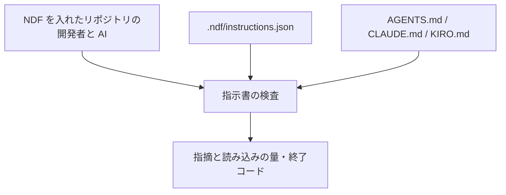
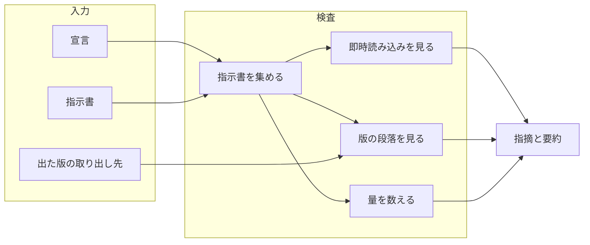
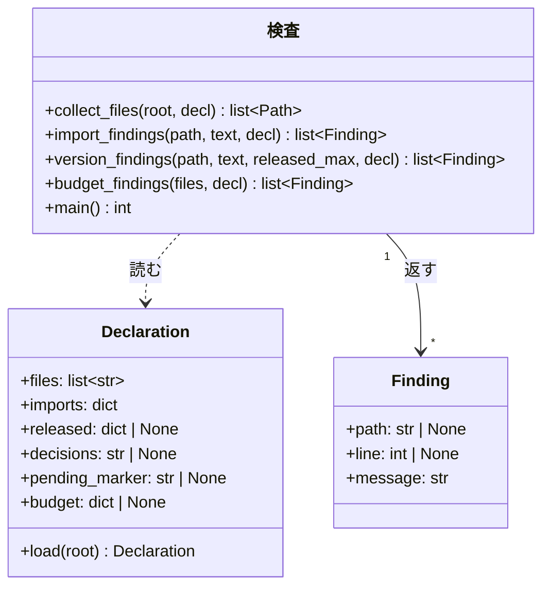
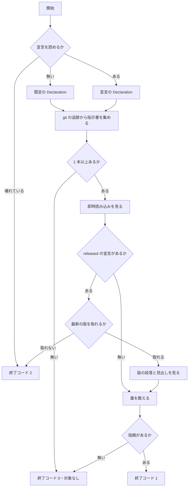

# #554: エージェント向け指示書を適切に保つ検査を NDF から配る

要求と受け入れ条件は [issue-554-requirements.md](issue-554-requirements.md) にある。この文書は「どう作るか」だけを扱う。

## 実例: 宣言の有無で何が動くか

**同じ検査が、リポジトリ側の宣言の有無で違う強さで働く。** 出力の形は次になる（文言は実装で決める）。

```console
$ python3 plugins/ndf/scripts/instructions-check.py --root .
指示書 5 本（根 3 / 配下 2）/ 毎回の読み込み 12,480 バイト
NOTE: 宣言（.ndf/instructions.json）が無いため、出た版と許可の判定は動かない
ERROR: docs/AGENTS.md:12: @docs/none.md の参照先が無い。参照を消すか実在するパスへ直す
```

```console
$ python3 plugins/ndf/scripts/instructions-check.py --root .   # 宣言があるリポジトリ
ERROR: CLAUDE.md:38: v10.0.0 の段落が残っている（出た版: CHANGELOG.md の最新は 10.9.1）。
       次の見出しまでを docs/ndf-version-decisions.md へ移す
ERROR: CLAUDE.md:36: @docs/ndf-version-decisions.md は許可していない即時読み込み。
       @ を外すか、.ndf/instructions.json の imports へ理由とともに足す
```

**この 2 つ目は `ai-plugins` の `f56c90d9` で実際に出る形である**（AC29。判定規則の試作を同じ状態へ通し、
出た版の段落 7 件と許可していない即時読み込み 1 件を得た）。

## 機能一覧

| # | 機能 | 誰が使うか |
| --- | --- | --- |
| F1 | 指示書を集め、本数と毎回の読み込みの量を出す | NDF を入れたリポジトリの開発者と AI |
| F2 | 参照先の無い即時読み込みを指摘する | 同上（宣言が無くても動く） |
| F3 | 許可していない即時読み込みを指摘する | 宣言を書いたリポジトリ |
| F4 | 出た版の段落が指示書に残っていることを指摘する | 版の判断を指示書へ書くリポジトリ |
| F5 | 毎回の読み込みの量が上限を超えたことを指摘する | 上限を宣言したリポジトリ |
| F6 | 配布の手順の中で F1〜F5 を実行する | 配布の担当（`release` を通る側） |

## 構成要素

| 要素 | 責務 | 新設 / 変更 |
| --- | --- | --- |
| 指示書の検査（`plugins/ndf/scripts/instructions-check.py`） | 指示書を集め、宣言を読み、F1〜F5 の指摘を出して終了コードを返す | 新設 |
| 宣言の読み取り（同じスクリプトの中） | `.ndf/instructions.json` を読み、無ければ既定へ倒す。壊れていれば止める | 新設 |
| 宣言の定義（`plugins/ndf/skills/release/schemas/instructions.schema.json`） | 宣言の項目と型を持つ。編集時の補完に使う | 新設 |
| 参照（`plugins/ndf/skills/release/references/instruction-files.md`） | 宣言の書き方・判定の一覧・落ちたときの直し方 | 新設 |
| 配布の手順（`plugins/ndf/skills/release/SKILL.md` の「3. 版と説明文書を更新する」の退避の段落） | 退避の直後に検査を実行することと、参照への案内 | 変更（2〜3 行） |
| 単体テスト（`plugins/ndf/scripts/tests/test_instructions_check.py`） | 判定と終了コードを固定する | 新設 |

**Skill は増えない。** `plugins/ndf/skills/` に新しいディレクトリを作らない（決定 1）。

**下の図に描くのは、実行のときに動く要素だけである。** 宣言の定義・参照・単体テストと、`release` の手順は図に現れない。

### 文脈



**外部の系は無い。** 通信も認証も要らず、読むのは作業ツリーの中のファイルと `git` の追跡情報だけである
（タグを宣言したときだけ `git tag` も読む）。

### 構成要素図



### 配置

```mermaid
graph TD
    subgraph 配布物（4 ランタイム共通）
        S[instructions-check.py]
        R[release の手順と参照]
    end
    subgraph 利用者のリポジトリ
        D[.ndf/instructions.json]
        CI[継続的統合]
    end
    R -->|実行する| S
    CI -->|実行する| S
    D -->|判定の強さを決める| S
```

**配布物は 4 ランタイムで同じ実体である。** agy 向けのディレクトリはスクリプトの実体へのリンクを持ち、
Kiro は導入先からプラグインの `scripts/` を直接読む。**ランタイムごとの複製を作らない。**

### 置き場所

```text
plugins/ndf/
├── scripts/
│   ├── instructions-check.py                 # 新設（実体）
│   └── tests/
│       └── test_instructions_check.py        # 新設
└── skills/release/
    ├── SKILL.md                              # 変更（退避の段落へ 2〜3 行）
    ├── references/instruction-files.md       # 新設（宣言の書き方と判定の一覧）
    └── schemas/instructions.schema.json      # 新設（宣言の定義）
```

## 構造

**型は指摘と宣言の 2 つである。** 判定の関数は指摘の一覧を返し、終了コードは `main` だけが決める。



**`Declaration` は宣言が無くても作る。** 省略した項目は既定値（`files` は 3 つの名前、
`imports` は空、残りは `None`）を持ち、**`None` の項目に対応する判定は動かない**（決定 2）。

## データ構造

**宣言は `.ndf/instructions.json` の 1 ファイルである。** 置き場所と「無ければ静かに既定へ倒す」考え方は
`worktree.json` / `projects.json` と揃える（決定 3）。

| 項目 | 型 | 既定 | 何を決めるか |
| --- | --- | --- | --- |
| `version` | 整数 | 必須 | 宣言の形の版。読めない値なら終了コード 2 |
| `files` | 文字列の配列 | `["AGENTS.md", "CLAUDE.md", "KIRO.md"]` | 走査する指示書の名前 |
| `imports` | オブジェクト | `{}` | 許可する即時読み込み。`{"<指示書>": {"<参照先>": "<理由>"}}`。1 つでも書くと、許可の外を指摘する |
| `released` | オブジェクト | 無し | 出た版の取り出し方。`{"source": "changelog", "path": "...", "pattern": "..."}` または `{"source": "tags", "pattern": "..."}` |
| `decisions` | 文字列 | 無し | 退避先の文書。指摘の文面に出す |
| `pending_marker` | 文字列 | 無し | 版が決まる前の段落の印（例: `の次の版で`） |
| `budget` | オブジェクト | 無し | `{"bytes": 20000}`。毎回の読み込みの上限 |

**`imports` の値は理由を持つ。** 許可を足す人が、毎回読ませる理由を書かずに足せない
（既存の除外の宣言が理由を必須にしているのと同じ形）。

**宣言の例**（`ai-plugins` の場合。「このリポジトリへの適用」で使う）:

```json
{
  "version": 1,
  "files": ["AGENTS.md", "CLAUDE.md", "KIRO.md"],
  "imports": {
    "CLAUDE.md": {"AGENTS.md": "現行の規約そのもので、毎回要る"},
    "KIRO.md": {"AGENTS.md": "同上"}
  },
  "released": {"source": "changelog", "path": "CHANGELOG.md", "pattern": "^## \\[ndf (\\d+\\.\\d+\\.\\d+)\\]"},
  "decisions": "docs/ndf-version-decisions.md",
  "pending_marker": "の次の版で",
  "budget": {"bytes": 30000}
}
```

## 入出力の契約

| 項目 | 内容 |
| --- | --- |
| 名前 | `python3 <プラグインの scripts>/instructions-check.py [--root <リポジトリの根>] [--report]` |
| 入力 | `--root`（既定は現在地）。`--report` はファイルごとの内訳を足す |
| 成功 | 終了コード 0。標準出力に本数と毎回の読み込みの量。宣言が無ければ動かない判定を `NOTE:` で 1 行 |
| 指摘あり | 終了コード 1。標準エラーへ 1 件 1 行。`ERROR: <ファイル>:<行>: <理由>`、行を持たない指摘は `ERROR: <理由>` |
| 読み取れない | 終了コード 2。宣言が JSON として読めない・`version` が未対応・`released` から版を 1 つも取れない・`git` が使えない |
| 呼び出しの誤り | 終了コード 3。知らない引数。標準エラーへ使い方 |
| 対象が無い | 終了コード 0。指示書が 1 本も無いことを 1 行出す（AC3） |
| 互換性 | 新設。既存の呼び出し側は無い |

**2 を 0 へ畳まない。** 確かめられなかったことを、通ったと報告しない（既存の配布スクリプトと同じ扱い）。

## 処理の流れ



### 指示書を集める

**`git ls-files -z` が返す追跡対象から、`files` の名前と一致するものを集める**（AC1 / AC2）。
非 ASCII のパスを 8 進で表さない形で受け取るため `-z` を使う。

| 位置 | 例 | 量の集計 | 判定 |
| --- | --- | --- | --- |
| 根 | `CLAUDE.md` | 入れる（毎回読まれる） | すべて |
| 配下 | `docs/AGENTS.md` | 入れない（その場所で作業したときだけ読まれる） | すべて |
| 根の指示書が `@` でたどる先 | `AGENTS.md` から引く文書 | 入れる | 指示書としての判定はしない |

**配下の指示書も判定の対象にする。** 読まれる頻度は低いが、参照先が消えていることと出た版の段落が
残っていることは、読まれた時点で同じだけ効く（利用者の言う「インストールされたスコープ全体」の読み方）。

### 即時読み込みを見る

**判定はコードブロックの外・コードスパンの外で行う。** `@` の直前が行頭・空白・`*`・`_`・`~` のどれかであるものを
参照とし、名前は `@` の直後から続く ASCII のパスの文字（英数字と `.` `_` `-` `/` `~`）の並びとする。並びの末尾の
`.` / `_` / `~` は落とす。並びが空なら参照としない。

| 書き方 | 読み込まれるか（実測） | 検査 |
| --- | --- | --- |
| 空白の直後 `@b.md` | 読み込まれる | 参照として見る |
| 強調の中 `**@a.md**` | 読み込まれる | 参照として見る（名前は `a.md`） |
| コードスパン `` `@c.md` `` / コードブロックの中 | 読み込まれない | 見ない |
| 括弧の直後 `(@g.md)` / `（@d.md）` | 読み込まれない | 見ない |
| 日本語の直後 `直後@f.md` / メール風 `user@h.md` | 読み込まれない | 見ない |

| 実測の条件 | 値 |
| --- | --- |
| CLI 版 | Claude Code 2.1.274 |
| 置いたもの | 空のディレクトリに `CLAUDE.md` と参照先 8 本。参照先の中身は別々の合言葉 |
| 問い | `claude -p "<コンテキストの合言葉を列挙>" --allowedTools ""` |
| 結果 | 応答に出た合言葉は `a.md` と `b.md` の 2 つ |

参照を得たら 2 つを見る。

| 条件 | 指摘 |
| --- | --- |
| 参照先が存在しない | 常に指摘する（F2。宣言は要らない） |
| `imports` が空でなく、その指示書の許可に無い | 指摘する（F3） |
| `imports` に書いた許可の指し先が存在しない | 指摘する（宣言の陳腐化） |

### 版の段落を見る

**行の種類で 2 つに分ける。** 分岐は行頭が `#` 1〜6 個と空白かどうかだけで決まる。

| 行の種類 | 見る位置 | 拾う形 |
| --- | --- | --- |
| 見出しの行 | 見出しの文字列のどこでも | `v<版数>` または `<版数>` |
| それ以外の行 | 書き出しだけ（箇条書き記号と強調を読み飛ばした直後） | 同上 |

| 形 | 指摘する条件 |
| --- | --- |
| 版数（印が続かない） | 基底（接尾辞を除いた数字 3 つ）が最新**以下** |
| 版数 + `pending_marker` | 基底が最新**未満**。印を宣言していなければこの行は判定しない |

**最新は `released` の宣言から取る**（決定 5）。`changelog` は文書とその行の形、`tags` はタグの形を受け取る。
**取れないときは終了コード 2 で止める。** 判定できないことを通過にしない（AC16）。

## 非機能の実現方式

| 大項目 | 要求の条件 | 実現方式 | 確かめ方 |
| --- | --- | --- | --- |
| 運用・保守性 | 指摘は 1 件 1 行で、直し方を含む。外部への通信・CLI の認証を要さない | 指摘の文面に退避先（`decisions`）と宣言の項目名を入れる。読むのは作業ツリーのファイルと `git` だけ | テストが出力の形と、文面に退避先が出ることを見る |
| 移行性 | 宣言が無いリポジトリでも動き、既定の判定だけが働く | `Declaration` の項目を `None` にし、対応する判定を飛ばす（決定 2） | 宣言の無い一時ディレクトリで、出た版の判定が動かないことを見る |
| システム環境 | Python 3 の標準ライブラリだけで動く。浅い clone で動く | `re` / `json` / `argparse` / `pathlib` / `subprocess`（`git ls-files`）だけを使う | タグを使わない宣言で、浅い clone を模したディレクトリを走らせる |

## 決定の記録

### 決定 1: 新しい Skill を作らず、配布のスクリプト 1 本と既存の `release` の手順へ置く

**実行するのは 1 コマンドで、手順としての判断が要らない。** 判断が要るのは「どこへ退避するか」で、それは
`release` の退避の手順が既に持っている。呼ぶ場所もそこである。

**Skill を足すと、その説明文が全セッションの固定費に乗る。** 指示書の固定費を減らす機能のために、
別の固定費を増やすことになる。配布の側でも、Skill の追加は配る先の一覧・数の記載・生成物へ波及する。

採らなかった案は 3 つある。

| 採らなかった案 | 理由 |
| --- | --- |
| `markdown-writing` へ入れる | 文書の書き方の規約を持つ Skill で、リポジトリの状態を見る検査を持たない。指示書だけを対象にする手順も持たない |
| `quality-gates` へ入れる | 完了の証跡の求め方を持つ Skill で、個別の検査は持たない。ここへ検査を足すと、以後すべての検査がここへ集まる |
| セッション開始の hook で自動で走らせる | 開発の途中の状態でも毎回出る。**指摘を消すために退避を急ぐ**ことになり、版が決まる前に移す |

### 決定 2: 判定の強さはリポジトリ側の宣言で決め、宣言が無ければ既定の 2 つだけを動かす

**利用者は NDF を入れた任意のリポジトリである。** 版を持たないリポジトリ、変更履歴の文書を持たない
リポジトリ、指示書を 1 本しか持たないリポジトリがある。**全部に同じ判定を掛けると、入れた瞬間に落ちる。**

宣言が無くても動かすのは、リポジトリの性質によらず誤りである 2 つ（参照先の無い即時読み込み）と、
落とさずに数える 1 つ（読み込みの量の報告）に限る。

**宣言が無いことを終了コード 2 にしない。** 宣言を書くまで使えない検査は、入れた利用者が最初に外す。

### 決定 3: 宣言は `.ndf/instructions.json` に置く

`worktree.json` / `projects.json` と同じ場所に置く。**リポジトリ側の宣言を 1 か所へ集めると、
利用者が「NDF に渡している値」を 1 つのディレクトリで見渡せる。**

**1 つの大きな宣言へ相乗りしない。** `worktree.json` は作業ツリーの運用が読む値だけを持ち、読み手が違う。
足すと、片方の仕組みだけを使うリポジトリにも無関係な項目が現れる。

### 決定 4: 走査は `git` が追跡する既定の 3 つの名前とし、根と配下を区別する

**追跡していないファイルを入れると、実行した環境で結果が変わる。** 手元にだけある草稿が判定に入る。

**根と配下は読まれ方が違う。** 根は毎回、配下はその場所で作業したときに読まれる。**量の集計は根に限り、
判定は両方に掛ける**（「指示書を集める」の表）。量へ配下を足すと、毎回の固定費と条件付きの費用が混ざる。

採らなかった案は 2 つある。**根だけを対象にする**のは、利用者の言う「インストールされたスコープ全体」を
満たさない。**`.kiro/steering/` や `.claude/` の下まで既定で見る**のは、名前で指示書と判別できないためである
（宣言の `files` へ書けば対象になる）。

### 決定 5: 出た版の取り出し方は宣言から受け取り、2 つの形を用意する

| 形 | 何を読むか | 向く相手 |
| --- | --- | --- |
| `changelog` | 変更履歴の文書の、宣言した形の行 | 変更履歴を持つリポジトリ。**配布の Pull Request の中で落ちる**（版の節を足すのと同じ操作で判定が変わる） |
| `tags` | 宣言した形のタグの最大値 | 変更履歴を持たないリポジトリ |

**タグを既定にしない。** タグは配布の後に打つため、配布の Pull Request の時点では無い。浅い clone の
継続的統合でも取得されない。**どちらを使うかはリポジトリが決める。**

**節の一覧との一致ではなく、最大値との大小で見る。** 一覧で見ると、変更履歴に節を持たない版
（開発版までしか出なかった版）の段落を取りこぼす。

### 決定 6: 版の段落は行頭の版数と見出しの版数で拾い、印は宣言があるときだけ見る

**行の途中の版数まで見ると、現行の規約の文が指摘される。** 「この版で廃止した」のような注記や、
現行版を示す表示が本文の途中に出る。

**版が決まる前の段落の印は、言い回しがリポジトリごとに違う。** 既定を置かず、`pending_marker` を宣言した
リポジトリでだけ見る。印を持たないリポジトリでは、版数の付いた段落だけが判定の対象になる。

### 決定 7: 読み込みの量はバイトで数え、上限は宣言があるときだけ判定する

**トークン数では測らない。** 継続的統合に CLI の認証と課金が要り、値は読み込む設定（利用者の記憶・
導入済みプラグイン）で変わる。PR #552 の実測も、同じ現在地・同じ設定で測った差だけを比べている。

**バイト数は絶対値としては粗いが、増減は追える。** 上限を宣言しなくても毎回出力に出るため、
**増えたことは宣言の無いリポジトリでも見える**。

### 決定 8: 「適切に保つ」に入れる観点を 4 つに絞る

| 観点 | 扱い | 理由 |
| --- | --- | --- |
| 参照先の無い即時読み込み | 入れる | リポジトリの性質によらず誤り。宣言が無くても判定できる |
| 許可していない即時読み込み | 入れる | 毎回の読み込みを増やす唯一の記法で、許可の一覧が宣言で書ける |
| 出た版の段落 | 入れる | #554 の起点。宣言があるときだけ動く |
| 読み込みの量 | 入れる | 増減が数字で見える。落とすのは上限を宣言したときだけ |
| 指示書どうしの重複した段落 | 入れない | 同じ規約を意図して再掲する書き方（要約と詳細）があり、機械では区別できない |
| ランタイム間で内容が食い違うこと | 入れない | 同じ意味かどうかの判定になる |
| 現行でない記述（版数以外） | 入れない | 同上。版数を持つものだけが機械で判定できる |
| Markdown のリンク切れ | 入れない | 即時読み込みではないため毎回の読み込みに乗らない。リンクの検査を持つリポジトリの領分 |

### 決定 9: 即時読み込みの一致範囲は実測に合わせる

**広く取ると誤検知が、狭く取ると見逃しが出る。** 8 通りを実測し、読み込まれた 2 通り（行頭・空白の直後、
強調の中）を参照として見る（「即時読み込みを見る」の表）。読み込まれない書き方まで指摘すると、
囲む必要の無い記載を直させることになる。

**測ったのは Claude Code だけである。** 他のランタイムが同じ記法を読むかは未確認として残す。許可の一覧に
載らない参照を指摘する判定は、読まないランタイムでも害にならない。

### 決定 10: 実体は配布物の中で完結させる

**利用者のリポジトリの `scripts/` を読まない。** 配布物は任意のリポジトリで動くため、リポジトリ側の
ファイルに依存できない。コードスパンの扱いのような共通の処理も、配布物の中に持つ。

**配布物の中で共有するなら `plugins/ndf/scripts/lib/` へ置く。** 今回は 1 本だけが使うため、
スクリプトの中に持つ。2 本目が要るようになった時点で移す。

### 決定 11: このリポジトリへの適用は、配布物とは別の節に置く

**`ai-plugins` は利用者の 1 例である。** 宣言・継続的統合のジョブ・必須の検査・手順の記載は、
配布物の設計ではなく適用の設計である。混ぜると、次に読む人が「変更履歴の文書の形」や
「必須の検査」を配布物の前提だと読む。

## このリポジトリへの適用

**配布物の機能とは別立てである。** 実装の Pull Request には入るが、配布物の振る舞いを決めない。

| # | すること | 受け入れ条件 |
| --- | --- | --- |
| 1 | `.ndf/instructions.json` を置く（「データ構造」の例のとおり） | AC28 / AC29 |
| 2 | `.github/workflows/runtime-plugin-validate.yml` へジョブ `instruction-files-check` を足す。Pull Request では絞り込まずに起動し、push の絞り込みへ `CHANGELOG.md` と `.ndf/**` を足す | AC30 / AC31 |
| 3 | `CLAUDE.md` の「版ごとの判断の記録」へ、版が決まる前の印と検査のコマンドを書く | AC32 |
| 4 | `docs/versioning-and-distribution.md` の「バージョン更新時の手順」へ検査を足し、手順 4 の置き場所を直し、「必須の検査 11 個」の数を直す | AC33 / AC34 |
| 5 | `CHANGELOG.md` の冒頭の置き場所を直す | AC35 |
| 6 | ruleset（`protect main and develop`）の必須の検査へ `instruction-files-check` を入れる | **実装の差分に入らない。** 入れると決まっており（利用者の判断）、実行は実装 Pull Request のマージ後に進行側が行う |

**3 と 5 は、規則と逆のことを書いている記載を直す。** どちらも「判断の理由は `CLAUDE.md` に置く」と書いており、
#551 で決めた置き場所（`docs/ndf-version-decisions.md`）と食い違う。

## テスト設計

**テストは一時ディレクトリに最小のリポジトリ（`git init` と指示書）を作り、`--root` で渡す**
（既存の検査のテストと同じ形）。継続的統合は浅い clone で過去のコミットを持たないため、`f56c90d9` は
テストから読まない。**実例の再現（AC29）は実装の Pull Request の本文へ手順と出力を残す。**

| 受け入れ条件 | 何で確かめるか |
| --- | --- |
| AC1 / AC2 / AC3 / AC4 | テスト: 根と配下に指示書を置いた一時リポジトリ、未追跡のファイル、指示書の無いリポジトリ、`files` を足した宣言の 4 通り |
| AC5 / AC6 / AC7 / AC8 | テスト: 参照の書き方 8 通りを 1 つの指示書へ書き、指摘される 2 通りだけが出る |
| AC9 | テスト: 根の指示書と `@` の先の合計が出力に出る。配下の指示書の分が合計へ入らない |
| AC10 | テスト: 宣言の無い根で、出た版の段落を書いても指摘されず、`NOTE:` の行が出る |
| AC11 / AC12 | テスト: `imports` を宣言した根で、許可の外の参照と、指し先の無い許可がそれぞれ指摘される |
| AC13 / AC14 | テスト: `changelog` の宣言と、最新以下・最新より新しい版の段落 |
| AC15 | テスト: `tags` の宣言でタグを 2 つ打ち、最大値が最新になる |
| AC16 / AC20 | テスト: 版を取れない宣言、壊れた JSON、未対応の `version` で終了コード 2 |
| AC17 | テスト: `pending_marker` を宣言し、基底が最新・最新未満の 2 通り |
| AC18 | テスト: 指摘の文面に `decisions` の値が出る |
| AC19 | テスト: `budget.bytes` を超える指示書で終了コード 1 |
| AC21 / AC22 / AC23 | テスト: 出力の形、指摘が無いときの標準出力、知らない引数で終了コード 3 |
| AC24 | テスト: `plugins/ndf/skills/` に新しいディレクトリが無いことを、配る先の一覧の行数で見る |
| AC25 | 手順: `release` の差分と、新設した参照を読む |
| AC26 / AC27 / AC36 | 手順: 既存の検査とビルドの確認を実行し、終了コード 0 を見る |
| AC28 / AC29 | 手順: このリポジトリの根での実行と、`git archive f56c90d9 …` を展開した一時ディレクトリでの実行 |
| AC30 / AC31 | 手順: ワークフローの差分を読み、実装の Pull Request の checks を見る |
| AC32 / AC33 / AC34 / AC35 | 手順: 差分を読む |
| AC37 | 手順: `uv run --with pytest pytest scripts/tests plugins/ndf -q` の失敗の件数が `develop` と同じ（既知の環境要因の 6 件を除く） |

## 未確認のまま残ること

| 項目 | 内容 | いつ決まるか |
| --- | --- | --- |
| Claude Code 以外の即時読み込み | Codex / agy / Kiro が `@<パス>` を読み込むかは測っていない。判定は Claude Code の範囲で決める | 測らない。許可の一覧に載らない参照を指摘しても、読まないランタイムでは害が無い |
| 印を持たない段落 | `pending_marker` を使わずに書いた現行版の段落は検出できない | 次の配布で漏れが出たら、印を必須にするかを別の課題で決める |
| 宣言の項目の過不足 | 他のリポジトリで足りない項目が出るか | 実際に他のリポジトリへ入れたときに分かる。`version` を持つため、足す側の変更ができる |
| 出力の文言 | 「入出力の契約」と実例の文面は形の例で、句読点と語順は実装で決める | 実装 |
| 量の上限の目安 | このリポジトリの `budget.bytes` にどの値を置くか | 実装（現在の実測値を見て決める） |

## 実装の分け方と他の束との関係

**実装は 1 本の Pull Request にする。** 配布物（検査・参照・`release` の 2〜3 行）と適用（宣言・ジョブ・手順の記載）は
同じ規則を指しており、分けると検査だけが入って適用の無い期間か、宣言だけが入って検査の無い期間ができる。

| 束 | 重なり | 扱い |
| --- | --- | --- |
| G1（PR #739） | **`release` SKILL.md を触る** | この設計が触るのは「3. 版と説明文書を更新する」の退避の段落だけである。G1 の実装が同じ節を触るなら、後から入る側が取り込む |
| G2（PR #741） | `scripts/parallel-measure.py` を新設 | 触るファイルが違う |
| G3（PR #740） | `skill-stats` / `retrospective` など | 重ならない |
| 配布の Pull Request | `CHANGELOG.md` の先頭へ版の節を足す | 触るのは冒頭の 1 文で、版の節とは行が離れている。**この検査が入った後の配布から、退避の漏れが配布の Pull Request で落ちる** |
