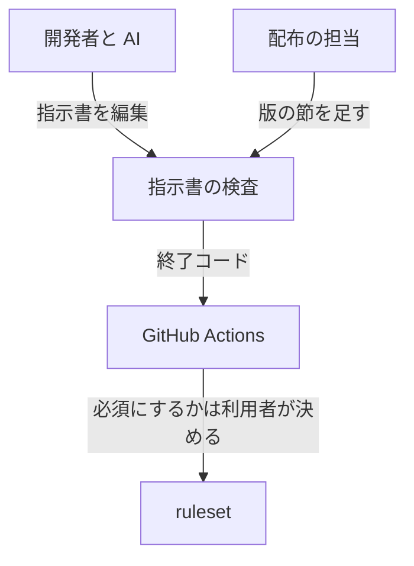
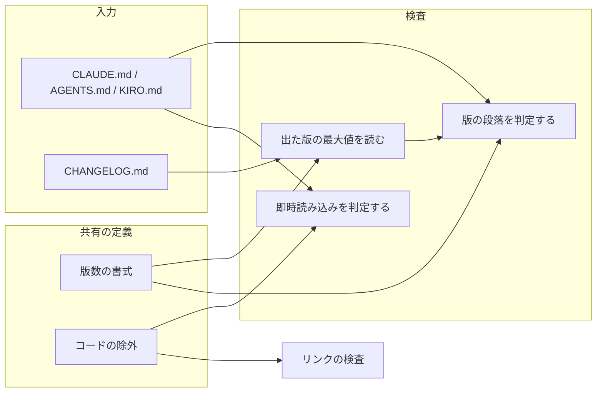
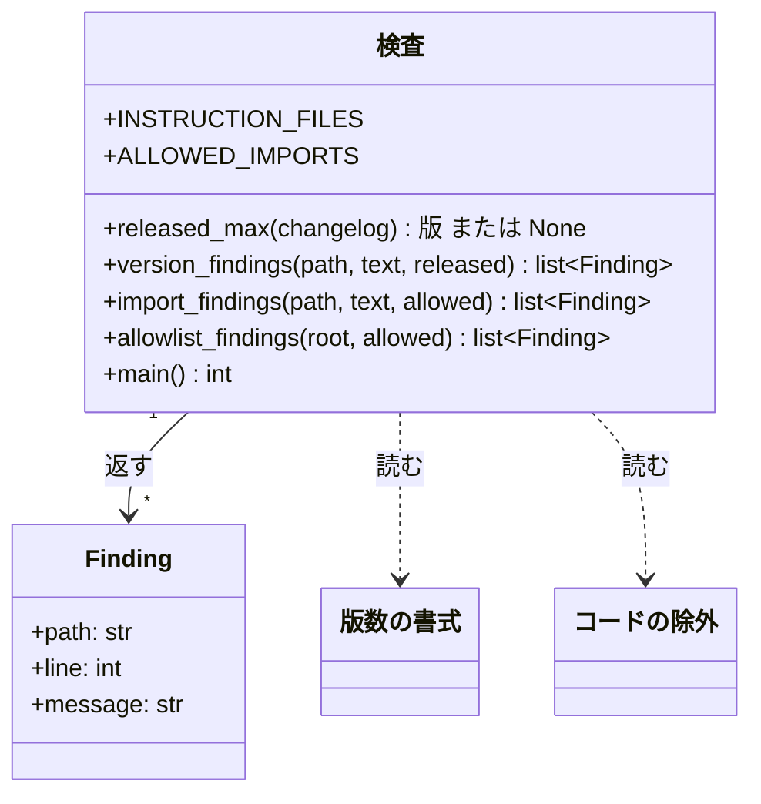
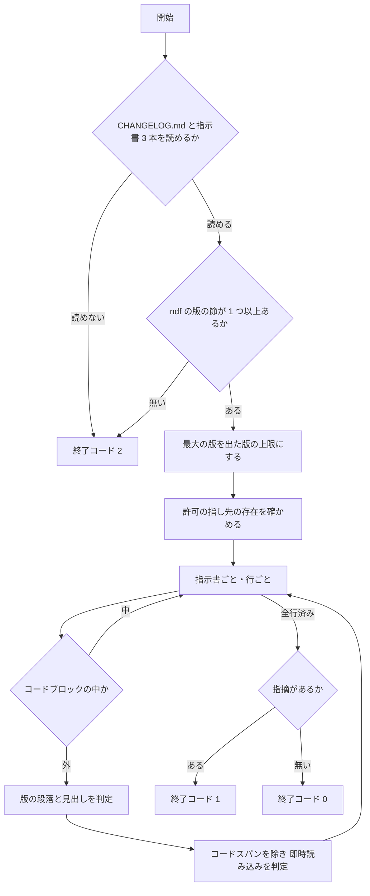

# #554: 指示書の「現行版だけを残す」規則を検査する

要求と受け入れ条件は [issue-554-requirements.md](issue-554-requirements.md) にある。この文書は「どう作るか」だけを扱う。

## 実例: この検査が #551 の直前の状態に出す 8 行

**`f56c90d9`（PR #552 のマージの直前の `develop`）の指示書 3 本と `CHANGELOG.md` を、この設計の判定規則に通した結果である。**
規則を 40 行の試作に起こし、一時ディレクトリで実行した（試作はコミットしない）。

```console
$ git archive f56c90d9 CLAUDE.md AGENTS.md KIRO.md CHANGELOG.md | tar -x -C old
$ python3 proto.py old
max (10, 9, 1)
CLAUDE.md:36: @docs/ndf-version-decisions.md
CLAUDE.md:38: 版 (10, 0, 0)
CLAUDE.md:88: 版 (10, 1, 0)
CLAUDE.md:113: 版 (10, 2, 0)
CLAUDE.md:137: 版 (10, 3, 0)
CLAUDE.md:172: 版 (10, 4, 0)
CLAUDE.md:207: 版 (10, 5, 0)
CLAUDE.md:252: 版 (10, 5, 1)
errors 8
$ python3 proto.py /work/ai-plugins      # 現在の develop（3d3f1acf）
max (10, 14, 0)
errors 0
```

| 出力 | 何を指摘したか |
| --- | --- |
| `max (10, 9, 1)` | 当時の `CHANGELOG.md` の最新の `ndf` の版。**これ以下が出た版** |
| `@docs/ndf-version-decisions.md` | 許可していない即時読み込み。出た版の記録を毎回読ませていた |
| `版 (10, 0, 0)` 〜 `版 (10, 5, 1)` の 7 行 | 行頭が `v<版数> で` で、版数が 10.9.1 以下の段落 |

**現在の `develop` は 0 件で通る。** 次の 4 つは、版数や `@` を含んでも指摘されない。

| 場所 | 記載 | 指摘されない理由 |
| --- | --- | --- |
| `AGENTS.md` | `（v10.14.0）` | 行の途中の版数 |
| `AGENTS.md` | `（v4.0.0 で Codex MCP サーバは廃止）` | 行の途中の版数 |
| `KIRO.md` | `` `npm install -g @openai/codex` `` | コードスパンの中 |
| `KIRO.md` | `<@U0123456789>` | コードブロックの中 |

## 機能一覧

| # | 機能 | 誰が使うか |
| --- | --- | --- |
| F1 | 指示書に残った出た版の段落・見出しを指摘する | Pull Request を出す開発者と AI、継続的統合 |
| F2 | 版が決まる前に書いた段落が、版の配布の後に残っていれば指摘する | 配布の Pull Request を作る担当 |
| F3 | 指示書の即時読み込みの参照を、許可した先だけに限る | 指示書を編集する開発者と AI、継続的統合 |
| F4 | 版を上げる手順の中で、退避の漏れをその場で知らせる | 配布の担当（`docs/versioning-and-distribution.md` の手順を読む側） |

## 構成要素

| 要素 | 責務 | 新設 / 変更 |
| --- | --- | --- |
| 指示書の検査（`scripts/check-instruction-files.py`） | 指示書 3 本と `CHANGELOG.md` を読み、F1〜F3 の指摘を出して終了コードを返す | 新設 |
| コードの除外（`scripts/lib/markdown_code.py`） | 1 行からコードスパンを取り除く。リンクの検査と共有する | 新設（`check-markdown-links.py` から移す） |
| リンクの検査（`scripts/check-markdown-links.py`） | コードスパンの除去を共有の定義から読む。振る舞いは変えない | 変更 |
| 版数の書式（`scripts/lib/version_pattern.py`） | 版数の正規表現を持つ。検査はここから読む | 変更なし（読むだけ） |
| 継続的統合のジョブ（`runtime-plugin-validate.yml` の `instruction-files-check`） | Pull Request ごとに検査を走らせる | 変更（ジョブを足す） |
| 規約（`CLAUDE.md` の「版ごとの判断の記録」） | 版が決まる前の書き出しの形と、検査のコマンドを書く | 変更 |
| 版を上げる手順（`docs/versioning-and-distribution.md`） | 手順へ検査を足し、判断の置き場所の記載を直す | 変更 |
| 変更履歴の冒頭（`CHANGELOG.md`） | 判断の置き場所の記載を直す | 変更 |
| テスト（`scripts/tests/test_check_instruction_files.py`） | AC1〜AC19 の判定を固定する | 新設 |

### 文脈



**外部の系は GitHub Actions と ruleset の 2 つである。** ruleset はこの変更で触らない（「利用者の確認が要る事項」）。

### 構成要素図



### 置き場所

```text
scripts/
├── check-instruction-files.py        # 新設
├── check-markdown-links.py           # 変更（コードスパンの除去を lib から読む）
├── lib/
│   ├── markdown_code.py              # 新設（check-markdown-links.py から移す）
│   └── version_pattern.py            # 変更なし
└── tests/
    └── test_check_instruction_files.py  # 新設
.github/workflows/runtime-plugin-validate.yml  # ジョブと push の絞り込みを足す
CLAUDE.md                                        # 「版ごとの判断の記録」へ 2 段落
docs/versioning-and-distribution.md              # 「バージョン更新時の手順」
CHANGELOG.md                                     # 冒頭の 1 文
```

## 構造

**検査が持つ型は指摘の 1 つだけである。** 判定の関数は指摘の一覧を返し、終了コードは `main` だけが決める。



| 定数 | 値 | 値に書く理由 |
| --- | --- | --- |
| `INSTRUCTION_FILES` | `("CLAUDE.md", "AGENTS.md", "KIRO.md")` | 全セッションが毎回読む 3 本（決定 6） |
| `ALLOWED_IMPORTS` | `{"CLAUDE.md": {"AGENTS.md": 理由}, "KIRO.md": {"AGENTS.md": 理由}}` | 許可ごとに、毎回読ませてよい理由を値に持つ（`check-doc-line-limit.py` の `EXEMPT` と同じ形） |
| `FAMILY` | `"ndf"` | 版の判断を指示書へ書くプラグイン（前提 1） |

## 入出力の契約

| 項目 | 内容 |
| --- | --- |
| 名前 | `python3 scripts/check-instruction-files.py [--root <リポジトリの根>]` |
| 入力 | `--root`（既定 `.`）。その直下の `CLAUDE.md` / `AGENTS.md` / `KIRO.md` / `CHANGELOG.md` を読む。git も通信も使わない |
| 成功 | 終了コード 0。標準出力に `Instruction files keep only the current version (3 files, released ndf <版>)` の 1 行 |
| 指摘あり | 終了コード 1。標準エラーへ指摘ごとに 1 行。形は下の表 |
| 読み取れない | 終了コード 2。標準エラーへ理由の 1 行。`CHANGELOG.md` が無い / `## [ndf X.Y.Z]` の節が 1 つも無い / 指示書のいずれかが無い |
| 互換性 | 新設。既存の呼び出し側は無い。`check-markdown-links.py` の出力と終了コードは変わらない |

| 指摘 | 出力の形 |
| --- | --- |
| 出た版の段落 | `ERROR: CLAUDE.md:38: v10.0.0 の段落が残っている（出た版: CHANGELOG.md の最新は ndf 10.9.1）。次の見出しまでを docs/ndf-version-decisions.md へ移す` |
| 配布を越えた「次の版」 | `ERROR: CLAUDE.md:40: v10.14.0 の次の版の段落が残っている（ndf 10.15.0 が出ている）。書き出しを v10.15.0 で に直して docs/ndf-version-decisions.md へ移す` |
| 出た版の見出し | `ERROR: CLAUDE.md:12: 見出しが出た版 v10.5.0 を指している（…）。節ごと docs/ndf-version-decisions.md へ移す` |
| 許可していない即時読み込み | `ERROR: CLAUDE.md:36: @docs/ndf-version-decisions.md は許可していない即時読み込み。参照先の内容が毎回読み込まれる。@ を外すかコードスパンで囲む。毎回要るなら ALLOWED_IMPORTS へ理由とともに足す` |
| 許可の指し先が無い | `ERROR: ALLOWED_IMPORTS の CLAUDE.md → AGENTS.md は指し先が存在しない。許可を外す` |

**`--root` を持つのは既存の検査 3 本に合わせるためである。** `check-doc-line-limit.py` / `check-markdown-links.py` / `check-doc-staleness.py` が同じ引数を持つ。
テストは一時ディレクトリを `--root` で渡して動かす。

## 処理の流れ



### 版の段落の判定

**行頭の書き出しだけを見る**（決定 4）。行頭から順に、任意の見出し記号（`#` 1〜6 個と空白）・任意の箇条書き記号（`- ` / `* `）・
任意の強調（`**`）を読み飛ばし、その直後が次のどちらかなら版の段落とする。

| 書き出し | 出た版として指摘する条件 | 例（最新が 10.14.0） |
| --- | --- | --- |
| `v<版数> で` | 版数の基底（接尾辞を除いた 3 つの数）が最新**以下** | `v10.14.0 で` / `v10.14.0-dev.1 で` / `v9.8.0 で` は指摘、`v10.15.0 で` / `v10.15.0-dev.1 で` は通す |
| `v<版数> の次の版で` | 版数の基底が最新**未満** | `v10.14.0 の次の版で` は通す、`v10.13.0 の次の版で` は指摘 |

**見出しは書き出しを問わない。** `#` で始まる行に `v<版数>` があり、基底が最新以下なら指摘する（AC6）。
`の次の版` が続くときは、上の表の 2 行目と同じく未満で見る。

**最新は `CHANGELOG.md` の `## [ndf X.Y.Z]` の節の最大値である。** `## [playwright-kit …]` は読まない（AC9）。
`CHANGELOG.md` は開発版を載せない規約のため、節の版数は接尾辞を持たない。

**`CHANGELOG.md` に節の無い版も、最新以下なら出た版として扱う**（AC5）。`9.8.0` は開発版までしか出ず、節が無い。
一覧との一致で見ると、この版の段落を取りこぼす。

### 即時読み込みの判定

**Claude Code が読み込む範囲に合わせる**（決定 5）。コードブロックの行を飛ばし、コードスパンを空白へ置き換えた後、
`@` の直前が**行頭・空白・`*`・`_`・`~`** のどれかであるものを参照とする。参照の名前は `@` の後ろから空白の手前までで、
末尾の `*` / `_` / `~` を落とす。

| 書き方 | 読み込まれるか（実測） | 検査 |
| --- | --- | --- |
| 空白の直後 `@b.md` | 読み込まれる | 参照として見る |
| 強調の中 `**@a.md**` | 読み込まれる | 参照として見る（名前は `a.md`） |
| コードスパン `` `@c.md` `` | 読み込まれない | 見ない |
| コードブロックの中 | 読み込まれない | 見ない |
| 半角括弧の直後 `(@g.md)` | 読み込まれない | 見ない |
| 全角括弧の直後 `（@d.md）` | 読み込まれない | 見ない |
| 日本語の直後 `直後@f.md` | 読み込まれない | 見ない |
| メール風 `user@h.md` | 読み込まれない | 見ない |

| 実測の条件 | 値 |
| --- | --- |
| CLI 版 | Claude Code 2.1.274 |
| 置いたもの | 空のディレクトリに `CLAUDE.md` と参照先 8 本。参照先の中身は別々の合言葉 |
| 問い | `claude -p "<コンテキストの合言葉を列挙>" --allowedTools ""` |
| 結果 | 応答に出た合言葉は `a.md` と `b.md` の 2 つ |

参照の名前が、その指示書の `ALLOWED_IMPORTS` に無ければ指摘する。**`AGENTS.md` の許可は空である**（`AGENTS.md` から読み込みを足すと指摘される）。

## 非機能の実現方式

| 大項目 | 要求の条件 | 実現方式 | 確かめ方 |
| --- | --- | --- | --- |
| 運用・保守性 | 指摘は `ERROR: <ファイル>:<行>: <理由>` の 1 行で、直し方を含む。外部への通信・CLI の認証を要さない | 入出力の契約の表の形で出す。読むのはローカルのファイルだけ | テストが出力の行と文言の要素（行番号・版数・退避先）を見る |
| システム環境 | Python 3 の標準ライブラリだけで動く。`actions/checkout` の既定（浅い clone・タグなし）で動く | `re` / `argparse` / `pathlib` / `dataclasses` だけを使う。git もタグも読まない（決定 2） | ジョブに `setup-python` 以外の準備を置かず、実装の Pull Request の checks で pass を見る |

## 決定の記録

### 決定 1: 見るのは「出た版の段落」と「即時読み込みの参照」の 2 つにする

#551 の直前の状態が既存の検査を通った原因は、**中身が過去の記録であること**と、**過去の記録を即時読み込みで引いていたこと**の 2 つである。
この 2 つを見れば、実例の 8 行がすべて指摘される。

**読み込みの量（課題の案の 3 つ目）は検査にしない。**

| 測り方 | 検査にしない理由 |
| --- | --- |
| トークン数 | 継続的統合に CLI の認証と課金が要る。値は読み込む設定（利用者の記憶・導入済みプラグイン）で変わる。PR #552 の実測も、同じ現在地・同じ設定で測った差だけを比べている |
| 文字数・バイト数 | 行数と同じく「基準内なら中身を問わない」穴が残る |

### 決定 2: 出た版の上限は `CHANGELOG.md` の `ndf` の節の最大値から取る。タグは使わない

**配布の Pull Request は、版の節を `CHANGELOG.md` へ足す Pull Request の中で退避もする。** v10.12.0-dev.1 と v10.14.0-dev.1 の配布がこの形である。
上限を `CHANGELOG.md` から取れば、退避を忘れたその Pull Request の中で検査が落ちる。

**タグは採らない。** タグは `main` へ進めた後に打つため、配布の Pull Request の時点では存在せず、漏れが次の Pull Request まで見えない。
加えて `actions/checkout` の既定はタグを取得しない。`plugin.json` の版数も採らない。開発中の `develop` では前の正式版のまま残り
上限としては同じ値になるが、「出た版」の一覧ではなく、節の無い版の扱いを `CHANGELOG.md` と別に決める必要が出る。

**一覧との一致ではなく最大値との大小で見る。** 一致で見ると、`CHANGELOG.md` に節の無い版（開発版までしか出なかった `9.8.0`）の段落を取りこぼす。

### 決定 3: 版が決まる前の段落は `v<直前の正式版> の次の版で` と書き出す

**マイルストーンが版数を持たないため、開発中は段落へ版数を書けない。** 版数の無い書き出し（「この版で」）で書くと、配布の後に残っても
機械では見分けられない。直前の正式版を書き出しに入れれば、`CHANGELOG.md` にそれより新しい版が載った時点で「配布を越えて残った」と判定できる。

**配布の担当は、書き出しを `v<出す版> で` に直して退避先へ移す。** 退避先の書き出しの形（`v10.14.0 で …`）と揃う。

採らなかった形は 2 つある。

| 採らなかった形 | 理由 |
| --- | --- |
| 版の段落を指示書へ書かせない（最初から退避先へ書く） | #551 で決めた「現行版で決めたことは指示書に残す」を覆す。この課題の範囲を超える |
| 節の見出しに基点を持たせる（`## 現行版（v10.14.0 の次）で決めたこと`） | 現行版の判断を書く節が 1 つに固定される。規約の各節（`## cross-review` など）へ書き足す今の書き方と合わない |

**この形で書かれていない段落は検出できない。** 規約に書き出しの形を書き、検出の側へ寄せるところまでをこの課題の範囲とする（「未確認のまま残ること」）。

### 決定 4: 版の段落は行頭の書き出しと見出しだけで判定する

退避先と #551 以前の `CLAUDE.md` は、どちらも段落を `v<版数> で` で書き出している。**行の途中の版数まで見ると、現行の規約の文が指摘される。**
`AGENTS.md` の `（v10.14.0）` は現行版の表示で、`check-doc-staleness.py` が `plugin.json` と突き合わせている。
`（v4.0.0 で Codex MCP サーバは廃止）` は現行の構成を説明する注記である。行の途中まで見るなら、この 2 つを除外の一覧へ載せ続けることになる。

### 決定 5: 即時読み込みの一致範囲は実測に合わせ、許可の一覧をスクリプトに持つ

**一致を広く取ると誤検知が、狭く取ると見逃しが出る。** 「処理の流れ」の表の 8 通りを Claude Code で実測し、読み込まれた 2 通り
（行頭・空白の直後、強調の中）を参照として見る。読み込まれない書き方まで指摘すると、コードスパンで囲む必要の無い記載を直させることになる。

**許可の一覧は理由を値に持つ辞書にする**（`check-doc-line-limit.py` の `EXEMPT` と同じ形）。許可を足す人が、毎回読ませる理由を書かずに足せない。
**指し先の無い許可も指摘する。** 許可だけが残ると、同じ名前のファイルを後から作ったときに黙って毎回読み込まれる。

採らなかった案は、**`@` を指示書から一切禁じる**である。`@AGENTS.md` は現行の規約そのものを読ませる参照で、PR #552 も残すと決めている。

### 決定 6: 対象の指示書は直下の 3 本に固定する

`git ls-files` で追跡された `CLAUDE.md` / `AGENTS.md` / `KIRO.md` は直下の 3 本だけである。**走査で集めると、配布物の中に同じ名前の文書を置いたときに
対象が黙って増える**（配布物の文書は利用者のリポジトリの指示書ではない）。3 本のいずれかが無いときは終了コード 2 にする。黙って減ると検査が働かない。

### 決定 7: コードスパンの除去は `scripts/lib/markdown_code.py` へ移し、リンクの検査と共有する

`check-markdown-links.py` の `strip_inline_code` は、閉じの無いバッククォートを本文として残す規則を持つ（#543）。**同じ規則を 2 つ持つと、片方だけを直したときに
一方の検査だけがコードスパンを読み違える**（`version_pattern.py` を 1 か所にした理由と同じ）。

**移すのはコードスパンの除去だけにする。** 行を飛ばす規則は 2 つの検査で違う。

| 検査 | 飛ばす行 |
| --- | --- |
| リンクの検査 | コードブロックと引用（`>`）の行 |
| 即時読み込みの検査 | コードブロックの行だけ。引用の中の `@` も読み込まれる |

`check-markdown-links.py` は `from markdown_code import strip_inline_code` で読む。`module.strip_inline_code` を呼ぶ既存のテストはそのまま通る。

### 決定 8: 検査は `runtime-plugin-validate.yml` の新しいジョブにし、必須にするかは利用者が決める

既存の文書の検査（`markdown-link-check` / `doc-line-limit-check`）と同じワークフローに足す。ジョブの形も同じく `checkout` → `setup-python` → 1 行の `run` にする。
Pull Request では絞り込まずに起動する（ワークフロー冒頭の注記のとおり、必須にしたときに結果を返す必要がある）。push の絞り込みには `CHANGELOG.md` を足す
（上限の入力であり、今は一覧に無い）。

**ruleset の必須の一覧へ足すのはリポジトリ設定の変更で、この課題では行わない。** ジョブを足しても必須に入れなければ、落ちてもマージできる（#653 が同じ状態の 3 つを扱う）。

### 決定 9: `release` Skill は変えず、リポジトリ側の手順へ検査を書く

`release` はリポジトリに依存しない手順で、「退避先と参照の書き方はリポジトリの知識の側が定める」と書いている。検査のファイル名を書くと
`check-skill-repo-assumptions.py` の対象になり、他のリポジトリでは存在しないコマンドを指す。**`release` は「リポジトリに版を上げる手順があればそれに従う」
と書いており、その手順が `docs/versioning-and-distribution.md` の「バージョン更新時の手順」である。** 検査はそこへ足す。

## テスト設計

**テストは一時ディレクトリに最小の指示書 3 本と `CHANGELOG.md` を書いて `--root` で渡す**（`test_doc_line_limit.py` と同じ形）。
継続的統合は浅い clone で過去のコミットを持たないため、`f56c90d9` はテストから読まない。**実例の再現は実装の Pull Request の本文へ手順と出力を残す。**

| 受け入れ条件 | 何で確かめるか |
| --- | --- |
| AC1 / AC12 | 手順: `git archive f56c90d9 CLAUDE.md AGENTS.md KIRO.md CHANGELOG.md` を展開して `--root` で実行し、終了コード 1 と 8 行を Pull Request の本文へ残す。テストでは同じ形（最新 10.9.1、行頭 `v10.0.0 で` の段落と `@docs/x.md`）を最小の文書で固定する |
| AC2 | 手順とテスト: 実装の作業ツリーの根で実行して終了コード 0。テストは `REPO` を `--root` で渡し、リポジトリ自身が通ることを固定する |
| AC3 / AC4 / AC5 | テスト: 最新 10.14.0 の `CHANGELOG.md` と、`v10.14.0 で` / `v10.15.0 で` / `v10.15.0-dev.1 で` / `v9.8.0 で` の段落を 1 つずつ持つ `CLAUDE.md` で、指摘の有無を版ごとに見る |
| AC6 | テスト: `## v10.5.0 の判断` の見出しが指摘される |
| AC7 | テスト: コードブロックの中の `v10.14.0 で` が指摘されない |
| AC8 | テスト: `（v4.0.0 で 廃止）` と `（v10.14.0）` を行の途中に持つ `AGENTS.md` が指摘されない |
| AC9 | テスト: `## [playwright-kit 20.0.0]` を先頭に持つ `CHANGELOG.md` で、上限が `ndf` の節から決まる（`v10.15.0 で` が通る） |
| AC10 / AC11 | テスト: `v10.14.0 の次の版で` が、最新 10.14.0 では通り、`## [ndf 10.15.0]` を足すと指摘される |
| AC13 / AC14 | テスト: `**@AGENTS.md**` と行頭 `@AGENTS.md` は通り、空白の直後と強調の中の `@docs/foo.md` はそれぞれ指摘される |
| AC15 / AC16 | テスト: コードスパン・コードブロック内の `@` とメールアドレスの形が指摘されない |
| AC17 | テスト: スクリプトを `importlib` で読み込み（`test_check_markdown_links.py` と同じ形）、`allowlist_findings` に存在しない指し先を持つ許可の辞書を渡して指摘が 1 件返る。**`AGENTS.md` を消す形では確かめない**（`AGENTS.md` は指示書でもあるため、AC19 の終了コード 2 が先に出る） |
| AC18 | テスト: `CHANGELOG.md` が無い根と、`## [ndf …]` の節が無い根で終了コード 2 |
| AC19 | テスト: `KIRO.md` を置かない根で終了コード 2 |
| AC20 | 手順: ワークフローの差分を読み、`on.pull_request` に絞り込みが無く、`push.paths` に `CHANGELOG.md` があることを確かめる |
| AC21 | 手順: 実装の Pull Request の checks で `instruction-files-check` が pass |
| AC22 / AC23 / AC24 | 手順: 差分を読む。加えて `check-markdown-links.py` と `check-doc-line-limit.py` が終了コード 0 |
| AC25 | 手順: 5 つの検査を実行して終了コード 0 |
| AC26 | 手順: `uv run --with pytest pytest scripts/tests -q` の失敗の件数が `develop` と同じ（既知の環境要因の 6 件を除く） |

## 未確認のまま残ること

| 項目 | 内容 | いつ決まるか |
| --- | --- | --- |
| 書き出しの形に従わない段落 | 「この版で」「現行版で」と書いた段落は検出できない。規約に形を書くところまでで止める（決定 3） | 次の配布で退避の漏れが出たら、形の強制（規約の節の中の段落すべてに書き出しを求める）を別の課題で検討する |
| 即時読み込みの一致範囲の変化 | 実測は Claude Code 2.1.274 の 8 通り。版が上がって範囲が広がると見逃しが出る | 実装の時点で最新の Claude Code で 8 通りを測り直し、Pull Request の本文へ版と結果を残す |
| Kiro と Codex の読み込み | `KIRO.md` の `@AGENTS.md` を Kiro が読み込むか、`AGENTS.md` を Codex がどこまで読むかは測っていない。検査は Claude Code の範囲で判定する | 測らない（許可の一覧は Claude Code 基準で足りる。Kiro が読み込まない参照を許可しても害は無い） |
| 出力の文言 | 入出力の契約の表の文言は形の例で、句読点と語順は実装で決める | 実装 |
| `markdown_code.py` の関数名 | `strip_inline_code` を保つか、公開名を変えるか | 実装（既存テストが `module.strip_inline_code` を呼ぶため、少なくともリンクの検査の側の名前は残す） |

## 利用者の確認が要る事項

| 事項 | 内容 | この設計での扱い |
| --- | --- | --- |
| ruleset の必須の一覧へ `instruction-files-check` を足すか | `protect main and develop`（id 22332172）の `required_status_checks` の変更。足さなければ、落ちてもマージできる | **実行しない。** 実装の Pull Request のマージ前に利用者へ確認する。足すなら `docs/versioning-and-distribution.md` の「必須の検査 11 個」の数も直す（#653 と同じ箇所） |

## 実装の分け方と他の束との関係

**実装は 1 本の Pull Request にする。** 検査・共有の定義・ジョブ・規約の文が同じ規則を指しており、分けると規約だけが先に入って検査の無い期間ができるか、
検査だけが先に入って書き出しの形（決定 3）が規約に無い期間ができる。

| 束 | 重なり | 扱い |
| --- | --- | --- |
| G1（PR #739） | `release` Skill を触る | **この設計は `release` を触らない**（決定 9）。重ならない |
| G2（PR #741） | `scripts/parallel-measure.py` を新設 | `scripts/` 直下のファイルが増えるだけで、同じファイルを触らない |
| G3（PR #740） | `skill-stats` / `retrospective` など | 重ならない |
| 配布の Pull Request | `CHANGELOG.md` の先頭へ版の節を足す | 冒頭の 1 文（7〜8 行目）だけを触るため、版の節の追加とは行が離れている。**この検査が入った後の配布から、退避の漏れが配布の Pull Request で落ちる** |
