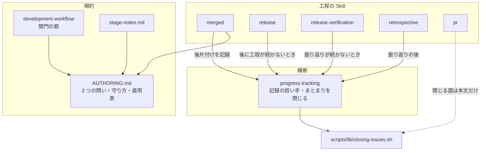
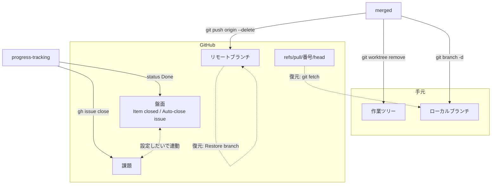
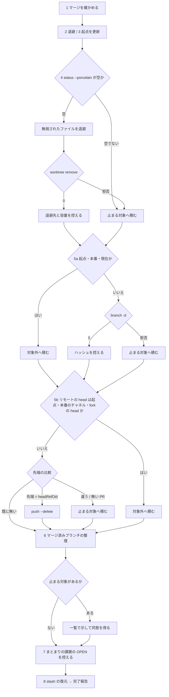
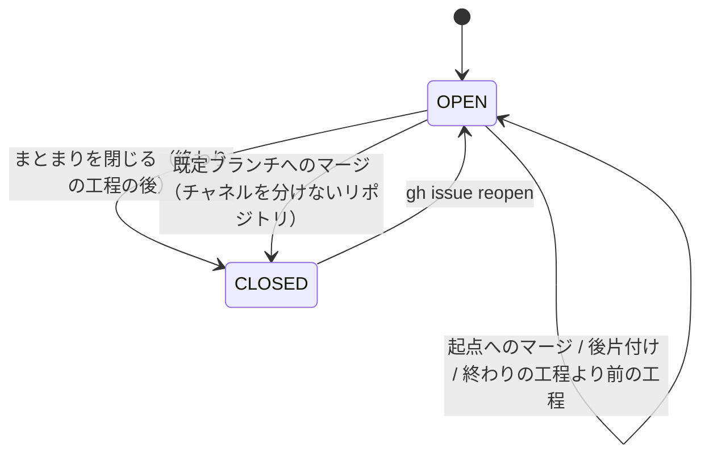
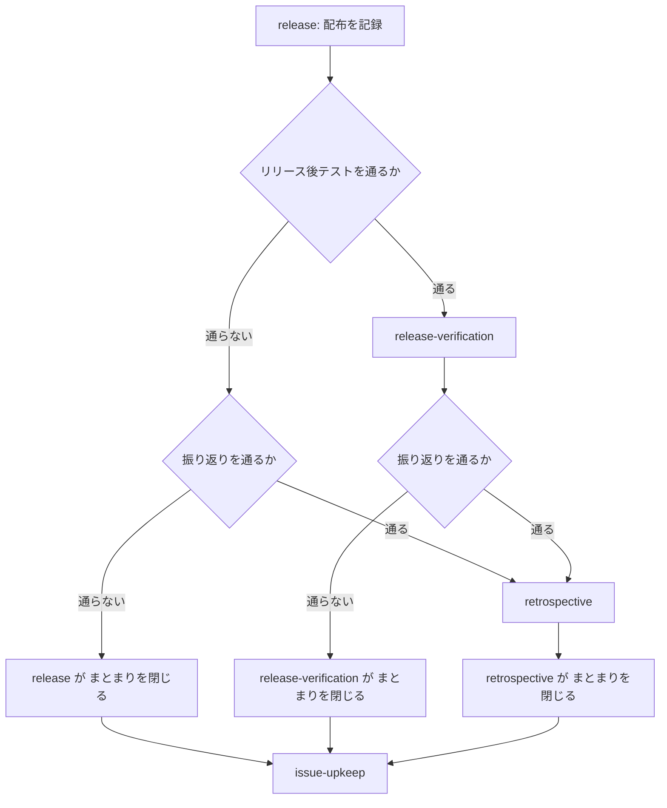

# #561 / #623: 後片付けを止めずに通し、まとまりの課題を終わりの工程で閉じる

要求と受け入れ条件は [issue-561-623-requirements.md](issue-561-623-requirements.md) にある。
この文書は「どう作るか」だけを扱う。「決定 N」は [issue-561-623-design-decisions.md](issue-561-623-design-decisions.md) の決定を指す。

## 機能一覧

| # | 機能 | 誰が使うか |
| --- | --- | --- |
| F1 | 実行前確認を置くかどうかを、操作が実際に取り消せるかで決める基準 | Skill の書き手 |
| F2 | マージ後の後片付けを、git が拒むときだけ止めて通す | マージした側（担当・進行側） |
| F3 | 止めずに消した対象と、その戻し方（退避した無視されたファイルを含む）を作業完了報告に並べる | 運用者 |
| F4 | まとまりの課題を、まとまりの終わりの工程を通った時点で閉じ、閉じられなければ止まる | 進行側 |
| F5 | まとまり単位・Pull Request 単位の工程を、単位に含まれる課題すべてへ記録する | 工程を行った側 |
| F6 | コミットメッセージに閉じる語を書かず、既定ブランチへのマージで課題が割れて閉じないようにする | `pr` を使う全員 |

## 構成要素

**型・永続データ・画面・API は持たない。** 変えるのは Skill の手順を書いた文書と、その文面を読む
テストである。

| 要素 | 責務（変更後） | 機能 | 触る節 |
| --- | --- | --- | --- |
| `plugins/ndf/skills/AUTHORING.md` | 実行前確認の要否を決める 3 つの問いと、守り方 3 つ、適用表を持つ | F1 | 「`allowed-tools` の意味と付け方」の 1 行、「取り消しの難しい操作をどちらで守るか」（見出しごと書き換える） |
| `plugins/ndf/skills/merged/SKILL.md` | 後片付けの操作と、止まる条件と、戻し方の報告を持つ。**課題を閉じない** | F2 F3 F5 | frontmatter の `description`、「削除前の同意取得（必須）」、「クリーンアップの手順」4〜8、「閉じ忘れた issue を閉じる」（節ごと差し替える）、「マージ済みブランチの整理」、「作業完了報告」、「次の工程」の 2 段落目と 3 段落目、末尾の進行の記録の 1 行 |
| `plugins/ndf/skills/progress-tracking/SKILL.md` | まとまりの課題の集め方、単位ごとの記録の担い手、**まとまりを閉じる唯一の手順**を持つ | F4 F5 | 冒頭の「この Skill は順序を持たない」の段落（例外として終わりの記録を足す）、「呼び方」の `status` の段落、新設「工程の単位と記録する課題」、新設「まとまりを閉じる」 |
| `plugins/ndf/skills/release/SKILL.md` | 後にリリース後テストも振り返りも続かない変更で、課題の手入れの前にまとまりを閉じる（「蓄積した課題を手入れする」の条件が「振り返りを通らない変更」からこれに変わる）。まとまりの範囲の確認を開始条件に持つ。配布の Pull Request の本文に `まとまり:` の行を置く | F4 | 「開始条件」、手順 3 の配布の Pull Request の本文、「蓄積した課題を手入れする」 |
| `plugins/ndf/skills/release-verification/SKILL.md` | 後に振り返りが続かない変更で、まとまりを閉じてから `issue-upkeep` を呼ぶ | F4 | 末尾の進行の記録の近くに節を 1 つ新設 |
| `plugins/ndf/skills/retrospective/SKILL.md` | 振り返りの後、課題の手入れの前にまとまりを閉じる | F4 | 進行の記録の 1 行（「この工程で終わるため…Done にする」） |
| `plugins/ndf/skills/pr/SKILL.md` | コミットメッセージに閉じる語を書かない | F6 | 手順の `git commit` の行の直後（2 か所）に 1 行ずつ |
| `plugins/ndf/skills/development-workflow/SKILL.md` | 関門の外で工程の側が実行前確認を足さない原則を持つ | F1 | **「人手の承認を求める関門」の冒頭の 2 段落だけ。行数を増やさない**（決定 11）。「`/goal` の引数として呼ばれたとき」は触らない |
| `plugins/ndf/skills/development-workflow/references/stage-notes.md` | 後片付けが止まらない理由を F1 の基準で書く | F2 | 冒頭の後片付けの段落（6〜8 行目） |
| `plugins/ndf/README.md` | `merged` を実行前確認の一覧から外す | F1 | 292 行目の段落 |
| `plugins/ndf/scripts/lib/README.md` | `closing-issues.sh` の使い手を `progress-tracking` に直す | F4 | 表の `closing-issues.sh` の行 |
| `plugins/ndf/skills/development-workflow/tests/test_workflow_hooks.py` | 閉じる手順が 1 か所にあることと、関門が 2 つのままであることを文面で見る | F2 F4 | `test_the_merged_skill_closes_issues_with_their_repository` と新設 2 件 |

**変えないもの:** `closing-issues.sh`・`progress-record.sh`・`projects-sync.sh`・通過工程の控えの hook。
いずれも入出力が今のままで足りる。



**図に含めない要素:** `plugins/ndf/README.md`・`scripts/lib/README.md`・テスト。どれも他の要素から参照を読まれず、記述を追随させる先である。

### システムの文脈



**盤面の自動化は双方向に連動しうる。** このリポジトリでは次の 2 つが有効である（`gh api graphql` の `projectV2.workflows`）。
他のリポジトリでは片方だけ、または両方無効のことがある。

| 自動化 | 動き |
| --- | --- |
| `Item closed` | 課題を閉じると Status が Done になる |
| `Auto-close issue` | Status を Done にすると課題が閉じる |

### 置き場所

```text
plugins/ndf/
├── README.md                                  # 変える
├── scripts/lib/README.md                      # 変える
└── skills/
    ├── AUTHORING.md                           # 変える
    ├── development-workflow/
    │   ├── SKILL.md                           # 関門の節だけ変える
    │   ├── references/stage-notes.md          # 変える
    │   └── tests/test_workflow_hooks.py       # 変える
    ├── merged/SKILL.md                        # 変える
    ├── pr/SKILL.md                            # 変える
    ├── progress-tracking/SKILL.md             # 変える
    ├── release/SKILL.md                       # 変える
    ├── release-verification/SKILL.md          # 変える
    └── retrospective/SKILL.md                 # 変える
```

## 入出力の契約

### 実行前確認の要否（`AUTHORING.md` に置く基準）

**3 つの問いのどれか 1 つでも「はい」なら、実行前確認を置く。** すべて「いいえ」なら置かず、
事後に対象と戻し方を報告する。

| # | 問い | 「はい」の例 |
| --- | --- | --- |
| 1 | **失うと戻せないものを、git やサービスが拒まずに消すか** | `git branch -D`、`git worktree remove --force`、本番への反映 |
| 2 | **他者が読む新しい内容を外へ出すか** | push と Pull Request の作成、課題の起票、外部リポジトリの取得と配置 |
| 3 | **操作そのものが判断を問うか** | 「やらない」と判断して閉じる、範囲外として起票する |

守り方は 3 つになる。

| 守り方 | 選ぶ条件 | 実装 |
| --- | --- | --- |
| 明示指示専用 | 問いのどれかが「はい」で、明示起動が定着している | 今のまま |
| 自動発動 + 実行前確認 | 問いのどれかが「はい」で、自然文で依頼される | 今のまま |
| **自動発動 + 事後の報告** | **3 つとも「いいえ」** | 実行前確認を置かない。**止まる条件（git やサービスの拒否）だけを本文へ書き、消した対象と戻し方を完了報告の必須項目にする** |

適用表（変更後）:

| Skill | 守り方 | 対象の操作 | 当たる問い |
| --- | --- | --- | --- |
| `deploy` / `cherry-pick-pr` / `statusline` | 明示指示専用 | 今のまま | 今のまま |
| `merged` | 自動発動 + 事後の報告 | worktree・ローカルブランチ・Pull Request の head のリモートブランチの削除 | なし（拒まれた対象だけ 1 に当たり、そこで止まる） |
| `pr` | 自動発動 + 実行前確認 | push / Pull Request の作成 | 2 |
| `release` | 自動発動 + 実行前確認 | 本番への配布（関門 2） | 1・2 |
| `out-of-scope` | 自動発動 + 実行前確認 | 起票 | 2・3 |
| `issue-upkeep` | 自動発動 + 実行前確認 | やらないと判断して閉じる | 3 |
| `official-skills-autoloader` | 自動発動 + 実行前確認 | 外部リポジトリの取得と symlink の作成 | 2 |

**課題を閉じることは問い 3 に当たらない。** 閉じる判断は、まとまりの工程を通ったことで既に
済んでいる。`issue-upkeep` の「やらない」は閉じること自体が判断であり、そこが違う。

### `merged` の止まる条件

| 対象 | 止めずに行う | 止まる（一覧で示し、同意の無い対象を消さない） | 触らない（報告に「対象外」） |
| --- | --- | --- | --- |
| 作業ツリー | `git -C <path> status --porcelain` が空で、無視されたファイルを退避した後の `git worktree remove <path>` が 0 で終わる（決定 5） | `status --porcelain` が空でない、または `git worktree remove` が 0 以外で終わる | — |
| ローカルブランチ | `git branch -d <name>` が 0 で終わる | 同じコマンドが 0 以外で終わる | 起点・本番のチャネル・現在のブランチ |
| リモートブランチ | マージ済み Pull Request の head で、同じリポジトリにあり、先端が `headRefOid` と一致する | 先端が `headRefOid` と違う、対応する Pull Request が見つからない | 起点・本番のチャネル・fork の head |
| 課題 | **閉じない**（まとまりの課題の OPEN の一覧を報告に載せるだけ） | — | — |

止まったときの一覧には、判断の材料を並べる。

| 対象 | 並べるもの |
| --- | --- |
| 拒まれたブランチ | git の出力、先端のハッシュ、先端が Pull Request の `headRefOid` と一致するか、戻し方 `git fetch origin pull/<PR番号>/head:<名前>` |
| 拒まれた作業ツリー | git の出力、`git -C <path> status --short` |
| リモートブランチ | 先端のハッシュと `headRefOid`、マージ後に積まれたコミット（`git log --oneline <headRefOid>..origin/<名前>`） |

### `merged` の作業完了報告（足す項目）

| 項目 | 形 |
| --- | --- |
| 消したローカルブランチ | `<名前>`（`<削除時のハッシュ>`）— 戻すなら `git branch <名前> <ハッシュ>` |
| 消したリモートブランチ | `origin/<名前>` — 戻すなら `<Pull Request の URL>` の Restore branch |
| 消した作業ツリー | `<パス>`。無視されたファイルを退避したなら、退避先のパスと容量（`du -sh <退避先>`）— 戻すなら `mv <退避先>/<退避した相対パス> <作業ツリーを作り直した先>/<退避した相対パス>`、まとめて戻すなら `cp -a <退避先>/. <作業ツリーを作り直した先>/`（決定 5） |
| 対象外 | 名前と理由（起点 / 本番のチャネル / 現在のブランチ / fork） |
| 止まった対象 | 上の「止まったときの一覧」と、同意の結果 |
| まとまりの課題 | このマージの閉じる語が指す課題のうち OPEN のもの。「閉じるのはまとまりの終わりの工程（`progress-tracking` の「まとまりを閉じる」）」と添える |
| まとまりの最後か | 最後 / 残りあり / **判断できない**（待たない。決定 6） |

**消した課題の項目は無くなる。** 閉じる操作を `merged` から外すためである（決定 7）。

### `progress-tracking` の「まとまりを閉じる」

**工程に入った時点で呼ぶ記録とは契機が違う。** この手順は終わりの工程を出るときに 1 度だけ行い、
正本をこの Skill に置いて終わりの工程の Skill から呼ぶ。**終わりの工程は、そのモードの経路で最後に通る工程である**
（工程表は `development-workflow/SKILL.md` の「モードごとに起動する Skill」。`operation` のリリース後テストと振り返りはそれぞれ条件付き）。

```bash
RECORD_REPO=$(gh repo view --json nameWithOwner -q .nameWithOwner)

# 1. まとまりの Pull Request の一覧を得る。同じ実行の中なら release が承認の提示に並べた一覧を使う。
#    別の実行なら、配布の Pull Request（retrospective の「Pull Request の番号を特定する」が引くもの）の本文から取る
bundle_prs=$(gh pr view <配布のPR番号> --repo "$RECORD_REPO" --json body -q .body \
  | sed -n 's/^まとまり: //p' | grep -oE '#[0-9]+' | tr -d '#')
[ -n "$bundle_prs" ] || echo "まとまりの行が無い。推測せず運用者に一覧を聞く" >&2

# 2. まとまりの課題を集める。1 の Pull Request ごとに
gh pr view <PR番号> --repo "$RECORD_REPO" --json body -q .body | bash "$SCRIPTS/lib/closing-issues.sh"
# → <所有者>/<リポジトリ><TAB><番号> の行。重複は 1 つにする

# 3. 課題ごとに (a)〜(d) の順で行う。盤面を書く前に状態を読むのは、Auto-close issue が Done で閉じた課題を
#    「既に閉じていた」と数えないため
# (a) 盤面を書く前に状態を読んで控える
gh issue view <番号> --repo <所有者>/<リポジトリ> --json state -q .state        # OPEN / CLOSED
# (b) 記録のリポジトリの課題なら盤面を Done にする
[ "<所有者>/<リポジトリ>" = "$RECORD_REPO" ] && bash "$SCRIPTS/projects-sync.sh" <番号> status "Done"
# (c) まだ OPEN なら閉じる（(b) の自動化が閉じていれば行わない）
gh issue close <番号> --repo <所有者>/<リポジトリ> --comment "まとまり（<マイルストーン>）の<工程名>を通りました"
# (d) 読み直して CLOSED を確かめる
gh issue view <番号> --repo <所有者>/<リポジトリ> --json state -q .state
```

| 呼ぶ Skill | 呼ぶ時点 | 呼ぶ条件 |
| --- | --- | --- |
| `retrospective` | 記録を投稿した後 | 振り返りを通る変更 |
| `release-verification` | 検証結果を記録した後 | 後に振り返りが続かない変更（振り返りを通らない `operation`） |
| `release` | 「蓄積した課題を手入れする」の前 | 後にリリース後テストも振り返りも続かない変更（`light`、どちらも通らない `operation`） |

**いずれも「まとまりを閉じる → `issue-upkeep`」の順で呼ぶ。**

- **一覧の取得元は配布の Pull Request の本文である。** `release` は配布の Pull Request を作る形で、出力物の
  `まとまり: PR #<番号> / …` の行を本文にも置く（決定 10）
- **一覧の行が無ければ推測しない。** 手順 1 の出力が空なら、運用者に一覧を聞く（`retrospective` の段 3 と同じ扱い）。
  終了コードで見ないのは、パイプの終了コードが最後のコマンド（`tr`）のもので、`pipefail` の有無で変わるためである
- **他のリポジトリの課題には盤面を書かない。** `projects-sync.sh` は `--repo` を取らず、実行したリポジトリの
  `.ndf/projects.json` の盤面で番号を引く。他のリポジトリの番号を渡すと、同じ番号の別の課題を更新する。
  一致しないときは `gh issue close --repo` だけを行う
- **盤面を書く前に状態を読み、盤面を先に書き、閉じるのは OPEN のときだけ。** `Auto-close issue` が有効なら Done で閉じ、
  無効なら `gh issue close` が閉じる。どちらでも終わりの状態は同じになる。(a) を (b) の後に読むと、Done で閉じた課題が
  `既に閉じていた` になり reopen の手段が報告から落ちる
- 閉じる語の注意（番号ごとに要る・大小を区別しない・`gh issue close` は `owner/repo#番号` を受け取らない）は
  `merged` から移す

**課題の状態は必須、盤面は報告だけである。** 盤面（`projects-sync.sh`）は失敗しても 0 で返る今の契約のまま使い、
出た NOTE の行を報告へそのまま載せる。課題ごとの結果は次の 3 つのどれかにする。

| 結果 | 条件 | 報告に載せるもの |
| --- | --- | --- |
| `閉じた` | 手順 3 の (a) の読み取りが OPEN で、(d) の読み直しが CLOSED（(b) の盤面の自動化が閉じた場合を含む） | 番号と戻し方 `gh issue reopen <番号> --repo <所有者>/<リポジトリ>` |
| `既に閉じていた` | 手順 3 の (a) の読み取りが CLOSED（既定ブランチへのマージで GitHub が先に閉じた場合を含む） | 番号 |
| `失敗（理由）` | (a) (d) の読み取り・(c) の `gh issue close` が 0 以外で終わった、または (d) の読み直しが CLOSED でない | 番号・理由・やり直すコマンド `gh issue close <番号> --repo <所有者>/<リポジトリ>` |

**`失敗` が 1 件でもあれば、終わりの工程を完了と報告せず、`issue-upkeep` を呼ばずに止まる。** 報告には
失敗した課題・理由・やり直すコマンドを載せる。手順 1 の出力が空で一覧が取れないときも同じ扱いにする（決定 8）。

### `progress-tracking` の「工程の単位と記録する課題」

| 工程の単位（`parallel-work.md` の表） | 記録する側 | 記録する課題 |
| --- | --- | --- |
| 課題 | その課題を扱う担当 | その課題 |
| Pull Request（後片付けを含む） | その工程を行った側。後片付けはマージした側 | その Pull Request の本文の閉じる語が指す課題すべて |
| まとまり（確定仕様化・配布・体裁レビュー・リリース後テスト・振り返り） | その工程を行った側。配布以降は進行側 | まとまりの課題すべて |

**まとまりの課題への記録は、1 回の実行で課題を並べてよい。** 通過工程の控えは 1 回の実行の
最初の記録しか読まず、課題番号を変数で書いた記録は読まない（#487）。**控えを読む検査は
Pull Request の作成の時点と後片付けの報告だけ**で、後片付けより後の工程を読まない
（`stage-completeness.md`）。そのため配布以降を並べても判定は変わらない。**後片付けまでの記録は
課題ごとに 1 回の実行にする**（控えへ入れるため）。**他のリポジトリの課題へは `progress-record.sh --repo` だけを使い、
`projects-sync.sh` を呼ばない**（理由は「まとまりを閉じる」の箇条書き）。

## 処理の流れ

### 後片付け（`merged` のクリーンアップの手順）



**止まる対象は最後に 1 回だけ示す。** 見つけるたびに止まると、#561 の「止まる回数」が拒否の件数だけ
戻る。同意を得た対象だけを `-D` / `--force` で消し、残りは報告に載せる。

### まとまりの課題の状態



**チャネルを分けたリポジトリで、起点へのマージから終わりの工程までの間に閉じる経路は無い。**
コミットメッセージの閉じる語（決定 9）と `merged` の手順 7（決定 7）がその経路だった。

### まとまりの終わり

進行側が `release` を起動し、そのモードの経路に続く工程があれば続けて起動する。まとまりを閉じるのは、最後に通った工程の Skill である。



**`失敗` が 1 件でもあれば `issue-upkeep` へ進まない**（「まとまりを閉じる」の結果の表）。

## 非機能の実現方式

| 大項目 | 条件（要求側） | 実現方式 |
| --- | --- | --- |
| 運用・保守性 | 止まらずに行った削除とクローズが、すべて戻し方つきで報告に残る | 完了報告の項目を表で固定する（`merged` の報告・「まとまりを閉じる」の報告）。ハッシュは `git branch -d` の出力 `Deleted branch <名前> (was <ハッシュ>).` から取る。**無視されたファイルの退避先は自動では消さない。** 容量を報告に載せ、消すのは利用者である |
| セキュリティ | 同意なしに消せるリモートブランチを限る | `gh pr view <PR番号> --json headRefName,headRefOid,headRepositoryOwner` と `git ls-remote origin refs/heads/<名前>` を突き合わせ、同じリポジトリで先端が一致するときだけ消す（決定 4） |

決定の記録は [issue-561-623-design-decisions.md](issue-561-623-design-decisions.md) にある。

## テスト設計

| 受け入れ条件 | 何で確かめるか |
| --- | --- |
| A1 A5 | `grep -n '同意\|-D\|--force' plugins/ndf/skills/merged/SKILL.md` の行が「止まる条件」の節の中だけにある（レビューで確かめる） |
| A2 | リリース後テスト。このリポジトリの実装 Pull Request 1 本に `/ndf:merged <番号>` を実行し、利用者への問いが 0 |
| A3 A4 A6 A7 | 「`merged` の止まる条件」の表と本文の突き合わせ（レビュー）。A7 は要求文書の実測 2 行目の再現を実装の検証に含める |
| A8 A9 | 作業完了報告の項目の表と本文の突き合わせ |
| A10 | `python3 scripts/check-skill-frontmatter.py` |
| A11 | `merged` の「作業完了報告」に「判断できない」の値があり、待つ記述が無い |
| B1 B2 B3 B4 | `AUTHORING.md` の 3 つの問い・守り方・適用表の突き合わせ。B3 は `git diff --stat` に `out-of-scope` / `official-skills-autoloader` / `issue-upkeep` が現れない |
| B5 B6 | 新設テスト `test_the_gates_stay_two`（「関門は 2 つで、増やさない。」を含む）と差分の目視 |
| B7 B8 | `grep -n '同意を取ってから消す' plugins/ndf/skills/development-workflow/references/stage-notes.md` が 0 件 / README の段落の目視 |
| C1 | 決定 7 |
| C2 | 新設テスト `test_only_progress_tracking_closes_issues`（`plugins/ndf/skills/*/SKILL.md` のうち `gh issue close` を含むものが `progress-tracking` だけ。`references/` の 2 件は対象外） |
| C3 C6 | `release`・`release-verification`・`retrospective` で、「まとまりを閉じる」への参照が `issue-upkeep` の呼び出しより前の行にある |
| C4 C5 C8 | リリース後テスト。このマイルストーンの課題の ClosedEvent が、起点へのマージではなく終わりの工程の後に来る（`gh api graphql` の `closer` と時刻） |
| C7 | `pr/SKILL.md` の差分の目視 |
| D1 D3 | 「工程の単位と記録する課題」の表 |
| C9 | `progress-tracking/SKILL.md` の冒頭の段落・「呼び方」と「まとまりを閉じる」の突き合わせ（文面）。`release`・`release-verification`・`retrospective` がその節を指す |
| C10 | 「まとまりを閉じる」の結果の表と、`失敗` のとき完了と報告せず `issue-upkeep` を呼ばない記述の突き合わせ（文面） |
| D2 | `gh pr view 717 --json body -q .body \| bash plugins/ndf/scripts/lib/closing-issues.sh` が `devbasex/ai-plugins 712` と `devbasex/ai-plugins 713` を出す（設計の時点で実測済み） |
| D2（まとまりの行の取り出し） | `gh pr view <配布のPR番号> --json body -q .body \| sed -n 's/^まとまり: //p' \| grep -oE '#[0-9]+' \| tr -d '#'`。本文に `まとまり: PR #717 / #718 / #720` があれば 717 718 720 を出し、行が無ければ出力が空（パイプの終了コードはどちらも 0。設計の時点で実測済み） |
| A8（退避） | 要求文書の実測 5 行目と 6 行目。実装の検証で、直下の無視されたファイル（`.env`）と、追跡されたディレクトリの配下の無視されたパス（`a/b/__pycache__/`）の両方を持つ作業ツリーに対して再現する |
| E1 | 移した `test_the_merged_skill_closes_issues_with_their_repository`（読む先を `progress-tracking` にする）を含む `uv run --with pytest pytest scripts/tests plugins/ndf -q` |
| E2 E3 E4 E5 | 要求文書の検証手段のコマンド |

## 未確認のまま残ること

| 項目 | 内容 | いつ決まるか |
| --- | --- | --- |
| `AUTHORING.md` の行数 | 494 行で、上限まで 6 行。3 つの問いの表（約 6 行）・守り方の 1 行・適用表の 3 行が増える。**実装で決める:** 節の散文を詰めて収める。収まらなければ適用表の「判断根拠」の列を棚卸台帳（`docs/specifications/ndf-skill-inventory/`）へ移す | 実装 |
| `development-workflow/SKILL.md` の行数の取り合い | #550 #657 の設計も同じファイルへ足す。この変更は差し引き 0 行にするが、あちらの余地は増えない | 並行の調整（進行側） |
| Codex / Kiro / agy の確認の仕組み | 各ランタイムが自分の承認設定で `git push --delete` などを止めることがある。NDF の手順が止めなくても、ランタイムの設定で止まる回数は変わらない | リリース後テスト（Claude Code だけで確かめる） |
| 人が書いたコミットメッセージの閉じる語 | 決定 9 は `pr` を通るコミットだけに効く。手で書いたコミットに閉じる語があると、既定ブランチへのマージで早く閉じる | 残る（直す手段が閉じる語の検査の新設になり、範囲外） |
| 退避先の容量 | 無視されたファイルの退避先は自動で消さないため、増え続ける。いつ消すかは利用者が決める | 残る（利用者） |
| レビュー用の作業ツリーの退避 | システムの一時ディレクトリにある作業ツリーは共通の git ディレクトリと別のファイルシステムのことがあり、`mv` が複製になる（`.cross_review/` は小さい） | 実装（実測する） |
| 盤面に `Item closed` だけが有効なリポジトリ | 閉じると Done になるだけで、「まとまりを閉じる」は Done を先に書くため食い違わない。実物では確かめていない | 他のリポジトリで使われた時点 |
