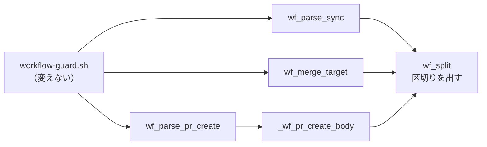
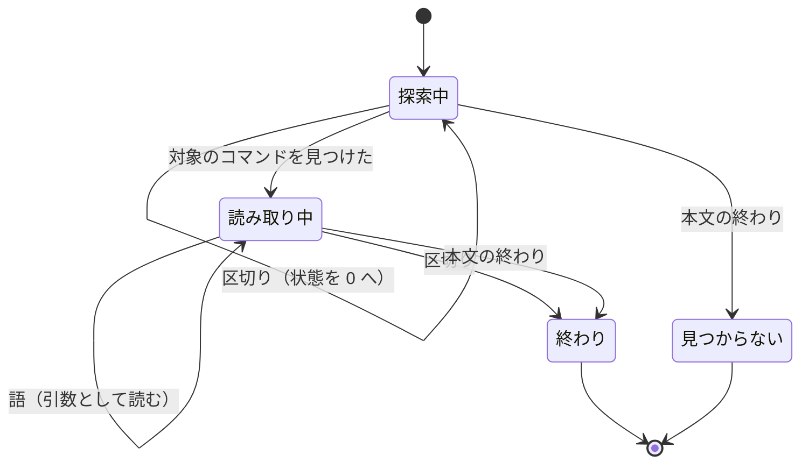

# #565: 語の分割に、コマンドの区切りを持たせる

要求と受け入れ条件は [issue-565-requirements.md](issue-565-requirements.md) にある。この文書は
「どう作るか」と、そこへ至った原因の特定を扱う。

**直すのは hook の登録ではなく、本文を語に割る処理である。** 引用の外の `;` `&&` `|` などを
コマンドの区切りとして扱い、記録の値やマージの番号に後ろの文字が混ざらないようにする。

## 機能一覧

| # | 機能 | 誰が使うか |
| --- | --- | --- |
| F1 | 本文を語に割るとき、引用の外の制御演算子でコマンドの境目を示す | 3 つの読み手 |
| F2 | 進行の記録を、1 つ目の記録のコマンドの終わりまでで読む | `workflow-guard.sh`（控えを積む） |
| F3 | マージの判定を、1 つ目のマージのコマンドの終わりまでで読み、区切りの後の `gh` も見つける | `workflow-guard.sh`（#266 の関門） |
| F4 | Pull Request 作成の本文を、作成のコマンドの終わりまでで読む | `workflow-guard.sh`（#424 の観測） |

## 構成要素

**新しいファイルは作らない。** 入口の `workflow-guard.sh` と `SKILL.md` は触らない。
以下、ファイル名は `plugins/ndf/skills/development-workflow/` からの相対で書く。

| 要素 | 責務 |
| --- | --- |
| `scripts/lib/workflow-common.sh` の `wf_split` | 引用の外の制御演算子と本文の途中の改行で空の語（区切り）を出す（F1） |
| `scripts/lib/workflow-common.sh` の `wf_parse_sync` | `projects-sync.sh` の後、区切りまでに 3 語そろったときだけ返す（F2） |
| `scripts/lib/workflow-merge.sh` の `wf_merge_target` | 区切りで `gh` の探索を始めからやり直し、マージを見つけた後の区切りで読むのを止める（F3） |
| `scripts/lib/workflow-common.sh` の `_wf_pr_create_body` | 区切りで探索をやり直し、作成を見つけた後の区切りで読むのを止める（F4） |
| `tests/test_workflow_guard.py` | 受け入れ条件ごとの判定のテスト |
| `references/stage-completeness.md` の「通過工程の控え」 | どの書き方の記録を読むかを 1 段落で書く |

図は呼び出しの関係だけを描く。テストと参照の文書は含めない。`wf_parse_pr_create` は変えないが、
`_wf_pr_create_body` の呼び出し元として載せる。

## 原因の特定

**hook は発火している。記録の値に密着した `;` を値の一部として読み、工程名ではないと
判定して捨てている。** issue が挙げた 2 つの候補（bypass permissions モード、Skill 経由の
登録）はどちらも原因ではない。

### 失敗した記録と積まれた記録の書き方

`development-workflow` を読み込んだ会話の記録（`~/.claude/projects/-work-ai-plugins/*.jsonl`）を
調べた。`projects-sync.sh` の実行を拾い、控えの `stages` と突き合わせた。

| 会話 | Claude Code | モード | 記録のコマンドの末尾 | 控え |
| --- | --- | --- | --- | --- |
| `530d894e`（9/8） | 2.1.263 | bypass / `/goal` | `"要求と受け入れ条件" 2>&1 \| tail -3` | 積まれた |
| `243164e3`（9/9〜9/10） | 2.1.267 | bypass | `"作業場所の用意" 2>&1 \| tail -2` | 積まれた |
| `9cd3418b`（9/10） | 2.1.267 | bypass / `/goal` | `"実装レビュー" 2>&1 \| tail -3` | 積まれた |
| `a27ffb35`（9/12） | 2.1.269 | bypass / `/goal` | `"配布"; echo "exit=$?"` ほか 3 件（計 4 件） | 積まれない |
| `9e188b9b`（9/13） | 2.1.270 | bypass / `/goal` | `"要求と受け入れ条件"; echo "exit=$?"` | 積まれない |

**会話記録で `projects-sync.sh` の実行が控えに積まれなかった 5 件（`a27ffb35` の 4 件と
`9e188b9b` の 1 件）は、すべて閉じ引用符の直後に `;` が密着している。** 積まれた記録は
すべて空白を挟んで `2>&1` を続けている。issue #565 本文の「5 回」はこれとは別の数で、
`a27ffb35` の実行を要約した一覧である。`progress-record.sh` の 2 件（観測の対象外）と
`projects-sync.sh` の 3 件を含む。

### 分割の実測

配布済みの `workflow-guard.sh`（10.10.1）へ、控えの置き場所を隔離して hook の入力を流した。

| 流したコマンド | 控え |
| --- | --- |
| `bash plugins/ndf/scripts/projects-sync.sh 565 stage "要求と受け入れ条件"` | 積まれた |
| 同上の末尾に ` ; echo "exit=$?"`（空白を挟む） | 積まれた |
| 同上の末尾に `; echo "exit=$?"`（密着） | 積まれない |
| 親の会話で実行した本文そのもの（`cd /work/ai-plugins; ls ... ; bash ...projects-sync.sh 565 stage "要求と受け入れ条件"; echo "exit=$?"`） | 積まれない |

`wf_parse_sync` は `565` / `stage` / `要求と受け入れ条件;` を返し、`wf_is_stage` が
3 つ目を拒む（`workflow-guard.sh:69`）。拒んだときは何も出さずに終了コード 0 で返る。

## 退けた原因の候補

| 候補 | 退けた根拠 |
| --- | --- |
| bypass permissions モードでは PreToolUse hook が走らない | 2.1.270 の `claude -p --permission-mode bypassPermissions` と、tmux で起動した対話の会話の両方で、Skill を読み込んだ後の記録で控えが積まれた。デバッグ出力に `Registered 1 hooks from skill 'ndf:development-workflow'` が出る |
| Skill の frontmatter の `hooks` が Skill ツール経由では登録されない | 同上。`/goal` を先に設定した会話でも同じ行が出て、控えが積まれた |
| Claude Code 2.1.268〜2.1.270 の変更 | 2.1.268〜2.1.270 の変更履歴に Skill の hook に触れる項目は無い。2.1.270 の実測で動く |
| 配布物の hook 定義やスクリプトの変更（#568 など） | 10.9.1 と 10.10.1 の `scripts/` に差分は無い。frontmatter の `hooks` は 9/3（a308529）以降変わっていない |

**同じ会話で hook が発火していた直接の証拠もある。** `a27ffb35` の 13:20:49 に、#565 の本文を
ヒアドキュメントで下書きしたコマンドがある。その本文中の例 `projects-sync.sh  156 stage "配布"`
から、#156 の控えへ `配布` が積まれた。控えの `updated_at` はこの時刻と一致する。この誤検出は
範囲外として #580 に起票した。

## 入出力の契約

### `wf_split` の出力

**NUL で終わる語の並びに、空の語を区切りとして加える。** 読む側は今までどおり
`read -r -d ''` で受け、`[ -z "$tok" ]` で区切りを見分ける。

| 入力の中の文字（引用の外） | 出力 |
| --- | --- |
| 空白・タブ | 語の終わり（今までどおり） |
| `;` `\|` `(` `)` | 語の終わり + 区切り |
| `&` | 語の終わり + 区切り。**ただし直前が `>` か `<`、または直後が `>` のときは語の一部** |
| 引用の外で改行をまたぐ | 語の終わり。区切りは **2 行目以降の行頭**で出す。本文の最後の改行（here-string が足すものを含む）では出さない |
| 引用の中の上記すべて | 語の一部（今までどおり） |

`&&` `||` `;;` のように演算子が続くと区切りも続く。読む側は区切りの数を数えない。
改行の区切りを行頭で出すのは、awk が行単位で読み、次の行を読み始めた時点でしか「行末が本文の
途中だった」と分からないためである。

| 本文 | 出力（`␀` は NUL、`∅` は区切り） |
| --- | --- |
| `a "b c"; d` | `a␀` `b c␀` `∅` `d␀` |
| `x 2>&1 \| y` | `x␀` `2>&1␀` `∅` `y␀` |
| `cd x&&gh pr merge 1` | `cd␀` `x␀` `∅` `∅` `gh␀` `pr␀` `merge␀` `1␀` |
| `cmd &>/dev/null` | `cmd␀` `&>/dev/null␀` |
| 1 行目 `a b`、2 行目 `c` | `a␀` `b␀` `∅` `c␀` |

### 3 つの読み手の振る舞い

| 読み手 | 見つける前の区切り | 見つけた後の区切り |
| --- | --- | --- |
| `wf_parse_sync` | 読み飛ばす | 読むのを止める。3 語そろっていなければ 1 を返す |
| `wf_merge_target` | 状態を 0 へ戻す | 読むのを止める。番号が無ければ空で返す（ブランチから引き当てる、今までどおり） |
| `_wf_pr_create_body` | 状態を 0 へ戻す | 読むのを止める |

**3 つとも「最初に見つけたコマンドだけを読む」は変えない。** 2 つ目以降を読むのは #487 と
#581 の判断である。

## 処理の流れ

`wf_parse_sync` の「読み取り中」は 3 語を読んだ時点でも終わる。

## 非機能の実現方式

| 大項目 | 実現方式 | 確かめ方 |
| --- | --- | --- |
| 性能・拡張性 | 1 文字ずつの判定を awk の中へ足すだけにし、起動の回数を増やさない | 36KB の本文で `wf_split` の時間を測る（テスト 1 件） |
| 運用・保守性 | 演算子の判定を awk の 1 か所に置き、読み手はすべて空の語だけを見る | 読み手 3 つのテストで区切りの扱いを確かめる |

## 決定の記録

### 決定 1: 原因は hook の登録ではなく、語の分割にある

5 件の失敗はすべて `";` が密着した書き方で、同じ本文を配布済みの `workflow-guard.sh` へ
流すと再現する。2.1.270 の対話・非対話・bypass・`/goal` のどれでも Skill の hook は登録されて
発火した。issue の題名にある「hook が発火していない」は観測の解釈の誤りで、直す対象は
hook の登録ではない。

発火の有無を確かめる手段（`/hooks` の一覧やデバッグ出力の常時取得）を足す案は採らない。
発火は動いており、足しても今回の欠けは見えない。

### 決定 2: 区切りを空の語で表す

`wf_split` はいま空の語を出さない（`""` を解いた結果は捨てる）。空の語を区切りに当てれば、
実在の語と衝突せず、読み手の受け方（`read -r -d ''`）も変わらない。

演算子そのもの（`;` など）を語として出す案は採らない。引用符で囲んだ `";"` と区別できなくなる。
語ごとに種別の印を前に付ける案も採らない。読み手 3 つの受け方をすべて変えることになる。

### 決定 3: 区切りで読むのを止める。2 つ目以降のコマンドは読まない

区切りを入れる目的は、1 つ目のコマンドの値に後ろの文字が混ざるのを止めることである。
2 つ目以降を読むと、進行の記録では #487、マージの判定では #581 と同じ変更になり、1 本の
Pull Request に 2 つの判断が混ざる。

### 決定 4: リダイレクトの `&` は区切りにしない

`2>&1` は記録のコマンドで最も多く使われている書き方である（積まれていた記録はすべてこの形）。
`&` を無条件に区切りにすると `2>` と `1` に割れる。直前が `>` `<` か直後が `>` のときだけ
語の一部として残す。`|&` は `|` が先に区切りを出すため、別に扱わない。

### 決定 5: 捨てた値を案内に出す変更はこの Pull Request に入れない

値を捨てたときに案内を出せば、今回の欠けは表に出た。ただし出口は「工程名として読めない値を
黙って捨てる」ことで、#459（開発中の版の工程名が捨てられる）と同じである。案内の文言と
出す条件を 2 か所で決めると食い違うため、#459 で扱う。

### 決定 6: 引用符の中のバックスラッシュは解かない

`"a\"b"` の扱いは今までどおりにする。記録の値と Pull Request の番号にバックスラッシュは
現れず、今回の欠けとも関係しない。

## テスト設計

テストは `tests/test_workflow_guard.py` に置く。控えの置き場所は既存の `state` の fixture で
隔離する。実行は `uv run --with pytest pytest plugins/ndf/skills/development-workflow/tests -q`。

| 受け入れ条件 | 何で確かめるか | 変更前 |
| --- | --- | --- |
| AC1 | `guard` に `; echo "exit=$?"` を密着させた記録を流し、控えの `stages` を読む | 落ちる |
| AC2 | 同上を `&&` / `\|\|` / `\|` / `)` / 引用なしの値で parametrize | 落ちる |
| AC3 | 親の会話で実行した本文そのもの（`cd ...; ls ... \| grep ...; date ...; bash ...projects-sync.sh 565 stage "要求と受け入れ条件"; echo "exit=$?"`） | 落ちる |
| AC4 | `run_lib('wf_parse_sync ...')` が 1 を返す | 落ちる（`stage;` と `echo` を読んで 0 を返す） |
| AC5 | 既存の `test_a_sync_command_is_recorded` と、`2>&1 \| tail -3` を空白で続けた形の追加 | 通る |
| AC6 | `run_lib('wf_merge_target ...')` が `268` を返す | 落ちる（空の番号でブランチの引き当てへ回る） |
| AC7 | 3 つの書き方を parametrize し、`stub_gh` の印の無い設計 Pull Request で拒否される | 落ちる（マージと見なさず通す） |
| AC8 | `run_lib('wf_merge_target ...')` が空の番号で 0 を返す | 落ちる（マージと見なさない） |
| AC9 | `wf_parse_pr_create` が `devbasex/ai-plugins\t161` を返す | 通る |
| AC10 | `wf_parse_pr_create` が 1 を返す | 落ちる |
| AC11 | `wf_split` の出力を区切りごとに比べる（`2>&1` / `>&2` / `&>/dev/null`） | 通る |
| AC12 | テスト一式の実行 | 通る |
| 性能 | 36KB の本文で `wf_split` が 0.1 秒以内 | 通る |

## 未確認のまま残ること

| 項目 | 内容 |
| --- | --- |
| 対話の会話での再発の確認 | 直した版を配布した後、`; echo "exit=$?"` 付きの記録で控えが積まれるかは、リリース後テストで確かめる。hook は配布済みの版を読むため、開発中の版では確かめられない |
| `wf_looks_like_merge_text`（jq / awk が無いときの粗い見分け） | grep の見分けで、今回の変更の対象ではない。密着した演算子で漏れるかは確かめていない |
| 引用の外の `#` から始まるコメント | 区切りにしない。コメントに書いた例が記録として読まれる件は #580 で扱う |
| Kiro CLI / Codex / agy | frontmatter の hook を読まないことは既存の文書に依る。今回は実測していない |

## 申し送り（並行する課題との重なり）

**#527（`.ndf/worktree.json` の宣言の確認）とは、触るファイルが重ならない見込みである。**

| この変更が触る | この変更が触らない |
| --- | --- |
| `scripts/lib/workflow-common.sh` の `wf_split` / `wf_parse_sync` / `_wf_pr_create_body` | `SKILL.md` |
| `scripts/lib/workflow-merge.sh` の `wf_merge_target` | `scripts/workflow-guard.sh` |
| `tests/test_workflow_guard.py` | |
| `references/stage-completeness.md` | |

#527 が `workflow-common.sh` へ関数を足す場合は、同じファイルの別の箇所になる。競合は小さい。
