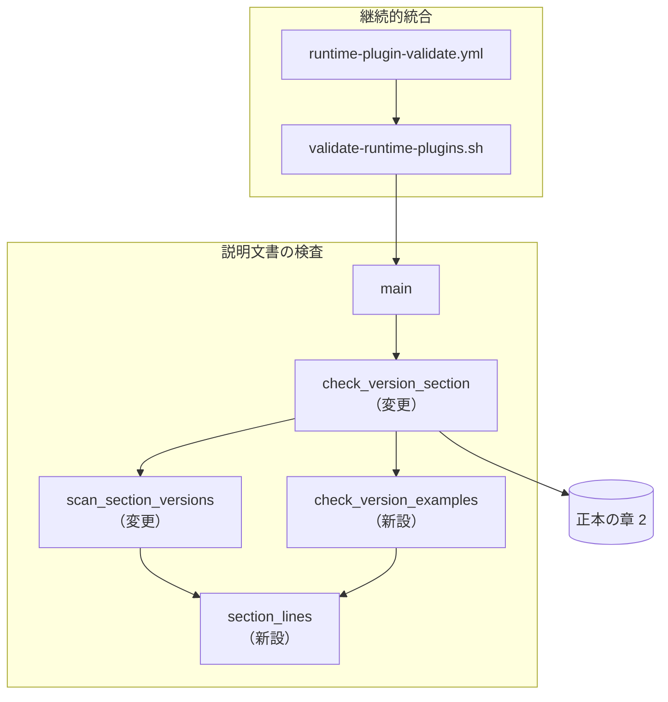
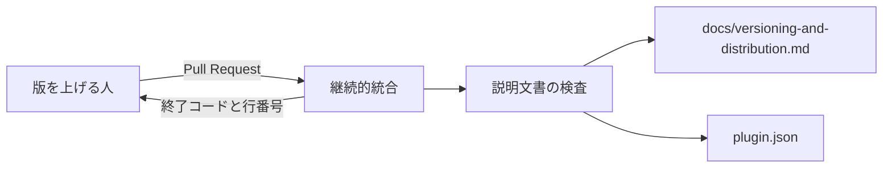
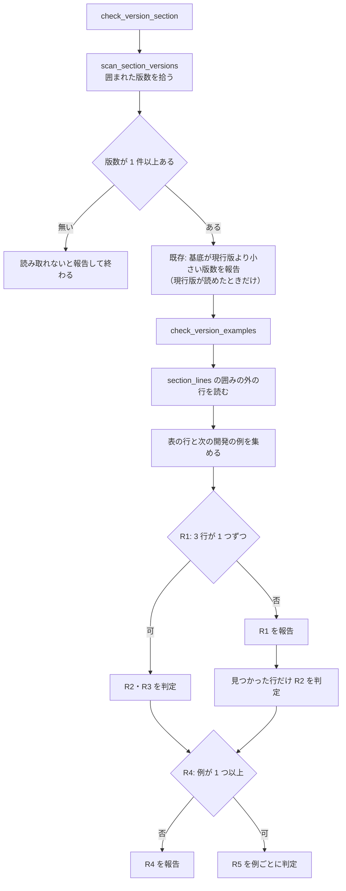

# #566: 版の形の表と次の開発の例を、例どうしで突き合わせる

要求と受け入れ条件は [issue-566-requirements.md](issue-566-requirements.md) にある。この文書は「どう作るか」と、
3 つの直し方を最新の `develop`（55d94f9）で確かめた結果を扱う。

**検査 J に規則を 2 つ足す。** 1 つは版の形の表の 3 行について、接尾辞の形と、正式版の行より新しい基底を
指すことを見る。もう 1 つは「`X` の次を開発するなら `Y`」について、`Y` が `X` より新しい基底の開発版であることを見る。
比べる相手は現行版ではなく、同じ章の例である。

## 3 つの直し方を確かめた結果

**確かめ方:** 最新の `develop` を一時ディレクトリへ展開し、章 2 を壊した写しで検査を走らせた。検査への規則の
追加は、写しの `check-doc-staleness.py` へ試作を差し込んで確かめた。どれもコミットしていない。

### 壊した形と、現状の検査

| 写し | 壊し方 | 現状の検査 |
| --- | --- | --- |
| 形 A | 現行版 `10.10.1` のまま、開発版の行を `10.10.1`、次の開発の例を「`10.10.1` の次を開発するなら `10.10.1-dev.1`」にする（issue の 2 つの形） | 終了コード 0 |
| 形 B | 定義ファイルと説明文書の `10.10.1` を `10.11.0` へ一括で置換し、開発版の行の接尾辞を消す | 終了コード 0 |
| 形 C | 形 B と同じ置換を `10.11.0-dev.1` で行う（開発版の配布で一括置換した形） | 終了コード 0 |

**章 2 に並ぶ囲まれた版数は 10 件である。** 現行版を指すものが 2 件（正式版の行、次の開発の例の左側）、
次の版を指すものが 8 件ある。規則が見るのは表の 3 行と次の開発の例の 2 つの値である。

### 各案の結果

| 直し方 | 確かめた結果 |
| --- | --- |
| 章 7 の表へ 1 行足す | 文書だけで済む。形 A〜C はどれも終了コード 0 のまま残る |
| 例を固定の値にする | `9.9.9` 系にすると、10 件すべてが「現行版より古い」で落ちる。`X.Y.Z` にすると「版数を読み取れない」で落ちる。どちらも検査 J の撤去と、「15 箇所」を書いた 5 ファイルの書き換えが要る。`99.0.0` 系なら通るが、J は版が 99 に届くまで何も見なくなる |
| 検査に規則を足す（現行版と比べる形） | 形 A・B を検出した。既存のテストは 85 件中 14 件が落ち、落ちた中に現行版が `9.7.0-dev.1` / `9.7.0-rc.1` の木が含まれた |
| 検査に規則を足す（位置の語を使わず、現行版と同じ基底で現行版そのものでない値を落とす形） | 形 A の開発版の行 `10.10.1` を拾えない（現行版そのものと等しい）。既存のテスト「現行版と同じ基底の接尾辞付きの版数を足しても通る」と矛盾する |
| **検査に規則を足す（例どうしで比べる形）** | 形 A で 3 件、形 B で 4 件、形 C で 4 件を検出し、`develop` の木は終了コード 0 だった。現行版 `10.11.0-dev.1` の木で章 2 を正しく直した写し（正式版 `10.11.0`、開発版 `10.12.0-dev.1`）も通った。既存のテストは 14 件が落ちたが、すべてテスト用の雛形の開発版の行 `9.3.0-dev.1`（正式版 `9.3.0` と同じ基底）が原因だった。試作は接尾辞の形と基底の前後の判定だけを持ち、位置の語が無い・重なるときの判定と囲みの除外は持たない |

## 機能一覧

| # | 機能 | 誰が使うか |
| --- | --- | --- |
| F1 | 版の形の表の 3 行の接尾辞の形と、正式版の行との基底の前後を確かめる | 版を上げる人（継続的統合の失敗として受け取る） |
| F2 | 次の開発の例の右側が、左側より新しい基底の開発版であることを確かめる | 同上 |
| F3 | 表の行か次の開発の例が見つからないとき、読み取れないこととして失敗する | 章 2 を書き換える人 |

## 構成要素

**新しいファイルは作らない。** 変えるのは検査 1 本とそのテスト、正本の 2 つの章である。

| 要素 | 責務 |
| --- | --- |
| `scripts/check-doc-staleness.py` の `section_lines`（新設） | 章 2 の行を、行番号と囲みの中かどうかを付けて返す。見出しの探索と区間の終わりの判定を 1 か所に置く |
| `scripts/check-doc-staleness.py` の `scan_section_versions`（変更） | `section_lines` の上で、囲まれた版数と行番号を拾う。拾う範囲と結果は変えない |
| `scripts/check-doc-staleness.py` の `check_version_examples`（新設） | 囲みの外の行から版の形の表の 3 行と次の開発の例を拾い、F1〜F3 を判定して `Report` へ足す |
| `scripts/check-doc-staleness.py` の `check_version_section`（変更） | 既存の基底の比較の後に `check_version_examples` を呼ぶ |
| `scripts/tests/doc_staleness_helpers.py` の章 2 の雛形と `retarget_version` | 雛形の開発版の行を次の版へ直し、公開前の確認版の行を足す |
| `scripts/tests/test_doc_staleness.py` | 受け入れ条件ごとのテスト |
| `docs/versioning-and-distribution.md` の章 6・章 7 | 章 6 に規則と位置を決める語を書く。章 7 の前置きの件数を表の行数へ揃える |



図は呼び出しと読む先の関係だけを描く。テストと、章 6・章 7 の記述は含めない。

## 文脈と配置

**外部の系は無い。** 検査は GitHub Actions の 1 つのジョブの中で、`validate-runtime-plugins.sh` の子プロセス
として動く。手元でも同じコマンドで動く。配置は変わらないため、配置の図は描かない。



## 変わるファイル

```text
scripts/
├── check-doc-staleness.py          # 変更: section_lines / check_version_examples / 位置を決める正規表現
└── tests/
    ├── doc_staleness_helpers.py    # 変更: 章 2 の雛形と retarget_version
    └── test_doc_staleness.py       # 変更: 受け入れ条件のテスト
docs/
└── versioning-and-distribution.md  # 変更: 章 6 の J の説明 / 章 7 の前置き
```

## 入出力の契約

### 位置を決める語と、読み取る形

囲み（```` ``` ```` / `~~~`）の外にある章 2 の行だけを読む。版数の書式は `scripts/lib/version_pattern.py` の
`VERSION` を使う。

| 対象 | 正規表現（`VERSION` は版数の書式） | 取り出す値 |
| --- | --- | --- |
| 版の形の表の行 | ``^\|\s*(正式版\|開発版\|公開前の確認版)\s*\|\s*`v?VERSION`\s*\|`` | 1 列目の語と版数 |
| 次の開発の例 | `` `v?VERSION`\s*の次を開発するなら\s*`v?VERSION` `` | 左側と右側の版数 |

### 判定の規則

| # | 規則 | 失敗の文言（`ERROR: docs/versioning-and-distribution.md: ` の後） |
| --- | --- | --- |
| R1 | 3 つの語それぞれの行がちょうど 1 つある | 0 行: `版の付け方の節の版の形の表を読み取れない（無い行: 開発版。` `` `\| 開発版 \| `<版>` \| ... \|` `` `の形で書く）` / 2 行以上: `版の付け方の節の版の形の表に同じ行が複数ある（開発版: L61, L70）` |
| R2 | 正式版の行は接尾辞を持たない。開発版の行は `-dev.<連番>`、公開前の確認版の行は `-rc.<連番>` で終わる | `版の付け方の節の開発版の行の接尾辞が違う（記載: 10.10.1（L61） / 求める形: -dev.<連番>）` |
| R3 | 開発版の行と公開前の確認版の行の基底が、正式版の行の基底より大きい | `版の付け方の節の開発版の行が正式版の行より新しい版を指していない（記載: 10.10.1（L61） / 正式版: 10.10.1（L60））` |
| R4 | 次の開発の例が 1 つ以上ある | `版の付け方の節の次の開発の例を読み取れない（` `` `<版>` の次を開発するなら `<版>-dev.<連番>` `` `の形で書く）` |
| R5 | 次の開発の例のそれぞれで、右側の基底が左側の基底より大きく、右側が `-dev.<連番>` で終わる | `版の付け方の節の次の開発の例が次の版を指していない（記載: 10.10.1 → 10.10.1-dev.1（L64））` |

- **R3 は R1 で正式版の行がちょうど 1 つあるときだけ判定する。** 比べる相手が決まらないためである
- **章 2 の見出しが無いときは、既存の「版数を読み取れない」だけを報告し、R1〜R5 を判定しない。** 同じ原因で報告が重なるのを避ける
- 現行版（`plugin.json` の `version`）が読み取れないときも R1〜R5 は判定する。現行版を使わない規則だからである
- 終了コードは既存と同じで、1 件でも失敗があれば 1 である

## 処理の流れ



## 非機能の実現方式

| 大項目 | 実現方式 | 確かめ方 |
| --- | --- | --- |
| 運用・保守性 | 失敗 1 件ごとに記載の値・行番号・比べた相手の値を出す。既存の J の文言と同じく `版の付け方の節の` から始める | AC1〜AC5 のテストで出力の文字列を確かめる |

## 決定の記録

### 決定 1: 検査に規則を足し、手で直す箇所の表には足さない

v10.10.0 は、この崩れた形のまま配布された。人の読み直しに頼る限り、一括置換を行うたびに同じ機会が生じる。
試作で形 A〜C のすべてを継続的統合の失敗にでき、`develop` の木を誤って止めなかった。

章 7 の表へ 1 行足す案は、崩れた形を配布の前に止める手段を増やさない。例を固定の値にする案は、
検査 J の撤去か無効化を伴い、章 2 の古い版数を見つける既存の機能まで失う。

### 決定 2: 例は例どうしで比べ、現行版とは比べない

`develop` の版は接尾辞付きになりうる（正本の章 2）。現行版と一致を求めると、開発版の配布のたびに正しい例が
落ちる。試作では、現行版が `9.7.0-dev.1` / `9.7.0-rc.1` の木で落ちた。

正式版の行と現行版の結び付きは、既存の規則（基底が現行版より小さければ落ちる）が持つ。規則を 2 つに分けることで、
新しい規則は現行版の形に左右されない。

### 決定 3: 位置を決める語を、表の 1 列目の 3 語と「の次を開発するなら」にする

崩れた形の 1 つは、現行版そのものと等しい値（接尾辞の消えた `10.10.1`）である。値だけを見る規則では、
正式版を指す正しい例と区別できない。**値が何を指すはずかは、その値の周りの語でしか決まらない。**

位置の語を使わない形は、形 A の表の行を拾えないうえ、既存のテストが定める振る舞いと矛盾した。

### 決定 4: 位置を決める語が見つからないとき、または重なるときは失敗にする

**記載を消しても検査は通らない**という既存の方針（正本の章 6）に揃える。見つからないときに黙って通すと、
表の行を言い換えるだけで規則が外れる。表の行が 2 つあると比べる相手が決まらないため、これも失敗にする。

### 決定 5: 箇条書きの 3・4 つ目は規則に入れない

「`10.11.0-dev.3` の次は `10.11.0`」と「順序は `10.11.0-dev.1` < `10.11.0-rc.1` < `10.11.0`」は、一括置換の後も
例の中では整合したままである。`-dev.3` の次が接尾辞を外した版であることも、`dev` < `rc` < 接尾辞なしの順序も、
形 B の置換の後に正しいまま残った。
位置の語を増やすほど章 2 の書き方が固定されるため、崩れたときに害のある 2 つに絞る。

### 決定 6: 位置の語は囲みの外の行だけで探す

囲みの中の表や文は実行例か出力例であり、章 2 の例そのものではない。囲みの中を数えると、実行例を足しただけで
R1 の「同じ行が複数ある」に当たる。版数の収集（既存）は囲みの中も拾うまま変えない。

### 決定 7: テスト用の雛形の開発版の行を、次の版へ直す

雛形は正式版 `9.3.0` に対して開発版 `9.3.0-dev.1` を置いており、issue の崩れた形と同じ基底の関係を持つ。
雛形を残したまま規則を足すと、雛形から作る木がすべて落ちる。正本の章 2 と同じ形（開発版の基底が正式版より
新しい）へ揃え、公開前の確認版の行を足す。

雛形を直し、試作の規則を入れた写しでは、既存のテスト 85 件のうち 84 件が通った。落ちた 1 件は、行を足した
ことで章の末尾の行番号が `L17` から `L18` へずれた `test_version_section_stale_example_fails` である。
この 1 件の期待値だけを直す。公開前の確認版の行を雛形に置かない形も取れるが、R1 が 3 行を求める以上、雛形から
作る木が R1 で落ちる。

## 章 2 の書き方を固定することの影響

**章 2 を書く人は、表の 1 列目の 3 語と「の次を開発するなら」を言い換えられなくなる。** 言い換えると
R1 か R4 で落ちる。その理由と書き方は章 6 に書き、失敗の文言にも求める形を入れる。

| 影響を受ける操作 | 起きること | 扱い |
| --- | --- | --- |
| 版を上げる人が一括置換する | 崩れた行が行番号付きで落ちる。直すのは表の 2 行と次の開発の例の右側 | 意図した振る舞い |
| 開発版を出す（現行版が `-dev.N`） | 既存の規則により、正式版の行と次の開発の例の左側を現行版の基底へ上げる必要がある。新しい規則はその後の右側と表の 2 行を見る | 既存の規則のまま。形 C を直した写しで通ることを確かめた |
| 章 2 に説明の表を足す | 1 列目に同じ 3 語を持つ表を足すと R1 で落ちる | 章 6 に書く。囲みの中の表は対象外（決定 6） |
| テストで章 2 を作る | 雛形の 3 行と次の開発の例を保つ | `doc_staleness_helpers.py` の雛形が持つ |

## テスト設計

テストは `scripts/tests/test_doc_staleness.py` に置き、既存の `tree` の fixture（雛形から作る木）を使う。
実行は `uv run --with pytest pytest scripts/tests plugins/ndf -q`。「変更前」は雛形を直した後、規則を足す前の結果である。

| 受け入れ条件 | 何で確かめるか | 変更前 |
| --- | --- | --- |
| AC1 | 開発版の行を `9.3.0`、公開前の確認版の行を `9.4.0`、正式版の行を `9.3.0-dev.1` にした 3 つの木を parametrize し、終了コード 1 と、該当する R2 の文言と行番号を確かめる | 落ちる |
| AC2 | 開発版の行の基底を正式版と等しくした木（`9.3.0-dev.1`）と、公開前の確認版の行を小さくした木（`9.2.0-rc.1`）で、R3 の文言を確かめる | 落ちる |
| AC3 | 次の開発の例の右側を `9.3.0-dev.1` にした木と、`9.4.0` にした木で、R5 の文言を確かめる | 落ちる |
| AC4 | 形 A と形 B を雛形の版数で再現し（`9.3.0` のまま崩す / `retarget_version` で `9.4.0` へ上げた後に崩す）、R2・R3・R5 が出ることを確かめる | 落ちる |
| AC5 | 開発版の行を消した木、開発版の行を 2 つにした木、次の開発の例を消した木で、R1・R4 の文言を確かめる。囲みの中に同じ表の行を置いた木は通ることも確かめる | 落ちる（囲みの中の木は通る） |
| AC6 | 既存の `test_upgrade_heading_matches_whole_version` の `9.7.0-dev.1` / `9.7.0-rc.1` が通る | 通る |
| AC7 | `develop` の木で `python3 scripts/check-doc-staleness.py --root .` と `bash scripts/validate-runtime-plugins.sh` を実行する | 通る |
| AC8 | テスト一式の実行。既存の J のテストの期待値の差分が、行番号の `L17` → `L18` の 1 件だけであることを差分で確かめる | 落ちる（行番号の 1 件） |
| AC9 | 章 6・章 7 の差分を読む。章 7 の前置きの件数と表の行数を数える | 落ちる（前置きは 2、表は 3 行） |

## 未確認のまま残ること

| 項目 | 内容 |
| --- | --- |
| 実際の配布での一括置換 | 試作は `sed` による置換で確かめた。配布の担当が使う置換の手段（エディタの一括置換など）で同じ形に崩れるかは、次の配布で確かめる |
| 開発版の配布での運用 | 現行版が `-dev.N` の木で章 2 を直す手間は写しでしか確かめていない。`develop` の版数は現時点で接尾辞を持たない |
| 形 B の後の箇条書き 3・4 つ目 | 整合したまま残ることを決定 5 の根拠にしたが、読み手が誤読しないかは人の判断である |

## 申し送り（#500 との順序）

**この変更を #500 より先に `develop` へ入れる。** #499 の設計（`issues/issue-499-design.md` の「後続の課題との境界」）
が定めた順序に従う。#500 は根の `README.md` の「バージョン管理ルール」を章 2 へ、「プラグインの更新」の版数を上げる
手順を章 7 へ寄せる。

| #500 が章 2・章 7 で行うこと | この変更との関係 |
| --- | --- |
| semver の区分を章 2 へ寄せる | 版数の例を足すなら、囲みを付けて基底を現行版以上にする（既存の規則）。表の 1 列目に同じ 3 語を持つ表を足さない（R1） |
| 版数を上げる手順を章 7 へ寄せる | 章 7 の前置きの件数を、寄せた後の表の行数へ合わせる |
| 章 4・章 9 の書き換え | 検査 J の区間の外で、影響しない |

**#500 が先に入った場合は、この変更の側が取り込み直す。** 取り込んだ後の章 2 で、位置の語が 1 つずつ残っていることを
AC7 で確かめる。
