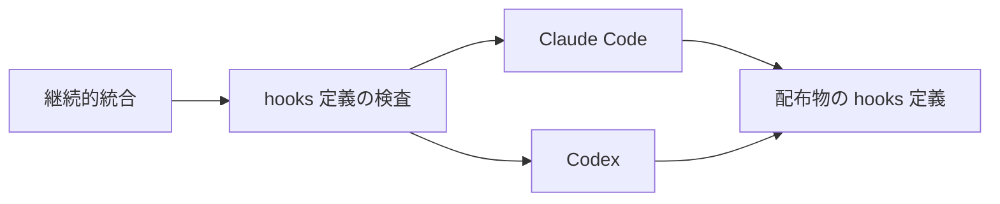
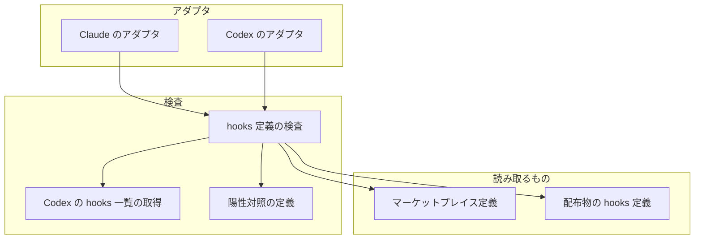
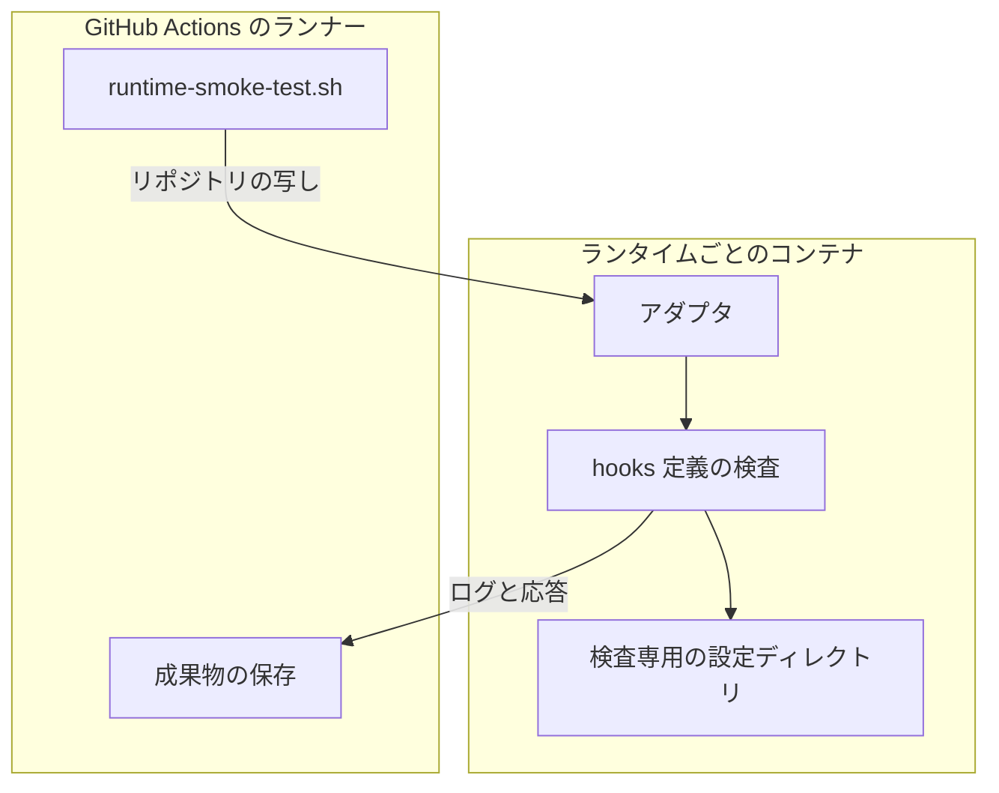
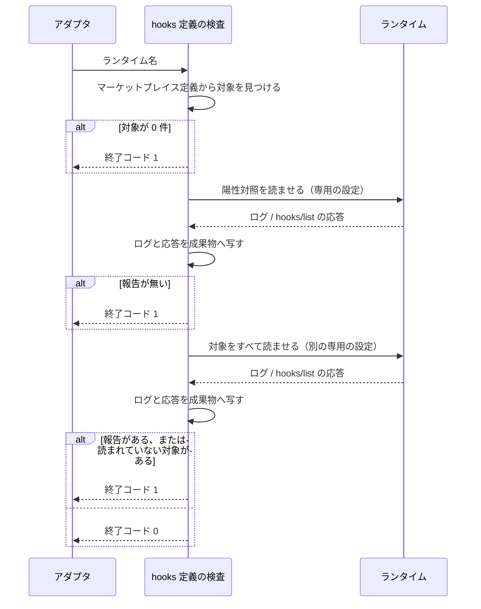

# #571: hooks 定義の未知キーを継続的統合で落とす — 設計

この文書は「どう作るか」だけを扱う。要求と受け入れ条件は
[issue-571-hooks-key-check-requirements.md](issue-571-hooks-key-check-requirements.md) にある。

**ランタイム自身に hooks 定義を読ませ、その読み込みの報告を `runtime-smoke` で判定する。**
受け取るキーの一覧はこちらで持たない。Claude Code はデバッグログに、Codex は app-server の
`hooks/list` の応答に報告を出す。どちらも認証の無いコンテナで取れることを確かめてある。

## 機能一覧

| # | 機能 | 誰が使うか |
| --- | --- | --- |
| 1 | Claude Code に全プラグインの hooks 定義を読ませ、警告が 1 件でもあれば落とす | 継続的統合（`runtime-smoke (claude)`） |
| 2 | Codex に全プラグインの hooks 定義を読ませ、警告か誤りが 1 件でもあれば落とす | 継続的統合（`runtime-smoke (codex)`） |
| 3 | 必ず報告が出るはずの壊れた定義を先に読ませ、報告が出なければ落とす | 1 と 2 の中で毎回 |
| 4 | 読まれるはずのプラグインが読まれていなければ落とす | 1 と 2 の中で毎回 |
| 5 | 判定に使ったログと応答を成果物へ残す | 失敗を調べる開発者 |

## 構成要素

| 要素 | 責務 |
| --- | --- |
| hooks 定義の検査（新設） | 対象のプラグインを見つけ、陽性対照と本物の定義をランタイムに読ませ、報告と読み込みの有無で合否を決める。ランタイムを引数で受け取る |
| Codex の hooks 一覧の取得（新設） | `codex app-server` を起動し、`hooks/list` の応答をそのまま JSON で標準出力へ書く。判定はしない |
| 陽性対照の定義（新設） | Claude Code には未知キーを、Codex には読めない `type` を持つ hooks 定義。どちらにも必ず報告が出る |
| Claude のアダプタ（変更） | 既存の手順の後に、hooks 定義の検査を `claude` で呼ぶ |
| Codex のアダプタ（変更） | 既存の手順の後に、hooks 定義の検査を `codex` で呼ぶ |
| 検査の説明（変更） | `tests/runtime-smoke/README.md` に、何を見て落とすかと、古い像で陽性対照が落ちるときの直し方を書く |

### 文脈

変えられないものは 2 つのランタイムだけである。検査はその報告を読むだけで、ランタイムの
設定にも配布物にも書き込まない。



### 構成要素の関係



図には検査の説明（README）を含めない。検査の実行時に読まれるものではないためである。

### 配置

既存の `runtime-smoke` と同じく、ランタイムごとに使い捨てのコンテナで動く。コンテナへ入るのは
リポジトリの写し（書き込み禁止）だけで、認証情報は入らない。



### 置き場所

```text
tests/runtime-smoke/
├── README.md                              # 変更: 検査の説明
├── adapters/
│   ├── claude.sh                          # 変更: 検査の呼び出しを 1 行足す
│   └── codex.sh                           # 変更: 検査の呼び出しを 1 行足す
├── assertions/
│   └── assert-hook-definitions.sh         # 新設: hooks 定義の検査
├── lib/
│   └── codex-hooks-list.py                # 新設: Codex の hooks 一覧の取得
└── fixtures/
    └── hooks-positive-control/            # 新設: 陽性対照
        ├── .claude-plugin/marketplace.json
        └── plugins/broken-hooks/
            ├── .claude-plugin/plugin.json
            ├── .codex-plugin/plugin.json  # hooks は ./hooks/codex.json を指す
            └── hooks/
                ├── hooks.json             # Claude Code 向け: マッチャーグループに description
                └── codex.json             # Codex 向け: type が cmd
```

陽性対照は `plugins/` の外に置く。`validate-runtime-plugins.sh` が `plugins/` 配下の
`plugin.json` を走査するためである。`tests/` の下なら既存の検査にも配布物にも入らない。

## 決定の記録

### 決定 1: ランタイムに読ませて判定し、受け取るキーの一覧を持たない

受け取るキーはランタイムと版で違う。Claude Code 2.1.270 はマッチャーグループと上位の未知キーを
報告し、コマンド階層の未知キーは報告しない。上位でも `description` は受け取り、報告しない
（実測 #2・#4）。Codex 0.154.0 はどの階層の未知キーも
受け取る（実測 #10）。1 つの一覧で両方を表すと、どちらかで実際には受け取るキーを落とすか、
受け取らないキーを見逃す。ランタイムに読ませれば、継続的統合が最新版を導入するたびに判定が
その版に揃う（前提 1）。

一覧と突き合わせる検査を `validate-runtime-plugins.sh` へ足す方法は採らない。ランタイムの変更に
遅れること（#571 の本文）に加えて、上の食い違いがあるためである。

### 決定 2: Claude Code は `-p` ではなく `plugin list` で読ませる

`plugin list` は `--plugin-dir` で渡したプラグインの hooks 定義を読み、同じ警告をログへ出す。
モデルへの要求をしないため、認証の無い環境でも終了コード 0 で 0.3 秒で終わる（実測 #1）。
`-p` でも警告はログへ出るが、認証の誤りで終了コード 1 になり、終了コードで起動の失敗を
見分けられない。API の再試行で数十秒かかる（実測 #3）。

### 決定 3: Codex も対象に入れ、app-server の `hooks/list` で報告を受け取る

#571 の対象には `hooks/codex.json` が含まれ、#36 は Codex で起きた。Codex が hooks 定義の
読み込みの失敗を非対話で返す経路は、確かめた範囲では `hooks/list` だけである（実測 #8・#9）。
app-server は `[experimental]` と表示される。それでも応答の形が変われば、陽性対照と取得の
検査が落ちる。変化に気づかないまま通ることはない。

Codex の検査が今落とすのは読めない定義（実測 #11）で、未知キーではない。Codex が今は未知キーを
受け取るためである（実測 #10）。**受け入れ条件の「`description` を戻した差分で落ちる」は
Claude Code の検査が満たす。**

### 決定 4: 陽性対照を検査の中に持ち、毎回読ませる

報告を出すかどうかはランタイムの版で変わる。Claude Code 2.1.261 は同じ定義に警告を出さなかった
（実測 #6）。本物の判定は「報告 0 件」で通るため、報告が出ない版や報告の形が変わった版では、
何も検査しないまま通る。陽性対照で報告を受け取れることを毎回確かめれば、それを失敗として
知らせられる。

最小の版を決めて `--version` と比べる方法は採らない。警告が入った版を特定できておらず
（2.1.261 と 2.1.270 の間）、報告の文言が変わったときには役に立たないためである。

### 決定 5: 読ませるたびに空の設定ディレクトリを作る

アダプタはこの検査より前に、同じ設定へプラグインを導入している。そこへ `--plugin-dir` を
重ねると、導入済みの定義も読まれ、数が混ざる（実測 #7）。空の設定なら読まれるのは渡した
ものだけになり、他の検査が見る設定にも書き込まない。

### 決定 6: 対象はマーケットプレイス定義から実行時に見つける

対象のファイルを検査に列挙すると、hooks 定義を持つプラグインを足したときに書き足しを忘れる。
マーケットプレイス定義は配布の唯一の入口なので、そこから辿れば配布されるものと検査の対象が
一致する。見つけた数が 0 なら落とす。

### 決定 7: 「読まれた」ことを、読み込みの行で確かめる

報告が 0 件でも、プラグインがそもそも読まれていなければ検査にならない。陽性対照は「報告が
出るか」を確かめるが、本物のプラグインが読まれたかは確かめない。対象のすべてが
読まれたことは、Claude Code では `Read ... for plugin <名前>` の行で、Codex では `pluginId` で見る。

### 決定 8: agy と Kiro CLI を対象に入れない

agy はプラグイン配下の `hooks.json` を読まず、`install-hooks.sh` が利用者の設定へ差し込む
（`AGENTS.md`）。Kiro CLI は `build-runtime-plugins.sh` が変換したエージェント定義を読み、元の
定義のキーを見ない。どちらも #571 の本文が挙げた経路（起動時の読み込みの警告）と異なる。

## 実測した事実

設計の判断はすべて次の実測に基づく。認証は次の条件で外した。

| 場所 | 条件 |
| --- | --- |
| 手元 | `env -i` で環境変数を空にする。隔離した `CLAUDE_CONFIG_DIR` / `CODEX_HOME` と、空の `ANTHROPIC_API_KEY` を与える |
| コンテナ | `Containerfile.claude` / `Containerfile.codex` をキャッシュなしで作り直した像を使う。認証情報を渡さない |

| # | 条件 | 結果 |
| --- | --- | --- |
| 1 | Claude Code 2.1.270（コンテナ）、`claude --debug-file <log> --plugin-dir <壊した mcp-serena> plugin list` | 終了コード 0、0.3 秒。ログに `[WARN] Plugin mcp-serena: hooks.json: unknown key "description" in hooks.SessionStart[0] ignored (<パス>)` |
| 2 | 同じ版、`develop` の ndf / mcp-serena / mcp-playwright を `--plugin-dir` で渡す。mcp-serena と mcp-playwright の定義は上位に `description` を持つ | 終了コード 0。`[WARN] Plugin` の行は 0 件（手元の 2.1.270 でも同じ）。`Read hooks.json for plugin <名前>` / `Read manifest hooks for plugin <名前>` が 3 プラグイン分出る |
| 3 | Claude Code 2.1.270（手元）、#1 と同じ定義を `-p "reply ok"` で起動 | 警告は同じくログに出るが、`Not logged in` で終了コード 1。`develop` の 3 プラグインを渡した起動は API の再試行で 47 秒かかった |
| 4 | Claude Code 2.1.270（手元）、上位に `description` を持つ mcp-serena の定義へ、コマンド階層に未知キー `bogus`、上位に未知キー `foo`、未知のイベント名 `SessionStartt` を置く | `foo` とイベント名は `[WARN] Plugin <名前>: hooks...` で報告される（`foo` は `hooks.json: unknown key "foo" ignored`）。コマンド階層の `bogus` と、同じ定義が上位に持つ `description` は報告されない。**上位の `description` は受け取るキーである** |
| 5 | Claude Code 2.1.270（手元）、JSON として壊れた定義 | `[ERROR] Failed to load hooks for mcp-serena: JSON Parse error: ...`。`plugin list` の表示は `✘ loaded with errors`、終了コードは 0 |
| 6 | Claude Code 2.1.261（キャッシュの残った古いコンテナ像）、#1 と同じ定義 | **警告が出ない。** `Read hooks.json` の行だけが出る |
| 7 | Claude Code 2.1.270（手元）、隔離した設定へ `ndf@ai-plugins` を導入した後に `--plugin-dir <壊した ndf>` を渡す | 導入済みの ndf と `--plugin-dir` の ndf の両方を読み、`Read manifest hooks for plugin ndf` が 2 行出る |
| 8 | codex-cli 0.153.4（手元）/ 0.154.0（コンテナ）、`codex exec` / `codex plugin list` / `codex debug prompt-input` | 壊れた定義でも hooks に関する出力が無い |
| 9 | codex-cli 0.154.0（コンテナ）、`codex app-server` へ標準入出力で `initialize` → `initialized` → `hooks/list` | 認証なしで応答。`develop` の定義では `warnings: []` / `errors: []`、hooks に mcp-playwright / mcp-serena / ndf が現れる |
| 10 | 同じ条件、ndf の `codex.json` のマッチャーグループへ `description`、上位へ `description`、コマンド階層へ `bogus` を置く | **報告なし**（`warnings: []`）。Codex はどの階層の未知キーも受け取る |
| 11 | 同じ条件、`type` を `cmd` にする | `warnings: ["failed to parse plugin hooks config <パス>: unknown variant `cmd`, ..."]`。ndf の hooks は一覧から消える |
| 12 | 継続的統合の直近の実行（2026-09-13、`develop`）の `version.log` | Claude Code 2.1.270 / codex-cli 0.154.0 |
| 13 | Claude Code 2.1.270（手元）、ndf の `plugin.json` の `hooks` を存在しないパスへ向ける | `[ERROR] Hooks file ./hooks/missing.json specified in manifest but not found ... for ndf`。`Read ... for plugin ndf` の行は出ない |
| 14 | codex-cli 0.153.4（手元）、mcp-serena の `hooks` を存在しないパスへ向ける | `warnings: ["failed to read plugin hooks config <パス>: No such file or directory ..."]` |
| 15 | codex-cli 0.153.4（手元）、mcp-serena の定義を `{"hooks":{}}` にする | `warnings: []`。mcp-serena は `hooks` の一覧から消える |
| 16 | codex-cli 0.153.4（手元）、`hooks/list` の `params` を `{}` にする | 作業ディレクトリの 1 件が返る。`cwds` を渡したときと同じ |

#36 の警告 ``unknown field `description`, expected `hooks` `` は、#11 と同じ
`failed to parse plugin hooks config` の文で出ていた。**Codex が未知キーを拒む版へ戻れば、同じ経路の警告として現れる。**

## 入出力の契約

### hooks 定義の検査

```text
assert-hook-definitions.sh <claude|codex>
```

| 項目 | 内容 |
| --- | --- |
| 読む環境変数 | `REPO_ROOT` / `ARTIFACT_DIR` / `HOME`（既存のアサーションと同じ既定値） |
| 対象 | `$REPO_ROOT/.claude-plugin/marketplace.json` の `plugins[].source` が指すディレクトリのうち、そのランタイムの `plugin.json`（`.claude-plugin/` / `.codex-plugin/`）を持ち、かつ `plugin.json` に `hooks` があるか `hooks/hooks.json` があるもの |
| 終了コード 0 | 陽性対照に報告が出て、本物の定義に報告が 0 件で、対象がすべて読まれた |
| 終了コード 1 | 上のいずれかを満たさない。理由を標準エラーへ 1 行以上書く |
| 終了コード 2 | 引数が `claude` / `codex` 以外 |
| 書く先 | `$ARTIFACT_DIR/hook-definitions/`（ログと応答）、`mktemp -d` で作った検査専用の設定ディレクトリ |
| 書かない先 | `$HOME/.claude` / `$HOME/.codex`、`$REPO_ROOT` |

失敗の文言は、原因を 1 行で特定できる形にする。

| 失敗 | 標準エラーへ書くもの |
| --- | --- |
| 陽性対照に報告が無い | `<ランタイム> <版> did not report the broken hooks fixture; the report format may have changed or the image is stale` |
| 本物の定義に報告がある | `<ランタイム> reported hooks definitions:` の後に、報告の行をそのまま |
| 読まれていないプラグインがある | `<ランタイム> did not load hooks for: <名前の並び>` |
| 対象が 0 件 | `no plugin with hooks definitions found`（見つけ方の誤りを通過にしない） |

### Claude Code での判定

1 回の起動ごとに空の設定ディレクトリを作る（実測 #7: 導入済みのプラグインも読まれ、数が混ざる）。

```bash
CLAUDE_CONFIG_DIR="$(mktemp -d)" claude --debug-file "$log" \
  --plugin-dir <対象 1> --plugin-dir <対象 2> ... plugin list </dev/null
```

| 判定 | ログの行 |
| --- | --- |
| 報告 | `[WARN] Plugin <名前>: hooks` で始まる本文、または `[ERROR] Failed to load hooks for <名前>` |
| 読まれた | `Read hooks.json for plugin <名前>` または `Read manifest hooks for plugin <名前>` |

`plugin list` の終了コードは判定に使わない（実測 #5: 読み込みに失敗しても 0 を返す）。ただし
0 以外なら、起動そのものが失敗したとして落とす。

### Codex の hooks 一覧の取得

```text
codex-hooks-list.py [--cwd <ディレクトリ>]
```

| 項目 | 内容 |
| --- | --- |
| 前提 | `CODEX_HOME` にマーケットプレイスの登録とプラグインの導入が済んでいる |
| 送る要求 | `initialize`（`clientInfo` のみ）→ `initialized` 通知 → `hooks/list`（`cwds` に作業ディレクトリ） |
| 標準出力 | `hooks/list` の応答の `result` を JSON で 1 つ |
| 終了コード 0 | 応答を受け取った |
| 終了コード 1 | 応答が `error` を持つ、`result.data` が無い、app-server が応答前に終わった、30 秒を超えた。受け取った本文と app-server の標準エラーの末尾を標準エラーへ書く |

### Codex での判定

陽性対照と本物で別々の `CODEX_HOME` を作り、それぞれにマーケットプレイスを登録して導入する。

| 判定 | 応答の値 |
| --- | --- |
| 報告 | `data[].warnings` と `data[].errors` の要素 |
| 読まれた | `data[].hooks[].pluginId` の `@` より前 |

**Codex の「読まれた」は、定義を読んだことではなく hooks が 1 つ以上登録されたことを指す。**
中身が空の定義は報告なしで一覧から消える（実測 #15）。配布物に空の定義を置く理由は無いため、
これも落とす。

## 処理の流れ



図の「ランタイム」への読ませ方は、ランタイムごとに次のとおりである。

| ランタイム | 読ませ方 | 返るもの |
| --- | --- | --- |
| Claude Code | `plugin list` の起動 | デバッグログ |
| Codex | Codex の hooks 一覧の取得 | `hooks/list` の応答 |

**陽性対照を先に読ませるのは、本物の判定が「報告 0 件」で通るためである。** 報告の形が変われば
0 件になり、何も検査しないまま通る。先に陽性対照で報告を受け取れることを確かめれば、0 件が
「問題が無い」ことを意味すると言える。

## 非機能の実現方式

| 大項目 | 実現方式 | 確かめ方 |
| --- | --- | --- |
| 性能・拡張性 | ランタイムの起動をモデルへの要求なしで済ませる（Claude Code は `plugin list`、Codex は app-server の `hooks/list`）。1 ランタイムあたり起動は 2 回 | 実測 #1 で 0.3 秒、#9 で 0.1 秒。実装の Pull Request で `runtime-smoke` の所要時間を変更前と比べる |
| 運用・保守性 | 失敗の文言にプラグイン名と報告の本文を載せ、ログと応答を成果物に残す | 受け入れ条件の差分を当てた実行の `smoke.log` を読む |
| システム環境 | ランタイムの版を固定せず、陽性対照で報告の形の変化を知らせる | 陽性対照の定義を報告の出ない形に書き換えた実行が落ちる |

## テスト設計

**検査そのものの確かめは、陽性対照（毎回）と、受け入れ条件の差分を当てた実行（実装の Pull
Request で 1 度）の 2 つで行う。** 受け入れ条件の差分は Pull Request に載せない。手元の作業ツリーで
当てて `runtime-smoke-test.sh` を実行し、終了コードと `smoke.log` を記録する。

| 受け入れ条件 | 何で確かめるか |
| --- | --- |
| ndf の `claude.json` へ `description` を戻すと `(claude)` が落ちる | 差分を当てて `--runtime claude` を実行し、終了コード 1 |
| mcp-serena の `hooks.json` へ `description` を戻すと `(claude)` が落ちる | 差分を当てて `--runtime claude` を実行し、終了コード 1 |
| 失敗時に `smoke.log` へ警告の行が出る | 上の実行の `smoke.log` に `Plugin ndf: hooks.json: unknown key` / `Plugin mcp-serena: ...` |
| 読まれないプラグインがあると `(claude)` が落ちる | ndf の `plugin.json` の `hooks` を存在しないパスへ向けて実行し、終了コード 1 と `did not load hooks for: ndf`（実測 #13: 読み込みの行が出ない） |
| 陽性対照に報告が無いと `(claude)` が落ちる | 陽性対照の `hooks.json` から `description` を外して実行し、終了コード 1 |
| ndf の `codex.json` の `type` を `cmd` にすると `(codex)` が落ちる | 差分を当てて `--runtime codex` を実行し、終了コード 1 |
| 失敗時に `smoke.log` へ Codex の警告の文が出る | 上の実行の `smoke.log` に `failed to parse plugin hooks config` |
| `hooks/list` に現れないプラグインがあると `(codex)` が落ちる | mcp-serena の `hooks/hooks.json` を `{"hooks":{}}` にして実行し、終了コード 1 と `did not load hooks for: mcp-serena`（実測 #15。存在しないパスは報告で落ちるため、この壊し方にする: 実測 #14） |
| 陽性対照に報告が無いと `(codex)` が落ちる | 陽性対照の `codex.json` の `type` を `command` に戻して実行し、終了コード 1 |
| この変更を載せた `develop` で通る | 実装の Pull Request の `runtime-smoke (claude)` / `(codex)` |
| 認証情報を使わない | 継続的統合の `--with-secrets=off` のまま通ること |
| 他の設定ディレクトリへ書き込まない | 検査の前後で `$HOME/.claude` / `$HOME/.codex` の `find -newer` が 0 件 |
| 対象を列挙していない | 検査の本文にプラグイン名が現れないことをレビューで見る |

## 未確認のまま残ること

| 項目 | 内容 |
| --- | --- |
| 継続的統合のランナーで app-server が起動するか | 手元の Docker（arm64）のコンテナで確かめた。GitHub Actions の `ubuntu-latest`（x86_64）では実装の Pull Request で初めて走る |
| 実測 #13〜#16 のコンテナでの再現 | 手元の codex-cli 0.153.4 / Claude Code 2.1.270 で確かめた。コンテナの codex-cli 0.154.0 では、実装の Pull Request のテスト設計の実行で確かめる |
| Claude Code が警告を出し始めた版 | 2.1.261 では出ず、2.1.270 では出る。間の版は確かめていない。陽性対照があるため、判定には影響しない |
