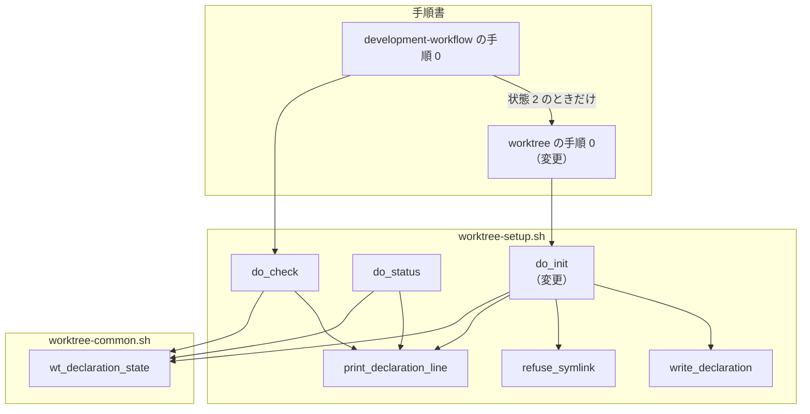
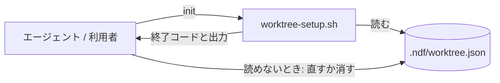
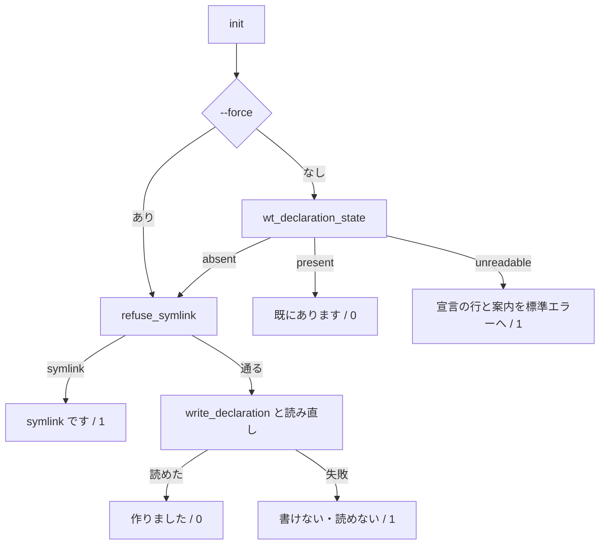

# #573: init が読めない宣言を失敗として報告し、手順 0 がそこで止まる

要求と受け入れ条件は [issue-573-requirements.md](issue-573-requirements.md) にある。この文書は「どう作るか」と、
直し方の候補を最新の `develop`（f081502）で確かめた結果を扱う。

**`--force` を付けない `init` は、書き込みの前に `wt_declaration_state` で宣言の状態を読む。** 読める宣言なら
「既にあります」で 0、読めない宣言なら宣言の行と案内を標準エラーへ出して 1、無ければこれまでどおり作る。
手順 0 は `init` の終了コードが 0 でなければ先へ進まない。宣言の読み取り層は変えない。

## 現状

### 食い違いの理由

`do_init` は `[ -e "$DECLARATION_FILE" ]` だけで「既にある」を決める。`status` と `check` は
`wt_declaration_state` を呼び、存在するが読めないものを `unreadable` に分ける。**`init` だけが状態の
関数を通らないため、同じ宣言を別の状態として報告する。**

加えて `do_init` は、`--force` の有無にかかわらず先頭で `refuse_symlink` を呼ぶ。そのため読める宣言を
指す symlink でも、書き込みをしないのに「symlink です」で 1 を返す。

### 実測

**確かめ方:** 一時ディレクトリに `git init` したリポジトリを形ごとに作り、`develop` の `worktree-setup.sh` で
`init` / `status` / `check` を実行した。状態は `wt_declaration_state` を直接呼んで得た。

| 宣言の形 | `init`（現状） | `status` の宣言の行 | `check` | 状態 |
| --- | --- | --- | --- | --- |
| JSON として壊れている（`{broken`） | 0「既にあります」 | 読めません | 3 | `unreadable` |
| `version` が `99` | 0「既にあります」 | 読めません | 3 | `unreadable` |
| `version` が文字列 `"1"` | 0「既にあります」 | 読めません | 3 | `unreadable` |
| 空のファイル | 0「既にあります」 | 読めません | 3 | `unreadable` |
| 配列 `[1]` | 0「既にあります」 | 読めません | 3 | `unreadable` |
| ディレクトリ | 0「既にあります」 | 読めません | 3 | `unreadable` |
| 権限 `000` のファイル | 0「既にあります」 | 読めません | 3 | `unreadable` |
| 読める宣言 | 0「既にあります」 | あり | 0 | `present` |
| 読める宣言を指す symlink | 1「symlink です」 | あり | 0 | `present` |
| 壊れた宣言を指す symlink | 1「symlink です」 | 読めません | 3 | `unreadable` |
| 指す先が無い symlink | 1「symlink です」 | なし | 2 | `absent` |
| 無い | 0「作りました」 | あり（作った後） | 0 | `absent` → `present` |

実行者は uid 1000 で、権限 `000` のファイルは実際に読めなかった。

`--force` の経路も確かめた。

| 形 | `init --force` の結果 |
| --- | --- |
| JSON として壊れている | 0。宣言を作り直し、`check` は 0 |
| `version` が `99` | 0。宣言を作り直し、`check` は 0 |
| 空のファイル | 0。宣言を作り直し、`check` は 0 |
| 権限 `000` のファイル | 0。宣言を作り直し、`check` は 0 |
| ディレクトリ | 1「書いた宣言ファイルを読み取れません」。ディレクトリの中に一時ファイル `.worktree.json.XXXXXX` が残る（#628） |
| 壊れた宣言を指す symlink | 1「symlink です」 |

## 機能一覧

| # | 機能 | 誰が使うか |
| --- | --- | --- |
| F1 | `init` が読めない宣言を、宣言の行と案内を添えて失敗にする | `worktree` を起動したエージェントと、手で `init` を実行する利用者 |
| F2 | `init` が読める宣言を、symlink でも「既にあります」と報告する | 同上 |
| F3 | 手順 0 が `init` の失敗で止まり、出力を利用者に示す | `worktree` を起動したエージェント |

## 構成要素

**新しいファイルは作らない。**

| 要素 | 責務 |
| --- | --- |
| `worktree-setup.sh` の `do_init`（変更） | `--force` が無いとき、`refuse_symlink` より前に `wt_declaration_state` を読み、3 つの状態で分岐する |
| `worktree-setup.sh` の `print_declaration_line`（既存・変えない） | 宣言の行を出す。`do_init` の読めない枝が標準エラーへ向けて呼ぶ |
| `worktree-common.sh` の `wt_declaration_state`（既存・変えない） | 状態を 3 語で返す唯一の基準 |
| `worktree/SKILL.md` の手順 0（変更） | `init` の終了コードで止まることと、利用者が決めることを書く |
| `docs/specifications/ndf-workflow-unit-and-gates.md`（変更） | 「`init` の後にもう一度 `check` を通す」の理由の 1 文を、変更後の終了コードに合わせる |
| `worktree/tests/test_setup.py`（変更） | 受け入れ条件ごとのテスト |



図は呼び出しの関係だけを描く。仕様の文書とテストは含めない。

## 文脈と配置

**外部の系は無い。** `worktree-setup.sh` はエージェントか利用者が手元のシェルで実行する。hook からは
呼ばれない。配置は変わらないため、配置の図は描かない。



## 変わるファイル

```text
plugins/ndf/
├── scripts/worktree-setup.sh            # 変更: do_init の分岐
└── skills/worktree/
    ├── SKILL.md                         # 変更: 手順 0
    └── tests/test_setup.py              # 変更: 受け入れ条件のテスト
docs/specifications/
└── ndf-workflow-unit-and-gates.md       # 変更: init の終了コードに触れる 1 文
```

## 入出力の契約

### `worktree-setup.sh init`（`--force` なし）

| 状態 | 終了コード | 標準出力 | 標準エラー | 宣言 |
| --- | --- | --- | --- | --- |
| `present`（symlink を含む） | 0 | `宣言ファイルは既にあります: .ndf/worktree.json` | 空 | 変えない |
| `unreadable` | 1 | 空 | 下の 2 行 | 変えない |
| `absent` | 0（書けたとき）/ 1（symlink・書けない・書いた後に読めない） | 現状どおり | 現状どおり | 作る |

`unreadable` の標準エラー:

```text
宣言ファイル: 読めません（版が未対応か、JSON として壊れています）
中身を直すか、書き加えた内容が要らなければ .ndf/worktree.json を消してから、もう一度 init を実行してください
```

- 1 行目は `print_declaration_line unreadable` の出力そのものである。`status` / `check` の宣言の行と一字一句同じになる
- `absent` のうち symlink の `.ndf`・指す先の無い symlink は、`refuse_symlink` がこれまでどおり 1 で断る

### `worktree-setup.sh init --force`

変えない。`refuse_symlink` を通してから書く。

### 手順 0 の本文

| 置く内容 | 書き方 |
| --- | --- |
| コマンド | `bash "$SCRIPTS/worktree-setup.sh" init; echo "exit=$?"` |
| 止まる条件 | 終了コードが 0 でなければ先へ進まず、出力を利用者に示す |
| 利用者が決めること | 宣言を直す・消す・`init --force` で作り直す |
| 既存の箇条書きの直し | 「既にあれば上書きしない」を「読める宣言が既にあれば上書きしない。読めない宣言では 1 で終わる」へ |

見出し「0. 宣言ファイルを用意する」と、`check` への案内の文は変えない。`test_declaration_check.py` が、
この見出しと `worktree-setup.sh check` の文字列を本文から探すためである。

## 処理の流れ



## 決定の記録

### 決定 1: `init` は `wt_declaration_state` を呼び、基準を書き写さない

#527 は状態を分ける基準を `wt_declaration_state` の 1 か所に置いた。`init` が `[ -f ]` と `jq` で独自に
判定すると、`status` / `check` と食い違う経路が再び生まれる。読み取り層は #495 で構造が変わる予定で、呼ぶ
だけにしておけば `init` はその変更に追随しなくてよい。

`init` の中で `wt_declaration` の戻り値だけを見る形は、`absent` と `unreadable` を区別するために `[ -e ]` を
書き足すことになり、基準の書き写しになる。

### 決定 2: 読めない宣言の終了コードを 1 にする

`worktree-setup.sh` の先頭は、0 を「処理が完了した」、1 を「処理できなかった」とし、2・3 を `check` だけに
割り当てる。読めない宣言の `init` は、宣言を用意できなかった点で「処理できなかった」に当たる。手順 0 が
見るのは 0 かどうかだけで、理由は出力が持つ。

`check` と同じ 3 を返す案は、`init` の終了コードの約束を広げる。状態で分岐したい手順は、既に `check` を
使っている（`development-workflow`）。

### 決定 3: 1 行目は `print_declaration_line` の出力を標準エラーへ向ける

#527 は「同じ状態を別の言葉で書かない」ために、宣言の行を 1 つの関数から出す形にした。`init` が同じ
関数を呼べば、3 つの副コマンドの文言が 1 か所で揃う。標準エラーへ向けるのは、`init` の他の失敗
（「symlink です」「書けませんでした」）と同じ扱いにするためである。

「既にありますが読めません」のような `init` 専用の文言は、`status` だけを見た利用者と `init` だけを見た
利用者が、同じ状態を別のものと読みうる。

### 決定 4: 案内は「直すか、消してから init」とし、`--force` を勧めない

`--force` は読めない宣言の形によって結果が分かれる。実測では、壊れた JSON・`version` が `99`・空のファイル・権限 `000` のファイルは作り
直せたが、ディレクトリは中に一時ファイルを残して 1 で終わり（#628）、壊れた宣言を指す symlink は断られた。
消してから `init` を実行する形は、試作でディレクトリと symlink の両方とも 0 で宣言を作れた。
`development-workflow` も状態 3 では `init --force` を実行しない方針を取っている。

`--force` を勧める案は、案内に従った利用者がディレクトリの形で #628 の事象に当たる。

### 決定 5: `--force` が無いとき、状態の判定を `refuse_symlink` より前に置く

手順 0 は、この変更で `init` の失敗を止まる条件にする。判定を後に置くと、読める宣言を指す symlink の
リポジトリで、書き込みをしないのに「symlink です」の 1 で止まる（実測）。`refuse_symlink` の目的は
リポジトリの外を**書き換えない**ことで、読むだけの `present` と `unreadable` の枝には当たらない。

判定の順序を変えない案は、symlink で宣言を共有しているリポジトリで `worktree` が先へ進めなくなる。

### 決定 6: 手順 0 は `init` の後に `check` を足さない

変更後の `init` は、0 のとき宣言が読めることを保証する（`present` の枝は状態の関数で確かめ、作った枝は
書いた後に `wt_declaration` で読み直す）。手順 0 に `check` を足しても、同じ判定を 2 回行うだけである。

`development-workflow` の手順 0 と同じく `check` から始める案は、手順 0 の構成を変える。worktree の
SKILL.md は担当 D が #495 で宣言の説明を変える予定で、変更の重なりが広がる。

### 決定 7: 読めない理由は区別しない

区別するには状態の関数が 3 語より多くを返す必要があり、読み取り層の変更になる（前提 1）。宣言の行は
「版が未対応か、JSON として壊れています」と候補を並べており、ディレクトリと権限の形は利用者が `ls -l` で
見分けられる。

## テスト設計

テストは `plugins/ndf/skills/worktree/tests/test_setup.py` に置く。既存の `run` と `write_declaration` と
`main_repo` の fixture を使う。「変更前」は develop（f081502）での結果である。

| 実行の場面 | コマンド |
| --- | --- |
| 変更した箇所の確認 | `uv run --with pytest pytest plugins/ndf/skills/worktree/tests/test_setup.py plugins/ndf/skills/development-workflow/tests/test_declaration_check.py -q` |
| 仕上げ | `uv run --with pytest pytest scripts/tests plugins/ndf -q` と `bash scripts/validate-runtime-plugins.sh` |

| 受け入れ条件 | 何で確かめるか | 変更前 |
| --- | --- | --- |
| AC1 | `{ not json` を書いて `init`。`rc == 1` と、標準出力に「既にあります」が無いこと | 落ちる |
| AC2 | AC1 の標準エラーの 1 行目が、既存の `BROKEN_LINE` と等しく、同じ木の `status` / `check` の宣言の行とも等しい | 落ちる |
| AC3 | AC1 の標準エラーに `.ndf/worktree.json を消してから` と `init` が入り、`--force` が入らない | 落ちる |
| AC4 | `{"version": 99}`・空のファイル・ディレクトリ・権限 `000` を parametrize し、AC1・AC2 と同じ判定。権限の形は root で実行すると読めてしまうため、`os.geteuid() == 0` のとき skip する | 落ちる |
| AC5 | AC1・AC4 の各形で、`init` の前後のバイト列（ディレクトリは中の一覧）と権限が等しい | 通る |
| AC6 | 既存の `test_init_does_not_overwrite` | 通る |
| AC7 | 既存の `test_init_creates_a_readable_declaration` と `test_check_reports_a_readable_declaration` | 通る |
| AC8 | 読める宣言を `tmp_path` に置いて symlink を張り、`init` が `rc == 0` で「既にあります」を出し、指す先の中身が変わらない | 落ちる |
| AC9 | `{ not json`・`{"version": 99}`・空のファイル・権限 `000` を parametrize し、`init --force` が 0 で、直後の `check` が 0。権限の形は AC4 と同じく root のとき skip する。ディレクトリの形は #628 のため含めない。symlink は既存の `test_init_refuses_a_symlinked_declaration` と `test_init_refuses_a_symlinked_ndf_directory` | 通る |
| AC10 | 手順 0 の節（見出しから「## 1.」の手前まで）に `exit=$?` と「先へ進まない」と「利用者」が入る | 落ちる |
| AC11 | 同じ節に「読める宣言」と「1 で終わる」が入る | 落ちる |
| AC12 | 既存の `test_status_*` / `test_check_*` / `test_a_directory_declaration_is_unreadable_in_both` が変わらず通る | 通る |
| AC13 | テスト一式の実行。`test_setup.py` と `test_declaration_check.py` の既存テストの差分が追加だけであることを差分で確かめる | 通る |
| AC14 | 仕様の文書の差分を読み、「読めるとは限らない」が残っていないことを `grep` で確かめる | 落ちる |

試作では、`do_init` の分岐と案内の文言だけを写しに当てた。`worktree/tests` 一式と
`test_declaration_check.py` の 810 件のうち 809 件が通った。

落ちた 1 件は `test_this_repository_declares_the_production_branch` である。写しのディレクトリにリポジトリの
`.ndf/` が無いことが原因で、作業ツリーでは通る。

## #495 / #610 との順序

**この課題の実装を、担当 D の #495 / #610 より先に `develop` へ入れる。** マイルストーンの進行を
統括する側がそう決めた。

#495 は宣言を共有と個人の 2 つへ分け、`init` が作る宣言と状態の関数の対象を変えうる。先に入れる
この変更は、`do_init` が `wt_declaration_state` を呼ぶだけの形に留める（決定 1）。後から入る #495 は、
状態の関数の側を変えれば `init` の分岐をそのまま引き継げる。手順 0 の本文は #495 も書き換える予定で、
重なりはこの課題が先に入った後の差分として #495 の側で解く。

## 未確認のまま残ること

| 項目 | 内容 |
| --- | --- |
| root での実行 | 権限 `000` の形は root では読めるため、`present` か `unreadable`（中身次第）になる。コンテナで root として動かす利用者の振る舞いは確かめていない |
| Codex / Kiro CLI / agy での手順 0 | 手順 0 の本文を 4 ランタイムのエージェントが同じく「0 でなければ止まる」と読むかは、本文の変更後に確かめる |
