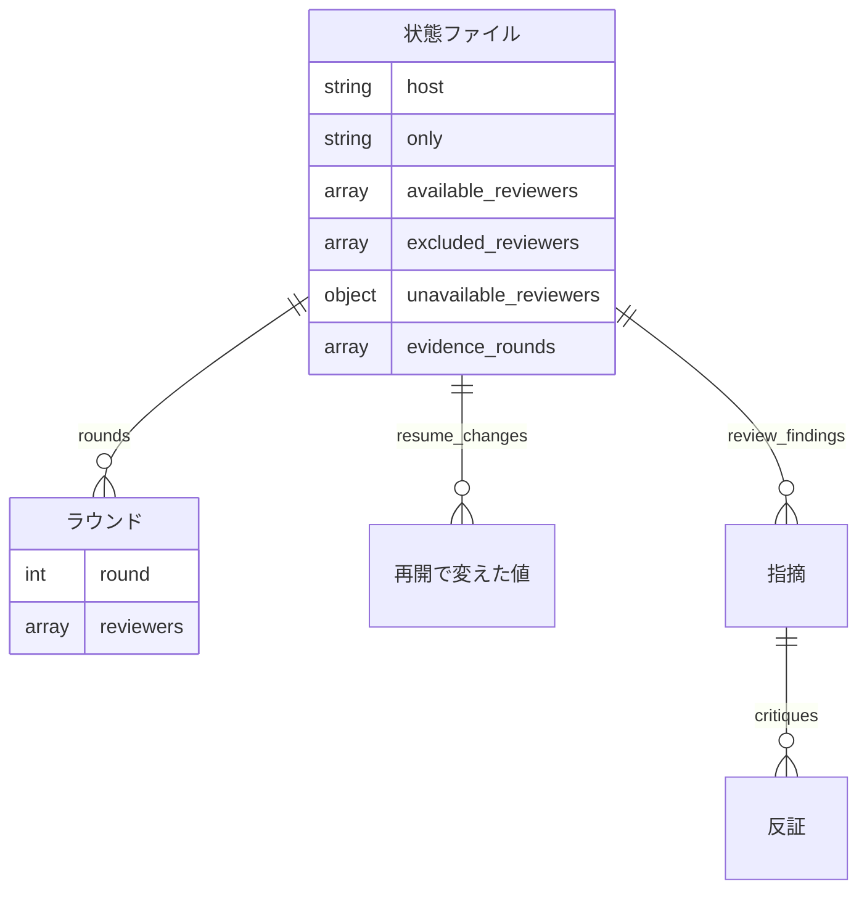

# #624 / #478 / #648: 状態ファイル・引数・関数の契約

[issue-624-478-648-design.md](issue-624-478-648-design.md) の続きである。決定の理由は設計文書の「決定の記録」にあり、
この文書は形だけを書く。**P4 は状態ファイルの形も引数も変えない。** P4 が変えるのは区分の条件（設計文書の決定 3）と
印の外し方（決定 5）で、「`state.py` の内部関数」の表の末尾 2 行と「変わらない項目の意味の変化」の先頭 2 行に
当たる。それ以外の契約は P5 のものである。

## データ構造（状態ファイル）

### 増える項目

状態ファイル `cross-review-pr<番号>-state.json` の最上位に 6 項目が増える。**`version` の類は持たないため上げない。**
項目が無い状態ファイルは、この変更の前に始めた実行として読む（下の「移行」）。

| 項目 | 型 | 空を許すか | 意味 |
| --- | --- | --- | --- |
| `available_reviewers` | 文字列の配列 | 許さない（項目が無いことは許す） | 使える者。母集合（`review_pool(host)`）の順に並ぶ。`only` があれば `[only]`。項目が無いのは「この変更の前に始めた実行」で、「使える者が 0 者」ではない（0 者の状態ファイルは作らない） |
| `excluded_reviewers` | 文字列の配列 | 許す（空の配列） | `--exclude` で外した者。母集合の順。空は「外していない」 |
| `unavailable_reviewers` | オブジェクト（名前 → 理由の文字列） | 許す（空のオブジェクト） | 認証を通らなかった者と、`probe_auth` の `detail`。空は「全員が通った」か「確認を飛ばした」 |
| `require_all` | 真偽値 | 許さない | `--require-all` の値。新規の既定は `false` |
| `auth_skipped` | 真偽値 | 許さない | `NDF_SKIP_AUTH_CHECK` で確認を飛ばしたか。`unavailable_reviewers` が空である理由を区別する |
| `resume_changes` | オブジェクトの配列 | 許す（空の配列） | 再開で変えた値の記録。追記だけを行う |

`resume_changes[]` の要素:

| 項目 | 型 | 意味 |
| --- | --- | --- |
| `at` | 文字列（ISO 8601） | 再開した時刻（`_now()`） |
| `field` | 文字列 | 変えた項目の名前（`max_rounds` / `rotate_after` / `only` / `verify_commands` / `verify_exit_codes` / `excluded_reviewers` / `available_reviewers` / `unavailable_reviewers` / `require_all` / `auth_skipped`）。値が変わった項目だけを積む |
| `from` | 任意 | 変える前の値。項目が無かったときは `null` |
| `to` | 任意 | 変えた後の値 |

### 変わらない項目の意味の変化

| 項目 | 変わること |
| --- | --- |
| `evidence_rounds` | P4 から、反証が揃わない取り込みで番号が**外れる**ことがある（決定 5）。**付く条件は変わらない** |
| `review_findings[].classification` | P4 から、`critiques` が空で単独の根拠付き `major` 以上が `needs_human_judgment` になる（決定 3） |
| `only` | P5 から、再開の `--only` で変わる。`--only none` で `null` へ戻る |
| `max_rounds` / `rotate_after` / `verify_commands` / `verify_exit_codes` | P5 から、再開で明示的に渡したときだけ変わる |
| `rounds[].reviewers` | 変わらない。**過去のラウンドの担当はこの記録が持ち、再開で書き換えない** |

### 実体の関係



### 機能とデータの対応

| 機能 | `available_reviewers` / `excluded_reviewers` / `unavailable_reviewers` | `only` / `max_rounds` など | `resume_changes` | `rounds[].reviewers` | `evidence_rounds` | `review_findings[].classification` |
| --- | --- | --- | --- | --- | --- | --- |
| F1 数える | — | — | — | R | R | U |
| F2 印を外す | — | — | — | R | U | — |
| F3〜F5 新規の `init` | C | C | C（空） | — | — | — |
| F5 `start-round` | R | R | — | C | — | — |
| F6 再開の `init` | U | U | U（追記） | R | — | — |
| F7 `report` | R | R | R | R | — | — |

### 時系列の扱い

`available_reviewers` などの値は上書きし、過去の値は `resume_changes` に事象として積む（決定 17）。ラウンドごとに
誰が担当したかは `rounds[].reviewers` が持つため、上書きで失われるのは「どの時点でどの一覧だったか」だけで、
それを `resume_changes` が補う。

### 移行

**既存の状態ファイルは書き換えない。** 項目が無いときの読み方を決める。

| 項目が無いとき | 読み方 |
| --- | --- |
| `available_reviewers` | `host` があれば `review_pool(host)` の輪番（変更前と同じ）。`host` も無ければ `codex` / `agy` |
| `excluded_reviewers` / `unavailable_reviewers` / `resume_changes` | 空として読む |
| `require_all` / `auth_skipped` | `false` として読む |

再開で担当に関わる引数を渡したときだけ、使える者を作り直して項目を書く（決定 15）。渡さない再開では書き足さない。

## 入出力の契約

### `state.py init` の引数

| 引数 | 型 | 既定（argparse） | 新規の経路 | 再開の経路 | 変更 |
| --- | --- | --- | --- | --- | --- |
| `pr` | 整数 | 必須 | — | — | 変わらない |
| `--max-rounds N` | 整数 | `None` | 無ければ 12 | 渡せば反映 | 既定を `None` へ |
| `--rotate-after K` | 整数 | `None` | 無ければ 8 | 渡せば反映 | 既定を `None` へ |
| `--only RUNTIME` | `claude`/`codex`/`agy`/`kiro`/`none` | `None` | `none` は無しと同じ | 渡せば反映。`none` で `null` | `none` を追加 |
| `--exclude NAMES` | カンマ区切りの名前。繰り返し可 | `None` | 外す | 渡せば置き換え。`none` で空 | **新設** |
| `--require-all` / `--no-require-all` | 真偽値 | `None` | 無ければ `false` | 渡せば反映 | **新設** |
| `--host RUNTIME` | 4 つの名前 | `None` | 無ければ推定 | 反映しない。違えば 1 行 | 再開での知らせを追加 |
| `--verify-command CMD` | 文字列。繰り返し可 | `None` | 無ければ空 | 渡せば置き換え | 再開で反映 |
| `--verify-exit-code N` | 整数。繰り返し可 | `None` | 無ければ空（判定側の既定 1） | 渡せば置き換え | 再開で反映 |
| `--worktree` / `--focus` / `--extra-instructions-file` | — | — | — | — | 変わらない |

**`--exclude` の値の検査は 2 段に分かれる。** 名前の綴り（4 つの名前か `none`）は argparse の型が終了コード 2 で
弾く。母集合に含まれるか（ホスト自身でないか）は `init` がホストを確定した後に確かめ、終了コード 1 で弾く。
`none` と他の名前を同時に渡したら終了コード 1 で弾く。

### `state.py init` の出力と終了コード

標準出力の `KEY=VALUE`（`_print_init_result`）は変えない。**増えるのは標準エラーの行だけである。**

| 場面 | 標準エラーに出るもの | 終了コード | 状態ファイル |
| --- | --- | --- | --- |
| 新規で全員が使える | 母集合と使える者の 1 行（現行の「ホスト / レビュワーの母集合」の行に続ける） | 0 | 作る |
| 新規で認証を通らない者がいる | 外した者と理由を 1 者 1 行 | 0 | 作る |
| 新規で使える者が 1 者 | 観点が 1 つになる警告 1 行 | 0 | 作る |
| 新規で使える者が 0 者 | 使える者がいない理由 | 1 | 作らない |
| `--require-all` で欠けがある | 変更前と同じ「認証されていない CLI があります」の文言 | 1 | 作らない |
| `--exclude` が母集合の外 / `--only` と矛盾 / `none` と名前の混在 | 何が矛盾したか | 1 | 作らない |
| 再開で引数を反映した | 反映した項目ごとに `<項目>: <旧> → <新>` の 1 行 | 0 | 書き換える |
| 再開で `--host` が状態と違う | 反映しないことを 1 行 | 0 | `host` は変えない |
| 再開で作り直した使える者が 0 者 / 欠けあり | 新規と同じ | 1 | 書き換えない |

### `state.py report` の出力

現行の「PR 履歴」の後に、次の節を足す。

```text
## 参加した者
- 使える者: codex / kiro
- --exclude で外した者: agy
- 認証を通らなかった者: なし
- 再開で変えた値: 2026-09-15T12:00:00 excluded_reviewers [] → ["agy"]
```

項目が無い状態ファイル（この変更の前に始めた実行）では「使える者: 記録なし」と出す。

### 共通層の関数（`lib/assignment.py`）

| 関数 | 入力 | 出力 | 失敗の形 | 変更 |
| --- | --- | --- | --- | --- |
| `review_pool(host)` | ホスト名 | 母集合 3 者 | ホストでない名前で `AssignmentError` | 変わらない |
| `review_candidates(host, excluded)` | ホスト名、外す名前の集合 | 母集合から外した一覧（母集合の順） | 母集合に無い名前を含むと `AssignmentError`（名前を並べる） | **新設** |
| `review_assign(round_no, available)` | ラウンド番号、使える者の一覧（`list` / `tuple`） | 担当（3 者以上は 1 者を外す、2 者以下はそのまま） | `round_no < 1`、空の一覧、文字列を渡したときに `AssignmentError` | **第 2 引数をホスト名から一覧へ変える** |
| `assign(round_no, host)` | — | — | — | 変わらない |

**`review_assign` の呼び出し側は `state.py` の `_round_reviewers` だけである。** `git grep -n review_assign` で
他に当たるのは `cross-refactoring` のテスト、`docs/05` の説明、`issues/old/` の記録だけである。文字列を弾くのは、変更前の呼び方（`review_assign(1, "claude")`）が
黙って 1 文字ずつの一覧として通るのを防ぐためである。

### 共通層の関数（`lib/auth.py`）

| 関数 | 入力 | 出力 | 失敗の形 | 変更 |
| --- | --- | --- | --- | --- |
| `probe_auth(runtimes, *, info, env=None)` | 確かめる名前の一覧 | `(結果, 飛ばしたか)`。結果は名前 → `{"command", "ok", "detail"}` | 例外を上げない。コマンドが無い・時間切れは `ok: false` と `detail` | **新設** |
| `check_auth(runtimes, *, info, die, env=None)` | 変わらない | 変わらない（飛ばしたときは `{}`） | 1 件でも失敗すれば `die` を呼ぶ | **振る舞いを変えない**（中で `probe_auth` を使ってよい） |

### `state.py` の内部関数

| 関数 | 契約 | 変更 |
| --- | --- | --- |
| `_resolve_reviewers(host, only, excluded, require_all)` | 設計文書の「使える者の解決」の 5 手順を行い、`{"available_reviewers", "excluded_reviewers", "unavailable_reviewers", "auth_skipped"}` を返す。失敗は `die(code=1)` | **新設**（`_auth_targets` を置き換える） |
| `_validate_only(only, host, excluded)` | `only` が母集合に無い、または `excluded` に含まれるとき `die` | 引数を足す |
| `_round_reviewers(st, round_no)` | 設計文書の決定 12 の順で返す | 順を変える |
| `_resume_from_state(pr, repo, worktree, manual_extra_review, args)` | 決定 13〜17 の反映を行う。反映が失敗したら状態ファイルを書き換えずに終了コード 1 | 引数を足す |
| `_apply_resume_args(st, args)` | 渡された引数を `st` へ書き、`resume_changes` に積み、出す行の一覧を返す。書き込みは呼び出し側が 1 回で行う | **新設** |
| `_guard_previous_round(st, prev)` | `_no_result_agents` と `_round_passes` に `prev["reviewers"]`（無ければ `_round_reviewers(st, prev["round"])`）を渡す | 担当を渡す |
| `_classify_finding(finding)` | 順 4 に「`critiques` が空」を足す（P4） | 条件を足す |
| `_handle_incomplete_critiques(pr, st, round_no, missing)` | 先頭でそのラウンドの印を外す（P4） | 印を外す |

### 手順書の骨組み（`SKILL.md` / `docs/01`）

```bash
INIT_VARS=$("$SCRIPTS/state.py" init "$STATE_PR" \
          ${MAX_ROUNDS:+--max-rounds "$MAX_ROUNDS"} ${ROTATE_AFTER:+--rotate-after "$ROTATE_AFTER"} \
          ${HOST:+--host "$HOST"} \
          ${ONLY:+--only "$ONLY"} ${EXCLUDE:+--exclude "$EXCLUDE"} \
          ...) || exit $?

for r in $REVIEWERS; do "$SCRIPTS/launch-reviewer.sh" "$r" "$STATE_PR" "$ROUND"; done
"$SCRIPTS/monitor.py" "$STATE_PR" --agents "$REVIEWERS_CSV" || true
for r in $REVIEWERS; do "$SCRIPTS/state.py" read-result "$STATE_PR" "$r" || true; done
"$SCRIPTS/critique-round.sh" "$STATE_PR" "$ROUND" $REVIEWERS
```

**`--max-rounds` と `--rotate-after` も値があるときだけ渡す。** 現行の骨組みは `"$MAX_ROUNDS"` を常に渡すため、
再開のたびに利用者が指定していない値で上書きする（決定 13 が防ぎたい形そのもの）。
