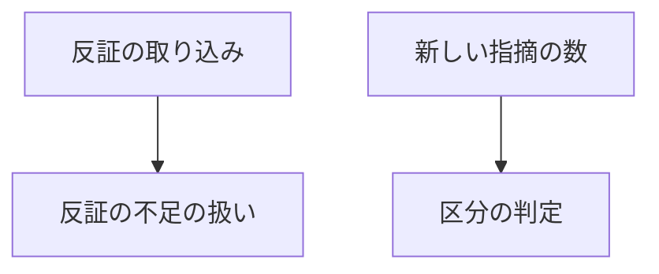
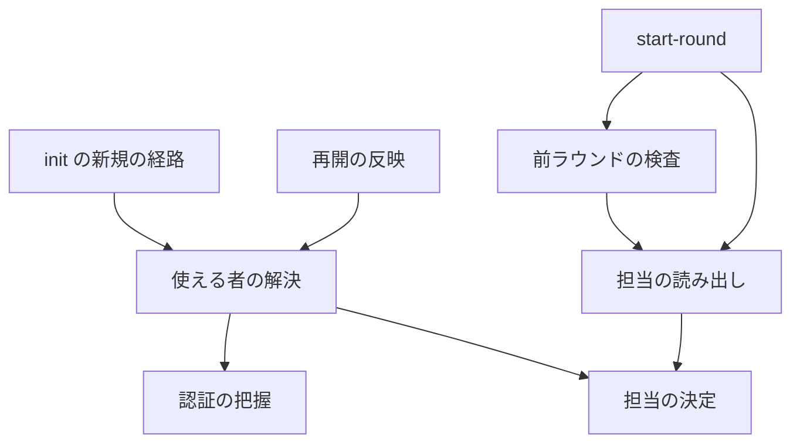
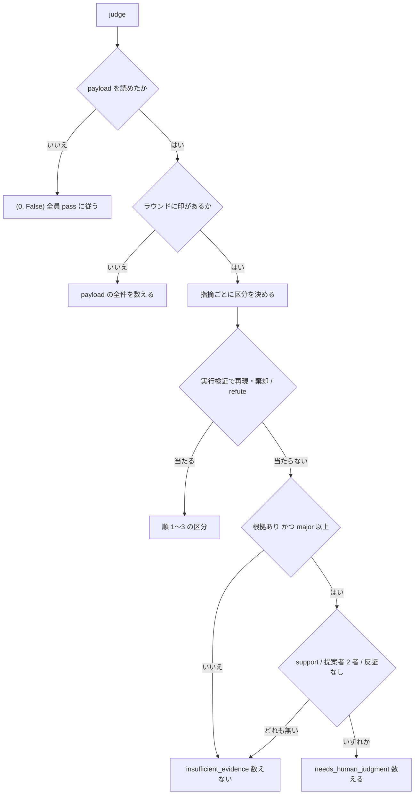
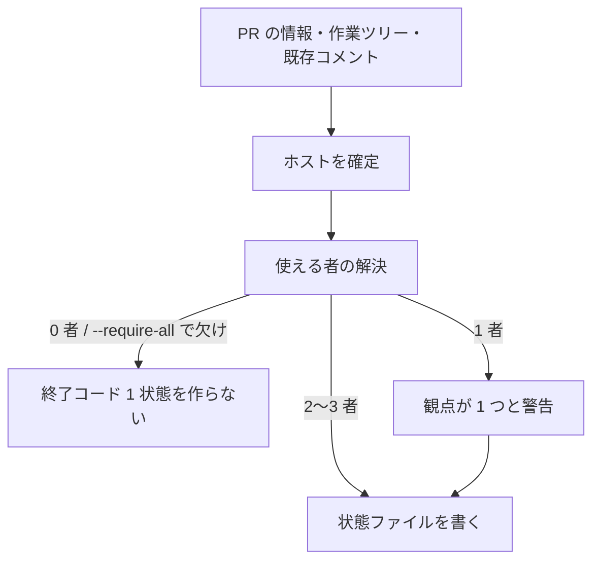
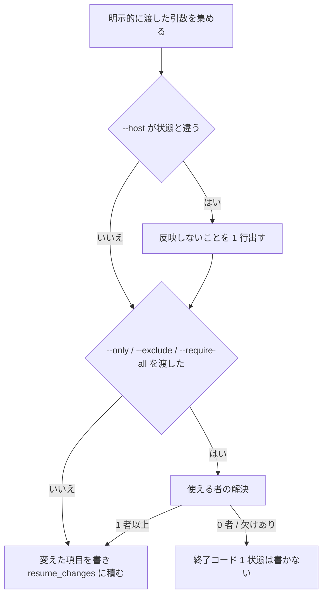

# #624 / #478 / #648: 反証する担当がいない指摘を数え、使える担当だけで回し、再開で引数を反映する

要求と受け入れ条件は [issue-624-478-648-requirements.md](issue-624-478-648-requirements.md) にある。この文書は
「どう作るか」だけを扱う。

**実装は 2 本の Pull Request に分ける**（決定 1）。

| Pull Request | 課題 | 中身 | 受け入れ条件 |
| --- | --- | --- | --- |
| P4 | #624、#583 の収束の部分 | 反証を受けていない単独の指摘を数える。反証が揃わない取り込みで印を外す | AC1〜AC9、AC31、AC32 |
| P5 | #478、#648 | 使える者の一覧と `--exclude`。再開で明示的に渡した引数を反映する | AC10〜AC32 |

全体の実装順は P1 → P2 → P3（いずれも D-A）→ P4 → P5 である。P4 / P5 は P1〜P3 が入った `state.py` の上に載せる。

## 機能一覧

| # | 機能 | 誰が使うか | Pull Request |
| --- | --- | --- | --- |
| F1 | 反証する担当がいない根拠付きの `major` を、新しい指摘として数える | 1 者で回す利用者、担当が起動し直されたループ | P4 |
| F2 | 反証が揃わなかったラウンドを、全件を数える扱いへ戻す | 収束ループ全般 | P4 |
| F3 | 認証できない担当を外し、使える者でループを始める | CLI の一部が導入・認証されていない利用者 | P5 |
| F4 | `--exclude` で担当を名指しで外す | 打ち切り・利用上限が分かっている担当を避けたい利用者 | P5 |
| F5 | 使える者の数に応じて担当を決める（3 者は輪番、2 者は固定、1 者は警告） | 収束ループ全般 | P5 |
| F6 | 再開で `--max-rounds` などの明示した引数を反映し、反映しない引数を知らせる | 中断したループを進め方を変えて再開する利用者 | P5 |
| F7 | 完了報告に、参加した者・外した者・認証を通らなかった者（理由つき）・再開で変えた値を出す | 収束の結果を読む人 | P5 |

## 決定の記録

決定 1 は分け方、決定 2〜5 は P4 の数え方、決定 6〜12 は P5 の担当の決め方、決定 13〜19 は P5 の再開と骨組みを扱う。

### 決定 1: P4（#624 と #583 の収束の部分）と P5（#478 と #648）に分け、P4 を先に出す

#478 は使える者が 1 者のときに 1 者で回す分岐を入れる。#624 を直さないまま入れると、その分岐が必ず誤った収束を
踏む。P4 は担当の決め方に依存しないため、先に単独で出せる。#478 と #648 は同じ引数（`--exclude` / `--only`）の
再開での扱いを一緒に決める必要があり、1 本にまとめる。

3 本に分ける形は採らない。#648 だけを先に出すと、`--exclude` を足したときに再開の規則をもう一度書き換える。

### 決定 2: 数えない判断は「反証を受けた単独の指摘」だけに掛け、判定は指摘の記録から導く

区分 4 の `support` の条件は「別の担当が独立に確かめたか」を問う。**問えるのは、別の担当が反証を返した指摘だけ
である。** 反証を 1 件も受けていない単独の指摘とは、`critiques` が空で `origin_runtimes` が 1 者の指摘である。担当 1 者のラウンドと、
反証を取り込んだ後に取り込まれた指摘（#583）に現れる。**状態ファイルに項目を足さない。** 取り込み
（`_collect_review_findings`）は、同じ担当の指摘を新しい要素で置き換える。起動し直した担当の指摘は、必ず反証を
持たない状態で入る。`collect-critiques` は、全対象の反証が揃ったときだけ印を付ける。
そのため印の付いた 2 者のラウンドでは、単独の指摘はすべて反証を持つ（再現 C）。

採らない案と理由:

- **反証が 0 件のラウンドは絞り込まない（issue の候補 1）。** ラウンド単位では、2 者のうち 1 件だけが後から入った
  #583 の形を塞げない
- **担当 1 者なら intent に従う（候補 2）。** 1 者の分岐だけを塞ぎ、2 者の起動し直しの経路が残る
- **指摘へ「反証の対象になった」印を書く（候補 3 の字面どおり）。** 書く経路（取り込み・起動し直し・統合）ごとに
  付け忘れが起き、旧い状態ファイルには印が無い。記録から導けば経路に依存しない

### 決定 3: 反証を受けていない単独の指摘は、区分 4 の `support` の条件だけを外す

外すのは担当の構造上満たせない条件だけにする。根拠（`has_evidence`）と重大度（`major` 以上）の条件は残す。
**同じ指摘の扱いが担当の数で変わらない。** 2 者のラウンドで数えない `minor` は、1 者のラウンドでも数えない。
区分の順 1〜3（実行検証の再現・棄却、`refute`）はそのまま先に当たる。

```text
順 4: has_evidence かつ major 以上 かつ（support が 1 件以上 / origin_runtimes が 2 者以上 / critiques が空）
```

`critiques` が空で `origin_runtimes` が 2 者以上の指摘は、元の条件（2 者以上）で既に当たる。そのため条件は
「`critiques` が空」だけを足せば足りる。**2 者の通常のラウンドの判定は変わらない**（決定 3・5 を当てた試作で既存の cross-review の
テスト 773 件が期待値を変えずに通った。落ちた 1 件は複製先が git の作業ツリーでないことによる）。

採らない案: **反証を受けていない指摘は全件（`minor` 以下も）数える。** 1 者で回すと `minor` だけの
`REQUEST_CHANGES` でもラウンドが続き、2 者のときと収束の基準が食い違う。1 者でも intent が pass
（`APPROVE` / 重大な指摘の無い `COMMENT`）なら `round_passes` で収束する。この案の利点は `minor` を
数えることだけになる。

### 決定 4: 区分の名前を増やさない

決定 3 で数える指摘は `needs_human_judgment` に入れる。修正の担当が読む意味（根拠を持つ `major`、判断は修正の担当）
は同じである。名前を足すと、`COUNTED_CLASSIFICATIONS` を持つ `state.py` と `measure.py` の 2 か所と、
`docs/04` / `docs/06` の語彙を揃えて変えることになる。反証を受けていないことは `critiques` が空であることで
後から読める。

### 決定 5: 反証が揃わない取り込みでは、先に付いていた印を外す

`collect-critiques` は揃わないとき印を付けないが、**既に付いている印は外さない**。
再現 B2 では、取り直しの後も `evidence_rounds` が `[1]` のままだった。そのとき「印を付けないため、このラウンドは全件を数えます」の出力と実際の
数え方が食い違う。`_handle_incomplete_critiques` の先頭でそのラウンドの番号を `evidence_rounds` から除く。
**印は「直近の取り込みで揃ったか」を表す。** 起動し直しの後に反証を取り直す経路（D-A の P3）でも、揃えば印が戻り、
揃わなければ全件を数える。

採らない案: 決定 3 だけで足りるとして印を残す。出力の文言と `docs/06` の契約（揃わなければ全件）が偽のまま残る。

### 決定 6: 認証の確認を関門から把握へ変え、使える者を状態ファイルに持つ

`init` は母集合から外した者を除いた全員を確かめる。通った者は `available_reviewers` へ、通らなかった者は理由とともに
`unavailable_reviewers` へ書く。**再開のたびに確かめ直さない**（決定 15 の場合を除く）。途中で担当が
入れ替わると、前のラウンドの記録と突き合わせられなくなる。

共通層 `lib/auth.py` に止めない確認 `probe_auth` を足す。`check_auth` は `cross-refactoring` が使うため、
振る舞い（1 件でも失敗すれば `die` を呼ぶ）を変えない（決定 10）。

採らない案: 起動の直前にラウンドごとに確かめる。ラウンドごとに最大 3 回の確認（1 回あたり上限 120 秒）が増える。

### 決定 7: 外す指定は `--exclude`（繰り返し・カンマ区切り）にする

外したい理由は「この担当が落ちる」であり、名指しするのは外す側である。`--exclude agy` と `--exclude agy,kiro` と
`--exclude agy --exclude kiro` を同じ意味にする。骨組みのシェル変数 1 つ（`${EXCLUDE:+--exclude "$EXCLUDE"}`）で
複数を渡せる。母集合の外（ホスト自身）は `init` が弾く（`--only` と同じ扱い）。

採らない案: 使う側を並べる `--reviewers codex,kiro`。ホストが変わると一覧を書き直す必要があり、#478 の提案の
形とも違う。

### 決定 8: 使える者の数で分け、`review_assign` は使える者の一覧を受け取る

```python
def review_assign(round_no: int, available: Sequence[str]) -> list[str]:
    # 3 者以上: (round_no - 1) % len を外す / 1〜2 者: そのまま / 0 者: AssignmentError
```

**3 者の結果は変わらない。** 試作で 4 つのホストとラウンド 1〜12 の全組を比べた。`review_assign(r, review_pool(host))` は
変更前の `review_assign(r, host)` とすべて一致した。2 者は毎ラウンド同じ 2 者になり、#631 の「1 者も見ていない
担当がいる」状態が起きない。1 者は `init` が警告して回し、P4 の規則で数える。0 者は `init` が失敗し、状態ファイルを
作らない。

採らない案: 使える者が 2 者のときも輪番で 1 者を外す。毎ラウンド 1 者だけのレビューになり、観点が減る。

### 決定 9: `--require-all` で従来の関門を選べるようにする

全員が揃わないなら始めたくない運用（リリース前の最終レビューなど）のために残す。付けると、認証を通らない者が
1 者でもいれば従来の文言で失敗する。`--exclude` で外した者は揃っていなくてよい（外すことを明示しているため）。
再開で `--no-require-all` を渡せるよう `BooleanOptionalAction` にし、既定は `None` とする（決定 13）。

### 決定 10: `cross-refactoring` には除外の引数を足さず、`assign()` と `check_auth()` を変えない

`cross-refactoring` の `assign()` は実装担当を先に決めてから残りを選ぶ。使える者が 2 者のとき、実装担当を外すと
レビュー担当が 1 者になる。#478 のコメントは「著者を含めて回し、著者の `APPROVE` を収束に数えない」形を提案している。
この形は判定とプロンプトに及び、D-C の範囲（`refactor_lib` の適用の骨組み）と重なる。この変更では共通層の `assign()` と
`check_auth()` の振る舞いを保ち、`cross-refactoring` の除外は別の課題へ切り出す（#664）。

採らない案: `cross-refactoring` の `init`（`refactor_lib/commands/setup.py`）に除外だけを足す。提案者と実装の
母集合は減らせても、レビュー担当が 1 者になる形が残る。

### 決定 11: `--only` は使える者を 1 者に絞る指定として扱う

`--only X` のとき使える者は `[X]` で、認証を確かめるのも `X` だけである（現行の `_auth_targets` と同じ）。
`X` が `--exclude` に含まれるときは矛盾として `init` が弾く。状態ファイルの `only` は残す（`_agent_intent` の
`SKIP` と旧い状態ファイルが読むため）。

### 決定 12: 担当の決め方をラウンドの記録から先に見る順へ変え、前ラウンドの検査も記録の担当を読む

```text
ラウンドの reviewers → only → available_reviewers の輪番 → host の輪番（review_pool）→ codex / agy
```

現行は `only` をラウンドの記録より先に見る。再開で `only` を変えられるようにすると（決定 13）、過去のラウンドの
担当まで変わる。`_finding_keys` は前のラウンドの指摘を別の担当の payload から読むことになる。`start-round` はラウンドを開く
ときに `_round_reviewers` の結果を記録する。新しい状態ファイルでは、順を変えても結果は同じである。

`_guard_previous_round` も同じ理由で `prev["reviewers"]` を渡す。現行は担当を渡さず、旧来の `codex` / `agy` で数える。
担当が `agy` + `kiro` のラウンドでは `codex` を結果なしと読み、修正の記録が無いまま次のラウンドへ通す（再現 I）。

### 決定 13: 引数の既定値を `None` にし、明示的に渡した引数だけを再開で反映する

`build_parser` の 8 つの引数の既定を `None` にする。対象は `--max-rounds` / `--rotate-after` / `--only` / `--host` /
`--verify-command` / `--verify-exit-code` / `--exclude` / `--require-all` である。新規の経路は `None` を定数の既定（`DEFAULT_MAX_ROUNDS = 12` /
`DEFAULT_ROTATE_AFTER = 8`）へ置き換える。再開の経路は `None` でない引数だけを状態ファイルへ書き、変えた項目ごとに
`<項目>: <旧> → <新>` を 1 行出す。`--verify-command` と `--verify-exit-code` は置き換える。

採らない案: 既定値と同じ値なら渡していないとみなす。`--max-rounds 12` で 20 から 12 へ戻したい指定を区別できない。
再現 G では `init 1` と `init 1 --max-rounds 12` がどちらも 12 になった。

### 決定 14: `--host` は再開で反映せず、違う値のときだけ知らせる

ホストが変わると母集合が変わり、過去のラウンドの輪番を再現できない。状態ファイルと違う値が渡されたら
「`--host` は再開では反映しない（状態: claude、指定: codex）」を 1 行出す。同じ値なら出さない。
`--worktree` は状態ファイルを探す場所の指定であり、反映の対象ではない。

### 決定 15: 担当に関わる引数を渡した再開でだけ、認証を確かめ直して使える者を作り直す

`--only` / `--exclude` / `--require-all` のいずれかを渡した再開では、決定 6 と同じ手順で使える者を作り直す。
対象は母集合から外した者を除いた全員（`--only` があればその 1 者）である。**いずれも渡さない再開では確かめ直さない。**
作り直した結果が 0 者、または `--require-all` で欠けがあるときは、状態ファイルを書き換えずに終了コード 1 で終わる。

採らない案: 新しく加わる者だけを確かめる。前回に認証を通らなかった者がログインした後も戻れない。

反映は再開の後に開くラウンドから効く。骨組みは `init` の直後に必ず `start-round` を呼び、`start-round` は常に
新しい番号のラウンドを開く。そのため、開いたまま中断したラウンドの担当は書き換えない（要求の前提 3）。

### 決定 16: 再開で指定を外す値は `none` にする

`--only none` は `only` を `null` へ、`--exclude none` は除外を空へ戻す。空文字列は骨組みの
`${ONLY:+--only "$ONLY"}` が渡さないため、外す手段にならない。新規の経路で `none` を渡すと、渡さないのと同じになる。

### 決定 17: 再開で変えた値は `resume_changes` に積む

`available_reviewers` や `max_rounds` は再開で上書きされる。上書きだけでは、どの時点で何を変えたかが失われ、
完了報告で「途中から agy を外した」ことが読めない。変えた項目を `{"at", "field", "from", "to"}` の形で
追記し、書き換えない（事象の記録）。ラウンドごとの担当は `rounds[].reviewers` が既に持つ。

### 決定 18: 骨組みは `$ONLY` で絞らず、`start-round` が返す担当を使う

`start-round` の `REVIEWERS` は `only` を反映済みである。シェル変数の `$ONLY` でもう一度絞ると、状態ファイルと
シェル変数がずれたときに起動も監視も誰にも当たらない。そのうえ起動し直しの分岐だけが担当を起動する（#648 の 3 段の経過）。
`SKILL.md` と `docs/01` の 2 か所で、担当を `$REVIEWERS` / `$REVIEWERS_CSV` に揃える。
対象は Step 2 の起動・監視・取り込みと、Step 2.5 の反証である。`$ONLY` は `init` へ渡す 1 行にだけ残す。

### 決定 19: 起動した後に分かる使えなさで、担当を自動的に外す仕組みは作らない

利用上限（kiro の `Monthly request limit reached`）やモデルの 404 は、起動した後に分かる。
認証の確認は通る（#478 のコメント）。分類は D-A の #619 が `usage_limit` などとして作る。自動で外すと、一時的な打ち切りでも以後の
ラウンドから恒久的に外れる。この変更は利用者が `--exclude` で外し、再開で反映できる入口までを作る。

## 実測

**再現は、状態ファイルを最小の形で組んで `state.py` の関数を直接呼んで確かめた**（develop `b4a9f69`）。

| 場面 | 状態 | 変更前 | 決定 3・5 の試作 |
| --- | --- | --- | --- |
| A（#624） | 担当 `codex` 1 者、印あり、根拠付き `major` 1 件、反証なし | `(0, True)`、収束 | `(1, True)`、収束しない |
| B（#583） | 担当 `agy` + `kiro`、印あり、`agy` の根拠付き `major` が反証なし | `(0, True)`、収束 | `(1, True)`、収束しない |
| B2 | B の後に `collect-critiques`、`kiro` の反証が `agy` の指摘を覆わない | 終了コード 7、印 `[1]` のまま | 終了コード 7、印 `[]`、全件を数える |
| C | 2 者、相手が `insufficient_evidence` | `(0, True)`、収束 | 変わらない |
| D | `origin_runtimes` 2 者の `minor`、反証なし | `(0, True)`、収束 | 変わらない |
| A の `minor` / 根拠なし | A の指摘を `minor` / `has_evidence: false` にする | `(0, True)` | 変わらない（決定 3） |

P5 の前提:

| 場面 | 結果 |
| --- | --- |
| F（担当の優先） | `only: "codex"` の状態で、記録が `agy` + `kiro` のラウンド 1 を `_round_reviewers` が `["codex"]` と返す |
| G（#648） | `init 1` と `init 1 --max-rounds 12` はどちらも `max_rounds == 12`。再開の `init` に `--only codex --max-rounds 20 --verify-command pytest --host codex` を渡すと、状態ファイルは `only: null` / `max_rounds: 12` / `host: claude` / `verify_commands: []` のまま、出力にも出ない |
| H（#478） | `check_auth` は 3 者のうち 1 者の失敗で `die` を呼ぶ。`review_assign(r, "claude")` はラウンド 1〜3 で 3 者から 1 者ずつ外す |
| I（前ラウンドの検査） | 担当 `agy` + `kiro`・両者 `REQUEST_CHANGES`・`verdict` なし・修正の記録なしのラウンドを、`_no_result_agents(prev, None)` が `["codex"]` と読み、検査を通す |
| 引数の形 | `action="append"` とカンマ区切りの型で、`--exclude agy --exclude kiro` と `--exclude agy,kiro` が同じ集合になる。知らない名前は argparse が終了コード 2 で弾く |

## 構成要素

| 要素 | 責務 | Pull Request |
| --- | --- | --- |
| 区分の判定（`_classify_finding`） | 順 4 の条件に「反証を受けていない」を足す（決定 3） | P4 |
| 反証の不足の扱い（`_handle_incomplete_critiques`） | そのラウンドの印を外してから、取り直す担当を返す（決定 5） | P4 |
| 担当の決定（`lib/assignment.py`） | 母集合から外した者を除く一覧を返す。使える者の一覧から担当を選ぶ（決定 7・8） | P5 |
| 認証の把握（`lib/auth.py`） | 止めずに確かめ、担当ごとの結果を返す（決定 6） | P5 |
| 使える者の解決（`state.py` の新しい関数） | 母集合・`--only`・`--exclude`・認証・`--require-all` から、使える者と外した者を決める。新規と再開の両方が呼ぶ | P5 |
| 再開の反映（`_resume_from_state`） | 明示的に渡した引数を状態ファイルへ書き、`resume_changes` に積み、反映しない引数を知らせる（決定 13〜17） | P5 |
| 担当の読み出し（`_round_reviewers` / `_guard_previous_round`） | ラウンドの記録を先に見る（決定 12） | P5 |
| 完了報告（`cmd_report`） | 使える者・外した者・認証を通らなかった者・再開で変えた値を出す | P5 |
| 骨組みと文書（`SKILL.md` / `docs/01` / `docs/04` / `docs/05` / `docs/06`） | `$ONLY` で絞らない。引数・状態ファイル・区分の規則を書く | P4 / P5 |

P4 の要素（判定）:



P5 の要素（初期化とラウンド）:



図の辺は呼び出しを表す。`init` の新規の経路・`start-round`・反証の取り込み・新しい指摘の数は、変える要素の呼び出し元として
置いた既存の要素である。完了報告は状態ファイルを読むだけで他の要素を呼ばないため、骨組みと文書とともに図に含めない。

**文脈と配置は変わらない。** 動くのは、ホストの CLI から起動される `state.py` の 1 プロセスである。
外部との出入りは `gh`（GitHub）と、各 CLI の認証の確認コマンドだけである。認証の確認の呼び出し先（`AUTH_PROBES`）は変えない。

## 置き場所

```text
plugins/ndf/
├── scripts/lib/
│   ├── assignment.py        # P5: review_candidates を新設、review_assign の引数を変更
│   └── auth.py              # P5: probe_auth を新設（check_auth は変えない）
└── skills/
    ├── cross-review/
    │   ├── SKILL.md         # P5
    │   ├── docs/01-state-and-review.md   # P5
    │   ├── docs/04-contracts.md          # P5
    │   ├── docs/05-pool-and-convergence.md  # P4 / P5
    │   ├── docs/06-evidence.md           # P4
    │   ├── scripts/state.py              # P4 / P5
    │   └── tests/           # P4: test_classify_findings.py / test_critiques.py に追記
    │                        # P5: test_state_review_pool.py に追記、test_state_resume_args.py を新設
    └── cross-refactoring/tests/test_assignment.py   # P5: review_assign の呼び方を変え、AC15・AC16 のテストを足す
```

`dev.kiro` / `dev.agy` は `skills/` を symlink で参照するため、書き写す配布物は無い。
`bash scripts/build-runtime-plugins.sh --check` で食い違いが無いことだけを確かめる。

状態ファイルの形・引数・関数の契約は [issue-624-478-648-contracts.md](issue-624-478-648-contracts.md) にある。

## 処理の流れ

### 新しい指摘の数え方（P4）



反証の取り込みで揃わないとき、`_handle_incomplete_critiques` がそのラウンドの印を外す。次に `judge` が数えるとき
「印があるか」が「いいえ」へ進む。取り直して揃えば `_mark_evidence_round` が印を戻す。

### 初期化と再開（P5）

新規の経路:



再開の経路（状態ファイルがあり `final` が `null`）:



使える者の解決は次の順で決める。

1. `--only` があれば母集合に含まれるかを確かめ、`--exclude` に含まれていれば弾く。対象は `[only]`
2. `--only` が無ければ、`--exclude` の各名前が母集合に含まれるかを確かめ、対象は母集合から除いた者
3. 対象の認証を `probe_auth` で確かめる。`NDF_SKIP_AUTH_CHECK` が立っていれば全員を通ったものとする
4. `--require-all` が真で通らない者がいれば、従来の文言で終了コード 1
5. 通った者が 0 者なら終了コード 1。1 者なら警告を 1 行出す

## 非機能の実現方式

| 大項目 | 要求の条件 | 実現方式 | 確かめ方 |
| --- | --- | --- | --- |
| 可用性 | 母集合の 1 者が使えないことで、収束ループを開始できない状態にならない | 認証の失敗を `unavailable_reviewers` へ記録し、使える者で続ける（決定 6） | AC10 のテスト |
| 性能・拡張性 | 認証の確認の回数は、新規の `init` で変更前を上回らない。再開で増えるのは担当に関わる引数を渡したときだけで、母集合の最大 3 者である | `--exclude` で外した者は確かめない。再開は決定 15 の条件でだけ確かめる | AC13・AC26 のテストで `probe_auth` の呼び出しを数える |
| 運用・保守性 | 担当が欠けたまま収束したことが `report` の出力だけで分かる。再開で反映しなかった引数が出力に出る | `report` が 3 つの一覧と `resume_changes` を出す。`--host` の不一致を 1 行出す | AC21・AC27 のテスト |

## 申し送り（並行する設計との境界）

| 相手 | 決めた契約 |
| --- | --- |
| D-A（P1〜P3） | **P4 の規則は、起動し直しの経路が証拠集約を通るかどうかに依存しない。** 通らなければ決定 3 が数え、通って反証が揃わなければ決定 5 が全件へ戻す。D-A が起動し直しの後に `critique-round.sh` を呼ぶときは、担当を `$REVIEWERS`（そのラウンドの担当）で渡し、`$ONLY` を使わない（決定 18） |
| D-A（P1〜P3） | `SKILL.md` の骨組みで D-B が触るのは Step 0 の `init` の引数、Step 2 の起動・監視・取り込みの 3 つのループ、Step 2.5 の `critique-round.sh` の引数である。Step 3 の `JUDGE_RC -eq 7` の分岐は D-A が持つ。P5 は P3 の後に載せるため、衝突は P5 の側で解く |
| D-A（P1〜P3） | `_no_result_agents` と `_handle_no_result_round` の中身（`NO_RESULT` の理由）は D-A が持つ。P5 は `_guard_previous_round` から呼ぶときに担当の一覧を渡すだけにする |
| D-A（#619） | 利用上限などの分類を、担当を外す判断へつなぐのは後続に回す（決定 19）。つなぐ場合の入口は再開の `--exclude` である |
| D-C | `refactor_lib` に触らない。共通層の `assign()` と `check_auth()` の振る舞いを変えない（決定 10）。`review_assign` のテストは共通層のテストの置き場所 `cross-refactoring/tests/test_assignment.py` にある。P5 はそこで既存の呼び出しを直し、AC15・AC16 のテストを足す。`refactor_lib` は `review_assign` を呼ばない |

**D-A の決定に依存する点:**

- P3 が起動し直しの後に `verify-findings` と `critique-round.sh` を通す形を採るか。どちらでも P4 は成り立つ。
  変わるのは、#583 の起動し直しの指摘を `needs_human_judgment` として数えるか、全件として数えるかである
- P1 が `monitor.py` の結果をファイルに残す形と、`SKILL.md` の Step 2 の監視の行の書き方。P5 の `$ONLY` の削除と同じ行を触る
- P3 が `state.py` の `_resume_from_state` か `cmd_init` に手を入れるか。P5 は `_resume_from_state` の引数を増やす

## テスト設計

置き場所は、`cross-refactoring/` で始まるもの以外は `plugins/ndf/skills/cross-review/tests/` の下である。
`cross-refactoring/` で始まるものは `plugins/ndf/skills/` の下にある。

| 受け入れ条件 | 何で確かめるか | 置き場所 |
| --- | --- | --- |
| AC1〜AC4 | 状態ファイルを組み、`_new_finding_count` と `cmd_judge` の終了コードを見る（実測の A / B と、A の `minor` / 根拠なし） | `test_classify_findings.py` |
| AC5 | 印の付いた状態で `cmd_collect_critiques` を 2 回呼び、`evidence_rounds` と数え方を見る（実測の B2） | `test_critiques.py` |
| AC6・AC7 | `_classify_finding` に反証の値ごと・`origin_runtimes` 2 者の指摘を渡す | `test_classify_findings.py` |
| AC8 | 既存のテストを期待値を変えずに通す | 既存のまま |
| AC9 | `grep` の行を検査するテスト | `test_skill_layout.py` |
| AC10〜AC14 | `probe_auth` を差し替えて `_init_new_state` を呼ぶ（GitHub を呼ぶ関数は `conftest.py` の既存の差し替え）。状態ファイルの有無と終了コードを見る | `test_state_review_pool.py` |
| AC15・AC16 | `review_assign` を 4 ホスト × 12 ラウンドと 2 者の一覧で呼ぶ。AC15 は変更前の式を期待値として持つ | `cross-refactoring/tests/test_assignment.py` |
| AC17・AC18 | 使える者 1 者・0 者の `init` | `test_state_review_pool.py` |
| AC19 | `available_reviewers` を持たない状態 / `host` も持たない状態で `_round_reviewers` | `test_state_review_pool.py` |
| AC20 | 既存の `assign` の期待値と、`check_auth` の失敗で `die` が呼ばれるテスト | `cross-refactoring/tests/test_assignment.py` / `cross-refactoring/tests/test_init.py` |
| AC21 | 3 つの一覧と `resume_changes` を持つ状態ファイルで `cmd_report` の出力の 4 行を見る | `test_state_review_pool.py` |
| AC22〜AC27 | 状態ファイルを置いた作業ツリーを渡して `cmd_init` を呼び、状態ファイルと標準エラーを見る（実測の G） | `test_state_resume_args.py`（新設） |
| AC28 | 2 ファイルの `ONLY` を含む行を数えるテスト | `test_skill_layout.py` |
| AC29 | `verdict` の無い前ラウンドで `cmd_start_round` の終了コード 5 を見る（実測の I） | `test_state_round_guard.py` |
| AC30 | 文書の語を `grep` するテスト | `test_skill_layout.py` |
| AC31・AC32 | コマンドの終了コード | 継続的統合と手元 |

## 未確認のまま残ること

| 項目 | 内容 | いつ決まるか |
| --- | --- | --- |
| 1 者で回したときの収束までのラウンド数 | 決定 3 で `minor` と根拠の無い `major` を数えないため、1 者のループが早く収束しすぎないかは実測していない | P4 の後の運用で `measure.py` の出力を見る |
| 2 者固定（`codex` + `kiro`）の観点の偏り | `agy` を外して 2 者を固定したとき、3 者の輪番より指摘を見落とすかは測っていない | P5 の後の運用 |
| `cross-refactoring` の除外と、著者を含めて回す規則 | 決定 10 で切り出す。レビュー担当が 1 者になる形をどう扱うかは未決 | #664 |
| 起動した後に分かる使えなさで外す仕組み | 決定 19 で作らない。自動で外すか、利用者へ再開を促すかは未決 | D-A の #619 の後 |
| 再開で `--verify-command` を空へ戻す手段 | 持たない。要求が出たら `none` と同じ形で足せる | 要求が出たとき |
| 出力の文言 | 反映した行・反映しない行・警告の文言は、項目名と値を含むことだけを決めた | **実装で決める** |
| テストの置き場所 | テスト設計の表の置き場所は既存ファイルに合わせた目安である | **実装で決める** |
