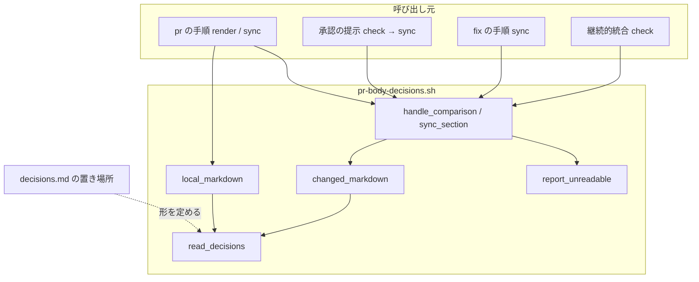
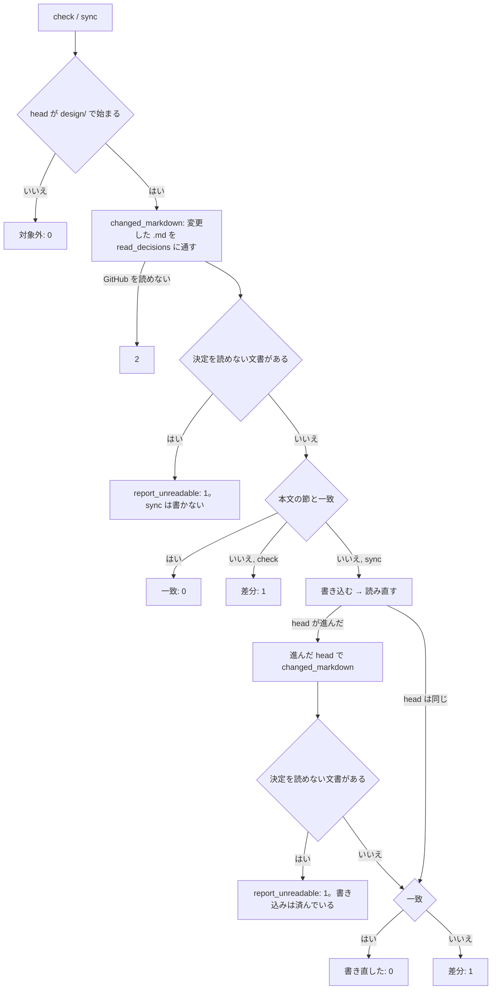
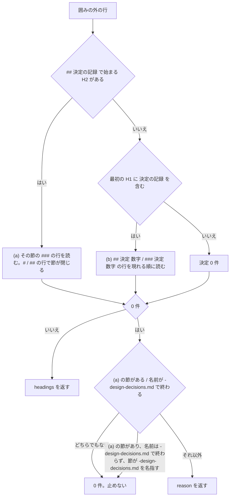

# pr-body-decisions.sh: 見出しが雛形から外れた設計文書の決定が 0 件の一致として通り、本文の「決めたこと」が消える → 接尾辞付きの節と分けたファイルの決定を読み、読めない文書があれば場所を示して止まる（#635）

## 目的

- **何が壊れているか**: `pr-body-decisions.sh` が 2 つの形の決定を読まない。`## 決定の記録（#610）` のような接尾辞付きの節と、`# #1482: 決定の記録` の下に `## 決定 N:` を置いた分けたファイルである。`sync` は本文の「決めたこと」の節を消し、`check` は「一致: 設計文書 0 本 / 決定 0 件」で 0 を返す
- **誰が困るか**: 設計 PR を承認する人。継続的統合の `PR body decisions / check` と承認資料の「本文との一致」が「一致」と出る。そのため決定が本文に無いまま承認する（PR #1431・#1514・#1838 で起きた）
- **直すと何が成り立つか**: develop の形の決定はすべて本文へ載る。決定の節を持つのに決定を読めない文書があれば、`check` と `sync` がそのファイルと理由を出して 1 で止まる

## 適用範囲

- **働く範囲**: 配布先のリポジトリでも働く（`pr-body-decisions.sh` は NDF の配布物で、`pr` / `fix` / 承認の提示 / 継続的統合から呼ばれる）
- **プロジェクトごとに違うもの**: 無し（見出しの形は NDF の設計の雛形が決め、プロジェクトごとに変えない）
- **当たるモード**: `standard` と `legacy-refactor`（設計 PR を出すモード。head が `design/` で始まる PR だけを読む今の判定を変えない）

## あるべき姿の根拠

| 根拠 | 種類 | 何を示すか |
| --- | --- | --- |
| develop（da69b93c0）の `issues/*-design-decisions.md` 20 本に試作の読み方を当てると、20 本すべてで決定が 1 件以上読める（下の表） | 実測 | 前提 1 の 3 つの形で、今ある分けたファイルを書き直さずに読める |
| 同じ試作で、今の読み方から件数が増えるのは 7 本（分けたファイル 6 本が 0 → 10〜25 件、`issues/old/design-refactoring-methodology.md` が 0 → 12 件）。決定を読む文書は全体で 83 本 → 90 本 | 実測 | 減る文書が無く、変わるのは今 0 件の文書だけである |
| 同じ試作で、要求の前提 2 の文面どおりに止めると、追跡している `.md` のうち 11 本が止まる。11 本はどれも分けた設計の頭のファイル（`issues/issue-1370-design.md` など）で、`## 決定の記録` の節は分けたファイルの名前を示す 1 文だけを持つ | 実測 | 文面どおりでは、分けた形の設計 PR が継続的統合で落ちる。決定 4 で参照だけの節を止める対象から外す |
| PR #634 の最初の head・PR #1431・PR #1514・PR #1838 で、決定があるのに「設計文書 0 本 / 決定 0 件」で通った | 利用者の指示の原文（課題 #635 の経緯） | 0 件の一致を黙って通さないことが要る |

分けたファイル 20 本の件数（試作の読み方。前提 1 の形は (a) が `## 決定の記録` の節、(b) が H1 の下の `## 決定 N` / `### 決定 N`）:

| ファイル | 形 | 件数 |
| --- | --- | --- |
| `issue-1142` | (b) `### 決定 N` | 25 |
| `issue-1333` | (a) | 17 |
| `issue-1334` | (a) | 15 |
| `issue-1336` | (a) | 13 |
| `issue-1337` | (a) | 12 |
| `issue-1366` | (a) | 20 |
| `issue-1370` | (b) `## 決定 N` | 11 |
| `issue-1389` | (a) | 14 |
| `issue-1407` | (a)（H1 にも「決定の記録」を含む） | 12 |
| `issue-1429` | (b) `## 決定 N`（`決定 0b` を含む） | 25 |
| `issue-1454` | (a) | 9 |
| `issue-1457` | (a) | 7 |
| `issue-1468` | (a) | 14 |
| `issue-1482` | (b) `## 決定 N` | 10 |
| `issue-1560` | (b) `## 決定 N` | 10 |
| `issue-1576` | (a) | 21 |
| `issue-1587` | (b) `## 決定 N` | 10 |
| `issue-1597` | (a) | 17 |
| `issue-821-wait-notify` | (a) | 12 |
| `issue-954` | (a) | 12 |

（ファイル名は `issues/<ファイル>-design-decisions.md` の略。(a) が 14 本、(b) が 6 本）

要求と受け入れ条件は #635 の本文にある（コピーは `issues/issue-635-requirements.md`）。この文書は「どう作るか」だけを扱う。

## ドメインモデル

### コンテキスト

| コンテキスト | 何の語が 1 つの意味に決まるか |
| --- | --- |
| `ndf-workflow` | 設計 PR・設計文書・決定の記録・決めたことの節 |

1 つのコンテキストに収まる。

### 集約

| 集約 | 持ち主（書き換えてよいもの） | 根 | エンティティ | 値オブジェクト |
| --- | --- | --- | --- | --- |
| 設計 PR の本文の「決めたこと」の節 | `pr-body-decisions.sh` の `sync` と `render`（`check` は読むだけ） | 節（`## 決めたこと`） | — | 決定の見出し・決定を読めない文書（パスと理由の組） |

設計文書は集約の外にある。`pr-body-decisions.sh` は設計文書を読むだけで書き換えない。

### 不変条件

| # | 集約 | 条件 | 破れたときの扱い |
| --- | --- | --- | --- |
| I1 | 決めたことの節 | 節の中身は、変更した `.md` から前提 1 の読み方で読んだ決定の見出しを、パスの順・文書に現れる順に並べたものに等しい（決定が 0 件なら節は無い） | `check` は 1 と差分、`sync` は書き直す（今と同じ） |
| I2 | 決めたことの節 | 決定を読めない文書が変更にある間、`check` は 0 を返さず、`sync` は本文を書き換えない | 1 を返し、文書のパスと理由を標準出力へ出す |
| I3 | 決めたことの節 | 1 つの見出しの行は節に 1 回だけ現れる（(a) と (b) の両方に当たる文書は (a) だけで読む） | — （読み方で防ぐ。テストで縛る） |
| I4 | 決めたことの節 | 囲み（```` ``` ```` / `~~~`）の中の行は、決定の読み取りにも止める判定にも使わない | — （読み方で防ぐ。テストで縛る） |
| I5 | 決めたことの節 | `render` の終了コードは 0 / 2 / 3 だけで、決定を読めない文書があっても止めない | — （テストで縛る） |

### ドメインイベント

| # | イベント | 発生元 | 受け手 |
| --- | --- | --- | --- |
| E1 | 設計 PR の本文を作った（`render`） | `pr` の手順（`supervise_lib/pr.py`） | GitHub の PR 作成 |
| E2 | 設計 PR の head が進んだ | push | E3 を起こす呼び出し元（継続的統合・`pr` / `fix` / 承認の提示） |
| E3 | 変更した `.md` から決定の見出しを読んだ | `check` / `sync` | E4・E5・E6 の判定 |
| E4 | 決定を読めない文書を見つけた | `check` / `sync`（E3 の結果） | 呼び出し元（終了コード 1 と標準出力） |
| E5 | 本文の「決めたこと」の節を書き直した | `sync`（E4 が起きていないとき） | GitHub の PR 本文 |
| E6 | 一致・食い違いを返した | `check` | 呼び出し元（終了コード 0 / 1） |

### 用語

| 用語 | 意味 | 用語集への反映 |
| --- | --- | --- |
| 決定の見出し | 設計文書の囲みの外にある、決定 1 件を表す見出しの行。`## 決定の記録` で始まる H2 の節の `### ` の行か、H1 に「決定の記録」を含み `## 決定の記録` の節を持たない文書の `## 決定 <数字>…` / `### 決定 <数字>…` の行 | 追加（`ndf-workflow`） |
| 決定を分けたファイル | 設計文書から決定の記録の節だけを別に置いたファイル。名前は `issue-<番号>-design-decisions.md` | 追加（`ndf-workflow`） |
| 決定を読めない文書 | 設計 PR で変更した `.md` のうち、`## 決定の記録` で始まる H2 を持つか決定を分けたファイルであるのに、決定の見出しが 0 件のもの。決定を分けたファイルの名前だけを示す節は除く | 追加（`ndf-workflow`） |

## 機能一覧

| # | 機能 | 誰が使うか |
| --- | --- | --- |
| F1 | 接尾辞付きの `## 決定の記録…` の節の決定を本文へ載せる | 設計 PR を作る conductor と承認する人 |
| F2 | 決定を分けたファイル（(b) の形を含む）の決定を本文へ載せる | 同上 |
| F3 | 決定を読めない文書があるとき、`check` と `sync` がパスと理由を出して 1 で止まる | 同上と継続的統合 |
| F4 | 決定を分けたファイルの形を `decisions.md` が 1 つに定める | 設計文書を書く AI と人 |

## 構成要素

| 要素 | 責務 |
| --- | --- |
| `read_decisions`（`pr-body-decisions.sh` の中の Python。`decision_headings` を置き換える） | 1 つの `.md` の名前と中身から、決定の見出しの並びと、決定を読めない理由（無ければ無し）を返す。`check` / `sync` / `render` が共通に使う唯一の読み取り |
| `changed_markdown`（変える） | PR の head の変更した `.md` を `read_decisions` に通し、決定を持つ文書の並びと、決定を読めない文書の並びを返す |
| `local_markdown`（変える） | 手元の HEAD の変更した `.md` を `read_decisions` に通し、決定を持つ文書の並びだけを返す（読めない理由は使わない） |
| `report_unreadable`（足す） | 決定を読めない文書の並びを、止めたときの文言で標準出力へ出す |
| `handle_comparison` / `sync_section`（変える） | 突き合わせの前に決定を読めない文書の有無を見て、あれば `report_unreadable` を呼び 1 を返す。`sync` は書き込まない |
| `test_pr_body_decisions.py`（変える） | 受け入れのテストを足し、`test_4_empty_decisions_without_subheadings_is_treated_as_zero_decisions` の期待を「止める」へ書き換える |
| `plugins/ndf/skills/design/references/decisions.md` の「置き場所」（変える） | 決定を分けたファイルの形と、頭のファイルの `## 決定の記録` の節に書く 1 文を定める |



図に描かないもの: `test_pr_body_decisions.py`（偽の `gh` で呼び出し元の位置から `check` / `sync` / `render` を起動する）。

**終了コード 1 の意味を読む呼び出し元は変えない。** 1 に「決定を読めない文書がある」を足すため、1 を前提にした
既存の規則を新しい場合に当てはめた。

| 呼び出し元の規則 | 決定を読めない文書のとき | 判定 |
| --- | --- | --- |
| `lib/design_body.py` が 1 を `mismatch` と名付け、標準出力の先頭 300 文字を理由に添える | 止めた文言が理由として呼び出し元へ届く | 当てはまる |
| 承認の提示（`approval-request.md`）は `check` が 1 なら `sync` を打ち、なお 1 なら提示しない | `sync` も書き込まずに 1 を返し、提示しない。直す場所は出力が示す | 当てはまる |
| スプリントの `sync-body` のステップは 0 以外で失敗する | 失敗として supervisor へ戻る | 当てはまる |
| `pr-steps.py` は `sync` の終了コードを `exit=<値>` として記録する | `exit=1` が残る | 当てはまる |

## 構造

型を持たない（シェルの中の Python の関数）ため、クラス図の対象が無い。触る関数と、その間の値の受け渡しを表で書く。

| 関数 | 受け取る | 返す |
| --- | --- | --- |
| `read_decisions(name, text)` | ファイルの名前と中身 | `(headings, reason)`。`headings` は見出しの記号を除いた文字列の並び、`reason` は決定を読めない理由の文字列か `None` |
| `changed_markdown(head_sha)` | head のコミット | `(docs, unreadable)`。`docs` は `[(name, headings)]`（今と同じ形）、`unreadable` は `[(name, reason)]` |
| `local_markdown()` | — | `docs`（今と同じ形） |
| `report_unreadable(unreadable)` | `[(name, reason)]` | 無し（標準出力へ出す） |

## 入出力の契約

| 項目 | 内容 |
| --- | --- |
| 名前 | `pr-body-decisions.sh check|sync <PR番号> [--repo …]` / `render --base … --body …` |
| 入力 | 変えない |
| 出力 | `check` / `sync`: 決定を読めない文書があれば、下の文言を標準出力へ出す。それ以外の出力は変えない。`render`: 変えない |
| 失敗の形 | `check` / `sync` の終了コード 1 に「決定を読めない文書がある」を足す（種類は 0 / 1 / 2 / 3 のまま）。`render` は 0 / 2 / 3 のまま |
| 互換性 | 今 0 で通っていた設計 PR のうち、決定を読めない文書を変更したものが 1 になる。develop の追跡しているファイルで当たるものは無い（実測。決定 4 の除外の後） |

止めたときの標準出力（`check` と `sync` で同じ。パスの順に 1 行ずつ）:

```text
止めた: 決定の見出しを読めない文書が 2 本ある。本文の「## 決めたこと」は突き合わせず、書き換えない
- issues/issue-9-design.md: 「## 決定の記録（#9）」の節に「### 」の見出しが無い
- issues/issue-9-design-decisions.md: 決定を分けたファイルなのに決定の見出しが無い。「## 決定の記録」の節の下に「### 決定 N: …」を置く
```

| 文書 | 理由の形 |
| --- | --- |
| `## 決定の記録` で始まる H2 を持つ | 1 行目の形。最初の該当の見出しをそのまま引く |
| それ以外の決定を分けたファイル | 2 行目の形 |

冒頭のスクリプトの説明（終了コードの節）にも 1 の意味を足す。

## 処理の流れ



`read_decisions` の中の判定（囲みの外の行だけを見る）:



## 非機能の実現方式

| 大項目 | 条件 | 実現方式 |
| --- | --- | --- |
| 運用・保守性 | 止めたときの出力だけで、直す見出しの場所を特定できる | 1 文書 1 行で、パスと、読めなかった見出しの行（(a)）か直し方（決定を分けたファイル）を出す。上の「入出力の契約」の文言 |

## 決定の記録

### 決定 1: 読み取りの規則を 1 か所に置くため、読み取りと止める理由を 1 つの関数で同時に返す

`read_decisions(name, text)` が決定の見出しと、決定を読めない理由を 1 回の走査で返す。`check` / `sync` /
`render` はどれもこの関数だけで文書を読み、`render` は理由を捨てる。止める判定を別の関数に置くと、
「`## 決定の記録` で始まる H2」の述語と囲みの扱いが 2 か所に分かれ、片方だけが変わる。

読み取りの関数と止める判定の関数を分ける形は採らなかった。同じ行を 2 度走査し、規則が 2 つに分かれる。

根拠: Value 6（MVV 版 2）

### 決定 2: 接尾辞の形を列挙しないため、(a) は `## 決定の記録` で始まる H2 をすべて節の始まりとして読む

`## 決定の記録（#610）`・`## 決定の記録: テストの扱い（#443）` のほか、区切りの文字を問わず `## 決定の記録` で
始まる H2 を節の始まりにする。止める判定（前提 2）と同じ述語であり、読む規則と止める規則が同じ見出しを指す。
接尾辞を括弧とコロンに限ると、限った形から外れた見出しが読まれず止まりもしない、今と同じ素通りが残る。

根拠: Value 6（MVV 版 2）

### 決定 3: 混在の形の扱いを単純に保つため、(b) では `## 決定 N` と `### 決定 N` を両方、文書に現れる順に数える

要求の未決の 1 つ目への答えである。develop の (b) の 6 本はどれも片方の階層だけを使う（実測。`## ` だけが 5 本、
`### ` だけが 1 本）。混ざった文書でも、見出しの行は 1 行ずつ別のもので、二重に数えることは起きない。

`## 決定 N` があれば `### 決定 N` を読まない形は採らなかった。`## 決定 N` の下に置いた別の決定が黙って落ちる。

根拠: Value 1 / Value 3（MVV 版 2）

### 決定 4: 分けた形の設計 PR を止めないため、決定を分けたファイルの名前を示すだけの `## 決定の記録` の節は止める対象から外す

次の 3 つをすべて満たす文書は、止めずに決定 0 件として扱う。

| 条件 |
| --- |
| `## 決定の記録` で始まる H2 を持つ |
| 決定の見出しが 0 件である |
| その節の囲みの外の行に、`-design-decisions.md` で終わる名前（パスかリンク）がある |

ただし文書自身の名前が `-design-decisions.md` で
終わるときは外さない。分けた設計の頭のファイル（`issue-<番号>-design.md`）は、`## 決定の記録` の節に分けたファイルを
示す 1 文だけを置く。要求の前提 2 の文面どおりに止めると、develop の追跡している 11 本がすべて止まり、分けた形の
設計 PR が継続的統合で落ちる（実測）。外しても、分けたファイル自身は名前の条件で止まるため、0 件の素通りは戻らない。

この決定は、受け入れ条件のうち「`## 決定の記録` で始まる H2 があり `### ` の見出しが 0 件の文書」で止める条件の
文面を狭める。承認ゲート 1 で要求の本文（前提 2 と該当の受け入れ条件）を
この決定に合わせて直すことの承認が要る。

文面どおりに止めて、頭のファイルの節を書き直させる形は採らなかった。既存の設計文書を書き直さないという要求の
対象範囲（含まない）に反し、分けた形を使う設計 PR がすべて手直しを要する。

根拠: Value 2 / Value 3（MVV 版 2）

### 決定 5: 本文の節を消さないため、決定を読めない文書の判定を突き合わせより先に行い、`sync` は書き込まない

`handle_comparison` は、決定を読めない文書が 1 本でもあれば、一致の判定も差分の出力もせず 1 を返す。決定を読めた
文書が同じ PR にあっても同じである。読めない文書を抜いた残りで本文を書き直すと、手で書いた節や前の head の節が
読めない文書の分だけ欠けて上書きされる。`sync` が書き込んだ後に head が進み、進んだ先で読めない文書が出たときも
1 を返す（書き込みは済んでいる。前の head では読めていた内容である）。

読めた文書だけで本文を書き直してから 1 を返す形は採らなかった。止めた理由を直す前に本文の節が欠ける。

根拠: Value 1（MVV 版 2）

### 決定 6: 直す場所を出力だけで分かるようにするため、止めたときの文言は 1 文書 1 行でパスと理由を出す

要求の未決の 2 つ目への答えである。先頭の 1 行で、何本の文書で止めたかと本文を書き換えないことを示し、続く行で
文書ごとにパスと理由を出す。`## 決定の記録` で始まる H2 を持つ文書は、読めなかった見出しの行をそのまま引き、
利用者が文書の中を探せるようにする。決定を分けたファイルは、`decisions.md` が定める形（`## 決定の記録` の下の
`### 決定 N: …`）を直し方として添える。出力は標準出力にする。呼び出し元の `lib/design_body.py` は標準エラーが空の
ときに標準出力を理由として拾う。

根拠: Value 2（MVV 版 2）

### 決定 7: 決定を分けたファイルの形を 1 つにするため、develop の 14 本が使う (a) の形を `decisions.md` に書き、(b) は読み取りだけで受け付ける

`decisions.md` の「置き場所」に次の 3 つを書く。

| 書くこと | 中身 |
| --- | --- |
| 分けたファイルの形 | 名前は `issue-<番号>-design-decisions.md`、H1 は自由、`## 決定の記録` の節の下に `### 決定 N: …` を置く |
| 頭のファイルの節 | `## 決定の記録` の節に、分けたファイルの名前を示す 1 文を置く（決定 4 が外す形） |
| 読む側 | `pr-body-decisions.sh` がこの形を読む |

(b) の形は 6 本の既存の文書のために読むが、規約としては書かない。2 つの形を規約に並べると、新しく書く文書の形がまた揺れる。

根拠: Value 8 / Value 7（MVV 版 2）

## テスト設計

| 受け入れ条件・不変条件 | どの振る舞いで縛るか | どう壊したら落ちるべきか |
| --- | --- | --- |
| `## 決定の記録（#610）` の下の 2 件で `sync` が節を作り「設計文書 1 本 / 決定 2 件」、続く `check` が 0 | `sync` の後の本文の節と出力、`check` の終了コード | (a) を完全一致に戻すと落ちる |
| 1 文書の 2 つの (a) の節が現れる順に並ぶ | 本文の節の並び | 最初の節だけを読むように壊すと落ちる |
| `# #1482: 決定の記録` の下の `## 決定 N` 2 件が `決定 1: …` / `決定 2: …` として載る | 本文の節の行 | (b) を読まない、または `## ` の記号を残すと落ちる |
| `# #1142: 決定の記録` の下の `### 決定 1` が載る | 本文の節の行 | (b) で `### ` を読まないと落ちる |
| `## 決定 0b: …` を読む | 本文の節の行 | 数字の後に数字だけを許すと落ちる |
| (a) と (b) の両方に当たる文書（`issue-1407` の形）を二重に数えない（I3） | 出力の件数と節の行 | (a) と (b) を両方読むと落ちる |
| `## 決定の記録` の節に `### ` が 0 件で止まり、パスと理由が出て、`sync` が本文を変えない（I2） | `check` / `sync` の終了コード 1・標準出力・PATCH の有無 | 止める判定を外すと 0 になり落ちる。`sync` が先に書くと PATCH が起きて落ちる |
| `-design-decisions.md` の 0 件の文書で止まり、本文を変えない（I2） | 同上 | 名前の条件を外すと落ちる |
| 止める文書と読めた文書が同じ PR にあっても 1 で、本文を変えない（I2） | 同上 | 読めた文書だけで書き直すと PATCH が起きて落ちる |
| H1 が `# 決定の記録` で見出しが囲みの中だけの文書（`decisions.md` の形）は止めない | `check` の終了コード 0 | H1 だけで止めるように壊すと落ちる |
| 囲みの中の `## 決定の記録（…）` と `## 決定 N:` を読まず、止める判定にも使わない（I4） | `check` の終了コード 0 と件数 | 囲みの判定を止める側で使わないと 1 になり落ちる |
| `render` が新しい読み方で節を作り、読めない文書があっても 0 / 2 / 3 のまま（I5） | `render` の出力の本文と終了コード | `render` で止めると 1 が返り落ちる。(a) を完全一致に戻すと節が無く落ちる |
| 既存のテストが通り、`test_4_empty_decisions_without_subheadings_is_treated_as_zero_decisions` は「止める」へ書き換え、説明に書き換えた事実を残す | `pytest plugins/ndf/scripts/tests/test_pr_body_decisions.py` | — （退行の検出） |
| head が `design/` で始まらない PR は変更したファイルを読まずに対象外で 0 | 偽の `gh` が受けた要求と終了コード | 対象外の判定を読み取りの後へ動かすと落ちる |
| `decisions.md` の「置き場所」が分けたファイルの形を 1 つ書く | レビュー（`.md` の文言を照合するテストは書かない） | — |
| develop の分けたファイル 20 本で決定が 1 件以上読め、止まらない | 実装の時点の develop の `issues/*-design-decisions.md` を `read_decisions` に通した一覧を実装 PR に残す（使い捨ての確認。テストに固定しない） | — |
| 分けた頭のファイルの参照だけの節で止めない（決定 4） | `check` の終了コード 0 | 名指しの除外を外すと 1 になり落ちる。文書自身が `-design-decisions.md` のときにも外すと、分けたファイルの 0 件が通って落ちる |
| I1（節は読んだ見出しの並びに等しい） | 既存のテスト（一致・差分・並び）で縛る | — （今の振る舞い） |

## 設計の結果

| 課題 | 扱い | 取り込み先 | 触るファイル |
| --- | --- | --- | --- |
| #635 | 実装する | — | `plugins/ndf/scripts/pr-body-decisions.sh`、`plugins/ndf/scripts/tests/test_pr_body_decisions.py`、`plugins/ndf/skills/design/references/decisions.md` |

## 未確認のまま残ること

| 項目 | 内容 |
| --- | --- |
| 要求の文面との差 | 決定 4 は受け入れ条件と前提 2 の文面を狭める。承認ゲート 1 で要求の本文を直す承認が要る。承認されなければ、決定 4 を外し、分けた頭のファイル 11 本の形の設計 PR が継続的統合で落ちることを受け入れる |
| 名指しの判定の広さ | 決定 4 は節の中の `-design-decisions.md` で終わる名前を見るだけで、そのファイルが実在するか・同じ PR で変わったかは見ない。存在しないファイルを名指す節は止まらずに 0 件で通る。develop には該当が無い（実測） |
| `issues/old/` と `docs/` の文書 | 追跡している全 `.md` で止まるのは決定 4 の 11 本だけと実測した。実装の時点の develop でもう一度測り、実装 PR に残す |
| 次の設計 PR での手動確認 | リリースの後、次に作る設計 PR で `check` の本数と件数が設計文書の決定の数と一致するかは、要求の検証手段のとおりリリース後に見る |
