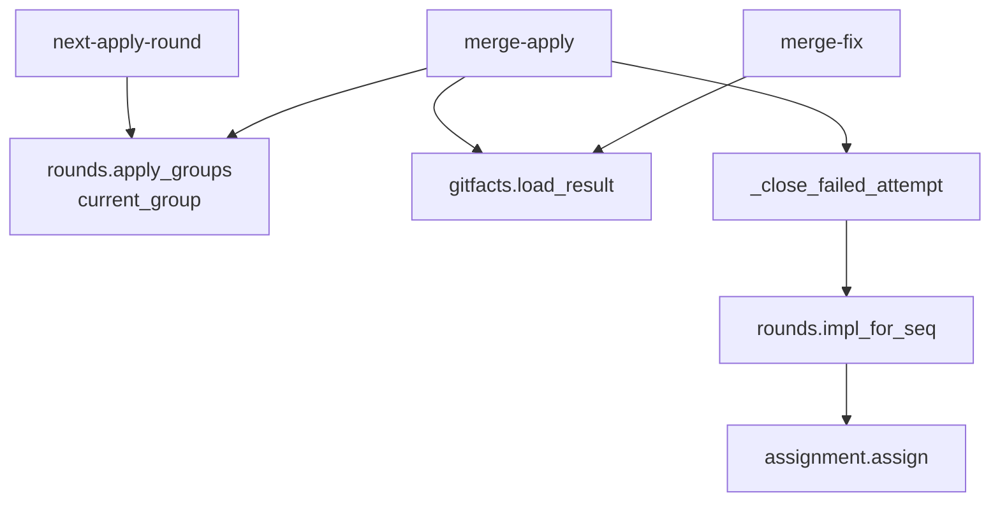
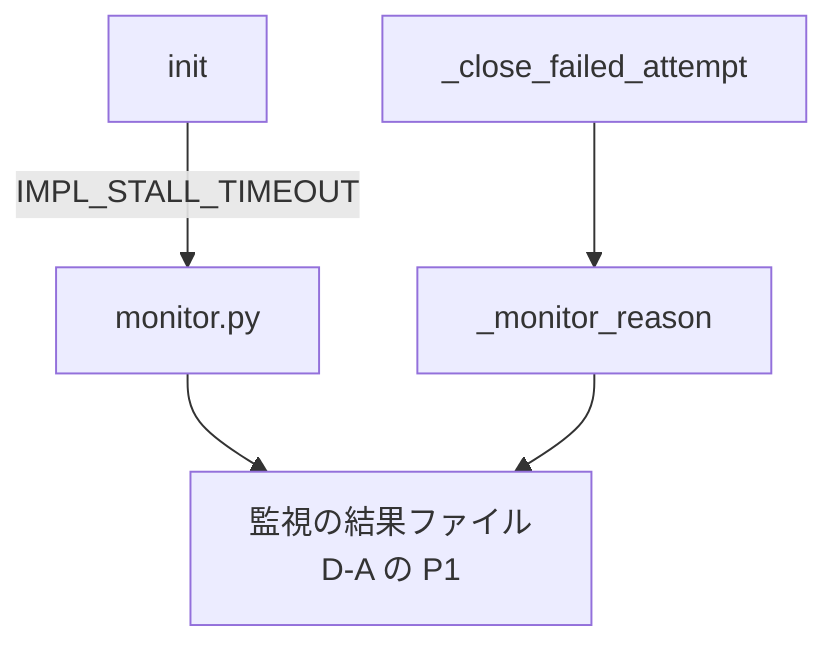
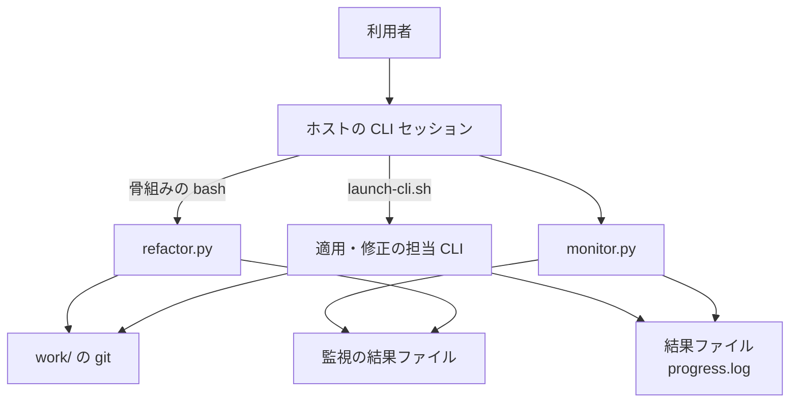
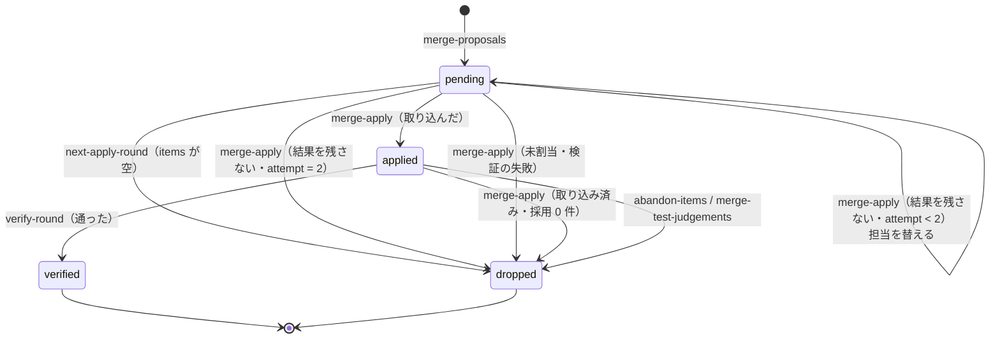
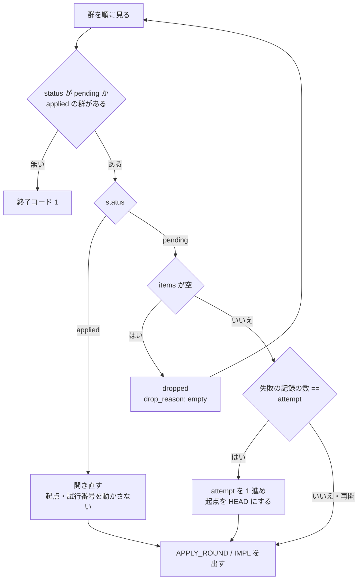
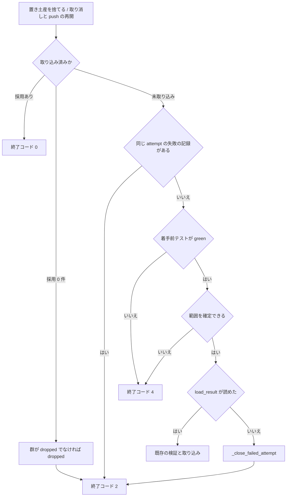

# #647 / #592 / #553: 適用ラウンドに試行の上限を置き、帰属行の後ろのトレーラーを読む

要求と受け入れ条件は [issue-647-592-553-requirements.md](issue-647-592-553-requirements.md) にある。
この文書は「どう作るか」だけを扱う。

**実装は 1 本の Pull Request（P6）にまとめる**（決定 1）。マイルストーン 21 の順序では P3 の後に載せ、 P4・P5 とは並行してよい。

## 機能一覧

| # | 機能 | 誰が使うか |
| --- | --- | --- |
| 1 | 結果を残さない担当の群を、担当を替えて 1 回だけ開き直し、2 回目も残さなければ取り消す | cross-refactoring を回す進行側 |
| 2 | 採用 0 件の提案ラウンドと項目の無い群で、適用担当を起動せずに次へ進む | 同上 |
| 3 | 修正の結果を群の担当から読み、結果が無ければ修正ラウンドを 1 つ進める | 同上 |
| 4 | 帰属行の段落が後ろに付いたコミットから必須トレーラーを読む | 同上（claude が適用担当の群） |
| 5 | 適用・修正の監視が、テストの実行中の無出力で担当を打ち切らない | 同上 |

## 決定の記録

決定 1〜8 は #647 と修正ラウンド、決定 9〜10 は #592、決定 11〜12 は #553、決定 13 は無進捗の打ち切りを扱う。

### 決定 1: 3 課題と `merge-fix` の担当の食い違いを 1 本の Pull Request で直す

#647 と #592 は同じ `next-apply-round` → `merge-apply` の繰り返しで止まらず、#553 は同じ適用の検証で群を落とす。
`merge-fix` の食い違いは、#647 を直した後に同じ形（結果を取り込めない担当で修正と検証が往復する）で残る。いずれも `refactor_lib/commands/apply.py`
と `SKILL.md` の骨組みを触るため、分けると同じ箇所を 2 度変える。

`merge-fix` を別の issue に起票する形は採らない。起票しても直す場所と時期が P6 と同じになる。

### 決定 2: 同じ群の試行の上限を 2 回の固定値にし、引数を足さない

2 回目は別の担当が試すため（決定 3）、2 回とも結果を残さなければ担当ではなく群の側を疑える。3 回以上にしても、輪番の 4 者のうち壊れた者に当たる確率が上がるだけである。
値は `vocabulary.py` の `MAX_APPLY_ATTEMPTS` に置く。

`--max-apply-attempts` を足す形は採らない。`SKILL.md` は上限を 2 つ置くとどちらで止まったかを読み解く必要が出るとしており、
利用者が変えたい理由も見当たらない。止まった理由は群の記録（`drop_reason`）が持つ。

### 決定 3: 2 回目の試行は次の輪番の担当が行い、利用上限でも進行全体を止めない

結果を残さない原因の多くは担当の CLI の側にある（rf646 の agy の STALLED 4 回、claude の 429 の 3729 回）。
同じ担当で開き直しても直らない。担当を替えれば、壊れた CLI が 1 者でも他の者が群を適用できる。替える先は、`apply_seq` を 1 ずつ進めて輪番の担当を引き、
その群で失敗した担当のどれとも違う担当が出た最初の番号の担当である。引く式は群を割り当てたときと同じものを通す（決定 8）。

1 つ進めるだけにしない。`apply_seq` は提案ラウンドの全群を割り当てた後の番号で、群自身の番号ではない。輪番は 4 者で 1 周するため、
群が 4 つあり先頭の群が失敗すると、次の番号の担当は失敗した担当と同じになる（`assign(1)` と `assign(5)` はどちらも codex。
「実測」の節）。

利用上限（429）で進行全体を止める形は採らない。止めると他の 3 者で進められる群まで止まり、再開すると同じ者にまた当たる。429 は監視が早期の致命として 15 秒前後で打ち切る（D-A
の P3）ため、担当を替える 1 回の費用は小さい。利用上限だった事実は理由の名前（`usage_limit`）として群の記録と見送りの理由に残る。

### 決定 4: 開き直しの判定は `merge-apply` が持ち、骨組みは監視の終了コードで分岐しない

`merge-apply` は結果ファイルを読めたかどうかを自分で知っている。監視の終了コードで分岐しても、結果ファイルが後から書かれた場合（#584）や、
監視は `OK` でも JSON が壊れている場合は結果ファイルの側で決めるしかない。判定を 1 か所に置くと、骨組みは `|| continue` のまま変わらない。

骨組みで監視の終了コードを受けて `merge-apply` へ渡す形は採らない。渡しても振る舞いは変わらず、使い道は理由の記録だけである。
理由は D-A が P1 で残す監視の結果ファイルから読む（「他の設計との契約」）。

### 決定 5: 試行番号は `next-apply-round` が進め、前の試行が失敗で閉じたときだけ進める

`next-apply-round` が `pending` の群を開くとき、失敗した試行の記録の数が試行番号と等しければ試行番号を 1 進める。
等しくなければ（取り込みの前に進行が止まった再開）そのまま開く。

`merge-apply` は同じ試行番号の失敗の記録が既にあれば、結果ファイルを読まずに、記録を足さず同じ終了コード 2 を返す。読んでから判定する形は採らない。
結果ファイルの名前（`{agent}-apply-r<提案ラウンド>`）は群の番号を持たず、消すのは `launch-cli.sh` の起動時だけである。
担当を替えた直後に叩き直すと、替えた先の担当が同じ提案ラウンドの先行の群で残した結果を読み、検証へ進んで群を落とす。進行はどこで止まっても叩き直せることが前提である（`docs/02-apply-and-review.md`「叩き直しても同じ判定を返す」）。
叩き直しを 2 回目の試行と数えると、1 回の失敗で群を落とす。

開いた回数だけを数える形は採らない。進行側が落ちて再開しただけで試行が進む。

### 決定 6: 結果を残さない試行のコミットは、開き直す前に取り消す

`next-apply-round` は `pending` の群を開くたびに起点を HEAD へ置き直す（`apply.py:304-309`）。
結果を残さない担当がコミットだけ作って止まると、そのコミットは次の試行の起点より前に入り、検証を受けないまま次の群の push で Pull Request に出る。
範囲にコミットがあれば、既存の `_revert_unverified_apply_round`（`apply.py:555-598`）から取り消しの本体（`revert_item_commits`
と起点の更新）だけを切り出して共有し、起点を取り消し後の HEAD にする。関数をそのまま呼ぶ形は採らない。群を `dropped` にして項目を見送るため、
1 回目の失敗で群が閉じる。

### 決定 7: 着手前テストの未確認と範囲の未確定は中断（4）にする

`init` は着手前テストが失敗していれば止まるため、`merge-apply` で `green` でないのは状態ファイルが壊れたときだけである。
範囲を確定できないのも git の状態が壊れたときである。どちらも群を替えても直らず、 `SKILL.md` の終了コードの表は既に「範囲を確定できない」を 4 と書いている。

試行の上限へ含める形は採らない。全ての群が 2 回ずつ同じ理由で落ち、全件が見送りになってから気づく。

### 決定 8: 作業を任せる担当の決定は `rounds.impl_for_seq` の 1 つを通す

`rounds.impl_for_seq(state, seq)` を新設し、輪番の通し番号から担当を引く呼び出しはその中だけにする。呼ぶのは次の 3 か所で、
いずれも `apply_seq` を進めて CLI に作業を任せる担当を決める。

| 呼び出し元 | 決めるもの |
| --- | --- |
| `apply._assign_apply_rounds_to_state` | 群を割り当てたときの担当 |
| `apply._close_failed_attempt` | 結果を残さなかった群の交代先 |
| `gate._final_fix_impl`（`gate.py:128` を置き換える） | 最終ゲートの修正担当 |

置き場所を `rounds.py` にするのは、`apply.py` と `gate.py` の両方が読む層だからである（`commands` どうしの取り込みを作らない）。
D-B が除外（#478）を足すとき、変える呼び出しは 1 か所で済む。`assignment.py` は変えない。

`setup.cmd_start_round`（`setup.py:467`）の `assignment.assign` は通さない。引くのは提案ラウンドの記録上の担当で、
骨組みは適用の前に `next-apply-round` が返す群の担当で `IMPL` を上書きするため、この担当は CLI を起動しない。

### 決定 9: 採用 0 件の提案ラウンドでは群を作らない

`rounds.apply_groups` は、`apply_rounds` が空の配列のときも古い版の状態として扱う（`rounds.py:108-110` の `if groups:`）。
そのため、ラウンド全体を 1 つの群にしている。`merge-proposals` は採用 0 件で `apply_rounds = []` を書くため、
ここで項目 0 件の群が生まれる。鍵が無い（`None`）ときだけ古い版として扱い、空の配列はそのまま返す。

`merge-proposals` がテスト整備の採用 0 件で終了コード 2 を返す形は採らない。2 は構造改善の繰り返しを終える合図で、
テスト整備では構造改善へ進む前に抜けてしまう。

### 決定 10: 項目の無い群は開かずに取り消し、取り込み済みで採用 0 件の群も取り消しへ直す

決定 9 の後も、既に項目の無い群を持つ状態ファイル（rf587）は残る。`next-apply-round` は `items` が空の `pending` の群を `dropped`（`drop_reason: empty`）にして次の群を探す。
`merge-apply` の取り込み済みの判定で採用 0 件だったときは、群が `dropped` でなければ `dropped` にしてから終了コード 2 を返す。

### 決定 11: トレーラーは、末尾から続くトレーラーの段落を git の判定で読む

`commit_trailers` はメッセージを空行で段落に分け、末尾の段落から前へ向かって、1 段落ずつ `git interpret-trailers --parse` に掛ける。
git がトレーラーの段落と判定しなかった段落で止め、それまでに読んだ段落の値を合わせる。同じ鍵は末尾に近い段落の値を採る。**1 段落目（題名）は掛けない。**
掛けると、本文がトレーラーだけのコミットで `Refactor: …` の形の題名をトレーラーとして読む（「実測」の節）。

| issue の案 | 採否 | 理由（「実測」の節） |
| --- | --- | --- |
| `git interpret-trailers --parse` へ替える | 採らない | `%(trailers:only,unfold)` と同じく最後の段落しか読まない |
| 全文から `^<Key>: ` を拾う | 採らない | 散文の段落にある `Round: …` の形の行を拾う |
| 雛形に最後の段落へ置くよう書く | 補助として採る（決定 12） | 実装担当が従わなければ落ちる |
| 進行側が `--amend` でトレーラーを足し直す | 採らない | SHA が変わり、結果ファイルの申告との対応が切れる |

段落ごとの判定を git に任せるため、トレーラーの定義（区切り文字・折り返し・25% の規則）を自前で持たない。散文の段落で止まるため、本文中の `Key: value` の形の行は読まない。

`claude -p` に `--settings` で帰属行を消させる形は採らない。帰属行を書くのはモデルで、利用者の `CLAUDE.md` の指示でも足される。
共通層の `launch-cli.sh` は cross-review も使う。

### 決定 12: 雛形のコミットの規約にも、必須トレーラーを最後の段落に置くことを書く

進行側の検証は決定 11 で通る。一方、人が `git log --format='%(trailers:key=Impl-Model,valueonly)'` で集計すると、
最後の段落しか読まない。`docs/02-apply-and-review.md` は、この集計を理由にトレーラー形式を選んでいる。帰属行を同じ段落に続けて書けば、
git の標準の読み方でも取れる。

### 決定 13: 無進捗の許容を `--test-timeout` + 900 秒にし、雛形に進捗マーカーを足す

適用・修正の担当はテストを 1 回実行し、その間は何も出力しない。テストの上限は `--test-timeout`（既定 900）である。 claude は `--output-format json`
のため、完了まで出力しない（監視の既定の許容 900 秒はこのため）。 2 つを足した値が、正常に動いていても出力が無い最長の時間になる。`init` がこの値を `IMPL_STALL_TIMEOUT`
として出し、骨組みの適用・修正・最終ゲートの修正の監視が `--stall-timeout` に渡す。`monitor.py` は変えない。

**監視の上限（`--timeout`）は渡さない。** 上限は D-A の P2 が `--phase` と `lib/limits.py` で工程ごとに決め（既定 3600 秒）、修正と
最終ゲートの修正が 420 秒で打ち切られる件も P2 が直す。P6 は P2 が入れた `--phase` の呼び出しに `--stall-timeout` だけを足す。

雛形の進捗マーカーは、次に STALLED が出たときに担当が動いていたかを読むためにも足す。rf646 の agy のログは作業ツリーとともに消えており、
この設計の時点では確かめられなかった（未確認 1）。

**`--test-timeout` は、`apply` / `fix` / `final-fix` の監視の上限 − 900 未満を前提にする**（P2 の既定 3600 秒なら 2700 未満）。
監視の上限は `MONITOR_TIMEOUT_<担当>` / `MONITOR_TIMEOUT` で上書きされうる。この値以上にすると許容が監視の上限以上になり、監視の上限で
打ち切られ、P2 の監視が担当名と 2 つの値を警告する（D-A の AC33）。D-A の AC31 が固定する「無進捗の許容 < 監視の上限」は担当ごとの
既定の許容の組で、この許容（既定 1800 < 3600）はその順序を崩さない。監視の上限を許容から導く形は採らない。上限の表は P2 の
`limits.py` が 1 つだけ持ち、適用の所要の実測も無い（未確認 6）。

進捗マーカーだけで足りるとする形は採らない。テストの実行中はマーカーを書けない。 `MONITOR_STALL_AGY` などの環境変数に委ねる形も採らない。
担当ごとに値を覚えさせることになり、cross-review にも効く。

## 実測

### #647: 結果を残さない群が開き直され続ける

一時のテストファイルで `cmd_next_apply_round` → `cmd_merge_apply` を直接 4 回呼んだ（コミットしない）。
補助は `tests/conftest.py` の `no_git` / `patch_lib` と、`test_merge_apply.py` の `_state_with_items`
/ `git_facts` である。

| 状態 | 開いた群 | `merge-apply` の終了コード | 群の `status` |
| --- | --- | --- | --- |
| 群 2 つ（agy / codex）、結果ファイルなし | `[1, 1, 1, 1]` | `[2, 2, 2, 2]` | `pending`, `pending` |
| 同上で着手前テストが `red`（2 回） | `[1, 1]` | `[2, 2]` | `pending`, `pending`（項目は `blocked`） |

輪番の担当は `plugins/ndf/scripts/lib/assignment.py` の `assign` を `seq` 1〜8（ホスト claude）で引くと `codex, agy, kiro, claude, codex, agy, kiro, claude`
だった。4 で 1 周するため、`apply_seq` を 1 進めるだけでは失敗した担当へ戻ることがある（決定 3）。

### 範囲へ入れたもの: `merge-fix` が提案ラウンドの担当を読む

群の担当 agy、提案ラウンドの担当 codex で `agy-fix-r1-result.json` を置き、`cmd_merge_fix` を 3 回呼んだ。
3 回とも終了コード 2 で `❌ codex の結果ファイルがありません`、`fix_rounds` は 0 のままだった。 `merge-fix` は `entry["impl"]`（`converge.py:463`）を読み、
骨組みは `launch-cli.sh "$IMPL" fix` で群の担当を起動する。

### #592: 採用 0 件で項目の無い群が開く

テスト整備ラウンドで提案 0 件の状態から `cmd_merge_proposals`（終了コード 0）→ 上と同じ 4 回を呼んだ。

| 結果ファイル | 開いた群 | 終了コード | 群 |
| --- | --- | --- | --- |
| なし | `[1, 1, 1, 1]` | `[2, 2, 2, 2]` | `items: []`、`status: pending` |
| `{"items": []}` | `[1, 1, 1, 1]` | `[2, 2, 2, 2]` | `items: []`、`status: applied`（rf587 と同じ形） |

`apply_groups` を「鍵が `None` のときだけ群を作る」に差し替えて、同じ手順を試した。`next-apply-round` は 1 回目で終了コード 1 を返し、
`apply_rounds` は `[]` のままだった。

### #553: 段落ごとの読み取り

git 2.53.0 の一時リポジトリでコミットを作り、2 つの読み方を比べた。1 つは `git log -1 --format='%(trailers:only,unfold)'` である。
もう 1 つは決定 11 の読み方の試作で、Python から段落ごとに `git interpret-trailers --parse` を呼ぶ。

| メッセージの末尾 | `%(trailers:only,unfold)` | 試作 |
| --- | --- | --- |
| 必須 4 つ / 空行 / `Co-Authored-By` | `Co-Authored-By` だけ | 5 つ |
| 必須 4 つ / 空行 / `Co-Authored-By` + `Claude-Session` | 帰属行 2 つだけ | 6 つ |
| 必須 4 つと `Co-Authored-By` が同じ段落 | 5 つ | 5 つ |
| `Round: 本文の説明行` / 散文 / 必須 4 つ / 帰属行 | 帰属行だけ | 帰属行と必須 4 つ（`Round` は `4`） |
| 散文 + `Item-Id: R9-999` の段落 / 帰属行 | 帰属行だけ | 帰属行だけ |

`printf 'Refactor: 重複を除く\n\nRefactor: 重複を除く\n' | git interpret-trailers --parse` は `Refactor: 重複を除く`
を返した。題名を段落として git に掛けると、題名をトレーラーとして読む。

`git log -1 --format=%B | git interpret-trailers --parse` は 1 行目と同じく帰属行だけを返した。
`interpret-trailers --parse` へ替えるだけでは効かない。 `git interpret-trailers --parse` は題名の無い入力（段落 1 つだけ）ではトレーラーを返さなかったため、
試作は `<題名>\n\n<段落>` の形で渡している。

## 構成要素

| 要素 | 責務 | 課題 |
| --- | --- | --- |
| `rounds.apply_groups`（変更） | 鍵が無いときだけ古い版として群を 1 つ作る。空の配列はそのまま返す | #592 |
| `rounds.current_group`（変更） | 群が 1 つも無いときは中断（4）する | #592 |
| `apply.cmd_next_apply_round`（変更） | 項目の無い `pending` の群を取り消して飛ばす。開くときに試行番号を進める（決定 5） | #647 #592 |
| `apply.cmd_merge_apply`（変更） | 取り込み済みで採用 0 件の群を取り消しへ直す。着手前テストと範囲の検査を結果の読み取りより前に置き、4 で中断する。結果を読めなければ `_close_failed_attempt` へ渡す | #647 #592 |
| `apply._close_failed_attempt`（新設） | 範囲のコミットを取り消し、失敗した試行を記録する。上限未満なら担当を替え、上限なら群を取り消して項目を見送る | #647 |
| `rounds.impl_for_seq`（新設） | 輪番の通し番号から担当と要求モデルを返す。作業を任せる担当を決める呼び出しはすべてこれを通す（決定 8） | #647 |
| `gate._final_fix_impl`（変更） | 最終ゲートの修正担当を `rounds.impl_for_seq` で引く | #647 |
| `apply._monitor_reason`（新設） | `monitor_outcome.read_outcome(tmp_dir, "<impl>-apply-r<ROUND>")` の `reason` が `timeout` / `stalled` / `early_error` / `usage_limit` / `cli_timeout` / `pidfile_bad` ならその値を返す。`ok` / `missing` / ファイルなしなら `load_result` の問題（`missing` / `unparsable`）を返す（D-A の AC55 と同じ規則） | #647 |
| `gitfacts.load_result`（新設） | 結果ファイルを読み、`(payload, problem)` を返す。問題は `missing`（無い）/ `unparsable`（JSON として読めない・オブジェクトでない）。中断しない | #647 |
| `gitfacts.read_result`（変更なし） | 最終ゲートの修正（`gate.py`）が引き続き使う。結果が無いときの扱いは #674 | — |
| `converge.cmd_merge_fix`（変更） | 群の担当の結果を読む。結果を読めなければ範囲を取り消し、修正ラウンドを 1 つ進めて 2 で終わる | 範囲へ入れたもの |
| `gitfacts.commit_trailers`（変更） | 末尾から続くトレーラーの段落を読む（決定 11） | #553 |
| `vocabulary.py`（変更） | `MAX_APPLY_ATTEMPTS = 2` と `IMPL_STALL_MARGIN = 900` | #647 |
| `setup._emit_init`（変更） | `IMPL_STALL_TIMEOUT` を出す | #647 |
| `prompts/apply.md` / `fix.md`（変更） | 必須トレーラーを最後の段落に置く。進捗マーカー | #553 #647 |
| `prompts/final-fix.md`（変更） | 進捗マーカー | #647 |
| `SKILL.md`（変更） | 語の表の適用ラウンドの上限、「別の上限を置かない」の段落の削除、骨組みの監視の引数と終了コード 2 の注記 | #647 |
| `docs/02-apply-and-review.md` / `docs/04-fix-and-report.md`（変更） | Step 4 と Step 6 の骨組みの監視の引数、開き直しの規則、トレーラーの読み方、修正の結果が無いとき | 全体 |





上の図は群の判定、下の図は監視との関係を描く。雛形・文書と、`commit_trailers`（`merge-apply` の検証が呼ぶ 1 本だけ）は含めない。`assignment.assign` と監視の結果ファイルは変えない要素である。

### 文脈と配置



**配置は変えない。** すべて利用者の機械のホストのセッションから起動するプロセスで、常駐しない。図は状態ファイルと Pull Request への push を含めない。この変更で増える辺は、`refactor.py` が監視の結果ファイルを読む 1 本だけである。

### 変わるファイル

```text
plugins/ndf/skills/cross-refactoring/
├── SKILL.md                              # 語の表・段落の削除・骨組み
├── docs/02-apply-and-review.md           # Step 4 の骨組み・開き直し・トレーラー
├── docs/04-fix-and-report.md             # Step 6 の骨組みの監視の引数・修正の結果が無いとき
├── prompts/apply.md                      # トレーラーの段落・進捗マーカー
├── prompts/fix.md                        # 同上
├── prompts/final-fix.md                  # 進捗マーカー
├── scripts/refactor_lib/
│   ├── rounds.py                         # apply_groups / current_group / impl_for_seq
│   ├── gitfacts.py                       # load_result / commit_trailers
│   ├── vocabulary.py                     # MAX_APPLY_ATTEMPTS / IMPL_STALL_MARGIN
│   └── commands/
│       ├── apply.py                      # next-apply-round / merge-apply / 補助 3 つ
│       ├── converge.py                   # merge-fix
│       ├── gate.py                       # _final_fix_impl
│       └── setup.py                      # _emit_init
└── tests/
    ├── test_apply_attempts.py            # 新設: AC1〜AC12、AC16
    ├── test_apply_rounds.py              # AC13〜AC15
    ├── test_abandon_items.py             # AC17〜AC19
    ├── test_commit_trailers_git.py       # 新設: AC20〜AC26（一時リポジトリ）
    ├── test_init.py                      # AC28
    ├── test_merge_apply.py               # AC34
    ├── test_final_fix.py                 # AC37
    └── test_skill_terms.py               # AC27、AC29〜AC32
# dev.kiro / dev.agy の配布物は bash scripts/build-runtime-plugins.sh で同期する
```

## データ構造（状態ファイルの群）

状態ファイル（`cross-refactoring-rf<番号>-state.json`）の `rounds[].apply_rounds[]` に項目を足す。
**版は上げない。** 足す項目が無い状態ファイルは、試行番号 0・失敗の記録なしとして読む。

| 項目 | 型 | 値 | 空のときの意味 |
| --- | --- | --- | --- |
| `attempt` | 整数 | いま開いている試行の番号。1 から | 鍵なし = 0（まだ開いていない）。`merge-apply` は 0 を 1 回目として記録し、値を 1 に書く（変更前の版で開いた群を再開したとき） |
| `failed_attempts` | 配列 | 結果を残さなかった試行。1 件 = `{attempt, impl, reason, at, reverted}` | 鍵なし = 失敗なし |
| `failed_attempts[].reason` | 文字列 | 監視の理由の名前（`stalled` など）。監視が `ok` / `missing` か結果ファイルが無ければ `load_result` の問題（`missing` / `unparsable`） | — |
| `failed_attempts[].reverted` | 整数 | その試行の範囲から取り消したコミットの数 | 0 = コミットなし |
| `drop_reason` | 文字列 | `no_result`（試行の上限）/ `empty`（項目なし） | 鍵なし = 既存の経路で取り消した、または取り消していない |
| `impl` / `impl_model` | 既存 | 担当を替えたときに書き換える。**前の担当は `failed_attempts[].impl` に残る** | — |

`impl` を書き換えても、どの担当がどの試行で失敗したかは `failed_attempts` から読める。群を取り消したときの見送りの理由（`deferred_items[].defer_reason`）は、
`実装担当が結果を残しませんでした（agy: stalled → codex: missing）` の形にし、改修計画の「見送った項目」の表にそのまま出る。

ラウンドの項目（`rounds[]`）は `fix_merged_keys` に `"<fix_attempts>:missing"` の形の鍵を足す（AC19）。

### 群の状態の遷移



**`pending` のまま同じ担当で開き直す遷移は無い。** この変更で足す遷移は 4 本で、`items` が空の取り消し、担当の交代、
試行の上限での取り消し、取り込み済み・採用 0 件の取り消しである。

## 入出力の契約

### コマンドの終了コード

| コマンド | 0 | 1 | 2 | 4 |
| --- | --- | --- | --- | --- |
| `next-apply-round` | 群を開いた（変更なし） | 残りの群が無い（変更なし。群が無いラウンドも含む） | — | — |
| `merge-apply` | 取り込んだ（変更なし） | — | **この群を取り消した、または担当を替えて開き直す**（意味を広げる） | 着手前テストが `green` でない・範囲を確定できない（2 から変更）・群が無い（新） |
| `merge-fix` | 取り込んだ（変更なし） | — | 範囲を確定できない（変更なし）・**結果を読めない（新。修正ラウンドは進む）** | 群が無い（新） |
| `verify-round` / `abandon-items` / `merge-test-judgements` | 変更なし | — | 変更なし | 群が無い（新） |

「群が無い（新）」は、群が 1 つも無いラウンドで `current_group` を呼んだときの中断である。`next-apply-round` は `current_group` を呼ばない。

骨組みは `merge-apply` の 2 で `continue` し、`merge-fix` の終了コードを見ない。**どちらも変えない。**

### `init` の出力

`IMPL_STALL_TIMEOUT=<test_timeout + 900>` を足す。`test_timeout` は状態ファイルの値で、
再開時も同じ値を出す。

### 骨組み（`SKILL.md` の「実行」の差分）

```bash
    "$LIB/monitor.py" "$ID" --agents "$IMPL" --tmp-dir "$TMP_DIR" \
        --stem-template "{agent}-apply-r$ROUND" --phase apply \
        --stall-timeout "$IMPL_STALL_TIMEOUT"
    # 終了コード 2 = この群を取り消した、または担当を替えて開き直す。修正ラウンドは回さない
    rf merge-apply "$ID" "$ROUND" || continue
```

差分は `--stall-timeout` の 1 行だけで（`--phase apply` は P2 の形）、修正と最終ゲートの修正の監視にも同じ行を足す。`--timeout` は渡さない。

### 雛形に足す文

| 雛形 | 足す文 |
| --- | --- |
| `apply.md` / `fix.md` のコミットの規約 | 4 つのトレーラーは**メッセージの最後の段落**に置く。実行環境が帰属行（`Co-Authored-By:` など）を足すときは、空行を挟まず同じ段落に続ける |
| `apply.md` / `fix.md` / `final-fix.md` | 作業段階が進むたびに `$RF_STEM-progress.log` へ 1 行追記する（`start` / `edit` / `test` / `commit` / `done` と対象だけ。推論は書かない）。形は cross-review の `launch-reviewer.sh` の「進捗マーカー」に揃える |

## 処理の流れ

### `next-apply-round`



再開で試行番号を進めないときも、`apply_round` と `apply_base_sha` は群の値から書き直す。

### `merge-apply`



`_close_failed_attempt` は次の順で行う。

1. 範囲にコミットがあれば全範囲を新しい順に取り消し、群と記録の起点を取り消し後の HEAD にする（push の印を先に立てる）
2. `failed_attempts` へ `{attempt, impl, reason: _monitor_reason(...), at, reverted}` を足す（`attempt` が 0 なら 1 として記録する）
3. `attempt < MAX_APPLY_ATTEMPTS` なら、`apply_seq` を 1 ずつ進めて `rounds.impl_for_seq` を引き、`failed_attempts[].impl` のどれとも違う担当が出たらその担当と要求モデルで `impl` / `impl_model` を書き換える。4 回進めても出なければ（除外で候補が 1 者しかない）、手順 4 と同じく群を取り消す
4. `attempt >= MAX_APPLY_ATTEMPTS` なら群の項目を `abandoned` にして `deferred_items` へ入れる。群は `dropped`（`drop_reason: no_result`）にし、`apply.merged_at` を立て、局面を `phase_after_group` にする
5. 保存し、取り消しがあったときだけ push する（`push_with_retry_marker`）

### `merge-fix`

担当は `current_group(entry)["impl"]`（無ければ `entry["impl"]`）から読む。`fix_merged_keys` に `"<fix_attempts>:missing"` が
あれば、結果ファイルを読まずに 2 を返す（`merge-apply` の決定 5 と同じ理由。欠落の後に遅れて書かれた結果を取り込まない）。
無ければ `load_result` を呼び、読めなければ範囲（`fix_base_sha`..HEAD）にコミットがあるときだけ `revert_unverified_range` で
取り消し、鍵を足し、`fix_rounds` を 1 進めて保存し、2 を返す。範囲を確定できないときの既存の扱い（`_resolve_fix_range`）と同じ形である。

## 非機能の実現方式

| 大項目 | 要求の条件 | 実現方式 | 確かめ方 |
| --- | --- | --- | --- |
| 性能・拡張性 | 中断と再開を挟まない実行で、適用担当の起動が群の数 × 2 回、修正担当の起動が群の数 × `--max-fix-rounds` 回を超えない | 試行番号の上限（決定 2・5）と、結果が無い修正でも `fix_rounds` を進めること | AC3（開く回数）と AC18（`should-abandon` が上限で 0） |
| 運用・保守性 | 群を取り消した理由が改修計画の「見送った項目」から読める | `defer_reason` に担当と理由の名前を並べる。`plan.py` の表は `defer_reason` をそのまま出す | AC2 で `defer_reason` に `agy` と理由の名前が入ることを見る |

## 他の設計との契約

| 相手 | 契約 | D-C の扱い |
| --- | --- | --- |
| D-A（P1） | 監視が担当ごとの結果を `<stem>-monitor.json` へ残し、`monitor_outcome.read_outcome(tmp_dir, stem)` で読める（D-A の契約の文書） | `_monitor_reason` だけが `read_outcome(tmp_dir, "<impl>-apply-r<ROUND>")` の `reason` を読む。`ok` / `missing` / ファイルなしは `load_result` の問題へ置き換える（D-A の AC55 と同じ規則。壊れた JSON は監視から見ると `ok`）。振る舞いは変えない。追記だけの `monitor-outcomes.jsonl` は読まない |
| D-A（P3） | 理由の名前は #619 の語彙を基本とし、claude の `"api_error_status":429` を `usage_limit` として早期に打ち切る | 名前を解釈しない。記録へ写すだけ |
| D-A（P1 の計測） | 工程の所要は監視の記録と `refactor.py` の `statefile.save` の差し込み口から組み立て、骨組みと `refactor_lib` の取り込みには足さない（D-A の決定 9） | 計測の呼び出しを置かない。`refactor.py` の差し込み口と `commands/report.py` の要約の行は D-A が足すため、P6 はその上に載せる。**要約の `apply_attempts` は、鍵 `"r<ラウンド>-g<群>"` → `{"attempts": <attempt>, "failed": <failed_attempts の件数>, "dropped_reason": <drop_reason または null>}` を状態ファイルの群から作る**（D-A の AC14 の「群ごとの試行回数」の出どころ。監視の記録からは作らない）ことを前提 1 に含める |
| D-A（P2） | 監視の上限は `--phase` と `lib/limits.py` が工程で決め、cross-refactoring の 8 か所は `--timeout` を渡さない（D-A の AC37）。修正と最終ゲートの修正の 420 秒の打ち切りも P2 が直す。8 か所の引数は P2 が変え、D-C は上限の値を書かない（D-A の申し送り） | `--timeout` を足さず、`--phase` が `apply` / `fix` / `final-fix` の呼び出しに `--stall-timeout` だけを足す。**これは申し送りと D-A の決定 10（無進捗の許容は担当の軸だけで決め、既定値は `limits.py` の表だけが持つ）に対する例外である。** 工程（テスト 1 回を含む適用・修正）に依存する許容を、D-C が骨組みの引数で渡す。D-A の申し送りの行と決定 10 へ同じ例外を書き足すことを前提 1 に含める。許容が監視の上限以上になる組は P2 の警告（D-A の AC33）に任せる |
| D-A（全体） | 監視の終了コードの意味（2 / 3 / 4 / 5 / 6）と `--stall-timeout` の引数は変えない | 骨組みは終了コードで分岐しない（決定 4） |
| D-B（P4 / P5） | 除外（#478）は `assignment.assign` か、その呼び出し側に入る | 適用・交代・最終ゲートの修正の担当を決める呼び出しは `rounds.impl_for_seq` の 1 か所（決定 8）。D-B が先に入れば P6 がそこへ寄せ、P6 が先なら D-B がそこを変える。`setup.py:467` の提案ラウンドの担当は CLI を起動しないため対象外 |

## テスト設計

実行は `uv run --with pytest pytest plugins/ndf/skills/cross-refactoring/tests -q`。
状態の遷移は関数を直接呼ぶ既存の形（`no_git` / `patch_lib` / `git_facts`）、トレーラーは一時リポジトリで実際に git を実行する。

| 受け入れ条件 | 何で確かめるか | 置き場所 |
| --- | --- | --- |
| AC1、AC2、AC4、AC5 | 群 2 つの状態で結果ファイルを置かずに（AC4 は壊れた JSON と配列で）呼び、`status` / `impl` / `failed_attempts` / `apply_seq` / `deferred_items` を見る。AC5 は群 4 つ（`apply_seq` 4）で先頭の群を失敗させる | `test_apply_attempts.py` |
| AC3 | `next-apply-round` が 1 を返すまで繰り返し、呼び出し回数 5 と両群の `dropped` | `test_apply_attempts.py` |
| AC6、AC7 | `merge-apply` の 2 度呼び、`next-apply-round` の 2 度呼びで、記録の件数と `attempt` が変わらない。AC6 は替えた先の担当の古い結果ファイルを置いた状態でも確かめる | `test_apply_attempts.py` |
| AC8 | `commits_in_range` が 1 件返す状態で、`no_git` の記録に `git revert` が出て、群の `base_sha` が変わる | `test_apply_attempts.py` |
| AC9、AC10 | 着手前テスト `red`、`commits_in_range` が `None` で、`SystemExit` の値が 4 | `test_apply_attempts.py` |
| AC11 | 4 つの経路でパラメータ化し、終了コード 2 の後の群が `dropped` か失敗の記録付き `pending` | `test_apply_attempts.py` |
| AC12 | `<impl>-apply-r<ROUND>-monitor.json` に `reason: stalled` を置いた場合、ファイルが無い場合、`reason: ok` で結果ファイルが壊れた JSON の場合 | `test_apply_attempts.py` |
| AC13 | テスト整備ラウンドの採用 0 件から `merge-proposals` → `next-apply-round` が 1、`apply_rounds == []` | `test_apply_rounds.py` |
| AC14 | `apply_rounds` の鍵を消した状態で群が 1 つ作られる（既存のテストを確かめ直す） | `test_apply_rounds.py` |
| AC15 | rf587 の形の状態で `merge-apply` → 2、群 `dropped`、`next-apply-round` → 1 | `test_apply_rounds.py` |
| AC16 | `items: []` の `pending` の群と、項目のある群を並べて `next-apply-round` | `test_apply_attempts.py` |
| AC17〜AC19 | 群の担当と提案ラウンドの担当を分けた状態で `merge-fix`。AC18 は `should-abandon` まで回す | `test_abandon_items.py` |
| AC20〜AC24 | 一時リポジトリで各形のコミットを作り、`commit_trailers` の戻り値を比べる | `test_commit_trailers_git.py` |
| AC25 | 同じ一時リポジトリで `collect_commit_facts` → `verify_apply_round` が `None` | `test_commit_trailers_git.py` |
| AC26 | 同じ一時リポジトリで、題名が `Round: …` の形で本文がトレーラーの段落だけのコミットを作り、`Round` が題名の値にならない | `test_commit_trailers_git.py` |
| AC27、AC30 | 雛形の文言を `grep` で探す | `test_skill_terms.py` |
| AC28 | `_emit_init` の出力に `IMPL_STALL_TIMEOUT=1800`（`test_timeout` 900 の状態） | `test_init.py` |
| AC29、AC31 | `SKILL.md` の骨組みから `monitor.py` の呼び出し 4 つを取り出し、`--phase` が `apply` / `fix` / `final-fix` の 3 つが `--stall-timeout "$IMPL_STALL_TIMEOUT"` を持ち、`--timeout` を持たない。語の表の行と段落の有無 | `test_skill_terms.py` |
| AC32 | `docs/02-apply-and-review.md` の Step 4 と `docs/04-fix-and-report.md` の Step 6 の `monitor.py` の引数（`--phase` と `--stall-timeout`、`--timeout` なし）が、`SKILL.md` の同じ呼び出しと一致する | `test_skill_terms.py` |
| AC33 | トレーラーの節の記載をレビューで見る | 手動 |
| AC34 | 既存の `test_a_verified_apply_round_marks_every_item_applied` に `failed_attempts` が無いことを足す | `test_merge_apply.py` |
| AC35、AC36 | 全体のテスト、`bash scripts/build-runtime-plugins.sh --check`、`claude plugin validate .`、`python3 scripts/check-skill-frontmatter.py` | 手動 |
| AC37 | `impl_for_seq` を差し替え、群の割り当て・担当の交代・最終ゲートの修正担当の 3 つが差し替えた担当になる | `test_final_fix.py` / `test_apply_attempts.py` |

## 未確認のまま残ること

| # | 項目 | 内容 | 決める時点 |
| --- | --- | --- | --- |
| 1 | rf646 で agy が打ち切りの時点で動いていたか | ログは作業ツリーとともに消えていた（`find / -name 'agy-apply-r*'` で該当なし）。決定 13 は動いていた場合も止まっていた場合も成り立つ | 次の実行で `progress.log` を読む |
| 2 | 担当が雛形の進捗マーカーに従うか | cross-review の agy は従っている（heartbeat に作業段階が出る）。claude / codex / kiro の適用で従うかは起動して確かめていない。従わなくても決定 13 の許容で打ち切られないのはテスト 1 回分まで | 実装後の最初の実行 |
| 3 | 担当を替えた後の担当も結果を残さない割合 | 2 回目で救える群の数は測っていない。実行の要約の `apply_attempts`（群ごとの `attempt` と `failed_attempts` の件数）で数える | 配布後 |
| 4 | Claude Code 以外の担当が帰属行を足すか | codex / agy / kiro のコミットで帰属行の段落を見ていない。決定 11 は誰が足しても同じに読む | 確かめなくてよい |
| 5 | 帰属行を同じ段落に続ける指示に claude が従うか | 決定 12 は補助で、従わなくても決定 11 で検証は通る | 実装後の最初の実行 |
| 6 | `--test-timeout` が監視の上限 − 900（既定 2700）以上の利用 | 適用・修正の所要を測っていない。#662 の計測で工程ごとの所要が取れたら、P2 の上限の表と合わせて見直す | 配布後 |
