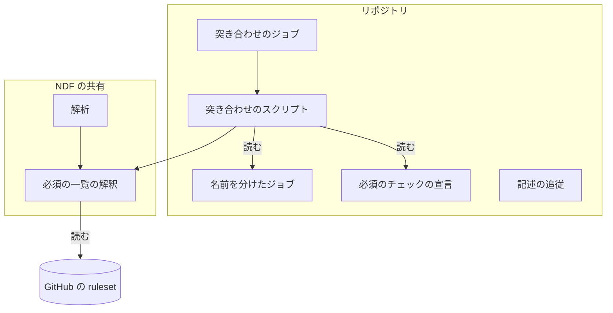
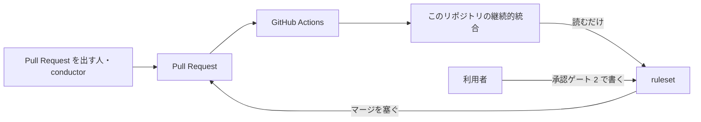
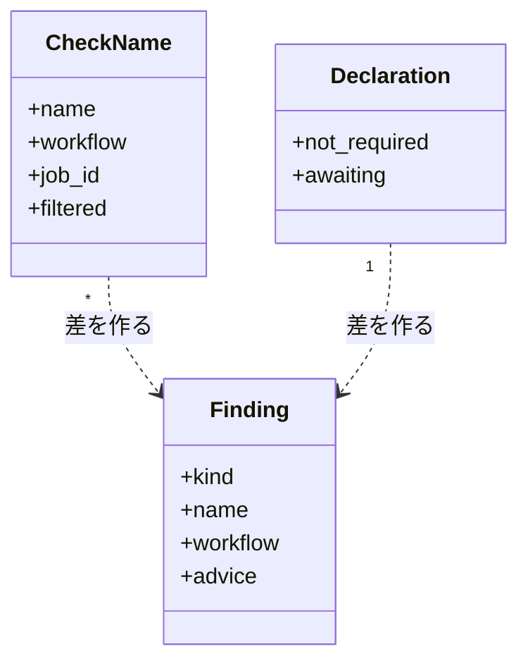
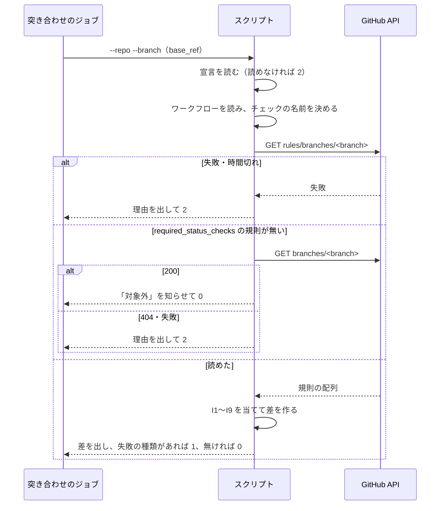
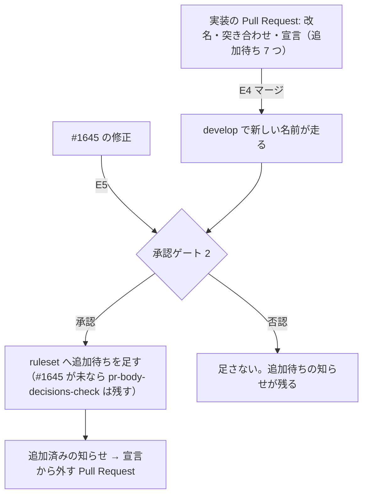
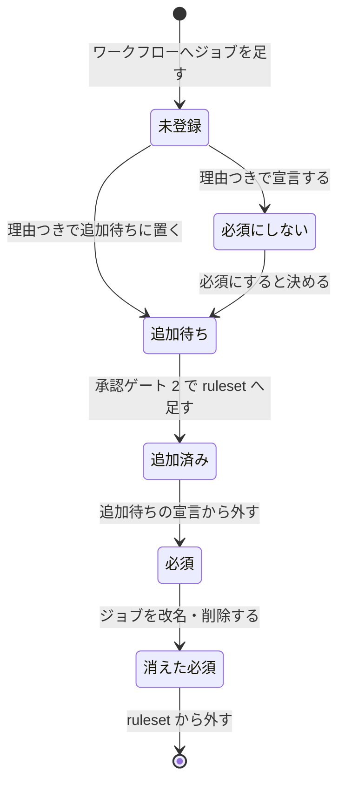

# 継続的統合: 走るチェックのうち 6 つが落ちてもマージでき、ジョブを足すたびに必須への入れ忘れが起きる → 6 つが落ちたらマージが塞がれ、入れ忘れは Pull Request の突き合わせのチェックが知らせる（#653）

## 目的

- **何が壊れているか**: Pull Request で走るチェックのうち 6 つ（`doc-line-limit-check`・`skill-shell-vars-check`・`lint`・名前が `check` の 3 つ）が ruleset の必須のチェックに無く、落ちてもマージできる。名前が `check` の 3 つは名前が重なり、必須に入れても指す先が決まらない
- **誰が困るか**: マージを判断する人と conductor。赤い印を目で拾う運用になり、見落とすと行数の基準を超えた文書や決定の節を欠いた設計 Pull Request が入る
- **直すと何が成り立つか**: 6 つと突き合わせのチェックが落ちた Pull Request はマージが塞がれる。次にジョブを足した Pull Request では、必須への入れ忘れを突き合わせのチェックが名前とワークフローのパスつきで知らせる

## 適用範囲

- **働く範囲**: このリポジトリ（`devbasex/ai-plugins`）の継続的統合だけ。NDF の配布物の振る舞いは変えない（必須の一覧の読み取りを共有の関数へ寄せるだけ）
- **プロジェクトごとに違うもの**: リポジトリ名・宛先のブランチ・ワークフローの置き場・宣言のファイルは引数で受ける。CI からは `github.repository` と `github.base_ref` を渡す
- **当たるモード**: `standard`

## あるべき姿の根拠

| 根拠 | 種類 | 何を示すか |
| --- | --- | --- |
| 「6 つとも必須にする」「`check` が重なる 3 つは一意の名前へ改名してから必須に入れる」「突き合わせのチェックを足す」（#653 の本文の「決定（2026-10-06 利用者）」） | 利用者の指示の原文 | 変更後の形そのもの |
| PR #1770 の head のチェック 22 件に `check` が 3 件、`ci-scope` が 2 件ある（`gh api repos/devbasex/ai-plugins/commits/<sha>/check-runs`、2026-10-05） | 実測 | 名前の重なりは `check` のほかに `ci-scope` にもある。`runtime-smoke (claude)`・`pytest (0/2)` の形で matrix の値が名前に付く |
| `gh api --method GET repos/devbasex/ai-plugins/rules/branches/no-such-branch-xyz` は `[]` を返して終了コード 0。リポジトリが無ければ 404 で 1、未認証なら 4（2026-10-05） | 実測 | 規則の無いブランチは失敗として返らない。読めなかった場合と分けて扱う必要がある |
| `merge-when-green` は必須かどうかによらず、失敗したチェックが 1 つでもあれば止まる（`plugins/ndf/scripts/merged_lib/checks.py` の `GreenWatch`） | 実測（コードを読んだ） | 突き合わせのチェックが落ちたままの実装の Pull Request は、必須でなくても conductor のマージで止まる |

要求と受け入れ条件は #653 の本文にある（コピーは `issues/issue-653-requirements.md`）。この文書は「どう作るか」だけを扱う。

## ドメインモデル

### コンテキスト

| コンテキスト | 何の語が 1 つの意味に決まるか |
| --- | --- |
| NDF の開発ワークフロー（`ndf-workflow`） | 必須のチェック・チェックの名前・必須にしないジョブ・追加待ちのチェック・突き合わせのチェック |

1 つのコンテキストで閉じる。GitHub の ruleset と Actions は外部の系で、こちらのモデルへは突き合わせのチェックが翻訳して取り込む（読むだけ）。

### 集約

| 集約 | 持ち主（書き換えてよいもの） | 根 | エンティティ | 値オブジェクト |
| --- | --- | --- | --- | --- |
| ワークフローのジョブ | Pull Request の差分（`.github/workflows/*.yml`） | ワークフロー | ジョブ | チェックの名前・起動の条件 |
| 必須のチェックの宣言 | Pull Request の差分（`scripts/required-checks-allow.json`） | 宣言 | — | 必須にしないジョブ（名前と理由）・追加待ちのチェック（名前と理由） |
| ブランチの必須のチェック | 利用者（承認ゲート 2 での ruleset の変更） | ruleset | — | 必須のチェック（`context`） |

突き合わせのチェックは 3 つを読むだけで、どれも書き換えない。ブランチの必須のチェックは集約の名前（ruleset の id）ではなくブランチ名で読む。

### 不変条件

| # | 集約 | 条件 | 破れたときの扱い |
| --- | --- | --- | --- |
| I1 | ワークフローのジョブ | `pull_request` で走るジョブのチェックの名前は、すべてのワークフローを通して一意である | 重なった名前と両方のパスを出して失敗（1） |
| I2 | ワークフローのジョブ | 突き合わせのチェックは、すべてのジョブのチェックの名前を Pull Request に載る名前と同じ形で決められる | 決められないジョブ（`name:` に matrix 以外の式・`uses:` の再利用・式で書いた matrix・スカラーでない matrix の値）を出して失敗（1） |
| I3 | 3 つにまたがる | チェックの名前は、必須のチェック・必須にしないジョブ・追加待ちのチェックのどれかに当たる | 当たらない名前を「未登録」としてパスつきで出して失敗（1） |
| I4 | ブランチの必須のチェック | 必須のチェックは、どれかのジョブのチェックの名前に当たる | 当たらない必須のチェックを「消えた必須」として出して失敗（1） |
| I5 | 必須のチェックの宣言 | 宣言の各行は空でない理由を持つ | 理由の無い行を出して失敗（1） |
| I6 | 必須のチェックの宣言 | 宣言の各行の名前は、どれかのジョブのチェックの名前に当たる | 当たらない行を「古い宣言」として出して失敗（1） |
| I7 | 3 つにまたがる | 必須にしないジョブは必須のチェックに載らない | 両方に載った名前を「宣言と ruleset の食い違い」として出して失敗（1） |
| I8 | 3 つにまたがる | 追加待ちのチェックが必須のチェックに載ったら、宣言から外す | 「追加済み。宣言から外す」と知らせて成功（0）のまま |
| I9 | 3 つにまたがる | `pull_request` の起動を `paths` / `paths-ignore` で絞ったワークフローのジョブは、必須のチェックにも追加待ちのチェックにも置かない | その名前を「絞り込みのあるジョブ」として出して失敗（1） |
| I10 | ブランチの必須のチェック | 必須の一覧を読めないとき（宛先のブランチが存在しないときを含む）、突き合わせのチェックは成功で終わらない。実在するが `required_status_checks` の規則を持たないブランチ（`sprint/*` など）は突き合わせの対象外とする | 読めなかった理由を出して失敗（2）。規則を持たない実在のブランチは「対象外」と知らせて成功（0） |

### ドメインイベント

| # | イベント | 発生元 | 受け手 |
| --- | --- | --- | --- |
| E1 | 名前が重なる 3 つのジョブを改名した（あわせて `ci-scope` の 2 つも名前を分けた） | 実装の Pull Request | 突き合わせのチェック（I1 で確かめる） |
| E2 | Pull Request でジョブが走り、チェックの名前で結果を返した | GitHub Actions | ruleset のマージの判定・`merge-when-green` |
| E3 | 突き合わせのチェックが差を出した | 突き合わせのチェック | Pull Request を直す者（conductor・人） |
| E4 | 実装の Pull Request を `develop` へマージした | conductor | 承認ゲート 2 の資料（追加待ちのチェックの一覧） |
| E5 | #1645 の修正が `develop` に入った | 別の課題 | 承認ゲート 2 の資料（`pr-body-decisions-check` を足してよいか） |
| E6 | 利用者が承認ゲート 2 で ruleset へ追加待ちのチェックを足した | 利用者 | ruleset のマージの判定・突き合わせのチェック（I8 の知らせ） |
| E7 | 必須のチェックが落ちた Pull Request のマージが塞がれた | ruleset | Pull Request を直す者 |
| E8 | 後からジョブを足した Pull Request で、突き合わせのチェックが未登録を知らせた | 突き合わせのチェック | Pull Request を直す者（宣言へ足すか、追加待ちに置く） |

### 用語

| 用語 | 意味 | 用語集への反映 |
| --- | --- | --- |
| 突き合わせのチェック | ワークフローのジョブから決まるチェックの名前と、宛先のブランチの必須のチェックと、必須のチェックの宣言を突き合わせ、差があれば落ちるチェック（`required-checks-check`） | 追加 |
| 追加待ちのチェック | 必須にすると決めたが、ruleset へ足す承認（承認ゲート 2）を待っているチェック。突き合わせのチェックは差に数えない | 追加 |

要求で足した「必須のチェック」「チェックの名前」「必須にしないジョブ」は意味を変えずに使う。

## 機能一覧

| # | 機能 | 誰が使うか |
| --- | --- | --- |
| F1 | 6 つのチェック（と突き合わせのチェック）が落ちた Pull Request のマージを塞ぐ | マージする人・conductor |
| F2 | Pull Request ごとに、必須への入れ忘れ・消えた必須・名前の重なりを名前とパスつきで知らせる | Pull Request を出す人・conductor |
| F3 | 必須にしないジョブと追加待ちのチェックを、理由と組で宣言する | ワークフローを変える人 |
| F4 | 承認ゲート 2 で、ruleset へ足す名前の一覧と足す手順を示す | 承認する人（利用者） |

## 構成要素

| 要素 | 責務 |
| --- | --- |
| 名前を分けたジョブ（`.github/workflows/pr-body-decisions.yml`・`glossary.yml`・`script-structure.yml` の job id、`pytest.yml`・`runtime-plugin-smoke.yml` の `ci-scope` の `name:`） | 一意のチェックの名前で結果を返す（I1） |
| 突き合わせのジョブ（`.github/workflows/runtime-plugin-validate.yml` の `required-checks-check`） | Pull Request ごとに突き合わせのスクリプトを、宛先のブランチと `contents: read` の権限で起動する。ジョブに `if: github.event_name == 'pull_request'` を置き、同じワークフローの `push`（`main`・`develop`）では起動しない（`push` では `GITHUB_BASE_REF` が空で宛先のブランチが決まらない） |
| 突き合わせのスクリプト（`scripts/check-required-checks.py`） | ワークフローを読みチェックの名前を決め、必須の一覧と宣言を突き合わせ、差を出して終了コードを返す。ruleset へ書き込まない |
| 必須のチェックの宣言（`scripts/required-checks-allow.json`） | 必須にしないジョブと追加待ちのチェックを、理由と組で持つ |
| 必須の一覧の解釈（`plugins/ndf/scripts/lib/ci_workflows.py` の `required_contexts`） | `rules/branches/<branch>` の応答から必須のチェックの名前を取り出す。突き合わせのスクリプトと解析（`measure_ci.py`）が共有する |
| 解析（`plugins/ndf/scripts/project_lib/measure_ci.py` の `_required_checks`） | 取り出しを `required_contexts` へ任せる。読めないときに空で続ける振る舞いは変えない |
| 記述の追従（`pr-body-decisions.yml` の冒頭のコメント・`docs/specifications/ndf-workflow-unit-and-gates.md` の決定の表・`docs/versioning-and-distribution.md`） | 「必須にしない」とした過去の決定と、必須のチェックの数の写しを改める（AC8・AC9） |



文脈（外部の系との関係）:



配置: 突き合わせのスクリプトは GitHub Actions の `ubuntu-latest` の 1 ジョブで動く。境界をまたぐのは `GITHUB_TOKEN`（`contents: read`）による `GET repos/<repo>/rules/branches/<branch>` の 1 回だけである。

置き場所:

```text
.github/workflows/
├── glossary.yml                 # job id: check → glossary-check
├── pr-body-decisions.yml        # job id: check → pr-body-decisions-check、冒頭のコメント
├── pytest.yml                   # ci-scope に name: pytest-scope
├── runtime-plugin-smoke.yml     # ci-scope に name: runtime-smoke-scope
├── runtime-plugin-validate.yml  # required-checks-check を足す
└── script-structure.yml         # job id: check → script-structure-check
scripts/
├── check-required-checks.py     # 新設
├── required-checks-allow.json   # 新設
└── tests/test_check_required_checks.py  # 新設
plugins/ndf/scripts/
├── lib/ci_workflows.py          # required_contexts を足す
├── project_lib/measure_ci.py    # required_contexts を使う
└── tests/test_lib_ci_workflows.py
```

## 構造



- `CheckName` はワークフローの 1 ジョブ × matrix の 1 組から決まる。`filtered` は I9 の判定に使う
- `Declaration` の 2 つの一覧は `{name, reason}` の並び
- `Finding` の `kind` は下の「入出力の契約」の種類の表の 1 つ

## 入出力の契約

### コマンド: `python3 scripts/check-required-checks.py`

| 項目 | 内容 |
| --- | --- |
| 入力 | `--root`（既定 `.`）・`--repo <owner>/<name>`（既定は環境変数 `GITHUB_REPOSITORY`）・`--branch <名前>`（既定は環境変数 `GITHUB_BASE_REF`）・`--workflows`（既定 `.github/workflows`）・`--allow`（既定 `scripts/required-checks-allow.json`）・`--rules-file <path>`（`rules/branches` の応答の JSON を API の代わりに読む。テストと手元の確かめ用） |
| 出力 | 標準出力へ 1 件 1 行で `<種類>: <チェックの名前>（<ワークフローのパス>#<job id>）→ <直し方>`。最後に件数の行 |
| 終了コード | 0: 失敗の種類が無い（知らせだけはあってよい）/ 1: 失敗の種類が 1 件以上 / 2: 読めない（必須の一覧・ワークフロー・宣言）。2 は差を出さない |
| 書き込み | しない。`gh api` は `--method GET` だけを打つ（`rules/branches/<branch>` と、規則が無いときだけ `branches/<branch>`） |
| 互換性 | 新設。既存の呼び出し元は無い |

種類（`Finding.kind`）:

| 種類 | 失敗か | 当たる不変条件 | 直し方として出す文 |
| --- | --- | --- | --- |
| 未登録 | 失敗 | I3 | ruleset の必須のチェックへ足す（追加待ちに置く）か、必須にしないジョブとして理由つきで宣言する |
| 消えた必須 | 失敗 | I4 | ruleset から外すか、ジョブの名前を戻す |
| 名前の重なり | 失敗 | I1 | どちらかのジョブの `name:` か job id を変える |
| 名前を決められない | 失敗 | I2 | `name:` を matrix の式だけにするか、必須にしないジョブとして宣言する |
| 理由の無い宣言 | 失敗 | I5 | `reason` を書く |
| 古い宣言 | 失敗 | I6 | 宣言から外す |
| 宣言と ruleset の食い違い | 失敗 | I7 | 必須にしないジョブの宣言から外すか、ruleset から外す |
| 絞り込みのあるジョブ | 失敗 | I9 | `paths` の絞り込みを外すか、必須にしないジョブとして宣言する |
| 追加待ち | 知らせ | — | 承認ゲート 2 で ruleset へ足す |
| 追加済み | 知らせ | I8 | 追加待ちの宣言から外す |
| 対象外 | 知らせ | I10 | 何もしない（宛先のブランチは必須のチェックを持たない。差を作らず 0 で終える） |

読めない（終了コード 2）の理由: `gh` が無い・未認証・API の失敗（終了コードと標準エラーの先頭）・30 秒の時間切れ・応答が JSON の配列でない・`--branch` が空（`GITHUB_BASE_REF` も空）・応答に `required_status_checks` の規則が無く、`GET branches/<branch>` が 404（ブランチ名の誤り）か失敗・ワークフローか宣言が YAML / JSON として読めない・宣言に未知のキーがある。

応答に `required_status_checks` の規則が無く、`GET branches/<branch>` が 200 のときは、規則を持たない実在のブランチ（`sprint/*` など）として「対象外」を知らせて 0 で終える。`--rules-file` を渡したときもブランチの有無は API で確かめる。

### チェックの名前の決め方

| 場合 | 名前 |
| --- | --- |
| matrix が無い | `name:`、無ければ job id |
| matrix があり、`name:` に `${{ matrix.<キー> }}` がある | 組ごとに式を値で置き換えた `name:`（`pytest (${{ matrix.shard }}/2)` → `pytest (0/2)`） |
| matrix があり、`name:` が無いか matrix の式を含まない | `<name: か job id> (<値>, <値>)`（`runtime-smoke` → `runtime-smoke (claude)`） |

matrix の組は、一覧の値を持つキーの直積から `exclude` に当たる組を除き、`include` を GitHub の規則（元の値を上書きしない組へ足し、足せなければ新しい組にする）で足して作る。対象のワークフローは `on` に `pull_request` か `pull_request_target` を持つもので、`branches` / `branches-ignore` があれば宛先のブランチに当てはめる。

### 宣言のファイル: `scripts/required-checks-allow.json`

```json
{
  "version": 1,
  "not_required": [
    {"name": "pytest (0/2)", "reason": "分けたジョブの結果は pytest が 1 つにまとめる。必須は pytest が持つ"}
  ],
  "awaiting": [
    {"name": "doc-line-limit-check", "reason": "#653 で必須にすると決めた。承認ゲート 2 で ruleset へ足す"}
  ]
}
```

実装の Pull Request で置く行:

| 一覧 | 名前 | 理由の要旨 |
| --- | --- | --- |
| `not_required` | `pytest (0/2)`・`pytest (1/2)` | 分けたジョブの結果は `pytest` が 1 つにまとめる |
| `not_required` | `pytest-scope`・`runtime-smoke-scope` | 重いジョブを省くかの判定だけで、結果は後のジョブが返す |
| `awaiting` | `doc-line-limit-check`・`skill-shell-vars-check`・`lint`・`pr-body-decisions-check`・`glossary-check`・`script-structure-check`・`required-checks-check` | #653 で必須にすると決めた。承認ゲート 2 で ruleset へ足す |

### 共有の関数: `ci_workflows.required_contexts(rules) -> list[str]`

`rules/branches/<branch>` の応答（規則の配列）から `required_status_checks` の `context` を重複なく整列して返す。配列でなければ `ValueError`、`required_status_checks` の規則が無ければ `None` を返す（突き合わせのスクリプトは `None` を受けたら `GET branches/<branch>` へ進み、200 なら対象外として 0、404 か失敗なら読めないとして 2。解析は空として扱う）。

## 処理の流れ

突き合わせの 1 回:



反映の順序（要求のドメインイベント E1〜E8）:



チェックの名前 1 つが取る状態:



未登録・消えた必須は失敗、追加待ち・追加済みは知らせで、必須にしない・必須は何も出さない。

### 承認ゲート 2 で示す手順（F4）

1. 実装の Pull Request と #1645 の修正が `develop` に入っていることを確かめる
2. `python3 scripts/check-required-checks.py --repo devbasex/ai-plugins --branch develop` の「追加待ち」の行を、足す名前の一覧として承認資料に載せる（#1645 が未なら `pr-body-decisions-check` を一覧から除く）
3. `PUT` の本文を作り、取得した ruleset との差が足す名前だけであることを確かめて承認資料に添える。本文は取得した ruleset の書き込める欄（`name`・`target`・`enforcement`・`conditions`・`bypass_actors`・`rules`）をすべて持ち、`rules` の `required_status_checks` だけに足す。`bypass_actors` を落とすと、`develop` / `main` のリリースの Pull Request を管理者の bypass でマージする運用（`docs/versioning-and-distribution.md`）が壊れる。下の `diff` の出力が空であることが `PUT` を打つ前提で、承認する人はこれを見てから承認する。ruleset への書き込み権限が無いトークン（AI の作業用トークンなど）で取得すると、応答に `bypass_actors` が含まれず、本文にも比較の両側にも `null` が入って `diff` が空のまま通る。そこで取得の直後に `bypass_actors` が空でない配列で `conditions` がオブジェクトであることを `jq -e` で確かめ、満たさなければ本文を作らずに止め、管理者のトークンで取り直す

   ```bash
   ADD='["doc-line-limit-check", "..."]'
   gh api repos/devbasex/ai-plugins/rulesets/22332172 > /tmp/ruleset-before.json
   # 前提: 管理者のトークンで取得した応答である（満たさなければ本文を作らずに止める）
   jq -e '(.bypass_actors|type=="array" and length>0) and (.conditions|type=="object")' \
     /tmp/ruleset-before.json > /dev/null \
     || { echo "bypass_actors か conditions が取得できない。管理者のトークンで取り直す" >&2; exit 1; }
   jq --argjson add "$ADD" \
     '{name, target, enforcement, conditions, bypass_actors,
       rules: [.rules[] | if .type == "required_status_checks"
         then .parameters.required_status_checks += [$add[] | {context: .}] else . end]}' \
     /tmp/ruleset-before.json > /tmp/ruleset-put.json
   # 前提: 足した名前を除くと、本文は取得した ruleset の書き込める欄と同じ（出力が空）
   diff <(jq -S '{name, target, enforcement, conditions, bypass_actors, rules}' /tmp/ruleset-before.json) \
        <(jq -S --argjson add "$ADD" \
            '.rules |= map(if .type == "required_status_checks"
              then .parameters.required_status_checks |= map(select(.context as $c | $add | index($c) | not)) else . end)' \
            /tmp/ruleset-put.json)
   ```

4. 承認を得て、3 の `diff` が空のときだけ ruleset を書き換える

   ```bash
   gh api --method PUT repos/devbasex/ai-plugins/rulesets/22332172 --input /tmp/ruleset-put.json
   ```

   書き換えの後、`gh api repos/devbasex/ai-plugins/rules/branches/develop` と `.../main` で必須のチェックが 19 個（#1645 が未なら 18 個）であること（AC3）と、`gh api repos/devbasex/ai-plugins/rulesets/22332172` の `bypass_actors`・`conditions`・`enforcement` が `ruleset-before.json` と同じであることを確かめる
5. 突き合わせのチェックが「追加済み」を知らせる。追加待ちの宣言から外す Pull Request（`light`）を出す

## 非機能の実現方式

| 大項目 | 要求の条件 | 実現方式 | 確かめ方 |
| --- | --- | --- | --- |
| 運用・保守性 | 突き合わせのチェックの出力だけで、どのジョブを ruleset へ足すか（または必須にしないジョブとして宣言するか）が分かる。必須にしないジョブの宣言は理由を必ず持ち、理由の無い宣言は失敗にする | 1 件 1 行で種類・名前・パス・直し方を出す。理由の無い行は「理由の無い宣言」で 1 | 単体テストで各種類の行と終了コードを見る |
| 移行性 | ruleset へ改名後の名前を足すのは、改名が `develop` に入った後にする | 改名後の名前は追加待ちとして宣言し、ruleset へ足すのは承認ゲート 2（実装の Pull Request のマージの後）に限る | 承認ゲート 2 の手順 1 で `develop` を確かめる |
| セキュリティ | 突き合わせのチェックは必須の一覧を読むだけで、ruleset へ書き込まない。ワークフローの権限は読み取り（`contents: read`）を超えない | `gh api --method GET` だけを打つ。ジョブに `permissions: contents: read` を置く | ワークフローの差分を読む。スクリプトに `PUT`・`PATCH`・`POST` が無いことをテストで縛る |
| システム環境 | ワークフローの置き場・対象のブランチ・必須にしないジョブを宣言か引数で受け、`devbasex/ai-plugins` の名前とこのリポジトリのジョブ名を既定に埋め込まない | すべて引数で受け、既定は GitHub Actions の環境変数と相対パスだけ | スクリプトにリポジトリ名とジョブ名の字面が無いことを読む |

## 決定の記録

### 決定 1: チェックの名前の重なりを無くすため、`check` の 3 つは job id を、`ci-scope` の 2 つは `name:` を変える

改名後の名前は `pr-body-decisions-check`・`glossary-check`・`script-structure-check`（job id）と、`pytest-scope`・`runtime-smoke-scope`（`name:`）にする。`check` の 3 つは他のジョブから `needs` で参照されず、job id を変えれば名前と id が揃う。`ci-scope` は同じファイルの `needs.ci-scope.outputs` と `docs/versioning-and-distribution.md` が job id で指すため、id を残して `name:` だけを分ける。`ci-scope` は 6 つに含まれないが、AC1 の「重複が無い」を満たすのに要る。

`ci-scope` の重なりを必須にしないジョブどうしなら許す案は採らない。後で必須にすると決めたときに、同じ重なりの問題がもう一度起きる。

根拠: Value 8（MVV 版 2）

### 決定 2: 早く届けて実測してから広げるため、突き合わせのチェックはこのリポジトリのチェックに留め、引数で受ける

`scripts/check-*.py` の前例に揃え、`scripts/check-required-checks.py` に置く。他のプロジェクトで使う形にするには、配る経路（Skill の手順か `.ndf/` の宣言）と、他のリポジトリの ruleset とワークフローでの実測が要り、どちらもまだ無い。リポジトリ名・ブランチ・置き場を既定に埋め込まず引数で受けるため、後で移す費用は小さい。

NDF の配布物として最初から出す案は採らない。使われ方を測る前に既定の振る舞いを増やすことになる。

根拠: Value 1 / Value 5 / Value 9（MVV 版 2）

### 決定 3: ジョブを変える差分と同じ Pull Request で直せるようにするため、宣言はスクリプトの隣の `scripts/required-checks-allow.json` に置く

宣言はワークフローのジョブを足す・変える差分と一緒に変わる。読むのは突き合わせのスクリプトだけで、NDF は読まない。`scripts/script-structure-allow/` と同じく、チェックの例外をチェックの隣に置く。

`.ndf/` に置く案は採らない。`.ndf/` の書き換えは共通原則の C7 で毎回の承認が要り、ジョブを足すたびに人の承認が 1 回増える。NDF が読まない設定を `.ndf/` に置く理由も無い。

根拠: Value 2 / C7（MVV 版 2）

### 決定 4: 実装の Pull Request を `merge-when-green` で通すため、ruleset へ足す前のチェックは追加待ちとして宣言し、差に数えない

実装の Pull Request の時点で ruleset は古い 12 個のままで、何もしなければ突き合わせのチェック自身が落ちる。`merge-when-green` は必須かどうかによらず失敗で止まるため、そのままでは conductor がマージできない。追加待ちは名前ごとに理由を持ち、承認ゲート 2 の資料にそのまま足す名前の一覧として使える。足した後は「追加済み」を知らせて成功のまま残し、外す Pull Request を出す。

落ちたまま通す案は採らない（`merge-when-green` が止まり、表に出ない失敗の運用を残す）。チェック全体を知らせだけにする引数を置く案は採らない（名前ごとの理由が無く、ほかの差まで黙る）。追加済みを失敗にする案は採らない（ruleset を変えてから外す Pull Request がマージされるまで、正式版の Pull Request を含むすべての Pull Request が落ちる）。

根拠: Value 2 / Value 4（MVV 版 2）

### 決定 5: 読めなかった場合を「差が無い」と取り違えないため、必須の一覧を読めないときと宛先のブランチが無いときは終了コード 2 で終え、規則を持たない実在のブランチは対象外として 0 で終える

存在しないブランチの `rules/branches` は `[]` を終了コード 0 で返す（実測）。空の一覧として扱うと、ブランチ名の誤りがすべてのジョブの未登録として現れ、原因が読めない。

ただし規則を持たない実在のブランチ（宛先が `sprint/*` のスプリントの子の Pull Request）も `[]` を返す。これを 2 にすると、スプリントの子の Pull Request すべてで突き合わせのチェックが落ち、`merge-when-green` が止まる。そこで応答に `required_status_checks` の規則が無いときだけ `GET branches/<branch>` を打ち、200 なら「対象外」を知らせて 0、404 か失敗なら読めない理由として 2 にする。2 はブランチが存在しないときと読めないときに限る。

ジョブに宛先のブランチの条件（`develop`・`main` だけで起動）を置く案は採らない。ブランチの名前をワークフローへ埋め込むことになり、ruleset の対象を変えたときに追従を忘れる（Value 5）。

API の失敗を空の一覧として続ける解析（`measure_ci.py`）の振る舞いは、そのまま残す。解析は測れたものだけで宣言を作る用途で、止まらないことを優先する。

根拠: Value 3（MVV 版 2）

### 決定 6: 同じ役割を 2 か所に持たないため、必須の一覧の解釈を `ci_workflows.required_contexts` へ寄せ、取得は呼ぶ側に残す

`measure_ci.py` の `_required_checks` と突き合わせのスクリプトは、同じ応答から同じ名前の一覧を取り出す。取り出しだけを共有し、`gh` の呼び方（解析は締め切りつきの `Gh`、スクリプトは単発の `gh api`）と失敗の扱いは呼ぶ側が持つ。

取得まで共有する案は採らない。失敗の扱いが逆（解析は続ける・スクリプトは止める）で、共有すると分岐の引数が要る。

根拠: Value 6（MVV 版 2）

### 決定 7: matrix と `name:` を構造として読むため、突き合わせのスクリプトはワークフローを `yamlio`（ruamel.yaml）で読む

`ci_workflows.job_ids` は字下げで job id だけを拾い、`strategy.matrix` の `include` / `exclude` や `name:` の式は読めない。`scripts/check-skill-frontmatter.py` と同じく `ndf_wrappers.require("yamlio")` で根の lock から依存を得る。

`job_ids` の字下げの読み取りを広げる案は採らない。入れ子の matrix を字下げで読むと、書き方の違いで名前を取り違える。

根拠: Value 4（MVV 版 2）

### 決定 8: 名前を取り違えて黙って通さないため、名前を決められないジョブと `paths` で絞ったワークフローのジョブは失敗に倒す

`name:` に matrix 以外の式・`uses:` の再利用・式で書いた matrix は、Pull Request に載る名前を静的に決められない。推測した名前で突き合わせると、未登録を見落とす。`paths` で絞ったワークフローのジョブを必須にすると、対象外の変更で結果が来ずにマージが塞がる（要求の前提 5）。

決められないジョブを黙って飛ばす案は採らない。飛ばした分は次の入れ忘れになる。

根拠: Value 6（MVV 版 2）

### 決定 9: 必須のチェックの数の写しが古くならないため、文書は数を持たず、一覧を読むコマンドを指す

`docs/versioning-and-distribution.md` の「必須のチェック 12 個」は、ジョブを足すたびに古くなる（11 個から 12 個のときも追従の文を足した）。一覧の正は ruleset で、突き合わせのチェックが食い違いを見張る。数を消し、`gh api repos/<repo>/rules/branches/develop` を指す。`push` を拒んだ出力の例は観測の記録として残し、「必須の数を N とすると `N-1 of N` になる」と一般の形で書く。AC9 は、数を持つ記述が無くなることで満たす。

19 に書き換える案は採らない。次にジョブを足したとき、同じ追従が要る。

根拠: Value 7（MVV 版 2）

### 決定 10: ruleset を書き換える権限を継続的統合と AI へ渡さないため、ruleset の変更は承認ゲート 2 で利用者が手順のコマンドを打つ

突き合わせのスクリプトは読むだけにし、足す名前の一覧（追加待ちの行）を出すところまでを受け持つ。書き換えは管理者の権限で 1 回打つ `PUT` で、承認の後に行う。

`PUT` の本文は取得した ruleset の書き込める欄をすべて持たせ、取得した ruleset との差が足す名前だけであることを `PUT` の前に確かめて承認資料へ添える（F4 の手順 3）。書き換えの後に前後を比べる順では、`bypass_actors`・`conditions`・`enforcement` を落とした本文が先に本番の保護へ効き、気づく前にリリースの Pull Request のマージの運用が壊れる（C2・C4）。ruleset への書き込み権限が無いトークンの取得は `bypass_actors` を含まず、本文と前後の比較がどちらも `null` で揃って食い違いを見逃すため、取得の直後に `bypass_actors` が空でない配列で `conditions` がオブジェクトであることを確かめ、満たさなければ本文を作らずに止めて管理者のトークンで取り直す（F4 の手順 3）。

スクリプトに書き換えの副コマンドを持たせる案は採らない。管理者の権限を持つトークンが要り、ruleset の書き換えが承認の外で走る経路ができる。

根拠: Value 2（MVV 版 2）

### 決定 11: 宣言に無いワークフローを増やさないため、突き合わせのジョブは `runtime-plugin-validate.yml` に置く

`runtime-plugin-validate.yml` はほかの `scripts/check-*.py` のジョブを持つ。新しいワークフローのファイルを足すと、cross-refactoring の `init` が宣言に無いジョブとして数え、`.ndf/project.json` の `test.ci_exempt` への追記（C7）が要る。ジョブには `permissions: contents: read` を置き、ワークフロー全体の権限は変えない。

このワークフローは `push`（`main`・`develop`）でも走り、そのとき `GITHUB_BASE_REF` は空で宛先のブランチが決まらない。ジョブに `if: github.event_name == 'pull_request'` を置き、`push` では起動しない。`push` で起動してスクリプトが `--branch` の空を 2 で返すと、`develop` / `main` へのマージのたびに落ちる。

新しいワークフロー `required-checks.yml` を足す案は採らない。上の理由による。

根拠: Value 5 / C7（MVV 版 2）

## テスト設計

| 受け入れ条件・不変条件 | どの振る舞いで縛るか | どう壊したら落ちるべきか |
| --- | --- | --- |
| AC1 / I1 | 同じチェックの名前を持つ 2 つのワークフローを渡すと「名前の重なり」で 1。このリポジトリのワークフローでは重なりが出ない | 重なりの判定をワークフローの中だけに限る |
| AC2 | 実装の Pull Request の `gh pr checks` に改名後の 5 つの名前と `required-checks-check` が出て、`check`・`ci-scope` が出ない（手動） | job id を戻す |
| AC3 | 承認ゲート 2 の後の `rules/branches/develop` と `.../main` が 19 個（手動） | — |
| AC4 / I3 | どこにも当たらない名前が、名前と `<パス>#<job id>` つきの「未登録」で 1 | 未登録を知らせに格下げする・パスを落とす |
| AC5 / I4 | どのジョブにも当たらない必須のチェックが「消えた必須」で 1 | 必須の側からの差を見ない |
| AC6 / I2 | 2026-10-05 の 12 個の応答（`--rules-file`）と改名後のワークフロー、`not_required` だけの宣言で、未登録が 6 つと `required-checks-check` の 7 つだけ。`runtime-smoke (claude)` などの 4 つと `pytest` は出ない | matrix の値を名前に付けない・`name:` の式を置き換えない |
| I2 | `name:` に matrix 以外の式・`uses:`・式の matrix で「名前を決められない」が 1 | 決められないジョブを飛ばす |
| AC7 / I10 | API の失敗・時間切れ・`gh` が無い・`--branch` が空、および `[]`・`required_status_checks` の無い応答で `GET branches/<branch>` が 404 か失敗のとき、理由を出して 2。差の行は出ない | 読めないときに空の一覧で続ける |
| I10 | `[]`・`required_status_checks` の無い応答で `GET branches/<branch>` が 200（`gh` を差し替えて返す）のとき、「対象外」を知らせて 0。差の行は出ない | 規則の無い実在のブランチ（`sprint/*`）を 2 にする・ブランチの有無を見ずに 0 にする |
| 決定 11 | `runtime-plugin-validate.yml` を `yamlio` で読み、`required-checks-check` が `if: github.event_name == 'pull_request'` を持つ。実装の Pull Request をマージした後の `develop` の `push` の実行で、このジョブが skipped になる（手動） | `if:` を外す |
| I5 | 理由が空・無い宣言で「理由の無い宣言」が 1 | 理由の欠けた行を受け入れる |
| I6 | どのジョブにも当たらない宣言の行で「古い宣言」が 1 | 宣言の名前を照らさない |
| I7 | `not_required` と必須の両方に載った名前で「宣言と ruleset の食い違い」が 1 | 必須にしないジョブを先に除いてから必須を見る |
| I8 | `awaiting` が必須に載ると「追加済み」の知らせで 0。載っていなければ「追加待ち」の知らせで 0 | 追加済みを失敗にする・追加待ちを未登録に数える |
| I9 | `paths` で絞った `pull_request` のワークフローのジョブを必須か追加待ちに置くと「絞り込みのあるジョブ」で 1。`not_required` なら出ない | 絞り込みを見ない |
| 非機能（セキュリティ） | スクリプトが打つ `gh api` に `--method GET` が付き、書き込みのメソッドが無い | `--method GET` を外す |
| 決定 6 | `required_contexts` が規則の配列から `context` を整列して重複なく返す。規則が無ければ `None`、配列でなければ `ValueError`。`measure_ci` の既存のテストが通る | `measure_ci` が古い取り出しを持ち続ける |
| AC8 / AC9 / AC10 | 差分を読む（`.md` の文言のテストは書かない）。AC10 は実装の Pull Request の `gh pr checks` でもとの 12 個が結果を返す | — |

## 設計の結果

| 課題 | 扱い | 取り込み先 | 触るファイル |
| --- | --- | --- | --- |
| #653 | 実装する | — | `.github/workflows/`、`scripts/check-required-checks.py`、`scripts/required-checks-allow.json`、`scripts/tests/test_check_required_checks.py`、`plugins/ndf/scripts/lib/ci_workflows.py`、`plugins/ndf/scripts/project_lib/measure_ci.py`、`plugins/ndf/scripts/tests/test_lib_ci_workflows.py`、`docs/specifications/ndf-workflow-unit-and-gates.md`、`docs/versioning-and-distribution.md` |

## 未確認のまま残ること

| 項目 | 内容 |
| --- | --- |
| matrix のキーが 2 つ以上のときの名前の値の並び | GitHub が付ける ` (<値>, <値>)` の並びと、`include` で足したキーの値が名前に入るかは、このリポジトリに例が無く実測していない。実装（`tdd-cycle`）で GitHub の文書と照らし、確かめられなければ「名前を決められない」に倒す |
| `GITHUB_TOKEN`（`contents: read`）で `rules/branches` を読めるか | 未認証の `curl` で 200 が返ることは要求の前提 2 で確かめたが、`gh` に `GITHUB_TOKEN` を渡した Actions の中では走らせていない。実装の Pull Request の `required-checks-check` の結果で確かめる |
| ruleset の `PUT` が取得した欄だけの本文を受け、ほかの欄を変えないか | 書き込みは承認の前に試せない。本文と取得した ruleset の差が足す名前だけであることは承認ゲート 2 の手順 3 で `PUT` の前に確かめ、書き換えの後の `bypass_actors`・`conditions`・`enforcement` は手順 4 で比べる。手順 3 の `jq` と `diff` は、取得の応答と同じ形の手元の JSON で走らせて確かめた |
| 追加済みの宣言を外す Pull Request の時期 | 承認ゲート 2 の後に `light` で出す。出すまで突き合わせのチェックは「追加済み」を知らせ続ける |
| `.ndf/project.json` の `ci.required_checks` | 解析が書いた 12 個の写しで、ruleset を変えた後は古くなる。書き換えは C7 のため、この変更では触らず、次の解析（`project-decl.py`）で作り直す |
| AC9 の読み方 | 決定 9 で数の写しを消して満たすとした。数を 19 に書き換える読み方を求めるかは承認ゲート 1 で承認する人が決める |
