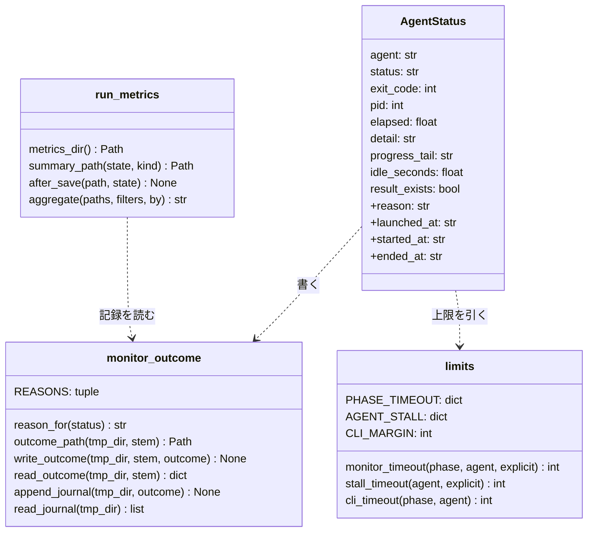

# #662 / #598 / #537 / #619 / #584 / #583: ファイルの形・コマンドの約束・実測・テスト設計

決定と構成は [issue-662-598-537-619-584-583-design.md](issue-662-598-537-619-584-583-design.md) にある。
この文書は設計文書の続きで、実装の Pull Request が突き合わせる形を持つ。判断の根拠にした実測を先に置く。

## 実測

2026-09-15 に `develop`（b4a9f69）で実行した。

**早期の致命検知は利用上限と CLI の上限の文言に一致しない**（`plugins/ndf/scripts/lib` で実行）:

```text
'Monthly request limit reached' -> err.log: None
'[agy] print timeout after 10m0s with turn in progress; retur' -> err.log: None
'{"type":"result","is_error":false,"api_error_status":429,...' -> err.log: None | claude stdout: False
'Error: quota exceeded' -> err.log: Error: quota exceeded
timeout 420 {'codex': 180, 'agy': 480, 'claude': 900, 'kiro': 480}
claude [['agy', 'kiro'], ['codex', 'kiro'], ['codex', 'agy'], ['agy', 'kiro']]
```

**グループで止めれば、止めた後に子プロセスが書かない。** 3 秒後に子プロセスが結果を書くシェルを、`nohup` だけ・
`nohup setsid`・`set -m` の 3 通りで起動して止めた。

```text
plain pid 89341 pgid 89340                    → _kill_pid の後に書かれた: True
setsid pid 89343 pgid 89343 cmdline /bin/bash ./child.sh  → killpg の後に書かれた: False
set -m pid 90093 pgid 90093 leader True       → killpg の後に書かれた: False
```

`setsid` と `set -m` のどちらでも pid が起動したコマンドそのもの（`cmdline` の照合がそのまま効く）で、グループの先頭になる。
`nohup` だけのときのグループは起動したシェルのものであり、グループへ送ると起動元まで止まる（AC62 の理由）。

**区切った待ちは Bash の呼び出しをまたいで終了コードを渡す。** 8 秒で終了コード 5 を返すコマンドを、試作の `bg-wait.sh run` で起動した。

| 呼び出し | 返った値 |
| --- | ---: |
| 同じ Bash の呼び出しで `wait --max-wait 3` | 124 |
| 別の Bash の呼び出しで `wait --max-wait 20` | 5 |

**要約の費用。** 実行中の cross-review（pr663、2 ラウンド）の状態ファイルで `measure.measure` を 100 回呼び、1 回あたり 0.01 ms 未満だった。
同じ実行の `cost.wall_clock_seconds` は 791 だった。

**投稿済みのレビューは見出しで引ける。** `gh api repos/devbasex/ai-plugins/pulls/663/reviews` の本文の先頭行を読んだ。
先頭行は `## 🤖 cross-review | round 1 | agy | APPROVE` の形で、ラウンドと担当が一意に決まる。

**cross-refactoring の修正の監視は上限を渡していない。** `SKILL.md:327-328`（`fix`）と `:348-349`（`final-fix`）の
`monitor.py` は `--timeout` を持たず、既定の 420 秒で止める。CLI の上限は 3600 秒で、テストの `MONITOR_TIMEOUT`
（`tests/test_launch_agy_phases.py`）は `fix` を 3600 と書いている。

## 構造

変更が触る型だけを載せる。



`+` の付いた欄が増える。`AgentStatus` の既存の欄は変えない（標準出力の 13 個のキーは既存の欄だけから作る）。

## データ構造

### 監視の結果ファイル `<stem>-monitor.json`（P1）

| キー | 型 | 値 |
| --- | --- | --- |
| `agent` | 文字列 | `codex` / `agy` / `claude` / `kiro` |
| `stem` | 文字列 | `--stem-template` を埋めた名前（ディレクトリを含まない） |
| `status` | 文字列 | `OK` / `TIMEOUT` / `NO_RESULT` / `EARLY_ERROR` / `STALLED` / `PIDFILE_BAD` |
| `exit_code` | 整数 | 0 / 2 / 3 / 4 / 5 / 6（`status` と 1 対 1） |
| `reason` | 文字列 | 下の「理由の語彙」 |
| `detail` | 文字列 | 標準出力の `detail` と同じ |
| `launched_at` | 文字列または `null` | pid ファイルの更新時刻 |
| `started_at` / `ended_at` | 文字列 | 監視の開始と終了 |
| `elapsed` / `idle_seconds` | 数 | 秒（小数 1 桁） |
| `progress_tail` | 文字列 | progress.log の最後の行 |
| `result_exists` | 真偽値 | 結果ファイルがあり、空でない |
| `pid` | 整数または `null` | pid ファイルの値 |

時刻はすべて `datetime.now(timezone.utc).astimezone().isoformat(timespec="seconds")` の形（`state.py` の `_now` と同じ）。
監視の記録 `monitor-outcomes.jsonl` は、この辞書を 1 行 1 つで追記する。`phase` のキーは P2 で足す（`--phase` の値。省略時は `null`）。

### 理由の語彙

**P3 の語彙と「P3 で足す文言」は、結果なしの理由を共通層の 1 か所で読む設計 [issue-729-619-584-design.md](issue-729-619-584-design.md) の「理由の語彙」「データ構造」「入出力の契約」へ移した。** 以下は 2026-09-15 時点の記録として残す（`unparsable` の追加と起動し直しの可否は新しい設計だけが持つ）。

**監視が書く理由**（`monitor_outcome.REASONS`）:

| 理由 | 状態 | 入る Pull Request | 何が起きたか |
| --- | --- | --- | --- |
| `ok` | `OK` | P1 | 結果ファイルがあって終わった |
| `timeout` | `TIMEOUT` | P1 | 監視の上限 |
| `stalled` | `STALLED` | P1 | 無進捗の許容 |
| `early_error` | `EARLY_ERROR` | P1 | 利用上限以外の致命の文言 |
| `usage_limit` | `EARLY_ERROR` | P3 | 利用上限の文言（P1 では `early_error`） |
| `cli_timeout` | `NO_RESULT` | P3 | 結果なしで終わり、err.log に CLI の上限の文言（P1 では `missing`） |
| `missing` | `NO_RESULT` | P1 | 結果なしで終わり、理由の文言が無い |
| `pidfile_bad` | `PIDFILE_BAD` | P1 | pid ファイルが無い・別のプロセス |

**状態ファイルの `no_result_reason`**（P3 の後）は、監視の理由が `ok` / `missing` 以外ならその値になる。
それ以外は従来の `missing` / `unparsable` / `no_verdict` / `not_posted` である。
`not_posted` は結果ファイルはあるが投稿が届いていないときで、監視は知りえないため監視の語彙に入れない。

**P3 で足す文言**（`EARLY_ERROR_FATAL` と同じ引用・表の除外を掛ける。**claude の stdout.log だけは除外を掛けない。** 決定 20 のとおり、既存の `CLAUDE_STDOUT_FATAL` と同じ JSON 向けの照合で見る）:

| 理由 | 見るファイル | 文言（正規表現） |
| --- | --- | --- |
| `usage_limit` | err.log | `Monthly request limit reached` |
| `usage_limit` | claude の err.log と stdout.log（新しい設計では全担当の err.log） | `"api_error_status"\s*:\s*429` |
| `usage_limit` | err.log（既存の一致を付け替え） | `quota exceeded` / `rate limit exceeded` / `^HTTP/\d\S* 429 ` |
| `early_error` | err.log（既存の一致を分ける） | `^HTTP/\d\S* (?:401\|403) ` |
| `cli_timeout` | err.log（終了後だけ） | `print timeout after \S+ with turn in progress` |

### 上限の表（P2）

| 工程 | 監視の上限（秒） | CLI の上限（秒） | 使う呼び出し |
| --- | ---: | ---: | --- |
| `review` | 1200 | 1320 | cross-review のレビュー |
| `critique` | 1200 | 1320 | cross-review の反証 |
| `propose` | 1200 | 1320 | cross-refactoring の提案とテスト整備の提案 |
| `judge-test-changes` | 1200 | 1320 | cross-refactoring の段 2 の判定 |
| `apply` | 3600 | 3720 | cross-refactoring の適用 |
| `fix` | 3600 | 3720 | cross-refactoring の修正 |
| `final-fix` | 3600 | 3720 | cross-refactoring の最終ゲートの修正 |

| 担当 | 無進捗の許容（秒） |
| --- | ---: |
| codex | 180 |
| agy | 480 |
| kiro | 480 |
| claude | 900 |

無進捗の許容の最大（900）< 監視の上限の最小（1200）< CLI の上限の最小（1320）で、全 28 組で順序が成り立つ。

### 実行の要約（P1）

置き場所: `<要約の置き場所>/<owner>--<repo>/<kind>-<pr|rf><id>-<開始時刻の UTC を YYYYMMDDTHHMMSSZ>.json`

| キー | 型 | 値 |
| --- | --- | --- |
| `schema` | 整数 | 1 |
| `kind` | 文字列 | `cross-review` / `cross-refactoring` |
| `repo` / `id` | 文字列 / 整数 | 状態ファイルの `repo`、cross-review は `pr_history[0].pr`、cross-refactoring は `id` |
| `ndf_version` | 文字列または `null` | `plugins/ndf/.claude-plugin/plugin.json` の `version` |
| `host` | 文字列 | 状態ファイルの `host` |
| `started_at` / `ended_at` / `last_saved_at` | 文字列 / `null` / 文字列 | タイムゾーン付き。タイムゾーンの無い時刻（cross-refactoring の `statefile.now`）は書き出す機械の地方時として付ける |
| `final` | 文字列または `null` | 状態ファイルの `final` |
| `wall_clock_seconds` | 整数または `null` | `ended_at` − `started_at` |
| `rounds[]` | 配列 | `round` / `kind`（cross-refactoring だけ）/ `started_at` / `ended_at`。`ended_at` はそのラウンドの `ended_at`、無ければ次のラウンドの `started_at`、最後のラウンドは全体の `ended_at` |
| `launches[]` | 配列 | 監視の記録の各行から `detail` を除いたもの |
| `measure` | オブジェクト | cross-review だけ。`measure.py` の出力 |
| `phases` | オブジェクト | cross-refactoring だけ。下の表 |
| `apply_attempts` | オブジェクト | cross-refactoring だけ。**D-C の P6（#665）が足し、P1 の時点では無い。** 下の形 |

`phases` の形（cross-refactoring）:

```json
{"test": {"propose": {"launches": 3, "cli_seconds": 412.0, "first_started_at": "…", "last_ended_at": "…"},
          "apply": {…}, "fix": {…}, "judge-test-changes": {…}, "other_seconds": 180},
 "structure": {…},
 "final-fix": {…}}
```

`apply_attempts` の形（cross-refactoring、P6 から）:

| 鍵 | 値 | 出どころ（状態ファイルの `rounds[].apply_rounds[]`） |
| --- | --- | --- |
| `"r<ラウンド>-g<群>"` | `{"attempts": 整数, "failed": 整数, "dropped_reason": 文字列または null}` | `attempt` / `failed_attempts` の件数 / `drop_reason`（P6 が足す） |

監視の記録からは作らない。群の番号を持たない stem（`{agent}-apply-r<R>`）からは群を引けないためである。

`other_seconds` はその種類のラウンドの所要の合計から `cli_seconds` の合計を引いた値で、進行側のテスト・取り込み・同期の時間である（決定 9）。

### stem から工程を読む規則

| stem の形 | 工程 | ラウンド |
| --- | --- | --- |
| `<agent>-review-pr<N>` | `review` | 状態の `rounds[]` を時刻で引く |
| `<agent>-critique-pr<N>` | `critique` | 同上 |
| `<agent>-propose-rf<N>-r<R>` | `propose` | `R` |
| `<agent>-apply-r<R>` | `apply` | `R` |
| `<agent>-fix-r<R>` | `fix` | `R` |
| `<agent>-judge-test-changes-r<R>-g<G>` | `judge-test-changes` | `R` |
| `<agent>-final-fix` | `final-fix` | なし |

P2 からは記録の `phase` を優先し、無い行（P1 の間の記録）だけこの規則で読む。

### 状態ファイルに増える鍵（P3）

| 場所 | 鍵 | いつ入るか |
| --- | --- | --- |
| `rounds[-1].<担当>` | `monitor_detail` | 結果なしを記録したとき、監視の結果ファイルがあれば |
| `rounds[-1].<担当>` | `prior_review_url` | 結果なしを記録したとき、投稿済みのレビューが見つかれば |

鍵を足すだけで、既存の鍵の意味と `NO_RESULT` の判定は変えない。

## 入出力の契約

### `monitor.py`

| 引数・環境変数 | Pull Request | 約束 |
| --- | --- | --- |
| `--phase <工程>` | P2 | 上限の表の工程名。表に無い名前は終了コード 1（USAGE） |
| `--timeout N` | 既存 | 与えれば最優先 |
| `MONITOR_TIMEOUT_<担当>` / `MONITOR_TIMEOUT` | P2 / 既存 | この順で監視の上限を上書きする |
| `--stall-timeout` / `MONITOR_STALL_<担当>` / `MONITOR_STALL` | 既存 | 解決の順は変えない。解決後に監視の上限以上なら警告（AC33） |
| 標準出力・終了コード | 既存 | 変えない（決定 16） |
| 一時ディレクトリの書き出し | P1 | 結果ファイルと記録。書けなければ標準エラーへ 1 行 |

### `limits.py`（P2）

```text
limits.py cli-timeout <工程> <担当>      # 秒数を 1 行。監視の上限は環境変数を解決した値
limits.py monitor-timeout <工程> <担当>  # 同上
limits.py check                          # 表の順序を検査する。崩れていれば組を出して終了コード 1
```

### `launch-cli.sh` の第 7 引数（P2）

| 渡す値 | CLI の上限 |
| --- | --- |
| 空 | `apply` の値（変更前の既定 3600 秒を覆う） |
| 工程名 | `limits.py cli-timeout <工程> <担当>`。`limits.py` が受けるのは上限の表の 7 つの名前だけで、それ以外は終了コード 1 |
| 数字 | その秒数（従来どおり） |

**工程名の正規化は呼び出し側が行う。** cross-refactoring の `launch-cli.sh` はフェーズ `propose-tests` を `propose` に置き換えてから第 7 引数へ渡す。骨組みの `monitor.py` にも `--phase propose` を渡す（テスト整備の提案と構造改善の提案は同じ上限を使う）。`limits.py` に別名を持たせないのは、表の名前と実際に効く上限を 1 対 1 に保つためである。

### `bg-wait.sh`（P2）

```text
bg-wait.sh run <rc ファイル> -- <コマンド> [引数…]   # 直ちに 0。標準出力と標準エラーは <rc>.log
bg-wait.sh wait <rc ファイル> [--max-wait <秒>]       # 既定 540、上限 540。終わっていれば終了コード、まだなら 124
```

`run` は起動の前に古い rc ファイルを消す。rc ファイルは一時ファイルへ書いてから置き換える（読みかけの空のファイルを返さない）。

### `state.py`（P1 / P3）

| コマンド | 変わる出力 |
| --- | --- |
| `report` | 末尾に `計測の要約: <絶対パス>` か `計測の要約: 書いていません（<理由>）`（P1）。ラウンド表で `<担当>=NO_RESULT(<理由>)`（P3） |
| `read-result` | 結果なしの記録に `no_result_reason` の理由・`monitor_detail`・`prior_review_url`（P3）。終了コードは変えない |
| `judge` | `NO_RESULT_REASONS='<担当>=<理由> …'` を結果なしがあるとき出す。`usage_limit` を含めば `final=error` と終了コード 1（P3）。終了コード 0 / 2 / 7 / 8 と 8 の `flush` の枝は変えない |

### `launch-reviewer.sh` の記録だけの起動（P3）

`rounds[-1].<担当>.prior_review_url` があるとき、プロンプトの「投稿」の節を次に差し替える。**それ以外の節（読む範囲・
payload と結果ファイルの形・守るべきこと）は変えない。**

- `gh api` で `<prior_review_url>` のレビューとそのインラインコメントを読む
- **新しいレビューを投稿しない**
- 読んだ指摘を payload の `comments[]` に書き、結果ファイルの `review_url` に `<prior_review_url>`、`event` にレビューの見出しの判定を書く

### `run_metrics.py`（P1）

```text
run_metrics.py aggregate [--since <日付>] [--until <日付>] [--repo <owner>/<repo>] [--kind <種類>]
                         [--version <版>] [--by total|round-count|reason] [--dir <置き場所>]
```

| `--by` | 行 |
| --- | --- |
| `total`（既定） | `kind` ごとと「終わっていない」 |
| `round-count` | cross-review のラウンド数 1 / 2 / 3 以上 |
| `reason` | `kind` × 担当 × 理由の起動回数 |

出力は Markdown の表である。読めない要約は件数を 1 行出して飛ばす。

## 変わるファイル

```text
plugins/ndf/scripts/lib/
  monitor_outcome.py     P1 新設（P3 で語彙）
  run_metrics.py         P1 新設
  limits.py              P2 新設
  monitor.py             P1 / P2 / P3
  launch-cli.sh          P1 / P2 / P3
  statefile.py           P1
  README.md              P1 / P2（置いてあるものの表）
plugins/ndf/skills/cross-review/
  SKILL.md               P1（:41）/ P2（骨組みの待ち）/ P3（起動し直しの経路）
  docs/01-state-and-review.md   P2 / P3（理由の表）
  docs/03-review-output.md      P2（:104）/ P3（上限に当たった場合の見分け方）
  docs/04-contracts.md          P1（一時ディレクトリのファイル）/ P3（状態の鍵）
  scripts/state.py       P1 / P3
  scripts/measure.py     P1
  scripts/bg-wait.sh     P2 新設
  scripts/launch-reviewer.sh    P2 / P3
  scripts/critique.sh / critique-round.sh / wait-review.sh   P2
  tests/                 P1〜P3
plugins/ndf/skills/cross-refactoring/
  SKILL.md, docs/01-state-and-propose.md, docs/02-apply-and-review.md, docs/04-fix-and-report.md   P2（monitor.py の引数）
  scripts/launch-cli.sh  P2（PRINT_TIMEOUT）
  scripts/refactor.py    P1（差し込み口の登録）
  scripts/refactor_lib/measure.py        P1 新設
  scripts/refactor_lib/commands/report.py  P1（要約の行）
  tests/test_launch_agy_phases.py  P2
plugins/ndf/skills/merged/SKILL.md  P1（手順 4）
conftest.py              P1（NDF_METRICS_DIR）
# dev.kiro / dev.agy の配布物は bash scripts/build-runtime-plugins.sh で同期する
```

## テスト設計

| 受け入れ条件 | 何で確かめるか |
| --- | --- |
| AC1〜AC4 | 偽の CLI（結果を書く / 書かない / pid ファイルを作らない）を監視し、結果ファイルのキー・理由・`launched_at` を読む（`test_monitor_outcome_file.py`） |
| AC2 | 同じ stem を 2 回監視し、記録の行数が 2 |
| AC5 | 既存の `test_monitor_*.py` を変更せずに通す。標準出力の各行のキー集合を固定するテストを足す |
| AC6 | 一時ディレクトリを読み取り専用にして監視し、終了コードと標準出力を比べる |
| AC7 | `launch-cli.sh` を偽の CLI で起動する前に結果ファイルを置き、起動後に無く、記録は残る |
| AC8 / AC9 / AC11 / AC12 / AC15 | 一時ディレクトリの状態ファイルで `state.py start-round` と `refactor.py start-round` を呼び、要約のパスとキー。作業ツリーの相当ディレクトリを消した後に読む |
| AC10 | 3 つの環境変数の組み合わせ 4 通りと `NDF_METRICS=0` |
| AC13 / AC18 | 要約の `measure` と、`measure.py` を別に呼んだ出力が一致する。既存の `test_measure.py` を変更せずに通す |
| AC14 | 監視の記録を手で書いた一時ディレクトリで `refactor_lib.measure` を呼び、工程ごとの起動回数・秒。要約に `apply_attempts` の鍵が無い（P6 が足す） |
| AC16 | 差し込み口が例外を投げるよう差し替え、`state.py judge` の終了コードと標準出力が同じ |
| AC17 | 要約の JSON 全体に、状態ファイルの `review_instructions` と記録の `detail` の文字列が含まれない |
| AC19〜AC22 | 手で作った要約 6 件（壊れた 1 件を含む）で `aggregate` の表の値 |
| AC23 / AC24 | `report` の最後の行。文書の文言を `grep` するテスト |
| AC30 / AC31 | `limits.py check` の終了コード 0 と、表の全 28 組を並べるテスト |
| AC32 / AC33 | 環境変数と `--timeout` / `--stall-timeout` の組み合わせで `monitor.py` の標準エラーの `hard timeout` の値と警告の行。`--phase apply --stall-timeout 1800` で警告なし、`--phase apply --stall-timeout 3600` で警告あり |
| AC34 / AC35 / AC36 | 引数を書き出す偽の agy で `--print-timeout` の値（`test_launch_agy_phases.py` の形を共通層にも） |
| AC37 / AC38 / AC42 | 文書の `grep` の件数 |
| AC39 / AC40 | `bg-wait.sh` を `sleep` のコマンドで起動し、124・終了コード・541 の丸め |
| AC41 | `SKILL.md` の骨組みから `monitor.py` と `critique-round.sh` の行を取り出し、`bg-wait.sh run` の中にあることを確かめる |
| AC50〜AC54 | 各文言を 1 行書いた err.log / stdout.log と、表・引用・バッククォートの形で `monitor_agent` の状態と理由 |
| AC55 / AC64 | 結果ファイル無し + 監視の結果ファイル（各理由）/ 無し、偽の `gh` の成功と失敗で `read-result` の状態と終了コード |
| AC56〜AC59 | 状態ファイルを作って `judge` と `report` を呼ぶ |
| AC60〜AC62 | 3 秒後に子が書く偽の CLI を `launch-cli.sh` で起動し、pgid と、監視の上限 2 秒で止めた後の結果ファイルの有無。先頭でない pid では `os.killpg` が呼ばれない |
| AC63 / AC65 / AC66 | 偽の `gh` のレビュー一覧（見出しの一致・ラウンド違い・担当違い）で `prior_review_url` と、`launch-reviewer.sh` のプロンプトの文言 |
| AC67 | `SKILL.md` の骨組みで、起動の行から判定の行までの間に `verify-findings` と `critique-round.sh` があり、起動し直しの専用の分岐が無い。各判定の直後に終了コード 8 の `flush` の枝がある |
| AC68 / AC69 | 文書の `grep` |
| AC70〜AC72 | 検証手段の表のコマンド。AC72 はテストの前後で `find` |
