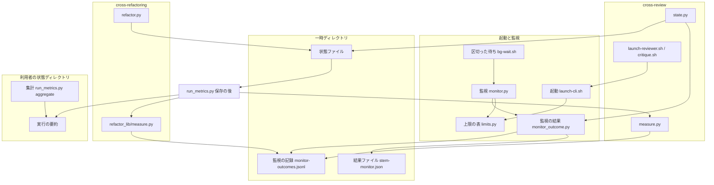
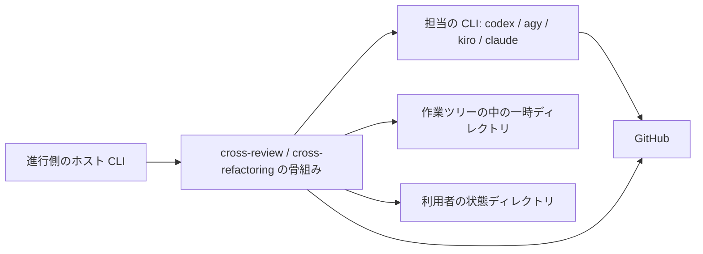
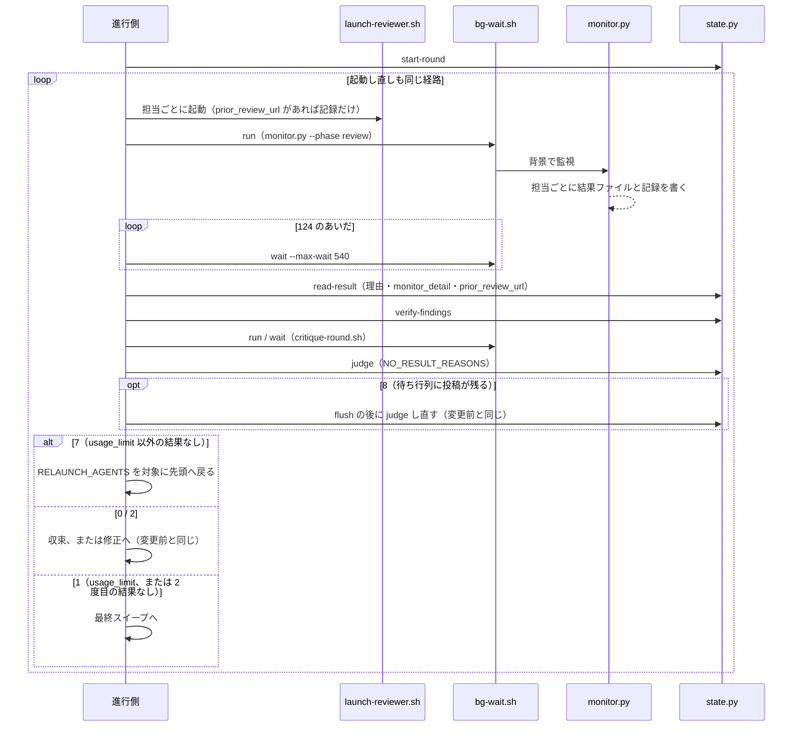
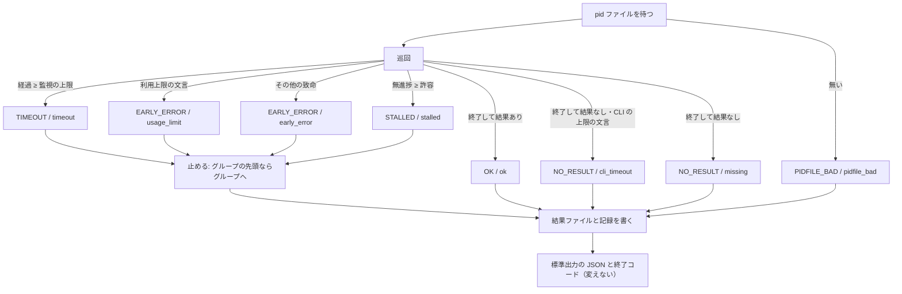
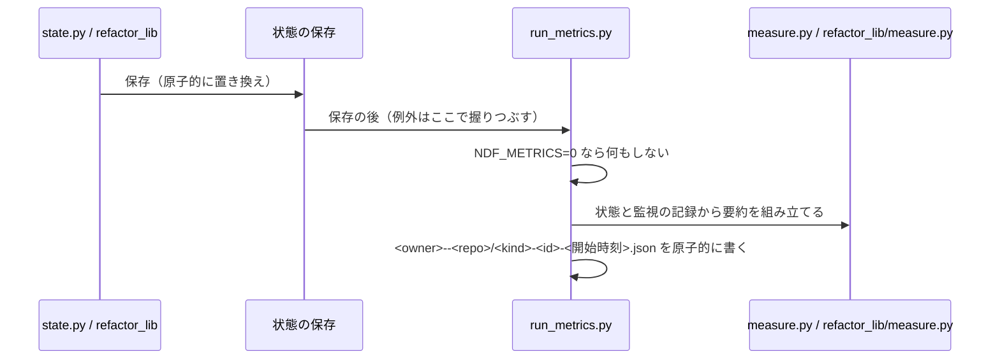

# #662 / #598 / #537 / #619 / #584 / #583: 監視の結果を残し、上限の順序を決め、打ち切りの後に結果を失わない

要求と受け入れ条件は [issue-662-598-537-619-584-583-requirements.md](issue-662-598-537-619-584-583-requirements.md) にある。
この文書は「どう作るか」だけを扱う。
ファイルの形・コマンドの約束・実測・テスト設計は、[契約の文書](issue-662-598-537-619-584-583-design-contracts.md) にある。

**実装は 3 本の Pull Request に分け、P1 → P2 → P3 の順にマージする**（決定 1）。

| Pull Request | 課題 | 中身 | 受け入れ条件 |
| --- | --- | --- | --- |
| P1 | #662 | 監視の結果ファイルと監視の記録、実行の要約、集計 | AC1〜AC24、AC70〜AC72 |
| P2 | #598 + #537 | 上限の表、CLI の上限の導出、600 秒を超える待ち方 | AC30〜AC42、AC70〜AC72 |
| P3 | #619 + #584 + #583 | 理由の区別と利用上限での停止、プロセスグループの停止、投稿済みの担当の記録と証拠集約の経路 | AC50〜AC69、AC70〜AC72 |

## 機能一覧

| # | 機能 | 誰が使うか | Pull Request |
| --- | --- | --- | --- |
| 1 | 担当 1 者ごとの監視の結果を、一時ディレクトリへファイルとして残す | 状態を読むスクリプト（`state.py` / D-C の `refactor_lib`） | P1 |
| 2 | 1 回の実行の所要と結末を、作業ツリーの外へ要約として残す | 改善の効き目を比べる利用者 | P1 |
| 3 | 要約を期間・リポジトリ・版・ラウンド数・理由で束ねて出す | 同上 | P1 |
| 4 | 監視の上限・無進捗の許容・CLI の上限を 1 つの表から決める | 両 Skill の起動と監視 | P2 |
| 5 | 600 秒を超える監視を、区切った待ちで待つ | Claude Code をホストにした進行側 | P2 |
| 6 | 結果なしの理由を、監視の結果から区別して記録・報告する | 進行側と利用者 | P3 |
| 7 | 利用上限の担当を起動し直さずに止める | 進行側 | P3 |
| 8 | 監視が止めた担当の子プロセスに書き出させない | 収束ループ | P3 |
| 9 | 投稿の後に止まった担当を、重ねて投稿させずに記録させる | 収束ループ | P3 |

## 決定の記録

決定 1 は分け方、決定 2〜9 は P1、決定 10〜13 は P2、決定 14〜20 は P3 を扱う。

### 決定 1: 3 本の Pull Request に分け、#662 を先に入れる

#662 を先に入れると、#598 / #537 で上限を変える前の所要と結末を、変えた後と同じ形で取れる（前提 1）。
P3 の理由の区別は P1 の監視の結果ファイルを読むため、P1 より後に置く。P2 と P3 は独立に作れるが、P3 の
`cli_timeout` の検知は P2 の CLI の上限の導出と同じ実行で確かめたいため、P2 を先にする。

1 本にまとめる形は採らない。計測の土台が入る前に上限が変わり、比べる前の値が取れない。

### 決定 2: 監視の結果を、担当ごとの結果ファイルと追記だけの記録の 2 つで残す

`<stem>-monitor.json` は「その担当の最後の監視の結果」で、`read-result` が理由を引くときに stem から 1 つに決まる。
`monitor-outcomes.jsonl` は起動し直しや群の繰り返しで同じ stem が上書きされても過去を失わない記録で、計測が読む。
cross-refactoring の適用の stem（`{agent}-apply-r<N>`）は群の番号を持たず、群ごとに `launch-cli.sh` が消す。
そのため結果ファイルだけでは、2 つ目の群が 1 つ目の結果を消す。

状態ファイルへ監視の結果を写す形は採らない。写す箇所が `read-result`・`collect-critiques`・cross-refactoring の
取り込み 5 か所に分かれ、D-B / D-C が並行して変える関数に手が入る。

### 決定 3: 理由（`reason`）を P1 から結果ファイルに置き、P1 では状態からの対応だけを入れる

D-C は cross-refactoring の開き直しを理由で分ける。語彙の欄が P1 で固まっていれば、D-C は P3 を待たずに
`timeout` / `stalled` / `early_error` / `missing` で分岐を書ける。P3 は値の種類を増やす（`usage_limit` と
`cli_timeout` に細かくする）だけで、欄の意味を変えない。語彙は契約の文書の「理由の語彙」にある。

理由の欄を P3 で足す形は採らない。D-C が P1 の `status` で書いた分岐を、P3 の後にもう一度書き直す。

### 決定 4: 語彙と結果ファイルの読み書きを共通層の `monitor_outcome.py` 1 つに置く

書く側（`monitor.py`）と読む側（`state.py` / `refactor_lib` / 要約）が同じ定数と関数を使う。
語彙を `monitor.py` に置くと、読む側が監視の実体を読み込むことになる。`monitor.py` はシム
（`cross-review/scripts/monitor.py` が `exec` する）からも読み込まれるため、読み込みの経路が 2 通りになる。

### 決定 5: 実行の要約を、状態ファイルを保存するたびに書き直す

#662 で結末の分からなかった 71 件は、報告の処理まで届かなかった実行である。終了のときだけ書くと、
同じ実行がまた要約を持たない。保存のたびに書けば、途中で止まった実行も最後に保存した時点
（`last_saved_at`）と `final: null` を持つ。書き直しの費用は、実物の状態ファイルで `measure.measure` が
1 回 0.01 ms 未満である（契約の文書の「実測」）。

終了の処理（`report` / `final` の書き込み）で書く形は採らない。中断した実行が残らない。

### 決定 6: 要約の置き場所を利用者の状態ディレクトリにする

`NDF_METRICS_DIR` → `$XDG_STATE_HOME/ndf/metrics` → `$HOME/.local/state/ndf/metrics` の順に決める。
その下を `<owner>--<repo>/` で分ける。`development-workflow` の控え（`wf_state_dir`）が同じ `ndf/` の下に置いている。

採らない案と理由:

- **`~/.ndf/metrics/`（#662 の例）。** 既に使っている状態ディレクトリと別の場所が増える
- **`CLAUDE_PLUGIN_DATA`。** Claude Code だけが設定し、ホストが codex / kiro / agy の実行と置き場所が分かれる
- **git の共通ディレクトリ（`.git/ndf/`）。** 作業ツリーの削除では消えないが、clone をやり直すと消え、
  リポジトリをまたいで束ねるには clone を 1 つずつ探すことになる

### 決定 7: 要約にプロンプト・本文・`detail` を入れない

`detail` は err.log の致命の行の抜粋（最大 200 文字）で、認証の失敗の行に鍵の一部が出うる。集計に要るのは
理由と時刻だけである。`detail` は一時ディレクトリの結果ファイルと、状態ファイルの `monitor_detail`（P3）に残る。

### 決定 8: cross-review の要約は `measure.py` の出力を包み、測定そのものは変えない

#662 の提案 3 のとおり、`measure` に `measure.py` の出力をそのまま置き、所要と結末の欄を外側に足す。
`measure.py` の出力の形を変えると、#156 の測定の比較が崩れる（AC18）。

### 決定 9: cross-refactoring の工程の所要は監視の記録から組み立てる

提案・適用・修正・段 2 の判定・最終ゲートの修正は、どれも監視を通る。監視の記録の stem から工程とラウンドが
決まり（契約の文書の「stem から工程を読む規則」）、ラウンドの種類（テスト整備 / 構造改善）は状態ファイルの
`rounds[].kind` が持つ。`refactor_lib` の取り込み（D-C の範囲）へ時刻の記録を足さずに済む。

**進行側が回すテストの所要は直接は測らない。** ラウンドの開始から次のラウンドの開始までのうち、CLI の時間を
除いた残りとして出す（契約の文書の `other_seconds`）。

### 決定 10: 監視の上限は工程で決め、無進捗の許容は担当で決める

必要な時間は工程（レビューか適用か）で桁が変わり、ログの出し方は担当（claude は完了まで出さない）で変わる。
2 つを別の軸に置けば、表は工程 7 行と担当 4 行で足りる。担当ごとの監視の上限は、既定の表には持たず
`MONITOR_TIMEOUT_<担当>` の上書きだけを受ける（#598 の提案 2 の解決順）。

全工程 × 全担当の組で「無進捗の許容 < 監視の上限 < CLI の上限」をテストで固定する（AC31）。

**例外として、cross-refactoring の `apply` / `fix` / `final-fix` の監視には、骨組みが `--stall-timeout` を渡す**（D-C の P6、#665 の決定 13）。
値は `init` が出す `IMPL_STALL_TIMEOUT`（`--test-timeout` + 900。既定 1800 秒）である。適用と修正の担当はテストを 1 回実行し、
その間は何も出力しない。無出力の最長が担当ではなく工程（テストの上限）で決まるため、担当の軸の表では表せない。

| 突き合わせる条件 | 例外との関係 |
| --- | --- |
| AC31（既定の組の順序） | 固定するのは `limits.py` の表の既定値の 28 組だけで、引数の上書きは含まない。例外の既定 1800 秒も、3 工程の監視の上限 3600 秒より小さい |
| AC33（許容 ≥ 上限の警告） | `--stall-timeout` の引数も解決の対象に含める。`--test-timeout` を 2700 以上にするか、監視の上限を 1800 以下へ上書きすると警告が出る |

表の既定値を工程と担当の 2 軸にする形は採らない。テストの上限は実行ごとの引数（`--test-timeout`）で、表に置けない。

### 決定 11: レビュー・反証・提案・段 2 の判定の監視の上限を 1200 秒にする

**下限は無進捗の許容の最大値（claude の 900 秒）である。** 下回ると claude の無進捗の許容が効かない。
実測では agy のレビューは 465〜480 秒で完了し、10 分の CLI の上限では終わらない差分があり、1800 秒では
通った（#598 / #537）。1200 秒は 900 秒を上回る値のうち、ラウンドあたりの最悪の待ち（レビュー 2 回 + 反証 2 回）を
80 分に抑える値である。**足りるかは P1 の要約で測る**（「未確認のまま残ること」）。

cross-refactoring の提案（変更前 900 秒）も 1200 秒に揃える。900 秒のままだと claude の無進捗の許容と
同じ値になり、順序の検査が通らない。提案の実測は 90〜285 秒で、上限に届く実行は無い。

採らない案と理由:

- **1800 秒。** 1 ラウンドの最悪の待ちが 2 時間になり、#662 の cross-review の p90（105 分）を 1 ラウンドで超える
- **540 秒（1 回の Bash に収める）。** agy の 615 秒の実行が終わらない

### 決定 12: CLI の上限を、監視の上限 + 120 秒として導く

CLI の上限を独立に持つと、利用者が `MONITOR_TIMEOUT` だけを延ばしたときに CLI が先に打ち切る（#537 の形）。
導出にすれば、監視の上限をどう上書きしても順序が崩れない。120 秒は監視の 1 周期（15 秒）と停止の猶予
（3 秒）に対して十分な差で、監視が止める前に CLI が打ち切ることが無い。

`launch-cli.sh` の第 7 引数は工程名を受け、数字を渡したときは従来どおりその秒数を使う（呼び出し側の互換）。
`NDF_CRITIQUE_PRINT_TIMEOUT` は導出値より小さければ導出値へ引き上げる（AC35）。

### 決定 13: 600 秒を超える待ちを、背景の起動と 540 秒で区切った待ちにする

Claude Code の Bash ツールは 1 回 600 秒で打ち切る。`bg-wait.sh run` が監視を背景で起動して終了コードを
rc ファイルへ書かせ、`bg-wait.sh wait` が最大 540 秒待って 124 か終了コードを返す。進行側は 124 が返る
あいだ同じ待ちを呼び直す。rc ファイルがあるので、待ちの呼び出しをまたいでも終了コードを失わない
（契約の文書の「実測」）。

置き場所は cross-review の `scripts/` にする。いま使うのは cross-review だけで、共通層は 2 つ以上の読み手の
部品を置く（`plugins/ndf/scripts/lib/README.md`）。cross-refactoring の待ちは #656 が扱う。

採らない案と理由:

- **Claude Code の `run_in_background` と待ちの道具。** ホストが codex / kiro / agy のときに同じ書き方ができない
- **監視を 540 秒ごとに打ち切って起動し直す。** 監視の経過時間と無進捗の起点が切れ目で失われる

### 決定 14: 利用上限は致命として止め、同じラウンドで起動し直さない

利用上限は起動し直しても解けず、起動し直すたびに待ちと相手の CLI の枠を使う（#619、#647 の 3729 回）。
監視は `EARLY_ERROR`（終了コード 4）として止め、理由を `usage_limit` にする。判定は結果なしの担当の理由に
`usage_limit` があれば、起動し直さずに `final=error` で終わり、担当と理由と `monitor_detail` を出す。

残りの担当だけで回し続ける形は採らない。担当を外す手段は #478（D-B）が決める。

### 決定 15: CLI の上限は結果なし（終了コード 3）のまま、理由だけを `cli_timeout` にする

agy は上限に当たると終了コード 0 で終わり、結果ファイルを書かない。監視の状態としては「終わったが結果が無い」
で正しい。終了コードを分けると、終了コードで分岐する D-C の設計と既存の骨組みが変わる。

### 決定 16: 監視の終了コードと標準出力を変えない

終了コード 0〜6 の意味と、標準出力の 13 個のキーはそのままにする。増える情報は結果ファイルと記録へ出す。
D-C はこの前提で cross-refactoring の骨組みを設計する。

### 決定 17: CLI を独立したプロセスグループで起動し、グループへシグナルを送る

`launch-cli.sh` が `set -m` を有効にしてから背景で起動すると、CLI の pid がそのままプロセスグループの番号に
なる。監視は pid がグループの先頭であり、かつ監視自身のグループと違うときだけ `os.killpg` を使い、それ以外は
従来どおり pid だけへ送る。止めた後に子プロセスが結果を書く形は、この形で起きなくなった（契約の文書の「実測」）。

採らない案と理由:

- **`setsid` コマンド。** 同じ効果を確かめたが、macOS に標準で入っていない
- **`read-result` の前に結果ファイルの出現を上限付きで待つ（#584 の候補 2）。** 止めた後の書き出しを受け入れる
  形で、書き出しが上限を越えれば同じ問題が残る。書き出しそのものを止めれば待つ理由が無い

### 決定 18: 投稿済みのレビューを持つ担当は、記録だけを行う形で起動し直す

結果なしの担当について、`read-result` がそのラウンドの見出しを持つその担当のレビューを探し、見つかれば
`prior_review_url` に残す。起動し直すとき、`launch-reviewer.sh` はレビューの投稿の手順を外し、そのレビューを
読んで payload と結果ファイルを書く指示へ差し替える。結果ファイルの `review_url` はそのレビューを指すため、
投稿の確認（`_verify_review_arrival`）はそのまま通る。

採らない案と理由:

- **進行側が GitHub のレビューから結果ファイルを作る。** payload が求める根拠・反証条件はレビューの本文に
  揃っていない。書いた担当に書き起こさせるほうが欠けが少ない
- **起動し直さずに投稿済みの判定だけを採る。** 指摘の記録（`review_findings`）が空のまま判定へ進む

### 決定 19: 起動し直した担当を、初回と同じ経路（証拠集約を含む）に通す

骨組みの起動し直しの分岐を、別の短い経路ではなく「起動 → 待ち → 取り込み → 根拠の検証 → 反証 → 判定」の
繰り返しの先頭へ戻す形にする。経路が 1 つなら、証拠集約を飛ばす分岐が構造として無くなる（AC67）。
2 度目の取り込みで印（`evidence_rounds`）と `critique_relaunched` をどう扱うかは D-B が決める（「申し送り」）。
判定の終了コード 8（待ち行列を流して判定し直す枝）は動かさない。繰り返しの中の各判定の直後に置き、7 の判定より先に見る変更前の順序を保つ。

### 決定 20: 利用上限の検知は err.log に加え、claude だけ stdout.log も見る

claude の `"api_error_status":429` がどちらのファイルに出るかは未確認である（前提 4）。既存の
`CLAUDE_STDOUT_FATAL` と同じく、claude の stdout.log は JSON 向けの照合（引用の判定を掛けない）で見る。
kiro の `Monthly request limit reached` は err.log だけを見る（#619 の実物）。

## 構成要素

| 要素 | 新設 / 変更 | 責務 | Pull Request |
| --- | --- | --- | --- |
| 監視の結果（`lib/monitor_outcome.py`） | 新設 | 理由の語彙、状態から理由への対応、結果ファイルと記録の読み書き | P1（P3 で語彙を 2 つ足す） |
| 実行の要約（`lib/run_metrics.py`） | 新設 | 置き場所の解決、要約の書き出し、保存の後の差し込み口、集計のコマンド | P1 |
| cross-refactoring の測定（`refactor_lib/measure.py`） | 新設 | 状態と監視の記録から工程ごとの所要を組み立てる（群の試行の `apply_attempts` は D-C の P6 が足す） | P1 |
| 上限の表（`lib/limits.py`） | 新設 | 工程ごとの監視の上限・担当ごとの無進捗の許容・CLI の上限の導出と、その表示のコマンド | P2 |
| 区切った待ち（`cross-review/scripts/bg-wait.sh`） | 新設 | 背景の起動と、540 秒以内に区切った待ち | P2 |
| 監視（`lib/monitor.py`） | 変更 | 結果ファイルと記録の書き出し（P1）、`--phase` と上限の表（P2）、利用上限と CLI の上限の検知・グループの停止（P3） | P1〜P3 |
| 起動（`lib/launch-cli.sh`） | 変更 | 結果ファイルの残骸の削除（P1）、工程名から CLI の上限（P2）、`set -m`（P3） | P1〜P3 |
| 状態の保存（`lib/statefile.py`） | 変更 | 保存の後の差し込み口を呼ぶ | P1 |
| cross-review の状態（`state.py`） | 変更 | 保存のたびの要約（P1）、報告の要約の行（P1）、理由と `prior_review_url` の取り込み・判定の理由と利用上限・報告の表（P3） | P1 / P3 |
| cross-review の測定（`measure.py`） | 変更 | 要約の組み立て（`summary`）を足す。`measure` の出力は変えない | P1 |
| レビューの起動（`launch-reviewer.sh`） | 変更 | 工程名 `review`（P2）、記録だけの起動（P3） | P2 / P3 |
| 反証の起動と 1 ラウンド（`critique.sh` / `critique-round.sh`） | 変更 | 工程名 `critique` と `--phase critique` | P2 |
| cross-review の骨組み（`SKILL.md` / `docs/`） | 変更 | 区切った待ち（P2）、起動し直しの経路（P3）、上限と理由の説明 | P1〜P3 |
| cross-refactoring の起動と骨組み（`launch-cli.sh` / `SKILL.md` / `docs/`） | 変更 | 工程名から CLI の上限、`monitor.py` の呼び出しを `--phase` に | P2 |
| cross-refactoring の入口と報告（`refactor.py` / `commands/report.py`） | 変更 | 差し込み口の登録、報告の要約の行 | P1 |
| テストの共通設定（リポジトリ直下の `conftest.py`） | 変更 | `NDF_METRICS_DIR` を一時ディレクトリへ向ける | P1 |

`run_metrics.py` は保存の後の差し込み口と集計のコマンドの 2 つの入口を持つため、図では 2 つの箱に分けた。
**図に含めない要素**は次の 4 つである。

| 要素 | 図との関係 |
| --- | --- |
| 状態の保存（`statefile.py`） | 「状態ファイル → 保存の後」の辺にあたる |
| 骨組みと文書 | 手順の記述で、呼び出しの辺を持たない |
| cross-refactoring の起動と骨組み | `launch-reviewer.sh` と同じく起動へつながる |
| テストの共通設定 | 実行時の依存ではない |

## 文脈と配置

| 実行の単位 | どこで動くか | 境界 |
| --- | --- | --- |
| 担当の CLI | 背景のプロセス（P3 から独立したプロセスグループ） | 作業ツリーと一時ディレクトリの中 |
| 監視 | 進行側のシェルから起動する Python。P2 から `bg-wait.sh` の背景 | 一時ディレクトリを読み書きする |
| 状態の操作と要約の書き出し | 進行側が 1 コマンドずつ呼ぶ Python | 状態ファイルは作業ツリーの中、要約は外 |
| 集計 | 利用者が手で呼ぶ Python | 利用者の状態ディレクトリだけを読む |

**作業ツリーを消して残るのは、利用者の状態ディレクトリの要約だけである。** 結果ファイル・監視の記録・
状態ファイルは作業ツリーとともに消える。

## 処理の流れ

### cross-review の 1 ラウンド（P2 と P3 の後）

### 監視の 1 担当（P1〜P3）

`usage_limit` と `cli_timeout` の枝は P3 で入る。P1 では `usage_limit` は `early_error`、`cli_timeout` は `missing` に落ちる。

### 状態の保存と要約（P1）

`state.py` は自前の `_save` を持つため、`_save` の末尾から同じ関数を呼ぶ。cross-refactoring は
`statefile.save` の差し込み口に `refactor.py` が起動時に登録する。

## 非機能の実現方式

| 条件 | 実現方式 |
| --- | --- |
| 要約の書き出しが保存 1 回あたり 50 ms 未満 | 読むのは状態ファイル（既に手元の辞書）と監視の記録 1 ファイルだけ。GitHub へ問い合わせない |
| 監視の結果が作業ツリーの削除後も残る | 保存のたびに `launches[]` として要約へ写す（決定 5） |
| 要約がコミットされない・秘密を含まない | リポジトリの外に置き（決定 6）、本文と `detail` を落とす（決定 7） |
| 書き出しの失敗で進行を止めない | 差し込み口で例外を受けて標準エラーへ 1 行出すだけにする（AC16） |
| macOS でもグループで止める | 外部コマンドに頼らない `set -m` を使う（決定 17。bash 3.2 は未確認） |

## 申し送り（並行する設計との境界）

| 相手 | 決めた契約 | どちらが何をするか |
| --- | --- | --- |
| D-C（#647 #592 #553） | 監視の結果ファイルと記録の形、理由の語彙（契約の文書）。終了コード 0〜6 は変えない | D-A が P1 で形と `ok`/`timeout`/`stalled`/`early_error`/`missing`/`pidfile_bad`、P3 で `usage_limit`/`cli_timeout` を入れる。D-C は `monitor_outcome.read_outcome` で読む |
| D-C | cross-refactoring の `SKILL.md` と `docs/` の `monitor.py` の呼び出し 8 か所の**引数**と、`launch-cli.sh` の `PRINT_TIMEOUT` の行 | D-A（P2）が `--phase` へ変える。D-C は監視の上限（`--timeout`）の値を書かない。骨組みのそれ以外の行は D-C |
| D-C（#665 の P6） | `apply` / `fix` / `final-fix` の監視の呼び出しに `--stall-timeout "$IMPL_STALL_TIMEOUT"` を足す（決定 10 の例外） | P6 が P2 の `--phase` の行へ足す。D-A はこの許容を表に持たず、許容が監視の上限以上になる組は P2 の警告（AC33）が知らせる |
| D-C | `refactor.py` の差し込み口の登録と `commands/report.py` の要約の行 | D-A（P1）が足す。`refactor_lib/commands/apply.py` などの取り込みには時刻の記録を足さない（決定 9） |
| D-C（#665 の P6） | 要約の `apply_attempts`（契約の文書の「実行の要約」） | P6 が、状態ファイルの群に足す `attempt` / `failed_attempts` / `drop_reason` から作り、`refactor_lib/measure.py` へ足す。P1 の要約はこの鍵を持たない |
| D-B（#624 #478 #648） | 起動し直した後に `verify-findings` → `critique-round.sh` を再び通す（決定 19） | D-A（P3）が骨組みを変える。2 度目の取り込みでの印と `critique_relaunched` の扱いは D-B |
| D-B | 判定が出す `NO_RESULT_REASONS` の行と、`usage_limit` で起動し直さないこと | D-A（P3）が入れる。利用上限の担当を外して回す判断は D-B（#478） |
| D-B | `state.py` の `_save` の末尾の 1 呼び出し、`read-result` と `_handle_no_result_round` と `report` の変更 | D-A が持つ。`_new_finding_count` / `_mark_evidence_round` / 除外と再開の引数は D-B |
| #656（マイルストーン 06） | `bg-wait.sh` の形 | cross-refactoring の待ちへ使うか、共通層へ移すかは #656 が決める |

## 未確認のまま残ること

| # | 項目 | 内容 | 決める時点 |
| --- | --- | --- | --- |
| 1 | 1200 秒で足りるか | 大きな差分で agy のレビューが 1200 秒に収まるかは実測が無い。P1 の要約の `launches[]` で `timeout` を数える | P2 の後の計測 |
| 2 | macOS の bash 3.2 の `set -m` | Linux の bash 5.3 だけで確かめた | P3 の実装で確かめる。成り立たなければ pid だけの停止に落とす |
| 3 | claude の 429 の出る先 | `"api_error_status":429` が err.log と stdout.log のどちらに出るか。実物のログが手元に無い | P3 の実装。両方を見るため、どちらでも拾える |
| 4 | kiro の利用上限のときの終わり方 | プロセスが直ちに終わるのか、待ち続けるのか | P3 の実装。どちらでも監視は `usage_limit` にする |
| 5 | agy が子プロセスで結果を書くか | #584 の事例が止めた後の書き出しだったかは確かめられていない。一般の形でだけ再現した | 確かめないまま進める（グループで止めればどちらでも塞がる） |
| 6 | 記録だけの起動で根拠を書き起こせるか | 担当がレビューの本文から payload の根拠・反証条件を再構成できるか | P3 の実物の cross-review |
| 7 | 版数の読み先 | Kiro / agy の導入の形で `plugins/ndf/.claude-plugin/plugin.json` を読めるか | P1 の実装。読めなければ `ndf_version` を `null` にする |
| 8 | 監視の記録の同時の追記 | 担当ごとのスレッドが同じファイルへ追記する。行の混ざりを防ぐ手段（ロックか 1 回の書き込み） | P1 の実装で決める |
| 9 | `limits.py` を bash から呼ぶ方法 | `uv run --script` か `python3` か | P2 の実装で決める |
| 10 | 反証の取り直しで利用上限の担当を起動し直すこと | `critique-round.sh` の取り直しは理由を見ない。早く落ちるため待ちは短い | 直さない。必要になれば D-B / 別の課題 |
