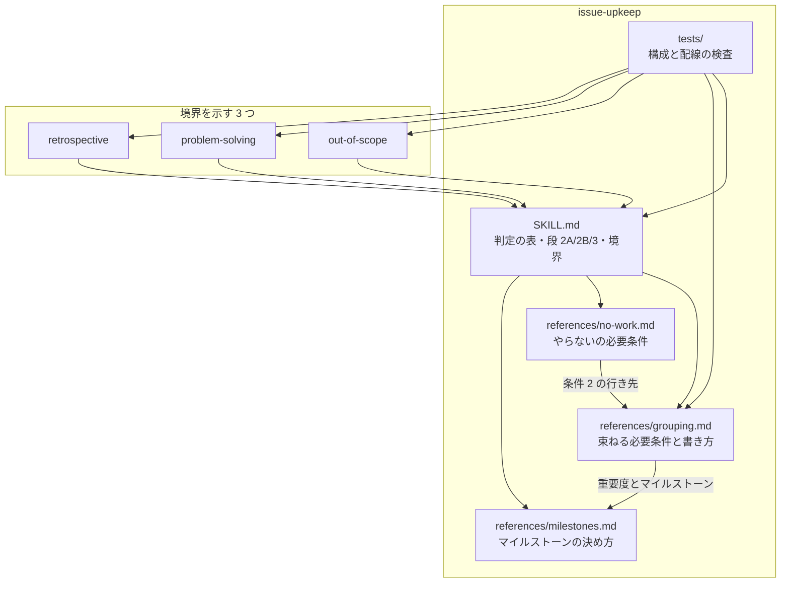
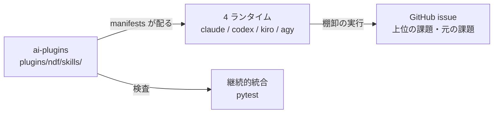
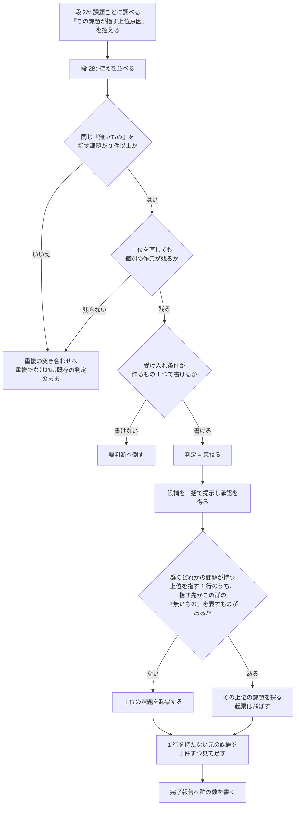

# #712 / #713: 同じ上位原因を持つ課題群を束ねる判定と、構造の判断の担い手

要求と受け入れ条件は [issue-712-713-requirements.md](issue-712-713-requirements.md) にある。
この文書は「どう作るか」だけを扱う。

## 何を作るか

蓄積した課題の棚卸（`/ndf:issue-upkeep`）へ、**同じ原因から出た複数の課題を 1 つにまとめて
扱う判定**を足す。名前は「束ねる」で、既存の 7 つの判定に並ぶ 8 つ目になる。束ねると、その
原因を直すための課題を新しく 1 件作り、元の課題は閉じずに残して結び付ける。

## 用語

| 語 | この文書での意味 |
| --- | --- |
| 棚卸 | 蓄積した課題の一覧を現状へ合わせる工程（`/ndf:issue-upkeep`） |
| 判定 | 棚卸が課題ごとに決める区分。この変更で 7 つから 8 つになる |
| 群 | 同じ 1 つの原因から出た課題の集まり。束ねる判定の対象 |
| 上位の課題 | 群の共通の原因を直すために新しく作る課題 |
| 元の課題 | 群に属する既存の課題。上位の課題を作った後も閉じない |
| 重複 | 既存の判定の 1 つ。**同じ課題**であることを指す。束ねる（原因は同じだが別の課題）とは分ける |
| 段 2A / 段 2B / 段 3 | 棚卸の手順の段。2A は課題ごとに調べる（分担する）、2B は全体で突き合わせる（分担しない）、3 は反映する |
| 4 群 | 2026-09-16 の棚卸で見つかった 4 つの群。内訳は要求と受け入れ条件の「いま何が起きているか」にある |

## 機能一覧

| # | 機能 | 誰が使うか |
| --- | --- | --- |
| 1 | 段 2A が、課題ごとに「この課題が指す上位原因」を 1 行で控える | 棚卸の担当（件数で割られた側） |
| 2 | 段 2B が、控えを並べて同じ原因を持つ課題群を確定する | 棚卸の進行（分担しない段） |
| 3 | 判定「束ねる」が、群の各課題に付く | 棚卸の進行 |
| 4 | 段 3 が、上位の課題を 1 件作り、元の課題へ結び付ける | 棚卸の進行と、承認する人 |
| 5 | 完了報告が、束ねた群の数を示す | 次の棚卸を行う人 |
| 6 | 4 つの Skill のどれから読み始めても、構造の判断の担い手へたどれる | Skill を読む AI と人 |

## 構成要素

| 要素 | 責務 |
| --- | --- |
| `issue-upkeep/SKILL.md` の判定の表 | **8 つの判定の並びの正本。** 他の箇所はこの並びを参照する |
| `issue-upkeep/SKILL.md` の用語の表と「扱う 3 つ」の節 | 判定の数を 8 つへ改め、節を「扱う 4 つ」へ改めて 4 つ目に束ねる判断を置き、案内文へ `grouping.md` を足す |
| `issue-upkeep/SKILL.md` の段 2A | 控える項目に「この課題が指す上位原因」を足す |
| `issue-upkeep/SKILL.md` の段 2B | 突き合わせの表に「同じ原因を持つ課題群」を足す |
| `issue-upkeep/SKILL.md` の段 2B の注記 | 「起点が同じことと同じ課題であることを分ける」へ、束ねるとの分岐を足す |
| `issue-upkeep/SKILL.md` の段 3 | 上位の課題を作る手順と、2 度作らない仕組み |
| `issue-upkeep/SKILL.md` の境界の節 | **2 × 2 の表の正本。** 価値 / 構造 × 発見の瞬間 / 蓄積した課題 |
| `issue-upkeep/references/grouping.md`（新設） | 束ねてよい必要条件・上位の課題の書き方・元の課題の扱い・歯止め |
| `issue-upkeep/references/no-work.md` | **条件 2 の欠けたときの行き先と確かめ方を直す**（行き先は「重複」固定を「重複 / 束ねる」へ、確かめ方は重複の突き合わせを束ねるの突き合わせも含む形へ） |
| `issue-upkeep/references/milestones.md` | 上位の課題の重要度とマイルストーンの決め方を足し、既存の「束ねる」の語を言い換える |
| `out-of-scope/SKILL.md` の境界の節 | 「蓄積した課題には及ばない」の及ぶ先を示す |
| `problem-solving/SKILL.md` | 「上流で直す」と「束ねる」の違いを示し、`issue-upkeep` を指す |
| `retrospective/SKILL.md` | 群の発見を担わないことと、その理由を示す |
| `issue-upkeep/tests/test_issue_upkeep_layout.py` | 並び・参照・配線の検査 |



## システム構成

**文脈。** 変更するのは配布物の文書であり、外側には 4 つのランタイムと GitHub がある。



**配置。** 判定の並びと 2 × 2 の表は `issue-upkeep/SKILL.md` の 1 箇所にだけ置き、他の
3 つの Skill はそこを指す。同じ表を写すと、判定を増やしたときに片方が古くなる
（`development-workflow` が「判定基準を持つのはこの Skill だけ」としたのと同じ形）。

## パッケージ・モジュール構成

```text
plugins/ndf/skills/
├── issue-upkeep/
│   ├── SKILL.md                         # 判定の表・段 2A/2B/3・境界・完了報告
│   ├── references/
│   │   ├── grouping.md                  # 新設
│   │   ├── no-work.md                   # 条件 2 の行き先を直す
│   │   └── milestones.md                # 上位の課題の割り当てと、語の言い換え
│   └── tests/
│       └── test_issue_upkeep_layout.py  # 並び・参照・配線
├── out-of-scope/SKILL.md                # 境界の節
├── problem-solving/SKILL.md             # 上流で直すとの違い
└── retrospective/SKILL.md               # 群を担わない理由
```

**新しいテストファイルを作らない。** 同じ Skill の構成を検査する 1 本が既にある。

## 入出力の契約

### 判定の集合

**7 → 8 へ増やす。** 並びは次のとおりで、`SKILL.md` の表がこの並びの正本である。

| 順 | 判定 | 選ぶ条件 | 段 3 での対応 |
| --- | --- | --- | --- |
| 1 | そのまま | 本文と現状が一致している | 何もしない |
| 2 | 追記が要る | 本文は有効だが、数値・パス・関連する課題の状態が古い | 該当箇所だけを直す |
| 3 | 書き直しが要る | 本文の前提が現状と食い違う | 主旨を変えずに前提を書き直す |
| 4 | 閉じてよい | すでに直っている | 実行結果を添えて閉じる |
| 5 | やらない | 課題は成り立つが、抱える費用が直す費用を下回る | `wontfix` を付け、理由と再燃の条件を添えて閉じる |
| 6 | 重複 | 他の課題と同じもの | 段 2B で正本を決める |
| 7 | **束ねる** | **他の課題と同じ上位原因を持つが、同じ課題ではない** | **段 2B で群を確定し、上位の課題を作って結び付ける。元の課題は閉じない** |
| 8 | 要判断 | 自動で決められない | 人へ返す。反映しない |

**`重複` の次に置く。** どちらも課題をまたいで決まり、段 2B で確定する。`要判断` は自動で
決められないものの受け皿であり、末尾から動かさない。

### 段 2A が控える項目

既存の 6 項目に 1 つ足す。

| 項目 | 何に使うか |
| --- | --- |
| 番号 | 段 3 の照合 |
| `updated_at` | 段 3 の照合 |
| 本文の要約値 | 段 3 の照合 |
| 判定と根拠 | 段 2B と段 3 |
| 反映で行う変更 | 段 3 |
| 依存する課題の番号 | 段 2B と反映の順序 |
| **この課題が指す上位原因の 1 行** | **段 2B が群を確定する材料。「何が無いか」を規則・層・届け先のいずれかで書く** |

**段 2A では群を決めない。** 件数で割られているため、他の課題の控えが見えない。控えるのは
自分が読んだ課題が指す「無いもの」だけである。

### 上位の課題の本文

```markdown
## 何が無いか
（1 文。規則・層・届け先のどれが無いか）

## どの課題がこれを指すか

| 課題 | その課題が示す観測 |
| --- | --- |
| #<番号> | （1 行。再現手順の本体は元の課題に残す） |

## 直すと何が変わるか
（上位を直した後、各課題に何が残るか）

## 完了条件
（作るもの 1 つ。歯止めの条件 3 で書いたもの）

## 由来
（棚卸の日付と、束ねると判定したこと）
```

**元の課題の観測を写さない。** 写すと同じ再現手順が 2 箇所に残り、片方だけが古くなる。
元の課題を閉じないため、本体はそちらに残る。

### 元の課題へ足す 1 行

```markdown
共通の上位原因は #<上位の番号> にある。この課題は個別の観測を持つため残す。
```

置き場所は本文の「関連」の節、無ければ末尾である。**この 1 行が、段 3 をやり直したときに
上位の課題を 2 度作らないための探索キーになる。** 探索は群の単位で 1 度行い、追記は 1 行を
持たない課題だけへ行う。

## 処理の流れ



**起票を飛ばすことと、1 行を足すことを分ける。** 一部の課題にだけ 1 行が入った状態で
止まると、群の全体を「作成済み」として飛ばしたときに残りの課題へ 1 行が入らない。
起票の重複は群に 1 度だけ見て、1 行の有無は課題ごとに見る。

**1 行があることだけで飛ばさない。** 1 件は複数の群へ属してよい（決定 6）ため、見つけた
1 行が別の群の上位の課題を指していることがある。指す先の「何が無いか」を読み、この群の
「無いもの」と一致するときだけ起票を飛ばす。一致しなければ、その課題が別の群にも属して
いるだけであり、この群の上位の課題は新しく起票する。

**承認は段 2B の後、段 3 の反映の前に 1 度だけ求める。** 「やらない」の候補と同じ時点で
あり、同じ提示にまとめる。件ごとに聞かない。

## 非機能の実現方式

| 項目 | 条件 | 実現方式 |
| --- | --- | --- |
| 外部への書き込みの量 | 1 群につき起票 1 件と、元の課題 3 件以上の本文の更新が増える | 既存の「外部への書き込みの制限」の待ち方をそのまま使う。**束ねる群の数に上限を置かない** |
| 中断からの再開 | 書き込みの制限で途中で止まっても、やり直しで上位の課題が 2 件にならず、1 行の入っていない元の課題が残らない | 元の課題の本文の 1 行を探索キーにし、**指す先の「何が無いか」がこの群と一致するときだけ既存と見なす**。**起票は群に 1 度だけ、1 行の追記は課題ごとに見る** |
| マイルストーンを持たないリポジトリ | 上位の課題の割り当て先が無い | 既存の「他のリポジトリで動くこと」の規則（扱うこと 2 を飛ばす）がそのまま覆う。**表に行を足さない** |
| 重要度ラベルを持たないリポジトリ | 群の最高値を採れない | `gh label list` の説明が無ければ付け替えないという既存の規則が覆う。上位の課題は重要度なしで作る |

## 決定の記録

### 決定 1: 判定を 8 つにし、「束ねる」を「重複」と「要判断」の間に置く

「束ねる」は課題をまたいで決まるため、同じ性質を持つ「重複」の隣が読みやすい。「要判断」は
自動で決められないものの受け皿であり、末尾にあることに意味がある。

既存の 7 つへ統合する案は採らない。「重複」へ寄せると、片方を閉じてよいものと閉じられない
ものが同じ判定になり、後から検索で区別できない（`no-work.md` が「閉じてよい」と「やらない」を
分けたのと同じ理由である）。

### 決定 2: 束ねてよい必要条件を 3 つ置き、すべて満たすものだけを候補にする

形は `no-work.md` の「2 つの必要条件」に合わせ、**条件 / 確かめ方 / 欠けたときの行き先の
3 列**を持つ。同じ Skill の中で 2 つの判断が別々の形を持つと、読む側が形ごとに読み方を
覚えることになる。

| # | 条件 | 確かめ方 | 欠けたときの行き先 |
| --- | --- | --- | --- |
| 1 | 3 件以上が、同じ 1 つの「無いもの」を指す | 段 2A が控えた「この課題が指す上位原因」の 1 行を段 2B で並べ、同じ「無いもの」を指す件数を数える | 2 件以下なら**重複**の突き合わせへ。そこで重複と決まらなければ**既存の判定のまま**。1 文で書けないなら**要判断** |
| 2 | 上位を直しても、各課題に個別の作業が残る | 課題ごとに、上位を直した後に残る適用を 1 行で書けるか見る。段 2B の重複の突き合わせの結果と合わせて読む | 残らないなら**重複** |
| 3 | 上位の課題の受け入れ条件が、作るもの 1 つで書ける | 上位の課題の完了条件を「作るもの 1 つ」の形で書き下してみる | 書けないなら**要判断** |

### 決定 3: 群の下限を 3 件にする

**2 件は重複の突き合わせが扱う範囲である。** 寄せられるなら重複、寄せられないなら別の課題と
してそのまま残る。上位の課題を作ると起票 1 件と元の課題の本文の更新が増えるため、2 件では
その費用が個別に直す費用を上回る。

件数の上限は置かない。上限を置くと、1 つの原因を持つ群が件数だけの理由で分断される。

### 決定 4: 元の課題を閉じない

閉じると個別の観測が消える。上位を直しても、各課題には個別の適用が残る（条件 2 がこれを
必要条件にしている）。**上位が直った後の棚卸で、元の課題は既存の「閉じてよい」の判定で
閉じられる。** 再現手順を実行して確かめる手順がそのまま使えるため、新しい閉じ方を作らない。

閉じて上位へ集約する案は採らない。個別の再現手順が失われ、上位を直した後に「本当に全部
直ったか」を確かめる材料が無くなる。

### 決定 5: 上位の課題は元の観測を写さず、番号と 1 行要約の表で持つ

写すと同じ再現手順が 2 箇所に残り、片方だけが古くなる。元の課題を閉じない（決定 4）ため、
本体はそちらに残り、失われない。

### 決定 6: 1 件が複数の群へ属してよい

元の課題を閉じないため、属する群の数だけ 1 行を足せばよい。#459 は「黙って捨てる」と
「配布済みの版との食い違い」の 2 つに属する。

**上位の課題どうしが同じ箇所を直すなら、それは 1 つの群である。** 段 2B で上位の課題の
完了条件を並べ、作るものが同じなら統合する。

**複数の群へ属するため、1 行の有無だけでは起票済みと決められない。** 1 行が指す上位の課題の
「何が無いか」を読み、この群の「無いもの」と一致するときだけ起票を飛ばす（処理の流れの J）。

### 決定 7: 上位の課題の重要度は群の最高値を採り、マイルストーンは重要度の規則を先に効かせる

**重要度が決まれば `milestones.md` の既存の表が入れ先を決める。** 高い重要度は主題に
よらず直近のまとまりへ入る。**群の中で最も早いものを採る規則は、この後で効く。** 順序を
逆にすると、最高重要度が「高い」群が直近より遅いマイルストーンへ置かれ、既存の「高いものは
直近へ」と衝突する。足す 1 行も、既存の表を適用した後に読む位置へ置く。

**主題で決まる重要度では、群の課題が既に属するマイルストーンのうち最も早いものを採る。**
既存の表は主題が複数に当てはまるときを**要判断**へ倒すが、群は 1 つの上位原因で括られて
おり、選ぶのは主題ではなく着手の時期である。最も早いものを採るのは、上位を直すまで群の
どの課題も直らないためで、遅い側に合わせると早いマイルストーンの課題が待つ。群のどの課題も
マイルストーンを持たないときだけ、既存の表がそのまま決める。この 1 行を `milestones.md` へ
足す。

**元の課題のマイルストーンは動かさない。** 動かすことは他の課題の着手の順序を早めるか
遅らせるかの判断にあたり、`milestones.md` が**要判断**へ倒すと定めている。

### 決定 8: 歯止めを「作るもの 1 つで受け入れ条件が書けること」に置く

`cross-refactoring` が `--scope` を必須にしたのと同じ懸念（範囲が発散して Pull Request が
肥大する）へ対する。**件数ではなく、作るものの数で測る。** 件数で測ると、1 つの規則を作れば
済む 10 件の群が分断され、10 個の別物を作る 3 件の群が通る。

書けないものはマイルストーンの主題であって群ではない。**要判断**へ倒す。

### 決定 9: 起票の例外は上位の課題 1 つだけにする

「手入れは起票を含まない」は残し、例外を 1 つ書く。**上位の課題は新しい発見ではなく、
既存の課題群から導かれるものである。** `out-of-scope` は発見の瞬間しか見ないため、群を
作れない（#713 の分析）。

`out-of-scope` の 3 択を 4 択へ増やす案は採らない。発見の瞬間には指摘の周辺しか見えておらず、
群を判定する材料が無い。

### 決定 10: 重複を固定の行き先とする既存の 2 箇所へ「束ねる」を足す

**既存の規則が、新しい値に当てはまらないまま残る箇所である。** 直さないと、群の候補が
「重複」へ流れて片方が閉じられる。

| 箇所 | 現状 | 直す形 |
| --- | --- | --- |
| `no-work.md` の条件 2 の行き先 | 「重複」固定 | 寄せ先が同じ課題でなければ「束ねる」 |
| `no-work.md` の条件 2 の確かめ方 | 「段 2B の重複の突き合わせの結果を使う」 | 重複と束ねるの両方の突き合わせの結果を使う |
| `SKILL.md` 段 2B の注記 | 起点が同じ 2 件を重複の枠で説明する | 3 件以上で個別の作業が残るものは束ねるへ倒す分岐を足す |

**注記も同じ軸を扱っている。** 注記は「起点が同じでも片方が残るなら重複ではない」と
述べており、束ねるの必要条件 2 と同じ判断をしている。行き先を書かないままにすると、
注記を読んだ担当が 3 件以上の群を重複として分断する。

### 決定 11: 2 × 2 の表の正本を `issue-upkeep` に置き、他の 3 つは指す

| 判断 | 発見の瞬間 | 蓄積した課題 |
| --- | --- | --- |
| 価値（やるか） | `out-of-scope` の「起票しない」 | `issue-upkeep` の「やらない」 |
| 構造（どこを直すか） | `out-of-scope` の「範囲内へ入れる」、`problem-solving` の「上流で直す」 | **`issue-upkeep` の「束ねる」** |

**蓄積した課題を扱う側に置く。** 両方の升を埋めるのはこの Skill であり、表を持つ側と
埋める側が一致する。4 つへ写すと、判定を増やしたときに 3 つが古くなる。

### 決定 12: `retrospective` は群の発見を担わない

**振り返りは 1 回の変更を見るため、群が見えない。** 拾うのは「起票の取りこぼし」であり、
すでに起票された課題どうしの関係は対象にしていない。担わないことを書き残す。書かないと、
次に読む人が同じ検討を繰り返す。

### 決定 13: `milestones.md` の既存の「束ねる」を「一緒に直す」へ言い換える

`milestones.md` は主題の説明で「どれと束ねるか」という語を使っている。判定の名前を
「束ねる」にすると、同じファイルの中で 2 つの意味が並ぶ。決定 7 でこのファイルへ上位の
課題の割り当てを足すため、並ぶことが避けられない。

**判定の側を残し、説明の側を言い換える。** 判定の名前は #712 / #713 の本文が使っており
（前提 1）、変えると課題の本文と食い違う。説明の側は同じ表が既に「どの課題と一緒に直すか」
と書いており、言い換えても意味が変わらない。言い換えると、`束ねる` の検索が判定だけを
返す（前提 2 が求める区別）。

## テスト設計

| 受け入れ条件 | 何で確かめるか |
| --- | --- |
| AC1 | `test_the_verdict_table_lists_eight_in_order`（`VERDICTS` を 8 つへ） |
| AC2 | `test_grouping_is_reachable_from_the_verdict_table` |
| AC3 | `test_grouping_needs_approval`（自動で反映してよい変更の表の行を照合） |
| AC4 | `test_the_four_topics_include_grouping`（節の見出し・4 行目・案内文・用語の「8 つ」を照合） |
| AC5 | `test_stage_2a_records_the_upper_cause` |
| AC6 | `test_stage_2b_matches_issues_by_shared_cause` |
| AC7 | `test_stage_2b_separates_duplication_from_grouping` |
| AC8 | `test_grouping_separates_itself_from_duplication` |
| AC9 | `test_grouping_has_three_necessary_conditions` |
| AC10 | `test_grouping_keeps_the_original_issues_open` |
| AC11 | `test_grouping_shows_the_body_of_the_umbrella_issue` |
| AC12 | `test_grouping_allows_an_issue_in_two_groups` |
| AC13 | `test_grouping_has_a_brake_on_size` |
| AC14 | `test_grouping_takes_the_highest_priority_in_the_group` |
| AC15 | `test_upkeep_files_only_the_umbrella_issue` |
| AC16 | `test_the_report_counts_the_groups` |
| AC17〜AC20 | 上記の各テスト |
| AC21 | `uv run --with pytest pytest plugins/ndf/skills/issue-upkeep/tests -q` |
| AC22〜AC24 | **手動確認。** `gh issue view` の出力を Pull Request の本文へ残す |
| AC25〜AC27 | `test_the_boundary_table_covers_both_judgements` |
| AC28 | `test_problem_solving_separates_upstream_from_grouping` |
| AC29 | `test_retrospective_declines_group_discovery` |
| AC30 | `test_the_callers_point_here`（対象は `retrospective` / `release` / `out-of-scope` / `problem-solving`） |

**`no-work.md` の条件 2 の行き先と確かめ方（決定 10）も検査する。** 既存の
`test_no_work_has_two_necessary_conditions` が条件の文言を照合しているため、行き先の列と
確かめ方の列も同じテストで見る。

**`milestones.md` の語の言い換え（決定 13）も検査する。**
`test_milestones_separate_grouping_from_the_theme` を足し、主題の説明が「どれと一緒に
直すか」であることと、`milestones.md` に残る「束ねる」が決定 7 の足す上位の課題の割り当ての
文だけであることを見る。

## 未確認のまま残ること

| 項目 | 内容 |
| --- | --- |
| 群の下限 3 件の妥当性 | 2026-09-16 の棚卸の 4 群（6 / 4 / 4 / 3 件）だけが材料である。2 件の群が繰り返し現れるなら下げる判断が要る |
| 上位の課題が直った後の閉じ方 | 「閉じてよい」の判定で閉じる想定だが、実際に上位が直るのは別のまとまりであり、この変更では確かめられない |
| 4 群のうち束ねない 2 群 | 完了条件は 2 群以上である。残りを次の棚卸が同じ手順で扱えるかは、その棚卸で分かる |
