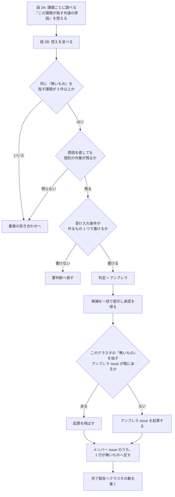
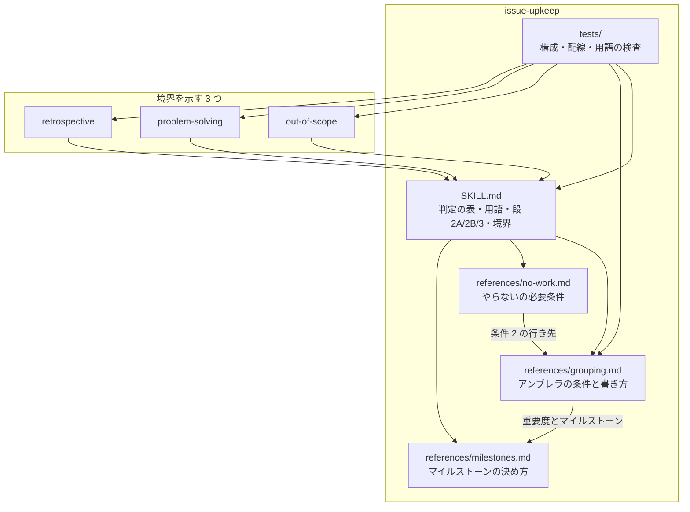
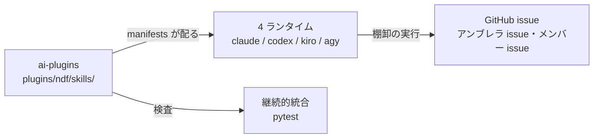

# #712 / #713: 同じ原因から出た課題を、まとめて直せるようにする（設計）

何を満たせば完了かは [issue-712-713-requirements.md](issue-712-713-requirements.md) にある。
この文書は「どう作るか」だけを扱う。用語（棚卸・判定・アンブレラ・クラスタ・アンブレラ issue・
メンバー issue・マイルストーン・段 2A / 2B / 3・4 クラスタ）も同じ文書が定める。

## 何を作るか

溜まった課題を見直す工程（棚卸）に、**同じ原因から出た課題をひとつのクラスタとして扱う判定**を
足す。名前は「アンブレラ」で、既存の 7 つの判定に並ぶ 8 つ目になる。

この判定が付くと、原因を直すための課題を新しく 1 件つくる（アンブレラ issue）。クラスタに
属する既存の課題（メンバー issue）は閉じずに残し、アンブレラ issue を指す 1 行を本文へ足す。

あわせて、この判断を `issue-upkeep` が持つことを 4 つの Skill の境界へ書く。

## 実例で追う: 6 件が 1 つのクラスタになるまで

要求の「実例」で挙げた 6 件（#671 #577 #459 #684 #642 #653）が、棚卸の中でどう扱われるかを
段ごとに並べる。

### 段 2A — 課題ごとに調べる（複数人で分担する）

担当は課題を 1 件ずつ実物と照らし合わせ、判定の材料を控える。ここで 1 行足す。

```text
#671  この課題が指す共通の原因: 失敗を検知した場所が、呼び出し元や人へ届ける先を持たない
#577  この課題が指す共通の原因: 失敗を検知した場所が、呼び出し元や人へ届ける先を持たない
```

**この段ではクラスタを決めない。** 担当は割り当てられた課題しか見ておらず、他の課題の控えが
見えないためである。控えるのは「この課題では何が無いのか」だけである。

### 段 2B — 全体で突き合わせる（分担しない）

控えを並べると、6 件が同じ「無いもの」を指していることが分かる。ここで 3 つの条件を確かめる。

| # | 条件 | この 6 件では |
| --- | --- | --- |
| 1 | 3 件以上が、同じ 1 つの「無いもの」を指す | 6 件。満たす |
| 2 | 原因を直しても、各課題に個別の作業が残る | 届ける先を作った後も、6 か所それぞれに当てはめる作業が残る。満たす |
| 3 | アンブレラ issue の受け入れ条件が、作るもの 1 つで書ける | 「失敗を届ける先を 1 つ決めて規則にする」で書ける。満たす |

3 つとも満たしたので、6 件の判定は「アンブレラ」になる。

### 段 3 — 反映する

アンブレラ issue を 1 件つくり、メンバー issue 6 件へリンクを足す。**起票は外部から見える
場所への書き込みであるため、段 2B の後に一括で提示して承認を得る。**

```text
アンブレラ issue（新規）
  何が無いか: 失敗を検知した場所が、呼び出し元や人へ届ける先を持たない
  どの課題がこれを指すか: #671 #577 #459 #684 #642 #653（1 件 1 行で観測を添える）

メンバー issue 6 件（それぞれの本文の末尾）
  共通の原因は #<アンブレラ issue の番号> にある。この課題は個別の観測を持つため残す。
```

## 判定の集合

**7 つから 8 つへ増やす。** 並びは次のとおりで、`SKILL.md` の表がこの並びの正本である。

| 順 | 判定 | 選ぶ条件 | 段 3 での対応 |
| --- | --- | --- | --- |
| 1 | そのまま | 本文と現状が一致している | 何もしない |
| 2 | 追記が要る | 本文は有効だが、数値・パス・関連する課題の状態が古い | 該当箇所だけを直す |
| 3 | 書き直しが要る | 本文の前提が現状と食い違う | 主旨を変えずに前提を書き直す |
| 4 | 閉じてよい | すでに直っている | 実行結果を添えて閉じる |
| 5 | やらない | 課題は成り立つが、抱える費用が直す費用を下回る | `wontfix` を付け、理由と再燃の条件を添えて閉じる |
| 6 | 重複 | 他の課題と同じもの | 段 2B で正本を決める |
| 7 | **アンブレラ** | **他の課題と同じ原因を持つが、同じ課題ではない** | **段 2B でクラスタを確定し、アンブレラ issue を作って結び付ける。メンバー issue は閉じない** |
| 8 | 要判断 | 自動で決められない | 人へ返す。反映しない |

**`重複` の次に置く。** どちらも課題をまたいで決まり、段 2B で確定する。`要判断` は自動で
決められないものの受け皿であり、末尾から動かさない。

## アンブレラを選んでよい条件

**3 つすべてを満たすものだけを候補にする。** 欠けたときの行き先を列で持ち、既存の 7 判定の
どれかへ倒す。形は同じ Skill の `no-work.md` の「2 つの必要条件」に合わせる。

| # | 条件 | 確かめ方 | 欠けたときの行き先 |
| --- | --- | --- | --- |
| 1 | 3 件以上が、同じ 1 つの「無いもの」を指す | 段 2A が控えた 1 行を段 2B で並べ、同じ「無いもの」を指す件数を数える | 2 件以下なら**重複**の突き合わせへ。そこで重複と決まらなければ**既存の判定のまま**。1 文で書けないなら**要判断** |
| 2 | 原因を直しても、各課題に個別の作業が残る | 課題ごとに、原因を直した後に残る適用を 1 行で書けるか見る。段 2B の重複の突き合わせの結果と合わせて読む | 残らないなら**重複** |
| 3 | アンブレラ issue の受け入れ条件が、作るもの 1 つで書ける | アンブレラ issue の完了条件を「作るもの 1 つ」の形で書き下してみる | 書けないなら**要判断** |

**重複との境目は条件 2 である。** 原因を直せば全部が消えるなら、それは同じ課題（重複）で
ある。消えずに個別の作業が残るなら、原因は同じでも別の課題（アンブレラ）である。

## アンブレラ issue とメンバー issue の形

### アンブレラ issue の本文

```markdown
## 何が無いか
（1 文。規則・層・届け先のどれが無いか）

## どの課題がこれを指すか

| メンバー issue | その課題で何が起きているか |
| --- | --- |
| #<番号> | （1 行。再現手順の本体はメンバー issue に残す） |

## 直すと何が変わるか
（原因を直した後、各課題に何が残るか）

## 完了条件
（作るもの 1 つ。条件 3 で書き下したもの）

## 由来
（棚卸の日付と、アンブレラと判定したこと）
```

**メンバー issue の中身を写さない。** 写すと同じ再現手順が 2 か所に残り、片方だけが古くなる。
メンバー issue を閉じないため、本体はそちらに残る。

### メンバー issue へ足す 1 行

```markdown
共通の原因は #<アンブレラ issue の番号> にある。この課題は個別の観測を持つため残す。
```

置き場所は本文の「関連」の節、無ければ末尾である。

### 段 2A が控える項目

既存の 6 項目に 1 つ足す。

| 項目 | 何に使うか |
| --- | --- |
| 番号 | 段 3 の照合 |
| `updated_at` | 段 3 の照合 |
| 本文の要約値 | 段 3 の照合 |
| 判定と根拠 | 段 2B と段 3 |
| 反映で行う変更 | 段 3 |
| 依存する課題の番号 | 段 2B と反映の順序 |
| **この課題が指す共通の原因の 1 行** | **段 2B がクラスタを確定する材料。「何が無いか」を規則・層・届け先のいずれかで書く** |

## 処理の流れ



**起票の判定と 1 行の追記を分ける。** 起票はクラスタに 1 度、1 行の追記は課題ごとに行う。
まとめて扱うと、書き込みの制限で途中で止まったときに、起票済みを理由として残りの課題への
追記が飛ぶ。

**1 行があることだけで起票を飛ばさない。** 1 件が複数のクラスタへ属するため、既にある 1 行は
別のクラスタのアンブレラ issue を指していることがある。1 行が指すアンブレラ issue の
「何が無いか」を読み、このクラスタのものと一致するときだけ飛ばす。

## 既存の規則のうち、直すもの

判定の集合へ値を足すと、それまでの 7 つだけを想定して書かれた規則が、新しい値に当てはまらない
まま残る。次の 3 か所がこれに当たる。**直さないと、クラスタの候補が「重複」へ流れて片方が
閉じられる。**

| 箇所 | 現状 | 直す形 |
| --- | --- | --- |
| `no-work.md` の条件 2 の行き先 | 「重複」固定 | 寄せ先が同じ課題でなければ「アンブレラ」 |
| `no-work.md` の条件 2 の確かめ方 | 「段 2B の重複の突き合わせの結果を使う」 | 重複とアンブレラの両方の突き合わせの結果を使う |
| `SKILL.md` 段 2B の注記 | 起点が同じ 2 件を重複の枠で説明する | 3 件以上で個別の作業が残るものはアンブレラへ倒す分岐を足す |

## 4 つの Skill の境界

**2 × 2 の表の正本を `issue-upkeep` に置く。** 他の 3 つはそこを指す。

| 判断 | 発見の瞬間 | 溜まった課題 |
| --- | --- | --- |
| 価値（やるか） | `out-of-scope` の「起票しない」 | `issue-upkeep` の「やらない」 |
| 構造（どこを直すか） | `out-of-scope` の「範囲内へ入れる」、`problem-solving` の「上流で直す」 | **`issue-upkeep` の「アンブレラ」** |

| Skill | 何を足すか |
| --- | --- |
| `issue-upkeep` | 上の表そのもの。価値と構造の両方について担い手を示す |
| `out-of-scope` | 「蓄積した課題には及ばない」の及ぶ先が `issue-upkeep` であること |
| `problem-solving` | 「上流で直す」（1 件の不具合の上流）と「アンブレラ」（複数の課題の共通の原因）の違いと、`issue-upkeep` へのリンク |
| `retrospective` | クラスタの発見を担わないことと、その理由 |

## 構成要素

| 要素 | 責務 |
| --- | --- |
| `issue-upkeep/SKILL.md` の判定の表 | **8 つの判定の並びの正本。** 他の箇所はこの並びを参照する |
| `issue-upkeep/SKILL.md` の用語の表 | **アンブレラ / クラスタ / アンブレラ issue / メンバー issue の定義の正本** |
| `issue-upkeep/SKILL.md` の段 2A | 控える項目に「この課題が指す共通の原因」を足す |
| `issue-upkeep/SKILL.md` の段 2B | 突き合わせの表に「同じ原因を持つクラスタ」を足し、注記へ分岐を足す |
| `issue-upkeep/SKILL.md` の段 3 | アンブレラ issue を作る手順と、2 度作らない仕組み |
| `issue-upkeep/SKILL.md` の「扱う 3 つ」 | 4 つ目としてクラスタを扱う判断を足す |
| `issue-upkeep/SKILL.md` の境界の節 | **2 × 2 の表の正本** |
| `issue-upkeep/references/grouping.md`（新設） | アンブレラの条件・アンブレラ issue の書き方・メンバー issue の扱い・歯止め |
| `issue-upkeep/references/no-work.md` | 条件 2 の行き先と確かめ方を直す |
| `issue-upkeep/references/milestones.md` | アンブレラ issue の割り当てを足し、着手の時期を指す語を揃える |
| `out-of-scope/SKILL.md` の境界の節 | 及ぶ先を示す |
| `problem-solving/SKILL.md` | 上流で直すこととの違いを示す |
| `retrospective/SKILL.md` | クラスタの発見を担わないことを示す |
| `issue-upkeep/tests/test_issue_upkeep_layout.py` | 並び・参照・配線・用語の検査 |



## 置き場所

```text
plugins/ndf/skills/
├── issue-upkeep/
│   ├── SKILL.md                         # 判定の表・用語・段 2A/2B/3・境界・完了報告
│   ├── references/
│   │   ├── grouping.md                  # 新設
│   │   ├── no-work.md                   # 条件 2 の行き先と確かめ方を直す
│   │   └── milestones.md                # アンブレラ issue の割り当てを足す
│   └── tests/
│       └── test_issue_upkeep_layout.py  # 並び・参照・配線・用語
├── out-of-scope/SKILL.md                # 境界の節
├── problem-solving/SKILL.md             # 上流で直すこととの違い
└── retrospective/SKILL.md               # クラスタを担わない理由
```

**新しいテストファイルを作らない。** 同じ Skill の構成を検査する 1 本が既にある。

**判定の並びと 2 × 2 の表は `issue-upkeep/SKILL.md` の 1 か所にだけ置く。** 同じ表を写すと、
判定を増やしたときに片方が古くなる。

## 配布と外部の系

変えるのは配布物の文書であり、外側には 4 つのランタイムと GitHub がある。



## 非機能の実現方式

| 項目 | 条件 | 実現方式 |
| --- | --- | --- |
| 外部への書き込みの量 | 1 クラスタにつき起票 1 件と、メンバー issue 3 件以上の本文の更新が増える | 既存の「外部への書き込みの制限」の待ち方をそのまま使う。**処理するクラスタの数に上限を置かない** |
| 中断からの再開 | 書き込みの制限で途中で止まっても、やり直しでアンブレラ issue が 2 件にならない | メンバー issue の 1 行が指すアンブレラ issue の「何が無いか」を読み、このクラスタのものと一致すれば起票を飛ばす |
| マイルストーンを持たないリポジトリ | アンブレラ issue の割り当て先が無い | 既存の「他のリポジトリで動くこと」の規則がそのまま覆う。**表に行を足さない** |
| 重要度ラベルを持たないリポジトリ | クラスタの最高値を採れない | 説明が無ければ付け替えないという既存の規則が覆う。アンブレラ issue は重要度なしで作る |

## 決定の記録

### 決定 1: 判定を 8 つにし、「アンブレラ」を「重複」と「要判断」の間に置く

「アンブレラ」は課題をまたいで決まるため、同じ性質を持つ「重複」の隣が読みやすい。「要判断」は
自動で決められないものの受け皿であり、末尾にあることに意味がある。

既存の 7 つへ統合する案は採らない。「重複」へ寄せると、片方を閉じてよいものと閉じられない
ものが同じ判定になり、後から検索で区別できない（`no-work.md` が「閉じてよい」と「やらない」を
分けたのと同じ理由である）。

### 決定 2: 用語は外来語由来のものを採る

技術文書の用語には、その領域で定着した外来語を採る。**一般語を用語にしない。** 一般語は
読み手ごとに指す対象が変わり、定義を読み飛ばされたときに別のものが思い浮かぶ
（`markdown-writing` のルール 2）。

| 概念 | 採る用語 | 採らない語 |
| --- | --- | --- |
| 8 つ目の判定 | アンブレラ | 束ねる |
| 同じ原因から出た課題の集まり | クラスタ | 群・かたまり・グループ |
| 共通の原因を直すために作る課題 | アンブレラ issue | 上位の課題 |
| クラスタに属する既存の課題 | メンバー issue | 元の課題 |
| 着手の時期を表す単位 | マイルストーン | まとまり |

**地の文は和語のままにする。** 用語を外来語にするのは、指す対象を一意にするためであり、
文章全体を外来語で書くためではない。

複数の課題をまとめる親課題を umbrella issue と呼ぶ言い方は定着しており、この判定が作るものと
一致する。#712 / #713 の本文は「束ねる」を使っているため、**課題の本文もこの用語へ揃える**
（AC34）。揃えないと、判定の名前で検索したときに起点の課題が漏れる。

### 決定 3: クラスタの下限を 3 件にする

**2 件は重複の突き合わせが扱う範囲である。** 寄せられるなら重複、寄せられないなら別の課題と
してそのまま残る。アンブレラ issue を作ると起票 1 件とメンバー issue の本文の更新が増える
ため、2 件ではその費用が個別に直す費用を上回る。

件数の上限は置かない。上限を置くと、1 つの原因を持つクラスタが件数だけの理由で分断される。

### 決定 4: メンバー issue を閉じない

閉じると固有の再現手順が消える。原因を直しても、各課題には個別の適用が残る（条件 2 がこれを
必要条件にしている）。**原因が直った後の棚卸で、メンバー issue は既存の「閉じてよい」の判定で
閉じられる。** 再現手順を実行して確かめる手順がそのまま使えるため、新しい閉じ方を作らない。

閉じてアンブレラ issue へ集約する案は採らない。個別の再現手順が失われ、原因を直した後に
「本当に全部直ったか」を確かめる材料が無くなる。

### 決定 5: アンブレラ issue はメンバー issue の中身を写さず、番号と 1 行の表で持つ

写すと同じ再現手順が 2 か所に残り、片方だけが古くなる。メンバー issue を閉じない（決定 4）
ため、本体はそちらに残り、失われない。

### 決定 6: 1 件が複数のクラスタへ属してよい

メンバー issue を閉じないため、属するクラスタの数だけ 1 行を足せばよい。#459 は「失敗・欠落を
黙って捨てる」と「配布済みの版と開発中の版が食い違う」の 2 つに属する。

**アンブレラ issue どうしが同じ箇所を直すなら、それは 1 つのクラスタである。** 段 2B で
アンブレラ issue の完了条件を並べ、作るものが同じなら統合する。

**複数のクラスタへ属するため、1 行の有無だけでは起票済みと決められない。** 1 行が指す
アンブレラ issue の「何が無いか」を読み、このクラスタのものと一致するときだけ起票を飛ばす。

### 決定 7: アンブレラ issue の重要度はクラスタの最高値を採り、マイルストーンは重要度の規則を先に効かせる

**重要度が決まれば `milestones.md` の既存の表が入れ先を決める。** 高い重要度は主題に
よらず直近のマイルストーンへ入る。**クラスタの中で最も早いものを採る規則は、この後で効く。**
順序を逆にすると、最高重要度が「高い」クラスタが直近より遅いマイルストーンへ置かれ、既存の
「高いものは直近へ」と衝突する。足す記述も、既存の表を適用した後に読む位置へ置く。

**主題で決まる重要度では、メンバー issue が既に属するマイルストーンのうち最も早いものを採る。**
既存の表は主題が複数に当てはまるときを**要判断**へ倒すが、クラスタは 1 つの原因で括られて
おり、選ぶのは主題ではなく着手の時期である。最も早いものを採るのは、原因を直すまでクラスタの
どの課題も直らないためで、遅い側に合わせると早いマイルストーンの課題が待つ。どのメンバー
issue もマイルストーンを持たないときだけ、既存の表がそのまま決める。

**メンバー issue のマイルストーンは動かさない。** 動かすことは他の課題の着手の順序を早めるか
遅らせるかの判断にあたり、`milestones.md` が**要判断**へ倒すと定めている。

### 決定 8: 歯止めを「作るもの 1 つで受け入れ条件が書けること」に置く

`cross-refactoring` が範囲の指定を必須にしたのと同じ懸念（範囲が発散して Pull Request が
肥大する）へ対する。**件数ではなく、作るものの数で測る。** 件数で測ると、1 つの規則を作れば
済む 10 件のクラスタが分断され、10 個の別物を作る 3 件のクラスタが通る。

書けないものはマイルストーンの主題であってクラスタではない。**要判断**へ倒す。

### 決定 9: 起票の例外はアンブレラ issue 1 つだけにする

「手入れは起票を含まない」は残し、例外を 1 つ書く。**アンブレラ issue は新しい発見ではなく、
既存の課題から導かれるものである。** 課題を見つけたその場の起票は発見の瞬間しか見ないため、
クラスタを作れない。

その場の判断を 3 択から 4 択へ増やす案は採らない。発見の瞬間には指摘の周辺しか見えておらず、
クラスタを判定する材料が無い。

### 決定 10: 重複を固定の行き先とする既存の 2 か所へ「アンブレラ」を足す

中身は「既存の規則のうち、直すもの」の表にある。**注記も同じ軸を扱っている。** 注記は
「起点が同じでも片方が残るなら重複ではない」と述べており、アンブレラの条件 2 と同じ判断を
している。行き先を書かないままにすると、注記を読んだ担当が 3 件以上のクラスタを重複として
分断する。

### 決定 11: 2 × 2 の表の正本を `issue-upkeep` に置き、他の 3 つは指す

**溜まった課題を扱う側に置く。** 両方の升を埋めるのはこの Skill であり、表を持つ側と
埋める側が一致する。4 つへ写すと、判定を増やしたときに 3 つが古くなる。

### 決定 12: `retrospective` はクラスタの発見を担わない

**振り返りは 1 回の変更を見るため、クラスタが見えない。** 拾うのは起票の取りこぼしであり、
すでに起票された課題どうしの関係は対象にしていない。担わないことを書き残す。書かないと、
次に読む人が同じ検討を繰り返す。

### 決定 13: 着手の時期を指す「まとまり」を「マイルストーン」へ揃える

`milestones.md` は着手の時期を「まとまり」と「マイルストーン」の 2 通りで書いている。決定 7 で
このファイルへアンブレラ issue の割り当てを足すため、どちらで読むかが判断に効く。

**`SKILL.md` の用語「まとまり」は残す。** そちらは「1 度にマージする Pull Request の集合」で
あり、配布が版を上げる単位を指す。着手の時期とは別の概念である。揃えるのは着手の時期を指す
側だけで、揃えた結果、残る「まとまり」は配布の単位だけを指すようになる。

## テスト設計

| 受け入れ条件 | 何で確かめるか |
| --- | --- |
| AC1 | `test_the_verdict_table_lists_eight_in_order`（判定の並びを 8 つへ） |
| AC2 | `test_umbrella_is_reachable_from_the_verdict_table` |
| AC3 | `test_umbrella_needs_approval` |
| AC4 | `test_upkeep_handles_four_things` |
| AC5 | `test_stage_2a_records_the_shared_cause` |
| AC6 | `test_stage_2b_matches_issues_by_shared_cause` |
| AC7 | `test_stage_2b_note_branches_to_umbrella` |
| AC8 | `test_umbrella_separates_itself_from_duplication` |
| AC9 | `test_umbrella_has_three_conditions` |
| AC10 | `test_umbrella_keeps_the_member_issues_open` |
| AC11 | `test_umbrella_shows_the_body_of_the_umbrella_issue` |
| AC12 | `test_an_issue_may_join_two_clusters` |
| AC13 | `test_umbrella_has_a_brake_on_size` |
| AC14 | `test_umbrella_takes_the_highest_priority_in_the_cluster` |
| AC15 | `test_upkeep_files_only_the_umbrella_issue` |
| AC16 | `test_the_report_counts_the_clusters` |
| AC17〜AC20 | 上記の各テスト |
| AC21 | `uv run --with pytest pytest plugins/ndf/skills/issue-upkeep/tests -q` |
| AC22〜AC24 | **手動確認。** `gh issue view` の出力を Pull Request の本文へ残す |
| AC25〜AC27 | `test_the_boundary_table_covers_both_judgements` |
| AC28 | `test_problem_solving_separates_upstream_from_umbrella` |
| AC29 | `test_retrospective_declines_cluster_discovery` |
| AC30 | `test_the_callers_point_here`（対象へ `problem-solving` を足す） |
| AC31 / AC32 | `test_the_terms_are_loanwords`（4 語の定義と、置き換えた語が残っていないこと） |
| AC33 | `test_milestones_use_one_word_for_the_timing` |
| AC34 | **手動確認。** `gh issue view 712` / `gh issue view 713` |

**`no-work.md` の条件 2 の行き先（決定 10）も検査する。** 既存の
`test_no_work_has_two_necessary_conditions` が条件の文言を照合しているため、行き先の列も
同じテストで見る。

## 未確認のまま残ること

| 項目 | 内容 |
| --- | --- |
| クラスタの下限 3 件の妥当性 | 2026-09-16 の棚卸の 4 クラスタ（6 / 4 / 4 / 3 件）だけが材料である。2 件のクラスタが繰り返し現れるなら下げる判断が要る |
| 原因が直った後の閉じ方 | 「閉じてよい」の判定で閉じる想定だが、原因が直るのは別のマイルストーンであり、この変更では確かめられない |
| 4 クラスタのうち処理しない 2 つ | 完了条件は 2 つ以上である。残りを次の棚卸が同じ手順で扱えるかは、その棚卸で分かる |
