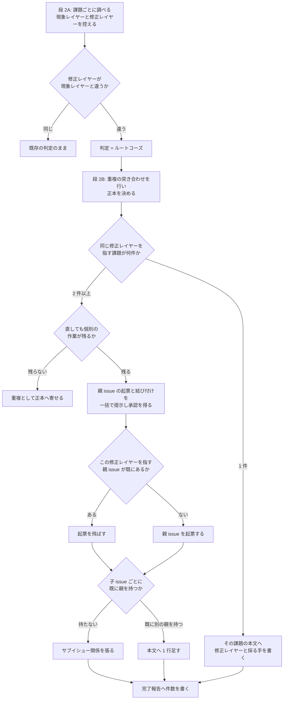
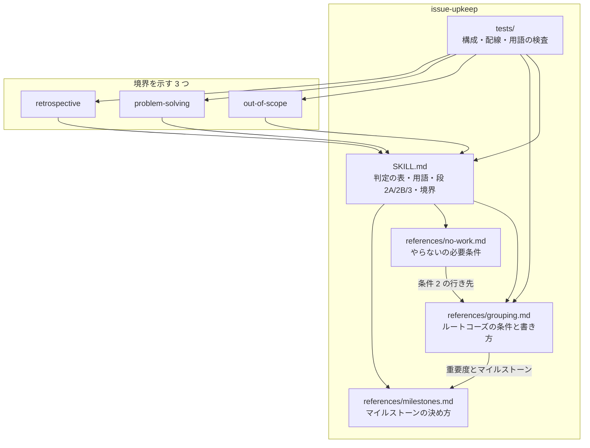
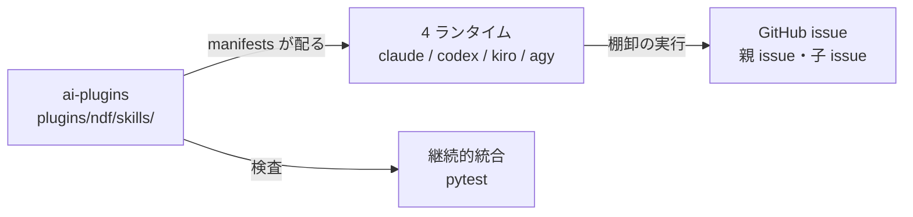

# #712 / #713: 課題を根本原因の場所で直せるようにする（設計）

何を満たせば完了かは [issue-712-713-requirements.md](issue-712-713-requirements.md) にある。
この文書は「どう作るか」だけを扱う。用語（棚卸・判定・ルートコーズ・クラスタ・親 issue・
子 issue・マイルストーン・段 2A / 2B / 3・4 クラスタ）も同じ文書が定める。

## 何を作るか

溜まった課題を見直す工程（棚卸）に、**その課題を現れている場所ではなく根本原因の場所で直す**
と決める判定を足す。名前は「ルートコーズ」で、既存の 7 つの判定に並ぶ 8 つ目になる。

直す場所（修正レイヤー）と直し方（採る手）を記録に残す。同じ修正レイヤーを指す課題が
2 件以上あれば、その原因を直すための課題（親 issue）を 1 件つくり、子 issue として
結び付ける。子 issue は閉じない。

あわせて、この判断を `issue-upkeep` が持つことを 4 つの Skill の境界へ書く。

## 実例で追う: 6 件が同じ根本原因を指すまで

要求の「実例」で挙げた 6 件（#671 #577 #459 #684 #642 #653）が、棚卸の中でどう扱われるかを
段ごとに並べる。

### 段 2A — 課題ごとに調べる（複数人で分担する）

担当は課題を 1 件ずつ実物と照らし合わせ、判定の材料を控える。ここで 1 行足す。

```text
#671  現象レイヤー: 工程の進行を記録するスクリプト
      修正レイヤー: 失敗の扱いを決める共通の層
#577  現象レイヤー: 配布物の検査スクリプト
      修正レイヤー: 失敗の扱いを決める共通の層
#653  現象レイヤー: 継続的統合の必須の検査の設定
      修正レイヤー: 失敗の扱いを決める共通の層
```

**この段ではクラスタを決めない。** 担当は割り当てられた課題しか見ておらず、他の課題の控えが
見えないためである。控えるのは、この課題が現れている場所（現象レイヤー）と、直すべき場所
（修正レイヤー）の 2 つである。

**現象レイヤーはスクリプトに限らない。** 失敗に気づいた場所がそれを判定へ渡さないまま先へ
進む形であれば、設定も同じ修正レイヤーを指す。#653 が現れているのは検査の必須指定であり、
直すべき場所は他の 5 件と同じ層である。

### 段 2B — 全体で突き合わせる（分担しない）

**重複の突き合わせを先に行う。** 既存の段 2B は、重複と判定された組の正本をここで決める。
段 3 の対応は「同じ課題ではない」ことを前提にするため、その結果を材料にする。

**6 件とも、修正レイヤーが現象レイヤーと違う。** 現れているのは記録のスクリプトや検査の
設定だが、直すべきは失敗の扱いを決める共通の層である。条件はこれだけなので、6 件の判定は
「ルートコーズ」になる。

正本が決まった後に控えを並べると、**6 件が同じ修正レイヤーを指している**ことが分かる。
2 件以上あり、層を作った後も 6 か所それぞれに当てはめる作業が残るため、親 issue を 1 件
つくって結び付ける。

**採る手は新設である。** 失敗を届ける層そのものが無い。既にある層へ責務を寄せるなら移動、
複数の場所に散っているなら統合になる。

**各所への当てはめは、クラスタを分ける理由にならない。** 6 か所それぞれに作業が残ることは、
段 3 の対応が親 issue をつくる側に置いた条件である。当てはめ先がスクリプトと設定に分かれても、
直す層は 1 つのままである。

### 段 3 — 反映する

親 issue を 1 件つくり、子 issue 6 件を結び付ける。**どちらも外部から見える場所への
書き込みであるため、段 2B の後に 2 つをまとめて提示し、承認を得てから行う。**

```text
親 issue（新規）
  修正レイヤー: 失敗の扱いを決める共通の層
  採る手: 新設
  どの課題がこれを指すか: #671 #577 #459 #684 #642 #653（現象レイヤーと観測を 1 行ずつ）

子 issue 6 件
  #671 #577 #684 #642 #653 … サブイシュー関係を張る（属するクラスタが 1 つ）
  #459 ………………………………… 本文へ 1 行足す（2 つ目のクラスタのため）
```

**#459 だけ持ち方が違う。** この課題は「配布済みの版と開発中の版が食い違う」にも属しており、
サブイシュー関係はそちらへ先に張られる。子 1 件が持てる親は 1 件だけなので、2 つ目は本文の
1 行で指す。

## 判定の集合

**7 つから 8 つへ増やす。** 並びは次のとおりで、`SKILL.md` の表がこの並びの正本である。

| 順 | 判定 | 選ぶ条件 | 段 3 での対応 |
| --- | --- | --- | --- |
| 1 | そのまま | 本文と現状が一致している | 何もしない |
| 2 | 追記が要る | 本文は有効だが、数値・パス・関連する課題の状態が古い | 該当箇所だけを直す |
| 3 | 書き直しが要る | 本文の前提が現状と食い違う | 主旨を変えずに前提を書き直す |
| 4 | 閉じてよい | すでに直っている | 実行結果を添えて閉じる |
| 5 | やらない | 課題は成り立つが、抱える費用が直す費用を下回る | `wontfix` を付け、理由と再燃の条件を添えて閉じる |
| 6 | 重複 | 他の課題と同じもの | 段 2B で正本を決める |
| 7 | **ルートコーズ** | **修正レイヤーが現象レイヤーと違う。現れている場所では直さない** | **修正レイヤーと採る手を記録する。同じ層を指すものが 2 件以上なら親 issue をつくって結び付ける** |
| 8 | 要判断 | 自動で決められない | 人へ返す。反映しない |

**`重複` の次に置く。** どちらも課題をまたいで決まり、段 2B で確定する。`要判断` は自動で
決められないものの受け皿であり、末尾から動かさない。

## ルートコーズと判定してよい条件

**条件は 1 つである。修正レイヤーが現象レイヤーと違うこと。** 課題が現れている場所では
直せない、または直すべきでないとき、この判定が付く。

| 条件 | 確かめ方 | 欠けたときの行き先 |
| --- | --- | --- |
| 修正レイヤーが現象レイヤーと違う | 段 2A が控えた 2 つを見比べる | 同じなら**既存の判定のまま**。現れている場所がそのまま直す場所である |

**件数は条件ではない。** 1 件でも、直す場所が上位にあるなら上位で直す。件数が決めるのは、
記録を親 issue に持つか、その課題の本文に持つかだけである。

## 段 3 での対応

**同じ修正レイヤーを指す課題が何件あるかで、記録の持ち方が決まる。**

| 同じ修正レイヤーを指す件数 | 直しても個別の作業が残るか | 対応 |
| --- | --- | --- |
| 1 件 | — | その課題の本文へ修正レイヤーと採る手を書く |
| 2 件以上 | 残る | 親 issue を 1 件つくり、子 issue として結び付ける |
| 2 件以上 | 残らない | **重複**として正本へ寄せる |

**3 行目が重複との境目である。** 修正レイヤーを直せば全部が消えるなら、それは同じ課題で
ある。消えずに個別の作業が残るなら、原因は同じでも別の課題である。

**1 件のときに親 issue を作らないのは、指す先が増えないためである。** 親と子が 1 対 1 に
なり、同じ内容の課題が 2 件並ぶ。

## 修正レイヤーの決め方

**現象レイヤーと修正レイヤーを分けて書く。** 分けないと、呼び出し側を 1 件ずつ直す形と、
上位の層を 1 度直す形が同じ記述になる。

| 現象レイヤーの例 | 修正レイヤーの例 |
| --- | --- |
| 各コントローラ | モデル。その振る舞いを持つべき層 |
| 各サブクラス | 親クラス |
| 移譲している側 | 移譲元 |
| 各スクリプト | 共通の層 |
| 各呼び出し箇所 | 呼び出される側の契約 |

**さかのぼる段数を決めない。** 現象レイヤーから呼び出し元・親クラス・移譲元をたどり、
**その責務を持つべき場所**で止まる。何段上がってもよい。

**止める目印は「そこを直せば、現象レイヤーの各所が同じ形で直るか」である。** 直らないなら、
まだ責務を持つべき場所に届いていない。直るなら、それより上へは行かない。

**修正レイヤーが現象レイヤーと同じこともある。** その課題が現れている場所が、その責務を
持つべき場所である場合で、控えには「同じ」と書く。

## 課題が書いている直し方をそのまま採らない

**起票は現象を見て書かれる。** 本文に「どう直すか」が書かれていても、それは現象レイヤーの
言葉になっていることが多い。**棚卸は、その直し方が症状に効くのか原因に効くのかを見直す。**

| 本文が書いていること | 棚卸が確かめること |
| --- | --- |
| この関数に検査を足す | 検査が無いのはこの関数だけか。呼び出し側すべてに同じ検査が要るなら、直す場所は呼び出される側の契約である |
| この設定を直す | 同じ設定が他にもあるか。散っているなら、直す場所は設定を持つ層である |
| この 3 件をまとめて直す | まとめることは手段である。まとめた先で何を直すのかが修正レイヤーである |

**手段が目的の位置に来ていないかを見る。** 「まとめる」「整理する」「統一する」「揃える」は
手段を表す語である。本文がこれで終わっているなら、**その先の「何が直るのか」を修正レイヤーと
して書き出す**。書き出せないなら、まだ原因に届いていない。

## 採る手

**5 つに限る。手は判定の条件ではない。** 親 issue に書く項目であり、1 つに決まらないときは
当てはまるものを全部書く。

| 手 | いつ選ぶか | 対応する手法（`refactoring` の呼び名） |
| --- | --- | --- |
| 移動 | 修正レイヤーは既にあるが、責務がそこに無い | `move_responsibility` |
| 統合 | 同じ責務が複数の場所に散っている | `consolidate_duplication` / `centralize_configuration` |
| 新設 | 修正レイヤーがまだ無い | 該当なし。完了条件が作る対象を名指しする |
| 向きの修正 | 依存や移譲の向きが逆で、下位が上位を決めている | `fix_dependency_direction` |
| 分離 | 1 つの層が 2 つの責務を持ち、片方だけを直せない | `extract_strategy` / `split_into_pipeline` |

**手法の呼び名は `refactoring` の `references/vocabulary.md` から採る。** そのファイルが
呼び名を持つ唯一の場所であり、ここで別の呼び名を作らない。当てはまる手法が無いのは新設だけで、
そのときは完了条件が作る対象を名指しする。

**修正レイヤーが 2 つ以上にまたがっても、判定は変わらない。** またがることは、直さなくてよい
理由にならない。親 issue に層と手を並べて書き、どこで分けるかは着手の時点（マイルストーンの
割り当てと実装計画）が決める。

## 親 issue と子 issue

**親 issue に書くのは、修正レイヤー・採る手・子 issue の一覧（番号と現象レイヤーと観測を
1 行）・完了条件の 4 つである。** 見出しの形は決めない。

**子 issue の中身を写さない。** 写すと同じ再現手順が 2 か所に残り、片方だけが古くなる。
子 issue を閉じないため、本体はそちらに残る。

### 結び付け方

**既定は GitHub のサブイシュー関係である。** 多数のケースは 1 対多で、この機能がそのまま
当てはまる。**渡すのは issue の番号ではなく、データベースの ID である。**

```bash
child_id=$(gh api "repos/<所有者>/<リポジトリ>/issues/<子の番号>" --jq '.id')
gh api --method POST "repos/<所有者>/<リポジトリ>/issues/<親の番号>/sub_issues" \
  -F sub_issue_id="$child_id"
```

**2 つ目以降のクラスタと、サブイシューの API を持たないリポジトリでは、本文へ親 issue を
指す 1 行を足す。** 子 1 件が持てる親は 1 件だけであり、複数のクラスタへ属する課題は関係
だけでは扱えない。

### 段 2A が控える項目

既存の 6 項目に 2 つ足す。

| 項目 | 何に使うか |
| --- | --- |
| 番号 | 段 3 の照合 |
| `updated_at` | 段 3 の照合 |
| 本文の要約値 | 段 3 の照合 |
| 判定と根拠 | 段 2B と段 3 |
| 反映で行う変更 | 段 3 |
| 依存する課題の番号 | 段 2B と反映の順序 |
| **現象レイヤー** | **この課題が現れている場所。ファイル・クラス・層のいずれかで書く** |
| **修正レイヤー** | **直すべき場所。その責務を持つべき場所までさかのぼる。本文が書いている直し方をそのまま採らない。段 2B がクラスタを確定する材料** |

## 処理の流れ



**起票の判定と結び付けを分ける。** 起票はクラスタに 1 度、結び付けは課題ごとに行う。
まとめて扱うと、書き込みの制限で途中で止まったときに、起票済みを理由として残りの課題への
追記が飛ぶ。

**やり直しで 2 度作らない見分け方は、親 issue の側から引く。** 起票済みかは、この修正レイヤーを
指す親 issue を探して決める。結び付け済みかは、その親 issue の子の一覧で決める。

```bash
gh api "repos/<所有者>/<リポジトリ>/issues/<親の番号>/sub_issues" --jq '.[].number'
```

**子がすでに別の親を持つかは、子の側から引く。** 単数で返るため、値があれば 2 つ目の
クラスタであり、本文の 1 行で指す。

```bash
gh api graphql -f query='{repository(owner:"<所有者>",name:"<リポジトリ>")
  {issue(number:<子の番号>){parent{number}}}}'
```

## 既存の規則のうち、直すもの

判定の集合へ値を足すと、それまでの 7 つだけを想定して書かれた規則が、新しい値に当てはまらない
まま残る。次の 3 か所がこれに当たる。**直さないと、クラスタの候補が「重複」へ流れて片方が
閉じられる。**

| 箇所 | 現状 | 直す形 |
| --- | --- | --- |
| `no-work.md` の条件 2 の行き先 | 「重複」固定 | 寄せ先が同じ課題なら「重複」。同じ課題ではなく、同じ修正レイヤーを指すものが 2 件以上あって条件（修正レイヤーが現象レイヤーと違う）を満たすなら「ルートコーズ」。どちらでもないなら寄せ先が無く、条件は欠けていない |
| `no-work.md` の条件 2 の確かめ方 | 「段 2B の重複の突き合わせの結果を使う」 | 重複とルートコーズの両方の突き合わせの結果を使う（重複が先、ルートコーズが後） |
| `SKILL.md` 段 2B の注記 | 起点が同じ 2 件を重複の枠で説明する | 個別の作業が残るものはルートコーズへ倒す分岐を足す |

**判定とは別の理由で直すものが 3 か所ある。** 親 issue の入れ先を決めるのは `milestones.md` の
「直近のマイルストーン」だが、その判定が版数を読む形になっている。このリポジトリの open の
マイルストーンは版数を持たず、2 桁の連番で順序を表す（`AGENTS.md` の「版と配布の方針」）。
実測でも open は `03 研究基盤` `14 利用者を増やす` のような連番の名前で、版数の名前を持つのは
closed だけである。**直さないと親 issue の入れ先が決まらない。**

| 箇所 | 現状 | 直す形 |
| --- | --- | --- |
| `milestones.md` の「直近」の判定 | open のうち版数が最も小さいもの | open のうち、名前の先頭の連番が最も小さいもの |
| `milestones.md` の「新しく作るとき」の版数 | 既存の最大の次の版数（`v10.9.0` があれば `v10.10.0`） | 既存の最大の次の連番。名前は `<2 桁の連番> <主題>` |
| `milestones.md` の「順序を直すとき」の基準 | 「依存の記述が版数の順序と食い違うとき」「A が後の版にあるなら」 | 「依存の記述が連番の順序と食い違うとき」「A が後の連番にあるなら」 |

**閉じた親 issue の子 issue を拾う経路が無い。** 子 issue は閉じない（決定 4）ため、原因が
直って親 issue が閉じた後も open のまま残る。子 issue は親と別のマイルストーンにいることが
あり、段 1 の 3 つの経路はそれを名指ししていない。**直さないと、原因が直ったことを子 issue へ
反映する機会が来ない。**

| 箇所 | 現状 | 直す形 |
| --- | --- | --- |
| `SKILL.md` 段 1 の経路 | 機械の候補・担当が足す・マイルストーンの 3 つ | 4 つ目として「このまとまりで閉じた親 issue の子 issue」を足す |

## 4 つの Skill の境界

**2 × 2 の表の正本を `issue-upkeep` に置く。** 他の 3 つはそこを指す。

| 判断 | 発見の瞬間 | 溜まった課題 |
| --- | --- | --- |
| 価値（やるか） | `out-of-scope` の「起票しない」 | `issue-upkeep` の「やらない」 |
| 構造（どこを直すか） | `out-of-scope` の「範囲内へ入れる」、`problem-solving` の「上流で直す」 | **`issue-upkeep` の「ルートコーズ」** |

| Skill | 何を足すか |
| --- | --- |
| `issue-upkeep` | 上の表そのもの。価値と構造の両方について担い手を示す |
| `out-of-scope` | 「蓄積した課題には及ばない」の及ぶ先が `issue-upkeep` であること |
| `problem-solving` | 「上流で直す」（見つけて直している最中の 1 件）と「ルートコーズ」（溜まった課題の棚卸）の違いが、件数ではなく見る対象で分かれること。`issue-upkeep` へのリンク |
| `retrospective` | クラスタの発見を担わないことと、その理由 |

## 構成要素

| 要素 | 責務 |
| --- | --- |
| `issue-upkeep/SKILL.md` の判定の表 | **8 つの判定の並びの正本。** 他の箇所はこの並びを参照する |
| `issue-upkeep/SKILL.md` の用語の表 | **ルートコーズ / クラスタ / 親 issue / 子 issue の定義の正本** |
| `issue-upkeep/SKILL.md` の段 1 | 閉じた親 issue の子 issue を拾う経路を足す |
| `issue-upkeep/SKILL.md` の段 2A | 控える項目に「現象レイヤー」と「修正レイヤー」を足し、確かめる点を 6 点にする |
| `issue-upkeep/SKILL.md` の段 2B | 突き合わせの表に「同じ原因を持つクラスタ」を足し、注記へ分岐を足す |
| `issue-upkeep/SKILL.md` の段 3 | 親 issue を作って子 issue を結び付ける手順と、2 度行わない見分け方 |
| `issue-upkeep/SKILL.md` の「扱う 3 つ」 | 4 つ目としてクラスタを扱う判断を足す |
| `issue-upkeep/SKILL.md` の境界の節 | **2 × 2 の表の正本** |
| `issue-upkeep/references/grouping.md`（新設） | ルートコーズの条件・段 3 での対応・修正レイヤーの決め方・本文の直し方をそのまま採らない見直し・採る手の 5 つ・親 issue に書く 4 つ・結び付け方 |
| `issue-upkeep/references/no-work.md` | 条件 2 の行き先と確かめ方を直す |
| `issue-upkeep/references/milestones.md` | 親 issue の割り当てを足し、着手の時期を指す語を揃え、直近と順序の判定を連番基準へ直す |
| `out-of-scope/SKILL.md` の境界の節 | 及ぶ先を示す |
| `problem-solving/SKILL.md` | 上流で直すこととの違いを示す |
| `retrospective/SKILL.md` | クラスタの発見を担わないことを示す |
| `issue-upkeep/tests/test_issue_upkeep_layout.py` | 並び・参照・配線・用語の検査 |



## 置き場所

```text
plugins/ndf/skills/
├── issue-upkeep/
│   ├── SKILL.md                         # 判定の表・用語・段 1/2A/2B/3・境界・完了報告
│   ├── references/
│   │   ├── grouping.md                  # 新設
│   │   ├── no-work.md                   # 条件 2 の行き先と確かめ方を直す
│   │   └── milestones.md                # 親 issue の割り当てと、直近・順序の判定を直す
│   └── tests/
│       └── test_issue_upkeep_layout.py  # 並び・参照・配線・用語
├── out-of-scope/SKILL.md                # 境界の節
├── problem-solving/SKILL.md             # 上流で直すこととの違い
└── retrospective/SKILL.md               # クラスタを担わない理由
```

**新しいテストファイルを作らない。** 同じ Skill の構成を検査する 1 本が既にある。

**判定の並びと 2 × 2 の表は `issue-upkeep/SKILL.md` の 1 か所にだけ置く。** 同じ表を写すと、
判定を増やしたときに片方が古くなる。

## 配布と外部の系

変えるのは配布物の文書であり、外側には 4 つのランタイムと GitHub がある。



## 非機能の実現方式

| 項目 | 条件 | 実現方式 |
| --- | --- | --- |
| 外部への書き込みの量 | 1 クラスタにつき起票 1 件と、子 issue 2 件以上の結び付けが増える。多数はサブイシュー関係で、本文の更新は 2 つ目以降のクラスタだけに起きる | 既存の「外部への書き込みの制限」の待ち方をそのまま使う。**処理するクラスタの数に上限を置かない** |
| 中断からの再開 | やり直しで親 issue が 2 件にならず、同じ子を 2 度結び付けない | この修正レイヤーを指す親 issue を探して起票の要否を決め、その親の子の一覧で結び付けの要否を決める |
| サブイシューの API を持たないリポジトリ | 親子の関係を張れない | すべて本文の 1 行で指す。判定も手順も変わらない |
| マイルストーンを持たないリポジトリ | 親 issue の割り当て先が無い | 既存の「他のリポジトリで動くこと」の規則がそのまま覆う。**表に行を足さない** |
| 重要度ラベルを持たないリポジトリ | クラスタの最高値を採れない | 説明が無ければ付け替えないという既存の規則が覆う。親 issue は重要度なしで作る |

## 決定の記録

**[issue-712-713-decisions.md](issue-712-713-decisions.md) にある。**
決定が 21 件あり、設計文書が 500 行を超えるため分けた。

## テスト設計

| 受け入れ条件 | 何で確かめるか |
| --- | --- |
| AC1 | `test_the_verdict_table_lists_eight_in_order`（判定の並びを 8 つへ） |
| AC2 | `test_cluster_is_reachable_from_the_verdict_table` |
| AC3 | `test_creating_the_parent_needs_approval` |
| AC4 | `test_upkeep_handles_four_things` |
| AC5 | `test_stage_2a_records_the_shared_cause` |
| AC6 | `test_stage_2b_matches_issues_by_shared_cause` |
| AC7 | `test_stage_2b_note_branches_to_cluster` |
| AC8 | `test_cluster_separates_itself_from_duplication` |
| AC9 | `test_root_cause_has_one_condition`（条件が 1 つであること、件数が条件でないこと） |
| AC10 | `test_cluster_keeps_the_child_issues_open` |
| AC11 | `test_cluster_shows_the_body_of_the_parent_issue` |
| AC12 | `test_an_issue_may_join_two_clusters` |
| AC13 | `test_cluster_does_not_gate_on_size`（層がまたがっても判定が変わらないこと、手が条件でないこと） |
| AC14 | `test_parent_takes_the_highest_priority_in_the_cluster` |
| AC15 | `test_upkeep_files_only_the_parent_issue` |
| AC16 | `test_the_report_counts_the_clusters` |
| AC17〜AC20 | 上記の各テスト |
| AC21 | `uv run --with pytest pytest plugins/ndf/skills/issue-upkeep/tests -q` |
| AC22〜AC24 | **手動確認。** `gh issue view` の出力を Pull Request の本文へ残す |
| AC25〜AC27 | `test_the_boundary_table_covers_both_judgements` |
| AC28 | `test_problem_solving_separates_upstream_from_cluster` |
| AC29 | `test_retrospective_declines_cluster_discovery` |
| AC30 | `test_the_callers_point_here`（対象へ `problem-solving` を足す） |
| AC31 / AC32 | `test_the_terms_are_loanwords`（4 語の定義と、置き換えた語が残っていないこと） |
| AC35 | `test_grouping_separates_the_two_layers`（現象レイヤーと修正レイヤー、段数を決めないこと、止める目印） |
| AC36 | `test_grouping_lists_five_moves`（5 つの手と、`refactoring` の呼び名への対応） |
| AC37 | 上の 2 つ。手法の呼び名が `refactoring/references/vocabulary.md` に実在することも照合する |
| AC33 | `test_milestones_use_one_word_for_the_timing` |
| AC34 | **手動確認。** `gh issue view 712` / `gh issue view 713` |
| AC38 / AC39 / AC40 | `test_milestones_pick_the_nearest_by_sequence`（直近と順序を連番で決め、「版数が最も小さい」「版数の順序」が残っていないこと） |
| AC41 / AC42 | `test_no_work_has_two_necessary_conditions`（条件 2 の行き先の 3 分岐と、確かめ方の文言） |
| AC43 / AC44 | `test_cluster_never_defers_to_a_human`（`grouping.md` に `要判断` が無く、判定の行き先 2 つと段 3 での対応の 3 つがそろっていること） |
| AC45 | `test_the_skill_carries_only_what_it_must`（書式の雛形が無いこと） |
| AC50 | `test_stage_1_picks_up_children_of_a_closed_parent` |
| AC46 | `test_stage_3_has_three_outcomes`（件数と個別の作業の有無で 3 つに分かれること） |
| AC47 / AC48 / AC49 | `test_grouping_rereads_the_stated_fix`（本文の直し方をそのまま採らないこと、手段の語で終わる本文の読み方） |

**`no-work.md` へ新しいテストを足さない。** 既存の
`test_no_work_has_two_necessary_conditions` が条件の文言を照合しており、行き先の列も
同じ表の中にある。

## 未確認のまま残ること

| 項目 | 内容 |
| --- | --- |
| 親 issue をつくる下限 2 件の妥当性 | 2026-09-16 の棚卸の 4 クラスタ（6 / 4 / 4 / 3 件）だけが材料で、2 件のクラスタを実際に扱った例が無い |
| 原因が直った後の閉じ方 | 「閉じてよい」の判定で閉じる想定だが、原因が直るのは別のマイルストーンであり、この変更では確かめられない |
| 4 クラスタのうち処理しない 2 つ | 完了条件は 2 つ以上である。残りを次の棚卸が同じ手順で扱えるかは、その棚卸で分かる |
