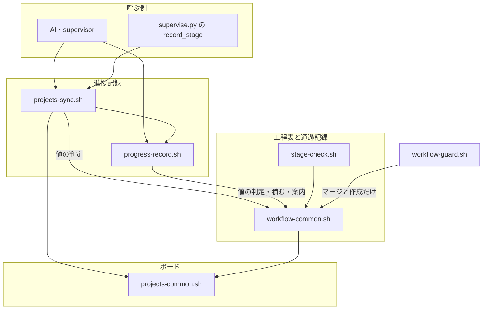
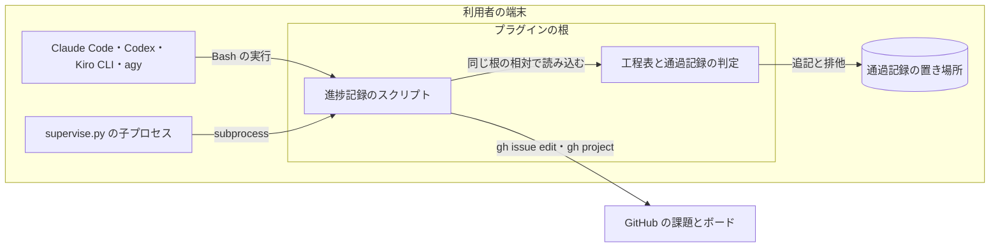
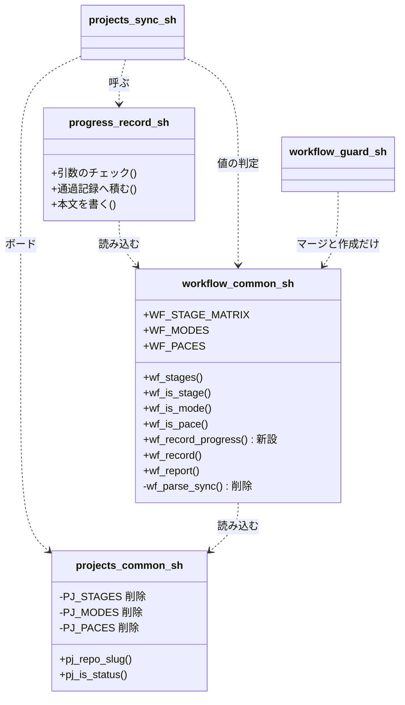
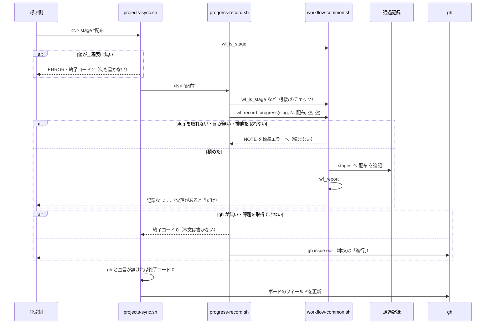
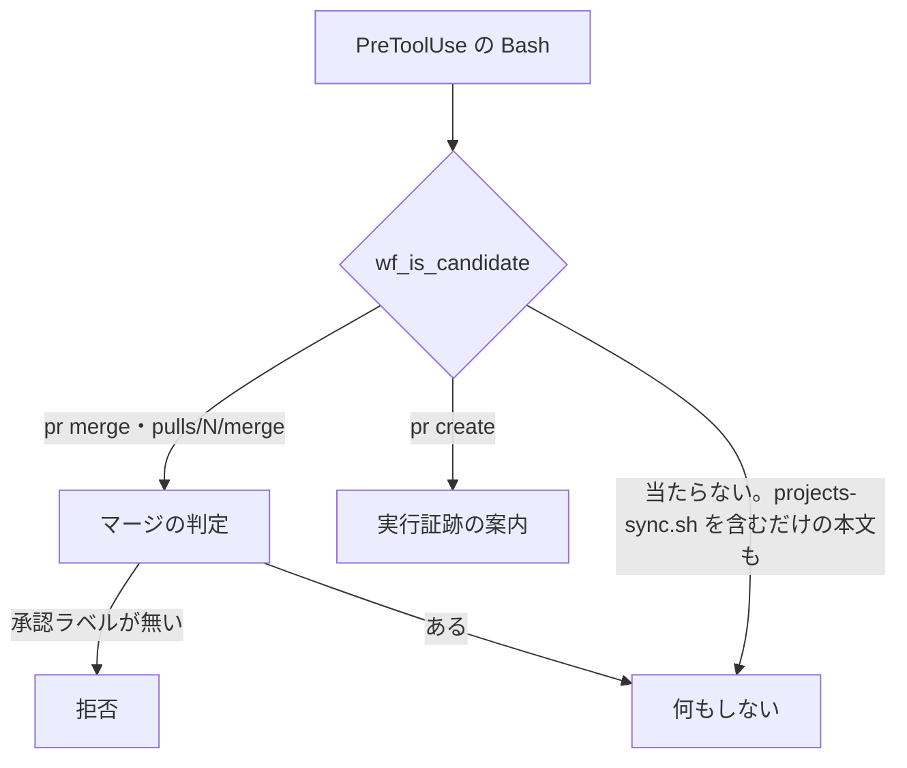

# #725: 通過記録を進捗記録のスクリプト自身が積む

要求と受け入れ条件は #725 の本文にある（コピーは [issue-725-requirements.md](issue-725-requirements.md)）。
この文書は「どう作るか」だけを扱う。

**画面と API の仕様記述（OpenAPI）は作らない。** 呼び出される約束はシェルのコマンドの引数・標準出力・
終了コードだけで、その形は「入出力の契約」の表で書く。

## 具体例: devbase#249 の 3 層の supervisor

ndf 10.17.0 の Claude Code のサブエージェント（3 層の supervisor）が、`progress-record.sh 249 "構造改善"` を
1 回の Bash に 1 件だけで実行した。課題の本文には `#249 進行 = 構造改善` が書かれたが、直後の
`stage-check.sh report 249` は記録が無い旨の 1 行を返した。

| 時点 | 今 | この設計の後 |
| --- | --- | --- |
| `progress-record.sh 249 "構造改善"` を実行する | 本文だけが書かれる。通過記録を積むのは `projects-sync.sh` の文字列を見た hook だけで、`progress-record.sh` は見ない。そのうえ hook は `development-workflow` を起動した会話にしか登録されない | `progress-record.sh` が引数をチェックした直後に、`devbasex/devbase` の 249 の通過記録へ `構造改善` を積む |
| `stage-check.sh report 249` を実行する | 記録が無い旨の 1 行 | `記録あり: …構造改善` を含む通過工程の一覧 |

**同じ 1 か所の変更で、5 つの子 issue の現象が消える。** どの現象も「hook が文字列から推測して積む」
ことから出ている。

| 子 issue | 今の現象 | 消える理由 |
| --- | --- | --- |
| #452 | 本文と通過記録が食い違っても、どちらも気づかない | 本文を書くスクリプトと同じプロセスが、同じ引数で積む |
| #487 | 1 回の実行に並べた 2 件目以降と、番号を変数で書いた記録が積まれない | シェルが展開した後の引数で、呼ばれた回数だけ積む |
| #580 | ヒアドキュメントやコメントに書いた例が積まれる | 実行されない文字列からは何も積まない |
| #459 | 開発中の版の工程名が、配布済みの版の hook の一覧に無く捨てられる | 積む側と工程名の一覧が同じプラグインの根にあり、常に同じ版である |
| #961 | 3 層の supervisor と `supervise.py` の子プロセスでは 1 件も積まれない | hook の登録にも Tool の実行にも依らない |

## ドメインモデル

### コンテキスト

| コンテキスト | 何の語が 1 つの意味に決まるか |
| --- | --- |
| NDF の開発ワークフロー（`ndf-workflow`） | 工程・モード・進め方・進捗記録・通過記録・通過工程・ボード |

この変更は `ndf-workflow` の中で閉じる。

### 集約

| 集約 | 持ち主（書き換えてよいもの） | 根 | エンティティ | 値オブジェクト |
| --- | --- | --- | --- | --- |
| 通過記録 | 進捗記録のスクリプト（`progress-record.sh`）。手で積む口として `stage-check.sh record` も残す | 課題ごとの通過記録のファイル（鍵は `<所有者>/<リポジトリ>` と課題番号） | — | 工程名・モード・進め方 |
| 課題の本文の「進行」 | 進捗記録のスクリプト（`progress-record.sh`） | 課題の本文の `## 進行` の節 | — | 工程名・時刻・モード・進め方・worktree・計画 |
| 工程表 | `development-workflow`（`workflow-common.sh`） | 工程名とモードごとの分類の表 | — | 工程名・モード・進め方 |

**通過記録の持ち主を hook から `progress-record.sh` へ移す。** いまは 2 つの書き手（hook と
`stage-check.sh record`）がいて、本文を書く側（`progress-record.sh`）とは別のプロセスが推測で積んでいる。

**工程表は 1 か所にする。** いまは本文の側の `PJ_STAGES`（`projects-common.sh`）と通過記録の側の
`WF_STAGE_MATRIX` の 1 列目に同じ一覧が 2 つある。モードの `PJ_MODES` / `WF_MODES` と進め方の
`PJ_PACES` / `WF_PACES` も同じ形で 2 つある。3 つとも `workflow-common.sh` の 1 か所だけに置く（決定 3）。

### 不変条件

| # | 集約 | 条件 | 破れたときの扱い |
| --- | --- | --- | --- |
| I1 | 通過記録 | 引数のチェックを通った進捗記録 1 回につき、キー（`stage` / `mode` / `pace`）ごとにちょうど 1 件積む。`projects-sync.sh` が中で `progress-record.sh` を呼んでも 2 件にならない | テストが落ちる |
| I2 | 通過記録 | 積むかどうかは、課題の本文の書き換えの成否・`gh` の有無・ボードの宣言の有無に依らない | テストが落ちる |
| I3 | 通過記録 | 積めないときも終了コード 0 で続ける。リポジトリを特定できない・`jq` が無いときは、どのキーも積まず標準エラーへ 1 行残す。排他はキーごとに取り、取れなかったキーだけを積まずにそのキーごとに標準エラーへ 1 行残し、残りのキーは続けて積む（呼び出し全体を原子的には扱わない。積めなかった `stage` は報告の「記録なし」に出る） | 進行管理が理由で工程が止まる。テストが落ちる |
| I4 | 通過記録 | `--repo <所有者>/<リポジトリ>` を渡した記録は、そのリポジトリの鍵の通過記録へ積み、いまのリポジトリの同じ番号の通過記録を変えない | テストが落ちる |
| I5 | 通過記録 | hook は、コマンドの文字列から通過記録を作らず、変えない | テストが落ちる |
| I6 | 工程表 | 工程名・モード・進め方の一覧は 1 か所にあり、本文の書き手と通過記録の書き手が同じ一覧を読む | 一覧を写した定数があればテストが落ちる |
| I7 | 通過記録 | 引数の誤り（知らないキー・工程表に無い値・引数の不足）では、通過記録も本文も変えずに終了コード 2 で終わる | テストが落ちる |

### ドメインイベント

| # | イベント | 発生元 | 受け手 |
| --- | --- | --- | --- |
| E1 | 進捗記録のスクリプトが呼ばれた | AI・supervisor・`supervise.py` の `record_stage` | `projects-sync.sh` / `progress-record.sh` |
| E2 | 引数をチェックした | `projects-sync.sh`（キーと値）・`progress-record.sh`（工程名とオプション） | `progress-record.sh` の後続の処理 |
| E3 | 課題の本文の「進行」を書き換えた | `progress-record.sh` | 課題の本文（`gh issue edit`） |
| E4 | 通過記録へ 1 件積んだ | `progress-record.sh`（`wf_record_progress`） | 通過記録のファイル |
| E5 | 記録の無い必須の工程を案内した | `progress-record.sh`（`wf_record_progress` の出力） | 呼んだ AI（標準出力） |
| E6 | ボードのフィールドを更新した | `projects-sync.sh` | ボード（`gh project item-edit`） |
| E7 | hook が Bash の実行を観測した | Claude Code の PreToolUse（`workflow-guard.sh`） | マージの拒否・Pull Request の作成の時点の実行証跡の案内だけ |
| E8 | 通過記録を報告した | `stage-check.sh report`・Pull Request の作成の時点の検査・`merged` | 呼んだ AI・人 |

### 用語

この変更は用語の意味を変えず、新しい語も足さない。

| 用語 | 意味 | 用語集への反映 |
| --- | --- | --- |
| 進捗記録 | 工程に入った時点で 1 回打つ記録。課題の本文の「進行」も同じ 1 回で更新される | 変えない（`development-workflow/references/glossary.md` の「英語や識別子」の列へ `progress-record.sh` を足すのは実装で行う） |
| 通過記録 | 通過工程を課題ごとに残したファイル | 変えない |
| 通過工程 | ある課題について、進捗記録が実際に書かれた工程の集合 | 変えない |

## 機能一覧

| # | 機能 | 誰が使うか |
| --- | --- | --- |
| F1 | 進捗記録を打つと、同じ呼び出しが通過記録へ工程・モード・進め方を積む | AI・supervisor・`supervise.py`（どのランタイムでも） |
| F2 | 他のリポジトリの課題への進捗記録を、そのリポジトリの通過記録へ積む | オーケストレーター（`progress-record.sh --repo`） |
| F3 | `配布` の進捗記録で、記録の無い必須の工程を同じ呼び出しの出力で案内する | リリースを進める AI |
| F4 | 工程名・モード・進め方を 1 つの一覧から読み、本文と通過記録で同じ値だけを受ける | 進捗記録のスクリプト・hook・`stage-check.sh` |
| F5 | hook は設計 Pull Request のマージの拒否と、Pull Request の作成の時点の実行証跡の案内だけを行う | Claude Code の利用者 |
| F6 | 1 回の実行に複数の進捗記録を並べてよいと手順書が案内する | `progress-tracking` を読む AI・supervisor |

## 構成要素

| 要素 | 置き場所 | 責務 | 変え方 |
| --- | --- | --- | --- |
| 進捗記録の書き手 | `plugins/ndf/scripts/progress-record.sh` | 引数のチェック → 通過記録へ積む（`wf_record_progress`）→ 課題の本文を書く。通過記録へ積むのはこのスクリプトだけ | 変更 |
| 進捗記録のエントリポイント | `plugins/ndf/scripts/projects-sync.sh` | 引数のチェック → `progress-record.sh` を呼ぶ → ボードを書く。**自分では通過記録へ積まない** | 変更（`gh` の有無を見るのを `progress-record.sh` の呼び出しの後へ移す） |
| 工程表と通過記録の判定 | `plugins/ndf/skills/development-workflow/scripts/lib/workflow-common.sh` | 工程名・モード・進め方の唯一の一覧。通過記録の読み書き・報告。`wf_record_progress` を足し、`wf_parse_sync` を消す。`wf_is_candidate` から進捗記録の見分けを外す | 変更 |
| ボードの判定 | `plugins/ndf/scripts/lib/projects-common.sh` | ボードの宣言・フィールド名・キャッシュ・`status` と文字列のキーの値の判定。工程名・モード・進め方の一覧を持たない | 変更（`PJ_STAGES` / `PJ_MODES` / `PJ_PACES` と `pj_is_stage` / `pj_is_mode` / `pj_is_pace` を消す） |
| hook | `plugins/ndf/skills/development-workflow/scripts/workflow-guard.sh` | マージの拒否と実行証跡の案内。進捗記録を観測しない | 変更（`wf_parse_sync` の節を消す） |
| 手で積む口と報告 | `plugins/ndf/skills/development-workflow/scripts/stage-check.sh` | `record` / `report` の引数と出力は変えない | 変えない |
| 子プロセスの記録 | `plugins/ndf/scripts/supervise_lib/state.py` の `record_stage` | `projects-sync.sh` を子プロセスで呼ぶ | 変えない（積まれるようになる） |
| 手順書 | `progress-tracking` の `SKILL.md` / `references/excerpt.md`、`development-workflow` の `SKILL.md` / `references/stage-completeness.md` / `references/agent-layers.md` / `references/glossary.md`、確定仕様 2 本 | 新しい積み方を書き、「1 回の実行に 1 件」「後片付けまでの記録は課題ごとに 1 回の実行」を外す | 変更 |

### 構成要素の関係



**hook から通過記録への辺が無くなる。** 通過記録を書く辺は `progress-record.sh` → `workflow-common.sh` と、
手で積む `stage-check.sh` → `workflow-common.sh` の 2 本だけになる。

### 文脈と配置



**通過記録は手元のファイルで、GitHub へは書かない。** 境界をまたぐのは課題の本文とボードへの書き込みだけで、
この変更はその経路を変えない。

### 置き場所

```text
plugins/ndf/
├── scripts/
│   ├── progress-record.sh                 # 変更: 積む・案内する
│   ├── projects-sync.sh                   # 変更: gh の確認を後ろへ。値の判定を wf_ へ
│   ├── lib/projects-common.sh             # 変更: 工程名・モード・進め方の一覧を消す
│   └── tests/                             # 変更: 進捗記録が積むことの結合テスト
└── skills/
    ├── development-workflow/
    │   ├── SKILL.md                       # 変更: hook の説明
    │   ├── references/                    # 変更: stage-completeness.md・agent-layers.md・glossary.md
    │   ├── scripts/workflow-guard.sh      # 変更: 進捗記録の節を消す
    │   ├── scripts/lib/workflow-common.sh # 変更: wf_record_progress を足し wf_parse_sync を消す
    │   └── tests/                         # 変更: hook が積まないこと・一覧の正規表現の読み先
    └── progress-tracking/
        ├── SKILL.md                       # 変更: 制約を外す
        └── references/excerpt.md          # 変更: 制約を外す
```

**`progress-record.sh` は `workflow-common.sh` を `"$SCRIPT_DIR/../skills/development-workflow/scripts/lib/workflow-common.sh"`
で読み込む。** `workflow-common.sh` がプラグインの根の `scripts/lib/` を 4 階層の相対で指す形（#293）の逆向きである。
4 つのランタイムの配置のどれでも、`scripts/` の 1 つ上にプラグインの根の `skills/` がある（agy の `dev.agy/scripts`
と `dev.agy/skills/development-workflow` はどちらも根への symlink）。

## 構造

シェルのライブラリには型が無いため、ライブラリとスクリプトを箱にし、この変更で足す・消す・呼び方を変える関数だけを
載せる。



## 入出力の契約

### `progress-record.sh`

| 項目 | 内容 |
| --- | --- |
| 入力 | 変えない。`<課題番号> <工程名\|-> [--mode M] [--pace P] [--worktree P] [--plan P] [--repo <所有者>/<リポジトリ>] [--note TEXT]` |
| 通過記録へ積む値 | `--mode` があれば `mode`、`--pace` があれば `pace`、工程名が `-` でなければ `stage` を、この順に 1 件ずつ。`--worktree` / `--plan` / `--note` は積まない |
| 鍵 | `--repo` があればその値、無ければ作業ディレクトリの `origin` の URL を畳んだ `<所有者>/<リポジトリ>` |
| 標準出力 | 今の `#<番号> 進行 = <工程>` などの 1 行に加えて、`stage` が `配布` で記録の無い必須の工程（`記録なし:` か `条件付き:` の行）があるときだけ、`wf_report` の出力をそのまま出す |
| 標準エラー | 積めなかったときに `NOTE:` で始まる行。リポジトリを特定できない・`jq` が無いときは 1 行、排他を取れないときは取れなかったキーごとに 1 行（最大 3 行。I3） |
| 終了コード | 変えない。引数の誤りだけ 2、それ以外は 0 |
| 互換性 | 引数と終了コードは同じ。標準出力に案内の行が増えることがある（`配布` のときだけ）。読む側に行数を固定して読むものは無い（`supervise.py` は出力を捨てる） |

**案内は本文の行より先に出る。** 通過記録へ積むのは本文を書く前（`gh` の有無を見る前）だからである。

### `projects-sync.sh`

| 項目 | 内容 |
| --- | --- |
| 入力・出力・終了コード | 変えない |
| 変わる振る舞い | `gh` が無くても `progress-record.sh` を呼ぶ（`progress-record.sh` が積んでから `gh` の有無を見る）。`stage` / `mode` / `pace` の値の判定を `wf_is_stage` / `wf_is_mode` / `wf_is_pace` で行う |
| 通過記録 | 自分では積まない。`progress-record.sh` を経由した 1 回だけが積む（I1）。`status` / `worktree` / `plan` では積まない |

### `wf_record_progress`（`workflow-common.sh` に足す関数）

| 項目 | 内容 |
| --- | --- |
| 入力 | `<slug> <課題番号> <工程名\|空> <モード\|空> <進め方\|空>`。値はチェック済みのものを受ける |
| 処理 | 空でないキーを `mode` → `pace` → `stage` の順に `wf_record` で積む。`stage` が `WF_REPORT_STAGE`（`配布`）のときだけ `wf_report` を呼び、`記録なし:` か `条件付き:` を含めば標準出力へ出す |
| 失敗の形 | `slug` が空・`jq` が無いときは何も積まず、標準エラーへ `NOTE:` の 1 行。排他は `wf_record` が 1 回ごとに取る。取れなかったキーは `wf_record` が今と同じ 1 行を出して飛ばし、`wf_record_progress` は止めずに次のキーを積む（部分的に積まれることがある。I3）。戻り値は常に 0 |

### `workflow-guard.sh`

| 項目 | 内容 |
| --- | --- |
| 入力 | 変えない（PreToolUse の JSON） |
| 出力 | 拒否（設計 Pull Request のマージ）と、Pull Request の作成の時点の実行証跡の案内の 2 通りと、何も出さない。`配布` の時点の案内は出さなくなる |
| 判定の対象 | `wf_is_candidate` は `pr merge` / `pulls/<番号>/merge` / `pr create` にだけ当たる。`projects-sync.sh` を含むだけの本文では語の分割まで進まない |

### `stage-check.sh`

変えない（`record <課題番号> <stage|mode|pace> <値>` / `report <課題番号>`、出力と終了コードも同じ）。

## 処理の流れ

**図に含めない要素がある。** 手順書は文書で、処理の流れを持たない。`stage-check.sh` は変えず、手で積む口と
報告のまま残る。`projects-common.sh` はボードの更新（`projects-sync.sh` → `gh`）の中で読まれる。`supervise.py` の
`record_stage` は「呼ぶ側」に含まれる。

### 1 回の進捗記録



**通過記録へ積むのは本文の書き換えより前である。** 本文の側には `gh` が無い・課題を取得できない・書き換えが
失敗したときの早い `exit 0` が並び、後ろへ置くとそのどれでも積まれなくなる（I2）。

**`projects-sync.sh` は、引数のチェックの直後に `progress-record.sh` を呼ぶ。** 今は `command -v gh` を
その前に置いているため、`gh` が無い環境では `progress-record.sh` まで届かない。`progress-record.sh` も
自分で `gh` の有無を見るため、確認を後ろへ移しても本文の書き換えの振る舞いは変わらない。

### hook



## 非機能の実現方式

| 大項目 | 要求の条件 | 実現方式 | 確かめ方 |
| --- | --- | --- | --- |
| 可用性 | 通過記録へ積めないことを理由に、進捗記録のスクリプトの終了コードを 0 以外にしない（呼び出し側の誤りの 2 だけを除く）。進行管理が理由で開発の工程を止めない | `wf_record_progress` は常に 0 を返し、`progress-record.sh` は戻り値を見ずに本文の処理へ進む。`workflow-common.sh` を読み込めないときは `projects-common.sh` と同じく `exit 0` で抜ける | 排他を取らせない・`origin` を外す・`jq` を外す状態で、終了コード 0 と本文の書き換えを見る |
| 性能・拡張性 | 排他を取れたときに、1 回の進捗記録へ足される時間は 1 秒未満である（ボードと `gh` を除いた手元の処理で実測し、Pull Request の本文へ載せる）。排他を待つ上限は既存の `NDF_STAGE_LOCK_TIMEOUT`（既定 5 秒）のまま変えない。hook は進捗記録のスクリプトで語の分割を行わなくなる | 足すのは `workflow-common.sh` の読み込みと `wf_record` 1〜3 回、`配布` のときだけ `wf_report` 1 回。排他の上限は `WF_LOCK_TIMEOUT` をそのまま使う | 下の実測を実装の後に同じ形で取り直し、Pull Request の本文へ載せる |
| 移行性 | 通過記録のファイルの形（`version: 1`）を変えない。旧い版の hook が併存しても、通過工程の判定は変わらない（前提 7） | `wf_record` をそのまま使い、ファイルの名前・JSON の形を変えない。旧い hook が同じ工程を積んでも、`wf_report` は工程の集合で判定する | 同じ工程を 2 回積んだ通過記録で、`report` の出力が 1 回のときと同じであることを見る |
| システム環境 | Claude Code・Codex・Kiro CLI・agy のどれで記録のスクリプトを呼んでも積まれる（hook の有無・Skill の起動の有無に依らない） | hook を使わず、スクリプトの中で積む。読み込みは同じプラグインの根の相対で辿る | `plugins/ndf/dev.agy/scripts/progress-record.sh`（symlink の経路）から呼んでも積まれることをテストで見る。各ランタイムの導入後の確認はリリース後テスト（`verify-install --runtimes claude,codex,kiro`） |

**設計の時点の実測**（2026-10-02、隔離した `XDG_STATE_HOME` と `origin` だけを持つ git リポジトリ）。
`workflow-common.sh` を読み込んで `wf_record` を 1 回呼ぶ `bash -c` を 10 回続けて 0.198 秒（1 回 約 20 ミリ秒）、
`mode` と `配布` を積んで `wf_report` まで呼ぶ 1 回で 0.073 秒だった。

```text
$ time (for i in 1..10; do bash -c ". workflow-common.sh; s=$(wf_repo_slug .); wf_record "$s" 42 stage 設計"; done)
real	0m0.198s
$ time (bash -c ". workflow-common.sh; …; wf_record "$s" 42 mode standard; wf_record "$s" 42 stage 配布; wf_report "$s" 42")
#42 の通過工程（standard）
  記録あり: 設計 / 配布
  記録なし: 要求と受け入れ条件 / 作業場所の用意 / … / 後片付け
real	0m0.073s
```

## 決定の記録

### 決定 1: 通過記録へ積むのは `progress-record.sh` の 1 か所にする

課題の本文を書くのは `progress-record.sh` で、`projects-sync.sh` の `stage` / `mode` / `pace` も必ずここを
通る。ここで積めば、`projects-sync.sh` を経ても直接呼んでも 1 回の進捗記録で 1 件になる（I1）。他のリポジトリへの
`--repo` を受けるのもこのスクリプトだけで、鍵を `--repo` のリポジトリにする条件（I4）がここでしか満たせない。

`projects-sync.sh` で積む形は採らない。`progress-record.sh` を直接呼ぶ記録（devbase#249 の形）が積まれず、
両方で積むと二重にしないための目印を引数か環境変数で渡すことになる。

根拠: Value 6（MVV 版 2）

### 決定 2: `stage-check.sh` を子プロセスで呼ばず、`workflow-common.sh` を読み込んで `wf_record_progress` を呼ぶ

`stage-check.sh record` の鍵は作業ディレクトリの `origin` で決まり、`--repo` を受けない。引数を足すと
`stage-check.sh` の契約を変えることになり、前提 1 に反する。ライブラリの関数を呼べば、鍵を呼ぶ側が渡せる。
`配布` の案内の判定（`wf_report` の出力のうち欠落の行があるときだけ出す）も、今は hook が持っているものを同じ
ライブラリの 1 つの関数へ移し、`progress-record.sh` は出力を整えるだけにする。`stage-check.sh` と同じライブラリを
同じ相対の経路で読むため、工程名の一覧と積む処理は常に同じ版になる（前提 6）。

`stage-check.sh record` の出力に案内を足す形は採らない。手で積む口の出力が変わり、前提 1 に反する。
環境変数で鍵を `stage-check.sh` へ渡す形も採らない。引数の表に現れない約束が増える。

根拠: Value 6 / Value 4（MVV 版 2）

### 決定 3: 工程名・モード・進め方の一覧は `workflow-common.sh` の 1 か所に置き、`projects-common.sh` から消す

工程表は `development-workflow` の持ち物で、`WF_STAGE_MATRIX` は工程名とモードごとの分類を同じ行に持つ。
進捗記録のスクリプトは決定 2 で `workflow-common.sh` を読み込むため、値の判定も `wf_is_stage` / `wf_is_mode` /
`wf_is_pace` を使える。`projects-common.sh` はボードの判定だけを持つ形に戻り、工程の一覧を写す理由が無くなる。
モードと進め方も同じ形で 2 つあるため、工程名と一緒に 1 か所にする。

一致を確かめるテストを足して 2 つの一覧を残す形は採らない。同じ役割の定数が 2 つ残り、一覧の変更のたびに
2 か所を直す。一覧を `scripts/lib/` の新しいファイルへ移す形も採らない。分類と工程名が同じ表の列であるため、
工程名だけを移すと表が割れ、表ごと移すと工程表の持ち主が `development-workflow` の外へ出る。

根拠: Value 6（MVV 版 2）

### 決定 4: 通過記録へ積むのは、本文の書き換えより前に置く

本文の側には `gh` が無い・課題を取得できない・書き換えが失敗したときの早い `exit 0` が並ぶ。後ろに置くと、
それぞれの出口で積み忘れないよう同じ呼び出しを足すことになる。前に置けば、引数のチェックを通った呼び出しは
必ず 1 回積む（前提 2・I2）。そのため `配布` の案内は本文の行より先に出る。

本文を書けたときだけ積む形は採らない。前提 2 が「本文の書き換えが失敗しても積む」と決めている。

根拠: Value 1 / Value 6（MVV 版 2）

### 決定 5: hook の進捗記録の節と `wf_parse_sync` を消し、`wf_is_candidate` から `projects-sync.sh` を外す

積む役目が無くなった hook に、進捗記録の文字列を見分ける理由は残らない。`wf_is_candidate` に残すと、進捗記録の
たびに語の分割（`hook.py words`）まで進み、使わない費用が毎回かかる。マージの拒否と実行証跡の案内は外部の
コマンドを観測するしかないため残す（前提 9）。

hook に「積まないが、欠落を案内する」役目を残す形は採らない。案内は `progress-record.sh` の出力で同じ AI に
届き（前提 8）、hook だと Claude Code で `development-workflow` を起動した会話にしか届かない。

根拠: Value 6 / Value 4（MVV 版 2）

## テスト設計

置き場所を一時ディレクトリへ隔離し（`XDG_STATE_HOME` と `CLAUDE_PLUGIN_DATA`）、`gh` を偽物に差し替えた
結合テストで、記録のスクリプトを実際に走らせる。

| 受け入れ条件・不変条件 | どの振る舞いで縛るか | どう壊したら落ちるべきか |
| --- | --- | --- |
| 4 行並べる（受け入れ条件 1）・#487 | 1 回の `bash -c` に `projects-sync.sh <N> stage` を 4 行並べると、通過記録の `stages` に 4 つ、本文に 4 つのチェックが入る | 積む処理を `projects-sync.sh` の文字列の観測へ戻すと落ちる |
| 番号を変数で書く（受け入れ条件 2）・#487 | `for n in N1 N2` の 2 回で、両方の通過記録に `設計` が入る | 同上 |
| `progress-record.sh` だけ（受け入れ条件 3）・devbase#249 | 直接呼んでも `stages` に入る | 積む処理を `projects-sync.sh` へ置くと落ちる |
| I1・受け入れ条件 4 | `projects-sync.sh <N> stage` 1 回で `stages` が 1 件増える。`progress-record.sh <N> 設計 --mode standard --pace fast` 1 回で `stages` 1 件・`mode`・`pace` が入る | 両方のスクリプトで積むと 2 件になって落ちる |
| 受け入れ条件 5・前提 4 | `mode` / `pace` で値が入り、`worktree` / `plan` / `status` では通過記録のファイルの中身が変わらない | `worktree` を積むと落ちる |
| I2・受け入れ条件 6 | `.ndf/projects.json` が無いリポジトリで `stages` に入る | 宣言の確認の後ろで積むと落ちる |
| I2・受け入れ条件 7 | `gh` を `PATH` から外しても `stages` に入り、終了コード 0 | `projects-sync.sh` の `command -v gh` を前に残すと落ちる |
| I4・受け入れ条件 8 | `--repo other/repo` で `other__repo__<N>.json` に入り、いまのリポジトリの `<N>` は変わらない | 鍵を `origin` から取ると落ちる |
| I5・受け入れ条件 9・#580 | `workflow-guard.sh` へ、`projects-sync.sh` を実行するコマンド・ヒアドキュメントの本文の例・コメントの例を PreToolUse で渡しても、通過記録のファイルが作られない | hook の節を残すと落ちる |
| 受け入れ条件 10 | `workflow-guard.sh` と `workflow-common.sh` に `wf_parse_sync` が無い（`grep` で 0 件） | 定義を残すと落ちる |
| 受け入れ条件 11 | 欠落のある課題で `stage 配布` を打つと標準出力に `記録なし:` が出る。欠落が無ければ案内の行が出ない | 案内を `wf_report` の全文にすると欠落なしで落ち、案内を出さないと欠落ありで落ちる |
| I7・受け入れ条件 12 | 知らないキー・工程表に無い値・引数の不足で終了コード 2、通過記録が変わらない | 積む処理を引数のチェックより前に置くと落ちる |
| I3・受け入れ条件 13 | 排他を握ったまま・`origin` を外した状態で、終了コード 0、本文は書き換わり、標準エラーに `NOTE:` の 1 行 | `wf_record_progress` の戻り値で抜けると落ちる |
| I6・受け入れ条件 14・#459 | `projects-common.sh` に工程名・モード・進め方の一覧の定数が無く、`progress-record.sh` が本文へ並べる工程が `wf_stages` の並びと一致する | `PJ_STAGES` を戻して 1 つだけ工程を足すと、本文の並びがずれて落ちる |
| 受け入れ条件 15・#961 | `supervise.py` の `record_stage` を、`記録` に `projects-sync.sh` を持つ計画で呼ぶと、課題ごとの通過記録に工程と進め方が入る | 子プロセスの記録が積まれない形へ戻すと落ちる |
| 受け入れ条件 16 | `test_workflow_guard.py` のマージの拒否と実行証跡の案内のテストが、そのまま通る | `wf_is_candidate` から `pr create` まで外すと落ちる |
| システム環境 | `plugins/ndf/dev.agy/scripts/progress-record.sh`（symlink の経路）から呼んでも積まれる | 読み込みの経路を `cd -P` の実体から作り、symlink の手前へ戻ると落ちる |
| 移行性（前提 7） | 同じ工程が 2 回入った通過記録で、`stage-check.sh report` の出力が 1 回のときと同じ | 判定を件数で行うと落ちる |
| 受け入れ条件 17 | 子 issue 5 件と devbase#249 の再現手順を隔離した置き場所で実行し、結果を Pull Request の本文へ載せる（自動テストではない） | — |
| 受け入れ条件 18 | `doc-lint.py`・リンクのチェック・`check-skill-frontmatter.py` が通る（文言を照合するテストは書かない） | — |

**hook が積むことを確かめていた既存のテスト**（`test_workflow_guard.py` の `parse_sync` と「記録される」系、
`配布` の案内の系）は、上の結合テストへ置き換えて消す。一覧の定数を正規表現で読むテスト
（`test_operation_mode.py` の `PJ_MODES`）は、一覧が 1 か所になるため消す。

## 設計の結果

| 課題 | 扱い | 取り込み先 | 触るファイル |
| --- | --- | --- | --- |
| #725 | 実装する | — | `plugins/ndf/scripts/progress-record.sh`、`plugins/ndf/scripts/projects-sync.sh`、`plugins/ndf/scripts/lib/projects-common.sh`、`plugins/ndf/scripts/tests/`、`plugins/ndf/skills/development-workflow/`、`plugins/ndf/skills/progress-tracking/`、`docs/specifications/ndf-workflow-unit-and-gates.md`、`docs/specifications/ndf-worker-agent-and-skill-excerpts.md` |

## 未確認のまま残ること

| 項目 | 内容 |
| --- | --- |
| Kiro CLI と Codex の導入後の経路 | `scripts/` の 1 つ上に `skills/development-workflow/` があることは、ソースと agy の symlink で確かめた。導入後の実物はリリース後テスト（`verify-install`）で `stage-check.sh report` が工程を返すかを見る |
| 旧い版の hook との併存 | 利用者の手元の hook が旧い版のうちは、`projects-sync.sh` の記録で同じ工程が 2 回積まれる。判定は変わらない（前提 7）が、`stages` の件数を数える読み手が増えたら影響する。今は件数を読む読み手は無い |
| #845 / #856 / #857 の前提 | 「後片付けまでの記録は 1 実行に 1 件」を前提にした `sprint-close.py`・`merged-steps.py` と #845 の接点 2 項は、この変更の後に #845 の側で緩める（要求の「含まない」） |
| 実測の取り直し | 性能の条件は設計の時点の実測（1 回 約 20 ミリ秒）で満たす見込みだが、`progress-record.sh` 全体での値は実装の後に取り直して Pull Request の本文へ載せる |
