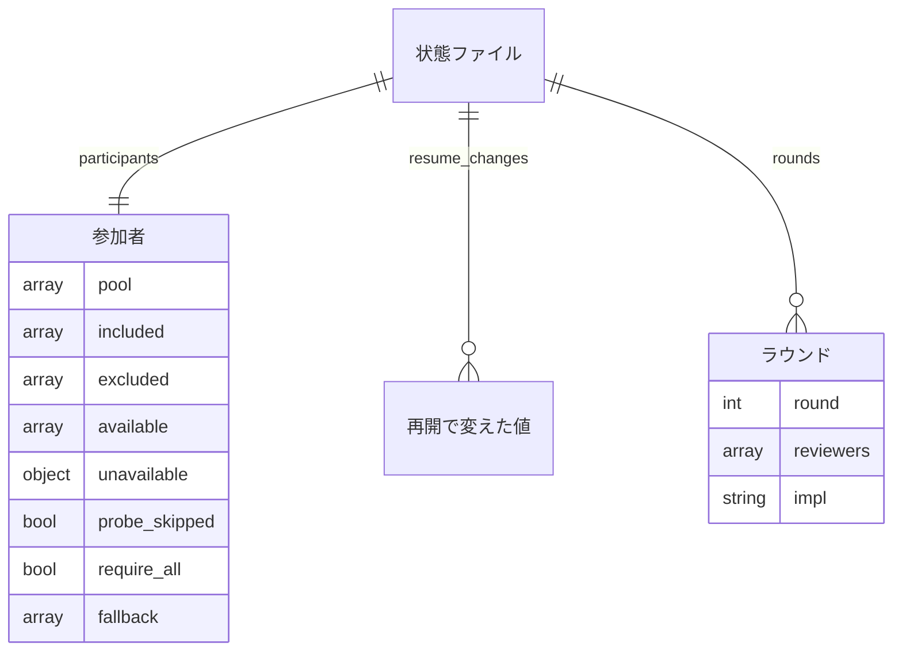

# #727 / #687 / #478 / #664 / #648: 状態ファイル・引数・関数の契約

[issue-727-687-478-664-648-design.md](issue-727-687-478-664-648-design.md) の続きである。決定の理由は設計文書の
「決定の記録」にあり、この文書は形だけを書く。

**この文書は既存の契約 [issue-624-478-648-contracts.md](issue-624-478-648-contracts.md) の P5 の部分を置き換える。**
既存の 6 項目（`available_reviewers` ほか）は 1 つのオブジェクト `participants` に畳み、cross-refactoring も同じ形を持つ。

## データ構造（状態ファイル）

### 両 Skill の最上位に増える 2 項目

| 項目 | 型 | 空を許すか | 意味 |
| --- | --- | --- | --- |
| `participants` | オブジェクト（下の表） | 許さない（項目が無いことは許す） | 使える者の解決の結果。項目が無いのは「この変更の前に始めた実行」 |
| `resume_changes` | オブジェクトの配列 | 許す（空の配列） | 再開で変えた値の記録。追記だけを行う |

`participants` の中身:

| 項目 | 型 | 空を許すか | 意味 |
| --- | --- | --- | --- |
| `pool` | 文字列の配列 | 許さない | 母集合の既定（`ALL_RUNTIMES` の順）。cross-review は全ランタイム − ホスト、cross-refactoring は `refactor_pool(host)` |
| `included` | 文字列の配列 | 許す（空） | `--include` で足した者。空は「足していない」 |
| `excluded` | 文字列の配列 | 許す（空） | `--exclude` で外した者。空は「外していない」 |
| `available` | 文字列の配列 | 許す（空。cross-review だけ） | 使える者。`ALL_RUNTIMES` の順。`only` があれば `[only]`。cross-refactoring では 1 者以上 |
| `unavailable` | オブジェクト（名前 → 理由の文字列） | 許す（空） | 確認を通らなかった者と `probe_auth` の `detail`。空は「全員が通った」か「確認を飛ばした」 |
| `probe_skipped` | 真偽値 | 許さない | `NDF_SKIP_AUTH_CHECK` で確認を飛ばしたか。`unavailable` が空である理由を区別する |
| `require_all` | 真偽値 | 許さない | `--require-all` の値。新規の既定は `false` |
| `fallback` | 文字列の配列 | 許す（空） | **cross-review だけ。** 席の埋め合わせに使える者（ホストの確認が通れば `[host]`）。`available` が 2 者以上か `only` があれば空 |

`resume_changes[]` の要素は既存の契約と同じ（`at` / `field` / `from` / `to`）。`field` は状態ファイルの鍵で、
`participants` を作り直したときは `participants` の 1 件として積む（中の項目ごとには積まない）。

### 変わらない項目の意味の変化

| Skill | 項目 | 変わること |
| --- | --- | --- |
| 両方 | `host` | 変わらない。再開の `--host` で書き換えない |
| cross-review | `only` | 再開の `--only` で変わる。`--only none` で `null` へ戻る |
| cross-review | `max_rounds` / `rotate_after` / `verify_commands` / `verify_exit_codes` | 再開で明示的に渡したときだけ変わる |
| cross-review | `rounds[].reviewers` | **席の名前**が入る（`claude-2` のような値を取りうる）。過去のラウンドは再開で書き換えない |
| cross-review | `rounds[].<席>` | 鍵が席の名前になる。既存の `rounds[].codex` などはそのまま |
| cross-refactoring | `runtimes` | 使える者（`participants.available`）と同じ値。提案の対象と適用の輪番の両方が読む。既存の読み手（提案の取り込み・`prepare-worktrees.sh`）のために残す |
| cross-refactoring | `max_outer_rounds` / `max_test_rounds` / `max_fix_rounds` / `max_items_per_round` | 再開で明示的に渡したときだけ変わる |
| cross-refactoring | `models` / `target_scope` | 変わらない。再開で違う値が渡されたら知らせる |

### cross-refactoring の新規の状態から消える項目

| 項目 | 理由 |
| --- | --- |
| 最上位の `impl_capable` | 母集合が 1 つになり `runtimes` と同じ値になる（決定 5） |
| `rounds[].reviewers` / `rounds[].reviewer_models` | レビュー工程が #436 で消えており、記録と表示にしか使われない（決定 6） |

### 実体の関係



`ラウンド.reviewers` は cross-review、`ラウンド.impl` は cross-refactoring が持つ。

### 機能とデータの対応

| 機能 | `participants` | `runtimes`（cross-refactoring） | `only` / 上限の項目 | `resume_changes` | `rounds[].reviewers` / `impl` |
| --- | --- | --- | --- | --- | --- |
| F1 使える者の解決（新規の `init`） | C | C | C | C（空） | — |
| F2 席の埋め方（`start-round`） | R | — | R | — | C |
| F3 除外と追加 | C | C | — | — | — |
| F4 適用の輪番（`start-round` / 適用ラウンド） | — | R | — | — | C |
| F5 再開の反映 | U | U | U | U（追記） | R |
| F6 報告 | R | R | R | R | R |

### 時系列の扱い

`participants` と `runtimes` は上書きし、過去の値は `resume_changes` に事象として積む。ラウンドごとの担当は
`rounds[]` が持つため、上書きで失われるのは「どの時点でどの一覧だったか」だけで、それを `resume_changes` が補う。

### 移行

**既存の状態ファイルは書き換えない。** 項目が無いときの読み方を決める。

| Skill | 項目が無いとき | 読み方 |
| --- | --- | --- |
| cross-review | `participants` | `host` があれば `review_seats(r, review_pool(host), [])`（変更前の輪番と同じ値）。`host` も無ければ `codex` / `agy` |
| cross-refactoring | `participants` | `runtimes` から `impl_assign` で輪番を決める。`impl_capable` は読まない |
| 両方 | `resume_changes` | 空として読む |

再開で担当に関わる引数を渡したときだけ、`participants` を作り直して書く。渡さない再開では書き足さない。

## 入出力の契約

### `state.py init`（cross-review）の引数

| 引数 | 型 | 既定（argparse） | 新規の経路 | 再開の経路 | 変更 |
| --- | --- | --- | --- | --- | --- |
| `pr` | 整数 | 必須 | — | — | 変わらない |
| `--max-rounds N` | 整数 | `None` | 無ければ 12 | 渡せば反映 | 既定を `None` へ |
| `--rotate-after K` | 整数 | `None` | 無ければ 8 | 渡せば反映 | 既定を `None` へ |
| `--only RUNTIME` | 4 つの名前か `none` | `None` | `none` は無しと同じ | 渡せば反映。`none` で `null` | `none` を追加 |
| `--exclude NAMES` | カンマ区切りの名前。繰り返し可。`none` | `None` | 外す | 渡せば置き換え。`none` で空 | **新設** |
| `--include NAMES` | 同上 | `None` | 足す | 渡せば置き換え。`none` で空 | **新設** |
| `--require-all` / `--no-require-all` | 真偽値 | `None` | 無ければ `false` | 渡せば反映 | **新設** |
| `--host RUNTIME` | 4 つの名前 | `None` | 無ければ推定 | 反映しない。違えば 1 行 | 再開での知らせを追加 |
| `--verify-command CMD` | 文字列。繰り返し可 | `None` | 無ければ空 | 渡せば置き換え | 再開で反映 |
| `--verify-exit-code N` | 整数。繰り返し可 | `None` | 無ければ空 | 渡せば置き換え | 再開で反映 |
| `--worktree` / `--focus` / `--extra-instructions-file` | — | — | — | — | 変わらない |

### `refactor.py init`（cross-refactoring）の引数

| 引数 | 既定（argparse） | 新規の経路 | 再開の経路 | 変更 |
| --- | --- | --- | --- | --- |
| `--exclude NAMES` / `--include NAMES` / `--require-all` | `None` | cross-review と同じ | cross-review と同じ | **新設** |
| `--max-outer-rounds` / `--max-test-rounds` / `--max-fix-rounds` / `--max-items-per-round` / `--test-timeout` | `None` | 無ければ現行の既定（3 / 2 / 3 / 5 / 900） | 渡せば反映（`replace`） | 既定を `None` へ |
| `--model RT=MODEL` / `--host` / `--scope` / `--baseline-test` / `--ci-check` / `--severity-threshold` / `--sync-command` / `--plan-file` / `--workflow-step` / `--worktree-root` | `None`（`--scope` と `--baseline-test` は必須のまま） | 無ければ現行の既定 | 反映しない。状態と違えば 1 行（`notify`） | 再開での知らせを追加 |

**状態ファイルに載る引数は、`replace` か `notify` のどちらかに必ず載る**（設計文書の決定 13）。載らないのは状態に載らない
引数（cross-review の `--worktree` / `--focus` / `--extra-instructions-file`）だけである。

**名前の検査は 2 段に分かれる。**

| 段 | 何を見るか | 誰が弾くか | 終了コード |
| --- | --- | --- | --- |
| 1 | 綴り（4 つの名前か `none`） | argparse の型 | 2 |
| 2 | 母集合との関係（`--exclude` / `--only` に母集合（既定 ∪ `--include`）に無い名前（cross-review のホストはこれに当たる） / `--include` と `--exclude` の重なり / `--only` と `--exclude` の矛盾 / `none` と名前の混在） | 共通層の `resolve_participants`（`AssignmentError`）。`init` が Skill の終了コードへ写す | cross-review 1 / cross-refactoring 4 |

### `init` の出力と終了コード

標準出力の `KEY=VALUE` は、cross-refactoring から `IMPL_POOL` が消えるほかは変えない。**増えるのは標準エラーの
行だけである。**

| 場面 | 標準エラーに出るもの | cross-review | cross-refactoring | 状態ファイル |
| --- | --- | --- | --- | --- |
| 新規で全員が使える | 母集合と使える者の 1 行 | 0 | 0 | 作る |
| 新規で確認を通らない者がいる | 通らなかった者と理由を 1 者 1 行 | 0 | 0 | 作る |
| 新規で使える者が 2 者に満たない（cross-review） | 埋め合わせの相手を 1 行（`席をホストで埋めます` / `同じランタイムの 2 つ目で埋めます`） | 0 | — | 作る |
| 新規で使える者が 0 者 | 使える者がいない理由 | ホストで埋められれば 0。埋められなければ 1 | 4 | 0 のときだけ作る |
| 確認を飛ばした | 飛ばしたことを 1 行（`auth.py` の既存の文言） | 0 | 0 | 作る（`probe_skipped: true`） |
| `--require-all` で欠けがある | 欠けた者と理由 | 1 | 4 | 作らない |
| 名前の矛盾 | 何が矛盾したか | 1 | 4 | 作らない |
| 再開で引数を反映した | 項目ごとに `<項目>: <旧> → <新>` の 1 行 | 0 | 0 | 書き換える |
| 再開で反映しない引数が状態と違う | 引数ごとに 1 行 | 0 | 0 | 変えない |
| 再開で作り直した使える者が 0 者 / 欠けあり | 新規と同じ | 1 | 4 | 書き換えない |

### `start-round` の出力

| Skill | 変わること |
| --- | --- |
| cross-review | `REVIEWERS` / `REVIEWERS_CSV` に席の名前が並ぶ（`codex claude-2` のような値を取りうる）。形は変わらない |
| cross-refactoring | `REVIEWERS` / `REVIEWERS_CSV` を出さない。`RUNTIMES` / `RUNTIMES_CSV` / `IMPL` / `IMPL_MODEL` は変わらない |

### `read-result` と起動スクリプトの席の受け口（cross-review）

| 受け口 | 変更前 | 変更後 |
| --- | --- | --- |
| `state.py read-result <pr> <agent>` | `choices=ALL_RUNTIMES` | 席の名前（`seat_runtime` で検査）。通らなければ argparse の終了コード 2 |
| `launch-reviewer.sh <seat> <pr> <round>` | `case` で 4 つの名前を検査 | 席の名前を受け、CLI は `${SEAT%%-*}`（`seat_runtime` と同じ規則）で選ぶ。stem は席の名前で組む |
| `critique.sh <seat> <pr> <round>` | 同上 | 同上 |
| `monitor.py --agents` | 担当名の CSV | 席の名前の CSV。stem を組むだけなので変更は無い |

### `report` の出力（cross-review）

現行の「PR 履歴」の後に、次の節を足す。

```text
## 参加した者
- 母集合: codex / agy / kiro
- 使える者: codex / kiro
- --exclude で外した者: agy
- --include で足した者: なし
- 確認を通らなかった者: なし
- 席の埋め合わせ: なし
- 再開で変えた値: 2026-09-19T12:00:00 participants … → …
```

`participants` を持たない状態ファイルでは「使える者: 記録なし」と出す。`probe_skipped` が真のときは「確認を通らなかった者:
確認を飛ばした（`NDF_SKIP_AUTH_CHECK`）」と出す。cross-refactoring の `report` は現行の「提案・レビュー」と「適用の母集合」の
2 行を「参加者」の 1 行にし、`participants` を持てば同じ節を足す。

### 共通層の関数（`lib/assignment.py`）

| 関数 | 入力 | 出力 | 失敗の形 | 変更 |
| --- | --- | --- | --- | --- |
| `review_pool(host)` | ホスト名 | 全ランタイム − ホスト | ホストでない名前で `AssignmentError` | 変わらない |
| `refactor_pool(host)` | ホスト名 | `ALL_RUNTIMES` の順で、`DEFAULT_REFACTOR_RUNTIMES`（`("codex", "kiro")`）とホスト | 同上 | **新設** |
| `resolve_participants(pool, *, host, include=(), exclude=(), only=None, probe, require_all=False)` | 母集合、ホスト名、足す・外す名前、`--only`、確認の関数（`probe_auth` の形）、全員を要するか | `Participants`（`participants` の 8 項目のうち `fallback` を除く 7 項目を持つデータクラス。`to_state()` で辞書にする） | 名前の矛盾（`exclude` / `only` の名前が母集合（既定 ∪ `include`）に無い場合もここ。cross-review のホストはこれに当たる）・`require_all` で欠け → `AssignmentError`（欠けた者と理由を並べる） | **新設** |
| `review_seats(round_no, available, fallback)` | ラウンド番号、使える者、埋め合わせに使える者 | 席の名前 2 つ（`only` は呼び出し側が先に処理する） | `round_no < 1` / `available` と `fallback` が両方空 → `AssignmentError` | **新設**（`review_assign` を置き換える） |
| `impl_assign(round_no, participants)` | ラウンド番号（適用の通し番号）、使える者 | 実装担当 1 者（`participants[round_no % len]`） | `round_no < 1` / 空 → `AssignmentError` | **新設**（`assign` を置き換える） |
| `seat_runtime(seat)` | 席の名前 | ランタイム名 | 形に合わない → `AssignmentError` | **新設** |
| `SEAT_PATTERN` | — | `^(claude\|codex\|agy\|kiro)(-[2-9])?$` | — | **新設** |
| `impl_pool()` / `review_assign()` / `assign()` | — | — | — | **消す**（P7） |

`review_seats` の規則:

| 使える者の数 | 席 |
| ---: | --- |
| 3 以上 | `pool[round_no % n]` と `pool[(round_no + 1) % n]` を母集合の順に並べた 2 席 |
| 2 | その 2 者 |
| 1 | その 1 者と、`fallback` のうち `available` に含まれない先頭の者。そのような者が無ければ同じランタイムの 2 つ目（`<名前>-2`） |
| 0 | `fallback` の先頭と、その 2 つ目（`<名前>-2`）。`fallback` が空なら `AssignmentError` |

埋め合わせの候補は `available` に含まれない者だけを使い、含まれる者は飛ばす。同じ席の名前を 2 つ返さないための規則で、
`available=["claude"], fallback=["claude"]` は `["claude", "claude-2"]` になる（`--include` でホストが使える者に入った
cross-review）。

### 共通層の関数（`lib/auth.py`）

| 関数 | 入力 | 出力 | 失敗の形 | 変更 |
| --- | --- | --- | --- | --- |
| `probe_auth(runtimes, *, info, env=None)` | 確かめる名前の一覧 | `(結果, 飛ばしたか)`。結果は名前 → `{"command", "ok", "detail"}` | 例外を上げない。コマンドが無い・時間切れ・終了コード非 0・未認証の文言は `ok: false` と `detail` | **新設** |
| `check_auth(...)` | — | — | — | **消す**（P7。P6 では残る） |
| `AUTH_PROBES` / `UNAUTHENTICATED_MARKERS` / `AUTH_PROBE_TIMEOUT` / `SKIP_ENV` | — | — | — | 変わらない |

### 共通層の関数（`lib/statefile.py`）

| 関数 | 入力 | 出力 | 失敗の形 | 変更 |
| --- | --- | --- | --- | --- |
| `apply_resume_args(state, args, spec)` | 状態、argparse の名前空間、反映の表 | 標準エラーへ出す行の一覧。`state` を書き換え、`resume_changes` に積む。書き込みは呼び出し側が 1 回で行う | 上げない | **新設** |
| `ResumeField(arg, key, mode)` | 引数の属性名、状態ファイルの鍵、`replace` / `notify` | — | — | **新設** |

`spec` は Skill ごとの表で、`mode` が `replace` の項目は `None` でない値を状態へ書き、`notify` の項目は状態と違うときだけ
「反映しない」の行を返す。値が同じ項目は行を返さず、`resume_changes` にも積まない。

### `state.py` の内部関数（cross-review）

| 関数 | 契約 | 変更 |
| --- | --- | --- |
| `_resolve_reviewers(host, args)` | `resolve_participants(review_pool(host), host=host, …)` を呼び、`available` が 2 者に満たなければホストを `probe_auth` で確かめて `fallback` を決める。`only` があるときはホストを確かめず `fallback` は空にする（決定 9: `--only` は埋め合わせをしない）。`AssignmentError` は `die(code=1)` へ写す | **新設**（`_auth_targets` / `_validate_only` を置き換える） |
| `_round_reviewers(st, round_no)` | 決定 11 の順で返す | 順を変える |
| `_resume_from_state(pr, repo, worktree, manual_extra_review, args)` | `apply_resume_args` を呼び、担当に関わる引数があれば `_resolve_reviewers` で作り直す。失敗したら状態ファイルを書き換えずに終了コード 1 | 引数を足す |
| `_guard_previous_round(st, prev)` | `prev["reviewers"]`（無ければ `_round_reviewers`）を渡す | 担当を渡す |

### `refactor_lib` の関数（cross-refactoring）

| 関数 | 契約 | 変更 |
| --- | --- | --- |
| `commands/setup.py cmd_init` | `resolve_participants(refactor_pool(host), …)` を呼び、`runtimes` と `participants` を書く。`AssignmentError` は `die`（終了コード 4） | 母集合と確認を置き換える |
| `commands/setup.py cmd_init`（再開） | `apply_resume_args` を呼び、担当に関わる引数があれば作り直す | 反映を足す |
| `commands/setup.py cmd_start_round` | `impl_assign(round_no, state["runtimes"])`。`reviewers` を書かない | 担当の決め方を替える |
| `commands/apply.py` / `commands/gate.py` の `assign(seq, host)` | `impl_assign(seq, state["runtimes"])` | 呼び方を替える（各 1 行） |

### 手順書の骨組み（cross-review の `SKILL.md` / `docs/01`）

```bash
INIT_VARS=$("$SCRIPTS/state.py" init "$STATE_PR" \
          ${MAX_ROUNDS:+--max-rounds "$MAX_ROUNDS"} ${ROTATE_AFTER:+--rotate-after "$ROTATE_AFTER"} \
          ${HOST:+--host "$HOST"} ${ONLY:+--only "$ONLY"} \
          ${EXCLUDE:+--exclude "$EXCLUDE"} ${INCLUDE:+--include "$INCLUDE"} \
          ...) || exit $?

for r in $REVIEWERS; do "$SCRIPTS/launch-reviewer.sh" "$r" "$STATE_PR" "$ROUND"; done
"$SCRIPTS/monitor.py" "$STATE_PR" --phase review --agents "$REVIEWERS_CSV" || true
for r in $REVIEWERS; do "$SCRIPTS/state.py" read-result "$STATE_PR" "$r" || true; done
"$SCRIPTS/critique-round.sh" "$STATE_PR" "$ROUND" $REVIEWERS
```

**`--max-rounds` と `--rotate-after` も値があるときだけ渡す。** 現行の骨組みは `"$MAX_ROUNDS"` を常に渡すため、再開のたびに
利用者が指定していない値で上書きする。
