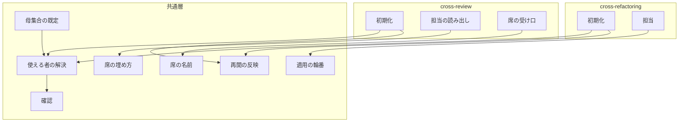
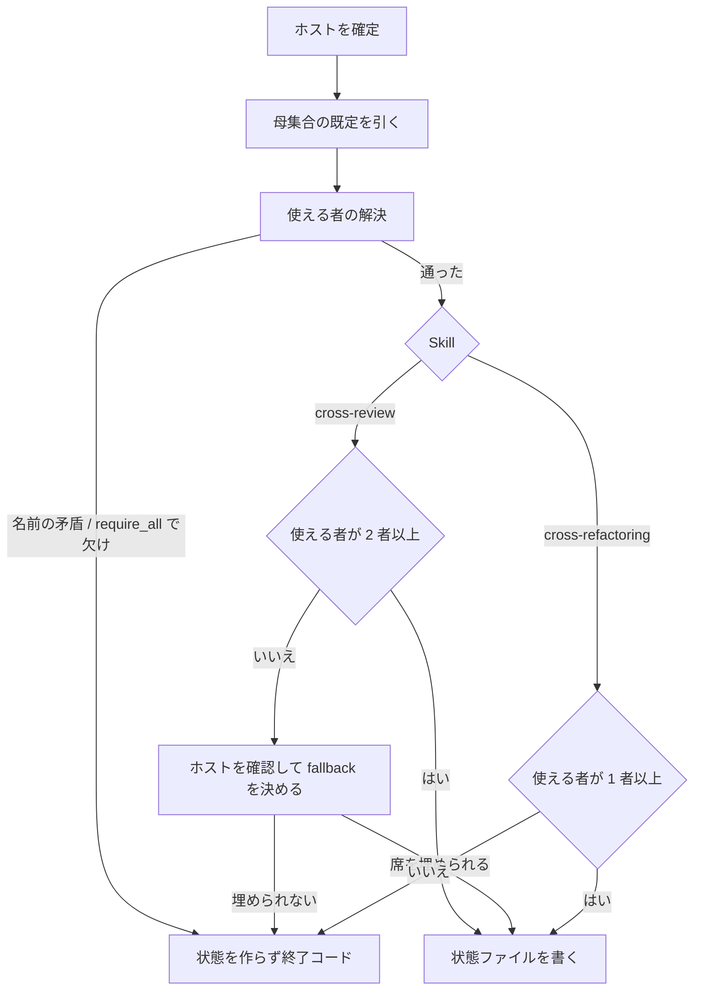
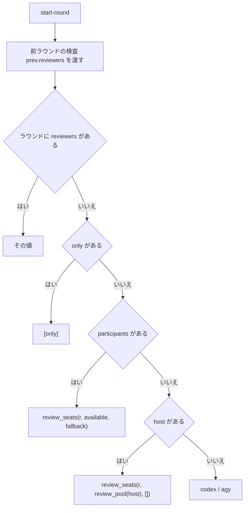
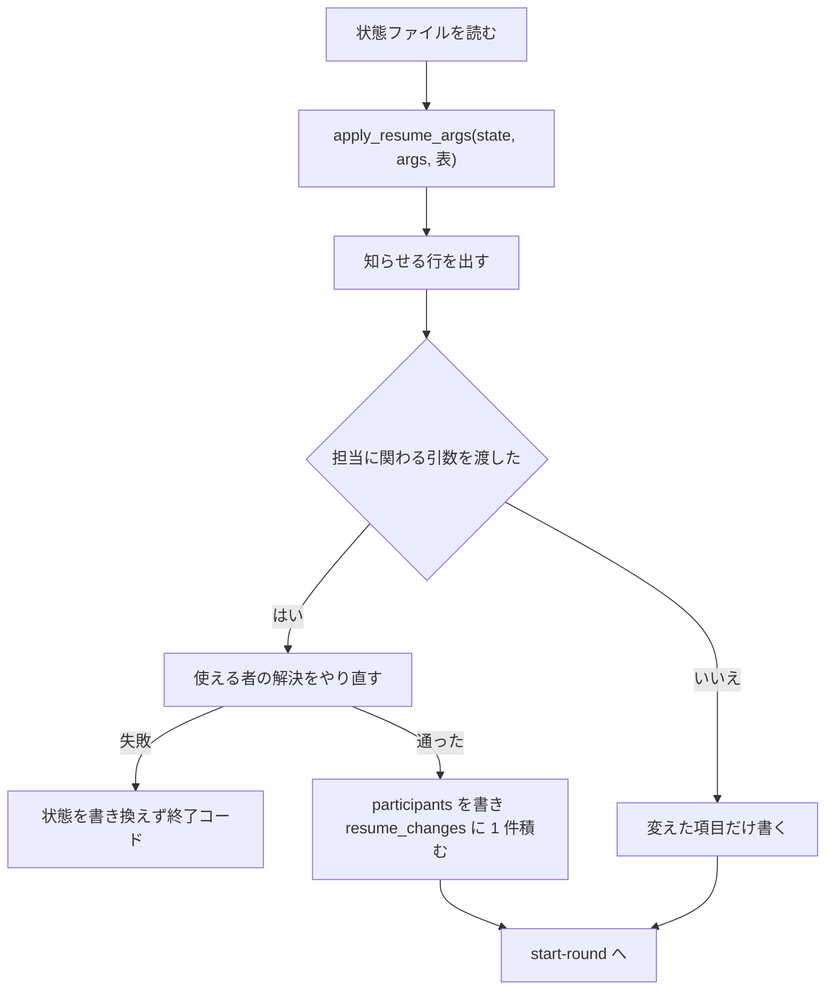

# #727 / #687 / #478 / #664 / #648: 使える者の決定と席の埋め方を共通層へ移す

要求と受け入れ条件は [issue-727-687-478-664-648-requirements.md](issue-727-687-478-664-648-requirements.md) にある。
この文書は「どう作るか」だけを扱う。状態ファイル・引数・関数の形は
[issue-727-687-478-664-648-contracts.md](issue-727-687-478-664-648-contracts.md) にある。

**この文書は既存の設計 [issue-624-478-648-design.md](issue-624-478-648-design.md) の P5（決定 6〜19）を置き換える。**
引き継ぐ決定と変える決定は末尾の「既存の設計との対応」にある。P4（決定 2〜5）は #732 の設計が持つ。

**実装は 2 本の Pull Request に分ける**（決定 19）。

| Pull Request | 中身 | 受け入れ条件 |
| --- | --- | --- |
| P6 | 共通層の新設（`probe_auth` / `resolve_participants` / `review_seats` / `impl_assign` / `seat_runtime` / `refactor_pool` / `apply_resume_args`）と cross-review 側 | AC1〜AC6、AC8〜AC30、AC44〜AC46、AC48〜AC50 |
| P7 | cross-refactoring 側、旧関数（`check_auth` / `impl_pool` / `review_assign` / `assign`）の削除、`CLAUDE.md` | AC7、AC31〜AC43、AC47、AC49〜AC50 |

## 機能一覧

| # | 機能 | 誰が使うか | Pull Request |
| --- | --- | --- | --- |
| F1 | 確認を通らない者を外し、使える者で収束ループを始める。使えない者と理由を残す | CLI の一部が導入・認証されていない利用者 | P6 / P7 |
| F2 | cross-review の各ラウンドに 2 席を確保する（使える者 → ホスト → 同じランタイムの 2 つ目） | 使える者が 2 者に満たない利用者 | P6 |
| F3 | `--exclude` / `--include` で参加者を名指しで外す・足す | 打ち切り・利用上限が分かっている担当を避けたい利用者、agy を戻したい利用者 | P6 / P7 |
| F4 | cross-refactoring の既定の参加者を codex / kiro / ホストにし、適用の輪番をその中で回す | cross-refactoring の利用者 | P7 |
| F5 | 再開で明示的に渡した引数を反映し、反映しない引数を知らせる | 中断したループを進め方を変えて再開する利用者 | P6 / P7 |
| F6 | 完了報告に参加者・外した者・足した者・確認を通らなかった者・席の埋め合わせ・再開で変えた値を出す | 収束の結果を読む人 | P6 / P7 |

## 決定の記録

| 決定 | 扱うこと |
| --- | --- |
| 1 | 文書の置き方 |
| 2〜4 | 使える者の決定 |
| 5〜8 | cross-refactoring の母集合 |
| 9〜12 | cross-review の席 |
| 13〜18 | 再開と骨組み |
| 19〜20 | 分け方と規則の置き場所 |

### 決定 1: 設計文書は親 #727 の名前で新設し、既存の設計文書の本体は書き換えない

既存の設計は P4 と P5 を 1 つの文書で扱い、P4 は #732 が別に進める。P5 の節をその場で書き換えると、#732 が読む P4 の
決定と、この変更で変わる P5 の決定が 1 つの差分に混ざる。**新設して対応表で指せば、変わった決定だけが差分に載る。**
既存の設計文書の本体には案内の 1 行も足さない。設計 Pull Request の本文の「決めたこと」は、変更したファイルの
`## 決定の記録` の見出しをすべて写すため、1 行でも触ると既存の 19 件がこの Pull Request の決定として並ぶ。案内は
`## 決定の記録` を持たない要求と契約の文書にだけ足す（#729 の設計と同じ扱い）。

### 決定 2: 使える者の決定を共通層 `resolve_participants` に移し、両 Skill の `init` は終了コードへ写すだけにする

いまは cross-review の `_auth_targets` / `_validate_only` と cross-refactoring の `cmd_init` が、それぞれ母集合を作って
`check_auth` を呼び、1 件の失敗で止める。使える者を決める規則を Skill ごとに書くと、母集合の作り方・除外の検査・
確認の扱いが 2 か所にでき、片方だけが古くなる（親 #727 の `move_responsibility`）。**共通層に `resolve_participants` を
1 つ置き、母集合・ホスト・`--include` / `--exclude` / `--only`・確認・`--require-all` から `Participants` を返す。**
`--exclude` と `--only` の名前が母集合に含まれるかの検査も、ホストを受け取るこの関数が持つ（cross-review では
ホストが母集合に無いため、`--exclude <ホスト>` はここで弾かれる。cross-refactoring ではホストが母集合にあるため
外せる）。Skill が持つのは、
その値を状態ファイルへ書くことと、`AssignmentError` を自分の終了コード（cross-review 1 / cross-refactoring 4）へ写す
ことだけである。

既存の設計の決定 10（cross-refactoring は変えず、`check_auth` を残す）は採らない。cross-review だけを直すと、同じ層を
使う cross-refactoring に「1 者欠けると `init` ごと失敗する」形が残る（#664）。

### 決定 3: 確認は止めない `probe_auth` に 1 本化し、確認コマンドは変えない

`check_auth` は確認と中断を 1 つの関数が持つため、「使える者で回す」経路から呼べない。`probe_auth` は結果だけを返し、
止めるかどうかは `resolve_participants` の `require_all` が決める。**両 Skill が `probe_auth` へ移った時点で `check_auth` は
呼び手を失うため消す**（P7）。確認コマンド（`AUTH_PROBES`）と未認証の文言は変えない。モデルを引く最小の呼び出しへ
替える判断は所要の実測が要るため #461 が持つ。この変更が作るのは、確認の結果で使える者を決める入口と、通らなかった
理由を `unavailable` に残す形である。

### 決定 4: 参加者は「母集合の既定 + `--include` − `--exclude`」で決め、既定は Skill ごとの関数が持つ

外したい理由は「この担当が落ちる」であり、名指しするのは外す側である（`--exclude`）。戻したい理由は「既定から外れて
いる者を入れたい」で、これも名指しである（`--include`）。使う側を並べる `--reviewers codex,kiro` の形は、ホストが変わると
一覧を書き直すことになるため採らない。**既定は Skill ごとの関数が持ち、`resolve_participants` はどちらを渡されても同じ
規則で解決する。**

| Skill | 既定を返す関数 | 中身 |
| --- | --- | --- |
| cross-review | `review_pool(host)` | 全ランタイム − ホスト |
| cross-refactoring | `refactor_pool(host)` | `ALL_RUNTIMES` の順で、`DEFAULT_REFACTOR_RUNTIMES`（`("codex", "kiro")`）とホスト |

cross-review の `--include` はホストを母集合へ入れる用途になる（#687 の「ホストの参加を許す」の明示的な形）。

### 決定 5: cross-refactoring の母集合を 1 つにし、`impl_capable` / `IMPL_POOL` / `impl_pool()` を消す

既定の参加者を codex / kiro / ホスト（表 `DEFAULT_REFACTOR_RUNTIMES` とホスト）にすると、提案の母集合と適用の母集合が
同じ集合になる。`impl_pool()` を関数として
残した理由（「両者は一致しない」）が消えるため、関数・状態ファイルの項目・`init` の出力変数の 3 つを消す。`runtimes` は
提案の取り込みと `prepare-worktrees.sh` が読むため残し、適用の輪番も同じ値を読む。

agy を既定から外す理由は #664 の実測にある。CLI の起動 199 回のうち失敗は agy の 7 回（STALLED 4 / NO_RESULT 3）だけで、
提案の所要の中央値も agy が最も長い（5 分。codex 3 分、kiro 2 分）。提案は最も遅い者を待つため、所要はほぼ agy で
決まっていた。戻す手段は `--include agy` である。

### 決定 6: cross-refactoring のレビュー担当を消し、`assign()` を `impl_assign()` に置き換える

cross-refactoring のレビュー工程は #436 で消え、Step 7 の `cross-review` が担う。`assign()` が返すレビュー担当が流れる先は
3 つだけである。

| 流れる先 | 読む側 |
| --- | --- |
| ラウンドの記録（`reviewers` / `reviewer_models`） | 改修計画と報告の表示 |
| `start-round` の `REVIEWERS` / `REVIEWERS_CSV` | 無い（骨組み・文書・プロンプトで `grep -rn -i reviewer` が 0 件） |
| `record_observed_model` のレビュー側の枝 | 無い（呼び出しは `role="impl"` の 1 か所だけ） |

**#664 の「使える者が 2 者だとレビュー担当が 1 者になる」は、存在しない役の記録の話である。** 役を消せば、席を埋める
規則を cross-refactoring に持ち込む必要が無い。`impl_assign(round_no, participants)` は実装担当 1 者だけを返す。

レビュー担当を「記録のためだけに」残す案は採らない。読み手が「このラウンドはこの 2 者がレビューした」と読む。

### 決定 7: 適用の輪番は `participants[round_no % n]` の式と `ALL_RUNTIMES` の順を保つ

いまの `assign()` は `pool[round_no % 4]` で、ラウンド 1 が codex から始まる。式を変えずに `n` を参加者の数にすれば、
ホスト claude の既定（`["claude", "codex", "kiro"]`）でも codex → kiro → claude の順になる。ホストが最初に適用する形に
ならない（「実測」）。ラウンド 1 から順に並べる式（`(round_no - 1) % n`）は、ホストが先頭に来るため採らない。

### 決定 8: 提案者と適用者が同じランタイムになることを避けない

ホストが提案に入るため、ある項目の提案者と適用者が同じランタイムになりうる。適用ラウンドは複数の提案者の項目を
1 つの群にまとめるため、群ごとに提案者を避けると群の分け方そのものを変えることになる。**避けない。** 適用の結果は
検証（テスト）と Step 7 の `cross-review` が見る。#687 の「コードを書いたランタイムが担当に入ってよい」と同じ判断である。

### 決定 9: cross-review の席は 2 つで、使える者 → ホスト → 同じランタイムの 2 つ目の順で埋める

#687 の 4 つの規則のうち「各ラウンドで 2 者」を最優先に置き、残る 3 つを埋める順序として読む。**違うランタイムを
先に使う。** 同じモデルの 2 つの文脈より、違うモデルの 2 つの文脈のほうが観点が分かれる。ホストは既定の母集合に
無いため、使える者が 1 者のときだけ席に入る。同じランタイムの 2 つ目（`<名前>-2`）は、ホストも使えないときの最後の
手段である。**埋め合わせの候補は使える者に含まれない者だけを使う。** `--include` でホストが使える者に入っているとき、
ホストを埋め合わせにも使うと同じ席の名前が並ぶ（`["claude", "claude"]`）。含まれる者は飛ばし、それでも 2 席に
満たなければ同じランタイムの 2 つ目を充てる（`available=["claude"], fallback=["claude"]` → `["claude", "claude-2"]`）。

| 使える者の数 | 席 |
| ---: | --- |
| 3 以上 | 輪番で 2 席（3 者のときは変更前の値と一致する） |
| 2 | その 2 者 |
| 1 | その 1 者とホスト。ホストが使えないか、その 1 者と同じなら同じランタイムの 2 つ目 |
| 0 | ホストとその 2 つ目。ホストも使えなければ失敗 |

`--only` は利用者が 1 席と決めた指定であり、埋め合わせをしない（既存の決定 11 のまま）。ホストの確認も行わない。
使える者が 2 者のとき輪番で
1 者を外す案は、毎ラウンド 1 席になるため採らない。

### 決定 10: 担当の単位を「席の名前」にし、形は `<ランタイム>` か `<ランタイム>-<2〜9>` とする

同じランタイムの 2 つ目を立てるには、結果ファイルの stem と状態ファイルの鍵を分ける名前が要る。**1 つ目の席の名前は
ランタイム名そのままにする。** 埋め合わせが要らない実行では、いまと同じ名前しか現れない。接尾辞の区切りは `-` で、
ランタイム名に `-` を含むものが無いため、シェルの `${SEAT%%-*}` と Python の `seat_runtime` が同じ規則になる。
stem を逆に解析して担当名へ戻す箇所は無い（「実測」）ため、stem 側の変更は無い。

受け口は 10 か所で、いずれも「CLI を選ぶ分岐に `seat_runtime` を通す」か「`choices` を席の形の検査に替える」の
どちらかである（「構成要素」の表）。`--only` と `--host` はランタイム名のままで、席の名前を取らない。

### 決定 11: 担当の決め方をラウンドの記録から先に見る順へ変え、前ラウンドの検査も記録の担当を読む

```text
ラウンドの reviewers → only → participants の席 → host の輪番（review_pool）→ codex / agy
```

既存の決定 12 と同じ理由である。再開で `only` を変えられるようにすると、`only` を先に見る現行の順では過去のラウンドの
担当まで変わる。`_guard_previous_round` も `prev["reviewers"]` を渡す。現行は担当を渡さず `codex` / `agy` で数えるため、
担当が `agy` + `kiro` のラウンドで `codex` を結果なしと読み、修正の記録が無いまま次のラウンドへ通す。

### 決定 12: `--require-all` で従来の関門を選べるようにする

全員が揃わないなら始めたくない運用のために残す（既存の決定 9）。付けると、確認を通らない者が 1 者でもいれば
従来の文言で失敗する。`--exclude` で外した者は揃っていなくてよい。両 Skill に同じ引数を置く。

### 決定 13: 再開の反映を共通層 `apply_resume_args` に置き、Skill ごとの表で「反映する」「知らせる」を決める

#648 の修正レイヤーは `statefile.py` である。cross-review の `_resume_from_state` だけを直すと、cross-refactoring の
再開経路（`args` 由来の項目を 1 つも反映しない）が残る。**共通層は「`None` でない引数を状態へ書き、`resume_changes` に
積み、反映しない引数は状態と違うときだけ知らせる」だけを持ち、どの引数がどちらかは Skill ごとの表が持つ。**

**状態ファイルに載る引数は、表のどちらかに必ず載る。** 載らない引数は状態に載らないもの（`--worktree` / `--focus` /
`--extra-instructions-file`）だけである。黙って捨てる引数を残さないためで、`--baseline-test` のように再開でも渡す
必須の引数も「違えば知らせる」に載る。そのため状態に載る引数の既定はすべて `None` にし、新規の経路が定数の既定へ
置き換える。既定値と同じ値なら渡していないとみなす案は、`--max-rounds 12` で 20 から 12 へ戻す指定を区別できないため
採らない。

「知らせる」に置く引数は 2 種類ある。

| 種類 | 引数 |
| --- | --- |
| 変えると過去のラウンドと突き合わせられなくなる | `--host` / `--scope` / `--model` |
| 初期化の時点で 1 度だけ効く | `--baseline-test` / `--worktree-root` / `--plan-file` など |

### 決定 14: 担当に関わる引数を渡した再開でだけ、確認し直して参加者を作り直す

`--only` / `--exclude` / `--include` / `--require-all` のいずれかを渡した再開では、決定 2 と同じ手順で参加者を作り直す。
いずれも渡さない再開では確かめ直さない（途中で担当が入れ替わると、前のラウンドの記録と突き合わせられなくなる）。
作り直した結果が失敗（0 者、`--require-all` で欠け）なら、状態ファイルを書き換えずに終了コードで終わる。反映は再開の後に
開くラウンドから効く（要求の前提 3）。

### 決定 15: 再開で指定を外す値は `none` にする

`--only none` は `only` を `null` へ、`--exclude none` / `--include none` は一覧を空へ戻す。空文字列は骨組みの
`${ONLY:+--only "$ONLY"}` が渡さないため、外す手段にならない。新規の経路で `none` を渡すと、渡さないのと同じになる。

### 決定 16: 再開で変えた値は `resume_changes` に積み、参加者の作り直しは 1 件として積む

上書きだけでは、どの時点で何を変えたかが失われ、完了報告で「途中から agy を外した」ことが読めない。`participants` の
中の項目ごとに積むと 1 回の再開で最大 7 件になり、報告で読みにくい。`participants` 全体の前後を 1 件に積む。

### 決定 17: 骨組みは `$ONLY` で絞らず、`start-round` が返す席を使う

`start-round` の `REVIEWERS` は `only` と席の埋め合わせを反映済みである。シェル変数でもう一度絞ると、状態ファイルと
シェル変数がずれたときに起動も監視も誰にも当たらない（#648 の 3 段の経過）。`SKILL.md` と `docs/01` の Step 2 と Step 2.5 を
`$REVIEWERS` / `$REVIEWERS_CSV` に揃え、`$ONLY` は `init` へ渡す 1 行にだけ残す（既存の決定 18）。

### 決定 18: 起動した後に分かる使えなさで、担当を自動的に外す仕組みは作らない

利用上限やモデルの 404 は起動した後に分かり、分類は #729（G3）が持つ。自動で外すと、一時的な打ち切りでも以後の
ラウンドから恒久的に外れる。この変更は利用者が `--exclude` で外し、再開で反映できる入口までを作る（既存の決定 19）。

### 決定 19: P6（共通層と cross-review）→ P7（cross-refactoring と旧関数の削除）の順に 2 本で出す

共通層の新しい関数は P6 で入れ、旧関数（`check_auth` / `impl_pool` / `review_assign` / `assign`）は P7 で消す。P6 の
時点で旧関数を消すと cross-refactoring が壊れる。1 本にまとめると `state.py` と `refactor_lib` と文書 3 種を 1 度に
レビューすることになり、G2 / G3 / G5（`state.py`）と G4（`refactor_lib`）との競合も 1 度に解くことになる。
**「片方にだけ古い形が残らない」（親 #727 の完了条件）は P7 のマージで満たす。**

### 決定 20: 規則の実装は `assignment.py`、手順は各 `SKILL.md`、理由はこの設計文書が持つ

#687 が問う置き場所である。使える者の数で分岐する実装と席の規則の表は `assignment.py`（`review_seats` の docstring）に
1 つだけ置く。利用者が手順として読む「担当の決まり方と渡す引数」は各 `SKILL.md`（cross-review は `docs/05` が本体）に
置く。同じランタイムの 2 つ目とホストの参加を許した理由はこの文書が持ち、`plan-to-spec` が `docs/specifications/` へ
移す。`CLAUDE.md` には要約の 2 行（cross-refactoring の母集合と輪番、cross-review の席）だけを置く。

## 実測

`develop` `9eaebe14`、Python 3.14 で、`assignment.py` を読み込んで式を突き合わせた。

| 場面 | 結果 |
| --- | --- |
| 席の式 `{pool[r % n], pool[(r + 1) % n]}` を母集合の順に並べる（n = 3） | 4 ホスト × ラウンド 1〜12 の全組で、変更前の `review_assign(r, host)` と一致（不一致 0 件） |
| 同じ式で n = 4 | ラウンド 1〜4 の席は `codex agy` / `agy kiro` / `claude kiro` / `claude codex`。各者ちょうど 2 回 |
| n = 2（`codex` / `kiro`） | ラウンド 1〜4 すべて `codex kiro` |
| n = 1 / n = 0 | `codex claude`（ホストあり）/ `codex codex-2`（ホストなし）/ `claude claude-2`（0 者・ホストあり） |
| `impl_assign` を `participants[r % n]` で `["claude", "codex", "kiro"]` に当てる | ラウンド 1〜6 で `codex` / `kiro` / `claude` / `codex` / `kiro` / `claude`。変更前の `assign(r, "claude")` は `codex` / `agy` / `kiro` / `claude` / … |
| 席の形 `^(claude\|codex\|agy\|kiro)(-[2-9])?$` | `kiro` / `kiro-2` / `claude-9` が一致し、`kiro-1` / `kiro-10` / `gemini` / `kiro-2-3` は一致しない |
| stem の逆解析 | `split("-")` / `rsplit` / `.stem` / `re.match(.*agent` を cross-review のスクリプトと `monitor.py` で検索し、担当名へ戻す箇所は 0 件（当たった 1 件は PR のファイル種別の判定） |
| cross-refactoring の `$REVIEWERS` の読み手 | `SKILL.md` / `docs/` / `prompts/` で `reviewer` が 0 件。`setup.py` が出すだけで、読むのはテスト `test_start_round_emits_runtimes.py` の期待値だけ |
| cross-refactoring の再開で反映される引数 | `init` の 15 引数のうち 0 個（`_apply_post_event` の投稿の扱いだけを毎回入れ直す） |
| 既存のテストの数 | `uv run --with pytest pytest scripts/tests plugins/ndf -q --co` で 4413 件 |

担当名を鍵・分岐・選択肢に使う箇所の一覧（10 か所の受け口を含む）は、調査の控えから「構成要素」の表へ写した。
控え（`survey-727-agent-keys.md`）は設計 Pull Request のレビューの間だけ scratchpad に置く。

## 構成要素

| 要素 | 責務 | Pull Request |
| --- | --- | --- |
| 母集合の既定（`assignment.review_pool` / `refactor_pool`） | Skill ごとの出発点を返す。既定の参加者は表 `DEFAULT_REFACTOR_RUNTIMES` が持つ | P6 |
| 使える者の解決（`assignment.resolve_participants`） | 母集合・ホスト・足す・外す・`only`・確認・`require_all` から `Participants` を返す。名前の矛盾（`--exclude` / `--only` に母集合に無い名前。cross-review のホストはこれに当たる）と欠けを `AssignmentError` で返す | P6 |
| 確認（`auth.probe_auth`） | 止めずに確かめ、担当ごとの結果を返す | P6 |
| 席の埋め方（`assignment.review_seats`） | 使える者と埋め合わせから 2 席を返す（決定 9） | P6 |
| 適用の輪番（`assignment.impl_assign`） | 参加者から実装担当 1 者を返す（決定 7） | P6（呼び手は P7） |
| 席の名前（`assignment.seat_runtime` / `SEAT_PATTERN`） | 席の名前からランタイムを引く。形の検査 | P6 |
| 再開の反映（`statefile.apply_resume_args` / `ResumeField`） | 表に従って状態へ書き、`resume_changes` に積み、知らせる行を返す | P6 |
| cross-review の初期化（`state.py` の `_resolve_reviewers` / `_init_new_state` / `_resume_from_state`） | 共通層を呼び、`participants` を書き、失敗を終了コード 1 へ写す。再開で反映の表を渡す | P6 |
| cross-review の担当の読み出し（`_round_reviewers` / `_guard_previous_round`） | 決定 11 の順で席を返す | P6 |
| cross-review の席の受け口（10 か所） | `launch-reviewer.sh:29,223` / `critique.sh:31` / `critique-round.sh:39` / `wait-review.sh` の CLI を選ぶ分岐、`monitor.py:953` の `target` の `choices`、`monitor.py` の `agent == "codex"` / `"claude"` の比較（629 / 632 / 658 / 808 ほか）、`measure.py:36,128` の `AGENT_NAMES`、`state.py:4389` の `read-result` の `choices`、`_guard_previous_round` の `LEGACY_AGENTS` への落ち方 | P6 |
| cross-review の完了報告（`cmd_report`） | 「参加した者」の節を出す | P6 |
| cross-review の骨組みと文書（`SKILL.md` / `docs/01` / `docs/04` / `docs/05`） | `$ONLY` で絞らない。引数・状態ファイル・席の規則を書く | P6 |
| cross-refactoring の初期化（`refactor_lib/commands/setup.py` の `cmd_init`） | `refactor_pool` と `resolve_participants` を呼び、`runtimes` と `participants` を書く。`impl_capable` / `IMPL_POOL` を出さない。再開で反映の表を渡す。失敗を終了コード 4 へ写す | P7 |
| cross-refactoring の担当（`cmd_start_round` / `apply.py:134` / `gate.py:128`） | `impl_assign(seq, state["runtimes"])`。`reviewers` を書かず `REVIEWERS` を出さない | P7 |
| cross-refactoring の表示（`report.py` / `plan.py`） | 母集合を 1 行にし、レビュー担当の列を消す。`participants` があれば参加者の節を出す | P7 |
| cross-refactoring の引数（`refactor.py`） | `--exclude` / `--include` / `--require-all` を足し、状態に載る引数の既定を `None` にする | P7 |
| cross-refactoring の文書（`SKILL.md` / `docs/01`）と `CLAUDE.md` | 母集合・担当の決め方・前提・引数を実装後に合わせる | P7 |
| 旧関数の削除（`check_auth` / `impl_pool` / `review_assign` / `assign`） | 呼び手が無くなった時点で消す | P7 |

要素の関係（辺は呼び出し）:



完了報告・表示・引数・文書・旧関数の削除は、状態ファイルを読むだけか呼び出しを持たないため、図に含めない。

## 文脈と配置

**文脈と配置は変わらない。** 動くのは、ホストの CLI から起動される `state.py` / `refactor.py` の 1 プロセスずつである。
外部との出入りは `gh`（GitHub）と、各 CLI の確認コマンドと起動だけで、確認コマンドの呼び出し先は変えない。変わるのは
起動する CLI の集合（cross-refactoring から agy が既定で外れ、ホストが入る）と、cross-review で同じ CLI を 2 プロセス
起動しうることである。

### 置き場所

```text
plugins/ndf/
├── scripts/lib/
│   ├── assignment.py        # P6: refactor_pool / resolve_participants / review_seats / impl_assign / seat_runtime を新設
│   │                        # P7: impl_pool / review_assign / assign を消す
│   ├── auth.py              # P6: probe_auth を新設。P7: check_auth を消す
│   ├── statefile.py         # P6: apply_resume_args / ResumeField を新設
│   ├── monitor.py           # P6: target の choices と agent の比較を seat_runtime へ
│   └── tests/               # P6: test_lib_assignment.py を impl_assign へ、test_lib_participants.py / test_lib_resume_args.py を新設
├── skills/cross-review/
│   ├── SKILL.md / docs/01 / docs/04 / docs/05   # P6
│   ├── scripts/state.py / launch-reviewer.sh / critique.sh / critique-round.sh / wait-review.sh / measure.py   # P6
│   └── tests/               # P6: test_state_review_pool.py に追記、test_state_resume_args.py / test_seat_names.py を新設
├── skills/cross-refactoring/
│   ├── SKILL.md / docs/01-state-and-propose.md   # P7
│   ├── scripts/refactor.py / refactor_lib/commands/{setup,apply,gate,report}.py / refactor_lib/plan.py   # P7
│   └── tests/               # P6: test_assignment.py の review_assign を review_seats へ
│                            # P7: test_assignment.py の assign を impl_assign へ、test_init.py / test_start_round_emits_runtimes.py を直す
└── CLAUDE.md（リポジトリの根）   # P7
```

`dev.kiro` / `dev.agy` は `skills/` を symlink で参照するため、書き写す配布物は無い。`bash scripts/build-runtime-plugins.sh --check`
で食い違いが無いことだけを確かめる。

## 構造

型を足すのは `Participants`（データクラス。契約文書の `participants` の 7 項目）と `ResumeField`（名前付きタプル）の
2 つで、互いに関係を持たず、既存の型とも関係を持たない。クラス図は作らない（要求の「対象範囲」）。**変わるのは処理の
順序である。**

## 処理の流れ

### 新規の `init`（両 Skill で同じ形）



使える者の解決の順序:

1. `--include` と `--exclude` の各名前が `ALL_RUNTIMES` にあり、重ならないことを確かめる。`--exclude` の各名前が母集合の既定 ∪ `include` に含まれなければ弾く
   （cross-review のホストはこれに当たる）
2. 参加者 = 母集合の既定 ∪ `include` − `exclude`（`ALL_RUNTIMES` の順）
3. `--only` があれば参加者に含まれ、`exclude` に無いことを確かめ、参加者を `[only]` にする
4. 参加者の確認を `probe_auth` で行う。`NDF_SKIP_AUTH_CHECK` が立っていれば全員を通ったものとし `probe_skipped` を真にする
5. `require_all` が真で通らない者がいれば `AssignmentError`
6. 通った者を `available`、通らなかった者と理由を `unavailable` として返す

### `start-round`（cross-review）



### 再開の `init`（両 Skill で同じ形）



### 席の名前が流れる経路（cross-review、埋め合わせがあるときだけ現れる）

```text
start-round → REVIEWERS="codex claude-2"
  → launch-reviewer.sh claude-2 … : CLI は seat_runtime → claude、stem は claude-2-review-pr<N>
  → monitor.py --agents codex,claude-2 : stem を組むだけ。CLI 固有のログの検査は seat_runtime で選ぶ
  → state.py read-result <pr> claude-2 : rounds[-1]["claude-2"] へ書く
  → critique-round.sh <pr> <round> codex claude-2 → critique.sh claude-2 …
```

## 非機能の実現方式

| 大項目 | 要求の条件 | 実現方式 | 確かめ方 |
| --- | --- | --- | --- |
| 可用性 | 母集合の 1 者が使えないことで、どちらの収束ループも開始できない状態にならない | 確認の失敗を `unavailable` に記録し、使える者で続ける（決定 2・3）。cross-review は席を埋め合わせる（決定 9） | AC14、AC35 のテスト |
| 性能・拡張性 | 確認の回数は「参加者の数 + 埋め合わせが要るときのホスト 1 回」を超えない。再開で確かめ直すのは担当に関わる引数を渡したときだけ | 除外した者は確かめない。ホストは `available` が 2 者に満たないときだけ確かめる。再開は決定 14 の条件でだけ確かめる | AC3、AC26、AC28 のテストで `probe_auth` の呼び出しを数える |
| 運用・保守性 | 担当が欠けたまま収束したこと、席を埋め合わせたこと、反映しなかった引数が出力だけで分かる | `report` が参加者の節を出す。`init` が知らせる行を出す（決定 13・16） | AC24、AC29、AC39 のテスト |
| 移行性 | この変更の前に始めた実行の状態ファイルを書き換えずに読める | 項目が無いときの読み方を契約文書の「移行」が決める | AC22、AC41 のテスト |

## テスト設計

置き場所の列の読み方は次のとおりである。

| 先頭 | 実際の場所 |
| --- | --- |
| `cross-refactoring/` / `cross-review/` | `plugins/ndf/skills/` の下 |
| `lib/` | `plugins/ndf/scripts/tests/` の下 |

| 受け入れ条件 | 何で確かめるか | 置き場所 |
| --- | --- | --- |
| AC1〜AC5 | `probe` を差し替えて `resolve_participants` を呼び、返り値と例外と呼び出し回数を見る | `lib/test_lib_participants.py`（新設） |
| AC6 | `subprocess.run` を差し替えて `probe_auth` を呼ぶ（既存の `test_auth_probe.py` を書き直す） | `lib/test_auth_probe.py` |
| AC7 | `git grep` の結果を検査するテスト | `lib/test_shared_lib_layout.py`（既存に追記） |
| AC8〜AC12 | `review_seats` を 4 ホスト × 12 ラウンドと 2 / 1 / 0 者で呼ぶ。AC8 は変更前の式を期待値として持つ | `cross-refactoring/tests/test_assignment.py`（`review_assign` のテストを置き換える） |
| AC13 | `seat_runtime` に 7 つの名前を渡す | 同上 |
| AC14〜AC20 | `probe_auth` を差し替えて `_init_new_state` を呼ぶ。状態ファイルの有無と終了コードと標準エラーを見る | `cross-review/tests/test_state_review_pool.py` |
| AC21 | `read-result` を席の名前で呼ぶ。`launch-reviewer.sh` を `launch-cli.sh` を差し替えて呼び、渡った CLI 名と stem を見る | `cross-review/tests/test_seat_names.py`（新設） |
| AC22 | `participants` を持たない状態 / `host` も持たない状態で `_round_reviewers` | `cross-review/tests/test_state_review_pool.py` |
| AC23 | `verdict` の無い前ラウンドで `cmd_start_round` の終了コード 5 | `cross-review/tests/test_state_round_guard.py` |
| AC24 | `participants` と `resume_changes` を持つ状態ファイルで `cmd_report` の出力を見る | `cross-review/tests/test_state_review_pool.py` |
| AC25〜AC29 | 状態ファイルを置いた作業ツリーを渡して `cmd_init` を呼び、状態ファイルと標準エラーを見る | `cross-review/tests/test_state_resume_args.py`（新設） |
| AC30 | 2 ファイルの `ONLY` を含む行を数える | `cross-review/tests/test_skill_layout.py` |
| AC31〜AC33、AC35〜AC36 | `probe_auth` を差し替えて `cmd_init` を呼ぶ（既存の `test_init.py` の `check_auth` のテストを置き換える） | `cross-refactoring/tests/test_init.py` |
| AC34 | `impl_assign` を 6 ラウンド呼ぶ。`cmd_start_round` の出力に `REVIEWERS` が無い（`test_start_round_emits_runtimes.py` の期待値を反転する） | `lib/test_lib_assignment.py` / `cross-refactoring/tests/test_start_round_emits_runtimes.py` |
| AC37 | `cmd_report` と改修計画の出力を見る | `cross-refactoring/tests/test_run_metrics_summary.py` / `test_plan_comment.py` |
| AC38〜AC40 | 状態ファイルを置いて `cmd_init` を呼ぶ | `cross-refactoring/tests/test_init.py` |
| AC41 | `impl_capable` を持つ状態で `cmd_start_round` / `cmd_report` | 同上 |
| AC42〜AC44 | 文書の語を `grep` するテスト | `scripts/tests/test_cross_skill_refs.py` / `cross-review/tests/test_skill_layout.py` / `cross-refactoring/tests/test_skill_terms.py` |
| AC45〜AC48 | 各 issue の再現手順を実行し、結果を issue のコメントへ残す | 手元 |
| AC49〜AC50 | コマンドの終了コード | 継続的統合と手元 |

`apply_resume_args` の表の規則（`replace` / `notify`、値が同じなら積まない）は `lib/test_lib_resume_args.py`（新設）で
Skill に依らず確かめる。

## 未確認のまま残ること

| 項目 | 内容 | いつ決まるか |
| --- | --- | --- |
| 同じランタイムの 2 席の観点 | `claude` / `claude-2` の 2 席が、別のランタイムの 2 席より指摘を見落とすかは測っていない | この変更の後の運用（`measure.py`） |
| ホストが席に入ったときの `is_own_pr` の扱い | ホストの CLI が自分の Pull Request をレビューするとき、投稿の event が `COMMENT` へ倒れる既存の規則で足りるかは確かめていない | P6 の実装で 1 度回して見る |
| cross-refactoring でホストが提案に入ることの所要 | 提案は最も遅い者を待つ。claude の提案の所要は測っていない（適用は中央値 2 分） | P7 の後の運用 |
| 確認を「モデルを引く最小の呼び出し」へ替えるか | #461。所要の実測が要る | マイルストーン 06 の着手時 |
| `monitor.py` の CLI 固有の検査を席の名前に通す形 | `seat_runtime` で選ぶと決めたが、`agent` の比較が 6 か所あり、共通の関数へ寄せるかは実装で決める | **実装で決める** |
| 出力の文言 | 反映した行・知らせる行・埋め合わせの行の文言は、項目名と値を含むことだけを決めた | **実装で決める** |
| テストの置き場所 | テスト設計の表の置き場所は既存ファイルに合わせた目安である | **実装で決める** |

## 申し送り（並行する設計との境界）

| 相手 | 決めた契約 | どちらが何をするか |
| --- | --- | --- |
| G2（#732 #624） | `state.py` は同じファイルだが節が違う（G1 は `init` / 再開 / `_round_reviewers` / `read-result` の受け口 / `report` の参加者の節。G2 は `_classify_finding` / `COUNTED_CLASSIFICATIONS`）。**要求と契約の既存文書の先頭へ案内を足す点だけが重なる** | G1 が P5 の案内、G2 が P4 の案内をそれぞれ 1 段落足す。後からマージする側が並べる |
| G3（#729 #619 #584） | `state.py` の `_read_review_result_file` / `_record_no_result` / `_handle_no_result_round` と `report` の結末の節は G3。G1 が `report` に足すのは「参加した者」の節だけ。`monitor.py` は G3 が結末の理由を、G1 が `agent` の比較と `target` の `choices` を触る | 競合は後からマージする側が解く。G1 の `seat_runtime` は `monitor.py` の比較を包むだけで、G3 の語彙に触らない |
| G4（#728 #647 #592 #553） | `apply.py:134` と `gate.py:128` の `impl, _ = assignment.assign(seq, state["host"])` を G1（P7）が `impl = assignment.impl_assign(seq, state["runtimes"])` へ変える（各 1 行）。担当の交代（利用上限で次の輪番へ替える）は G4 が持ち、替える相手は `state["runtimes"]` から選ぶ | G4 は `assign` を新しく呼ばない。G1 の P7 と G4 の実装が同じ行を触ったら、後からマージする側が `impl_assign` に揃える |
| G5（#730 #583） | 起動スクリプト（`launch-reviewer.sh`）は G5 が投稿の経路を、G1 が席の受け口（先頭の `case` と `launch-cli.sh` へ渡す CLI 名）を触る | 競合は後からマージする側が解く |
| #461 | 確認コマンドの差し替え口は `AUTH_PROBES` のまま。`probe_auth` の返り値の形（`ok` / `detail`）は変えずに、コマンドだけを替えられる | #461 が実測して替える |
| #736 | `CLAUDE.md` の「`--max-outer-rounds` の既定が 4」の行は、輪番が参加者の数のラウンドで 1 周する形に合わせて G1 が書き直す | #736 は書き直した行を見て閉じるかを棚卸で決める |

## 既存の設計との対応

| 既存の決定（PR #667） | この文書 | 変わったこと |
| --- | --- | --- |
| 決定 1（P4 / P5 の分け方） | 決定 19 | P5 を P6 / P7 に分け直した。P4 は #732 |
| 決定 6（確認を把握へ。`available_reviewers` を持つ） | 決定 2・3 | 解決を共通層へ移し、項目を `participants` に畳んだ。`check_auth` を消す |
| 決定 7（`--exclude`） | 決定 4 | `--include` を足した |
| 決定 8（使える者の数で分け、`review_assign` が一覧を受け取る） | 決定 9 | 1 者と 0 者を「席を埋める」に変えた。3 者の値は同じ |
| 決定 9（`--require-all`） | 決定 12 | 両 Skill に置く |
| 決定 10（cross-refactoring を変えない） | 決定 2・5・6 | 採らない。cross-refactoring も同じ層を通り、レビュー担当を消す |
| 決定 11（`--only` は 1 者） | 決定 9 | 同じ（埋め合わせをしない） |
| 決定 12（記録を先に見る） | 決定 11 | 同じ |
| 決定 13（既定を `None` に） | 決定 13 | 共通層へ移し、状態に載る引数は必ず表に載せる |
| 決定 14（`--host` は知らせる） | 決定 13 | 表の `notify` の 1 行になった |
| 決定 15（担当の引数で確かめ直す） | 決定 14 | `--include` を足した |
| 決定 16（`none`） | 決定 15 | `--include none` を足した |
| 決定 17（`resume_changes`） | 決定 16 | `participants` は 1 件として積む |
| 決定 18（`$ONLY` で絞らない） | 決定 17 | 同じ |
| 決定 19（自動で外さない） | 決定 18 | 同じ |
| — | 決定 1・5・7・8・10・20 | 新設 |
