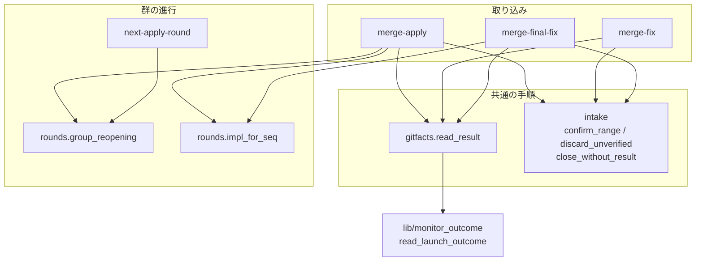
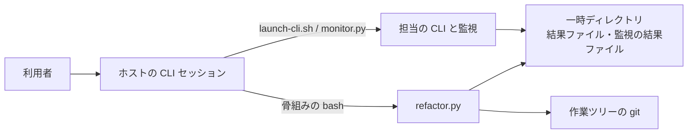
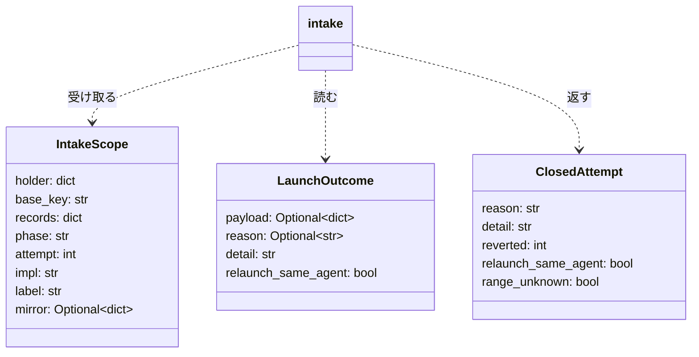
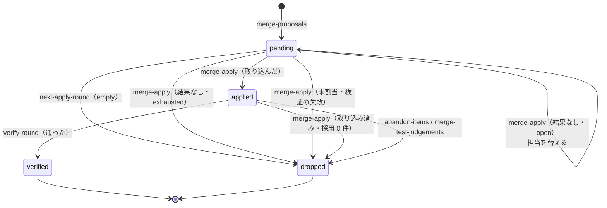
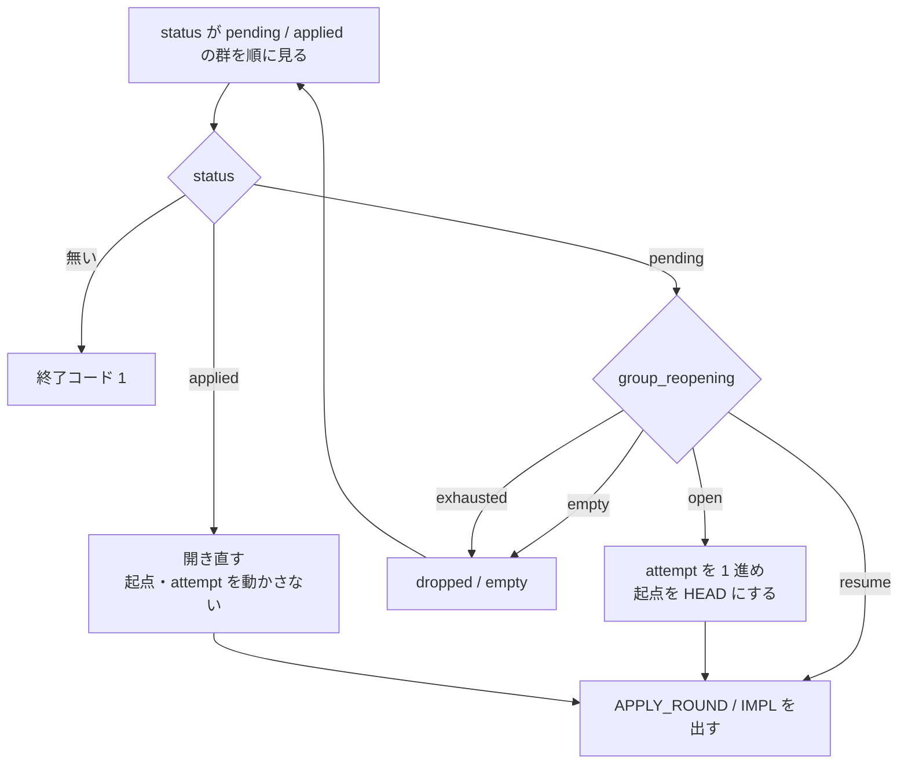
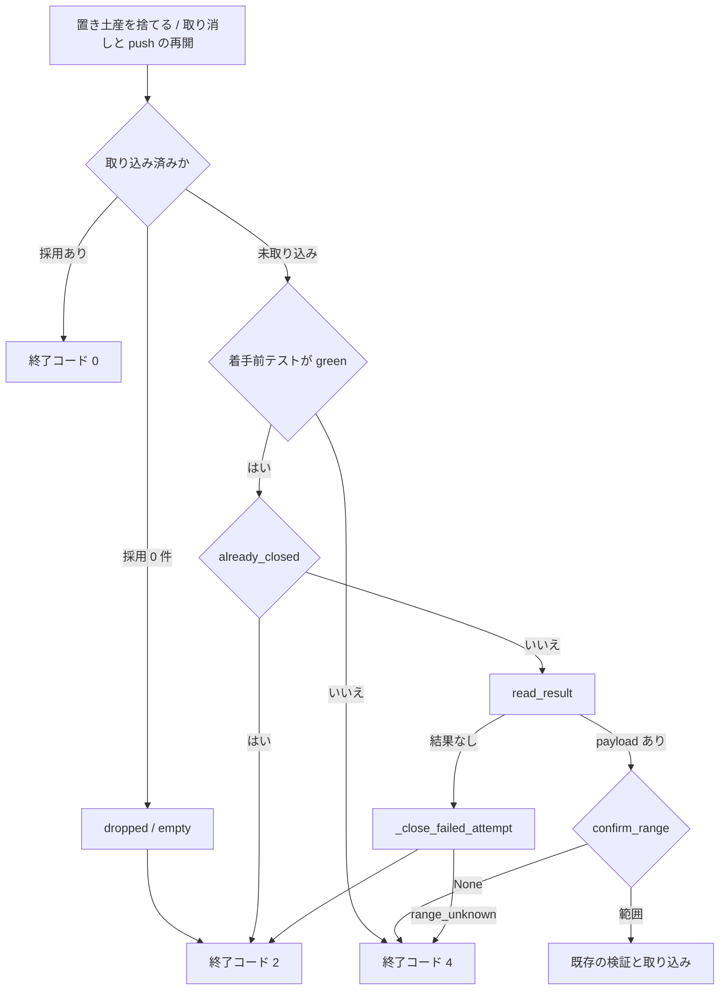
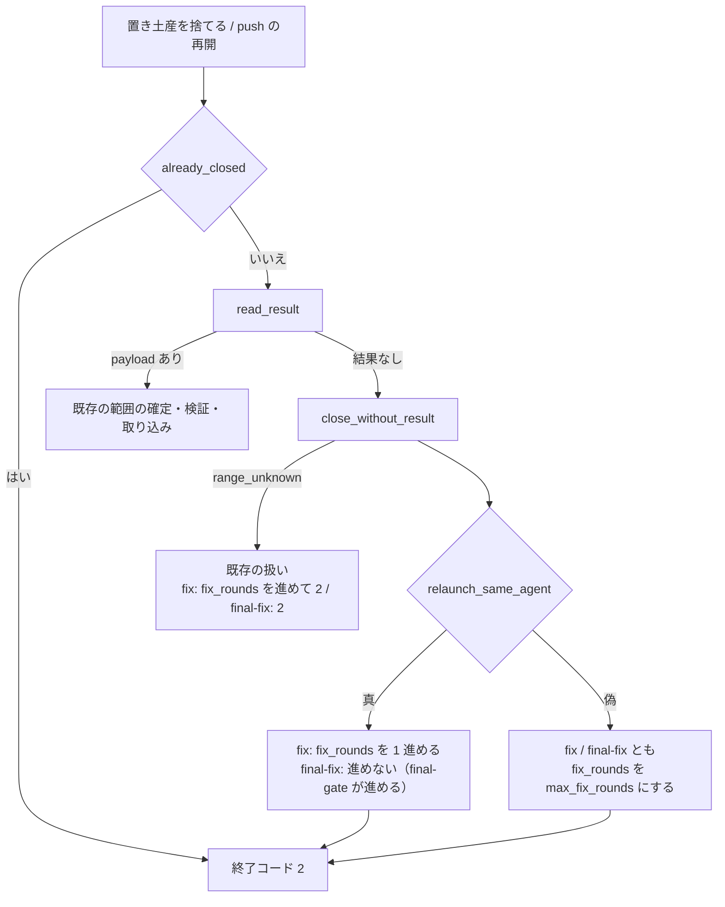

# cross-refactoring: 実装担当が結果を残さないと同じ群が上限なしに開き直され、未検証のコミットが残る → 結果なしを取り込みの 1 か所で受けて取り消し、群が開いた回数と結末で開き直しを決める（設計 / #728 #647 #592 #553）

## 目的

- **壊れていること**: cross-refactoring の実装担当が結果ファイルを残さずに終わると（無進捗の打ち切り・利用上限・15 秒で落ちる kiro）、取り込みが下位の読み取りの `die` で止まり、同じ群が上限なしに開き直される（PR #757 で 29 回、rf646 で 3729 回）。担当が作ったコミットは検証を受けずに残る。テスト整備の採用 0 件では項目の無い群を起動し続け（rf587 で 187 回）、claude が担当の群は帰属行のためトレーラーが読めずに落ちる
- **困る人**: cross-refactoring を回す進行側（手で止めるまで CLI の起動と利用料が続く）と、その Pull Request を読む人（未検証の差分が混じる）
- **直すと成り立つこと**: 結果なしは 3 つの取り込みが 1 つの手順で受け、未検証のコミットを取り消して結末を記録する。群は開いた回数と前回の結末を持ち、担当を替えて 1 回だけ開き直して終わる。項目の無い群は開かない。帰属行の後ろでもトレーラーが読める

## 文書の位置づけ

要求と受け入れ条件は [issue-728-647-592-553-requirements.md](issue-728-647-592-553-requirements.md) にある。この文書は「どう作るか」だけを扱う。

**この文書は既存の設計 [issue-647-592-553-design.md](issue-647-592-553-design.md)（PR #665）を置き換える。** 引き継ぐ決定と変える決定は末尾の「既存の設計との対応」にある。G3（#729、PR #781）が決めた `read_result` の契約に従い、その先（3 つの取り込みが値をどう扱うか）をこの文書が決める。

**実装は 1 本の Pull Request にまとめる**（決定 2）。G3 の実装 Pull Request が `develop` に入った後に始める。

## 機能一覧

| # | 機能 | 誰が使うか |
| --- | --- | --- |
| F1 | 担当が結果を残さなくても、3 つの取り込みが範囲を確め、未検証のコミットを取り消し、結末を記録して終わる | cross-refactoring を回す進行側 |
| F2 | 結果を残さない担当の群を、担当を替えて 1 回だけ開き直し、2 回目も残さなければ取り消す | 同上 |
| F3 | 採用 0 件の提案ラウンドと項目の無い群で、適用担当を起動せずに次へ進む | 同上 |
| F4 | 修正の結果を群の担当から読み、結果が無ければ修正ラウンドを 1 つ進める | 同上 |
| F5 | 最終ゲートの修正で結果が無ければ、作られたコミットを取り消して次の判定へ戻す | 同上（`--workflow-step` の実行） |
| F6 | 起動し直しても解けない結末では、同じ担当を同じ工程で起動し直さない | 同上 |
| F7 | 帰属行の段落が後ろに付いたコミットから必須トレーラーを読む | 同上（claude が適用担当の群） |
| F8 | 適用・修正の監視が、テストの実行中の無出力で担当を打ち切らない | 同上 |

## 決定の記録

### 決定 1: 通過済みの決定と新しい決定を差分で読み分けるために、設計文書は親 #728 の名前で新設し、既存の本体は書き換えない

既存の設計は 3 課題を 1 つの文書で扱い、設計 Pull Request の関門を通過している。親 #728 は決定 6（取り消しの本体を切り出して共有し、最終ゲートを #674 に残す）を改め、結果の読み取りの向きを変える。その節を書き換えると、通過済みの決定と新しい決定が 1 つの差分に混ざる。**新設して対応表で指せば、変わった決定だけが差分に載る。** 既存の設計文書の本体には案内の 1 行も足さない。設計 Pull Request の本文の「決めたこと」は変更したファイルの `## 決定の記録` の見出しをすべて写すため、1 行でも触ると既存の 13 件がこの Pull Request の決定として並ぶ。案内は `## 決定の記録` を持たない既存の要求の文書にだけ足す（#729 / #727 の設計と同じ扱い）。

### 決定 2: 同じ関数を 2 度変えないために、4 課題と #674 を 1 本の Pull Request で直す

`read_result` の契約を変えると、呼び出し元 3 か所（`merge-apply` / `merge-fix` / `merge-final-fix`）を同時に書き直すことになる。取り消しの本体を 1 つにすることも 3 か所を同時に触る。課題ごとに分けると同じ関数を 2 度変える。#553 は同じ `gitfacts.py` と `merge-apply` の検証に閉じ、分けても触るファイルが重なる。

### 決定 3: 監視と同じ stem を 1 か所で組むために、`gitfacts.read_result` は名前を残して引数を状態と工程に変え、`LaunchOutcome` を返す

G3 の契約（決定 11）は「`read_launch_outcome` を呼び、値を返し、`die` しない」までで、薄い包みとして残すかは G4 に任せている。**包みとして残す。** 監視の `--stem-template` と食い違う stem を渡すと監視の結果ファイルを引けない（G3 の未確認 6）。stem を作る場所を `read_result(state, runtime, phase, round_no=None)` の 1 つにすれば、3 つの取り込みが同じ組み立てを通り、突き合わせのテスト（AC3）も 1 か所で書ける。名前を残すのは、親 #728 と子 issue の本文がこの名前で根本原因を指しているためである。引数を変えるため、古い形の呼び出し（`read_result(path, runtime)`）は実行時に失敗し、契約の変更を素通りしない。

呼び出し側が `read_launch_outcome` を直接呼ぶ形は採らない。stem の組み立てが 3 か所に分かれる。

### 決定 4: 取り消しの本体を 1 つにするために、「範囲の確定 → 未検証コミットの取り消し → 結末の記録」を `intake.py` の 1 つの手順にする

3 つの取り込みは、結果を読めたときも読めなかったときも、起点から HEAD までの範囲を確め、通らなければ範囲を取り消し、起点を取り消し後の HEAD へ進める。いまは取り消しの本体が 2 つにある（`gitfacts.revert_unverified_range` を修正と最終ゲートが、`apply._revert_unverified_apply_round` を適用が使う）。違いは起点の鍵（`fix_base_sha` / `apply_base_sha` と群の `base_sha`）だけである。**`refactor_lib/intake.py` を新設し、範囲の確定（`confirm_range`）・取り消し（`discard_unverified`）・結果なしの一連（`close_without_result`）を置く。** 起点の鍵と記録先の違いは `IntakeScope` の値で渡す。取り込みが持つのは、その値をどう終了コードと群の状態へ写すかだけになる（親 #728 の `consolidate_duplication`）。

置き場所を `commands/` にしないのは、`apply.py` / `converge.py` / `gate.py` の 3 つが読む層だからである（`rounds.py` と同じ理由。`commands` どうしの取り込みを作らない）。`gitfacts.py` に足す形も採らない。1158 行あり、取り消しは git の事実の読み取りではなく進行の手順である。

### 決定 5: 要約と改修計画が 1 つの読み方で済むように、結果なしの記録は 3 つの取り込みで同じ形 `failed_attempts[]` にする

群の `failed_attempts`、修正の `fix_merged_keys` の `"<n>:missing"`、最終ゲートの独自の記録と 3 通りに分けると、実行の要約と改修計画が 3 通りの読み方を持つ。**記録の辞書（群、または `final_gate`）の `failed_attempts[]` に `{phase, attempt, impl, reason, detail, at, reverted}` を足す。** `phase` が `apply` / `fix` / `final-fix` を分け、`attempt` が叩き直しの判定（同じ `phase` と `attempt` の記録があれば読まずに 2 を返す）に使う。修正の `fix_merged_keys` は結果を読めたときの二重取り込みの判定に残し、結果なしの判定には使わない。

### 決定 6: 壊れた担当に当たり続けないために、同じ群の試行の上限は 2 回の固定値にし、引数を足さない

2 回目は別の担当が試すため（決定 8）、2 回とも結果を残さなければ担当ではなく群の側を疑える。3 回以上にしても壊れた担当に当たる確率が上がるだけである。値は `vocabulary.py` の `MAX_APPLY_ATTEMPTS` に置く。`--max-apply-attempts` を足す形は採らない。`SKILL.md` は上限を 2 つ置くとどちらで止まったかを読み解く必要が出るとしており、止まった理由は群の記録（`drop_reason` と `failed_attempts`）が持つ。

### 決定 7: 中断からの再開と失敗のやり直しを区別するために、開き直しの判定は `rounds.group_reopening` の 1 つに置き、`next-apply-round` と `merge-apply` の両方がそれを読む

いまの `next-apply-round` は `pending` / `applied` の群を無条件に開き直し、中断からの再開と失敗した試行のやり直しを区別しない。判定に要る値は群が持つ 2 つ、開いた回数（`attempt`）と結末の記録（`failed_attempts` の `phase: apply` の件数）である。**`group_reopening(group)` がこの 2 つから `open`（開いて `attempt` を進める）/ `resume`（開いたまま閉じていない試行を再開する。番号を進めない）/ `exhausted`（上限に達した。開かない）/ `empty`（項目が無い）を返す。** `next-apply-round` は開くかどうかを、`merge-apply` は結果なしを記録した後に担当を替えるか取り消すかを、同じ関数の値で決める。

開いた回数だけを数える形は採らない。進行側が落ちて再開しただけで試行が進む。監視の終了コードで骨組みが分岐する形も採らない。結果ファイルが後から書かれた場合や、監視は `OK` でも JSON が壊れている場合は結果ファイルの側で決めるしかなく、判定を 1 か所に置けば骨組みは `|| continue` のまま変わらない。

### 決定 8: 壊れた CLI が 1 者でも他の担当で群を進めるために、2 回目の試行は次の輪番の担当が行い、替える先が無いときだけ結末の可否で決める

結果を残さない原因の多くは担当の CLI の側にある（rf646 の agy の STALLED 4 回、claude の 429 の 3729 回、PR #757 の kiro）。同じ担当で開き直しても直らない。替える先は、`apply_seq` を 1 ずつ進めて `rounds.impl_for_seq` を引き、その群で失敗した担当のどれとも違う担当が出た最初の番号の担当である。1 つ進めるだけにしないのは、輪番が 1 周すると同じ担当へ戻るためである（既存の設計の「実測」: `assign(1)` と `assign(5)` はどちらも codex）。探索は参加者の数だけ進めれば全員を 1 度ずつ見るので、打ち切りの回数は固定値ではなく参加者の数から導く。

**替える先が無いとき**（参加者が 1 者。G1 の `--exclude` で残りが 1 者になる実行）は、`LaunchOutcome.relaunch_same_agent` を読む。真（`missing` / `stalled` など）なら同じ担当で 2 回目を開き、偽（`usage_limit`）なら 1 回目で群を取り消す。可否を読むのはこの分岐だけで、替える先があるときは常に替える。利用上限で進行全体を止める形は採らない。他の担当で進められる群まで止まる。

### 決定 9: 参加者の決め方の変更（G1）を 1 か所で受けるために、作業を任せる担当の決定は `rounds.impl_for_seq` の 1 つを通す

`rounds.impl_for_seq(state, seq)` を新設し、輪番の通し番号から担当と要求モデルを引く呼び出しはその中だけにする。呼ぶのは 3 か所で、群の担当（`apply._assign_apply_rounds_to_state`）・交代先（`apply._close_failed_attempt`）・最終ゲートの修正担当（`gate._final_fix_impl`）を決める。G1（#727）は `assignment.assign` を `impl_assign(participants, seq)` に置き換える。**どちらが先に入っても、変える場所は `impl_for_seq` の中だけである。** `setup.cmd_start_round` の担当は CLI を起動しないため通さない。

### 決定 10: 修正が上限なしに往復しないように、修正の結果は群の担当から読み、結果なしは修正ラウンドを進める。起動し直せない結末では上限へ進める

`merge-fix` は提案ラウンドの担当（`entry["impl"]`）の結果を読むが、骨組みが起動するのは群の担当である。一致しない群では結果を一度も取り込めず、`fix_rounds` が進まないまま検証と修正を往復する（既存の設計の「実測」）。担当は `current_group(entry)["impl"]` から読む。結果なしは `close_without_result` を通し、`fix_rounds` を 1 進めて 2 で終わる。範囲を確定できないときの既存の扱い（`_resolve_fix_range`）と同じ形である。

**`relaunch_same_agent` が偽なら、`fix_rounds` を `--max-fix-rounds` の値にする。** 修正の担当は替えない（直しかけの文脈を持つ者が続ける、という最終ゲートの既存の理由と同じ）。替えないまま上限まで起動し直すと、利用上限の担当を最大 3 回起動して 3 回とも 15 秒で落ちる。上限へ進めれば `should-abandon` が次の呼び出しで見送りへ移し、骨組みの行は変わらない。

### 決定 11: 未検証のコミットを Pull Request に残さないために、最終ゲートの修正も同じ手順を通し、結果なしは 2 で終えて `final-gate` に判定を戻す

`merge-final-fix` が結果なしで `die` すると、担当が作ったコミットが範囲の検査も取り消しも受けずに残る。次の `final-gate` はそのコミットを含む HEAD でテストし、落ちれば起点を HEAD へ置き直す（#674）。**`close_without_result` を通せば、コミットは取り消され、起点は取り消し後の HEAD になり、次の `final-gate` は修正前の地点でテストする。** 終了コードは 2 で、骨組みは見ずに `final-gate` へ戻る（変えない）。`final-gate` が `fix_rounds` を進めるため、繰り返しは `--max-fix-rounds` で止まる。

`relaunch_same_agent` が偽なら `gate.fix_rounds` を `--max-fix-rounds` の値にする。次の `final-gate` はテストが落ちれば 1（取り消さず報告）で終わる。既存の「Step 7 は push 済みの地点。上限に達しても採用した改善項目は取り消さない」の規則を変えない。

### 決定 12: 項目の無い群で担当を起動しないために、採用 0 件の提案ラウンドでは群を作らず、項目の無い群は開かずに取り消す

`rounds.apply_groups` は `if groups:` で分岐するため、鍵が無い（`None`）ときも空の配列（`[]`）のときも 1 つの群を作る。`merge-proposals` は採用 0 件で `apply_rounds = []` を書くため、ここで項目 0 件の群が生まれる。**鍵が無いときだけ古い版として群を作り、空の配列はそのまま返す。** 既に項目の無い群を持つ状態ファイル（rf587）は残る。`group_reopening` が `empty` を返した群は、`next-apply-round` が `dropped`（`drop_reason: empty`）にして次を探す。`merge-apply` の取り込み済みの判定で採用 0 件だった群も `dropped` に直す。

`merge-proposals` がテスト整備の採用 0 件で 2 を返す形は採らない。2 は構造改善の繰り返しを終える合図で、テスト整備では構造改善へ進む前に抜けてしまう。

### 決定 13: 帰属行の書式に左右されずに検証を通すために、トレーラーは末尾から続く段落を git の判定で読み、進行側はコミットを書き換えない

`commit_trailers` はメッセージを空行で段落に分け、末尾の段落から前へ向かって 1 段落ずつ `git interpret-trailers --parse` に掛け、git がトレーラーの段落と判定しなかった段落で止める。同じ鍵は末尾に近い段落の値を採る。**1 段落目（題名）は掛けない**（掛けると `Refactor: …` の題名をトレーラーとして読む。既存の設計の「実測」）。

#553 の本文は、帰属のトレーラーを付ける責務を進行側の取り込みへ移す（`git commit --amend`）ことを修正レイヤーとしている。**採らない。** 3 つの理由がある。SHA が変わり、結果ファイルの `commits[].sha` の申告と実体の対応が切れる。群に複数の項目があると先頭のコミットを書き換えた時点で以降のすべてが書き換わり、範囲の検査の前提（申告の SHA が範囲に実在する）が崩れる。`Impl-Model`（実際に使ったモデル名）は担当しか知らず、進行側が付けるには結果ファイルから受け取ることになる。段落ごとの読み取りは、トレーラーの形で書かれた署名なら誰が何行足しても同じに読む。トレーラーの形でない散文を末尾に足すランタイムが現れたときだけ効かず、それは「未確認のまま残ること」に置く。

全文から `^<Key>: ` を拾う形も採らない。散文の段落にある `Round: …` の形の行を拾う。

### 決定 14: 人が git の標準の読み方でも集計できるように、雛形のコミットの規約にも必須トレーラーを最後の段落に置くことを書く

進行側の検証は決定 13 で通る。一方、人が `git log --format='%(trailers:key=Impl-Model,valueonly)'` で集計すると最後の段落しか読まない。帰属行を同じ段落に続けて書けば、git の標準の読み方でも取れる。従わなくても決定 13 で検証は通る。

### 決定 15: テストの実行中の無出力で担当を打ち切らないために、無進捗の許容を `--test-timeout` + 900 秒にし、雛形に進捗マーカーを足す

既存の設計の決定 13 をそのまま引き継ぐ。適用・修正の担当はテストを 1 回実行し、その間は何も出力しない。`init` が `IMPL_STALL_TIMEOUT` を出し、骨組みの適用・修正・最終ゲートの修正の監視が `--stall-timeout` に渡す。`--timeout` は渡さない（上限は P2 の `--phase` と `lib/limits.py` が決める）。`monitor.py` は変えない。

## 実測

2026-09-19 に `develop`（9eaebe14）で読み取った現状である（コードを実行して確かめた値は既存の設計の「実測」にあり、変えていない）。

| 見たもの | 値 |
| --- | --- |
| `read_result` の呼び出し元 | 3 か所（`commands/apply.py:452` / `commands/converge.py:478` / `commands/gate.py:165`）。いずれも `die(code=2)` を内包する |
| 取り消しの本体 | 2 つ（`gitfacts.revert_unverified_range`（`converge.py:383` / `gate.py:203` が呼ぶ）と `apply._revert_unverified_apply_round`）。違いは起点の鍵（`fix_base_sha` / `apply_base_sha` と群の `base_sha`）と `entry["apply"]` の記録 |
| `merge-final-fix` の順序 | `read_result`（:165）→ `commits_in_range`（:167）→ `unassigned_fix_commits` / `verify_final_fix_commit`（:178-189）→ `revert_unverified_range`（:199-206）。結果なしでは 2 つ目以降へ進まない |
| `rounds.apply_groups` | `if groups:`（`rounds.py:109`）だけで分岐し、`None` と `[]` を区別しない |
| `stem_for` / `result_path` | `refactor_lib/paths.py:94` / `:85`。`result_path` は `tmp_dir / f"{stem}-result.json"` で、G3 の `read_launch_outcome` の既定と同じ |
| 既存の設計が名付けた関数 | `MAX_APPLY_ATTEMPTS` / `impl_for_seq` / `load_result` / `_close_failed_attempt` / `_monitor_reason` はいずれも未実装（PR #665 は文書だけ） |

## 構成要素

| 要素 | 新設 / 変更 | 責務 |
| --- | --- | --- |
| 結末の読み取り（`gitfacts.read_result`） | 変更 | 状態と工程から stem を組み、`read_launch_outcome` を呼んで `LaunchOutcome` を返す（決定 3） |
| 取り込みの共通手順（`intake.py`） | 新設 | 範囲の確定・未検証のコミットの取り消し・結末の記録（決定 4・5） |
| 群の進行（`rounds.py`） | 変更 | `apply_groups` の空配列の扱い、`group_reopening`、`impl_for_seq`（決定 7・9・12） |
| 適用の取り込み（`commands/apply.py`） | 変更 | `next-apply-round` が `group_reopening` で開く。`merge-apply` が結果なしを `_close_failed_attempt` へ渡し、担当の交代か取り消しを行う（決定 6〜9） |
| 修正の取り込み（`commands/converge.py`） | 変更 | 群の担当の結果を読む。結果なしは共通の手順を通して修正ラウンドを進める（決定 10） |
| 最終ゲート（`commands/gate.py`） | 変更 | `merge-final-fix` が共通の手順を通す。`_final_fix_impl` が `impl_for_seq` を引く（決定 9・11） |
| 語彙（`vocabulary.py`） | 変更 | `MAX_APPLY_ATTEMPTS = 2`、`IMPL_STALL_MARGIN = 900` |
| 起動（`commands/setup.py`） | 変更 | `_emit_init` が `IMPL_STALL_TIMEOUT` を出す（決定 15） |
| トレーラーの読み取り（`gitfacts.commit_trailers`） | 変更 | 末尾から続くトレーラーの段落を読む（決定 13） |
| 雛形（`prompts/apply.md` / `fix.md` / `final-fix.md`） | 変更 | 必須トレーラーを最後の段落に置く。進捗マーカー（決定 14・15） |
| 手順書（`SKILL.md` / `docs/02` / `docs/04`） | 変更 | 語の表、「別の上限を置かない」の削除、骨組みの監視の引数、結果なしのときの振る舞い |
| 共通層（`lib/monitor_outcome.py`） | 変えない | G3 が実装する `read_launch_outcome` を読む |



**図に含めない要素**は、語彙・起動の出力・トレーラーの読み取り・雛形・手順書である。呼び出しの辺を持たない値と文書か、`merge-apply` の検証が呼ぶ 1 本（`commit_trailers`）で、図の主題（結末の扱いの統合）ではない。

### 文脈と配置



**配置は変えない。** すべて利用者の機械のホストのセッションから起動するプロセスで、常駐しない。この変更で増える辺は `refactor.py` が共通層 `monitor_outcome` を通して監視の結果ファイルを読む 1 本だけである。

### 置き場所

```text
plugins/ndf/skills/cross-refactoring/
├── SKILL.md                              # 語の表・段落の削除・骨組み
├── docs/02-apply-and-review.md           # Step 4 の結果なし・開き直し・トレーラー
├── docs/04-fix-and-report.md             # Step 6 / Step 7 の結果なし・監視の引数
├── prompts/{apply,fix,final-fix}.md      # トレーラーの段落・進捗マーカー
├── scripts/refactor_lib/
│   ├── intake.py                         # 新設: IntakeScope / confirm_range / discard_unverified / close_without_result
│   ├── rounds.py                         # apply_groups / group_reopening / impl_for_seq
│   ├── gitfacts.py                       # read_result（契約の置き換え）/ commit_trailers / revert_unverified_range の削除
│   ├── vocabulary.py                     # MAX_APPLY_ATTEMPTS / IMPL_STALL_MARGIN
│   └── commands/{apply,converge,gate,setup}.py
└── tests/                                # 新設 3 本（test_intake / test_apply_attempts / test_commit_trailers_git）と既存 6 本の変更。対応は「テスト設計」
# dev.kiro / dev.agy の配布物は bash scripts/build-runtime-plugins.sh で同期する
```

## 構造

変更が触る型だけを載せる。`LaunchOutcome` は G3 が作る型で名前と欄だけを置く。`intake` の関数は「入出力の契約」にある。



| 触る型 | 責務 |
| --- | --- |
| `IntakeScope` | 取り込み 1 つ分の「どこを見て、どこへ書くか」。`holder` は `pending_push` と起点を持つ辞書（`rounds[]` の要素か `final_gate`）、`base_key` は起点の鍵（`apply_base_sha` / `fix_base_sha`）、`records` は `failed_attempts` を持つ辞書（群か `final_gate`）、`mirror` は起点を同じ値に揃える辞書（群の `base_sha`。修正と最終ゲートは `None`） |
| `ClosedAttempt` | 結果なしを閉じた結果。`range_unknown` が真なら取り消しも記録も行っていない（呼び出し側が中断の終了コードを決める） |

## データ構造

状態ファイル（`cross-refactoring-rf<番号>-state.json`）に鍵を足す。**版は上げない。** 鍵が無い状態ファイルは、試行 0・失敗なしとして読む。

### `rounds[].apply_rounds[]`（群）

| 項目 | 型 | 値 | 空のときの意味 |
| --- | --- | --- | --- |
| `attempt` | 整数 | いま開いている試行の番号。1 から | 鍵なし = 0（まだ開いていない）。`merge-apply` は 0 を 1 回目として記録し、値を 1 に書く（変更前の版で開いた群を再開したとき） |
| `failed_attempts` | 配列 | 結果を残さなかった起動。1 件 = 下の「結末の記録」 | 鍵なし = 失敗なし |
| `drop_reason` | 文字列 | `no_result`（試行の上限、または起動し直せない結末で交代先なし）/ `empty`（項目なし） | 鍵なし = 既存の経路で取り消した、または取り消していない |
| `impl` / `impl_model` | 既存 | 担当を替えたときに書き換える。**前の担当は `failed_attempts[].impl` に残る** | — |

### `final_gate`

| 項目 | 型 | 値 | 空のときの意味 |
| --- | --- | --- | --- |
| `failed_attempts` | 配列 | 結果を残さなかった最終ゲートの修正の起動 | 鍵なし = 失敗なし |

### 結末の記録（`failed_attempts[]` の 1 件）

| 列 | 型 | 空を許すか | 意味 |
| --- | --- | --- | --- |
| `phase` | 文字列 | 許さない | `apply` / `fix` / `final-fix`。同じ群の適用と修正の記録を分ける |
| `attempt` | 整数 | 許さない | 群の `attempt`（適用）/ `fix_attempts`（修正）/ `fix_rounds`（最終ゲート）。叩き直しの判定の鍵 |
| `impl` | 文字列 | 許さない | 起動した担当 |
| `reason` | 文字列 | 許さない | `LaunchOutcome.reason`（`missing` / `unparsable` / `stalled` / `timeout` / `early_error` / `usage_limit` / `cli_timeout` / `pidfile_bad`） |
| `detail` | 文字列 | 許す（空文字） | 監視の `detail`。監視の結果ファイルが無ければ空文字 |
| `at` | 文字列 | 許さない | 記録した時刻 |
| `reverted` | 整数 | 許さない | その起動の範囲から取り消したコミットの数。0 = コミットなし |

**記録は追記だけで、上書きしない。** 群の `impl` は替えると上書きされるが、どの担当がどの試行で失敗したかは記録から読める。見送りの理由（`deferred_items[].defer_reason`）は `実装担当が結果を残しませんでした（agy: stalled → codex: missing）` の形にし、改修計画の「見送った項目」の表にそのまま出る。

### 機能とデータの対応

| 機能 | 群の `attempt` / `impl` / `status` | 群の `failed_attempts` | `final_gate.failed_attempts` | `deferred_items` |
| --- | --- | --- | --- | --- |
| F2 適用の結果なし | U | C | — | C（上限） |
| F3 項目なし | U（`dropped`） | — | — | — |
| F4 修正の結果なし | — | C | — | — |
| F5 最終ゲートの結果なし | — | — | C | — |

### 群の状態の遷移



**`pending` のまま同じ担当で無条件に開き直す遷移は無い。** 同じ担当で開き直すのは、交代先が無く `relaunch_same_agent` が真のとき 1 回だけである（決定 8）。

## 入出力の契約

### `gitfacts.read_result`（変更）

| 項目 | 内容 |
| --- | --- |
| 名前 | `read_result(state, runtime, phase, round_no=None) -> LaunchOutcome` |
| 入力 | `state`: 状態ファイルの辞書（`tmp_dir` と `id` を読む）。`runtime`: 担当。`phase`: `apply` / `fix` / `final-fix`。`round_no`: 提案ラウンド（`final-fix` は省く） |
| 出力 | `read_launch_outcome(state["tmp_dir"], stem_for(runtime, phase, state["id"], round_no))` の値をそのまま |
| 失敗の形 | **失敗しない。** `die` せず、標準出力・標準エラーに書かない |
| 互換性 | 引数が変わる。呼び出し元 3 か所と `test_git_facts.py` の 3 件を書き直す |

### `intake`（新設）

| 名前 | 入力 | 出力 | 失敗の形 |
| --- | --- | --- | --- |
| `confirm_range(state, scope)` | `scope.holder[scope.base_key]` と HEAD | 新しい順のコミットの列。確定できなければ `None` | 失敗しない |
| `discard_unverified(path, state, scope, ordered_range)` | 取り消す範囲 | 取り消した数。`holder["pending_push"]` を立てて保存 → 新しい順に取り消す → `holder[base_key]`（と `mirror["base_sha"]`）を HEAD にして保存 | 取り消しに失敗したら既存の `_revert_range` が着手前へ戻して 4 で中断する |
| `already_closed(scope)` | `scope.records["failed_attempts"]` | 同じ `phase` と `attempt` の記録があれば真 | 失敗しない |
| `close_without_result(path, state, scope, outcome)` | `LaunchOutcome` | `ClosedAttempt`。範囲が `None` なら `range_unknown=True` で即返す。範囲にコミットがあれば `discard_unverified`。`records["failed_attempts"]` に 1 件足して保存。取り消したときだけ `push_with_retry_marker(holder)` | 取り消しの失敗は上と同じ |

### `rounds`（変更・新設）

| 名前 | 契約 |
| --- | --- |
| `apply_groups(entry)` | `apply_rounds` の鍵が無いときだけ古い版として群を 1 つ作る。空の配列はそのまま返す |
| `current_group(entry)` | 群が 1 つも無いときは 4 で中断する |
| `group_reopening(group) -> str` | `items` が空なら `empty`。`phase: apply` の失敗の件数を n として、n ≥ `MAX_APPLY_ATTEMPTS` なら `exhausted`、`attempt` > n なら `resume`、それ以外（`attempt` == n）は `open` |
| `impl_for_seq(state, seq) -> tuple[str, Optional[str]]` | 輪番の通し番号から担当と要求モデル。中身は G1 の先後で `assignment.assign(seq, host)` か `impl_assign(participants, seq)` を包む |

### コマンドの終了コード

| コマンド | 0 | 1 | 2 | 4 |
| --- | --- | --- | --- | --- |
| `next-apply-round` | 群を開いた | 残りの群が無い（群が無いラウンド・すべて `dropped` を含む） | — | — |
| `merge-apply` | 取り込んだ | — | **この群を取り消した、または担当を替えて開き直す**（意味を広げる） | 着手前テストが `green` でない・範囲を確定できない（2 から変更）・群が無い（新） |
| `merge-fix` | 取り込んだ | — | 範囲を確定できない・**結果なし（新。修正ラウンドは進む）** | 群が無い（新） |
| `merge-final-fix` | 取り込んだ | — | 範囲を確定できない・**結果なし（新。取り消して起点を戻す）** | 修正担当が未記録（変更なし） |

骨組みは `merge-apply` の 2 で `continue` し、`merge-fix` と `merge-final-fix` の終了コードを見ない。**どちらも変えない。**

### `init` の出力と骨組み

`IMPL_STALL_TIMEOUT=<test_timeout + IMPL_STALL_MARGIN>` を足す。骨組みの差分は、`--phase apply` / `fix` / `final-fix` の 3 つの `monitor.py` の呼び出しに `--stall-timeout "$IMPL_STALL_TIMEOUT"` を 1 行ずつ足すことだけである。`merge-apply` の注記は「終了コード 2 = この群を取り消した、または担当を替えて開き直す」に改める。

### 雛形に足す文

| 雛形 | 足す文 |
| --- | --- |
| `apply.md` / `fix.md` のコミットの規約 | 4 つのトレーラーは**メッセージの最後の段落**に置く。実行環境が帰属行を足すときは、空行を挟まず同じ段落に続ける |
| `apply.md` / `fix.md` / `final-fix.md` | 作業段階が進むたびに `$RF_STEM-progress.log` へ 1 行追記する（`start` / `edit` / `test` / `commit` / `done` と対象だけ） |

## 処理の流れ

### `next-apply-round`



### `merge-apply`



`_close_failed_attempt` は次の順で行う。

1. `close_without_result` を呼ぶ（範囲の確定 → 取り消し → `failed_attempts` へ `{phase: apply, attempt, impl, reason, detail, at, reverted}`。`attempt` が 0 なら 1 として記録し、群の `attempt` を 1 にする）。`range_unknown` なら項目を `blocked` にして 4 で中断する
2. `group_reopening(group)` を読む。`open` なら `apply_seq` を 1 ずつ進めて `impl_for_seq` を引き、`failed_attempts[].impl` のどれとも違う担当が出たらその担当と要求モデルで `impl` / `impl_model` を書き換える。参加者の数だけ進めても出なければ（輪番は参加者の数で 1 周する）、`relaunch_same_agent` が真なら担当を替えずに終え、偽なら手順 3 と同じく取り消す
3. `exhausted` なら群の項目を `abandoned` にして `deferred_items` へ入れる。群は `dropped`（`drop_reason: no_result`）にし、`apply.merged_at` を立て、局面を `phase_after_group` にする
4. 保存して 2 で終わる（push は手順 1 が取り消したときに済ませている）

### `merge-fix` と `merge-final-fix`



3 つの取り込みが渡す `IntakeScope` の値は次のとおりである。結果を読めたときの検証の失敗（`_revert_unverified_apply_round` / `_revert_invalid_fix_round` / 最終ゲートの `unassigned or problems`）も `discard_unverified` を呼ぶ。

| 取り込み | `holder` | `base_key` | `records` | `phase` | `attempt` | `impl` | `label` | `mirror` |
| --- | --- | --- | --- | --- | --- | --- | --- | --- |
| `merge-apply` | `entry` | `apply_base_sha` | 群 | `apply` | 群の `attempt` | 群の `impl` | `R<提案ラウンド>-A<群の番号>` | 群 |
| `merge-fix` | `entry` | `fix_base_sha` | 群 | `fix` | `entry.fix_attempts` | 群の `impl` | `R<提案ラウンド>-fix<fix_rounds + 1>` | なし |
| `merge-final-fix` | `final_gate` | `fix_base_sha` | `final_gate` | `final-fix` | `final_gate.fix_rounds` | `final_gate.impl` | `final-gate-fix<fix_rounds>` | なし |

## 非機能の実現方式

| 大項目 | 要求の条件 | 実現方式 | 確かめ方 |
| --- | --- | --- | --- |
| 性能・拡張性 | 適用担当の起動が群の数 × 2 回、修正担当と最終ゲートの修正担当の起動が `--max-fix-rounds` 回を超えない | `group_reopening` の上限（決定 6・7）、結果なしでも `fix_rounds` を進めること（決定 10・11）、起動し直せない結末で上限へ進めること | AC11（開く回数）、AC24・AC26（`should-abandon` が 0）、AC30 |
| 運用・保守性 | 取り消した理由が改修計画から読め、3 つの取り込みの記録が同じ形 | `defer_reason` に担当と理由を並べる。記録は `failed_attempts[]` の 1 形式（決定 5） | AC5、AC10 |

## テスト設計

実行は `uv run --with pytest pytest plugins/ndf/skills/cross-refactoring/tests -q`。状態の遷移は関数を直接呼ぶ既存の形（`no_git` / `patch_lib` / `git_facts`）、トレーラーは一時リポジトリで実際に git を実行する。`read_launch_outcome` は差し替えず、一時ディレクトリに結果ファイルと監視の結果ファイルを置いて本物を通す。

| 受け入れ条件 | 何で確かめるか | 置き場所 |
| --- | --- | --- |
| AC1、AC2 | 一時ディレクトリに結果ファイルなし / 監視の結果ファイル（`stalled` / `usage_limit`）を置き、`read_result` の 5 つの欄。`capsys` で出力が空 | `test_intake.py` |
| AC3 | `stem_for` の 3 工程の値と、`SKILL.md` の `--stem-template` を担当名で埋めた値の一致 | `test_skill_terms.py` |
| AC4〜AC7 | `IntakeScope` を 3 つの取り込みの形で作り、`commits_in_range` が 1 件 / 0 件を返す状態で `close_without_result`。`no_git` の記録に `git revert` / `git push` が出るか、記録の件数、2 度目の呼び出しで件数が変わらないこと | `test_intake.py` |
| AC8 | `commits_in_range` が `None` を返す状態で 3 つの取り込みを呼び、`SystemExit` の値 | `test_intake.py` |
| AC9〜AC13、AC15、AC17 | 群 2 つ / 4 つの状態で結果ファイルを置かずに（AC12 は壊れた JSON と配列で）`next-apply-round` → `merge-apply`。`status` / `impl` / `attempt` / `failed_attempts` / `apply_seq` / `deferred_items` | `test_apply_attempts.py` |
| AC14 | `impl_for_seq` を常に同じ担当を返す関数に差し替え、監視の結果ファイルを `usage_limit` / `missing` で置く | `test_apply_attempts.py` |
| AC16 | 着手前テスト `red` で `SystemExit(4)`、結果ファイルを読まない（読み取りを差し替えて呼ばれないこと） | `test_apply_attempts.py` |
| AC18 | `group_reopening` を差し替え、`next-apply-round` と `merge-apply` の分岐が変わる | `test_apply_attempts.py` |
| AC19〜AC22 | 採用 0 件から `merge-proposals` → `next-apply-round`。鍵なし・rf587 の形・`items: []` の `pending` | `test_apply_rounds.py` |
| AC23〜AC27 | 群の担当と提案ラウンドの担当を分けた状態で `merge-fix`。AC26 は監視の結果ファイルを `usage_limit` で置き `should-abandon` まで | `test_abandon_items.py` |
| AC28〜AC31 | `final_gate` に `fix_base_sha` と `impl` を置き、結果ファイルなしで `merge-final-fix` → `final-gate`。`fix_commits` / `fix_base_sha` / `fix_rounds` / 終了コード | `test_final_fix.py` |
| AC32〜AC38 | 一時リポジトリで各形のコミットを作り、`commit_trailers` と `verify_apply_round` | `test_commit_trailers_git.py` |
| AC39、AC42 | 雛形の文言を `grep` で探す | `test_skill_terms.py` |
| AC40 | `_emit_init` の出力に `IMPL_STALL_TIMEOUT=1800` | `test_init.py` |
| AC41、AC43、AC44 | `SKILL.md` と `docs/02` / `docs/04` の骨組みの `monitor.py` の引数、語の表の行、段落の有無、結果なしの記述 | `test_skill_terms.py` |
| AC45 | トレーラーの節の記載をレビューで見る | 手動 |
| AC46 | 既存の `test_a_verified_apply_round_marks_every_item_applied` に `failed_attempts` が無いことを足す | `test_merge_apply.py` |
| AC47、AC48 | 全体のテスト、`bash scripts/build-runtime-plugins.sh --check`、`claude plugin validate .`、`python3 scripts/check-skill-frontmatter.py` | 手動 |
| AC49 | `impl_for_seq` を差し替え、群の割り当て・交代先・最終ゲートの修正担当の 3 つ | `test_final_fix.py` / `test_apply_attempts.py` |
| AC50 | `git grep -n revert_unverified_range -- plugins/ndf/skills/cross-refactoring/scripts` が 0 件 | 手動（レビューの手順） |

## 未確認のまま残ること

| # | 項目 | 内容 | 決める時点 |
| --- | --- | --- | --- |
| 1 | G3 の実装の形 | `LaunchOutcome` の欄の名前は PR #781 の設計のとおりとしている。実装で変われば `read_result` の包みが吸収し、取り込みは変わらない | G3 の実装 Pull Request のマージ |
| 2 | G1 の先後 | `impl_for_seq` の中身が `assignment.assign` か `impl_assign(participants, seq)` かは、実装の着手時点の `develop` で決める | 実装の計画 |
| 3 | 担当を替えた後の担当も結果を残さない割合 | 2 回目で救える群の数は測っていない。実行の要約の `apply_attempts` で数える | 配布後 |
| 4 | トレーラーの形でない署名を末尾に足すランタイム | codex / agy / kiro のコミットで帰属行の段落を見ていない。散文の段落を足す者が現れれば決定 13 は効かない | 次の実行の `failed` の理由を読む |
| 5 | 帰属行を同じ段落に続ける指示に claude が従うか | 決定 14 は補助で、従わなくても決定 13 で検証は通る | 実装後の最初の実行 |
| 6 | 担当が雛形の進捗マーカーに従うか | 従わなくても決定 15 の許容で打ち切られないのはテスト 1 回分まで | 実装後の最初の実行 |
| 7 | 修正の担当が利用上限のとき、群の他の項目を救う手段 | 決定 10 は修正を見送りへ進める。担当を替えて修正を続ける形は、直しかけの文脈が要るため採らなかった。見送りが増えれば見直す | 配布後 |

## 申し送り（並行する設計との境界）

| 相手 | 決めた契約 | どちらが何をするか |
| --- | --- | --- |
| G3（#729） | `read_launch_outcome` / `LaunchOutcome` / `NO_RELAUNCH_REASONS`（PR #781 の「入出力の契約」）。監視の終了コードと標準出力は変えない | G3 が共通層を実装し先にマージする。G4 は `read_result` の包みで呼び、`failed_attempts[].reason` に `reason` を、交代の分岐に `relaunch_same_agent` を写す。G3 の既存の設計にあった `apply._monitor_reason` / `gitfacts.load_result` は作らない |
| G1（#727） | 輪番の母集合と `impl_assign(participants, seq)` | G1 が `assignment.py` を変える。G4 の呼び出しは `rounds.impl_for_seq` の 1 か所で、後からマージする側がその中身を合わせる。`gate._final_fix_impl` の `assignment.assign`（`gate.py:128`）は G4 が `impl_for_seq` へ寄せる |
| D-A（#662 の P1） | 実行の要約の `apply_attempts` は、鍵 `"r<ラウンド>-g<群>"` → `{"attempts", "failed", "dropped_reason"}` を状態ファイルの群から作る | 既存の設計の契約を引き継ぐ。`failed` は `phase: apply` の件数 |
| G6（#678） | `conftest.py` の監視の環境変数 | 触るファイルが重ならない |

## 既存の設計との対応

| 既存の決定（PR #665） | この文書 | 変わったこと |
| --- | --- | --- |
| 決定 1（1 本の Pull Request） | 決定 2 | #674 を範囲に足した |
| 決定 2（上限 2 回・引数なし） | 決定 6 | 同じ |
| 決定 3（次の輪番へ替える） | 決定 8 | 替える先が無いときの分岐に `relaunch_same_agent` を使う |
| 決定 4（判定は `merge-apply`、骨組みは分岐しない） | 決定 7 | 判定を `rounds.group_reopening` へ移し、`next-apply-round` も同じ関数を読む |
| 決定 5（試行番号は `next-apply-round` が進める） | 決定 7 | `resume` / `open` の判定を同じ関数に含めた |
| 決定 6（取り消しの本体を切り出して共有し、最終ゲートは #674） | 決定 4・11 | `intake.py` に 3 つの取り込みの手順を置き、最終ゲートも通す |
| 決定 7（着手前テストと範囲の未確定は 4） | 「入出力の契約」 | 同じ。範囲の確定は `confirm_range` を通る |
| 決定 8（`rounds.impl_for_seq`） | 決定 9 | G1 との先後を明記 |
| 決定 9・10（採用 0 件と項目の無い群） | 決定 12 | `group_reopening` の `empty` へ寄せた |
| 決定 11・12（トレーラー） | 決定 13・14 | #553 の本文が改めた修正レイヤー（進行側の `--amend`）を採らない理由を足した |
| 決定 13（無進捗の許容） | 決定 15 | 同じ |
| 構成要素の `apply._monitor_reason` / `gitfacts.load_result` | — | G3 の `read_launch_outcome` に置き換わり、作らない |
| — | 決定 1・3・5・10 | 新設（文書の置き方、`read_result` の包み、記録の形、修正の結果なしと起動し直せない結末） |
