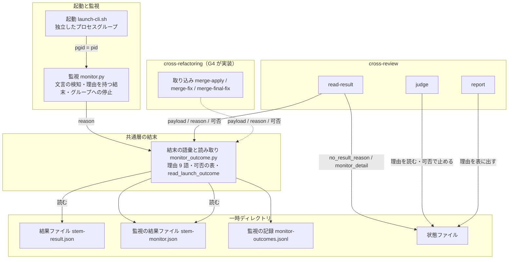
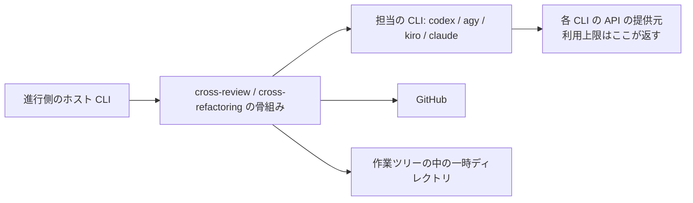
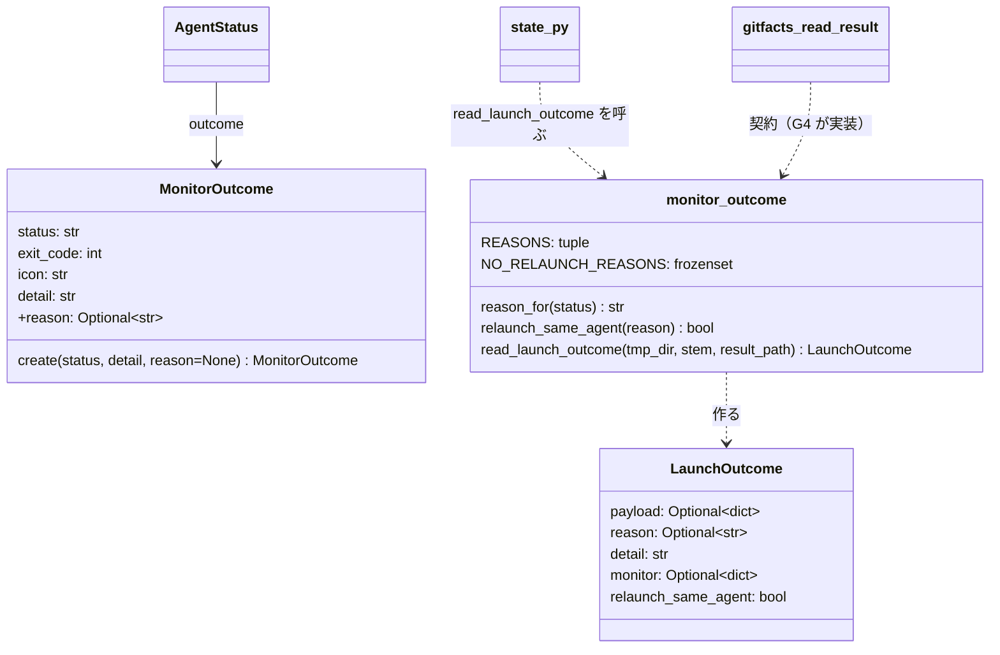
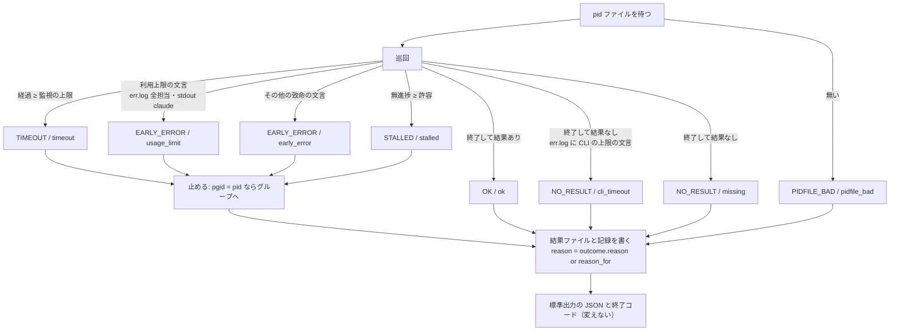
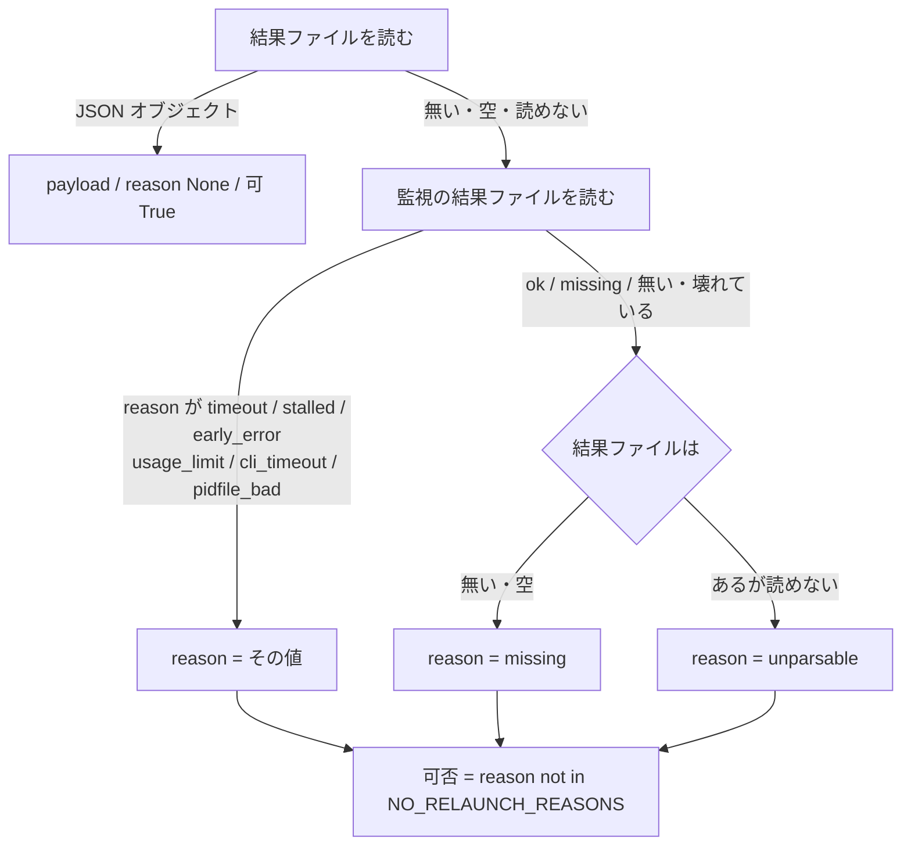
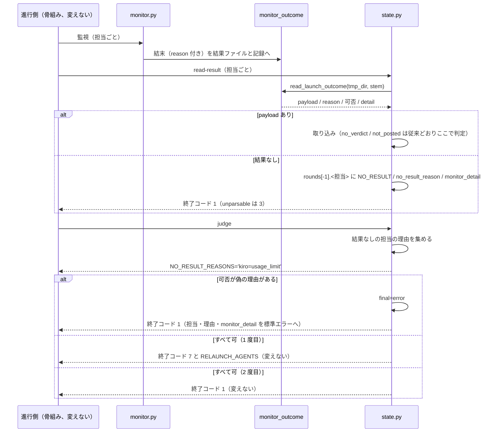

# cross-review: 利用上限で止まった担当が「結果ファイル無し」と報告されて空振りの起動し直しで待たされ、止めた担当が後から結果を書く → 上限を理由に報告して同じラウンドで起動し直さず、止めた後は書かせない（設計 / #729 #619 #584）

## 目的

**起きていること。** 担当の CLI が利用上限で落ちると、監視はその文言を読めない。結果なしの理由は「結果ファイル無し」に畳まれる。進行側は同じ担当を起動し直し、監視の上限 1 回分を待ってから全体を誤りで終える（#619）。監視が止めた担当の子プロセスが、止めた後に結果ファイルを書く（#584）。

**根本原因。** 結果なしの判断を cross-review と cross-refactoring がそれぞれ結果ファイルの有無だけで行い、監視が書いた理由を誰も読まない（#729）。

**この設計で成り立つこと。** 結末の語彙と起動し直しの可否を結末の共通層の 1 か所に置き、両 Skill がその値を読む。利用上限は理由「利用上限」として報告され、同じラウンドでは起動し直さない。止めた担当の子プロセスは結果を書かない。

## 用語の対応表

本文は左の業務用語で書く。識別子はこの表と、コードブロック・表・契約の節にだけ置く。

| 業務用語 | 識別子 |
| --- | --- |
| 結末の共通層 | `plugins/ndf/scripts/lib/monitor_outcome.py`（読み込み名 `monitor_outcome`） |
| 監視 | `plugins/ndf/scripts/lib/monitor.py` |
| 起動の手順 | `plugins/ndf/scripts/lib/launch-cli.sh` |
| 結末を読む関数 | `monitor_outcome.read_launch_outcome(tmp_dir, stem, result_path)` |
| 起動 1 回の結末（値） | `LaunchOutcome`。欄は使える結果 `payload`・理由 `reason`・起動し直しの可否 `relaunch_same_agent`・監視の詳細 `detail`・監視の結果 `monitor` |
| 可否を返す関数 | `monitor_outcome.relaunch_same_agent(reason)` |
| 起動し直せない理由の集合 | `monitor_outcome.NO_RELAUNCH_REASONS` |
| 理由の語彙 | `monitor_outcome.REASONS` |
| 状態からの既定の理由 | `monitor_outcome.reason_for(status)` |
| 監視の結末（型） | `MonitorOutcome`。新しい欄は `reason` |
| 監視の状態 | 正常 `OK` / 監視の上限 `TIMEOUT` / 無進捗 `STALLED` / 結果なし `NO_RESULT`（終了コード 3）/ 早期の致命 `EARLY_ERROR`（終了コード 4）/ pid ファイル不正 `PIDFILE_BAD` |
| 理由（監視が書く） | 正常 `ok` / 監視の上限 `timeout` / 無進捗 `stalled` / 致命の文言 `early_error` / 利用上限 `usage_limit` / CLI の上限 `cli_timeout` / 結果ファイル無し `missing` / pid ファイル不正 `pidfile_bad` |
| 理由（読む側が書く） | 読めない結果 `unparsable`。cross-review 固有は、判定の値が無い `no_verdict` / 未投稿 `not_posted` |
| 結果ファイル | `<stem>-result.json` |
| 監視の結果ファイル | `<stem>-monitor.json` |
| 監視の記録 | `monitor-outcomes.jsonl` |
| 結果の取り込み（cross-review） | `state.py read-result`。関数は `_read_review_result_file`、結果なしの記録は `_record_no_result` |
| 判定（cross-review） | `state.py judge`。結果なしのラウンドの扱いは `_handle_no_result_round` |
| 報告の表（cross-review） | `state.py report` |
| 結果なしの理由の鍵 | 状態ファイルの `rounds[-1].<担当>.no_result_reason` |
| 監視の詳細の鍵 | 状態ファイルの `rounds[-1].<担当>.monitor_detail` |
| 判定が出す理由の行 | 標準出力の `NO_RESULT_REASONS='<担当>=<理由> ...'` |
| 起動し直しの指示 | 判定の終了コード 7 と `RELAUNCH_AGENTS` |
| 誤りの終わり | 状態ファイルの `final=error`。判定の終了コード 1 |
| cross-refactoring の結果の読み取り | `refactor_lib/gitfacts.py` の `read_result`。進行を止める終了は `die` |
| 文言の照合（err.log） | 既存の `_scan_patterns`。表は `USAGE_LIMIT_FATAL` / `EARLY_ERROR_FATAL` / `CLI_TIMEOUT_AFTER_EXIT` |
| 文言の照合（claude の stdout.log） | 既存の `_scan_claude_stdout_fatal`。表は `CLAUDE_STDOUT_USAGE_LIMIT` |
| 結末を書く処理 | `monitor._record_outcome`。結末を作る場所は `_early_error_outcome` / `_process_exit_outcome` |
| プロセスの停止 | `monitor._kill_pid`。グループへは `os.killpg` |
| ジョブ制御 | bash の `set -m`。背景で起動した CLI の pid がプロセスグループの番号になる |
| 検知する文言 | 利用上限は kiro: `Monthly request limit reached`、claude: `"api_error_status":429`。CLI の上限は agy: `print timeout after <時間> with turn in progress` |
| 責務の移動 | issue の分類 `move_responsibility` |
| 実行の要約 | `run_metrics.py` が作る。起動の一覧は `launches[]` |

## 機能一覧

5 つの機能のうち F1〜F3 は共通層、F4 は cross-review、F5 は起動と監視が担う。

| # | 機能 | 誰が使うか |
| --- | --- | --- |
| F1 | 利用上限の文言を検知し、理由 `usage_limit` として残す | 監視。進行側と利用者が理由を読む |
| F2 | CLI 自身の上限で結果を書かずに終わった担当を、理由 `cli_timeout` として残す | 同上 |
| F3 | 結果ファイルの有無・読めるかと監視の結末を 1 つの値として読み、起動し直しの可否を添える | cross-review の取り込み（`read-result`）と cross-refactoring の取り込み（G4） |
| F4 | 起動し直しても解けない結末の担当を、同じラウンドで起動し直さずに止めて理由を報告する | cross-review の判定（`judge`） |
| F5 | 監視が止めた担当の子プロセスに、止めた後に結果を書かせない | 収束ループ |

## 決定の記録

12 件。決定 1 は文書の置き方、2〜3 は共通層の契約、4〜9 は語彙と検知、10 はプロセスグループ、11〜12 は両 Skill の読み方である。

### 決定 1: 変わった決定だけを差分に載せるため、設計文書は親 #729 の名前で新設し、既存の設計文書の本体は書き換えない

既存の設計は 6 課題・3 本の Pull Request を 1 つの文書で扱い、P1 と P2 は配布済みである。P3 の節をその場で書き換えると、配布済みの決定と新しい決定が 1 つの差分に混ざる。承認する人が「何が変わるのか」を読み分けられない。親 #729 は根本原因の場所（共通層）を定め直し、既存の決定 14（判定が理由「利用上限」を見る）の前提を変える。**新設して対応表で指せば、変わった決定だけが差分に載る。**

既存の設計文書の本体（`-design.md`）には案内の 1 行も足さない。設計 Pull Request の本文の「決めたこと」は、変更したファイルの「決定の記録」の見出しをすべて写す。1 行でも触ると、既存の 20 件の決定がこの Pull Request の決定として並ぶ。案内は「決定の記録」を持たない要求の文書と契約の文書にだけ足す。

### 決定 2: 同じ判断を両 Skill に書かないため、結果なしの判断と起動し直しの可否を結末の共通層の 1 つの関数へ移す

いまは cross-review の結果の取り込みと cross-refactoring の結果の読み取りが、それぞれ結果なしを決めている。判断の材料は結果ファイルの有無だけである。監視が書いた理由はどちらも読まない。理由を読む処理を各 Skill に書くと、同じ表（監視の理由 → 結果なしの理由）が 2 か所にできる。語彙を足すたびに片方が古くなる（親 #729 の責務の移動）。**結末の共通層に結末を読む関数を 1 つ置き、両 Skill はその値（使える結果・理由・起動し直しの可否）を受け取るだけにする。** 語彙・対応表・可否の表は結末の共通層だけが持つ。

各 Skill が監視の結果ファイルを読む既存の関数（`read_outcome`）を呼び、自分で表を引く形は採らない。既存の G4 の設計の `apply._monitor_reason` がこの形である。表が Skill の数だけ増える。

### 決定 3: 進行側の問いに合わせ、起動し直しの可否は「同じ担当を同じ条件で起動し直せば解けるか」の 1 つの真偽値にし、利用上限だけを偽にする

進行側が結末を見て決めることは「同じ担当をもう 1 度起動してよいか」に尽きる。利用上限は起動し直しても解けない。起動のたびに待ちと相手の CLI の枠を使う（#619 の 2 回目の空振り、#647 の 3729 回）。それ以外の理由（監視の上限・無進捗・致命の文言・CLI の上限・結果なし・読めない）は、対象や負荷で変わりうる。1 度は起動し直してよい。

**偽のときに何をするかは Skill が決める。** cross-review は止めて理由を報告する（担当を外して回す判断は #478）。cross-refactoring は次の輪番の担当へ替える（G4 の設計の決定 3）。共通層が持つのは可否だけで、進行の分岐は持たない。

理由ごとに「止める / 替える / 起動し直す」の 3 値を返す形は採らない。「替える」は担当の集合を知る Skill にしか決められない。共通層に置くと担当の割り当てを読み込むことになる。

### 決定 4: 終了コードで分岐する骨組みを変えないため、利用上限は「早期の致命」の状態のまま、理由だけを「利用上限」にする

監視の終了コードは骨組みと G4 の設計が分岐に使う（既存の設計の決定 16）。利用上限は「プロセスが続いても結果を生成できないと分かった」致命の一種である。状態としては早期の致命（`EARLY_ERROR`、終了コード 4）と同じである。区別が要るのは理由の側だけである。監視の結果ファイルと記録に理由「利用上限」（`usage_limit`）が入れば、読む側は状態を変えずに区別できる。

新しい状態（`USAGE_LIMIT`、終了コード 7）を足す形は採らない。終了コードの意味が変わる。終了コードで分岐する骨組みと文書（cross-refactoring だけで監視の呼び出しが 8 か所）を見直すことになる。

### 決定 5: 「終わったが結果が無い」の状態を保つため、CLI の上限は「結果なし」の状態のまま、理由だけを「CLI の上限」にする

agy は自分の上限に当たると終了コード 0 で終わり、結果ファイルを書かない。監視から見れば「終わったが結果が無い」（`NO_RESULT`、終了コード 3）で正しい。理由だけを「CLI の上限」（`cli_timeout`）にする。文言は終了の後にだけ見る。生きている間に見ると、途中で出た警告を致命と読む。結果ファイルがあれば理由は「正常」にする（上限に当たっても結果を書き終えていれば使える）。

### 決定 6: 実物の文言に一致し引用を誤検知しないため、利用上限の文言は err.log を全担当で見、stdout.log は claude だけ JSON 向けの照合で見る

kiro の利用上限の文言は err.log に出る（#619 の実物）。claude の文言はどちらに出るか未確認のため、両方を見る（前提 1）。err.log は既存の文言の照合で見る。この照合は表・引用・バッククォート・grep 形式を除外する。実測では、claude の文言を含む JSON の 1 行も err.log の側で一致し、引用の判定に飲み込まれなかった（「実測」）。stdout.log は既存の claude 向けの照合と同じ JSON 向けの形（除外を掛けない）で見る。JSON は 1 行に引用符を多く含む。行単位の引用の判定が「引用の内側」を真と判定するためである。

### 決定 7: 両 Skill が同じ形で見る理由だけを共通にするため、「読めない結果」を共通の語彙に入れ、「判定の値が無い」「未投稿」は cross-review 固有に残す

結果ファイルが JSON として読めない・オブジェクトでないことは、両 Skill の読み取りが同じ形で見ている。共通の関数が結果ファイルを読む以上、この理由（`unparsable`）も共通の語彙に要る。「判定の値が無い」（`no_verdict`）と「未投稿」（`not_posted`）は結果ファイルの中身とレビューの投稿の話である。監視も cross-refactoring も知りえない。**cross-review が共通の関数の後で自分の理由を上書きする形にする。**

理由の語彙は 9 語になる。状態からの既定の理由が返すのは、監視の状態から決まる 6 語のままである。「利用上限」と「CLI の上限」は監視が結末に理由を添えたときだけ現れる。「読めない結果」は読む側だけが使う。

### 決定 8: 状態からは決まらない理由を残すため、監視の結末に理由の欄を持たせ、無ければ状態からの既定を使う

いま結末を書く処理は、状態からの既定の理由で理由を決めている。利用上限と CLI の上限は状態からは決まらない。結末を作る場所が理由を添える。監視の結末の型に理由の欄（`reason: Optional[str] = None`）を足す。結末を書く処理は、結末に理由があればそれを、無ければ状態からの既定を書く（`outcome.reason or reason_for(status)`）。結末を作る既存の呼び出し 8 か所（`create(status, detail)`）は変えない。

### 決定 9: 起動し直しで上書きされる 1 回目の理由を失わないため、その理由は追記だけの監視の記録が持つ

状態ファイルの担当ごとの結果は、そのラウンドの最後の結果を持つ構造である。起動し直すと、1 回目の結果なしの理由は 2 回目で上書きされる。これは既存の構造のままにする。**過去を失わないのは追記だけの監視の記録の側で**（既存の設計の決定 2）、1 回目の理由も記録の理由と終了時刻（`reason` と `ended_at`）から読める。状態ファイルに履歴の配列を足す形は採らない。判定が読むのは最後の結果だけである。履歴は実行の要約の起動の一覧が既に持つ。

### 決定 10: 止めた後に子プロセスが結果を書かないよう、CLI を独立したプロセスグループで起動し、グループの先頭のときだけグループへシグナルを送る

既存の設計の決定 17 をそのまま引き継ぐ。起動の手順がジョブ制御を有効にしてから背景で起動すると、CLI の pid がそのままプロセスグループの番号になる。監視は pid がグループの先頭であり、かつ監視自身のグループと違うときだけグループへ送る。それ以外は従来どおり pid だけへ送る。`setsid` は macOS に標準で入っていないため採らない。結果の取り込みの前に結果ファイルの出現を待つ形（#584 の候補 2）も採らない。書き出しそのものを止めれば待つ理由が無い。

### 決定 11: cross-refactoring も同じ値を読むよう、結果の読み取りは結果なしで進行を止めず、共通の関数の値で返す契約に置き換える。実装は G4

#728 は、cross-refactoring の結果の読み取りが進行を止める終了（`die(code=2)`）で終了コードを決める向きを直す。その向きを直した先が、結末を読む関数の値である。G3 が決めるのは次の範囲までである。結果の読み取りに相当する処理は結末を読む関数を呼び、使える結果・理由・起動し直しの可否を返す。終了コードを決めず、標準エラーに書かない。3 つの取り込みがその値をどう扱うか（群の状態・担当の交代・終了コード）は G4 が決める。薄い包みとして残すか呼び出し側が直接呼ぶかも G4 に任せる（要求の「未決」）。

### 決定 12: cross-review の骨組みの行を変えないため、結果の取り込みの終了コードと判定の 0 / 2 / 7 / 8 は変えず、利用上限は既存の 1 の枝で終える

骨組み（`SKILL.md`）は結果の取り込みの終了コードを `|| true` で受け、判定の 7 / 8 / 0 / 2 で分岐し、それ以外を `exit` する。利用上限で起動し直さずに止める結末は、既存の「2 度目も結果なし → 誤りの終わり → 1」と同じ出口へ載せる。骨組みの行は 1 つも変わらない（AC24）。

新しい終了コードで「利用上限で止めた」を骨組みへ伝える形は採らない。骨組みの分岐が増える。cross-review の `SKILL.md` と `docs/` の 2 か所へ同じ値を書くことになる。理由は判定が出す理由の行と報告の表で読める。

## 実測

2026-09-19 に `develop`（9eaebe14、bash 5.3.9、Python 3.14.4）で、提案する文言を既存の文言の照合に通した。

```text
kiro 実物                usage=HIT  cli_timeout=-    現行fatal=-
claude 429 JSON 1 行    usage=HIT  cli_timeout=-    現行fatal=-
claude 429 空白あり        usage=HIT  cli_timeout=-    現行fatal=-
HTTP 429 行             usage=HIT  cli_timeout=-    現行fatal=HIT
HTTP 401 行             usage=-    cli_timeout=-    現行fatal=HIT
表の中                    usage=-    cli_timeout=-    現行fatal=-
バッククォート                usage=-    cli_timeout=-    現行fatal=-
引用行                    usage=-    cli_timeout=-    現行fatal=-
agy print timeout      usage=-    cli_timeout=HIT  現行fatal=-
grep 形式                usage=-    cli_timeout=-    現行fatal=-
stdout JSON 向け照合: True
```

- 利用上限の 4 つの文言は、実物の 3 形式（kiro の 1 行・claude の JSON 1 行・HTTP 429 行）に一致する。表・バッククォート・引用・grep 形式では一致しない
- HTTP の 401 の行は利用上限に入らず、現行の致命の文言（`early_error`）に残る（AC4）
- claude の JSON の 1 行は、err.log 向けの引用の判定を通しても一致した（決定 6 の前提）
- 現行の致命の照合（`_scan_early_fatal`）は kiro の実物と claude の JSON に一致しない（#619 の再現）

プロセスグループの実測は既存の契約の文書の「実測」（2026-09-15）にあり、変更していない。ジョブ制御を有効にして起動した CLI をグループへのシグナルで止めると、3 秒後に子が書く結果ファイルは書かれなかった。

## 構成要素

変えるのは共通層の 3 ファイルと cross-review の 4 ファイルで、cross-refactoring は契約だけを受け取る。

| 要素 | 新設 / 変更 | 責務 |
| --- | --- | --- |
| 結末の語彙と読み取り（`lib/monitor_outcome.py`） | 変更 | 理由 9 語、起動し直しの可否の表、結末を 1 つの値として読む `read_launch_outcome`（決定 2・3・7） |
| 監視（`lib/monitor.py`） | 変更 | 利用上限と CLI の上限の文言の検知、理由を持つ結末（決定 4・5・6・8）、グループへの停止（決定 10） |
| 起動（`lib/launch-cli.sh`） | 変更 | `set -m` で CLI を独立したプロセスグループにする（決定 10） |
| cross-review の状態（`cross-review/scripts/state.py`） | 変更 | `read-result` が共通の値を読んで理由と `monitor_detail` を記録する。`judge` が理由を出し、可否が偽なら止める。`report` が理由を表に出す（決定 12） |
| cross-review の文書（`docs/01-state-and-review.md` / `docs/03-review-output.md` / `docs/04-contracts.md`） | 変更 | 理由の表、上限の見分け方、状態ファイルの鍵 |
| 共通層の一覧（`lib/README.md`） | 変更 | `monitor_outcome.py` の行に読み取りの責務を足す |
| cross-refactoring の取り込み（`refactor_lib/gitfacts.py` ほか） | **契約のみ** | `read_result` に相当する読み取りが `read_launch_outcome` を呼ぶ（決定 11）。実装は G4 |
| テスト（`scripts/tests/` / `cross-review/tests/`） | 変更 | 「テスト設計」 |



**図に含めない要素**は次の 2 つである。

| 要素 | 図との関係 |
| --- | --- |
| cross-review の文書と共通層の一覧 | 手順と表の記述で、呼び出しの辺を持たない |
| テスト | 実行時の依存ではない |

## 文脈と配置

利用上限を返すのは各 CLI の API の提供元で、こちらは変えられない。**この変更が変えるのは、その返答が err.log / stdout.log に現れたときの読み方だけである。**



| 実行の単位 | どこで動くか | 境界 |
| --- | --- | --- |
| 担当の CLI | 背景のプロセス。**独立したプロセスグループ**（pgid = pid） | 一時ディレクトリへ結果ファイルとログを書く |
| 監視 | 進行側のシェルから起動する Python（cross-review は `bg-wait.sh` の背景） | 一時ディレクトリを読み、監視の結果ファイルと記録を書き、CLI のグループへシグナルを送る |
| 状態の操作 | 進行側が 1 コマンドずつ呼ぶ Python | 一時ディレクトリの結果ファイル・監視の結果ファイル・状態ファイルを読み書きする |

配置で変わるのは担当の CLI のプロセスグループだけである。

## 置き場所

変えるファイルと、それぞれで変わるものを示す。

```text
plugins/ndf/scripts/lib/
  monitor_outcome.py     変更（語彙 9 語・可否の表・read_launch_outcome・LaunchOutcome）
  monitor.py             変更（USAGE_LIMIT_FATAL / CLI_TIMEOUT_AFTER_EXIT / MonitorOutcome.reason / _kill_pid のグループ）
  launch-cli.sh          変更（set -m）
  README.md              変更（monitor_outcome.py の行）
plugins/ndf/scripts/tests/
  test_monitor_outcome_unit.py   変更（語彙と read_launch_outcome の単体）
plugins/ndf/skills/cross-review/
  scripts/state.py       変更（_read_review_result_file / _record_no_result / _handle_no_result_round / report）
  docs/01-state-and-review.md    変更（理由の表）
  docs/03-review-output.md       変更（上限の見分け方）
  docs/04-contracts.md           変更（monitor_detail）
  tests/                 変更（文言・グループ・judge・report）
plugins/ndf/skills/cross-refactoring/scripts/refactor_lib/gitfacts.py   契約のみ（G4 が変える）
# dev.kiro / dev.agy の配布物は bash scripts/build-runtime-plugins.sh で同期する
```

## 構造

変更が触る型だけを載せる。



`+` の付いた欄が増える。担当の状態の型（`AgentStatus`）と cross-review の状態の操作の既存の欄・関数は変えない。

| 触る型 | 責務 |
| --- | --- |
| `MonitorOutcome.reason` | 状態からは決まらない理由（`usage_limit` / `cli_timeout`）を結末に添える。`None` なら `reason_for(status)` |
| `LaunchOutcome` | 起動 1 回の結末。`payload` があれば使える結果、無ければ `reason` が理由。`relaunch_same_agent` は `reason` から導く（`payload` があれば `True`） |
| `monitor_outcome.NO_RELAUNCH_REASONS` | 起動し直しても解けない理由の集合。値は `{"usage_limit"}` |

## 理由の語彙

共通層の理由の語彙は 9 語である。監視が書く語と読む側だけが書く語を、起動し直しの可否と合わせて 1 つの表で持つ。

| 理由 | 監視の状態 | 誰が書くか | 起動し直しの可否 | 何が起きたか |
| --- | --- | --- | --- | --- |
| `ok` | `OK` | 監視 | — | 結果ファイルがあって終わった |
| `timeout` | `TIMEOUT` | 監視 | 可 | 監視の上限 |
| `stalled` | `STALLED` | 監視 | 可 | 無進捗の許容 |
| `early_error` | `EARLY_ERROR` | 監視 | 可 | 利用上限以外の致命の文言 |
| `usage_limit` | `EARLY_ERROR` | 監視（決定 8） | **否** | 利用上限の文言 |
| `cli_timeout` | `NO_RESULT` | 監視（決定 8） | 可 | 結果なしで終わり、err.log に CLI の上限の文言 |
| `missing` | `NO_RESULT` | 監視・読む側 | 可 | 結果なしで終わり、理由の文言が無い |
| `pidfile_bad` | `PIDFILE_BAD` | 監視 | 可 | pid ファイルが無い・別のプロセス |
| `unparsable` | — | 読む側だけ | 可 | 結果ファイルがあるが JSON オブジェクトとして読めない |

## データ構造

永続データは JSON のファイルで、データベースは無い。ER 図は作らず、表で持つ。

### 監視の結果ファイルと監視の記録（P1 から。理由の値だけが増える）

| 列 | 型 | 空を許すか | 意味 |
| --- | --- | --- | --- |
| `reason` | 文字列 | 許さない | 監視が書く理由。`ok` / `timeout` / `stalled` / `early_error` / `usage_limit` / `cli_timeout` / `missing` / `pidfile_bad` の 8 語（`unparsable` は監視が書かない） |

他の 14 個のキーは変えない（既存の契約の文書の「監視の結果ファイル」）。

### 状態ファイルの担当ごとの最後の結果（cross-review）

| 列 | 型 | 空を許すか | 意味 |
| --- | --- | --- | --- |
| `intent` | 文字列 | 許さない | `NO_RESULT` のとき下の 2 列が意味を持つ（既存） |
| `no_result_reason` | 文字列 | 許さない（`NO_RESULT` のとき） | `read_launch_outcome` の `reason`（`ok` を除く 8 語）、または cross-review が上書きする `no_verdict` / `not_posted` |
| `monitor_detail` | 文字列 | 許す | 監視の `detail`（最大 200 文字の err.log の抜粋）。**鍵が無い** = 監視の結果ファイルが無かった。空文字は書かない |

結果なしの理由の値の集合は 10 語になる。既存の 3 語（結果ファイル無し・読めない結果・判定の値が無い）と未投稿の意味は変えない。

### 機能とデータの対応

| 機能 | 監視の結果ファイル | 監視の記録 | 結果ファイル | 状態ファイル |
| --- | --- | --- | --- | --- |
| F1 / F2 検知して理由を残す | C | C | — | — |
| F3 結末を 1 つの値として読む | R | — | R | — |
| F4 止めて理由を報告する（cross-review） | — | — | — | R / U |
| F5 止めた後に書かせない | — | — | （書かせない） | — |

時系列の扱いは決定 9 のとおり。状態ファイルは上書き（最後の結果だけ）、監視の記録は追記だけで過去を持つ。移行は無い（鍵の追加と値の追加だけで、既存の状態ファイルはそのまま読める）。

## 入出力の契約

共通層の 2 つの関数と、監視・起動の約束を表で持つ。この節の識別子は「用語の対応表」の右の列である。

### 結末を読む関数（新設。両 Skill の取り込みが呼ぶ）

| 項目 | 内容 |
| --- | --- |
| 名前 | `read_launch_outcome(tmp_dir, stem, result_path=None) -> LaunchOutcome` |
| 入力 | `tmp_dir`: 一時ディレクトリ。`stem`: 監視と同じ stem（`<agent>-review-pr<N>` / `<impl>-apply-r<R>` など）。`result_path`: 結果ファイルのパス。省くと `<tmp_dir>/<stem>-result.json` |
| 出力（使える結果） | `payload` に JSON オブジェクト、`reason` は `None`、`relaunch_same_agent` は `True`、`monitor` に監視の結果ファイルの辞書（無ければ `None`）、`detail` に監視の `detail`（無ければ空文字） |
| 出力（結果なし） | `payload` は `None`、`reason` は下の表、`relaunch_same_agent` は `reason not in NO_RELAUNCH_REASONS`、`detail` は監視の `detail`（無ければ読めなかった理由の 1 文） |
| 失敗の形 | **失敗しない。** 例外を投げず、`SystemExit` も出さず、標準出力・標準エラーに書かない。監視の結果ファイルが壊れていれば無いものとして扱う |
| 互換性 | 新設。既存の `read_outcome` / `reason_for` / `REASONS` の呼び出し側は変わらない（`REASONS` は 9 語になるが、一覧を持つ読み手は無い） |

結果なしの理由の決め方（要求の AC9）:

| 監視の結果ファイルの `reason` | 結果ファイル | `reason` |
| --- | --- | --- |
| `timeout` / `stalled` / `early_error` / `usage_limit` / `cli_timeout` / `pidfile_bad` | 問わない | その値（**監視が止めたか、結果を書けない終わり方をしたことが分かっている**） |
| `ok` / `missing` / ファイルが無い・読めない | 無い、または空 | `missing` |
| `ok` / `missing` / ファイルが無い・読めない | あるが JSON オブジェクトでない | `unparsable` |

**結果ファイルが読めれば使える結果が勝つ。** 監視が利用上限で止めた後にも結果ファイルが残っていれば、それは止める前に書き終えていた結果で、使ってよい。

### 可否を返す関数（新設）

`relaunch_same_agent(reason) -> bool` は `reason not in NO_RELAUNCH_REASONS` を返す。`NO_RELAUNCH_REASONS = frozenset({"usage_limit"})`。理由を足すときはこの集合だけを見直す。

### 監視（変更。終了コードと標準出力は変えない）

| 引数・出力 | 約束 |
| --- | --- |
| 終了コード 0〜6 | 変えない。`usage_limit` は 4、`cli_timeout` は 3 |
| 標準出力の 13 個のキー | 変えない |
| 監視の結果ファイルと記録の `reason` | `usage_limit` / `cli_timeout` が増える |
| `--no-early-error` | 変えない。利用上限の検知も致命の検知と一緒に無効になる（`MONITOR_NO_EARLY_ERROR=1` の逃げ道はそのまま） |

検知の文言（err.log は既存の照合の除外を掛ける。claude の stdout.log は JSON 向けの照合で除外を掛けない）:

| 表 | 理由 | 見るファイル | いつ見るか | 文言（正規表現） |
| --- | --- | --- | --- | --- |
| `USAGE_LIMIT_FATAL` | `usage_limit` | err.log（全担当） | 生きている間の巡回ごと | `Monthly request limit reached` |
| `USAGE_LIMIT_FATAL` | `usage_limit` | err.log（全担当） | 同上 | `"api_error_status"\s*:\s*429` |
| `USAGE_LIMIT_FATAL` | `usage_limit` | err.log（既存の一致を付け替え） | 同上 | `\b(?:quota exceeded\|rate limit exceeded)\b`（大文字小文字を問わない）/ `^HTTP/\d\S* 429 ` |
| `CLAUDE_STDOUT_USAGE_LIMIT` | `usage_limit` | claude の stdout.log | 同上 | `"api_error_status"\s*:\s*429` |
| `EARLY_ERROR_FATAL` | `early_error` | err.log（既存の一致を分ける） | 同上 | `^HTTP/\d\S* (?:401\|403) ` と、残りの既存の致命 |
| `CLI_TIMEOUT_AFTER_EXIT` | `cli_timeout` | err.log | **終了した後、結果ファイルが無いときだけ** | `print timeout after \S+ with turn in progress` |

照合の順序は利用上限 → 致命 → 警告の見た目の致命。同じ err.log に利用上限と他の致命が両方あれば、理由は「利用上限」になる。上限で落ちた後に別の文言が続く形が普通で、上限のほうが原因である。

### 起動の手順と監視の停止（変更。既存の設計の決定 17）

| 項目 | 約束 |
| --- | --- |
| 起動 | `set -m` を有効にして背景起動する。CLI の pid = pgid |
| 停止 | `os.getpgid(pid) == pid` かつ `!= os.getpgrp()` なら `os.killpg`（SIGTERM → 3 秒 → SIGKILL）。それ以外は従来どおり `os.kill` |
| 互換性 | 呼び出し側の引数は変わらない。pid ファイルの中身も変わらない |

## 両 Skill が従う契約

cross-review は状態の操作を変更し、cross-refactoring は結果の読み取りの契約だけを受け取る。

### cross-review の状態の操作（変更）

| コマンド | 変わる出力 | 変わらないもの |
| --- | --- | --- |
| `read-result` | `rounds[-1].<担当>.no_result_reason` に `read_launch_outcome` の `reason`（`no_verdict` / `not_posted` は従来どおり後で上書き）。監視の結果ファイルがあれば `monitor_detail` | 終了コード（`unparsable` は 3、それ以外は 1、使える結果は 0） |
| `judge` | 結果なしがあるとき標準出力に `NO_RESULT_REASONS='<担当>=<理由> ...'`。可否が偽の理由を含めば `final=error` と終了コード 1、標準エラーに担当・理由・`monitor_detail` | 終了コード 0 / 2 / 7 / 8 の意味と `RELAUNCH_AGENTS` の形、8 の `flush` の枝 |
| `report` | ラウンド表で `<担当>=NO_RESULT(<理由>)` | 他の行 |

### cross-refactoring の結果の読み取り（契約のみ。G4 が実装する）

| 項目 | 契約 |
| --- | --- |
| 読み取り | `read_launch_outcome(state["tmp_dir"], stem_for(...), result_path(...))` を呼ぶ。自前で結果ファイルを開かない |
| 返すもの | `LaunchOutcome`（`payload` / `reason` / `relaunch_same_agent` / `detail` / `monitor`） |
| 失敗の形 | **`die` しない。** 終了コードを決めるのは 3 つの取り込み（`merge-apply` / `merge-fix` / `merge-final-fix`） |
| 群の記録 | `failed_attempts[].reason` には `LaunchOutcome.reason` をそのまま写す（G4 の設計の `_monitor_reason` はこの値で置き換わる） |
| 担当の交代 | `relaunch_same_agent` が偽なら同じ担当で試行を重ねない。替えるか止めるかは G4 の決定 3 |

## 処理の流れ

監視の 1 担当、結末の読み取り、cross-review の 1 ラウンドの 3 つを図にする。

### 監視の 1 担当（利用上限と CLI の上限の枝が入る）



### 結末を読む関数の流れ



### cross-review の 1 ラウンド（起動し直しの判断）



## 非機能の実現方式

要求の非機能の条件 3 件に、それぞれ実現方式を対応させる。

| 条件 | 実現方式 |
| --- | --- |
| 理由が 4 か所で同じ語彙で読める | 監視が結末に理由を添え、`_record_outcome` が結果ファイルと記録へ同じ値を書く。`read-result` は `read_launch_outcome` の `reason` をそのまま `no_result_reason` に写す。要約の `launches[]` は記録の行から作る（P1 のまま）。語彙を足すときは `REASONS` と `NO_RELAUNCH_REASONS` と検知の表だけを変える |
| `monitor_detail` が要約に入らない | `run_metrics.py` は状態ファイルの `rounds[-1].<担当>` の鍵を要約へ写さず、記録の行から `detail` を除いて `launches[]` を作る（P1 の決定 7）。この変更は要約の側を触らない |
| macOS でもグループで止める | 外部コマンドに頼らない `set -m` を使う。bash 3.2 は未確認（「未確認のまま残ること」）。成り立たなければ pid だけの停止に落ちる（`os.getpgid(pid) != pid` の枝） |

## テスト設計

受け入れ条件 24 件を、既存のテストの形（偽の CLI を実プロセスで動かす・一時ディレクトリに結果を置く・状態ファイルを作って呼ぶ）で確かめる。

| 受け入れ条件 | 何で確かめるか |
| --- | --- |
| AC1 | `REASONS` の 9 語と、6 つの状態の `reason_for` の返り値を固定する（`plugins/ndf/scripts/tests/test_monitor_outcome_unit.py`） |
| AC2〜AC5 | 各文言を 1 行書いた err.log / stdout.log と、終わったプロセスの pid ファイルで `monitor_agent` を呼び、状態・終了コード・結果ファイルの `reason`（`plugins/ndf/skills/cross-review/tests/test_monitor_usage_limit.py` 新設）。AC5 は結果ファイルあり・なしの 2 通り |
| AC6 | 「実測」の 10 行をそのまま入力にし、表・引用・バッククォート・grep 形式で一致しないこと。claude の stdout.log の JSON で一致すること（`plugins/ndf/skills/cross-review/tests/test_monitor_early_error.py` の形に倣う） |
| AC7 | 既存の `plugins/ndf/skills/cross-review/tests/test_monitor_outcome_file.py` の標準出力のキーの検査を変更せずに通す。記録の行の `reason` を読む |
| AC8〜AC11 | 一時ディレクトリに監視の結果ファイル（各理由・壊れた JSON・無し）と結果ファイル（オブジェクト・配列・壊れた JSON・空・無し）を組み合わせて置き、`read_launch_outcome` の 5 つの欄。`capsys` で標準出力・標準エラーが空（`plugins/ndf/scripts/tests/test_monitor_outcome_unit.py`） |
| AC12 | `git grep -n 'usage_limit' -- plugins/ndf/skills` の一致行が、文書とテストとテンプレートの文言だけである（テスト化せず、レビューの手順） |
| AC13 | 結果ファイル無し + 監視の結果ファイル（各理由）/ 無しで `read-result` を呼び、状態ファイルの `no_result_reason` と `monitor_detail` と終了コード（`plugins/ndf/skills/cross-review/tests/test_read_result_reason.py` 新設） |
| AC14〜AC17 | 状態ファイルを作って `judge` と `report` を呼ぶ。`usage_limit` を含む / 含まない / 2 度目の 3 通り（`plugins/ndf/skills/cross-review/tests/test_judge_no_result_reason.py` 新設） |
| AC18 | 文書の `grep`（10 語と「見分け方」の節） |
| AC19〜AC21 | 3 秒後に子が書く偽の CLI を `launch-cli.sh` で起動し、`os.getpgid` と、監視の上限 2 秒で止めた後の結果ファイルの有無。先頭でない pid では `os.killpg` が呼ばれないことを `mock` で見る（`plugins/ndf/skills/cross-review/tests/test_launch_cli_process_group.py` 新設） |
| AC22〜AC23 | 検証手段の表のコマンド |
| AC24 | `SKILL.md` の骨組みの該当行（`bg-wait.sh run` から `case $JUDGE_RC` まで）を変更前と `diff` して差が無い |

## 未確認のまま残ること

6 件。実装で決めたものが 4 件（1・3・5・6。決めた結果を「決める時点」の列に残す）、確かめないまま進めるものが 2 件（2・4。どちらでも設計が塞ぐ）である。

| # | 項目 | 内容 | 決める時点 |
| --- | --- | --- | --- |
| 1 | claude の 429 の出る先 | `"api_error_status":429` が err.log と stdout.log のどちらに出るか。実物のログが手元に無い。両方を見るためどちらでも拾える | 実装で偽の claude を err.log と stdout.log の両方の形で試し、どちらでも `EARLY_ERROR` / `usage_limit` になることをテストで固定した（`test_monitor_usage_limit.py` の `test_usage_limit_stops_the_agent_as_early_error_with_reason_usage_limit`）。実物の出る先は次に上限に当たったときの記録で確かめる |
| 2 | kiro の利用上限のときの終わり方 | プロセスが直ちに終わるのか、待ち続けるのか。#619 の実物では `err.log` に 1 行出て `NO_RESULT` になった（直ちに終わったと読める） | どちらでも監視は巡回で文言を拾い `usage_limit` にする。実装で確かめない |
| 3 | macOS の bash 3.2 の `set -m` | Linux の bash 5.3 だけで確かめた | 一次資料で確かめた。GNU の配布物 bash-3.2 の `doc/bash.1`（2006-09-28）の `set` の `-m` の項に「Background processes run in a separate process group」とあり、`CHANGES` の bash-2.01 の節に `set -m` の修正の記載がある（2.01 の時点で存在する）。手元の bash 5.3.9 では非対話・tty 無しで pid = pgid になり、標準エラーへジョブ制御の通知は出ない。macOS の実機では未確認のまま。成り立たなければ `_leads_own_group` が偽になり pid だけの停止に落ちる（構造は同じ） |
| 4 | agy が子プロセスで結果を書くか | #584 の事例が止めた後の書き出しだったかは確かめられていない | 確かめないまま進める（グループで止めればどちらでも塞がる） |
| 5 | 利用上限と他の致命が同じ err.log に並ぶ順序 | 上限の後に別の致命が続く形を想定して利用上限を先に見る。逆の順で並ぶ実物は未確認 | 照合の順序を利用上限 → 致命 → 警告の見た目の致命に固定し、err.log の並びがどちらの順でも理由が `usage_limit` になることをテストで固定した（`test_usage_limit_wins_over_other_fatal_lines_in_either_order`）。逆の順で並ぶ実物が出ても結果は変わらない |
| 6 | `read_launch_outcome` に渡す stem の組み立て | cross-review は `<agent>-review-pr<N>`、cross-refactoring は `stem_for` の値。監視の `--stem-template` と食い違うと監視の結果ファイルを引けない | cross-review の 3 か所（`launch-reviewer.sh` の `STEM=` の行・監視の `DEFAULT_STEM_TEMPLATE`・取り込みが渡す stem）が同じ形であることを 1 つのテストで固定した（`test_read_result_reason.py` の `test_the_three_stems_have_the_same_shape`）。cross-refactoring の `stem_for` との突き合わせは G4 が `read_result` を置き換えるときに同じ形のテストを置く |

## 申し送り（並行する設計との境界）

同時に進む G4 / G5 / D-B / G1 と、どこまでをこの設計が持つかを決めた。

| 相手 | 決めた契約 | どちらが何をするか |
| --- | --- | --- |
| G4（#728 #647 #592 #553） | `gitfacts.read_result` の契約（「両 Skill が従う契約」）。理由の語彙 9 語と `relaunch_same_agent` | G3 が共通層と cross-review を実装する。G4 は `read_result` に相当する読み取りを `read_launch_outcome` に置き換え、3 つの取り込みで `payload` 無しのときの群の状態・担当の交代・終了コードを決める。G4 の既存の設計の `apply._monitor_reason` と `gitfacts.load_result` は `read_launch_outcome` で置き換わる |
| G4 | 監視の終了コード 0〜6 と標準出力は変えない | G3 が守る。G4 は終了コードで分岐しない設計（G4 の決定 4）を続ける |
| G5（#730 #583） | 既存の設計の決定 18（`prior_review_url` と記録だけの起動）・決定 19（起動し直しを初回と同じ経路へ）・AC63〜AC67 | G5 が持つ。G3 は `read-result` の結果なしの記録に `monitor_detail` を足すだけで、`prior_review_url` の鍵と `launch-reviewer.sh` は触らない。G5 が `_record_no_result` に `prior_review_url` を足すときは、G3 の `monitor_detail` の書き方（鍵が無い = 無かった）に揃える |
| D-B（#478） | 判定が出す `NO_RESULT_REASONS` の行と、可否が偽のときに止めること | G3 が入れる。利用上限の担当を外して残りで回す判断は #478 |
| G1（#727 #478 ほか） | `state.py` の `init` / 再開の引数 | 触るファイルが同じ（`state.py`）だが節が違う（G3 は `_read_review_result_file` / `_record_no_result` / `_handle_no_result_round` / `report`）。競合は後からマージする側が解く |

## 既存の設計との対応

既存の設計（PR #666）の P3 の決定を、この文書のどの決定が引き継ぐかを示す。

| 既存の決定（PR #666） | この文書 | 変わったこと |
| --- | --- | --- |
| 決定 14（利用上限は致命として止め、同じラウンドで起動し直さない） | 決定 3・4 | 「判定が `usage_limit` を見る」から「共通層の可否を見る」へ。値は同じ |
| 決定 15（CLI の上限は結果なしのまま理由だけ） | 決定 5 | 結果ファイルがあれば `ok` を明記 |
| 決定 16（監視の終了コードと標準出力を変えない） | 決定 4・12 | 同じ |
| 決定 17（プロセスグループで止める） | 決定 10 | 同じ |
| 決定 18（投稿済みの担当は記録だけの起動） | — | #730（G5）へ |
| 決定 19（起動し直しを初回と同じ経路へ） | — | #730（G5）へ |
| 決定 20（利用上限の検知は err.log + claude の stdout.log） | 決定 6 | 実測を足した。値は同じ |
| — | 決定 1・2・7・8・9・11 | 新設 |

## この文書の位置づけ

この文書は「どう作るか」だけを扱う。要求と受け入れ条件は [issue-729-619-584-requirements.md](issue-729-619-584-requirements.md) にある。

**既存の設計 [issue-662-598-537-619-584-583-design.md](issue-662-598-537-619-584-583-design.md) の P3 を置き換える。** 既存の決定のうち引き継ぐものと変えるものは「既存の設計との対応」にある。#583（決定 18・19）は #730 の設計へ移る。
