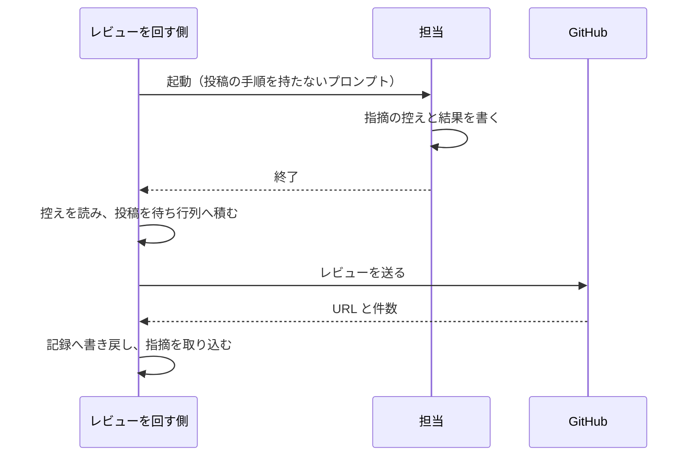
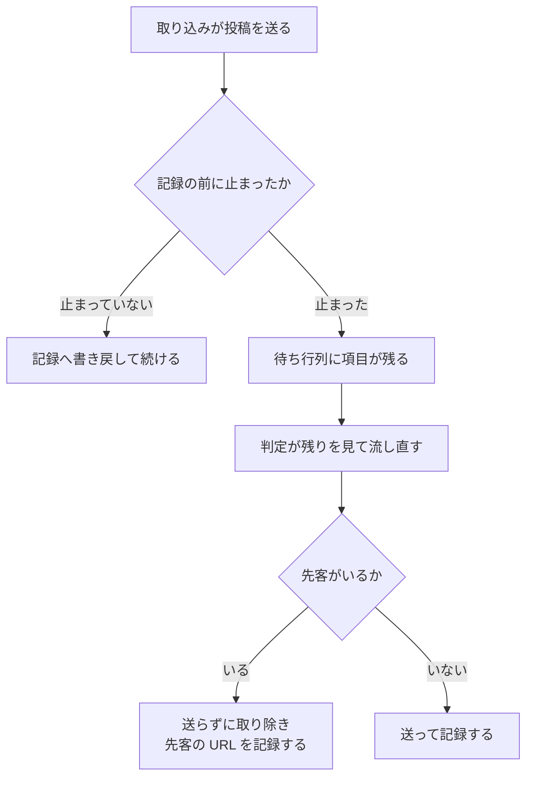

# cross-review: PR に出ている指摘が記録に残らず、同じ論点が 2 つのスレッドに分かれる → GitHub と git へ書くのをレビューを回す側だけにし、途中で止まっても二度書かない（#730 #583 の設計）

## 目的

レビューを任された担当が、PR へ指摘を書き込んでから結果を残す前に止まると、PR には指摘が出ているのに記録には残らない。レビューを回す側は記録だけを読んで「結果なし」と判定し、同じ担当をもう一度起動する。利用者は 1 つの論点に 2 つのスレッドを見て、両方へ返信する。

原因は、書き込みと記録を別々の相手が行っていることである。GitHub と git へ書くのをレビューを回す側 1 か所に集め、担当は結果を残すだけにする。書き込みと記録が同じ手順の中で続けて起きるため、途中で止まっても同じものを二度書き込まない。

## 用語の対応表

| 業務用語 | 識別子・実体 |
| --- | --- |
| レビューを回す側 | `plugins/ndf/skills/cross-review/scripts/state.py` と、それを呼ぶ `SKILL.md` の骨組み |
| 担当 | 1 ラウンドで 1 者ぶんのレビューを行う CLI。`launch-reviewer.sh` が起動する |
| 席 | そのラウンドで担当が入る枠。`claude` / `codex` / `agy` / `kiro` と、同じランタイムの 2 つ目の `-2`〜`-9` |
| 修正の担当 | 指摘を直すサブエージェント、または単独で動く `fix` の実行 |
| 結果ファイル | `<席>-review-pr<番号>-result.json` |
| 指摘の控え | `<席>-review-pr<番号>-round<R>-payload.json` |
| 修正の結果ファイル | `fix-pr<番号>-result.json` |
| 投稿の待ち行列 | `plugins/ndf/scripts/lib/post_queue.py` |
| 二度書かないための照合 | `post_queue.already_posted()` / `posted_match()` |
| 結果ファイルを投稿へ変える層 | 新設する `plugins/ndf/scripts/lib/result_posts.py` |
| 指摘の取り込み | `state.py read-result` |
| 修正の取り込み | `state.py merge-fix` |
| 最終スイープの照合 | `state.py verify-sweep` |
| 投稿の種別 | `pr-comment` / `review-post` / `review-reply` / `thread-resolve` |

## 機能一覧

| # | 機能 | 受け入れ条件 |
| --- | --- | --- |
| 1 | 担当のプロンプトから投稿の手順を外し、結果だけを書かせる | AC1〜AC4 |
| 2 | 指摘の取り込みが、控えからレビューを組み立てて送る | AC5・AC6・AC16・AC17 |
| 3 | 修正の取り込みが、返信・決着・まとめを送り、修正を送信して照合する | AC7〜AC9 |
| 4 | 同じものを二度書かない照合を、4 種別すべてに掛ける | AC10〜AC14 |
| 5 | 申告と実数の突き合わせをやめ、送信の応答を記録にする | AC15 |
| 6 | 起動し直しを初回と同じ経路へ通す | AC18〜AC20 |
| 7 | `fix` の書き込みを 1 つの実装にまとめる | AC21・AC22 |
| 8 | 文書の決定を書き直す | AC25〜AC29 |

## なぜ変えるか

**書き込みと記録が別の相手にあるため、片方だけが残る状態を作れる。** 担当は GitHub へ投稿し、その後に結果ファイルを書く。この 2 つの間で担当が止まると、投稿は残り記録は残らない。レビューを回す側は記録しか見ないので、投稿があることを知らないまま同じ担当を起動する。

**待ち行列は用意されているのに、担当の投稿がそこを通らない。** 上限で拒まれた投稿を残して後から流す仕組みはレビューを回す側にあるが、担当が自分で送るため、上限に当たった投稿はその場で失われる。

**送信の報告を確かめる手段がない。** 修正の担当はブランチ名を指定して送信する。作業ツリーが切り離された頭で作られている場合、この指定では現在の頭が送られないまま終了コード 0 で終わる。取り込む側は報告をそのまま記録する。

書き込みを 1 か所へ集めると、この 3 つが同じ場所で解ける。投稿は待ち行列を通り、送信は現在の頭を指定して行い、送った結果がそのまま記録になる。

## 実測

2026-09-21、`origin/develop`（`c853691a`）で確かめた。

| 何を測ったか | 値 | 確かめ方 |
| --- | --- | --- |
| 投稿の待ち行列の種別 | 4 つ（`pr-comment` / `review-post` / `review-reply` / `thread-resolve`） | `post_queue.py` の `KINDS` |
| そのうち、積む側が実装されている種別 | 1 つ（`pr-comment`。`rotate-pr.sh:53` の 1 か所だけ） | `grep -rn -- "--kind" plugins/ndf` の結果から、手順・テスト・別スクリプトの行を除いた |
| レビューを回す側の `gh` の呼び出し | 12 か所。書き込みの引数（`--method` / `-X POST` / `mutation`）を持つ行は 0 | `grep -c '"gh"'` と `grep -n -- '--method\|-X POST\|mutation'` |
| 担当のプロンプトに書かれた投稿の指示 | 4 か所（`launch-reviewer.sh:95,158,204,206`） | `grep -n "gh api"` |
| 修正の担当が行う書き込み | 4 種類（返信・決着・まとめ・送信）。`fix/SKILL.md:294,311,328,363` ほか | `grep -n "gh api\|gh pr comment\|git push"` |
| 重なりが出た実行 | PR #578 の round 1。1 回目にインライン 4 件、起動し直した 2 回目に 1 件。記録に入ったのは 2 回目の 1 件だけ | #583 の本文 |

**待ち行列の受け皿だけが先にあり、積む側が無い状態である。** レビューの投稿を積む呼び出しは、配布物のどこにも無い。送信の確認（`_confirm_flushed`）はレビューの投稿の種別を読む形で用意されている。

## 決定の記録

見出しは「何のために何を決めたか」を書く。判断の材料は各節の本文にある。

### 決定 1: 並行する設計と 1 つのファイルで競合しないよう、設計文書は親課題の名前で新設し、既存の設計文書の本体は書き換えない

同じ時期に 4 つの設計が同じ既存文書を指している。本体を書き換えると、先にマージした側の記述が後から入る側の差分で戻る。**既存の要求と設計には、置き換え先を指す段落を 1 つ足すだけにする。** 前例は #727 / #728 / #729 / #732 の 4 つである。

### 決定 2: 片方だけが残る状態を作らないため、GitHub と git への書き込みをレビューを回す側だけが行う

担当は指摘の控えと結果ファイルを書き、レビューを回す側がそこから投稿を組み立てて送る。修正の担当はコミットまでを行い、取り込む側が送信する。

採らない案と理由:

- **担当の投稿の後に、レビューを回す側が実物を照合して記録を補う。** 照合は GitHub への問い合わせを増やし、問い合わせが上限で失敗すると同じ食い違いが残る。書き込みを増やさずに読み取りを増やしても、原因の場所は動かない
- **担当に待ち行列へ積ませ、レビューを回す側が流す。** 担当は自分の作業領域しか持たず、待ち行列はレビューを回す側の作業ツリーにある。置き場所を担当へ開くと、巻き直しで捨てる範囲が変わる

### 決定 3: 投稿の本文をレビューを回す側の応答へ載せないため、投稿は結果ファイルを読んだプロセスの中で組み立てる

取り込みの部分命令が、控えのファイルを読み、投稿の項目を組み立て、待ち行列へ積み、流すところまでを 1 つのプロセスで行う。**部分命令の引数に本文を置かず、標準出力にも本文を出さない。** 応答に出るのは件数・URL・状態だけである。

採らない案と理由:

- **控えの本文を引数や標準入力で渡す。** 収束ループを駆動している側の応答に本文が載る。文脈の予算の決めに反する
- **待ち行列のコマンドに種別ごとの引数を足して、手順から呼ぶ。** 引数の数が種別ごとに増え、手順の行が長くなる。組み立てはプロセスの中に閉じるほうが、手順の行が 1 本で済む

### 決定 4: 投稿と記録の間に新しい食い違いを作らないため、「読んで記録する」と「投稿する」を 1 つの部分命令に閉じる

取り込みの部分命令の名前と、骨組みの行の並びは変えない。中の順序を「控えを読む → 投稿を積む → 流す → 送信の応答を記録へ書き戻す → 指摘を取り込む」にする。

**別の部分命令に分けない。** 分けると「投稿したが記録していない」に加えて「記録したが投稿していない」がもう 1 つ増える。1 つに閉じれば、途中で止まったときに残るのは待ち行列の項目だけで、次に流したときに決着する。

### 決定 5: 途中で止まった実行を流し直しても増やさないため、二度書かない照合を 4 種別すべてに掛ける

投稿の待ち行列は、送る前に同じものが先にあるかを照合する仕組みを持つ。レビューの投稿・返信・決着・まとめの 4 種別すべてでこれを通す。**照合の鍵は本文の先頭行にあるラウンドと席とする。**

| 種別 | 照合の鍵 |
| --- | --- |
| `review-post` | 投稿者と、本文の先頭 80 文字（`## 🤖 cross-review \| round <R> \| <席> \|` を含む） |
| `review-reply` | 返信先の指摘の識別子と、本文の先頭 80 文字 |
| `thread-resolve` | スレッドの識別子と、すでに決着しているかどうか |
| `pr-comment` | 投稿者と、本文の先頭 80 文字（ラウンドを含む） |

投稿者はどの席でも同じになる。ラウンドと席を先頭行に持たせることで、同じ投稿者の別の投稿と区別できる。

### 決定 6: 投稿済みで記録なしの状態が起きなくなるため、投稿済みのレビューを探して記録だけの起動をする決めを取り下げる

担当が投稿しなくなるため、探す対象が無い。**GitHub からレビューを探す照会も、記録だけを行うプロンプトも作らない。** 止まった担当を起動し直すときは、初回と同じプロンプトをそのまま使う。

この決めは、担当が投稿する前提のうえで、投稿済みの担当をもう一度投稿させないために置かれていた。前提のほうを変えるため、対処のほうは要らなくなる。

### 決定 7: 起動し直した担当の指摘が根拠の検証と反証を通るよう、起動し直しを初回と同じ経路へ通す

骨組みの起動し直しの枝を、繰り返しの先頭へ戻す形にする。繰り返しは「起動 → 待ち → 取り込み → 根拠の検証 → 反証 → 判定」である。**経路が 1 本なら、証拠の集約を飛ばす枝が構造として無くなる。** 待ち行列に残りがあるときの枝（判定の終了コード 8）は、2 度目を含む各判定の直後に置き、7 の判定より先に見る順序を保つ。

### 決定 8: 申告と実物の食い違いを無くすため、申告件数と実数の突き合わせをやめ、送信の応答を記録にする

投稿するのがレビューを回す側になるため、申告を受け取る相手がいない。記録に入る投稿の URL と件数は、送信の応答から取る。**申告件数を GitHub の実数と比べて中断する処理は取り除く。**

この突き合わせは、担当が投稿したことを確かめるために置かれていた。投稿する側と記録する側が同じになるため、確かめる対象が無くなる。

### 決定 9: 差分の外を指す指摘を落とさないため、拒まれた指摘は投稿する側が本文へ退避する

インラインの投稿が差分の外を理由に拒まれたとき（HTTP 422）、投稿する側がその指摘を本文の末尾へ移し、レビューをもう一度送る。退避した指摘の `posted_to` は `body` として記録する。**退避した件数を取り込みの出力に出す。**

採らない案と理由:

- **投稿の前に、差分に含まれる行かどうかを判定して振り分ける。** 差分の範囲を別に取り寄せる必要があり、取り寄せが失敗したときの分岐が増える。拒まれてから退避すれば、判定の根拠は応答そのものになる

### 決定 10: 送ったという報告と実物が食い違わないよう、送信は現在の頭を指定して行い、送った後に照合する

修正の送信は取り込む側が `git push origin HEAD:<ブランチ名>` で行う。**ブランチ名だけを指定しない。** 作業ツリーが切り離された頭で作られている場合、ブランチ名だけの指定では現在の頭が送られないまま終了コード 0 で終わる。

送信の後、修正の結果ファイルが報告するコミットが、送り先のブランチの履歴に含まれることを確かめる。含まれなければ取り込みは失敗として止まる。

### 決定 11: 起動の経路で書き込みの担い手が変わらないよう、修正の書き込みを 1 つの共通層にまとめる

返信・決着・まとめの投稿・送信の実装を、共通層の 1 つのまとまりに置く。置き場所は `plugins/ndf/scripts/lib/result_posts.py` である。cross-review から呼ぶときは修正の取り込みがこれを呼び、単独で使うときは同じまとまりを部分命令として直接呼ぶ。

```bash
python3 "$SCRIPTS/lib/result_posts.py" fix --pr <番号> --result <結果ファイル> --head <ブランチ名>
```

**新しい入口のスクリプトを足さない。** 待ち行列のまとまりが取り込み用の口と部分命令の口の両方を持つ形に前例がある。手順に書く行は 1 本で済み、実装は 1 つになる。

### 決定 12: 読み取り側が途中の内容を読まないよう、担当は結果を一時の名前で書いてから改名する

担当は結果ファイルと指摘の控えを一時の名前で書き、書き終えてから正式の名前へ改名する。**読めた状態は書き終えた状態である**ことが成り立つため、取り込み側は内容の途中を読むことがない。担当が途中で止まれば正式の名前のファイルは現れず、結果なしとして扱われる。

### 決定 13: すでに 1 か所にある操作を動かさないため、PR の巻き直しの開閉は移さない

PR の締めと作り直しと再開はすでにレビューを回す側が行っている。待ち行列に積まず、上限のときは待って同じ操作をやり直す形である。**この性質を変えない。** 巻き直しは順序が意味を持ち、待ち行列へ積むと後続の投稿と並び替わる。

## データ構造

### 結果ファイル（レビュー）

| 項目 | 変更前 | 変更後 |
| --- | --- | --- |
| `event` | 担当が書く | 変わらない |
| `posted_as` | 担当が書く（`REVIEW` / `COMMENT`） | 投稿する側が書く |
| `comments_count` | 担当が申告する | 投稿する側が、送れたインラインの件数で埋める |
| `review_url` | 担当が投稿の応答から書く | **担当は書かない。** 投稿する側が送信の応答から書く |
| `by_severity` | 担当が書く | 変わらない |
| `post_error` | 担当が書く | **無くなる。** 投稿の失敗は待ち行列の側に残る |

### 指摘の控え

形は変えない。`posted_to` の決め方だけが変わる。

| 項目 | 変更前 | 変更後 |
| --- | --- | --- |
| `path` / `line` / `body` / `severity` | 担当が書く | 変わらない |
| `evidence` / `falsification` / `suggested_check` | 担当が書く | 変わらない |
| `posted_to` | 担当が、自分が投稿した先を書く | **投稿する側が、送れた先を書く**（`inline` / `body`） |

### 記録（ラウンドごとの担当の欄）

| 鍵 | 何が入るか |
| --- | --- |
| `review_url` | 送信の応答が返した URL。流し直しで先客が見つかったときは、その先客の URL |
| `queued` | 上限などで送れず待ち行列に残っているとき、真になる |
| `posted_inline` | インラインとして送れた件数 |
| `posted_body` | 差分の外を理由に本文へ退避した件数 |

**`prior_review_url` の鍵は作らない**（決定 6）。

### 修正の結果ファイル

形は変えない。取り込む側が読む項目と、それを何に使うかだけを決める。

| 項目 | 取り込む側が何に使うか |
| --- | --- |
| `fix_commit` | 送信の後に、送り先の履歴に含まれることを確かめる（決定 10） |
| `resolved_threads` | 決着の投稿を積む |
| `deferred` / `rejected` | 返信の投稿を積む |
| `summary_comment_url` | **担当は書かない。** 投稿する側が、まとめの投稿の応答から書く |

## 入出力の契約

### 結果ファイルを投稿へ変える層

| 関数 | 入力 | 出力 |
| --- | --- | --- |
| `review_posts(payload_path, result_path, repo, pr, round_no, seat, head_sha)` | 控えと結果ファイルのパス | 待ち行列へ積む項目の列 |
| `fix_posts(result_path, repo, pr)` | 修正の結果ファイルのパス | 待ち行列へ積む項目の列 |
| `push_fix(worktree, head_branch, fix_commit)` | 作業ツリーと送り先とコミット | 送信の結果と照合の可否 |

**本文は引数として渡さない。** どの関数もファイルのパスを受け取り、本文はまとまりの中だけで扱う。

### 取り込みの標準出力

```text
POSTED review_url=https://github.com/.../pull/793#pullrequestreview-...
INLINE=7 BODY=1 QUEUED=0
FINDINGS=8
```

本文は出さない。上限で送れなかったときは `QUEUED` が 1 以上になり、判定の終了コード 8 の枝が流し直す。

### 終了コード

変えない。取り込み・判定・報告の終了コードと標準出力の変数は変更前と同じである。

## 構成要素

**動くもの**（「処理の流れ」の図と手順に現れる 5 つ）:

| 構成要素 | 変える内容 |
| --- | --- |
| `plugins/ndf/scripts/lib/result_posts.py` | **新設。** 結果ファイルから投稿の項目を組み立て、送信と照合を行う。部分命令の口も持つ |
| `plugins/ndf/scripts/lib/post_queue.py` | レビューの投稿と返信と決着の照合の鍵を、決定 5 の表に合わせる。拒まれたときの区別（HTTP 422）を返す |
| `plugins/ndf/skills/cross-review/scripts/launch-reviewer.sh` | プロンプトから投稿の手順を外す。控えと結果ファイルを一時の名前で書いてから改名させる |
| `plugins/ndf/skills/cross-review/scripts/state.py` | 指摘の取り込みが投稿を行う。申告と実数の突き合わせを取り除く。修正の取り込みが返信・決着・まとめと送信を行う |
| `plugins/ndf/skills/cross-review/SKILL.md` | 設計方針の表の投稿の行。起動し直しの枝を繰り返しの先頭へ戻す |

**書き直す文書**（振る舞いを持たないため、流れの図には現れない）:

| 文書 | 変える内容 |
| --- | --- |
| `plugins/ndf/skills/cross-review/docs/02-fix-and-rotation.md` | 修正の手順から担当の送信の行を外す |
| `plugins/ndf/skills/cross-review/docs/03-review-output.md` | 直接投稿の決定を待ち行列を通す形へ書き直す |
| `plugins/ndf/skills/cross-review/docs/04-contracts.md` | 投稿の種別ごとの契約を載せる |
| `plugins/ndf/skills/cross-review/references/context-budget.md` | 工夫の一覧の 4 番目を書き直す |
| `plugins/ndf/skills/fix/SKILL.md` | 返信・決着・まとめ・送信の手順を、共通層を呼ぶ 1 行へ置き換える |

## 置き場所

**結果ファイルを投稿へ変える層は共通層に置く。** cross-review と `fix` の両方から呼ぶためである。cross-review の配下に置くと、単独で `fix` を使う経路が cross-review に依存する。

**待ち行列の保存先は変えない。** レビューを回す側の作業ツリーの中にあり、巻き直しのときは作業ツリーごと捨てられる。

## 処理の流れ

### 1 ラウンドのレビュー



担当が控えを書く前に止まれば、レビューを回す側は積むものを持たないため、GitHub には何も増えない。起動し直しても重ならない。

### 途中で止まった実行の流し直し



### 修正の取り込み

1. 修正の担当がコミットまでを行い、結果ファイルを書く
2. 取り込む側が現在の頭を指定して送信する
3. 報告されたコミットが送り先の履歴に含まれることを確かめる。含まれなければ止まる
4. 返信・決着・まとめの投稿を待ち行列へ積んで流す
5. 送信の応答を記録へ書き戻す

## 非機能の実現方式

| 条件 | どう満たすか |
| --- | --- |
| 応答の量 | 取り込みの標準出力を件数・URL・状態だけにする。本文はまとまりの中だけを通る |
| 上限への耐性 | 送れなかった投稿は待ち行列に残り、判定の終了コード 8 の枝が流し直す。担当をもう一度起動しない |
| 所要 | 担当のプロンプトから投稿の手順が消えるぶん、担当の実行が短くなる。監視の上限は変えない |
| 権限 | 担当の CLI に GitHub への書き込みの権限が要らなくなる |

## テスト設計

| 受け入れ条件 | 何で確かめるか |
| --- | --- |
| AC1・AC2 | 担当のプロンプトを取り出し、投稿の手順の語が 0 件であることを見る |
| AC3 | 一時の名前のファイルだけがある状態で取り込みを呼び、結果なしとして扱われることを見る |
| AC4・AC20 | 控えを書かずに終わる偽の担当で 1 ラウンドを回し、偽の `gh` が受けたレビューの投稿が 0 件であることを見る |
| AC5・AC6 | 取り込みの標準出力に、控えの本文の文字列が含まれないことを見る |
| AC7 | 修正の取り込みを呼び、返信・決着・まとめの 3 種別が待ち行列へ積まれることを見る |
| AC8・AC9 | 送信を偽装し、報告されたコミットが送り先に無いときに失敗することを見る |
| AC10・AC11 | 偽の `gh` が先客を返す状態で投稿を積んで流し、新しい投稿が 0 件で項目が取り除かれることを見る |
| AC12 | 積んだまま流していない状態から流し直し、記録に先客の URL が入ることを見る |
| AC13・AC14 | 返信と決着とまとめについて、同じ項目を 2 度積んでも増えないことを見る |
| AC15 | 記録に入る URL と件数が、偽の `gh` が返した応答の値と一致することを見る |
| AC16 | 偽の `gh` が HTTP 422 を返す状態で、本文へ退避して送り直すことを見る |
| AC17 | 控えに 1 件あり、インラインが 422 で全件退避された実行で、結果なしにならないことを見る |
| AC18・AC19 | 骨組みの行の並びを読む既存のレイアウトの検査へ条件を足す |
| AC21・AC22 | 共通層の部分命令を直接呼び、cross-review から呼んだときと同じ項目が積まれることを見る |
| AC23・AC24 | 取り込み・判定・報告の終了コードと標準出力を見る既存のテストを変えずに通す |
| AC25〜AC29 | 変更した文書の行を読む検査 |
| AC30・AC31 | 検証手段の表のコマンド |

**偽の `gh` を使う形は既存のテストにある**（待ち行列の照合と巻き直しの投稿）。同じ仕掛けを使う。

## 未確認のまま残ること

- **差分の外を指す指摘が拒まれるときの応答の形。** HTTP 422 が返ることは GitHub の仕様として知られている。本文とインラインを同じ要求で送ったときにどちらが拒まれるかは未確認である。実装の最初の段で、偽ではない `gh` で 1 度確かめる
- **決着の投稿を、すでに決着したスレッドへもう一度送ったときの応答。** 失敗にならないことを前提に置いているが、実行して確かめていない
- **投稿者のアカウントが席ごとに違う環境があるかどうか。** いまの作業環境では 1 つだが、別の環境で担当ごとに別の認証を使う設定があると、照合の鍵の前提が変わる

## 申し送り（並行する設計との境界）

| 相手 | 決めた契約 |
| --- | --- |
| #727（G1、PR #793） | 席の名前と、結果ファイル・控えの名前が席で組まれること、レビューの本文の先頭行が席を持つことを**この設計が前提にする**。決め方は G1 が持つ。触るファイル（`state.py` / `launch-reviewer.sh` / `SKILL.md`）が重なるため、後からマージする側が競合を解く |
| #729（G3、マージ済み） | 結果なしの理由の語彙を変えない。**投稿済みのレビューを探す鍵（`prior_review_url`）は作らない**ため、G3 が残した「鍵が無い = 無かった」の書き方に足すものは無い |
| #732（G2、PR #790） | 指摘の中身と数え方に触らない。#583 の収束の部分は G2 が塞いだ |
| #728（G4） | 触るファイルが重ならない |
| 子課題 #548 #350 #585 #676 | この設計で根本が動くため、現象が出なくなる見込みがある。**受け入れ条件は持たず、閉じるのは棚卸に任せる**（要求の「影響」） |

## 置き換える既存の設計との対応

**この文書は[置き換える前の設計](issue-662-598-537-619-584-583-design.md)の決定 18・19 を置き換える。** 既存文書の本体は書き換えず、置き換え先を指す段落を 1 つ足す（決定 1）。

| 既存の決定 | この文書 | 扱い |
| --- | --- | --- |
| 決定 18（投稿済みのレビューを持つ担当は、記録だけを行う形で起動し直す） | 決定 2・6 | **取り下げる。** 担当が投稿しなくなるため、対処の前提が無くなる |
| 決定 19（起動し直した担当を、初回と同じ経路に通す） | 決定 7 | 引き継ぐ |

## 関連する文書

この文書は「どう作るか」だけを扱う。

| 文書 | 何を持つか |
| --- | --- |
| [issue-730-583-requirements.md](issue-730-583-requirements.md) | 何を満たすか（目的・対象範囲・用語・受け入れ条件 AC1〜AC31） |
| [issue-662-598-537-619-584-583-design.md](issue-662-598-537-619-584-583-design.md) | 置き換える前の設計（決定 18・19） |
| [issue-729-619-584-design.md](issue-729-619-584-design.md) | 結末の語彙と、止めた担当に書かせないこと |
| [issue-732-624-706-design.md](issue-732-624-706-design.md) | 数えない指摘の区分と収束の判定 |
| [issue-727-687-478-664-648-design.md](issue-727-687-478-664-648-design.md) | 席の決め方と再開の引数 |
