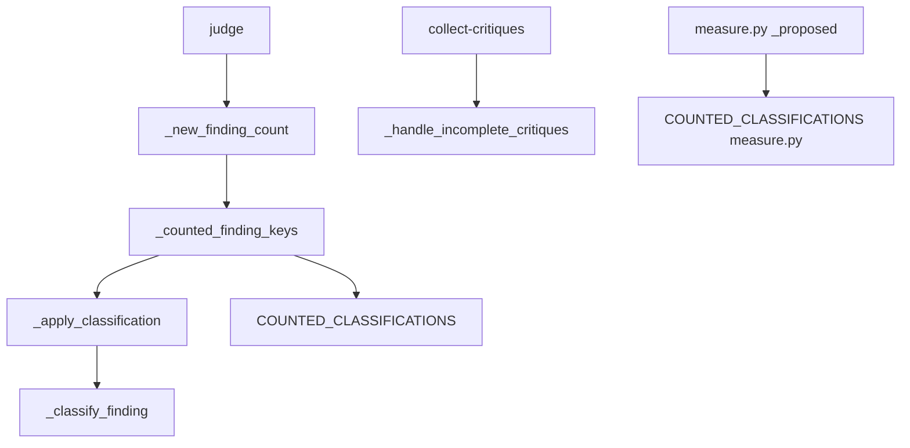
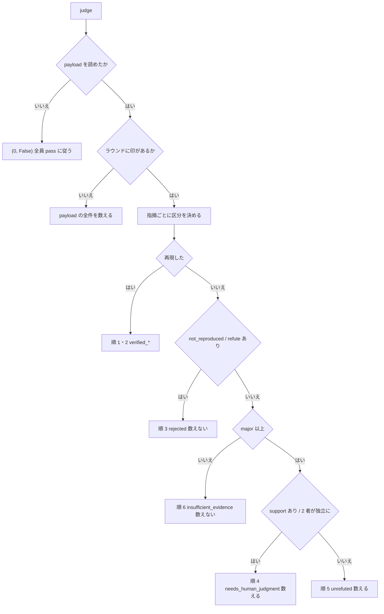

# #732 / #624 / #706: 「数えない」区分を棄却に限り、未反証の `major` を数える

要求と受け入れ条件は [issue-732-624-706-requirements.md](issue-732-624-706-requirements.md) にある。この文書は「どう作るか」だけを扱う。

**この文書は既存の設計 [issue-624-478-648-design.md](issue-624-478-648-design.md) の P4（決定 2〜5）を置き換える。** 引き継ぐ決定と改める決定は「既存の設計との対応」にある。P5（決定 6〜19）は #727 の設計が持つ。

## 機能一覧

| # | 機能 | 誰が使うか |
| --- | --- | --- |
| F1 | 誤りを示されていない `major` を、反証の有無・担当の数・根拠の項目の有無によらず新しい指摘として数える | 1 者で回す利用者（#624）、担当が起動し直されたループ（#583 の収束の部分）、実行検証も支持も無い指摘が出た Pull Request（#706） |
| F2 | 数えた指摘に「なぜ独立に確かめられていないか」の理由を残す | 修正の担当（何が確かめられていないかを読む）、収束の後に記録を読む人 |
| F3 | 反証が揃わなかったラウンドを、全件を数える扱いへ戻す | 収束ループ全般 |
| F4 | 効果の測定の方式 `proposed` が、数える 3 区分を採る | 収束の記録を測る人 |

## 決定の記録

決定 1 は文書の形、決定 2〜6 は区分、決定 7 は測定、決定 8 は印、決定 9〜11 はプロンプト・判定の出口・確定仕様を扱う。

### 決定 1: 設計文書は親 #732 の名前で新設し、既存の設計文書の本体は書き換えない

既存の設計は 3 課題・2 本の Pull Request を 1 つの文書で扱い、P5（決定 6〜19）は #727 の設計が並行して置き換える。P4 の節をその場で書き換えると、P5 の変更と 1 つのファイルで競合し、承認する人が「どの束が何を変えたか」を読み分けられない。親 #732 は根本原因を「1 つの区分が 2 つの意味を兼ねる」と定め直しており、既存の決定 2〜4（区分の名前を増やさず、順 4 に条件を足す）の前提を変える。**新設して対応表で指せば、変わった決定だけが差分に載る。**

既存の設計文書の本体（`-design.md`）には案内の 1 行も足さない。設計 Pull Request の本文の「決めたこと」は、変更したファイルの `## 決定の記録` の見出しをすべて写す。1 行でも触ると、既存の 19 件の決定がこの Pull Request の決定として並ぶ。案内は `## 決定の記録` を持たない要求の文書と契約の文書にだけ足す（#729 の設計と同じ形）。

### 決定 2: 数えない判断を棄却と `minor` 以下に限り、誤りを示されていない `major` を新しい区分 `unrefuted` として数える

区分の順 5（`insufficient_evidence`）には、いま 7 つの形が落ちる（「実測」の A〜F・H）。そのうち `minor` 以下（C）を除く 6 つは、いずれも「誰も誤りを示していない `major`」である。反証する担当がいない（A・B・H）、相手が `insufficient_evidence` / `out_of_scope` を返した（D・E）、根拠の 2 項目を欠く（B・F・H）のどれも、指摘が誤りだという主張ではない。**数えないのは、指摘が誤りだと示された `rejected` と、`APPROVE` を妨げない `minor` 以下だけにする。** 誤りを示されていない `major` は `unrefuted` として数え、修正の工程へ渡す。修正の担当が直す・却下の理由を返す・範囲外として起票するのは `needs_human_judgment` と同じである。

数えることで増えるラウンドは、指摘 1 件につき最大 1 回である。修正の工程が却下の理由を `rejected_findings` へ残し、次のラウンドのレビュープロンプトへ渡すため、同じ論点は戻らない。戻っても新規性の一致（位置・近傍・本文）が前のラウンドの指摘と結び、新規に数えない。#156 が避けた「同じ論点で 5 ラウンド」（#69）は、却下の記録が無かった頃の形である。

採らない案と理由:

- **順 4 の条件に「`critiques` が空」を足す（既存の設計の決定 3）。** A と H は数えられるが、D・E（反証の機会があって支持されなかった）と B・F（根拠を欠く）は落ちたままである。親 #732 の完了条件「数えない判断が棄却された指摘に限られ」に当たらない
- **反証が 0 件のラウンドは絞り込まない（#624 の候補 1）。** ラウンド単位では、2 者のうち 1 件だけが後から入った #583 の形と、2 者で相手が `insufficient_evidence` を返した #706 の形を塞げない
- **誤りを示されていない `major` を全件 `needs_human_judgment` に入れる。** 数え方は同じになるが、「独立に確かめた担当がいる」と「誰も確かめていない」が同じ名前になり、修正の担当と測定がその差を読めない。親 #732 は別の区分にすることを採る手としている

### 決定 3: 順 4（`needs_human_judgment`）の条件から根拠の 2 項目を外す

根拠の 2 項目（`evidence` / `falsification`）は、別の担当がその指摘を確かめるための入力である。別の担当が `support` を返した、または 2 者以上が同じ指摘へ独立に到達した時点で、確かめる目的は果たされている。その後で 2 項目の欠けを理由に落とすと、「2 人が見て同じことを言っている」情報が判定に効かない（#706 の PR #45 で `support` の付いた 2 件が落ちた形）。**順 4 は `major` 以上で、`support` が 1 件以上または `origin_runtimes` が 2 者以上**とする。

`has_evidence` の値そのものは変えずに残す。反証のプロンプトが読み、測定と記録がそのことを持つ。**区分が読まなくなるだけである。** 4 項目を持たない指摘を捨てないという既存の決定（`docs/06` の「4 項目を持たない指摘」）は、この変更で「捨てず、数える」まで進む。

採らない案: **根拠を欠く指摘は `unrefuted` に入れ、`needs_human_judgment` には入れない。** 順 4 と順 5 の差が「独立に確かめたか」でなく「2 項目を書いたか」で決まり、`support` の意味が薄れる。

### 決定 4: 反証の担当が `insufficient_evidence` / `out_of_scope` だけを返した `major` も `unrefuted` として数える

反証の値 `insufficient_evidence` は「可能性はあるが立証できない」で、`out_of_scope` は「この Pull Request の範囲から外れる」である。どちらも指摘が誤りだという主張ではなく、規約も「`refute` の代わりに使わせない」と定めている。誤りを示せない指摘を数えずに収束させると、未解決の `major` が残ったまま `approved` になる（#706 の観測そのもの）。**担当 2 者で相手が支持しなかった `major` を数えないという #156 の判断を改める。** #624 は「#156 の設計どおりで対象外」と書いたが、親 #732 の採る手と完了条件はこの形も棄却ではない側に置く。

この変更で、反証の担当が指摘を数から落とす手段は `refute` だけになる。プロンプトにそのことを書く（決定 9）。

採らない案: **`insufficient_evidence` を返された `major` は数えないまま残す（#156 の判断を保つ）。** 立証できない指摘と反証する担当がいない指摘を、状態ファイルから区別することはできる（`critiques` の有無）。しかし区別して前者だけを落とすと、実行検証を持たない Pull Request（文書だけの変更）では、担当が確かめられなかった `major` がすべて落ちる。#706 の PR #45 は文書の Pull Request である。

### 決定 5: `unrefuted` の理由を `unrefuted_reason`（`no_critique` / `not_supported`）として残す

`rejected` が `rejection_reason` を持つのと同じ形で、`unrefuted` が「なぜ独立に確かめられていないか」を持つ。値は 2 つで、`no_critique`（反証を返した担当が 0 者）と `not_supported`（反証はあるが `support` も `refute` も無い）である。修正の担当は、`no_critique` なら誰も見ていない指摘、`not_supported` なら相手が確かめられなかった指摘として読める。測定は、1 者のループと 2 者のループでどちらの理由が多いかを同じ記録から読める。

根拠の 2 項目の欠けは理由に入れない。`has_evidence` が既に持つ値で、理由と直交する（`no_critique` かつ根拠なし、のように組になる）。

採らない案: **理由を持たず、`critiques` の有無から読む。** 読めはするが、`rejection_reason` と対になる形が崩れ、状態ファイルを読む人が区分ごとに違う導き方を覚えることになる。

### 決定 6: `insufficient_evidence` の名前は残し、`minor` 以下の残余だけに当てる

`major` の 4 つの形が `unrefuted` へ移った後、順 6（旧 5）に残るのは「再現も棄却もされていない `minor` 以下」だけである。名前を `not_blocking` などへ変えると、付け替える先が 3 つ同時に出る。旧い状態ファイルの `classification`、`measure.py` の読み方、`docs/04` / `docs/06` / 確定仕様の語彙である。**意味は「立証されておらず、修正必須でもない」に狭まるが、名前は変えない。** 区分の表の条件の列で意味を定める。

採らない案: **`insufficient_evidence` を `not_blocking` へ改名する。** 語彙が正確になるが、この変更の目的（数えない判断を棄却に限る）に要らない。改名は測定の比較（変更の前後の記録）を難しくする。

### 決定 7: `measure.py` の `proposed` は数える 3 区分に揃え、2 か所の集合の一致をテストで固定する

方式 `proposed` は「この変更の方式が採る指摘」で、定義は `state.py` の `COUNTED_CLASSIFICATIONS` と同じ集合である（`measure.py` のコメントが明記する）。`state.py` だけに `unrefuted` を足すと、収束の判定が数えた指摘を測定が採らず、`proposed` の再現率が実際より低く出る。**両方の定数を `("verified_blocking", "needs_human_judgment", "unrefuted")` にし、`test_measure.py` に 2 つの値が等しいことを見るテストを足す。**

`measure.py` が `state.py` を import する形は採らない。`measure.py` は状態ファイルを読むだけの独立したスクリプトで（確定仕様の決定「測定は独立したスクリプトにする」）、`state.py` を読み込むと `gh` を呼ぶ側の前提を持ち込む。

### 決定 8: 反証が揃わない取り込みでは、先に付いていた印を外す

既存の設計の決定 5 をそのまま引き継ぐ。`collect-critiques` は揃わないとき印を付けないが、既に付いている印は外さない。取り直しの後も `evidence_rounds` にそのラウンドが残ると、「印を付けないため、このラウンドは全件を数えます」の出力と実際の数え方が食い違う。`_handle_incomplete_critiques` の先頭でそのラウンドの番号を `evidence_rounds` から除く。

決定 2 の後もこの決定は要る。印の無いラウンドは `rejected` と `minor` も数えるため、反証が揃っていない（`refute` が届いていないかもしれない）ラウンドでは、全件を数える側が安全である。

### 決定 9: 反証のプロンプトに「`insufficient_evidence` は指摘を数から落とさない」を書く

決定 4 の後、反証の担当が指摘を数から落とす手段は `refute` だけになる。プロンプトがそのことを言わないと、担当は従来どおり「判断できないものは `insufficient_evidence`」と返す。誤りを示せる指摘まで `insufficient_evidence` に流れ、修正の工程へ渡る。`critique.sh` の「返す値」の表の下に 1 段落を足す。書くのは 2 つで、`insufficient_evidence` を返しても指摘は数から落ちず修正の工程へ渡ることと、誤りを示せるなら理由を添えて `refute` を返すことである。

反証の値の語彙（5 つ）は変えない。変えるのは説明だけである。

### 決定 10: `judge` の本体・終了コード・出力の変数は変えず、区分の内訳を新しい出力として足さない

#729（G3）の設計が `judge` の終了コード 0 / 2 / 7 / 8 と出力の変数を境界として固定している。この変更が触るのは `_new_finding_count` から下（`_counted_finding_keys` / `_apply_classification` / `_classify_finding`）と `_handle_incomplete_critiques` で、`cmd_judge` の行は書き換えない。区分ごとの件数を `judge` の標準出力へ足す案は採らない。骨組み（`SKILL.md`）が読まない値を足しても読む側が無く、出力の契約（`docs/04`）を増やすだけである。件数は状態ファイルの `classification` から読める。

### 決定 11: 確定仕様の区分の表は実装 Pull Request の同じ差分で更新する

確定仕様 `docs/specifications/cross-review-evidence-based.md` は区分の表・区分ごとの行き先・収束の判定の表を持つ。「数えるのは 2 区分だけ」を決定としても書いている。`plan-to-spec` の工程まで待つと、実装が配布されてから確定仕様が古いまま残る期間ができ、`check-doc-staleness.py` がそれを拾わない（確定仕様は検査の対象外である）。**区分の表・行き先の表・決定の表・テスト観点の行を、実装の差分と同じ Pull Request で直す。** 経緯の節（背景・関連リンク）は `plan-to-spec` が足す。

## 実測

`develop` 9eaebe14、Python 3.14.4。`_classify_finding` に最小の指摘を渡した結果である（実行検証は `not_run`、担当 1 者の指摘は `origin_runtimes` 1 者）。

| 記号 | 入力 | いまの区分 | 数える | 変更後の区分 | 数える |
| --- | --- | --- | --- | --- | --- |
| A | `major`、根拠あり、反証なし（1 者） | `insufficient_evidence` | いいえ | `unrefuted`（`no_critique`） | **はい** |
| B | `major`、根拠なし、反証なし | `insufficient_evidence` | いいえ | `unrefuted`（`no_critique`） | **はい** |
| C | `minor`、根拠あり、反証なし | `insufficient_evidence` | いいえ | `insufficient_evidence` | いいえ |
| D | `major`、根拠あり、相手が `insufficient_evidence` | `insufficient_evidence` | いいえ | `unrefuted`（`not_supported`） | **はい** |
| E | `major`、根拠あり、相手が `out_of_scope` | `insufficient_evidence` | いいえ | `unrefuted`（`not_supported`） | **はい** |
| F | `major`、根拠なし、相手が `support` | `insufficient_evidence` | いいえ | `needs_human_judgment` | **はい** |
| G | `major`、根拠あり、相手が `support` | `needs_human_judgment` | はい | `needs_human_judgment` | はい |
| H | `major`、根拠なし、2 者が独立に出した | `insufficient_evidence` | いいえ | `needs_human_judgment` | **はい** |
| I | `major`、相手が `refute` | `rejected` | いいえ | `rejected` | いいえ |
| J | `major`、`not_reproduced` | `rejected` | いいえ | `rejected` | いいえ |
| K | `major`、`reproduced` | `verified_blocking` | はい | `verified_blocking` | はい |

11 件のうち、数え方が変わるのは A・B・D・E・F・H の 6 件で、いずれも `major` である。`minor`（C）と棄却（I・J）と再現（K）と支持つき根拠あり（G）の 5 件は変わらない。

## 構成要素

| 要素 | 責務 | 変える・新設 |
| --- | --- | --- |
| 区分の判定（`_classify_finding`） | 6 つの区分を上から順に当てる。順 4 から根拠の条件を外し、順 5 に `unrefuted`（`major` 以上の残余）を置く（決定 2・3・4） | 変える |
| 区分の書き込み（`_apply_classification`） | 区分を要素へ書く。`rejected` に `rejection_reason`、`unrefuted` に `unrefuted_reason` を残し、他の区分では両方を消す（決定 5） | 変える |
| 数える集合（`COUNTED_CLASSIFICATIONS`。`state.py` と `measure.py`） | `unrefuted` を足した 3 つにする（決定 2・7） | 変える |
| 反証の不足の扱い（`_handle_incomplete_critiques`） | 先頭でそのラウンドの印を外してから、取り直す担当を返す（決定 8） | 変える |
| 反証のプロンプト（`critique.sh`） | `insufficient_evidence` が指摘を数から落とさないことを書く（決定 9） | 変える |
| 規約と契約（`docs/04` / `docs/05` / `docs/06`） | 6 区分・数える 3 つ・1 者と起動し直しの数え方・印を外すことを書く | 変える |
| 確定仕様（`docs/specifications/cross-review-evidence-based.md`） | 区分の表・行き先の表・決定の表・テスト観点を揃える（決定 11） | 変える |
| テスト（`test_classify_findings.py` / `test_critiques.py` / `test_measure.py` / `test_skill_layout.py`） | 実測の A〜K と AC10〜AC13、集合の一致、文書の語を固定する | 変える |



図の辺は呼び出しと参照を表す。`judge` と `collect-critiques` と `measure.py` は、変える要素の呼び出し元として置いた既存の要素である。プロンプト・規約・確定仕様・テストは呼び出しを持たないため図に含めない。

**文脈と配置は変わらない。** 動くのは、ホストの CLI から起動される `state.py` の 1 プロセスと、状態ファイルを読む `measure.py` の 1 プロセスである。外部との出入り（`gh`）は変わらない。

### 置き場所

```text
plugins/ndf/skills/cross-review/
├── SKILL.md                          # 変えない（`--only` の説明は #727 が持つ）
├── docs/04-contracts.md              # classification の項を 6 区分・数える 3 つへ
├── docs/05-pool-and-convergence.md   # 終了基準に 1 者と起動し直しの数え方を足す
├── docs/06-evidence.md               # 区分の表を 6 行へ、印を外すことを書く
├── scripts/
│   ├── critique.sh                   # 返す値の表の下に 1 段落を足す
│   ├── measure.py                    # COUNTED_CLASSIFICATIONS に unrefuted を足す
│   └── state.py                      # _classify_finding / _apply_classification / COUNTED_CLASSIFICATIONS / _handle_incomplete_critiques
└── tests/
    ├── test_classify_findings.py     # A〜K、AC10、期待値を変える 3 件
    ├── test_critiques.py             # AC13（印を外す）
    ├── test_measure.py               # AC11（一致）・AC12（proposed）
    └── test_skill_layout.py          # AC18〜AC20 の grep
docs/specifications/cross-review-evidence-based.md   # 区分・行き先・決定・テスト観点
```

`dev.kiro` / `dev.agy` は `skills/` を symlink で参照するため、書き写す配布物は無い。

## データ構造

状態ファイル `cross-review-pr<番号>-state.json` の `review_findings[]` の要素で変わるのは 2 項目である。**新しい最上位の項目は無く、`version` の類は持たないため上げない。**

| 項目 | 型 | 空を許すか | 変更 |
| --- | --- | --- | --- |
| `classification` | 文字列 | 許さない（区分の後） | 値の集合が 6 つになる。`verified_blocking` / `verified_non_blocking` / `rejected` / `needs_human_judgment` / **`unrefuted`** / `insufficient_evidence` |
| `unrefuted_reason` | 文字列 | 項目が無いことを許す | **新設。** `classification` が `unrefuted` のときだけ持つ。値は `no_critique` / `not_supported`。区分が変わると消える（`rejection_reason` と同じ扱い） |
| `rejection_reason` | 文字列 | 項目が無いことを許す | 変わらない。`rejected` のときだけ持つ |
| `has_evidence` | 真偽値 | 許さない | 変わらない。**区分の条件から外れるが、値は残る** |

### 区分の条件（`_classify_finding`）

| 順 | 区分 | 条件 | 数える | 理由の項目 |
| --- | --- | --- | --- | --- |
| 1 | `verified_blocking` | 再現した、かつ `major` 以上 | はい | — |
| 2 | `verified_non_blocking` | 再現した、かつ `minor` 以下 | いいえ | — |
| 3 | `rejected` | 再現しなかった、または `refute` が 1 件以上 | いいえ | `rejection_reason` |
| 4 | `needs_human_judgment` | `major` 以上で、`support` が 1 件以上または `origin_runtimes` が 2 者以上 | はい | — |
| 5 | `unrefuted` | `major` 以上（上のいずれにも当たらない） | はい | `unrefuted_reason` |
| 6 | `insufficient_evidence` | 上のいずれにも当たらない（`minor` 以下） | いいえ | — |

`unrefuted_reason` は `critiques` が空なら `no_critique`、1 件以上あれば `not_supported` である。`critiques` は提案者以外の値だけを持つため、空は「反証を返した担当が 0 者」を表す。

### 機能とデータの対応

| 機能 | 読む | 書く |
| --- | --- | --- |
| F1 数える | `severity` / `verification.result` / `critiques[].verdict` / `origin_runtimes` | `classification` |
| F2 理由を残す | `critiques` の有無 | `unrefuted_reason`（他の区分では消す） |
| F3 印を戻す | `evidence_rounds` / `rounds[].critique_relaunched` | `evidence_rounds`（番号を除く） |
| F4 測る | `classification` / `evidence_rounds` / `merged_into` | （測定の出力。状態ファイルは書かない） |

### 移行

この変更より前の状態ファイルは、次に `judge` か `collect-critiques` を呼んだ時点で `classification` が付け直される。区分は保存された値を読まず、毎回 `_apply_classification` が計算する。`unrefuted_reason` はそのときに付く。`measure.py` は保存された `classification` を読むため、収束の終わった旧い記録は旧い値のまま測られ、`unrefuted` は出ない。

## 入出力の契約

**`state.py` の引数・終了コード・標準出力の変数は変わらない。** 変わるのは内部関数の契約だけである。

| 関数 | 変更前 | 変更後 |
| --- | --- | --- |
| `_classify_finding(finding) -> str` | 5 つの値を返す。順 4 に `has_evidence` を求める | 6 つの値を返す。順 4 から `has_evidence` を外し、順 5 に `unrefuted` を置く。**純粋な関数で、出力も終了コードも持たない**（変わらない） |
| `_apply_classification(finding) -> str` | `rejected` に `rejection_reason` を書き、他では消す | 加えて `unrefuted` に `unrefuted_reason` を書き、他では消す |
| `COUNTED_CLASSIFICATIONS`（`state.py` / `measure.py`） | `("verified_blocking", "needs_human_judgment")` | `("verified_blocking", "needs_human_judgment", "unrefuted")`。2 か所の値は等しい |
| `_handle_incomplete_critiques(pr, st, round_no, missing)` | 印を付けない。既にある印は残す。終了コード 7 と `CRITIQUE_RETRY_AGENTS` を返す（変わらない） | 先頭で `evidence_rounds` からそのラウンドの番号を除く。それ以外は変わらない |
| `_new_finding_count(st, pr) -> (int, bool)` | 印のあるラウンドを 2 区分へ絞る | 印のあるラウンドを 3 区分へ絞る。返る値の意味は変わらない |
| `cmd_judge` | 0 / 2 / 7 / 8 / 1 | 変わらない。本体の行を書き換えない |
| `critique.sh` のプロンプト | 「判断できないものは `insufficient_evidence` にする」 | 加えて「`insufficient_evidence` を返しても指摘は数から落ちず、修正の工程へ渡る。誤りを示せるなら理由を添えて `refute`」 |

## 処理の流れ



順 5 に入った指摘は `critiques` の有無で `unrefuted_reason` が決まる。反証の取り込みで揃わないとき、`_handle_incomplete_critiques` がそのラウンドの印を外す。次に `judge` が数えるとき「印があるか」が「いいえ」へ進み、取り直して揃えば `_mark_evidence_round` が印を戻す。

**1 者で回したラウンドの収束は、`unrefuted` の新規性と `round_passes` の 2 つで決まる。** 担当が `APPROVE` か重大な指摘の無い `COMMENT` を返せば `round_passes` で収束する。`REQUEST_CHANGES` なら `unrefuted` の `major` が新規に数えられ、修正の工程へ進む。修正の後のラウンドで同じ指摘が戻れば前のラウンドと一致して新規 0 件になり、戻らなければ `APPROVE` で収束する。

## 非機能の実現方式

| 大項目 | 実現方式 |
| --- | --- |
| 運用・保守性 | 数える集合の 2 か所は `test_measure.py` の一致のテストが固定する。区分の理由は `rejection_reason` / `unrefuted_reason` として状態ファイルに残る |
| 移行性 | 区分は毎回計算し直すため、旧い状態ファイルの移行の処理は書かない。`version` は上げない |

## テスト設計

置き場所は `plugins/ndf/skills/cross-review/tests/` の下である。

| 受け入れ条件 | 何で確かめるか | 置き場所 |
| --- | --- | --- |
| AC1・AC3 | 担当 1 者・印付きの状態ファイルを組み、`_new_finding_count` と `cmd_judge` の終了コードを見る（実測の A・C） | `test_classify_findings.py` |
| AC2 | A の指摘の `has_evidence` を偽にして同じ組を見る（実測の B） | 同上 |
| AC4 | `agy` + `kiro` で、`kiro` の指摘に反証が付き `agy` の指摘に付かない状態ファイル | 同上 |
| AC5・AC6 | `_classify_finding` に反証 `insufficient_evidence` / `out_of_scope` 付きの `major` を渡す（実測の D・E） | 同上 |
| AC7・AC8 | `has_evidence` 偽で `support` 付き、`has_evidence` 偽で `origin_runtimes` 2 者（実測の F・H） | 同上 |
| AC9 | 実測の I・J・K を既存のテストで確かめる（期待値を変えない） | 同上（既存） |
| AC10 | `_apply_classification` の後の `unrefuted_reason` の値と、区分が変わったときに消えること | 同上 |
| AC11 | `state_mod.COUNTED_CLASSIFICATIONS == measure_mod.COUNTED_CLASSIFICATIONS` と、3 つの値 | `test_measure.py` |
| AC12 | 印のあるラウンドの `unrefuted` を `proposed` の `found` が数える | 同上（既存の `test_proposed_takes_only_the_two_counted_classifications` を 3 区分へ改める） |
| AC13 | 印の付いた状態で `cmd_collect_critiques` を 2 回呼び、`evidence_rounds` と数え方を見る | `test_critiques.py` |
| AC14・AC15 | 既存のテスト（`minor` の区分、印なしの数え方）を期待値を変えずに通す | 既存のまま |
| AC16 | 3 件のテストの期待値を新しい区分へ改め、他は変えない | `test_classify_findings.py` |
| AC17 | `cmd_judge` の既存のテストを期待値を変えずに通す。差分に `cmd_judge` の行が無いことをレビューで見る | 既存のまま・設計 Pull Request のレビュー |
| AC18〜AC20 | 文書の語を `grep` するテスト | `test_skill_layout.py` |
| AC21・AC22 | コマンドの終了コード | 継続的統合と手元 |

## 未確認のまま残ること

| 項目 | 内容 | いつ決まるか |
| --- | --- | --- |
| 収束までのラウンド数の増え方 | 実測の D・E（相手が `insufficient_evidence` を返した `major`）を数えることで、2 者のループのラウンド数がどれだけ増えるかは測っていない | 配布後の運用で `measure.py` の出力を見る |
| `unrefuted` が多いときの修正の担当の負荷 | 誰も確かめていない `major` が修正の工程へ渡る件数が増える。却下の理由を書く回数が増える | 同上 |
| 担当を 3 者以上へ広げたときの順 3 と順 4 | 確定仕様が「広げるときに決め直す」としている。この変更は 2 者のまま | #478 の後 |
| `insufficient_evidence` の改名 | 決定 6 で残す。意味が狭まった名前をいつ付け替えるかは未決 | 要求が出たとき |
| テストの置き場所 | テスト設計の表の置き場所は既存ファイルに合わせた目安である | **実装で決める** |
| プロンプトの文言 | 決定 9 の段落は、含める 2 つの内容だけを決めた | **実装で決める** |

## 申し送り（並行する設計との境界）

| 相手 | 決めた契約 |
| --- | --- |
| #730（G5、#583） | **#583 の収束の部分はこの設計で塞がる。** 起動し直した担当の指摘は、取り込みの経路が証拠集約（`verify-findings` / `critique-round.sh`）を通っても通らなくても、反証を持たない `major` として `unrefuted` に入り数えられる。G5 が投稿を進行側へ移す設計を採っても、この判定は変わらない。G5 に残るのは投稿の重なりと、`JUDGE_RC -eq 7` の分岐が証拠集約を通らない点だけである |
| #729（G3） | `judge` の終了コード 0 / 2 / 7 / 8 と出力の変数を変えない。`cmd_judge` の本体の行を書き換えない（決定 10）。この設計が触る関数は `_new_finding_count` から下と `_handle_incomplete_critiques` で、G3 の `_read_review_result_file` と重ならない |
| #727（G1） | `--only` の意味づけ（使える者を 1 者へ絞る）と担当の決め方は G1 が持つ。1 者のときに何を数えるかはこの設計が持つ（処理の流れの最後の段落）。G1 の実装が 1 者で回す分岐を入れても、この設計が先に入っていれば #624 の誤った収束を踏まない。**既存の要求の文書と契約の文書に足す案内の段落は G1 も同じファイルへ足す可能性がある。** 節が違うため衝突は起きにくいが、起きたら後からマージする側が解く |
| #728（G4） | 触るファイルが重ならない（`refactor_lib` は区分を持たない） |

## 既存の設計との対応

既存の設計（PR #667、2026-09-15）の P4 の決定との対応である。P5 の決定 6〜19 は #727 の設計が持つ。

| 既存の決定 | この文書 | 扱い |
| --- | --- | --- |
| 決定 1（P4 / P5 に分け、P4 を先に出す） | — | 束の分け方は実行計画（G1 / G2）が引き継いだ。P4 が先という順序は保つ（G1 の 1 者で回す分岐が #624 を踏まないため） |
| 決定 2（数えない判断は「反証を受けた単独の指摘」だけに掛け、記録から導く） | 決定 2・4・5 | **改める。** 数えないのは棄却と `minor` 以下だけにし、反証を受けて支持されなかった `major` も数える。記録から導く（項目を足さない）方針は `unrefuted_reason` を足すことで改める |
| 決定 3（順 4 の `support` の条件だけを外し、根拠と重大度の条件は残す） | 決定 2・3 | **改める。** 根拠の条件を外し、支持も反証も無い `major` は別の区分へ入れる。重大度の条件（`minor` を数えない）は引き継ぐ |
| 決定 4（区分の名前を増やさない） | 決定 2・6・7 | **改める。** `unrefuted` を足す。増やさない理由だった 2 か所の集合と語彙の同期は、テストと同じ差分で受ける |
| 決定 5（反証が揃わない取り込みでは先に付いていた印を外す） | 決定 8 | 引き継ぐ |
