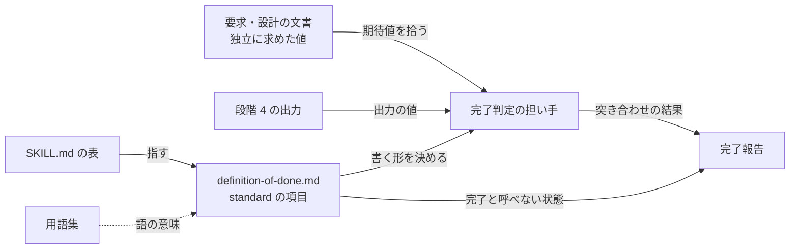
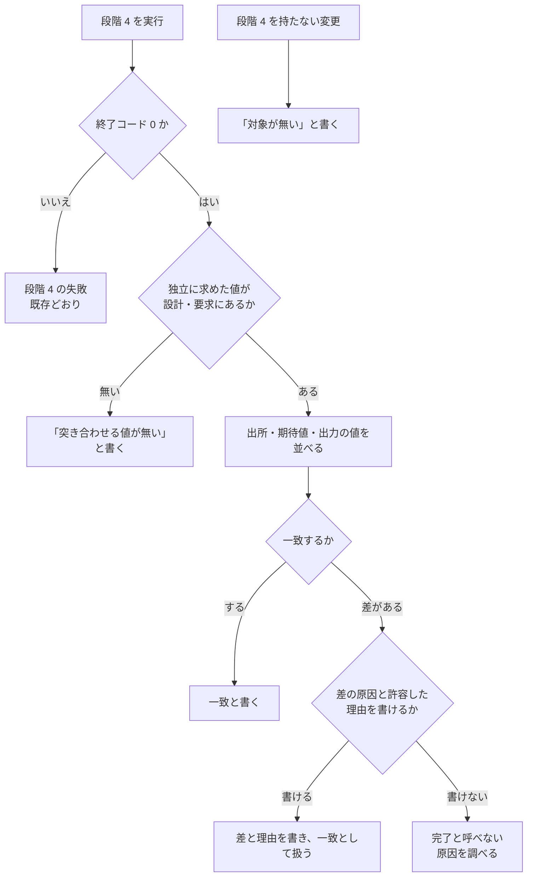

# quality-gates: 実データの結合確認が終了コード 0 だけで完了になり、設計で数えた件数・金額との食い違いを見逃す → standard の完了報告に、独立に求めた値との突き合わせの結果が必ず残る（#735）

## 目的

- **何が壊れているか**: `standard` の段階 4（結合・端から端まで）は終了コードを証跡に求めるだけで、出力が設計・要求の段階で別に数えた値と合うかを問わない
- **誰が困るか**: 実データを外部の系へ書き込む変更の担い手と承認する人。takemi-ohama/ideabase PR #56 は期待 37 件 / -172,155 円に対し出力 50 件 / -1,949,946 円のまま `exit=0` で通り、書き込みの直前まで不具合が残った
- **直すと何が成り立つか**: `standard` の完了報告に、段階 4 の出力と独立に求めた値の突き合わせの結果（または値が無いこと）が必ず書かれ、合わないまま完了と呼べなくなる

## 適用範囲

- **働く範囲**: NDF の `quality-gates` を使うすべてのリポジトリ（配布先を含む）。このリポジトリ固有の形は持たない
- **プロジェクトごとに違うもの**: 値の形（件数・金額・行数・割合）と出所。設定も引数も持たず、担い手が設計・要求の文書から拾う
- **当たるモード**: `standard` だけ。ほかの 4 モードの完了の定義は変えない

## あるべき姿の根拠

| 根拠 | 種類 | 何を示すか |
| --- | --- | --- |
| takemi-ohama/ideabase PR #56・#57 の事例（期待 37 件 / -172,155 円、出力 50 件 / -1,949,946 円。全月では 732 件 / 設計 535 件） | 実測 | 終了コードだけの結合確認では、設計で既に分かっていた数量の食い違いを見逃す |
| #735 の「提案」（「値の比較そのものは LLM が行う」「『突き合わせる値』と『突き合わせる値が無い』のどちらかを必ず書く」） | 利用者の指示の原文 | 比較をスクリプトにせず、空欄を許さない形にする |

要求と受け入れ条件は #735 の本文にある（コピーは [issue-735-requirements.md](issue-735-requirements.md)）。この文書は「どう作るか」だけを扱う。

## 例: 起票の事例を、変えた後の形で通すと

1. 設計の段階で、担い手が DB を直接数えて「対象月は 37 件 / -172,155 円」と設計文書に書く（E1）
2. 実装の後、段階 4 で実データ 1 か月分から変更計画を作る。終了コードは 0、出力は「変更 50 件 / -1,949,946 円」（E2）
3. 完了報告を書くとき、新しい項目が出所・期待値・出力の値・一致したかを求める。担い手は 37 件と 50 件、-172,155 円と -1,949,946 円を並べ、「一致しない」と書く（E3）
4. 差（13 件 / 1,777,791 円）に、端数の丸めや集計期間の境界のような許容した原因と理由が無いため、「完了と呼べない状態」に当たる。完了と呼ばず、原因（振替の行を未分類と読む不具合）を調べる（E4）

外部の系への書き込みは段階 4 の後に来るため、食い違いは書き込みの前に止まる。

## ドメインモデル

### コンテキスト

| コンテキスト | 何の語が 1 つの意味に決まるか |
| --- | --- |
| NDF の開発ワークフロー（`ndf-workflow`） | 完了判定・完了の定義・証跡・段階 4・独立に求めた値 |

1 つのコンテキストに収まる。

### 集約

| 集約 | 持ち主（書き換えてよいもの） | 根 | エンティティ | 値オブジェクト |
| --- | --- | --- | --- | --- |
| `standard` の完了の定義 | `quality-gates` の `references/definition-of-done.md`（`SKILL.md` の表は要約を持つだけ） | `standard` のチェックリスト | チェックリストの項目・完了と呼べない状態の行 | — |
| 完了報告 | 完了判定の担い手（LLM） | 1 つの変更の完了報告 | 段階ごとの証跡の行 | 独立に求めた値との突き合わせの結果（出所・期待値・出力の値・一致したか） |

### 不変条件

| # | 集約 | 条件 | 破れたときの扱い |
| --- | --- | --- | --- |
| I1 | 完了報告 | 突き合わせの項目は、(1) 出所・期待値・出力の値・一致したか、(2) 「突き合わせる値が無い」、(3) 段階 4 を持たないときの「対象が無い」のどれか 1 つを持つ。空欄にしない | チェックリストの項目を満たさない。完了と呼ばない |
| I2 | 完了報告 | 一致しないと書いた値があり、差の原因と許容した理由が書かれていないなら、完了と呼ばない | 「完了と呼べない状態」に当たる。原因を調べる |
| I3 | 完了報告 | 独立に求めた値は、段階 4 で動かすコードを通さずに求めた値に限る。出力から逆算した値を期待値にしない | 突き合わせたことにならない。「突き合わせる値が無い」と書く |
| I4 | `standard` の完了の定義 | 新しい項目は設計との突き合わせ (a)(b)(c) の外に置き、(a)(b)(c) と `design-match.md` の手順を変えない | 設計との突き合わせの語の意味（3 つからなる）と食い違う |

### ドメインイベント

| # | イベント | 発生元 | 受け手 |
| --- | --- | --- | --- |
| E1 | 設計・要求の段階で、対象の数量を独立に求めた | 設計・要求の担い手 | 完了判定の担い手（設計・要求の文書を読んで期待値を拾う） |
| E2 | 実データに対する結合確認を実行した | 完了判定の担い手（段階 4） | 同じ担い手の突き合わせ（終了コードが 0 でなければ既存どおり段階 4 の失敗で、E3 へ進まない） |
| E3 | 結合確認の出力を独立に求めた値と突き合わせた | 完了判定の担い手 | 完了報告（一致しなければ I2） |
| E4 | 突き合わせの結果（または値が無いこと）を証跡に書いた | 完了判定の担い手 | 承認ゲート 2 で完了報告を読む人・`cross-review` のレビュワー |

### 用語

| 用語 | 意味 | 用語集への反映 |
| --- | --- | --- |
| 独立に求めた値 | 段階 4 で動かすコードを通さずに、設計・要求の段階で求めた件数・金額・行数などの値。出力から逆算した値は当たらない | 追加（`ndf-workflow`） |
| 独立に求めた値との突き合わせ | `standard` の完了判定で、段階 4 の出力を独立に求めた値と比べ、出所・期待値・出力の値・一致したかを証跡に残すこと。値が無ければ「突き合わせる値が無い」と書く。設計との突き合わせ (a)(b)(c) には含めない | 追加（`ndf-workflow`） |

## 機能一覧

| # | 機能 | 誰が使うか |
| --- | --- | --- |
| F1 | `standard` のチェックリストで、段階 4 の出力と独立に求めた値の突き合わせを求める | 完了判定の担い手 |
| F2 | 突き合わせが合わないまま完了と呼べないことを示す | 完了判定の担い手・承認する人・レビュワー |
| F3 | `SKILL.md` の表で、`standard` の追加で要るものに突き合わせを示す | `quality-gates` を最初に読む担い手 |

## 構成要素

| 要素 | 変更 | 責務 |
| --- | --- | --- |
| `plugins/ndf/skills/quality-gates/references/definition-of-done.md` の「`standard`」のチェックリスト | 変更 | 「結合テストが通る」の直後に項目を 1 つ足す（F1。文面は下の「変更後の文面」） |
| 同じ節の説明の段落 | 変更 | 独立に求めた値の定義・担い手が比べること・許容する差の書き方を 1 段落足す。「対象を持たない項目」の段落に、段階 4 を持たない変更ではこの項目も対象が無いと書くことを足す（F1） |
| 同じ文書の「完了と呼べない状態」 | 変更 | 合わないまま残る状態を 1 行足す（F2） |
| `plugins/ndf/skills/quality-gates/SKILL.md` の「モード別の完了の定義」の表 | 変更 | `standard` の「追加で要るもの」に「独立に求めた値との突き合わせ」を足す（F3） |
| `docs/glossary/glossary.json` と `docs/glossary.md` | 変更 | 用語の表の 2 語を足し、`glossary.py render` で文書を作り直す |

`scripts/build-runtime-plugins.sh` の生成物に `quality-gates` の写しがあれば同期する（`plugins/ndf/skills/` の 1 か所が実体のため、写しは持たない見込み）。



### 変更後の文面

`definition-of-done.md` の「`standard`」のチェックリストの、「結合テストが通る」の直後:

```markdown
- [ ] 結合テストが通る（DB・外部通信を含む経路）
- [ ] 段階 4 の出力を、設計・要求で独立に求めた値（件数・金額・行数など）と突き合わせた。値の出所・期待値・出力の値・一致したかを書くか、「突き合わせる値が無い」と書く
```

同じ節の、設計との突き合わせの段落の後:

```markdown
**独立に求めた値は、段階 4 で動かすコードを通さずに求めた値である。** 設計の段階で DB を直接数えた
件数や合計、要求に書いた期待件数が当たる。出力から逆算した値は当たらない。比べるのは担い手で、
設計・要求の文書から値を拾い、出力と並べる。差があるときは、差の原因（端数の丸め・集計期間の
境界など）と許容した理由を書いたときだけ一致として扱う。
```

「対象を持たない項目は」の段落の末尾に 1 文:

```markdown
段階 4 を持たない変更では、突き合わせの項目も「対象が無い」と書く。段階 4 を実行したが独立に
求めた値が無いときは「突き合わせる値が無い」と書き、2 つを書き分ける。
```

「完了と呼べない状態」の末尾:

```markdown
- 段階 4 の出力が独立に求めた値と合わず、差の原因と許容した理由が書かれていない（`standard`）
```

`SKILL.md` の表の `standard` の行:

```markdown
| `standard` | 1 → 2 → 3 → 4 | 受け入れ条件ごとの合否、契約・結合の結果、独立に求めた値との突き合わせ、移行手順の実行確認、設計との突き合わせ |
```

## 処理の流れ



## 決定の記録

### 決定 1: 設計との突き合わせの意味を保つため、新しい項目を (d) にせず「結合テストが通る」の直後に独立の項目として置く

突き合わせる相手は段階 4 の出力で、設計の文書と実装を照らす (a)(b)(c) とは対象が違う。(a)(b) は `design-match.py` が出し、手順は `design-match.md` が持つため、(d) にすると手順の無い 1 項目が混ざり、用語集の「(a)(b)(c) の 3 つからなる」とも食い違う。値の出所は要求の文書のこともあり、設計との突き合わせの範囲に収まらない。

「結合テストが通る」の行へ添える案は採らなかった。1 行に 2 つの判定（通ったか・合うか）が入り、片方だけ満たした状態を書き分けられない。

根拠: Value 7 / Value 8（MVV 版 2）

### 決定 2: 許す差を量で決めず、差の原因と許容した理由を書いたときだけ一致として扱う

値の形と許せる幅はプロジェクトごとに違い、共通の閾値は決められない。量の基準を置くと、事例の 13 件 / 1,777,791 円のような食い違いも「幅の中」と読める余地が残る。原因（端数の丸め・集計期間の境界）を名指しさせると、原因の書けない差は不具合として残る。例は 2 つにとどめ、括弧の中に置く。

例示しない案は採らなかった。何を書けば許容になるかが読めず、「差は小さい」のような量の言い分で通る。

根拠: Value 3 / Value 5（MVV 版 2）

### 決定 3: 比較をスクリプトにせず、担い手が設計・要求の文書から値を拾って比べる

値の出所（設計文書の表・要求の本文）と形（件数・金額・割合）が一定せず、決定論で抜き出せる共通の手順が無い。依頼の原文も「値の比較そのものは LLM が行う」と決めている。

`design-match.py` に比較を足す案は採らなかった。出所の形を決めない限り抜き出せず、形を決めると配布先のリポジトリの設計文書を縛る。

根拠: Value 4 / Value 5（MVV 版 2）

### 決定 4: 「対象が無い」と「突き合わせる値が無い」を書き分ける

段階 4 を持たない変更（結合の経路が無い）と、段階 4 を実行したが期待値が無い変更は、読み手が次にとる行動が違う。後者は、設計で値を数えていれば防げた食い違いを見逃している可能性がある。既存の「対象を持たない項目は、持たないことを書いて満たす」の規則に、この区別を 1 文で足す。

根拠: Value 7（MVV 版 2）

## テスト設計

文書の変更のため、新しい単体テストは書かない（`AGENTS.md` の DON'T「`.md` の文言を照合するテストを書く」）。受け入れ条件は節を読んで確かめ、全体テストとチェックスクリプトで退行が無いことを見る。

| 受け入れ条件・不変条件 | どの振る舞いで縛るか | どう壊したら落ちるべきか |
| --- | --- | --- |
| AC1 チェックリストに項目が 1 つある / I4 | 実装 PR のレビューで「`standard`」の節を読み、「結合テストが通る」の直後に 1 項目あり、(a)(b)(c) の外にあることを確かめる | 項目が無い・(d) として並ぶ・2 項目に割れると読んで落とす |
| AC2 書く内容が 2 つのどちらか / I1 | 項目の文面が「出所・期待値・出力の値・一致したか」か「突き合わせる値が無い」のどちらかを求めると読めるか | どちらかが欠ける・3 つ目の自由記述を許す文面なら落とす |
| AC3 対象を持たない項目の規則が効く / I1 | 「対象を持たない項目」の段落に、段階 4 を持たない変更での書き方が入っているか | 段落が結合テスト・契約・移行だけを挙げたままなら落とす |
| AC4 `SKILL.md` の表 | `standard` の「追加で要るもの」に突き合わせが入っているか | 入っていない・ほかのモードの行に入っているなら落とす |
| AC5 完了と呼べない状態 / I2 | 「完了と呼べない状態」に、合わずに理由も無い状態の行があるか | 行が無い・「差を書けば完了」と読める文面なら落とす |
| AC6 担い手が比べる・スクリプトを足さない | 差分にスクリプト・hook・`design-match.py` の変更が無く、説明の段落が「比べるのは担い手」と読めるか | `plugins/ndf/scripts/` か `hooks/` に差分があれば落とす |
| AC7 ほかのモードが変わらない | `git diff` で `light` / `operation` / `legacy-refactor` / `documentation` の節に差分が無いか | 4 節のどれかに差分があれば落とす |
| AC8 (a)(b)(c) と `design-match.md` が変わらない / I4 | `git diff` で (a)(b)(c) の 3 行と `design-match.md` に差分が無いか | 差分があれば落とす |
| AC9 起票の事例で「完了と呼べない」と判定される / I2 | 「例: 起票の事例を、変えた後の形で通すと」の 4 手順を、実装後の文面で読み直して同じ結論になるか | 37 件 / 50 件が許容の差として読める文面なら落とす |
| I3 独立に求めた値の定義 | 説明の段落が「段階 4 で動かすコードを通さずに求めた値」「出力から逆算した値は当たらない」を持つか | 出所を問わない文面なら落とす |
| 退行 | 全体テスト（`uv run --frozen --project . --all-extras pytest . -q -n 4`）・`check-skill-frontmatter.py`・`instructions-check.py --root .`・`claude plugin validate .`・`glossary.py check` の終了コードが 0 | どれかが 0 でなければ落とす |

## 設計の結果

| 課題 | 扱い | 取り込み先 | 触るファイル |
| --- | --- | --- | --- |
| #735 | 実装する | — | `plugins/ndf/skills/quality-gates/references/definition-of-done.md`、`plugins/ndf/skills/quality-gates/SKILL.md`、`docs/glossary/glossary.json`、`docs/glossary.md` |

## 未確認のまま残ること

| 項目 | 内容 |
| --- | --- |
| 実際の完了報告で書かれるか | 文書の変更で、担い手がこの項目を埋めるかは実装の時点では確かめられない。リリース後、次に `standard` で実データの結合確認を行う変更の完了報告で見る（要求の「検証手段」の手動確認） |
| 値を数えていない変更の扱い | 設計・要求で値を求める工程は足さない（要求の前提 5）。「突き合わせる値が無い」が続くなら、`design` / `requirements-design` へ値を求める工程を足すかを別の課題で決める |
| 生成物の写し | `scripts/build-runtime-plugins.sh` が `quality-gates` の写しを持つかは実装で走らせて確かめる |
