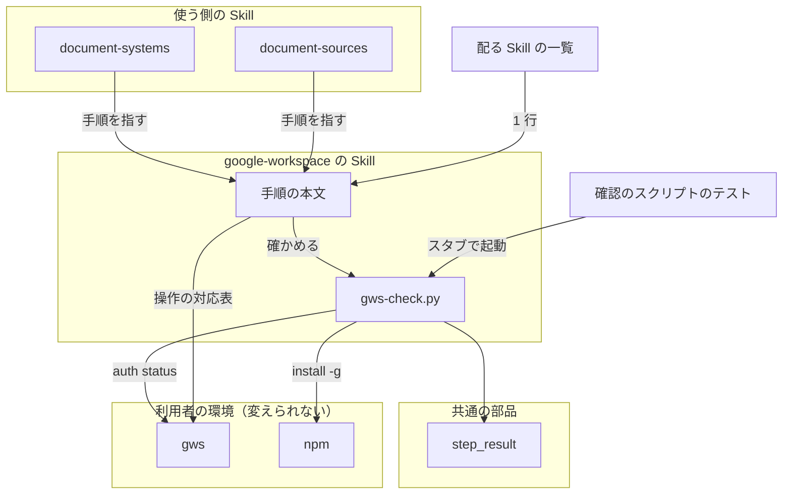
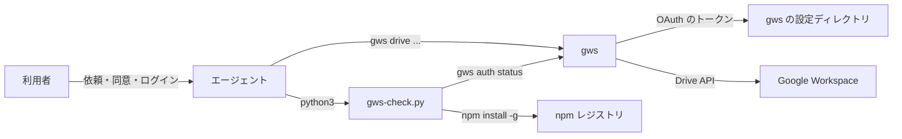
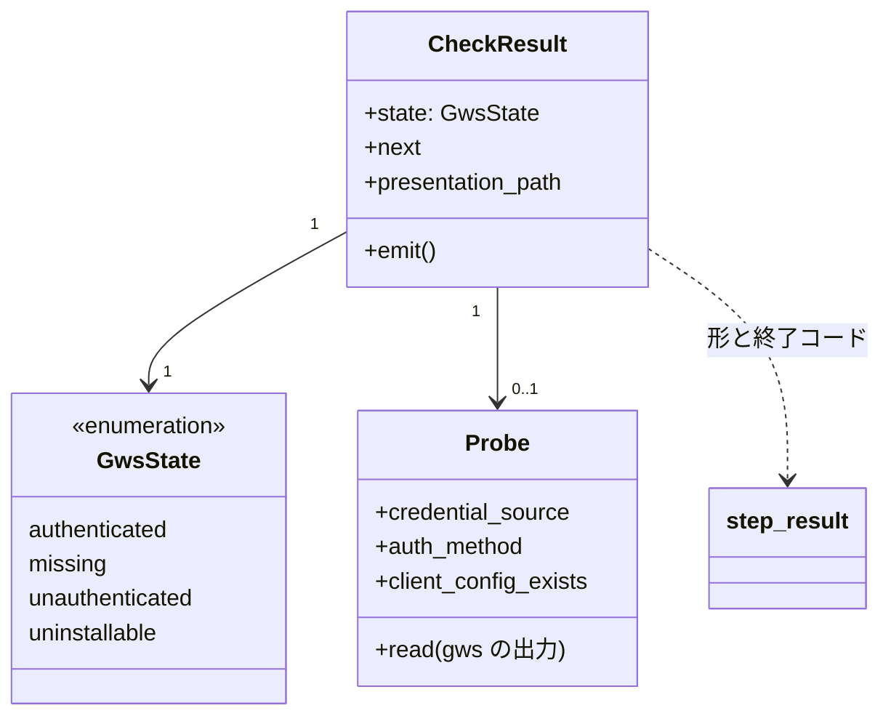
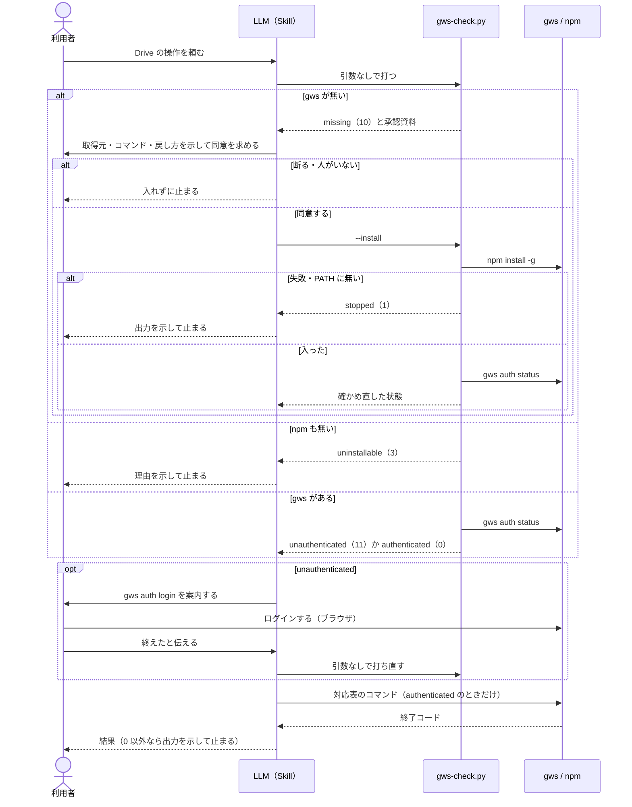
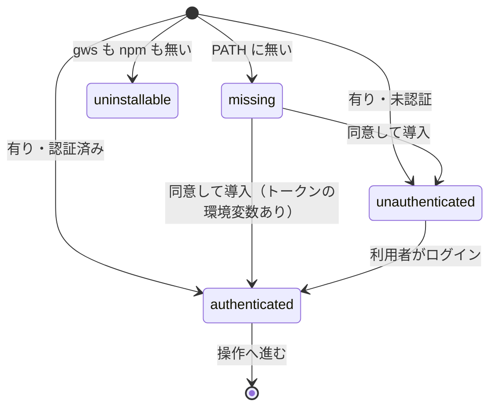

# google-workspace: Google Drive を操作するには Python の依存・OAuth の設定・トークンの自前管理が要り、playwright-kit も同じ認証に縛られている → gws の 1 経路と 1 つの Skill で、導入は同意のうえ・認証は利用者が 1 回ログインするだけで済む（#744）

## 目的

- **何が壊れているか**: Google Workspace の操作が `google-auth`（OAuth2 のトークンを NDF が自前で作り、置く）と `google-drive`（Python の Drive API）の 2 つの Skill にまたがり、Python の依存と `uv.lock` が 2 つ、`client_secret.json` の置き場所の案内が要る。playwright-kit も `google-auth` を Python から import している
- **誰が困るか**: Drive の素材を取り込む・成果物を上げる NDF の利用者（導入と認証の手間）と、NDF の保守者（経路と検査が 2 つずつある）
- **直すと何が成り立つか**: Google Workspace の操作は gws（Google Workspace CLI）の 1 経路と `google-workspace` の 1 つの Skill になる。gws の有無と認証はスクリプトが確かめ、導入は利用者の同意を得てから行い、認証は利用者が `gws auth login` を 1 回打つだけで済む

## 適用範囲

- **働く範囲**: 配布先のリポジトリで働く（NDF の Skill として 4 ランタイムへ配る）。playwright-kit の変更も配布先で働く
- **プロジェクトごとに違うもの**: 無し。gws の置き場所と認証は利用者の環境（gws の設定ディレクトリ）が持ち、NDF は設定も引数も足さない
- **当たるモード**: `standard`

## あるべき姿の根拠

| 根拠 | 種類 | 何を示すか |
| --- | --- | --- |
| gws 0.22.5 で Doc を text/plain と application/pdf でエクスポートできた（2026-09-18） | 実測 | `gdrive_fetch.py` の 3 操作を gws で置き換えられる |
| 未認証の `gws auth status` は終了コード 0 で、標準出力へ JSON を出す。`credential_source` が `none`、`GOOGLE_WORKSPACE_CLI_TOKEN` を渡すと `token_env_var` になり、`auth_method` はどちらも `none`（2026-10-04、gws 0.22.5） | 実測 | 認証の有無は終了コードでなく JSON の `credential_source` で決まる |
| `gws auth` の副命令は login / setup / status / export / logout の 5 つで、`export` は資格情報を復号して標準出力へ出す（2026-10-04、`gws auth --help`） | 実測 | スクリプトが呼んでよいのは `status` だけである |
| 「`google-auth` と `google-drive` の 2 つの Skill を廃止する。Google Workspace の操作は gws で行う単一の Skill へ置き換える」 | 利用者の指示の原文（#744） | 置き換え先と Skill の数 |
| playwright-kit の Drive 連携を外す（2026-10-03 利用者の決定、#745 は not planned） | 利用者の指示 | playwright-kit は gws へ移さずに削除する |

要求と受け入れ条件は #744 の本文にある（コピーは `issues/issue-744-requirements.md`）。この文書は「どう作るか」だけを扱う。

## ドメインモデル

### コンテキスト

| コンテキスト | 何の語が 1 つの意味に決まるか |
| --- | --- |
| NDF の Google Workspace の操作（`ndf-google-workspace`） | gws・gws の状態・導入の同意・公開リンク |
| gws（外部。変えられない） | 認証の状態の JSON（`credential_source`・`client_config_exists`）・資格情報の置き場所 |

**`ndf-google-workspace` は gws の順応者である。** gws は NDF の要求を聞かず、認証の状態の形も資格情報の置き場所も gws が決める。NDF は `gws auth status` の JSON をそのまま読み、翻訳の層を置かない（読むのは下の I4 の 3 つのキーだけ）。

playwright-kit は、この変更の後は Google Workspace のどのコンテキストとも関係を持たない（Drive への保管を外すため）。

### 集約

| 集約 | 持ち主（書き換えてよいもの） | 根 | エンティティ | 値オブジェクト |
| --- | --- | --- | --- | --- |
| gws の確認の結果 | 確認のスクリプト（`gws-check.py`） | 確認の結果 | — | gws の状態・次の手・導入の承認資料のパス |
| 配る Skill の一覧 | `plugins/ndf/manifests/*-skills.txt`（4 つ）と、それに合わせる 2 つの `plugin.json` | 各ランタイムの一覧 | Skill の行 | Skill の名前 |
| playwright-kit の成果物の扱い | playwright-kit の pytest プラグインと Skill | 実行 1 回の成果物の置き場所（`reports/<run-id>/`） | 報告書・証跡のファイル | — |

**利用者の環境の gws（導入・資格情報）と Drive のファイルは、NDF の集約にしない。** 持ち主は利用者と gws で、NDF は利用者の依頼か同意があるときに gws を通して触るだけである。

### 不変条件

| # | 集約 | 条件 | 破れたときの扱い |
| --- | --- | --- | --- |
| I1 | gws の確認の結果 | 同意の印（`--install`）を受け取らない限り、`npm install -g` を起動しない | 起動の経路を作らない。テストが落とす |
| I2 | gws の確認の結果 | どの引数でも、gws の副命令は `auth status` 以外を起動しない（`auth login` / `auth setup` / `auth export` / `auth logout` を呼ばない） | 同上 |
| I3 | gws の確認の結果 | gws の状態は 4 つ（`authenticated` / `missing` / `unauthenticated` / `uninstallable`）のどれか 1 つで、状態ごとに `status` と終了コードが 1 つに決まる（入出力の契約の表） | 状態を決められないときは 4 つのどれにもせず、`stopped` と終了コード 2 で返す |
| I4 | gws の確認の結果 | 結果へ写す gws の出力は `credential_source`・`auth_method`・`client_config_exists` の 3 つだけで、資格情報のファイルを開かない | 他のキーの値が結果に現れたらテストが落とす |
| I5 | gws の確認の結果 | `uninstallable`（npm が無い）と導入の失敗は 0 以外の終了コードで終わる | 0 で終わったらテストが落とす |
| I6 | 配る Skill の一覧 | 4 つの manifest に `google-workspace` が 1 行ずつあり、`google-auth` と `google-drive` が無い。2 つの `plugin.json` の列挙も同じ | 既存の配布の検査と受け入れ条件の `git grep` が落とす |
| I7 | playwright-kit の成果物の扱い | playwright-kit は Google の資格情報と Drive への経路を持たない（`--pwk-drive-folder` を受けない・Google の API の包みを依存に持たない） | `--pwk-drive-folder` を渡した実行は pytest が未知の引数として止める。依存の残りは受け入れ条件の `git grep` が落とす |
| I8 | gws の確認の結果 | アップロードの既定は非公開で、公開リンクは利用者が公開を明示したときだけ付ける | Skill の手順が持つ。スクリプトは Drive を操作しない。リリース後テストで確かめる |

### ドメインイベント

| # | イベント | 発生元 | 受け手 |
| --- | --- | --- | --- |
| E1 | gws の有無と認証の状態を確かめた | 確認のスクリプト | Skill の手順を進める LLM（状態ごとに次の手を選ぶ） |
| E2 | 導入の同意を求めた | Skill の手順を進める LLM（E1 が `missing`） | 利用者 |
| E3 | 利用者が導入に同意した / 断った | 利用者 | LLM（同意なら `--install` を付けて打つ。断りなら止まる） |
| E4 | gws を導入した | 確認のスクリプト（`--install`） | 同じ起動の中の E1（導入の後に確かめ直す） |
| E5 | 認証を案内した | LLM（E1 が `unauthenticated`） | 利用者 |
| E6 | 利用者が `gws auth login` で認証した | 利用者 | LLM（E1 から確かめ直す） |
| E7 | Drive のファイルをエクスポート / ダウンロード / アップロードした | gws（LLM が Skill の対応表どおりに打つ） | 利用者・`document-systems` の取り込み |
| E8 | アップロードしたファイルに公開リンクを付けた | gws（利用者が公開を明示したときだけ） | 利用者 |

### 用語

| 用語 | 意味 | 用語集への反映 |
| --- | --- | --- |
| gws | Google Workspace CLI（npm の `@googleworkspace/cli`）。Google の公式サポート外の CLI で、NDF の Google Workspace の操作はすべてこれで行う | 追加（要求の段で反映済み。`ndf-google-workspace`） |
| gws の状態 | 確認のスクリプトが返す 4 つの値（`authenticated` / `missing` / `unauthenticated` / `uninstallable`）。状態ごとに次の手が 1 つに決まる | 追加（`ndf-google-workspace`） |

## 機能一覧

| # | 機能 | 誰が使うか |
| --- | --- | --- |
| F1 | gws の有無と認証の状態を確かめ、次の手を返す | Skill の手順を進める LLM |
| F2 | 取得元とコマンドを示して同意を求め、同意を得たら gws を入れる | 利用者（同意）と LLM（実行） |
| F3 | 未認証のときに `gws auth login` を案内する | 利用者 |
| F4 | Drive のファイルをエクスポート・ダウンロード・アップロードする（アップロードの既定は非公開） | NDF の利用者 |
| F5 | 利用者が明示したときだけ、アップロードしたファイルに公開リンクを付ける | NDF の利用者 |
| F6 | Drive の素材の取り込みと、描画して見るための PDF の取得を gws で行う | `document-systems` / `document-sources` の手順 |
| F7 | `google-auth` と `google-drive` を配布から外す | NDF の利用者（`/ndf:google-auth` `/ndf:google-drive` が消える） |
| F8 | playwright-kit から Drive への保管を外す | playwright-kit の利用者（`--pwk-drive-folder` と Drive のアップロードのスクリプトが消える） |

## 構成要素

| 要素 | 責務 |
| --- | --- |
| `google-workspace` の Skill の本文（新設） | 3 段の流れ（確かめる → 同意のうえ入れる → 認証を案内する）と、操作の対応表（Drive の 3 操作・公開リンクの付与・Docs のエクスポート）。同意の取り方と、人がいない起動で止まること |
| 確認のスクリプト `gws-check.py`（新設） | `gws auth status` を 1 回打って gws の状態を決め、`step_result` の形の 1 行の JSON と終了コードで返す。`--install` のときだけ `npm install -g @googleworkspace/cli` を打ち、確かめ直す。`missing` のときは導入の承認資料を書く |
| 確認のスクリプトのテスト（新設） | gws と npm をスタブに置き換え、状態ごとの結果と、呼ばれた引数を確かめる |
| 結果の契約（`plugins/ndf/scripts/lib/step_result.py`。変えない） | 結果の形・終了コードの範囲・承認資料の書き出しを持つ。確認のスクリプトはこれを使う |
| `google-auth` / `google-drive` の Skill（削除） | 消す。トークンの自前管理・Python の依存・`uv.lock` 2 つも一緒に消える |
| 配る Skill の一覧（manifests 4 つ・`plugin.json` 2 つ） | 2 行を `google-workspace` の 1 行へ |
| Skill 間の参照の検査（`scripts/check-cross-skill-refs.py` と、共配布のテスト） | `google-drive` → `google-auth` の例外（#116）と `test_google_auth_codistribution.py` を消し、2 つを例に挙げた説明（`test_cross_skill_refs.py`・`test_refactoring_codistribution.py`）を直す |
| `document-systems`（本文と `references/system-gdrive.md`）・`document-sources` | スクリプトの経路を gws へ、参照先の Skill の名前を `google-workspace` へ。MCP の `read_file_content` の経路は変えない |
| リポジトリの文書（`README.md`・`plugins/ndf/README.md`・`docs/ndf-plugin-reference.md`・`docs/specifications/ndf-skill-inventory/01-ledger-and-criteria.md`・`docs/specifications/ndf-documentation-mode.md`） | Skill の一覧・数・判定・Drive の取得を持つ Skill の名前を直す |
| playwright-kit の Drive への保管（削除） | `scripts/` の `_drive_auth.py`・`gdrive_upload_dir.py`・`build_gdoc_with_drive_links.py`・`upload_evidence.py`・`upload_md_as_gdoc.py`、`playwright_kit/uploaders/`、`pytest_plugin.py` の `--pwk-drive-folder` と `pytest_sessionfinish` の保管、`pyproject.toml` の `drive` の extra（とその説明のコメント）と description の「Google Drive 連携を提供」、`templates/pyproject.toml.runtime` の Google の依存（とその説明のコメント） |
| playwright-kit の依存の固定（`plugins/playwright-kit/skills/playwright-kit-ops/uv.lock`・根の `uv.lock`） | `drive` の extra を外した形で作り直す |
| playwright-kit のテスト | Drive の経路のテスト（`test_drive_auth_candidates.py`・`test_build_gdoc_with_drive_links.py`・`test_upload_evidence.py`・`test_script_json_output.py`、`test_pytest_terminal_summary.py` の保管の 2 件）を消し、`test_pytest_plugin_bootstrap.py` を `--pwk-drive-folder` が無い形へ直す |
| playwright-kit の案内 | `playwright-evidence` / `playwright-kit-ops` / `playwright-authoring` / `playwright-planning`（本文と `docs/04`・`05`・`06`）の Skill、`templates/` の `run.sh`・`run.bat`・`runtime-README.md`、`playwright_kit/fixtures/__init__.py` と `pytest_report.py` の docstring、`README.md`、2 つの `plugin.json` の description から Drive への保管の手順と案内を外す。`plugins/playwright-kit/` の外で利用者がプラグインを選ぶときに読む、`.claude-plugin/marketplace.json` の playwright-kit の description（「report generation with Drive archiving」）と根の `README.md` の playwright-kit の行（「レポート生成と Drive 保管」）からも外す |
| `.ndf/pace.json` の `boundary_paths` | `plugins/ndf/skills/google-auth/**` を `plugins/ndf/skills/google-workspace/**` へ置き換える（2026-10-05 ゲート 1 で利用者が決定） |
| 実装の Pull Request の本文 | 利用者向けの変更に、移行の手順（`gws auth login` で認証し直す・Drive への保管は `gws drive +upload` を手で使う）を書く。`release` がこれを CHANGELOG へ写す |

**手を入れないもの**: `playwright_kit/video.py`・`config.py`・`templates/scenario.config.yaml`・`pyproject.toml`・`templates/pyproject.toml.runtime` にある「Drive のプレイヤと互換の mp4」の説明（動画の符号化の理由で、保管の案内ではない。決定 8）、`document-systems` のシステムの識別子 `gdrive`。

### 構成要素図



図に含めない要素: 削除する 2 つの Skill、結果の契約以外の既存の部品（Skill 間の参照の検査）、リポジトリの文書、playwright-kit の変更、実装の Pull Request の本文。いずれも確認のスクリプトの流れに現れず、名前や記述を直すだけである。

### システムの文脈と配置



- すべて利用者の端末で動く。エージェントと確認のスクリプトは同じ権限で動き、`sudo` を使わない
- **境界をまたぐもの**: スクリプトから gws へは `auth status` の起動だけが渡り、gws から返るのは状態の JSON（I4 の 3 キーを読む）。資格情報は gws と gws の設定ディレクトリの間でだけ動き、NDF のスクリプトを通らない

### 置き場所

```text
plugins/ndf/skills/
├── google-auth/                  ← 削除
├── google-drive/                 ← 削除
└── google-workspace/             ← 新設
    ├── SKILL.md
    ├── scripts/
    │   └── gws-check.py
    └── tests/
        └── test_gws_check.py
```

## 構造

確認のスクリプトが持つ型だけを描く。`step_result` は既存で、名前だけを置く。



- `Probe` は gws が有るときだけ作る（`missing` と `uninstallable` では gws を起動しない）
- `Probe.read` が読めない（JSON でない・3 キーのどれかが無い）ときは状態を決めず、`stopped` と終了コード 2 で返す（I3）

## 入出力の契約

### 確認のスクリプト `gws-check.py`（新設）

| 項目 | 内容 |
| --- | --- |
| 名前 | `python3 "<Skill のディレクトリ>/scripts/gws-check.py" [--install]` |
| 入力 | `--install`（任意）: 利用者が導入に同意した印。付けたときだけ、gws が無ければ npm で入れる。gws が既にあれば何もしない。ほかの引数は持たない |
| 出力 | 標準出力へ `step_result` の形の 1 行の JSON（`tool` は `google-workspace`）。`metrics.state` に gws の状態、`metrics` に `credential_source`・`auth_method`・`client_config_exists`（gws があるとき）、`next` に次の手 |
| 互換性 | 新設のため既存の呼び出し側は無い |

**状態と結果の対応**（I3。終了コードの範囲は `step_result` の 10〜19 が承認ゲート、3 が前提が無い）:

| gws の状態 | 条件 | `status` | 終了コード | `next` |
| --- | --- | --- | --- | --- |
| `authenticated` | gws が `PATH` にあり、`credential_source` が `none` でない | `ok` | 0 | 操作へ進む |
| `missing` | gws が `PATH` に無く、npm がある（`--install` なし） | `gate` | 10 | 承認資料を示して同意を求め、同意を得たら `--install` を付けて打ち直す。`presentation_path` に承認資料 |
| `unauthenticated` | gws があり、`credential_source` が `none` | `gate` | 11 | Claude Code では `! gws auth login`、ほかのランタイムでは別の端末で `gws auth login` を打つよう案内する。`client_config_exists` が偽なら、その前に `gws auth setup`（gcloud が要る）か OAuth クライアントの用意を案内する |
| `uninstallable` | gws も npm も `PATH` に無い | `stopped` | 3 | npm（Node.js）を入れてから打ち直す |

**失敗の形**（どの状態にもしない）:

| 事象 | `status` | 終了コード | 出力 |
| --- | --- | --- | --- |
| `gws auth status` が 0 以外で終わる・JSON でない・3 キーのどれかが無い | `stopped` | 2 | `summary` に理由、`items` に gws の標準エラーの末尾 |
| `--install` の `npm install -g` が 0 以外で終わる（権限の不足を含む） | `stopped` | 1 | `summary` に npm の終了コード、`items` に npm の出力の末尾。`sudo` で打ち直さない |
| `--install` で入れた後も gws が `PATH` に無い | `stopped` | 1 | `next` に `npm prefix -g` の `bin` を `PATH` へ足すよう案内する（スクリプトは `PATH` も設定のファイルも書き換えない） |

`--install` で入れた後に gws が見つかれば、同じ起動の中で確かめ直し、その結果（多くは `unauthenticated`）を返す。

**導入の承認資料**（`missing` のとき `approval_present` が書く）:

| 欄 | 値 |
| --- | --- |
| 対象 | `https://www.npmjs.com/package/@googleworkspace/cli` |
| 変更量 | npm の全体インストール 1 件 |
| 判断に使うもの | 取得元（npm の `@googleworkspace/cli`）・打つコマンド（`npm install -g @googleworkspace/cli`）・入る先（`npm prefix -g` の値）・Google の公式サポート外で版が 0.x であること |
| 同意を求めること | 上の取得元から利用者の環境へ全体インストールを行う |
| 戻し方 | `npm uninstall -g @googleworkspace/cli` |

### 消える約束

| 約束 | 扱い |
| --- | --- |
| `/ndf:google-auth`・`/ndf:google-drive` と `gdrive_fetch.py` の引数 | 削除。互換の経路を持たない。代わりは `/ndf:google-workspace` と Skill の対応表 |
| playwright-kit の `--pwk-drive-folder` | 削除。渡すと pytest が未知の引数として止める（決定 7） |
| playwright-kit の `scripts/upload_evidence.py`・`gdrive_upload_dir.py`・`build_gdoc_with_drive_links.py`・`upload_md_as_gdoc.py` と `playwright_kit.uploaders` | 削除 |
| playwright-kit の `drive` の extra | 削除。`--extra drive` を渡す環境の作り直しは失敗する |

### Skill の操作の対応表（`SKILL.md` に載せる）

| 操作 | gws のコマンド |
| --- | --- |
| Doc・Slides・Sheets のエクスポート | `gws drive files export --params '{"fileId":"<ID>","mimeType":"<MIME>"}' --output <ファイル>` |
| ファイルのダウンロード | `gws drive files get --params '{"fileId":"<ID>","alt":"media"}' --output <ファイル>` |
| アップロード（既定は非公開） | `gws drive +upload <ファイル>` |
| 公開リンクの付与（明示したときだけ） | `gws drive permissions create`（`type` は `anyone`、`role` は `reader`） |

対応表の外の操作（Sheets の編集・Gmail・Calendar など）は書かず、`gws <サービス> --help` を案内するだけにする（要求の「含まない」）。コマンドの細かな引数（`permissions create` の渡し方など）は実装で実際に打って確かめてから書く（`AGENTS.md`）。

## 処理の流れ



### gws の状態の遷移



- **描かない遷移は起こらない。** `uninstallable` から先へは、利用者が npm を入れて打ち直すまで進まない。`missing` から `authenticated` へ進むのは、`GOOGLE_WORKSPACE_CLI_TOKEN` が渡されている環境だけである（導入した直後の gws の設定ディレクトリには資格情報が無い）
- **同意を断ったとき・人がいないとき（`claude -p` など）は `missing` のまま止まる。** gws の無い代替の経路は持たない

## 非機能の実現方式

| 大項目 | 要求の条件 | 実現方式 | 確かめ方 |
| --- | --- | --- | --- |
| 運用・保守性 | Google Workspace の操作の経路は gws の 1 つだけにし、旧 Skill を予備の経路として残さない | 2 つの Skill のディレクトリを消し、manifests・`plugin.json`・Skill 間の参照の例外・共配布のテストから外す | 受け入れ条件の `git grep`、`claude plugin validate .` |
| 移行性 | 旧 Skill のトークンは gws へ移さない。利用者は `gws auth login` で認証し直す。CHANGELOG に移行の手順を書く | スクリプトは旧トークンの置き場所を見ない。実装 PR の本文の利用者向けの変更に、認証し直す手順と Drive への保管の代わり（`gws drive +upload`）を書き、`release` が CHANGELOG へ写す | 実装 PR の本文を読む。リリースの CHANGELOG を読む |
| セキュリティ | アップロードの既定は非公開（#879）。NDF のスクリプトはトークンと `client_secret.json` を読まない・書かない（C1）。gws の導入は同意を得てから行う（C6） | アップロードは `gws drive +upload` だけを既定にし、公開リンクは明示のときだけ別の手順にする。スクリプトは `gws auth status` の 3 キーだけを読み、gws の副命令は `status` 以外を呼ばない。導入は `--install` があるときだけ | I1・I2・I4 のテスト。I8 はリリース後テスト |
| システム環境 | gws の導入には npm が要る。npm が無い環境では導入せずに理由を示す | `uninstallable` を返し、終了コード 3 で終える | I5 のテスト |

## 決定の記録

### 決定 1: 人の操作が要る 2 つの場面を読み分けられるよう、`missing` と `unauthenticated` を別の承認ゲートの終了コード（10 と 11）にする

導入の同意も利用者のログインも、LLM だけでは先へ進めない点で同じである。`step_result` は 10〜19 を承認ゲートとしているため、`gate` の中で終了コードを分けると、読み手は `status` で「人が要る」と知り、終了コードで「何を頼むか」を知る。`npm` が無い場面は人が要るが同意では解けないため、`step_result` の「前提が無い」の 3 にする。

`unauthenticated` を「前提が無い」の 3 にすると、npm が無い場面と同じ終了コードになり、`metrics.state` を読まなければ次の手が決まらない。

根拠: Value 4（MVV 版 2）

### 決定 2: 環境変数のトークンでの認証を見落とさないよう、認証済みの判定は `credential_source` で行う

実測で、`GOOGLE_WORKSPACE_CLI_TOKEN` を渡しても `auth_method` は `none` のまま、`credential_source` だけが `token_env_var` に変わった。`credential_source` が `none` でなければ認証済みとする。トークンが有効かどうかはスクリプトでは確かめず、操作のコマンドが失敗したときに gws の出力で分かる。

`auth_method` で判定すると、環境変数のトークンで動く CI や共有の環境を未認証と誤り、不要なログインを案内する。Drive の API を試しに呼んで有効性まで確かめる案は、利用者の Drive への読み取りを確認のたびに起こすため採らない。

根拠: Value 3 / C1（MVV 版 2）

### 決定 3: 利用者の環境を同意なしに書き換えないよう、導入は `--install` の引数がある起動だけにし、人がいない起動では止める

同意の判断は LLM が持ち、スクリプトは引数の有無だけを見る。`official-skills-autoloader` と同じく、利用者が導入を含めて頼んだ（「gws を入れて」）ときはその依頼を同意とみなすが、そのときも承認資料（取得元・コマンド・戻し方）は示す。暗黙の起動（「Drive から取って」）では明示の同意を待つ。`pace: fast` / `auto` と `claude -p` の起動でも同意は省かず、`missing` のまま止まって人へ戻す。

スクリプトが対話で同意を尋ねる案は、エージェント経由の起動では標準入力が無く、どのランタイムでも働かない。

根拠: C6 / Value 2（MVV 版 2）

### 決定 4: 使うのがこの Skill だけなので、確認のスクリプトは Skill の `scripts/` に置き、結果の形は共通の `step_result` を使う

確認のスクリプトを呼ぶのは `google-workspace` だけで、配布の基準（manifests）も Skill の単位である。結果の形・終了コードの範囲・承認資料の書き出しは `plugins/ndf/scripts/lib/step_result.py` が既に持つため、自前で書かない。`external-ai.py` と同じく、プラグインの根の `scripts/lib` を読む。

プラグインの根の `scripts/` に置く案は、Skill を配らない配布先にも残り、Skill と別に保守することになる。

根拠: Value 6 / Value 4（MVV 版 2）

### 決定 5: 利用者のシェルの設定を書き換えないよう、導入後に gws が `PATH` に無いときは案内して止まる

npm の全体インストールの置き場所が `PATH` に無い環境（`npm prefix -g` を利用者が変えた環境）では、入れた直後に gws が見つからない。スクリプトは `PATH` もシェルの設定のファイルも書き換えず、`npm prefix -g` の `bin` を足すよう案内する。権限の不足で `npm install -g` が失敗したときも `sudo` で打ち直さない。

見つからないときにスクリプトが `npm prefix -g` の `bin` を直接起動する案は、その起動では通っても次の操作のコマンドで見つからず、Skill の手順が途中で止まる。

根拠: C6（MVV 版 2）

### 決定 6: 状態を 4 つに保つため、OAuth クライアントが無い未認証は `unauthenticated` に含め、次の手で `gws auth setup` を先に案内する

実測の環境は `client_config_exists` が偽で、`gws auth login` の前に OAuth クライアントの用意（`gws auth setup` か `client_secret.json` の配置）が要る。これも利用者が手で打つ認証の準備で、次の手の文が増えるだけである。`metrics.client_config_exists` に値を出し、`next` の文を分ける。

5 つ目の状態にする案は、要求の前提 4 が状態を 3 つ（と導入できない）に定めており、LLM の分岐を増やすだけで利用者に頼むことは同じである。

根拠: Value 4（MVV 版 2）

### 決定 7: 保管されたと誤解させないよう、`--pwk-drive-folder` は受けて無視せずに消す

受けて警告だけを出す案では、CI のように警告を読まない実行で、成果物が上がったと思われたまま残る。消せば、渡した実行は pytest が未知の引数として最初に止め、利用者が気づく。要求の影響の表も互換の経路を持たないとしている。

根拠: Value 1 / Value 2（MVV 版 2）

### 決定 8: 差分を Drive への保管に絞るため、動画を mp4 にする理由の「Drive のプレイヤと互換」の説明は残す

`video.py`・`config.py`・`templates/scenario.config.yaml`・`pyproject.toml`（mp4 へ変換する依存の理由のコメント）・`templates/pyproject.toml.runtime`（同じ理由のコメント）の説明は、動画の符号化の設定の理由で、Drive へ保管する手順ではない。mp4 の設定はブラウザでの再生にも効くため、設定はそのまま使い続ける。受け入れ条件 7 の `git grep -niE "drive" plugins/playwright-kit` の残りは、この 5 ファイルの mp4 の理由の説明だけになる（`pyproject.toml` の description の「Google Drive 連携を提供」と `drive` の extra のコメントは保管の案内なので消す）。

説明を書き換える案は、振る舞いの変わらない行を差分に載せる。

根拠: Value 1（MVV 版 2）

### 決定 9: playwright-kit の Skill の名前は変えず、`playwright-evidence` は報告書の作成だけを持つ

`playwright-evidence` から Drive への保管を外すと、残るのは報告書の作成である。Skill の名前を変えると呼び出しの名前（公開インタフェース）が増えて変わるため、名前は保ち、description と本文から保管を外す。バグ報告の trace・動画・スクリーンショットは、報告書の置き場所（`reports/<run-id>/`）のパスで添える形にし、共有の手段は利用者が選ぶ。playwright-kit から NDF の `google-workspace` を指さない（playwright-kit は NDF なしで入れられる）。

根拠: Value 5（MVV 版 2）

## テスト設計

| 受け入れ条件・不変条件 | どの振る舞いで縛るか | どう壊したら落ちるべきか |
| --- | --- | --- |
| 受け入れ条件 1（gws の無い環境で導入から Doc のエクスポートまで） | 手動。リリース後テストで、gws の無い環境から Skill の手順どおりに通す | — |
| 受け入れ条件 2（エクスポート・ダウンロード・アップロード・公開リンク）と I8 | 手動。リリース後テストで、対応表の 4 行を打ち、アップロードの直後のファイルが非公開であることを Drive の共有の設定で見る | — |
| 受け入れ条件 3・I3（3 つの状態で別の状態と次の手） | gws が `PATH` に無い・未認証の JSON を返す gws・`credential_source` が `token_env_var` の gws で、`metrics.state`・`status`・終了コードが契約の表どおり | 判定を `auth_method` で行うように壊すと、`token_env_var` の場合が `unauthenticated` になって落ちる。承認ゲートの終了コードを 10 に揃えると落ちる |
| I3（状態を決められない） | gws が JSON でない出力・0 以外の終了コード・キーの欠けた JSON を返すと、`stopped` と終了コード 2 | 読めない出力を `unauthenticated` に倒すと落ちる |
| 受け入れ条件 4・I1（同意なしに入れない） | `--install` なしで gws が無いとき、スタブの npm が 1 度も呼ばれず、結果が `missing` と承認資料のパス | `--install` の判定を外すと、npm の呼び出しの記録が残って落ちる |
| I1（同意したときの導入） | `--install` で、npm が `install -g @googleworkspace/cli` で 1 度だけ呼ばれ、入った gws で確かめ直した状態を返す。npm が 0 以外なら `stopped` と 1。入った後も gws が見つからなければ `stopped` と 1 | 確かめ直しを省くと、`unauthenticated` の代わりに導入の成功だけが返って落ちる |
| 受け入れ条件 4・I2（login を呼ばない） | すべての引数の組と状態で、スタブの gws に記録された引数が `auth status` だけ | 未認証のときに `auth login` を呼ぶように壊すと落ちる |
| I4（資格情報を写さない） | スタブの gws の JSON に余分のキー（資格情報に見立てた値）を混ぜても、結果の JSON にその値が現れない | gws の出力を丸ごと `metrics` へ写すと落ちる |
| 受け入れ条件 5・I5（npm が無い） | gws も npm も無いとき、`uninstallable`・`stopped`・終了コード 3 | 0 で終えると落ちる |
| 受け入れ条件 6（旧名の `git grep`） | 受け入れ条件の `git grep` を実装 PR の検証で打つ | 旧名の行が 1 つでも残れば件数が 0 でなくなる |
| 受け入れ条件 7・I7（playwright-kit） | `pytest --help` に `--pwk-drive-folder` が無く、渡すと未知の引数で止まる（`test_pytest_plugin_bootstrap.py` を直す）。`git grep -niE "drive" plugins/playwright-kit` の残りが決定 8 の 5 ファイルの mp4 の理由の説明だけ。`.claude-plugin/marketplace.json` の playwright-kit の description と根の `README.md` の playwright-kit の行に `Drive` が無い（`plugins/playwright-kit` だけの `git grep` では見えないため、この 2 か所は別に読む） | オプションを残すと bootstrap のテストが落ちる |
| 受け入れ条件 8・I6（manifests） | 既存の配布の検査（manifests と `plugin.json` の突き合わせ）と受け入れ条件の `git grep` | 片方の `plugin.json` に旧名を残すと既存の検査が落ちる |
| 受け入れ条件 9（既存の検査） | `check-skill-frontmatter.py`・`claude plugin validate .`・全体テスト・playwright-kit のテストを実装 PR の検証で通す | — |

## 設計の結果

| 課題 | 扱い | 取り込み先 | 触るファイル |
| --- | --- | --- | --- |
| #744 | 実装する | — | `plugins/ndf/skills/google-auth/`、`plugins/ndf/skills/google-drive/`、`plugins/ndf/skills/google-workspace/`、`plugins/ndf/manifests/`、`plugins/ndf/.claude-plugin/plugin.json`、`plugins/ndf/.codex-plugin/plugin.json`、`plugins/ndf/skills/document-systems/`、`plugins/ndf/skills/document-sources/SKILL.md`、`plugins/ndf/README.md`、`scripts/check-cross-skill-refs.py`、`scripts/tests/test_google_auth_codistribution.py`、`scripts/tests/test_cross_skill_refs.py`、`scripts/tests/test_refactoring_codistribution.py`、`README.md`、`docs/ndf-plugin-reference.md`、`docs/specifications/ndf-skill-inventory/01-ledger-and-criteria.md`、`docs/specifications/ndf-documentation-mode.md`、`plugins/playwright-kit/`、`.claude-plugin/marketplace.json`、`uv.lock` |

## 未確認のまま残ること

| 項目 | 内容 |
| --- | --- |
| `gws auth login` の後の `credential_source` の値 | 実測できたのは `none` と `token_env_var` だけである。ログインした後の値は `none` 以外になる前提で判定を組んだ（決定 2）。リリース後テストで、ログインした環境の値を確かめる |
| `permissions create` の引数の渡し方 | gws 0.22.5 での `--params` と `--json` の分け方は実装で打って確かめてから対応表に書く |
| playwright-kit の版の上げ幅 | 機能の削除を MAJOR とするかは配布（`release`）で決める（要求の未決） |
| gws の版の変化 | gws は 0.x で、`auth status` の JSON のキーが変わりうる。変わったときはスクリプトが終了コード 2 で止まり、状態を誤らない（I3）。版の固定は範囲外 |
