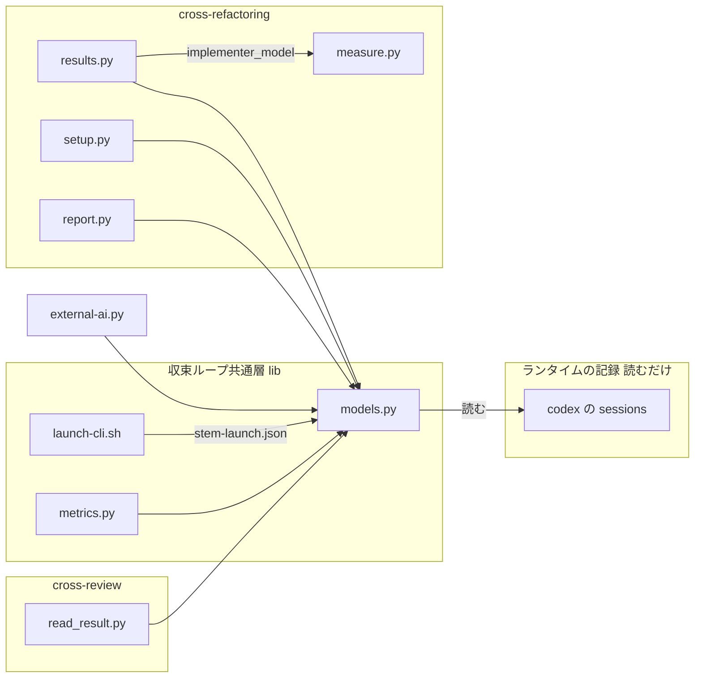
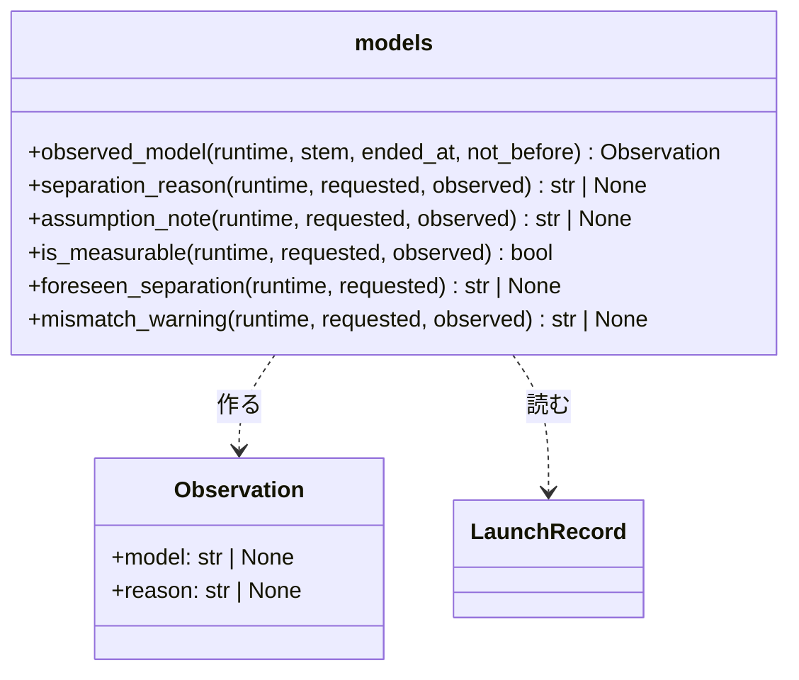
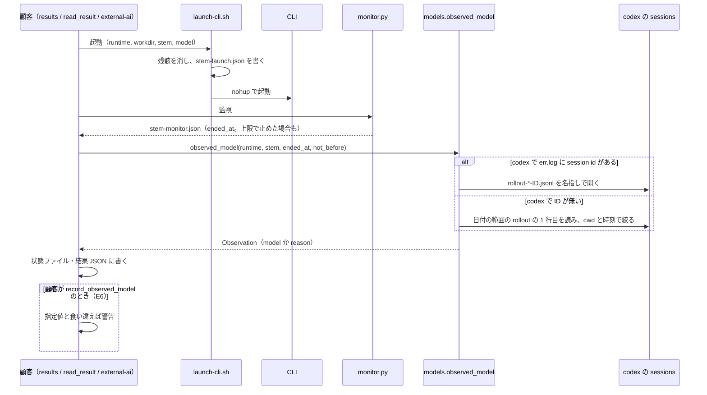

# #759: `--model` を指定しない実行でも、実際に動いたモデルを記録する

要求と受け入れ条件は #759 の本文にある（コピーは [issue-759-requirements.md](issue-759-requirements.md)）。
この文書は「どう作るか」だけを扱う。

## 実例: rf751 の実装担当が codex だったら

`cross-refactoring` を `--model` なしで走らせ、実装担当が codex になった実行を考える。

| | 状態ファイルの `implementer_model` | `report` |
| --- | --- | --- |
| 今 | `{"requested": null, "observed": null}` | 「codex はモデルを指定しておらず、実際に動いたモデルも取得できない」として集計から外す |
| 変更後 | `{"requested": null, "observed": "gpt-6.1-sol", "unobserved": null}` | 実装担当の行に `gpt-6.1-sol（実測）` が出る。分離されない |

変更後の値は、次の 4 つの手順で入る。

1. 起動（`launch-cli.sh`）が `<stem>-launch.json` に開始の時刻と作業ディレクトリを書いてから codex を起動する
2. codex は標準エラー（`<stem>-err.log`）の見出しに `session id: 01a0f9f8-…` を出す（codex-cli 0.159.3 で実測）
3. 取り込みが `models.observed_model("codex", <stem>)` を呼ぶ。ID で rollout（`~/.codex/sessions/2026/10/02/rollout-…-01a0f9f8-….jsonl`）を名指しで開く
4. rollout の `turn_context` から `"model":"gpt-6.1-sol"` を取り、状態ファイルへ書く

## ドメインモデル

### コンテキスト

| コンテキスト | 何の語が 1 つの意味に決まるか |
| --- | --- |
| 外部の CLI の起動（`ndf-agent-cli`） | 実測値・指定値・主たるモデル・分離・起動の記録・取れなかった理由 |
| cross-refactoring（`ndf-cross-refactoring`） | 実装担当とそのモデルの記録（`implementer_model`） |
| cross-review（`ndf-cross-review`） | レビュー担当とそのモデルの記録（`reviewer_models`） |

**関係は顧客 / 供給者である。**

| 側 | 誰か | 持つもの |
| --- | --- | --- |
| 供給者 | `ndf-agent-cli`（`plugins/ndf/scripts/lib/` の `launch-cli.sh` と `models.py`） | 実測値の取り方と分離の判定。1 か所だけに置く |
| 顧客 | cross-refactoring・cross-review・`external-ai.py run` | 返った値を自分の状態ファイルへ書く処理だけ。取得の処理は持たない |

### 集約

| 集約 | 持ち主（書き換えてよいもの） | 根 | エンティティ | 値オブジェクト |
| --- | --- | --- | --- | --- |
| 起動の記録 | `lib/launch-cli.sh` | `<stem>-launch.json` | — | 開始の時刻・作業ディレクトリ・ランタイム |
| 実装担当のモデルの記録 | cross-refactoring の `results.record_observed_model`（初期化と担当の交代だけ `commands/setup.py`） | 状態ファイルの `implementer_model` | — | 指定値・実測値・取れなかった理由 |
| レビュー担当のモデルの記録 | cross-review の `commands/read_result.py` | 状態ファイルの `rounds[<n>].reviewer_models.<担当>` | — | 指定値・実測値・取れなかった理由 |

**実測の結果（`Observation`）は値オブジェクトで、どの集約にも属さない。** `models.observed_model` が作り、
顧客はそれを読んで自分の集約へ写す。ランタイムのセッションの記録（`~/.codex/sessions` など）は外部の系で、
どの構成要素も持ち主にならない（読むだけ）。

### 不変条件

| # | 集約 | 条件 | 破れたときの扱い |
| --- | --- | --- | --- |
| I1 | 実測の結果 | 1 回の起動に対して実測値は高々 1 つ。候補が 2 つ以上あって 1 つに絞れないときは実測値を `null` にする | `null` と理由 `ambiguous` を返す |
| I2 | 実測の結果 | 実測値はその起動が残した出力か、その起動に結びつく記録（セッション ID、または開始〜終了の時刻範囲と作業ディレクトリの両方）からだけ取る。起動の記録が無いか、呼び出し側が渡した開始の下限より古ければ、前の起動の残骸として取らない。ランタイムの設定ファイルからは取らない | 結びつかない記録は候補にせず、残骸なら `no_record` を返す |
| I3 | 実測の結果・2 つのモデルの記録 | 取得を終えた `Observation` と、取得を 1 回以上書いたモデルの記録では、実測値が `null` のときは取れなかった理由が必ず入り、実測値があるときは理由が `null` である。例外は 2 つで、まだ CLI を起動していない初期値（`setup.py` が書く）と `unobserved` の欄が無い過去のファイルは、`observed` と `unobserved` がともに `null` でよい | 取得の関数が必ずどちらか一方を埋めて返し、顧客はその一方を記録へ写す |
| I4 | 実測の結果 | 取得は失敗しない。記録が無い・読めない・形が違うときも例外を外へ出さず、起動の処理を止めない | 例外を捕まえて `null` と理由を返す |
| I5 | 2 つのモデルの記録 | 実測値がある実行は分離しない（指定の有無によらない） | `separation_reason` が `None` を返す |
| I6 | 実測の結果 | セッションの記録から読むのはモデル名・セッション ID・作業ディレクトリ・時刻だけで、会話の本文を返り値・状態ファイル・ログへ写さない。記録を書き換えない | 返り値の型が文字列 2 つ（モデル名と理由の符号）しか持たない |

### ドメインイベント

| # | イベント | 発生元 | 受け手 |
| --- | --- | --- | --- |
| E1 | CLI を起動した（開始の時刻と作業ディレクトリが決まった） | `launch-cli.sh`（`<stem>-launch.json` を書く） | `models.observed_model`（E3 で読む） |
| E2 | CLI が終わった（終了の時刻が決まった） | `monitor.py`（`<stem>-monitor.json` の `ended_at`） | `models.observed_model` |
| E3 | セッションの記録から、その起動に結びつく 1 件を選んだ | `models.observed_model` | `models.observed_model`（E4 へ続く） |
| E4 | 実際に動いたモデル名を取り出した | `models.observed_model` | 3 つの顧客（`record_observed_model` / `read_result` / `external-ai.py run`） |
| E5 | 実測値を状態ファイルと結果 JSON に書いた | 3 つの顧客 | `report`・実行の要約 |
| E6 | 指定値と実測値を突き合わせ、食い違えば警告した | `record_observed_model`（`models.mismatch_warning`）だけ。`read_result`（cross-review）は `--model` を渡さず指定値を持たない。`external-ai.py run` は結果 JSON の `model` に実測値を返し、指定値を持つ呼び出し側の AI が突き合わせるため、警告を出さない | 利用者（標準エラー） |
| E7 | 実行の要約と `report` に、実測値と分離の判定を出した | cross-refactoring の `report` と `measure.summary_extra` | 利用者・#760 の集計 |

### 用語

| 用語 | 意味 | 用語集への反映 |
| --- | --- | --- |
| 実測値 | CLI の出力かランタイムのセッションの記録から取った、実際に動いたモデル名。状態ファイルの observed | 既存（要求の工程で追加済み） |
| 指定値 | --model で CLI へ渡したモデル名。状態ファイルの requested | 既存（要求の工程で追加済み） |
| 主たるモデル | 1 回の起動で複数のモデルが動いたとき、実測値として記録する 1 つ | 既存（要求の工程で追加済み） |
| 分離 | 何が動いたか分からない実行を、モデル別の集計に入れず理由だけを報告すること | 既存（要求の工程で追加済み） |
| 起動の記録 | 起動 1 回の開始の時刻・作業ディレクトリ・ランタイムを、起動が自分で書いたファイル（`<stem>-launch.json`） | 追加（`ndf-agent-cli`） |
| 取れなかった理由 | 実測値が `null` のときに残す符号（`no_record` / `ambiguous` / `no_model_field` / `unsupported` / `unreadable`）。状態ファイルの unobserved | 追加（`ndf-agent-cli`） |

## 機能一覧

| # | 機能 | 誰が使うか |
| --- | --- | --- |
| F1 | 実装担当が実際に動かしたモデルを、`--model` なしでも状態ファイルに残す | cross-refactoring を回す利用者・conductor |
| F2 | レビュー担当が実際に動かしたモデルを、ラウンドごとに状態ファイルに残す | cross-review を回す利用者・conductor |
| F3 | `external-ai.py run` の結果 JSON の `model` に実測値を返す | `external-ai` を呼ぶ AI |
| F4 | 実測値のある実行をモデル別の集計に入れ、無い実行だけを理由つきで分離する | `report` を読む利用者・#760 |
| F5 | claude の主たるモデルを、補助で動いたモデルではなく主に動いたモデルにする | F1〜F4 のすべて |
| F6 | 実測値が取れなかったとき、取れなかった理由を残す | 後から切り分ける利用者 |

## 構成要素

| 要素 | 責務 | 変更 |
| --- | --- | --- |
| `plugins/ndf/scripts/lib/launch-cli.sh` | `cd "$WORKDIR"` の直前に `<stem>-launch.json` を書く。残骸の削除（`prepare_artifacts`）にこのファイルを足す | 変更 |
| `plugins/ndf/scripts/lib/models.py` | `observed_model(runtime, stem, ended_at, not_before)` が `Observation` を返す。ランタイムごとの取り出し（claude と codex。agy と kiro は `unsupported`）。分離の判定が実測値を見る。`OBSERVABLE_RUNTIMES` と注記を事実に合わせる | 変更 |
| cross-refactoring の `refactor_lib/results.py` | `record_observed_model` が新しい `observed_model` を呼び、`implementer_model` に実測値か取れなかった理由を書く | 変更 |
| cross-refactoring の `commands/setup.py` | `implementer_model` の初期値（2 か所）に `unobserved` を足す。着手前の警告は `foreseen_separation` を使い、警告文を事実に合わせる | 変更 |
| cross-refactoring の `commands/report.py` | 実装担当の行に実測値・指定値・分離の理由を出す | 変更 |
| cross-refactoring の `refactor_lib/measure.py` | 実行の要約（`summary_extra`）に `implementer_model` を足す | 変更 |
| cross-review の `commands/read_result.py` | 結果の検証より前に、状態を読み、その席の実測値を `rounds[-1].reviewer_models.<席>` へ書いて保存する。ランタイムは `assignment.seat_runtime(<席>)` で引く | 変更 |
| `external-ai/scripts/external-ai.py` | 新しい `observed_model` を呼び、結果 JSON の `model` に実測値を入れる。取れなければ理由を標準エラーに 1 行出す | 変更 |
| `plugins/ndf/scripts/lib/metrics.py` | `separation_reason` などの引数の変更へ追随する（実測値を渡す）。関数の形は変えない（#1601） | 追随 |
| 文書（cross-refactoring の `SKILL.md`、external-ai の `SKILL.md` と `references/cli-claude.md` / `cli-agy.md` / `cli-codex.md` / `cli-kiro.md`、cross-review の `docs/01-state-and-review.md`） | 取れるランタイムと取れないランタイムを、実装後の事実に合わせる。cross-review の状態ファイルの説明に `reviewer_models` を足す | 変更 |

`report.py` と `measure.py` は状態ファイルの `implementer_model` を読む。図の `RS → ME` はその受け渡しを表す。

## 構造

`Observation` は `frozen` の `dataclass` で、`model` と `reason` のどちらか一方だけが `None` でない（I3）。
`LaunchRecord` は型を作らず、`<stem>-launch.json` を辞書のまま読む（中身は「データ構造」）。

**ランタイムごとの取り出しは `models.py` の中の非公開の関数にする。** 公開するのは `observed_model` 1 つで、
顧客はランタイムで分岐しない。

| ランタイム | 取り出しの入力 | 取り出し方 | 取れないとき |
| --- | --- | --- | --- |
| claude | `<stem>-stdout.log`（`--output-format json`） | `modelUsage` の各モデルで `inputTokens` + `cacheReadInputTokens` + `cacheCreationInputTokens` + `outputTokens` の和が最大のもの（決定 5） | `modelUsage` が無い → `no_model_field`。JSON でない → `unreadable` |
| codex | `<stem>-err.log` の `session id:` → `$CODEX_HOME/sessions/<日付>/rollout-*-<ID>.jsonl` | `type` が `turn_context` の行の `payload.model`。値が 1 種類ならそれ（決定 2） | ID が無い → 時刻範囲と作業ディレクトリで探す（下）。ファイルが無い → `no_record`。`model` の行が無い → `no_model_field`。2 種類以上 → `ambiguous` |
| codex（ID が無いとき） | `<stem>-launch.json` と、開始日の前日〜終了日の翌日の `rollout-*.jsonl` の 1 行目（`session_meta`） | `payload.cwd` の実パスが作業ディレクトリの実パスと等しく、`payload.timestamp` が開始〜終了の範囲に入るものが 1 件 | 0 件 → `no_record`。2 件以上 → `ambiguous` |
| agy | — | 取らない（決定 3。確かめる作業は #1603） | 常に `unsupported` |
| kiro | — | 取らない（決定 4） | 常に `unsupported` |

引数と時刻の扱いは次のとおりにする。

| 項目 | 決めたこと |
| --- | --- |
| `stem` | 置き場のディレクトリと結合した絶対パスの接頭辞。cross-refactoring は `tmp_dir` と `paths.stem_for`、cross-review は `store._resolve_tmp_dir(pr)` と `<席>-review-pr<PR>` を結合して渡す。external-ai は今の `stem` をそのまま渡す |
| `ended_at` | 監視の結果（`<stem>-monitor.json`）の `ended_at`。cross-refactoring は `results.read_result(...).monitor`、external-ai は `rec`、cross-review は `read_launch_outcome(...).monitor` から取る。無ければ取得した時点の時刻を使う |
| `not_before` | 前の起動の残骸を拾わないための開始の下限（I2）。cross-review はラウンドの `started_at`、cross-refactoring は手順の開始の時刻を渡す。external-ai は同じ処理の中で起動するため渡さない |
| 時刻の比べ方 | 起動の記録（UTC の `Z`・秒まで）、監視の `ended_at`（`clock.now_iso()` の現地時刻とオフセット）、rollout の `timestamp`（UTC の `Z`・ミリ秒）は形が違う。3 つとも `clock.parse` でタイムゾーン付きにしてから比べ、文字列では比べない |
| `CODEX_HOME` | 無ければ `~/.codex` を使う |

## データ構造

### 起動の記録（`<stem>-launch.json`。新規）

| 欄 | 型 | 空を許すか | 意味 |
| --- | --- | --- | --- |
| `runtime` | string | 許さない | `claude` / `codex` / `agy` / `kiro` |
| `workdir` | string | 許さない | 作業ディレクトリの実パス（`cd "$WORKDIR" && pwd -P` の結果）。相対パスで渡されても、読む側で直さずに比べられる |
| `started_at` | string | 許さない | CLI を起動する直前の UTC の時刻（秒まで。`date -u +%Y-%m-%dT%H:%M:%SZ`）。秒未満を切り捨てるため、実際の起動より前か同じになる |

`launch-cli.sh` が `prepare_artifacts` で前の起動の分を消し、`cd "$WORKDIR"` の直前に書く。`cd` の後で書くと、相対の `stem` が worktree の直下に落ちる。BSD の `date` でも同じ形になるよう、
秒未満を書かない。

### 実装担当のモデルの記録（cross-refactoring の状態ファイルの `implementer_model`）

| 欄 | 型 | 空を許すか | 意味 |
| --- | --- | --- | --- |
| `requested` | string | 許す | 指定値。空は「`--model` を渡さなかった」 |
| `observed` | string | 許す | 実測値。空は「取れなかった」か「まだ CLI を起動していない」 |
| `unobserved` | string | 許す（新規） | 取れなかった理由の符号。空は「取れた」か「まだ起動していない」。欄が無い過去のファイルは空として読む |

**手順ごとの起動（plan / add-tests / implement / fix）のたびに上書きする。** 実装担当は 1 者で、今の
`record_observed_model` と同じく最後の起動の値が残る。実測値が取れた後の起動で取れなかったときは、取れた値を消さない
（`observed` を残し、`unobserved` を書かない）。

### レビュー担当のモデルの記録（cross-review の状態ファイルの `rounds[<n>].reviewer_models.<担当>`。新規）

| 欄 | 型 | 空を許すか | 意味 |
| --- | --- | --- | --- |
| `requested` | string | 許す | 指定値。cross-review は `--model` を渡さないため、今は常に空。鍵は席の名前（`claude-2` など） |
| `observed` | string | 許す | そのラウンドのレビューの起動（`<担当>-review-pr<PR>`）の実測値。空は「取れなかった」 |
| `unobserved` | string | 許す | 取れなかった理由の符号 |

**ラウンドごとに残す。** 履歴保持型にあたり、前のラウンドの値を書き換えない。反証の起動（`critique.sh`）の実測値は残さない（決定 8）。

### 実行の要約（`~/.local/state/ndf/metrics/<repo>/cross-refactoring-rf*.json`）

`summary_extra` が返す鍵に `implementer_model`（上の 3 欄をそのまま）を足す。過去の要約は書き直さない。

### CRUD

| 機能 | 起動の記録 | `implementer_model` | `reviewer_models` | 実行の要約 | codex の sessions |
| --- | --- | --- | --- | --- | --- |
| 起動（`launch-cli.sh`） | C・D | — | — | — | — |
| F1 実装担当の記録 | R | U | — | — | R |
| F2 レビュー担当の記録 | R | — | C | — | R |
| F3 `external-ai.py run` | R | — | — | — | R |
| F4 `report`・要約 | — | R | — | C | — |

## 入出力の契約

| 約束 | 変わること | 互換性 |
| --- | --- | --- |
| `external-ai.py run` の結果 JSON の `model` | codex で `default` から実測値になる。claude は主たるモデルが変わる | 欄の名前と型は変わらない。値の `default` を読んで分岐する呼び出し側は無い（2026-10-02 に `grep -rn '"default"' plugins/ndf/skills/*/scripts` で、書く側の `external-ai.py:216` だけだった） |
| `launch-cli.sh` の出力ファイル | `<stem>-launch.json` が増える | 引数は変わらない |
| `models.observed_model` | 引数が `(runtime, stdout_text)` から `(runtime, stem, ended_at=None, not_before=None)` へ、返り値が `Optional[str]` から `Observation` へ変わる | 今の呼び出し元（`results.py` / `external-ai.py` とテスト）を同じ変更で直す。`read_result.py` が新しく呼ぶ |
| `models.separation_reason` / `assumption_note` / `is_measurable` | 3 つ目の引数 `observed` を足す（既定 `None`） | 判定が変わるのは claude だけである（決定 7）。本番の呼び出し元（`metrics.py` の 4 か所と `setup.py` の 1 か所）は、すべて `observed` を渡すか `foreseen_separation` へ移す |
| `report` の実装担当の行 | `モデル: <実測値>（実測）` / `<指定値>（指定。実測できず）` / `default（分離: <理由>）` のどれか | 人が読む行で、機械は読まない |

## 処理の流れ

図は取得の経路だけを描く。次の要素はこの流れの外にある。

| 要素 | 流れの外にある理由 |
| --- | --- |
| `setup.py` | 着手前の警告だけで、取得を呼ばない |
| `report.py`・`measure.py` | 書かれた状態ファイルを後から読む |
| `metrics.py` | 判定の関数の引数に追随するだけ |
| 文書 | 実行されない |

**監視が上限で止めた起動も取得する**（E2）。止める前に動いたモデルも記録の対象である。cross-review の `read_result` は次の順で動く。
結果が無くて止まる経路でも実測値が残り、後の読み直しで書いた値が消えない。

1. 状態ファイルを読む
2. 取得し、`rounds[-1].reviewer_models.<席>` に書く
3. 状態ファイルを保存する
4. 結果を検証する（今の `_validate_review_result`。ここで止まる経路は状態ファイルを読み直してから書く）

**取得は例外を外へ出さない**（I4）。ファイルを開けない・JSON が壊れている・行の形が違うときは、その時点で
`unreadable` か `no_record` を返す。

## 非機能の実現方式

| 大項目 | 要求の条件 | 実現方式 | 確かめ方 |
| --- | --- | --- | --- |
| 性能・拡張性 | セッションの記録を探す範囲は、起動の日付のディレクトリ（codex は `YYYY/MM/DD`。日をまたぐ起動は前後 1 日）と時刻範囲に限る。ホーム配下の全セッションを毎回走査しない | ID があればファイル名の `*-<ID>.jsonl` で引く。無いときも開始日の前日〜終了日の翌日の日付ディレクトリだけを見て、各ファイルは 1 行目だけを読む。前後 1 日は日をまたぐ起動と、日付ディレクトリが現地時刻で切られることの両方を覆う | 範囲外の日付ディレクトリに一致する記録を置き、拾わないこと |
| 運用・保守性 | 実測値を取れなかった理由（記録が無い・候補が複数・名前の欄が無い）を、状態ファイルか標準エラーに 1 行で残し、後から切り分けられるようにする | 状態ファイルの `unobserved` に符号を書く。`external-ai.py` は状態ファイルを持たないため、標準エラーに `ℹ <runtime>: 実測値を取れなかった（<符号>）` を 1 行出す | 各符号の経路で欄か行が出ること |
| セキュリティ | セッションの記録から読むのはモデル名・セッション ID・作業ディレクトリ・時刻だけで、会話の本文や認証情報を状態ファイル・要約・ログへ写さない（C1）。ランタイムの記録と設定は読むだけで書き換えない（C6） | `Observation` はモデル名と理由の符号だけを持つ。rollout は読み取り専用で開き、書き込みの呼び出しを持たない | 会話の本文を含む記録から取得し、返り値と状態ファイルに本文の文字列が無いこと |
| システム環境 | 記録の置き場のパスは、ランタイムの既定の場所を既定値にし、環境変数（`CODEX_HOME` など、ランタイムが持つもの）があればそれに従う。ai-plugins の環境に固有のパスを埋め込まない（Value 5） | codex は `CODEX_HOME`、無ければ `~/.codex`。claude・agy・kiro はホームを読まない | `CODEX_HOME` を一時ディレクトリへ向けたテストで、そこから取れること |

## 決定の記録

### 決定 1: 開始の時刻と作業ディレクトリは、起動が `<stem>-launch.json` に書く

時刻範囲で記録を結びつけるには、CLI がセッションを作るより前の時刻が要る。その時刻を知っているのは、
CLI を `nohup` する直前の起動だけである。3 つの顧客はすべて `lib/launch-cli.sh` を通るため、1 か所に書けば揃う。起動の記録の時刻を呼び出し側の開始の下限（`not_before`）と比べれば、前の起動の残骸も見分けられる。監視の `started_at` は起動が戻った後に始まるため、
セッションの時刻が範囲の前に落ちうる。pid ファイルの更新時刻は `&` の後に書かれ、CLI の起動と順序が決まらない。

根拠: Value 6 / Value 4（MVV 版 2）

### 決定 2: codex は標準エラーのセッション ID で rollout を名指しし、ID が無いときだけ時刻範囲と作業ディレクトリで探す

ID で引けば、並行する起動がいくつあっても取り違えない。`codex exec` は標準エラーの見出しに `session id: <ID>` を出し、
rollout のファイル名は同じ ID で終わる（codex-cli 0.159.3 で実測）。見出しは人向けの表示で版によって変わりうるため、
要求の前提 7 の結びつけ（時刻範囲と作業ディレクトリの両方）を代わりの経路に残す。モデル名は見出しの `model:` ではなく
rollout の `turn_context.model` から取る。見出しは起動の設定の表示で、`turn_context` はターンごとに要求へ使った値の記録である。
`codex exec --json` で ID を受け取る案は、標準出力の形が変わり、結果の回収（標準出力からの回収）を作り直すことになるため採らない。

根拠: Value 3 / Value 6（MVV 版 2）

### 決定 3: agy は今の版で確かめられないため、取れないと結論し `unsupported` を返す

agy 1.2.11 で 2026-10-02 に次の 3 つを見た。この環境の agy は未認証で、モデルへの要求まで進まなかった。

| 調べた場所 | 見えたもの |
| --- | --- |
| `agy -p … --output-format json --log-file <一時ファイル>` の出力 | `authentication failed or timed out`。JSON の欄は `conversation_id` / `status` / `response` / `error` / `duration_seconds` / `num_turns` / `usage` だけで、モデルの欄が無い |
| `--log-file` で書かせたログ | `printmode.go: Print mode: starting (… model="" …)` まで。要求 URL の行は無い |
| `~/.gemini/antigravity-cli/` | 未認証の起動でも作られる。既定のログは起動ごとの `log/cli-<日時>.log` で、`cli.log` はその最新を指すリンク |

課題の実測（agy 1.2.6）では、ログの要求 URL `models/<名前>:streamGenerateContent` に実際のモデル名が載った。
ただし今の版で同じ行が出るかは確かめられていない。確かめていない形から取った値を実測値として記録すると、
版の違いで誤った値が入りうる。そのため取り出しを本体に入れず、agy は `OBSERVABLE_RUNTIMES` の外に置く。
認証済みの環境で確かめ、載っていれば起動ごとの `--log-file` で取り出しを足す作業は #1603 が持つ。

根拠: Value 3 / C1（MVV 版 2）

### 決定 4: kiro の `auto` が選んだモデルは取れないと結論し、常に `unsupported` を返す

kiro-cli 2.24.1 で 2026-10-02 に次の 3 か所を見た。どこにも `auto` が選んだモデルの名前は無かった。

| 調べた場所 | 見えたもの |
| --- | --- |
| `~/.kiro/sessions/cli/<ID>.json` / `.jsonl` | `model_id` / `modelId` / `model` がすべて `"auto"` |
| `~/.kiro/logs/<時刻>/kiro.log` | 起動の初期化だけで、モデルの行が無い |
| `/tmp/kiro-log/kiro-chat.log`（`KIRO_LOG_LEVEL=debug` で 1 回起動） | 要求の側に `model is Auto (model selected dynamically on the server` と `model_id: Some("auto")`。応答の側のメタデータ（`MetadataUsage` / `MetadataService` / `MetadataMetrics` / `metering_usage`）にモデルの欄が無い。モデル名が出るのは利用できるモデルの一覧（`ListAvailableModels`）だけ |

選択はサーバーの側で行われ、クライアントへ返らない。`--model` を渡した起動でも、記録に残るのは渡した値そのものであり、
実測ではない。そのため kiro は指定の有無によらず実測値を持たず、指定があれば今と同じく「指定値で代用」の注記で集計に入れ、
無ければ（`auto`）分離する。`~/.local/share/kiro-cli/data.sqlite3` は非公開の形のため調べる対象にしない（要求の境界）。

根拠: Value 3 / C6（MVV 版 2）

### 決定 5: claude の主たるモデルは、4 種のトークンの和が最大のものにする

和は「どのモデルがどれだけ動いたか」の量で、価格の表に左右されない。`costUSD` は価格の改定と契約の形で値が変わり、
同じ動きの実行どうしでも版によって選ばれ方が変わりうる。課題の例では和が opus 643,924・haiku 3,972 で、opus を選ぶ。
入力のトークンだけで選ぶ今の方法は、キャッシュの読み取りを数えず補助のモデルを選ぶため改める。

根拠: Value 3 / Value 6（MVV 版 2）

### 決定 6: 取れなかった理由は、状態ファイルの `unobserved` に 5 つの符号で残す

`null` だけでは「記録が無かった」「候補が 2 つあった」「ランタイムが出さない」を区別できず、直す場所が決まらない。
符号は `no_record` / `ambiguous` / `no_model_field` / `unsupported` / `unreadable` の 5 つに限り、文にしない。文にすると
集計できず、版ごとの数え直しができない。

根拠: Value 3 / Value 7（MVV 版 2）

### 決定 7: 分離の判定は実測値を見る。取れる見込み（`OBSERVABLE_RUNTIMES`）は着手前の警告だけに使う

分離すべきなのは何が動いたか分からない実行で、それは実行の後にしか決まらない。判定は次の順に当てる。

| 順 | 条件 | 判定 |
| --- | --- | --- |
| 1 | 実測値がある | 分離しない |
| 2 | kiro で、指定が無いか `auto` | kiro の文言で分離する |
| 3 | 指定も実測値も無い | ランタイム名を入れた文言で分離する |

claude も実測値が取れず指定も無ければ分離する（今は claude を無条件に分離しない）。取れなかった実行を
「取れたはず」として集計に入れると、要求の前提 7 と同じ害（誤った値を実測として扱う）になる。着手前の警告（`setup.py`）の時点では、まだ実測値が無い。そこで `foreseen_separation` は、
`OBSERVABLE_RUNTIMES`（claude・codex）の外のランタイムだけを警告する。

指定値で代用した注記（`assumption_note`）も実測値を見る。指定があり実測値が無ければ、claude を含むどのランタイムでも
「指定した <モデル> で動いた前提で数える（実測できず）」を返す。`report` の行の「（指定。実測できず）」はこの場合に出る。

根拠: Value 3（MVV 版 2）

### 決定 8: レビュー担当の実測値は、cross-review の `rounds[<n>].reviewer_models.<担当>` に置く

位置と形（`{"requested", "observed"}`）は `metrics.py` が想定するものに合わせる。今この欄を読む本番の処理は無い（`metrics.aggregate` は本番から呼ばれず、#1601 が扱う）。cross-review の実行の要約にも足さず、どう集計するかは #760 が決める。ラウンドごとに
担当が入れ替わるため、ラウンドの中に置く。鍵は席の名前にする。同じランタイムの 2 席を区別するためである。反証の起動（`critique.sh`）は同じ席の同じランタイムで、レビューの起動と
別のモデルを使う設定を持たないため、重ねて残さない。#933 の後の cross-refactoring にはレビュー担当が無い。
レビューは最終の `cross-review` が担うため、cross-refactoring の状態ファイルにはレビュー担当の欄を足さない。

根拠: Value 6 / Value 1（MVV 版 2）

### 決定 9: `report` の実装担当の行と実行の要約に、実測値を出す

今の行は指定値だけを出し、実測値があっても `default` と読める。#760 は要約を「ランタイム × モデル」で集計するため、
要約に `implementer_model` をそのまま置き、集計する側が実測値と指定値を選べるようにする。配分の履歴（`allocation.build_row`）には
足さない。履歴は手順の所要の見積もりに使うもので、モデルで分けて使う箇所が無い。

根拠: Value 3 / Value 1（MVV 版 2）

### 決定 10: 変える振る舞いを固定した既存のテストは書き換え、受け入れ条件 12 は書き換えた後の全テストで判定する

次のテストは、この課題が変える振る舞いをそのまま固定している。受け入れ条件 3・4・5 と両立しないため、新しい振る舞いへ書き換える。
それ以外のテストは変えずに通す。

| テスト | 固定している振る舞い |
| --- | --- |
| `plugins/ndf/scripts/tests/test_models.py`（54・83・98 行付近） | 入力のトークンで主たるモデルを選ぶ。claude は指定が無くても分離しない |
| `plugins/ndf/skills/cross-refactoring/tests/test_models_and_metrics.py`（70・107・126〜155・361 行付近） | `OBSERVABLE_RUNTIMES == ("claude",)`。claude は分離しない。codex の実測値は `None`。`observed_model` の引数が出力の文字列。`implementer_model` の辞書の完全一致 |
| `plugins/ndf/skills/cross-refactoring/tests/test_init.py`（1212 行付近） | `implementer_model` の辞書の完全一致（`unobserved` が無い形） |

根拠: Value 1 / Value 3（MVV 版 2）

## テスト設計

テストは `plugins/ndf/scripts/tests`（`models.py` と `launch-cli.sh`）と、各 Skill の `tests`（顧客）に置く。
セッションの記録は今の版の実物と同じ形の小さな固定データで作る。`.md` の文言を照合するテストは書かない。

| 受け入れ条件・不変条件 | どの振る舞いで縛るか | どう壊したら落ちるべきか |
| --- | --- | --- |
| AC1 | `--model` なしの codex の起動で、`record_observed_model` の後の `implementer_model.observed` が rollout の `turn_context.model` の値になる | 取得を claude だけに戻す。`err.log` の ID を読まずに時刻だけで探す（ID のある記録と時刻だけ合う記録を並べる） |
| AC2 | kiro と agy は記録と指定の有無によらず `Observation(None, "unsupported")` | kiro の `modelId: "auto"` や指定値を実測値として返す |
| AC3 | 課題の `modelUsage`（haiku: input 3,944 / output 28、opus: input 22 / cacheRead 639,525 / output 4,377）で `claude-opus-5[1m]` を返す | 入力のトークンだけで選ぶ。`[1m]` を落とす |
| AC4・I5 | 実測値があり指定値が無いとき、`separation_reason` が `None`、`report` の実装担当の行と `summary_extra` に実測値が出る | 判定に実測値を渡さない。`report` で指定値だけを出す |
| AC5 | 実測値も指定値も無いとき、ランタイムごとの文言（kiro は `auto` の文言、ほかはランタイム名入り）が出る。claude も分離される | 文言を 1 つにする。claude を無条件に計測可能とする |
| AC6・I1・I2 | ID の無い codex の起動で、同じ時刻範囲に別の作業ディレクトリの rollout があっても自分の作業ディレクトリの 1 件を選ぶ。同じ作業ディレクトリに 2 件あれば `ambiguous`。範囲の外の時刻の記録・範囲外の日付ディレクトリの記録は拾わない | 作業ディレクトリを比べない。時刻を比べない。2 件のとき先頭を返す |
| AC7 | `external-ai.py run` を `--model` なしで codex に対して走らせた結果 JSON の `model` が実測値になり、取れないときは標準エラーに理由の 1 行が出る | 実測値を見ずに `default` を入れる |
| AC8 | cross-review の取り込みで `rounds[-1].reviewer_models.<席>` に実測値か理由が入る。結果が無くて止まる経路でも入り、`claude-2` のような席でも claude として取得する | 結果の検証の後で取得する。保存の前に読み直して書いた値を消す。席の名前をそのままランタイムとして渡す。前のラウンドの値を書き換える |
| AC9 | codex の実測値と指定値が違うとき `mismatch_warning` が出る | codex の実測値を `mismatch_warning` へ渡さない |
| AC10・I4 | rollout が無い・JSON が壊れている・`turn_context` が無い・`<stem>-launch.json` が無いとき、例外を出さず `null` と理由を返し、取り込みが続く | 例外を外へ出す。理由を空にする |
| AC11 | 文書の記述と実装の一致 | 設計 Pull Request と実装の `cross-review` が見る（文言のテストは書かない） |
| AC12 | 決定 10 の書き換えの後、`uv run --frozen --project . --all-extras pytest . -q -n 4` が通る | — |
| I3 | `Observation` を作るどの経路でも、`model` と `reason` のどちらか一方だけが入る。状態ファイルでも、取得を 1 回以上書いた記録では `observed` と `unobserved` の一方だけが入る（未起動の初期値と過去のファイルは両方 `null` でよい。取れた後の取れない起動では `observed` を残す） | 取れたのに理由を残す。取れた値を後の失敗で消す |
| I6 | 会話の本文を含む rollout から取得しても、返り値・状態ファイルに本文の文字列が無い。取得の前後で rollout の内容と更新時刻が変わらない | 返り値に `payload` を丸ごと入れる。書き込みで開く |
| 起動の記録 | `launch-cli.sh` が `cd` の前に `<stem>-launch.json` を書き、前の起動の分を消す。相対の作業ディレクトリでも実パスが入る | 書く位置を `cd` の後にする。残骸を消さない。字句のまま書く |
| 残骸・I2 | 起動の記録が無いか `not_before` より古いとき、出力や rollout があっても `no_record` を返す | 起動の記録の時刻を見ない |
| 時刻の形 | 起動の記録（`Z`・秒）、監視の `ended_at`（オフセット付き）、rollout（`Z`・ミリ秒）が混ざっても範囲の判定が正しい | 文字列のまま比べる |

## 未確認のまま残ること

| # | 項目 | 内容 | 確かめる時点 |
| --- | --- | --- | --- |
| 1 | agy の今の版で要求 URL にモデル名が載るか | 未認証で確かめられなかった（決定 3）。#759 では `unsupported` とする | #1603 で、認証済みの agy で確かめる |
| 2 | codex の見出しの形が版で変わるか | `session id:` の行は人向けの表示である。変わっても時刻範囲と作業ディレクトリの経路が残るため、取得は止まらない | 版が上がった時点のテストの固定データの更新で見る |
| 3 | rollout の日付ディレクトリが現地時刻か UTC か | 手元は UTC のコンテナで、両者が一致した。前後 1 日を見るため、どちらでも拾える | 実装のテストでは前後の日付に置いた記録で確かめる |
