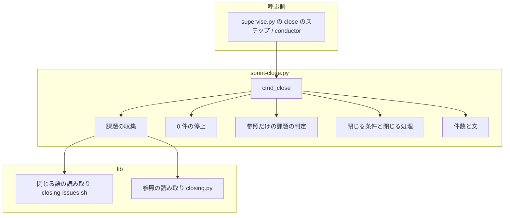
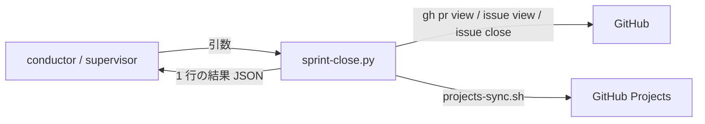
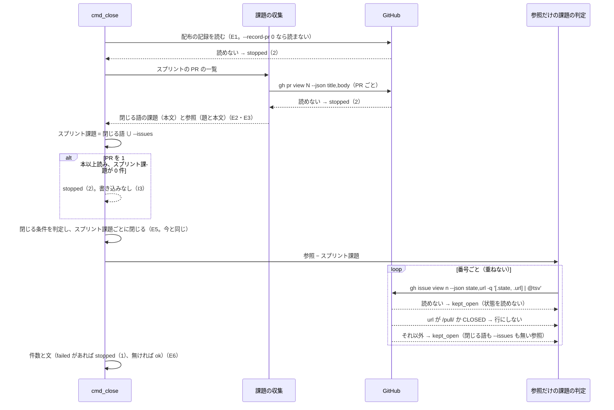

# スプリントを閉じる: 閉じる語の無い Pull Request が触れた課題が、閉じられも報告されもせずに消える → 参照だけの課題が理由つきで「開いたまま」に載り、閉じる課題が 0 件なら止まる（#767）

## 目的

- **何が壊れているか**: 「スプリントを閉じる」（`sprint-close.py`）は、スプリントの Pull Request の本文の閉じる語と `--issues` だけから課題を集める。閉じる語を伴わない参照（`Refs #554`・`- 課題: #1743`）は、結果 JSON のどの行にも現れない。集めた課題が 0 件でも「失敗 0 件」の `ok` で終わる
- **誰が困るか**: スプリントの最終工程を回す conductor と supervisor、その報告を読む利用者。PR #766 では 8 課題中 6 課題が、PR #1825 では閉じる語が 1 つも無く、漏れたことが報告から読めなかった
- **直すと何が成り立つか**: スプリントの Pull Request が番号で触れた開いた課題のうち閉じる対象に入らないものが、`kept_open` の行として理由つきで載る。閉じる課題が 0 件のときは何も書かずに止まり、`--issues` で渡し直すことを示す

## 適用範囲

- **働く範囲**: NDF を使うすべてのリポジトリ（`sprint-close.py` は配布物で、配布先のリポジトリでも同じに動く）
- **プロジェクトごとに違うもの**: 記録のリポジトリ（`--repo`、省けば `gh repo view`）だけを引数で受ける。設定は増やさない
- **当たるモード**: 「スプリントを閉じる」を通るすべてのモード（`standard` / `light` / `operation` / `legacy-refactor` の最終工程）

## あるべき姿の根拠

| 根拠 | 種類 | 何を示すか |
| --- | --- | --- |
| PR #766 の判定（14 本の PR から閉じる語で集まったのが 8 課題中 2 課題） | 実測 | 閉じる語だけでは漏れ、漏れは報告に出ない |
| PR #1825 の本文は異なる番号を 16 件参照し、閉じる語は 0 件（2026-10-08、下の「参照の読み方」の規則で数えた） | 実測 | 参照を読めば候補が出る。閉じる語 0 件のまま `ok` で終わる経路がある |
| `gh issue view 1825 --json state,url` は終了コード 0 で `{"state":"MERGED","url":".../pull/1825"}` を返し、存在しない番号は終了コード 1（2026-10-08） | 実測 | 参照した番号が Pull Request かどうかを、課題と同じ 1 回の読み取りで見分けられる |
| GitHub の閉じる語は Pull Request の本文とコミットメッセージで働き、題では働かない（`lib/closing-issues.sh` の冒頭の注記と同じ扱い） | 外部の一次情報 | 題は参照として読むが、閉じる語としては読まない |

要求と受け入れ条件は #767 の本文にある（コピーは `issues/issue-767-requirements.md`）。この文書は「どう作るか」だけを扱う。

## ドメインモデル

### コンテキスト

| コンテキスト | 何の語が 1 つの意味に決まるか |
| --- | --- |
| NDF の工程（`ndf-workflow`） | スプリント課題・閉じる語・参照だけの課題・閉じる条件 |

1 つのコンテキストに収まる。GitHub の課題と Pull Request は外部の系で、`gh` の出力をそのまま読む（順応者の関係にあたるが、コンテキストは 1 つなので宣言は要らない）。

### 集約

| 集約 | 持ち主（書き換えてよいもの） | 根 | エンティティ | 値オブジェクト |
| --- | --- | --- | --- | --- |
| スプリントの閉じる結果 | `sprint-close.py` の `cmd_close` | 結果（1 回の実行の結果 JSON） | 項目（課題 1 件の行。`(repo, number)` で識別） | 閉じる理由・`metrics` |
| GitHub の課題 | GitHub（`sprint-close.py` は `close_one` でスプリント課題だけを閉じる） | 課題 | — | 状態・URL |

参照だけの課題は、GitHub の課題を**読むだけ**で、書き換えない。

### 不変条件

| # | 集約 | 条件 | 破れたときの扱い |
| --- | --- | --- | --- |
| I1 | GitHub の課題 | 参照だけの課題には `gh issue close` もボードの書き込み（`projects-sync.sh`）も行わない | 実装の誤り。テストが落とす |
| I2 | スプリントの閉じる結果 | `items` の `kind: "issue"` の行は `(repo, number)` ごとに 1 件 | 実装の誤り。テストが落とす |
| I3 | スプリントの閉じる結果 | スプリントの Pull Request を 1 本以上読み、スプリント課題が 0 件なら、課題もボードも書かずに `stopped`（終了コード 2）で終わる | 実装の誤り。テストが落とす |
| I4 | スプリントの閉じる結果 | 参照だけの課題の行は、記録のリポジトリの、状態が `CLOSED` でない課題（URL に `/pull/` を含まない）だけ。他のリポジトリの参照は読まない | 当たらない番号は行にしない |
| I5 | スプリントの閉じる結果 | 参照だけの課題の状態を読めなくても、他の課題の処理と終了コードは変わらない | その番号を `kept_open`（理由: 状態を読めない）にして続ける |
| I6 | スプリントの閉じる結果 | 閉じる語は今と同じく本文だけから `lib/closing-issues.sh` で読む。題の閉じる語で課題を閉じない | 実装の誤り。テストが落とす |

### ドメインイベント

| # | イベント | 発生元 | 受け手 |
| --- | --- | --- | --- |
| E1 | 配布の記録を読んだ | `read_record` | 閉じる条件の判定（`_closing_blocker`）・スプリントの PR の一覧 |
| E2 | スプリントの Pull Request の題と本文を読んだ | `sprint_issues` | 閉じる語の収集・参照の読み取り（`closing.referenced_numbers`） |
| E3 | 閉じる語が指す課題と `--issues` の課題を集めた | `sprint_issues` と `cmd_close` | 0 件の停止の判定・閉じる処理（E5） |
| E4 | 参照だけの課題の状態を読んだ | `_referenced_items` | 結果 JSON（E6） |
| E5 | 閉じる条件を判定し、条件を満たす課題を閉じた | `_close_item` / `close_one` | 結果 JSON（E6） |
| E6 | 結果 JSON を出した | `cmd_close` | 呼ぶ工程（supervise.py の `close` のステップ・conductor） |

### 用語

| 用語 | 意味 | 用語集への反映 |
| --- | --- | --- |
| スプリント課題 | 「スプリントを閉じる」が閉じる対象にする課題。スプリントの Pull Request の本文の閉じる語が指す課題と、`--issues` で渡した課題の和 | 意味の変更（`ndf-workflow`。今は閉じる語だけで `--issues` を含まない） |
| 参照だけの課題 | スプリントの Pull Request の題か本文が番号で参照し、スプリント課題に入らない開いた課題 | 追加（要求の変更で反映済み） |
| 閉じる語 | `Closes` / `Fixes` / `Resolves` と活用形に続く課題の参照 | 追加（要求の変更で反映済み） |

## 機能一覧

| # | 機能 | 誰が使うか |
| --- | --- | --- |
| F1 | スプリントの Pull Request が参照したのに閉じる対象に入らない開いた課題を、理由つきで「開いたまま」として報告する | 「スプリントを閉じる」を回す conductor / supervisor と、報告を読む利用者 |
| F2 | 閉じる課題が 0 件のスプリントを、何も閉じずに止め、`--issues` で渡し直すことを示す | 同上 |
| F3 | 報告の件数に参照だけの課題の件数を載せる | 同上 |

## 構成要素

| 要素 | 責務 |
| --- | --- |
| 参照の読み取り（`lib/closing.py` の `referenced_numbers`） | 文字列から記録のリポジトリの課題の番号（`#<番号>` と課題の URL）を、重ねずに現れた順で返す。通信しない純粋な関数 |
| 課題の収集（`sprint-close.py` の `sprint_issues`） | スプリントの PR の題と本文を 1 回で読み、本文の閉じる語（`lib/closing-issues.sh`、今と同じ）と、題と本文の参照を返す |
| 0 件の停止（`sprint-close.py` の `cmd_close`） | スプリント課題が 0 件で PR を 1 本以上読んだら、書き込みの前に `stopped`（2）を出す |
| 参照だけの課題の判定（`sprint-close.py` の `_referenced_items`、新設） | 参照からスプリント課題を除き、1 番号につき `gh issue view --json state,url` を 1 回読んで、開いた課題を `kept_open` の行にする |
| 件数と文（`sprint-close.py` の `_close_summary`） | `metrics.referenced_only` を足し、`summary` に件数を入れる |
| 手順の文書（`progress-tracking` の「スプリントを閉じる」） | `stopped`（2）の行と `kept_open` の行に、新しい場合と理由を足す |
| 用語の文書（`development-workflow` の `references/glossary.md`） | 「スプリント課題」の意味を用語集と揃える |



図は実行時に動く要素だけを描く。手順の文書と用語の文書は図に含めない。

### 文脈と配置



配置は変わらない（呼ぶ側の端末の 1 プロセス）。新しく GitHub へ流れるのは参照だけの課題の読み取り（`gh issue view`）だけで、書き込みは増えない。

### 置き場所

```text
plugins/ndf/scripts/
├── sprint-close.py                         # 変える
├── lib/closing.py                          # referenced_numbers を足す
└── tests/
    ├── test_sprint_close_merge_green.py    # 偽の gh に題と本文の JSON の応答を足す（期待値は変えない）
    ├── test_sprint_close_references.py     # 新設（受け入れ条件）
    └── test_closing.py                     # 新設（参照の読み取り）
plugins/ndf/skills/
├── progress-tracking/SKILL.md              # 結果の表の 2 行
└── development-workflow/references/glossary.md  # スプリント課題
docs/glossary/glossary.json, docs/glossary.md     # スプリント課題（この設計の変更で反映）
```

## 入出力の契約

`sprint-close.py` の呼び出しの約束（コマンド）。OpenAPI の対象ではないため、この節の表で書く。

| 項目 | 内容 |
| --- | --- |
| 名前 | `sprint-close.py --record-pr <N> [--prs] [--issues] [--repo] [--with-verification] [--label] [--dry-run] [--root]` |
| 入力 | 変わらない |
| 出力（成功） | `items` に参照だけの課題の行 `{kind: "issue", repo, number, result: "kept_open", reason}` が、スプリント課題の行の後に、PR の並び・題・本文の順で現れた順に並ぶ。`reason` は `閉じる語も --issues も無い参照` か `状態を読めない（閉じる語も --issues も無い参照）`。`metrics.referenced_only`（整数）が増える。`metrics.kept_open` と `metrics.issues` は参照だけの課題を含む。`summary` は `…・開いたまま N 件（うち参照だけ M 件）` |
| 出力（停止） | スプリント課題が 0 件のとき `status: "stopped"`、`summary: "閉じる課題が 0 件（スプリントの PR <件数> 本に閉じる語が無く、--issues も無い）"`、`items: []`、`metrics: {issues: 0, prs: <件数>}`、`next: "閉じる課題を --issues で渡して打ち直す（PR が参照した番号: #a #b …）"`。参照が無ければ括弧を付けない |
| 失敗の形 | 新しい停止は終了コード 2（`EXIT_UNREADABLE`。既存の「一覧が取れない」と同じ値）。参照だけの課題は終了コードに効かない（I5）。そのほかは今と同じ |
| 互換性 | 引数は変わらず、`result` の値も増えない（`kept_open` を使う）。`metrics` はキーが 1 つ増えるだけ。**振る舞いが変わるのは、スプリント課題が 0 件のスプリントが `ok`（0）から `stopped`（2）になる 1 点**。supervise.py の `close` のステップは `new sprint --issue` の全課題を `--issues` で渡すため、この経路では起きない |

### 参照の読み方

| 形 | 読むか | 例 |
| --- | --- | --- |
| `#<番号>`（直前が英数字・`.`・`_`・`/`・`-` でなく、直後が英数字・`_` でない） | 読む | `Refs #554`・`関連 #550`・`課題#5`・`- 課題: #1743` |
| 記録のリポジトリの課題の URL（`https://github.com/<記録のリポジトリ>/issues/<番号>`、大文字小文字を区別しない） | 読む | — |
| 他のリポジトリの `<所有者>/<リポジトリ>#<番号>`・課題の URL | 読まない（前提 4） | `x/y#3` |
| `<記録のリポジトリ>#<番号>` | 読まない（前提 4 が挙げる 2 つの形に入らない） | `o/r#9` |
| Pull Request の URL・番号に英字が続くもの | 読まない | `.../pull/8`・`#123abc` |

`#<番号>` が Pull Request の番号でも、読む段階では区別しない。`gh issue view` の `url` が `/pull/` を含むものを、状態を読んだ後で外す（前提 5）。

## 処理の流れ



参照だけの課題の判定は、閉じる条件にも `--dry-run` にも左右されない（どちらでも `kept_open`）。書き込みをしないため、閉じる処理との前後は結果に影響しない。行の並びを「スプリント課題の後」に揃えるため、閉じる処理の後に置く。

## 非機能の実現方式

| 大項目 | 要求の条件 | 実現方式 | 確かめ方 |
| --- | --- | --- | --- |
| 性能・拡張性 | 参照だけの課題 1 件につき `gh` の呼び出しは状態の読み取り 1 回に収める。PR #1825 の本文は異なる番号を 16 件参照する（2026-10-08 実測）ため、スプリントの PR 1 本あたり数十回の読み取りを許容範囲とする | 参照を全 PR で重ねずに集め、スプリント課題を除いた番号だけを、`state` と `url` を 1 回の `gh issue view` で読む。PR の題と本文も 1 回の `gh pr view --json title,body` で読む（今の本文の読み取りを置き換え、回数は増えない） | 偽の gh の呼び出しの記録で、参照だけの課題 1 件あたりの `issue view` が 1 回で、`pr view` が PR 1 本あたり 1 回であることを見る |
| 運用・保守性 | 参照だけの課題は結果 JSON の `items` と `summary` だけに出し、課題・ボードへ書き込まない | 参照だけの課題の判定は `gh issue view` だけを呼び、`close_one` を通さない | 偽の gh の記録に、参照だけの課題への `issue close` と `projects-sync.sh` の呼び出しが無いことを見る |

## 決定の記録

### 決定 1: 閉じる語の判定を変えずに参照を足すため、参照の読み取りを `lib/closing.py` に置き、閉じる語は `lib/closing-issues.sh` のまま読む

`sprint-close.py` は Python で、Python の閉じる語の判定（`CLOSING`）は `lib/closing.py` にある。参照の読み取りを同じモジュールに置けば、閉じる語の正規表現の隣で「閉じる語でない参照」の規則を読める。bash の `closing-issues.sh` へ足すと、`grep -E` に後読みが無く、`x/y#3` の `#3` を外す規則を別の書き方で組むことになる。

`sprint-close.py` の閉じる語を `closing.py` へ切り替える案は採らない。`closing.py` の `[\w.-]` は日本語の文字にも当たり、`closing-issues.sh` の `[A-Za-z0-9._-]` と判定が食い違いうる。この変更の受け入れ条件は閉じる語の判定を変えないことを求めている（退行しない）。

根拠: Value 6（MVV 版 2）

### 決定 2: 閉じる語の読み方を GitHub と揃えるため、題は参照としてだけ読み、閉じる語は本文だけから読む

GitHub は題の閉じる語で課題を閉じない。題の `Fix #3` を閉じる語として読むと、マージで閉じない課題をスプリントが閉じる。参照としては、題にだけ番号がある PR（受け入れ条件の 3 つ目）を拾うために読む。

題と本文を 1 つの文字列へつないで `closing-issues.sh` へ渡す案は、題の閉じる語を拾うため採らない。

根拠: Value 6（MVV 版 2）

### 決定 3: 漏れを課題の書き込みなしに報告するため、参照だけの課題を既存の `kept_open` で載せ、`result` の値を増やさない

`kept_open` は「開いたまま残した」を意味し、参照だけの課題の扱いと一致する。区別は `reason` と `metrics.referenced_only` で付く。`kept_open` は止める理由にならない（`progress-tracking`）ため、棚卸しへの進み方も変わらない。

新しい値（`referenced_only` を `result` に置く）は、呼ぶ側の分岐を増やし、要求の境界で「確認してから行う」に当たるため採らない。

根拠: Value 2 / Value 1（MVV 版 2）

### 決定 4: 0 件の停止を書き込みの前で確かめるため、停止は参照の状態を読まずに出し、参照した番号は `next` の文へ並べる

止まる経路で `gh issue view` を数十回打つと、止まるまでの時間が延びるうえ、`items` が停止の理由（閉じる課題が 0 件）と別の内容で埋まる。参照した番号を文として並べれば、運用者は `--issues` へ渡す候補を見られる。番号の中に Pull Request や閉じた課題が混ざりうることは、渡す側が選ぶ前提で許す。

停止の前に参照の状態を読んで `items` に載せる案は、要求のドメインイベントの順序（E3 で止まり、E4 へ進まない）と食い違うため採らない。

根拠: Value 2 / Value 4（MVV 版 2）

### 決定 5: 設定を増やさずにどのリポジトリでも働かせるため、マイルストーンで絞り込む `--milestone` を足さない

参照は PR が書いた番号に限られ、スプリントの外の課題が数十件並ぶことは起きにくい（PR #1825 で 16 件、うち閉じる対象と重なるものを除く）。マイルストーンを使わないプロジェクトでは絞り込みが効かず、選択肢を足すと呼ぶ側の雛形にも引数が要る。

要求の未決の 1 つ目で、承認ゲート 1 で承認者が決める。足すと決まれば、`_referenced_items` の前で番号を絞る 1 段を足す形で入る（他の節は変わらない）。

根拠: Value 5（MVV 版 2）

### 決定 6: 偽の gh の分岐を増やさずに状態と種別を 1 回で読むため、`gh issue view --json state,url -q '[.state, .url] | @tsv'` で読む

1 行のタブ区切りで返り、Pull Request は `MERGED\thttps://…/pull/N` になる（2026-10-08 実測）。`-q` を付けた形は既存の偽の gh（`issues` の値を文字列で返す）にそのまま答えられ、URL の無い応答は課題として扱える。

スプリントの PR の読み取りは `--json title,body` の JSON にする。`-q` で題と本文を 1 つの文字列へつなぐと、決定 2 のとおり閉じる語の読み取りへ題が混ざる。偽の gh には `title,body` の分岐を 1 つ足す（期待値は変えない）。

根拠: Value 3（MVV 版 2）

## テスト設計

| 受け入れ条件・不変条件 | どの振る舞いで縛るか | どう壊したら落ちるべきか |
| --- | --- | --- |
| 受け入れ 1（`Closes #1` と `Refs #2`、`--dry-run`） | #1 が `would_close`、#2 が `kept_open` で `reason` が「閉じる語も `--issues` も無い参照」を含む | 参照を読まない・#2 を `would_close` にする |
| 受け入れ 2・I1（`--dry-run` なし） | #1 が `closed`、#2 が `kept_open`。#2 への `issue close` と `projects-sync.sh` が呼ばれない | 参照だけの課題を `close_one` に通す |
| 受け入れ 3（題にだけ参照） | 題の `#3` が `kept_open` で載る | 本文だけを読む |
| I6（題の閉じる語） | 題の `Fixes #4` は `kept_open`（参照）になり、閉じない | 題と本文をつないで閉じる語を読む |
| 受け入れ 4・I4（PR と閉じた課題） | `url` が `/pull/` の番号と `CLOSED` の課題は `items` に無い | 種別か状態を見ない |
| 受け入れ 5・I2（`--issues` と重なる） | 同じ番号の行は 1 件で、`--issues` 側の結果になる | 参照からスプリント課題を引かない |
| 受け入れ 6・I2（同じ番号を 2 回） | `items` の同じ番号は 1 件、`issue view` も 1 回 | 参照を重ねて集める |
| 受け入れ 7・I5（状態を読めない） | その番号は `kept_open`（状態を読めない）、他の課題は閉じ、終了コード 0 | 読めない番号で止まる・`failed` にする |
| 受け入れ 8・I4（他のリポジトリ） | `x/y#3` と `o/r#9` は `items` に無い | 後読みを外して `#3` を読む |
| 受け入れ 9（件数） | `metrics.referenced_only` が参照だけの課題の行数と等しく、`summary` にその数が入る | キーを足さない・数え違える |
| 受け入れ 10・I3（0 件で止まる） | `stopped`・終了コード 2、`summary` に「閉じる課題が 0 件」、`next` に `--issues`。`issue close` も `projects-sync.sh` も呼ばれない | 0 件で `ok` を返す・停止を書き込みの後に置く |
| 受け入れ 11（`--issues 5` を足す） | 止まらずに #5 を閉じる | `--issues` を 0 件の判定に入れない |
| 受け入れ 12（本番の前） | 参照だけの課題も `kept_open` で載り、何も閉じない | 閉じる条件に当たらないとき参照の判定を飛ばす |
| 受け入れ 13（退行しない） | 既存の 4 つのテストファイルと `tests/fixtures/supervise-contract/` が期待値を変えずに通る。`test_sprint_close_merge_green.py` の「スプリントの PR を読まない」断言は、PR の読み取りの新しい形（`--json title,body`）で読み直す（古い形のままだと空振りで通る） | 閉じる語の判定・結果の並びを変える |
| 受け入れ 14（PR #766 の再現） | 閉じる語が #561 #623、`Refs #554`・`関連 #550`・本文中の `#540` の並びで、#554 #550 #540 が `kept_open` | 日本語の直後の `#` を読まない |
| 参照の読み方（`referenced_numbers` の単体） | 上の「参照の読み方」の表の各行の例が、読む・読まないのとおりに返る。現れた順で重ならない | 後読み・直後の条件・URL のリポジトリの照合のどれかを外す |
| 性能（非機能） | 参照だけの課題 1 件あたり `issue view` 1 回、PR 1 本あたり `pr view` 1 回 | 状態と URL を別々に読む・PR を 2 回読む |

## 設計の結果

| 課題 | 扱い | 取り込み先 | 触るファイル |
| --- | --- | --- | --- |
| #767 | 実装する | — | `plugins/ndf/scripts/sprint-close.py`、`plugins/ndf/scripts/lib/closing.py`、`plugins/ndf/scripts/tests/`、`plugins/ndf/skills/progress-tracking/SKILL.md`、`plugins/ndf/skills/development-workflow/references/glossary.md` |

## 未確認のまま残ること

| 項目 | 内容 |
| --- | --- |
| マイルストーンでの絞り込み | 決定 5。承認ゲート 1 で承認者が決める |
| コードブロックの中の参照 | 本文のコードブロックやログの引用にある `#<番号>` も参照として読む。参照だけの課題が増えるだけで閉じはしない（I1）。実際の件数はリリース後テストの「スプリントを閉じる」で見る |
| `<記録のリポジトリ>#<番号>` の形 | 前提 4 に従い読まない。この形で参照する PR が現れたら、読む形へ足すかを課題にする |
| 本番での件数 | 参照だけの課題が実際のスプリントで何件並ぶかは、リリース後テストで結果 JSON を見て確かめる（要求の「検証手段」の手動確認） |
