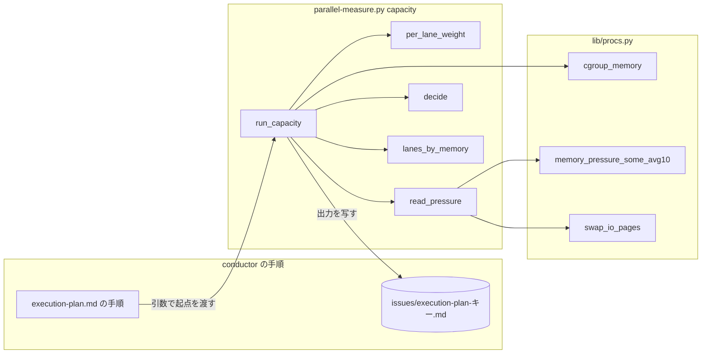
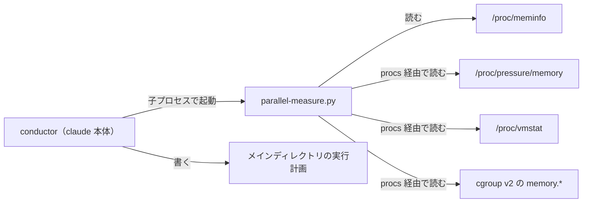
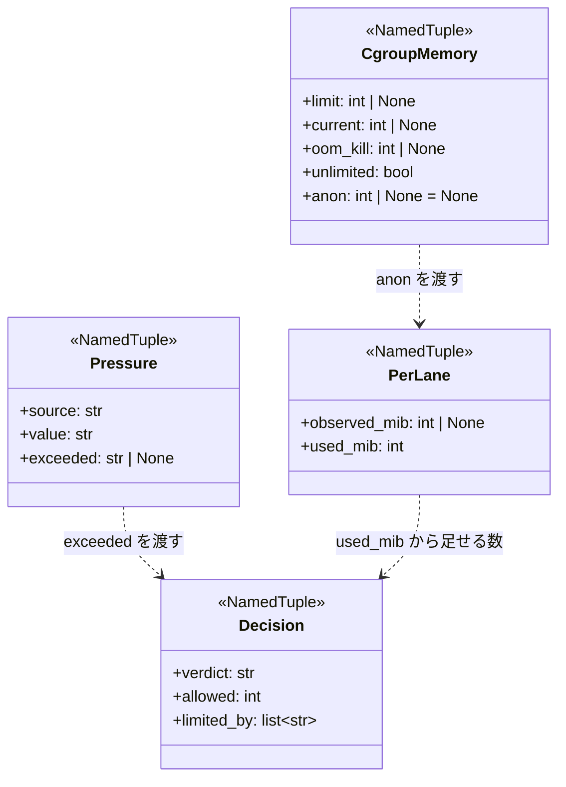
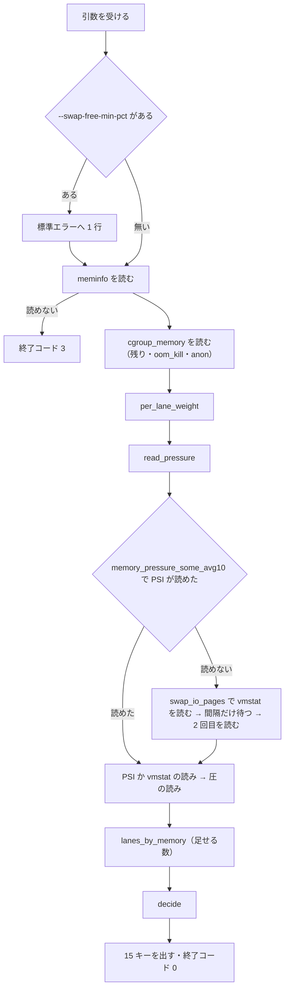

# parallel-measure capacity: メモリ圧の無いホストでも並列の本数が 1 に固定される → 1 本の重さの実測といまの圧で本数を決め、空きのあるホストで 2 本以上を起動できる（#780）

## 目的

- **何が壊れているか**: `parallel-measure.py capacity` が、予備メモリの二重計上・1 本の見込みの過大・`SwapFree` の残量判定の 3 つを重ね、PSI 0.00 のホストでも `allowed=1` を返す
- **誰が困るか**: 実行計画で supervisor を並べる conductor。並列の仕組み（#540 #550 #621）が常に逐次で動き、利用者は `--swap-free-min-pct 0` を毎回付けるか 1 本で進めるかになる
- **直すと何が成り立つか**: 本数が「いまの圧」と「動いている担当から測った 1 本の重さ」で決まり、出力の 1 行から理由が読め、「測った値」の表に 1 本の実測が残る

## 適用範囲

- **働く範囲**: 配布先のリポジトリでも働く（`parallel-measure.py` と `issue-plan-strategy` の手順は NDF の配布物）
- **プロジェクトごとに違うもの**: ホストの空き・圧・1 本の重さは実行のたびに測る。初期値は引数で上書きする（設定ファイルは足さない）
- **当たるモード**: `standard`（実行計画を作るスプリントの運転）

## あるべき姿の根拠

| 根拠 | 種類 | 何を示すか |
| --- | --- | --- |
| 2026-09-19 02:30Z のホストで PSI some/full がすべて 0.00、`pswpin + pswpout` が 10 秒で 6 ページ、`SwapFree` 0 MiB（#780 の表） | 実測 | `SwapFree` の残量は圧ではなく履歴であり、圧は PSI とスワップ I/O で読める |
| 同じホストで cgroup の `anon` の 5 秒間の揺れが 3 MiB、`memory.current` はページキャッシュを含む（#780 の「1 本の重さを測る仕組み」） | 実測 | 1 本の重さは `memory.stat` の `anon` の差で測れる |
| 2026-10-06 の設計時のホストで `/proc/pressure/memory` が `some avg10=0.05 avg60=0.83 avg300=1.18 total=…` の 2 行、`/proc/vmstat` に `pswpin` / `pswpout` の行、cgroup の `memory.stat` に `anon <バイト>` の行 | 実測 | 読み取りの形（下の「入出力の契約」）が実ホストの形と一致する |
| Linux の PSI の文書（`Documentation/accounting/psi.rst`）: `some` は少なくとも 1 つのタスクがメモリ待ちで止まった時間の割合 | 外部の一次情報 | `some avg10` が「いま stall しているか」を表す |

要求と受け入れ条件は #780 の本文にある（コピーは `issues/issue-780-requirements.md`）。この文書は「どう作るか」だけを扱う。

## ドメインモデル

### コンテキスト

| コンテキスト | 何の語が 1 つの意味に決まるか |
| --- | --- |
| `ndf-workflow` | 実行計画・本数・予備メモリ・1 本の重さ・anon の起点・判定の区分 |

1 つのコンテキストに収まる。

### 集約

| 集約 | 持ち主（書き換えてよいもの） | 根 | エンティティ | 値オブジェクト |
| --- | --- | --- | --- | --- |
| 本数の判定 | `parallel-measure.py capacity`（1 回の実行の中だけで作り、出力して捨てる） | 判定（`allowed` と `limited_by`） | — | 空き・1 本の重さ（実測と使った値）・圧の読み・判定の区分 |
| 実行計画 | conductor（オーケストレーター） | 実行計画のファイル | 行・測った値の行 | oom_kill の起点・anon の起点・閉じたときの測定 |
| cgroup の使用量の読み | `lib/procs.py` | `CgroupMemory` | — | 上限・使用量・oom_kill・anon |

本数の判定は実行計画を ID（ファイルの値を引数で受け取る）でしか参照しない。`capacity` は実行計画を読まず書かず、conductor が出力を写す。

### 不変条件

| # | 集約 | 条件 | 破れたときの扱い |
| --- | --- | --- | --- |
| I1 | 本数の判定 | 区分が `shrink` でなければ `allowed ≥ 1` | 1 へ上げ、`limited_by` に `floor` を付ける |
| I2 | 本数の判定 | 区分が `shrink` なら `allowed ≤ max(0, running − 1)` | 起こらない形にする（区分の優先で `shrink` を先に決める） |
| I3 | 本数の判定 | 区分が `hold` なら `allowed ≤ max(running, 1)`（足さない） | 同上 |
| I4 | 本数の判定 | 区分が `grow` なら `allowed − running ≤ --max-add` | 同上 |
| I5 | 本数の判定 | `swap_free_mib` の値が `allowed` を変えない | 同上 |
| I6 | 本数の判定 | `per_lane_used_mib ≥ --per-lane-min-mib ≥ 1` | `--per-lane-min-mib 0` は引数の誤り（終了コード 2） |
| I7 | 本数の判定 | `--max` を渡したときだけ `allowed ≤ max(--max, 1)`、渡さなければ総本数の上限が掛からない | 同上 |
| I8 | 本数の判定 | 出力の既存の 10 キーが同じ名前・同じ順で先に並び、新しいキーは末尾 | 同上 |
| I9 | 本数の判定 | 初期値（8 つ）を持つのは `parallel-measure.py` の定数だけ | 文書に数値を写さない |
| I10 | 実行計画 | `oom_kill` の増加で `oom_kill の起点` を更新しても、`anon の起点` は変えない | 手順が起点の行を 1 つだけ更新する |
| I11 | cgroup の使用量の読み | `anon` を足しても、既存の 4 つの値の読み方と、4 引数で作る `CgroupMemory` が変わらない | `anon` を既定値 `None` の 5 つ目の欄にする |

### ドメインイベント

| # | イベント | 発生元 | 受け手 |
| --- | --- | --- | --- |
| E1 | 実行計画の開始時に `capacity --running 0` を測った | conductor | conductor（E2） |
| E2 | `oom_kill` の起点と `anon` の起点を実行計画の先頭へ写した | conductor | 以後の見直し（E4 の引数） |
| E3 | `allowed − running` の数だけ supervisor を起動した | conductor | supervisor |
| E4 | 見直しで `capacity --running N --oom-baseline … --anon-baseline-mib …` を測った | conductor | `capacity`（E5・E6） |
| E5 | 1 本の重さを `(anon − 起点) ÷ running` から測った | `capacity` | `capacity`（E7） |
| E6 | 圧を判定した（PSI、無ければスワップ I/O） | `capacity` | `capacity`（E7） |
| E7 | 判定の区分と `allowed` を出した | `capacity` | conductor（E3・E8） |
| E8 | 出力を「測った値」の表へ 1 行写した | conductor | conductor（E9） |
| E9 | 閉じるときに 1 本の実測の最大を「閉じたときの測定」へ写した | conductor | 次のスプリントの振り返り（初期値の見直し） |

### 用語

| 用語 | 意味 | 用語集への反映 |
| --- | --- | --- |
| 予備メモリ | 同じ VM に常駐する他のプロセスの揺れのために空けておくメモリ。既に動いているオーケストレーターの本体と担当は `MemAvailable` から引かれているため含めない | 意味の変更（`ndf-workflow`） |
| 1 本の重さ | 担当 1 つが使う cgroup の `anon` の量。実測（`per_lane_observed_mib`）と、判定に使った値（`per_lane_used_mib`）を分けて出す | 要求の変更で追加済み |
| anon の起点 | 実行計画の開始時（動いている本数が 0）に測った cgroup の `anon`。1 本の重さを測る差の基準 | 要求の変更で追加済み |
| 判定の区分 | `capacity` が本数を決めた理由の区分。`grow` / `hold` / `shrink` | 要求の変更で追加済み |

## 機能一覧

| # | 機能 | 誰が使うか |
| --- | --- | --- |
| F1 | 圧が無いときに、空きと 1 本の重さから足せる数を出す（`grow`） | conductor |
| F2 | いま圧があるときに、今の本数を超えて足さない（`hold`） | conductor |
| F3 | OOM Killer が増えたときに 1 本減らす（`shrink`。既存） | conductor |
| F4 | 動いている担当から 1 本の重さを測り、出力に残す | conductor・振り返り |
| F5 | 廃止した `--swap-free-min-pct` を受けて知らせ、無視する | 既存の呼び出し |
| F6 | 実行計画に anon の起点・1 本の重さの 3 列・閉じたときの最大を残す | conductor・振り返り |

## 構成要素

| 要素 | 責務 | 変更 |
| --- | --- | --- |
| `lib/procs.py` の `cgroup_memory` | cgroup の `memory.stat` の `anon` をバイトで返す（読めなければ `None`） | 変える |
| `lib/procs.py` の `memory_pressure_some_avg10`（新設） | PSI のファイルから `some` の行の `avg10` を小数で返す（読めなければ `None`） | 足す |
| `lib/procs.py` の `swap_io_pages`（新設） | vmstat のファイルから `pswpin + pswpout` を整数で返す（読めなければ `None`） | 足す |
| `parallel-measure.py` の定数 | 8 つの初期値を持つ。`DEFAULT_MAX_LANES` / `DEFAULT_SWAP_FREE_MIN_PCT` を消す | 変える |
| `parallel-measure.py` の `per_lane_weight`（新設） | anon・起点・`running`・山への余裕・下限・見込みから、実測と使う値を出す（純粋な計算） | 足す |
| `parallel-measure.py` の `read_pressure`（新設） | PSI を読み、無ければ vmstat を間隔を挟んで 2 回読み、圧の読み（源・値・超えたか）を返す | 足す |
| `parallel-measure.py` の `decide`（新設） | 足せる数・圧・`oom_kill` から区分と `allowed` と `limited_by` を出す（純粋な計算） | 足す |
| `parallel-measure.py` の `run_capacity` / `build_parser` | 引数を受け、上の 3 つを呼び、15 キーを出す。廃止の引数を知らせる | 変える |
| `parallel-measure.py` の `lanes_by_memory` | 足せる数の式（`running + ⌊(空き − 予備) ÷ 1 本の重さ⌋`）。式は変えず、割る数が使う値になる | 変えない |
| `issue-plan-strategy/references/execution-plan.md` | 文書の形（先頭の起点・測った値の 3 列・閉じたときの列）、`capacity` の呼び方、写すキー、閉じる手順 | 変える |
| `docs/specifications/ndf-execution-plan-and-parallel-capacity.md` | 初期値の表・引数・出力・式・テスト観点 | 変える |
| `docs/glossary/glossary.json`（と生成する `docs/glossary.md`） | 「予備メモリ」の意味の変更 | 変える |

### 構成要素図



### システムの文脈と配置



すべて conductor と同じホスト（コンテナ）で動く。書き込みは conductor の実行計画だけで、`capacity` は読み取りだけである。

### パッケージ構成

```text
plugins/ndf/
├── scripts/
│   ├── parallel-measure.py          # 判定・定数・引数・出力
│   ├── lib/procs.py                 # anon・PSI・vmstat の読み取り
│   └── tests/
│       ├── test_parallel_measure.py # CLI 実行の検査
│       └── test_lib_procs.py        # 読み取りの検査
└── skills/issue-plan-strategy/references/execution-plan.md
docs/
├── specifications/ndf-execution-plan-and-parallel-capacity.md
├── glossary/glossary.json
└── glossary.md                      # glossary.py render の生成物
```

### 既存の規則への当てはめ

`limited_by` の値の集合から `swap_low` を除き `max_add` / `hold_psi` / `hold_swap_io` を足すため、集合を前提にした規則を集めた。`swap_low` と `limited_by` と `--swap-free-min-pct` で配布物を検索し、`capacity` の出力を読む手順（`execution-plan.md` の「起動の前に本数を測る」「見直す」「oom_kill が増えていたとき」）を読んだ。

| 規則 | 置き場 | 当てはまるか | 扱い |
| --- | --- | --- | --- |
| 文書の形の例の行 `memory,max,swap_low` | `execution-plan.md` の「文書の形」 | 当てはまらない | 新しい出力の例へ書き換える（構成要素の表の `execution-plan.md`） |
| 上書きできる引数の一覧 `--max` / `--swap-free-min-pct` | `execution-plan.md` の「起動の前に本数を測る」 | 当てはまらない | 同上 |
| `limited_by` の値と順の定義、`swap_low` の式 | 確定仕様の「データ・設定」 | 当てはまらない | 確定仕様を書き換える |
| 初期値を持つのはコマンドの定数だけ | 確定仕様の「常に成り立つ条件」、`parallel-measure.py` の docstring | 当てはまる（列挙する値の名前だけを直す） | 確定仕様の書き換えに含める |
| `oom_kill_increased=yes` の見直しでは起動しない | `execution-plan.md` の「oom_kill が増えていたとき」 | 当てはまる（`shrink` の区分と同じ） | 起点の更新の手順に「anon の起点は変えない」を足す（I10） |
| 終了コード 3 なら 1 本 | `execution-plan.md` の終了コードの表 | 当てはまる | 変えない |
| `script-structure-allow` の `proc-fs` の許可（`--meminfo` だけを残す理由） | `scripts/script-structure-allow/plugins__ndf__scripts__parallel-measure.py--proc-fs--wrapped.json` | 当てはまる（新しい `/proc/` の読み取りは procs へ置く。決定 1） | 変えない |
| 過去の版の記録の `swap_low` | `docs/ndf-version-decisions-v10.15-v10.16.md` | 当てはまる（リリース済み版の記録） | 変えない |

## 構造



`PerLane` / `Pressure` / `Decision` は `parallel-measure.py` の中に置く。`Pressure.source` は `psi` / `swap_io` / `unknown`、`Pressure.exceeded` は超えたときの `limited_by` の値（`hold_psi` / `hold_swap_io`）で、超えなければ `None` である。

## 入出力の契約

### `parallel-measure.py capacity`

| 項目 | 内容 |
| --- | --- |
| 名前 | `python3 plugins/ndf/scripts/parallel-measure.py capacity [引数]` |
| 互換性 | 既存の引数はすべて受け付け、既存の出力キーは同じ順で先に並ぶ。`--max` の既定が無くなり、`--swap-free-min-pct` は知らせて無視する。`limited_by` の値の集合が変わる |

#### 引数

| 引数 | 型 | 既定 | 変更 | 意味 |
| --- | --- | --- | --- | --- |
| `--running N` | 0 以上の整数 | 0 | — | 動いている担当の数 |
| `--oom-baseline N` | 0 以上の整数 | なし | — | `oom_kill` の起点 |
| `--anon-baseline-mib N` | 0 以上の整数 | なし | 足す | anon の起点（MiB） |
| `--reserve-mib N` | 0 以上の整数 | 定数 | 初期値を変える | 予備メモリ |
| `--per-lane-mib N` | 1 以上の整数 | 定数 | 初期値を変える | 実測を使えないときの 1 本の見込み |
| `--per-lane-min-mib N` | 1 以上の整数 | 定数 | 足す | 1 本の重さの下限 |
| `--peak-factor X` | 0 より大きい小数 | 定数 | 足す | 実測に掛ける山への余裕 |
| `--max-add N` | 0 以上の整数 | 定数 | 足す | 1 回の見直しで足す数の上限 |
| `--max N` | 0 以上の整数 | **なし** | 既定を消す | 総本数の上限。渡したときだけ効く |
| `--psi-some-max X` | 0 以上の小数 | 定数 | 足す | PSI の `some avg10` の閾値 |
| `--swap-io-max-pages-per-sec N` | 0 以上の整数 | 定数 | 足す | スワップ I/O の閾値（ページ/秒） |
| `--sample-seconds X` | 0 以上の小数 | 定数 | 足す | vmstat の 2 回の読み取りの間隔 |
| `--meminfo PATH` | パス | `/proc/meminfo` | — | 空きとスワップを読む元 |
| `--cgroup-dir DIR` | パス | 導く | 読むファイルに `memory.stat` が増える | cgroup の位置 |
| `--psi PATH` | パス | procs の定数 | 足す | PSI を読む元 |
| `--vmstat PATH` | パス | procs の定数 | 足す | スワップ I/O の 1 回目を読む元 |
| `--vmstat-after PATH` | パス | `--vmstat` と同じ | 足す | スワップ I/O の 2 回目を読む元（決定 6） |
| `--swap-free-min-pct V` | 任意の文字列 | なし | 廃止 | 受けて標準エラーへ 1 行知らせ、無視する（決定 7） |

`--per-lane-mib 0` / `--per-lane-min-mib 0` / `--peak-factor` が 0 以下は引数の誤り（終了コード 2）。8 つの初期値の名前は `DEFAULT_RESERVE_MIB` / `DEFAULT_PER_LANE_MIB` / `DEFAULT_PER_LANE_MIN_MIB` / `DEFAULT_PEAK_FACTOR` / `DEFAULT_MAX_ADD` / `DEFAULT_PSI_SOME_MAX` / `DEFAULT_SWAP_IO_MAX_PAGES_PER_SEC` / `DEFAULT_SAMPLE_SECONDS` で、値は要求の前提 1 のとおりにする。PSI と vmstat の既定のパスは `procs` の定数 `PROC_PRESSURE_MEMORY` / `PROC_VMSTAT` が持つ。

#### 出力

標準出力に `キー=値` を次の順で 1 行ずつ出す。1〜10 は既存のまま。

| # | キー | 値 |
| ---: | --- | --- |
| 1〜7 | `mem_available_mib` … `running` | 既存のまま |
| 8 | `by_memory` | `running + max(0, ⌊(空き − 予備) ÷ per_lane_used_mib⌋)`。割る数だけが変わる |
| 9 | `allowed` | 下の判定の結果 |
| 10 | `limited_by` | 下の判定で付いた値を `,` で並べる |
| 11 | `cgroup_anon_mib` | `memory.stat` の `anon` を MiB へ切り捨て。読めなければ `unknown` |
| 12 | `per_lane_observed_mib` | 実測を使える（`running ≥ 1`・起点あり・anon が読めた）とき `max(0, ⌈(anon − 起点) ÷ running⌉)`。使えなければ `unknown` |
| 13 | `per_lane_used_mib` | 実測を使えるとき `max(--per-lane-min-mib, ⌈max(0, anon − 起点) × --peak-factor ÷ running⌉)`、使えなければ `--per-lane-mib` |
| 14 | `verdict` | `grow` / `hold` / `shrink` |
| 15 | `pressure` | `psi:<some avg10 の原文>` / `swap_io:<ページ/秒、小数 1 桁>` / `unknown` |

12 と 13 の丸めは決定 3 にある。

#### 判定

```text
空き          = min(mem_available, cgroup_available)  （cgroup_available が数値のときだけ）
足せる数      = max(0, ⌊(空き − 予備) ÷ per_lane_used⌋)
区分          = oom_kill_increased が yes        → shrink
                圧が閾値を超えた                 → hold
                それ以外（圧が unknown を含む）  → grow
仮の本数      = shrink: max(0, running − 1) / hold: running / grow: running + min(--max-add, 足せる数)
--max を渡した = 仮の本数 > --max なら --max へ下げる
区分が shrink でなく本数 < 1 なら 1 へ上げる
```

| 値 | 付く条件 |
| --- | --- |
| `memory` | 区分が `grow`（足せる数が本数を決めた） |
| `max_add` | 区分が `grow` で、`--max-add < 足せる数` |
| `max` | `--max` で本数を下げた |
| `hold_psi` / `hold_swap_io` | 区分が `hold`。圧の源で分ける |
| `oom_kill_increased` | 区分が `shrink` |
| `floor` | 1 へ上げた |

`limited_by` には表の上から順に、付いたものを並べる。圧の判定は「`some avg10` > `--psi-some-max`」と「`(2 回目 − 1 回目) ÷ 間隔` > `--swap-io-max-pages-per-sec`」で、等しいときは超えない。間隔が 0 のときは差をそのまま毎秒の値として扱う（決定 6）。

#### 失敗の形

| 状況 | 終了コード | 出力 |
| --- | ---: | --- |
| 測れた（`unknown` を含む） | 0 | 15 キー |
| 引数の誤り | 2 | 標準エラーに理由 |
| `--meminfo` を読めない・`MemAvailable` が無い | 3 | 標準出力は空（既存） |
| PSI と vmstat がどちらも読めない | 0 | `verdict=grow`・`pressure=unknown` |
| PSI が読めない・形が違う | 0 | vmstat へ落ちる |
| `memory.stat` が無い・`anon` の行が無い | 0 | `cgroup_anon_mib=unknown`、1 本の重さは見込み |

### `procs` の読み取り

| 関数 | 入力 | 出力 | 失敗の形 |
| --- | --- | --- | --- |
| `cgroup_memory(directory)` | cgroup の位置 | `CgroupMemory`。`anon` は `memory.stat` の `anon <バイト>` の行 | `memory.stat` が読めない・行が無い・数値でない → `anon=None`。ほかの 4 つは既存のまま |
| `memory_pressure_some_avg10(path=PROC_PRESSURE_MEMORY)` | PSI のファイル | `some` の行の `avg10=` の値（`str`。原文を保ち、比べるときに小数へ直す） | 読めない・`some` の行が無い・`avg10` が小数でない → `None` |
| `swap_io_pages(path=PROC_VMSTAT)` | vmstat のファイル | `pswpin` と `pswpout` の和 | 読めない・どちらかの行が無い・数値でない → `None` |

### 実行計画の形（`execution-plan.md`）

| 箇所 | 変更 |
| --- | --- |
| 先頭 | `oom_kill の起点` の次の行に `anon の起点: <cgroup_anon_mib>`。開始時の測定から写す。`unknown` なら `unknown` と書き、以後 `--anon-baseline-mib` を渡さない |
| `capacity` の呼び方 | `--anon-baseline-mib <anon の起点>` を足す。起点が `unknown` か無い（既存の計画）なら渡さない |
| 上書きできる引数の一覧 | `--swap-free-min-pct` を消し、`--per-lane-min-mib` / `--peak-factor` / `--max-add` / `--max` / `--psi-some-max` / `--swap-io-max-pages-per-sec` / `--sample-seconds` を載せる。数値は書かない |
| 「測った値」の表 | 列 `anon（MiB）` / `1 本の実測（MiB）` / `1 本の見込み（MiB）` を「決めた条件」の後へ足す。キーとの対応表に 3 行を足す |
| 写さないキー | `verdict`（`limited_by` から導ける）と `pressure`（閾値を超えたときは `limited_by` に現れる）を足す |
| 例の行 | `2026-09-17T03:00Z | 9742 | max | 310 | 1 | 0 | 2 | memory,max_add | 2193 | unknown | 1536 | G2-設計` の形へ直す |
| 「oom_kill が増えていたとき」 | 起点の更新は `oom_kill の起点` だけで、`anon の起点` は変えないと書く |
| 「閉じたときの測定」 | 列 `1 本の実測の最大（MiB）` を足す。閉じる手順 1 に「『測った値』の表の `1 本の実測` の最大。数値の行が無ければ `—`」を足す |

## 処理の流れ



文書の構成要素（`execution-plan.md`・確定仕様・用語集）はこの図に含めない。conductor の側の順序（E1〜E9）は変えない。開始時の測定の後に写す起点が 1 行増え（E2）、見直しの `capacity` に引数が 1 つ増え（E4）、閉じるときに列が 1 つ増える（E9）。

## 非機能の実現方式

| 大項目 | 要求の条件 | 実現方式 | 確かめ方 |
| --- | --- | --- | --- |
| 性能・拡張性 | PSI が読めるホストでは `capacity` が待たずに返る。PSI が無いホストだけ、スワップ I/O の標本の間隔だけ待つ | `read_pressure` は PSI が読めたら vmstat を読まずに返す。待つのは vmstat の 2 回の間だけ | 実ホストで `time python3 plugins/ndf/scripts/parallel-measure.py capacity --running 0` が 1 秒未満。検査では `--psi` に無いパスと `--sample-seconds 0` を渡して待たずに `swap_io` の区分を作る |
| 運用・保守性 | 「測った値」の表の 1 行から、判定の区分・効いた条件・1 本の重さが読める。初期値はスクリプトの定数だけが持つ | 区分は `limited_by` の値（`hold_*` / `oom_kill_increased` / それ以外は `grow`）から読め、1 本の重さは 3 列が持つ。定数は `parallel-measure.py` の先頭の 8 つだけ | 検査で 3 区分の `limited_by` を確かめる。`execution-plan.md` と `parallel-work.md` に初期値の数値が無いことを読んで確かめる |
| 移行性 | 既存の実行計画は「anon の起点」が無いまま読める。廃止した `--swap-free-min-pct` を渡す既存の呼び出しも終了コード 0 で動く | 起点が無ければ `--anon-baseline-mib` を渡さず、`per_lane_used_mib` は見込みになる。廃止の引数は値を問わず受ける | 検査で `--swap-free-min-pct 25` を渡して終了コード 0・判定が同じ・標準エラーが 1 行 |
| システム環境 | Linux（cgroup v2 / PSI）で全機能、PSI の無いカーネルではスワップ I/O、`/proc/meminfo` の無い環境では終了コード 3 | 圧の源を PSI → vmstat → `unknown` の順に落とす。meminfo は既存の `read_meminfo` | 検査で 3 つの源それぞれを差し替えて作る |

## 決定の記録

### 決定 1: `/proc/` を読むのを 1 か所に保つため、PSI と vmstat の読み取りを `lib/procs.py` に置く

構造チェックの I14 は `/proc/` の文字列を `lib/procs.py` だけに許し、`parallel-measure.py` の `--meminfo` は許可ファイルで例外にしている。PSI と vmstat を `parallel-measure.py` に書くと例外が 2 つ増え、cgroup の読み取りを procs へ寄せた #1142 の方向と逆になる。既定のパスも procs の定数に置き、`parallel-measure.py` は引数の既定として参照するだけにする。

psutil の `swap_memory()` の `sin` / `sout` は vmstat の値をバイトで返すが、読む元を差し替えられず、検査が実ホストの `/proc` を読まずに区分を作れない（受け入れ条件）ため採らない。

根拠: Value 6 / Value 5（MVV 版 2）

### 決定 2: 本数の理由を 1 行で読めるようにするため、区分を優先順位で 1 つに決め、その後に `--max` と下限だけを共通に当てる

区分は `shrink` → `hold` → `grow` の順に最初に当たったものにする。落ちたことは圧より強い事実で、圧は空きより新しい事実である。区分ごとに仮の本数を出した後、`--max` と下限 1（`shrink` を除く）を全区分に同じ形で当てる。こうすると `limited_by` は「区分の値 1 つ + 共通の 2 つ」になり、いまの `swap_low` と `floor` が重なって意味が読めない形が起きない。

`hold` で今の本数から減らす形は採らない。圧は落ちる前の兆しで、動いている担当を止める手順は `shrink` だけが持つ（測定は拒否しない設計の決定）。

根拠: Value 3 / Value 7（MVV 版 2）

### 決定 3: 1 本の重さを軽く見積もらないため、実測と使う値をどちらも切り上げ、丸める前の差から計算する

`per_lane_observed_mib = ⌈(anon − 起点) ÷ running⌉`、`per_lane_used_mib = ⌈(anon − 起点) × 余裕 ÷ running⌉` とし、使う値を丸めた実測から重ねて計算しない。切り上げは足せる数を減らす向きで、誤差が安全側に出る。#780 の試算の 1 回目（差 2457・2 本）は実測 1229・使う値 1843 になり、依頼の表の値と一致する。2 回目（差 3687・3 本）は使う値が 1844 になる（依頼の表の 1843 は 1 回目の値の写し）が、足せる数は 0 で `allowed` は変わらない。

差が負（起点の後に同じコンテナの他のセッションが終わった）のときは実測を 0 とし、使う値は下限になる。負の値を出力しても、表を読む人が使える情報にならない。比べるために小数の計算は `Decimal` で行い、浮動小数点の誤差で切り上げが 1 ずれる形を避ける。

根拠: Value 3（MVV 版 2）

### 決定 4: 「測った値」の表の 1 列で圧の源と値を読めるようにするため、圧の読みを `pressure=<源>:<値>` の 1 キーで出す

源（`psi` / `swap_io`）と値を別のキーにすると、源が `unknown` のときに値のキーが意味を持たず、2 つのキーを読み合わせる必要が出る。1 キーなら `unknown` と値の両方を同じ形で表せる。PSI の値は原文の文字列のまま出し、丸めの規則を足さない。

根拠: Value 8（MVV 版 2）

### 決定 5: 区分 `grow` の理由を常に残すため、`grow` では `memory` を必ず付け、`max_add` と `max` は本数を下げたときだけ付ける

`grow` の本数は必ず空きと 1 本の重さから出るため、`memory` は区分 `grow` の印を兼ねる。`max_add` は「足せる数がそれより多かった」ときだけ付け、足せる数と等しいときは付けない。等しいときに付けると、`--max-add` を上げても本数が増えない行に `max_add` が付き、引数を直す根拠を誤らせる。依頼の試算の「開始」の行（足せる 3・足す 2）は `memory,max_add`、「1 回目」（足せる 1）は `memory` になり、表と一致する。

いまの `memory`（`by_memory ≤ max`）と `max`（`max ≤ by_memory`）が等しいときに両方付く形は、上限の既定を無くすため引き継がない。

根拠: Value 3（MVV 版 2）

### 決定 6: 検査が待たずにスワップ I/O の区分を作れるようにするため、2 回目の読み取り元を `--vmstat-after` で差し替え、間隔 0 では差をそのまま毎秒の値にする

vmstat は同じファイルを 2 回読むため、検査が固定のファイルを渡すと差は常に 0 になり、`hold_swap_io` を作れない。2 回目の元を別の引数にすれば、検査は中身の違う 2 つのファイルと `--sample-seconds 0` で区分を作れる。実際の運転では `--vmstat-after` を渡さず、同じ `/proc/vmstat` を間隔を挟んで 2 回読む。間隔 0 で割る数を 1 にするのは、0 を渡すのが検査だけであり、ゼロ除算の分岐を増やさないためである。

`--vmstat` を 2 回並べる形は、1 回だけ渡した既存の意味（同じ元を 2 回読む）と並べ方の規則の 2 つを覚えることになるため採らない。読み取りの間に別スレッドでファイルを書き換える検査は、時刻に依存して不安定になるため採らない。

根拠: Value 3（MVV 版 2）

### 決定 7: 既存の呼び出しを壊さないため、`--swap-free-min-pct` は値を問わず受け、標準エラーへ 1 行知らせて無視する

値の型を検査すると、廃止した引数に誤った値を渡した呼び出しだけが終了コード 2 で止まり、「引数の誤りにしない」（要求の前提 6）を満たさない。`cross-refactoring` の廃止した引数と同じく、知らせて無視する。

根拠: Value 2 / Value 6（MVV 版 2）

### 決定 8: 表の列を要求の 3 つに絞るため、`verdict` と `pressure` は「測った値」の表へ写さない

`verdict` は `limited_by` の値から一意に導ける。`pressure` は閾値を超えたときだけ判定に効き、そのときは `limited_by` に `hold_psi` / `hold_swap_io` として現れる。閾値の見直しは「暫定の初期値の実測による調整」として範囲外で、その時点で列が要るかを決める。

根拠: Value 1 / Value 3（MVV 版 2）

### 決定 9: 既存の 4 引数の構築を壊さないため、`CgroupMemory` に `anon` を既定値 `None` の 5 つ目の欄として足す

`test_lib_procs.py` は `CgroupMemory(1048576, 524288, 2, False)` と比べており、既存の呼び出し元は名前で欄を読む。末尾に既定値つきで足せば、4 引数の構築も、`memory.stat` を置かない既存の検査の比較も変わらない（I11）。`anon` を別の関数で読む形は、同じ cgroup の位置を 2 回解決させ、読み取りを分けることになるため採らない。

根拠: Value 6（MVV 版 2）

## テスト設計

| 受け入れ条件・不変条件 | どの振る舞いで縛るか | どう壊したら落ちるべきか |
| --- | --- | --- |
| 試算の「開始」の入力（PSI 0.00・SwapFree 0・空き 5793・上限なし）で `allowed=2`、`swap_low` なし | CLI の出力 `allowed` と `limited_by=memory,max_add` | `swap_low` の判定を残す・予備を 2048 に戻す |
| どの入力でも `swap_low` が出ず `swap_free_mib` が `allowed` を変えない（I5） | SwapFree だけを 0 と満杯に変えた 2 回の `allowed` が等しい | スワップの残量を判定に使う |
| PSI が閾値を超えると `hold`・`max(running,1)`・`hold_psi`（I3） | `--running 0` と `--running 2` の 2 回で `verdict` / `allowed` / `limited_by` | 区分を `grow` のままにする・`hold` で本数を減らす |
| PSI が読めずスワップ I/O が閾値を超えると `hold_swap_io` | `--psi` に無いパス、`--vmstat` / `--vmstat-after` に差のある 2 ファイル、`--sample-seconds 0` | vmstat へ落ちない・差を割らずに比べる |
| PSI と vmstat がどちらも読めないと終了コード 0・`grow`・`pressure=unknown` | 終了コードと 2 キー | 読めないことを終了コード 3 にする・`hold` にする |
| `oom_kill` が増えると `shrink`・`max(0,running−1)`・圧が超えていても `shrink`（I2） | `--oom-baseline` を下回る値と閾値超えの PSI を同時に渡す | 優先を `hold` → `shrink` にする |
| 起点と `running ≥ 1` で実測と使う値が式どおり（決定 3） | 試算の 1 回目（差 2457・2 本 → 1229 / 1843）と、負の差（→ 0 / 下限） | 切り捨てる・丸めた実測から使う値を出す・負をそのまま割る |
| 起点なし・`running 0`・anon が読めないと見込みを使う | 3 つの入力それぞれで `per_lane_observed_mib=unknown` と `per_lane_used_mib` が見込み | 起点 0 として差を取る |
| `grow` の式と `--max` を渡したときだけの上限（I4・I7） | `--max` なしで `allowed` が 4 以上、`--max 3` で 3 と `max` | 上限の既定 3 を残す |
| 空き 12 GiB・`--running 3`・使う値 1843 で `allowed=5`・`max_add` | CLI の出力 | `--max-add` を総数に当てる |
| 試算の 3 行が `allowed` 2・3・3 と決めた条件を出す | 3 回の CLI 実行 | 決定 5 の付け方を等号で付ける形にする |
| 足せる数 0・`running 0` で `allowed=1`・`floor`（I1） | CLI の出力 | 下限を外す |
| `--swap-free-min-pct` で終了コード 0・知らせ 1 行・判定が同じ | 標準エラーの行数と、渡さないときとの出力の一致 | 引数を消して argparse の誤りにする・値を判定に使う |
| 初期値を持つのは定数だけ（I9） | 初期値を持つ 8 つの引数それぞれで上書きすると出力が変わる。`execution-plan.md` と `parallel-work.md` に数値が無いことは読んで確かめる | 引数を読み捨てて定数を直に使う |
| PSI・vmstat・cgroup を引数で差し替えられ、間隔 0 で待たない | 検査全体が実ホストの `/proc` に依らない（差し替え口だけを渡す） | 既定のパスを直に読む |
| 既存のキーの順と末尾の 5 キー（I8） | 出力のキーの並び | 新しいキーを途中へ入れる |
| meminfo が読めない・`MemAvailable` が無いと終了コード 3・標準出力が空 | 既存の検査をそのまま | — |
| `cgroup_memory` が `anon` を返し、読めなければ `None`、既存の 4 つは不変（I11） | `test_lib_procs.py` で `memory.stat` あり・なし・行なし | `anon` を必須の欄にする |
| `memory_pressure_some_avg10` / `swap_io_pages` が読めないと `None` | 無いファイル・行の欠けたファイル | 例外を外へ出す |
| 2026-09-17 の例（空き 9742）の期待値の更新 | `test_capacity_reports_the_measured_values` が新しい `limited_by` と 15 キー | — |
| `concurrency` の検査が変わらない | 既存の検査が無変更で通る | — |
| I6: `--per-lane-min-mib 0` と `--peak-factor 0` は終了コード 2 | CLI の終了コード | 0 を受けて割る |
| I10: anon の起点を oom で更新しない | `execution-plan.md` の手順を読んで確かめる（文言を照合する検査は書かない） | — |
| 手順と確定仕様の書き換え（要求の「手順と仕様」の 4 項目） | 文書を読んで確かめる | — |

## 設計の結果

| 課題 | 扱い | 取り込み先 | 触るファイル |
| --- | --- | --- | --- |
| #780 | 実装する | — | `plugins/ndf/scripts/parallel-measure.py`、`plugins/ndf/scripts/lib/procs.py`、`plugins/ndf/scripts/tests/test_parallel_measure.py`、`plugins/ndf/scripts/tests/test_lib_procs.py`、`plugins/ndf/skills/issue-plan-strategy/references/execution-plan.md`、`docs/specifications/ndf-execution-plan-and-parallel-capacity.md`、`docs/glossary/glossary.json`、`docs/glossary.md` |

## 未確認のまま残ること

| 項目 | 内容 |
| --- | --- |
| 暫定の初期値が実際に合うか | PSI の閾値 10・山への余裕 1.5・見込み 1536 は実測が溜まるまでの値。次のスプリントの「測った値」の表の 1 本の実測で、振り返りが見直す |
| CLI の worker（#760）での 1 本の重さ | worker を CLI へ変えると 1 本の重さが変わる。実測の列が拾うが、見込み 1536 が合うかは未測定 |
| 同じコンテナの無関係なセッション | anon を増やし実測を重く見せる（安全側）。どれだけ重く見えるかは測っていない |
| PSI の無いカーネルでの待ち | 実ホストの全員が PSI を持つため、vmstat の経路は検査でしか通らない |
| 複数の conductor の競合 | 範囲外（#780 の「変えないこと」）。起きたら別に起票する |
