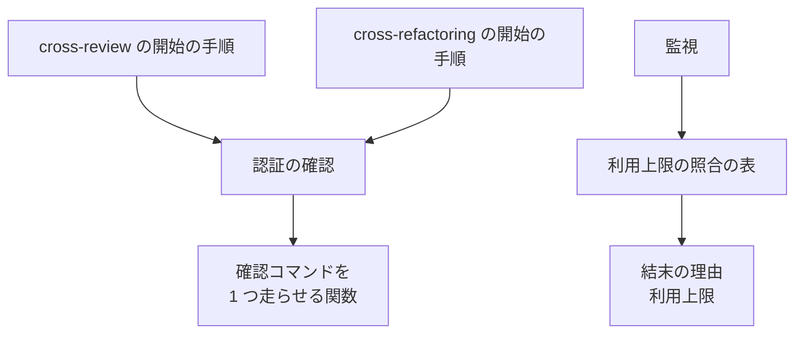
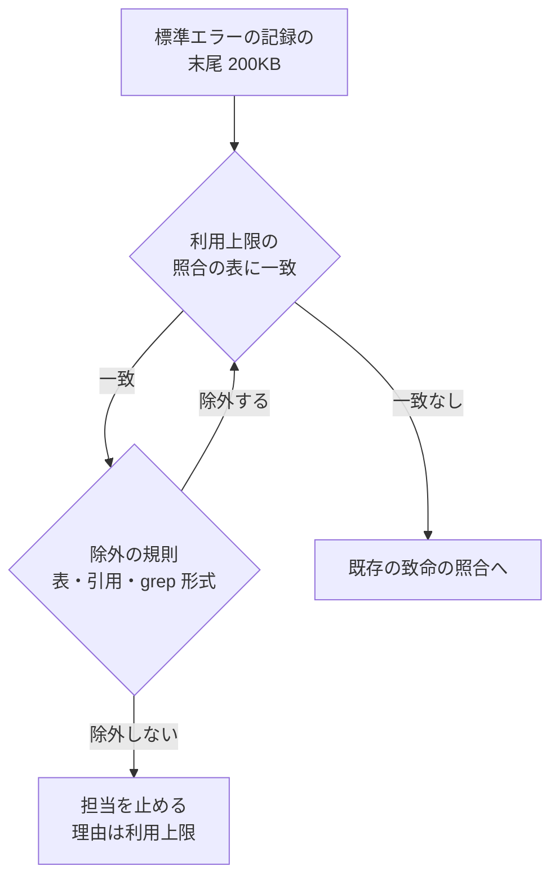
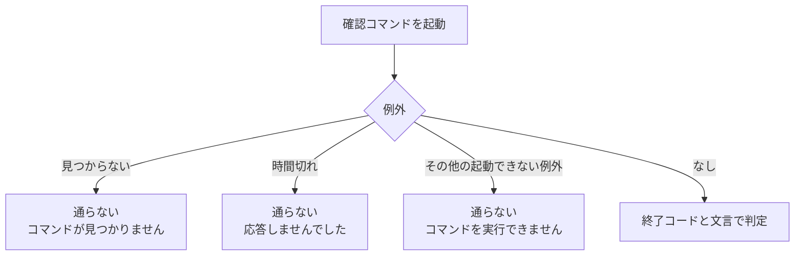

# cross-review / cross-refactoring: codex と claude が利用上限で止まっても同じラウンドで起動し直され、PATH に読めないディレクトリがあると始まらない → 上限を理由として報告して起動し直さず、CLI が欠けても使える者だけで始まる（#811 #813）

## 目的

- **壊れていること:** 監視の利用上限の照合の表が codex と claude の実物の文言に 1 つも一致しない（#811）。認証の確認が権限の例外を捕まえず、開始の手順ごと落ちる（#813）
- **誰が困るか:** 収束ループを回す利用者。上限の担当を打ち切りまで待たされ、読めない PATH の環境ではループが始まらない
- **直すと成り立つこと:** 実物の文言に一致する 2 行を照合の表へ足し、確認コマンドを起動できないときは「通らない」として返す。どちらも関数 1 つの範囲で直す

要求と受け入れ条件は [issue-811-813-requirements.md](issue-811-813-requirements.md) にある。この文書は「どう作るか」だけを扱う。

## 用語の対応表

本文は左の業務用語で書く。識別子は表とコードブロックにだけ置く。

| 業務用語 | 識別子 |
| --- | --- |
| 監視 | `plugins/ndf/scripts/lib/monitor.py` |
| 利用上限の照合の表 | `USAGE_LIMIT_FATAL` |
| 行単位の照合 | `_scan_patterns`。表・引用・grep 形式の行と、引用符の内側の一致を除く |
| 標準エラーの記録 | 担当ごとの `<stem>-err.log` |
| 行頭の印 | codex が標準エラーの誤りの行に付ける `ERROR: ` |
| 認証の確認 | `plugins/ndf/scripts/lib/auth.py` の `probe_auth` |
| 確認コマンドを 1 つ走らせる関数 | `auth._run_probe` |
| 権限の例外 | `PermissionError`（`errno` 13）。`OSError` の下位 |
| 起動できない例外 | `OSError` とその下位のすべて |
| 実物 | CLI が実際に出した文言。手元の記録か、導入済みの CLI の実行ファイルに埋め込まれた文字列 |

## なぜ要るか

**利用上限の照合の表は 4 行で、どれも codex と claude の実物に一致しない。** #729 の要求の
時点で集めた文言は kiro と claude の JSON 出力だけだった。codex（既定の参加者）が上限に
当たると、理由が「結果ファイル無し」になり、同じラウンドで起動し直してまた上限で落ちる。

**認証の確認は、確認コマンドが見つからないことを「見つからない例外」だけで判定している。**
Python の子プロセスの起動は PATH を順に探し、見つからないまま読めないディレクトリを通ると、
見つからない例外ではなく権限の例外を上げる。認証の確認は「例外は上げない」を約束しているが、
この例外が開始の手順まで抜ける。

## 実測

測った環境: `develop`（90c0f06f）、Python 3.14.4、bash 5.3.9、codex-cli 0.154.0、
claude 2.1.278（2026-09-22）。

### 文言を集めた経路と件数

| CLI | 集めた経路 | 件数 | 見つかった形 |
| --- | --- | --- | --- |
| codex | `~/.codex/sessions` の記録の誤りの本文（`error.message`）。誤りの種別が `usage_limit_exceeded` のもの | 62（1 形、2026-09-15） | `You've hit your usage limit. Visit https://chatgpt.com/codex/settings/usage to purchase more credits or try again at <日時>.` |
| codex | 導入済みの実行ファイルに埋め込まれた文字列 | 6 形 | 上の形のほか、`You've hit your usage limit.` で始まる 3 形、`You've hit your usage limit for <モデル>.`、`exceeded retry limit, last status: <状態>` |
| claude | `~/.claude/projects` の記録のうち、API の誤りの印（`isApiErrorMessage`）が真の本文 | 5,103（4 形、2026-09-01〜22） | 週 3,751 / セッション 758 / 個人の支出 593 / 月の支出 1（下の表） |
| claude | 導入済みの実行ファイル | 期間を書かない形 `You've hit your limit` ほか | `You've hit your ` の後に期間や種類を差し込む作りである |
| claude | 同上。旧い形 `Claude AI usage limit reached` | 0 | 記録にも 0 件 |
| kiro | `~/.kiro` の記録 | 0 | 既存の照合の `Monthly request limit reached` は #619 の実物から採った |
| agy | `~/.gemini` の記録と `antigravity-cli/cli.log` | 0 | 一致したのは監視の照合の定義を写した行と、別のリポジトリのコード差分だけ |
| 全 CLI | 手元に残る標準エラーと標準出力の記録 296 件 | 上限の実物 0 | 一致したのは設計文書・テストを担当が読み上げた行だけ |

**codex が誤りを標準エラーへ書く形は、行頭の印の後に誤りの本文を続けた 1 行である。** 存在しない
モデルを指定して `codex exec` を実行し、標準エラーの記録に次の行が出ることを確かめた。記録の
誤りの本文と同じ文字列である。利用上限の文言でこの形を見たわけではない（「未確認のまま残ること」）。

```text
ERROR: {"type":"error","status":400,"error":{"type":"invalid_request_error","message":"The 'ndf-no-such-model-xyz' model is not supported when using Codex with a ChatGPT account."}}
```

**claude の JSON 出力の上限は、足さなくても読める。** 導入済みの実行ファイルは、API の誤りで
終わった結果行に `api_error_status` を載せる。10.16.0 のリリース後テストでも、この形は理由
「利用上限」になった。

### 足す 2 行の照合の結果

次の 2 行を照合の表の末尾に足し、行単位の照合で入力 1 行ずつを読んだ結果である。

```python
re.compile(r"^(?:ERROR:\s*)?You['’]ve hit your (?:[\w'’ ]+ )?(?:limit|budget)\b", re.MULTILINE)
re.compile(r"^(?:ERROR:\s*)?exceeded retry limit, last status: 429\b", re.MULTILINE)
```

| 区分 | 入力 | 今の利用上限 | 足した後 |
| --- | --- | --- | --- |
| 実物 | codex の利用上限（行頭の印あり / なし） | — | 一致 |
| 実物 | codex の再試行の上限 `… last status: 429 Too Many Requests` | — | 一致 |
| 実物 | codex の `Quota exceeded. Check your plan and billing details.` | 一致 | 一致 |
| 実物 | claude の `You've hit your weekly limit · resets Sep 22, 6am (UTC)` | — | 一致 |
| 実物 | claude の `You've hit your session limit · resets 6:30pm (UTC)` | — | 一致 |
| 実物 | claude の `You've hit your individual spend limit · run /usage-credits …` | — | 一致 |
| 実物 | claude の `You've hit your monthly spend limit. Run /usage-credits …` | — | 一致 |
| 実物 | claude の `You've hit your limit · resets 3am (UTC)` | — | 一致 |
| 実物 | kiro の `Monthly request limit reached` / HTTP 429 の状態行 | 一致 | 一致 |
| 一致しない | codex の再試行の上限 `… last status: 503 Service Unavailable` | — | — |
| 一致しない | codex の 400 の行（上のコードブロック） | — | — |
| 誤検知 | 表（バッククォートあり / なし）、本文のバッククォート、本文の「」 | — | — |
| 誤検知 | 文の途中、リスト、引用、grep 形式、Python の文字列 | — | — |
| 誤検知 | 差分の追加行 `+ERROR: You've hit …`、差分の文脈行 | — | — |

### 起動できないときの例外

| 条件 | 上がる例外 | `errno` |
| --- | --- | --- |
| PATH に読めないディレクトリがあり、コマンドがどこにも無い | 権限の例外 | 13 `Permission denied` |
| 読めないディレクトリの無い PATH で、コマンドがどこにも無い | 見つからない例外 | 2 |
| 読めないディレクトリの後ろにコマンドがある | 例外なし（終了コード 0） | — |
| 実行権の無いファイル | 権限の例外 | 13 |
| 実行形式でないファイル | 起動できない例外 | 8 `Exec format error` |

**cross-refactoring の開始の手順も落ちることを確かめた。** 参加者の解決の関数を、ホストの
claude が見つからず読めないディレクトリを含む PATH で呼ぶと、権限の例外で終了コード 1 になる。
読めないディレクトリを外すと、codex だけが使える者として返る。

## 決定の記録

### 決定 1: 誤検知を防ぐために、足す文言は行頭で始まる形だけを照合する

監視は担当が生きている間に照合し、一致すれば担当を止めて起動し直さない。文書の引用に一致すると、
結果を書ける担当を止める。見逃すと 1 度起動し直すだけである。誤検知の費用のほうが大きい。
**codex は作業中のコマンドの出力（差分やファイルの中身）も標準エラーへ書く**ため、文言を
含む文書やテストを読み上げた行が記録に入る。行頭に固定すると、文の途中・差分の行・字下げ
した文字列は一致しない。行頭の印は codex の形に合わせて省略可能にする。

行頭に固定しない照合は採らない。除外の規則（表・引用・grep 形式）は文の途中に裸で出た文言を
除けない。

### 決定 2: 利用上限の文言は、期間や種類を問わず 1 行の照合で読む

claude は `You've hit your ` の後に期間や種類（週・セッション・個人の支出など）を差し込んで
文言を作る。codex も同じ書き出しで 5 形を持つ。書き出しと、末尾の `limit` / `budget` で読めば、
記録と実行ファイルで見つけた書き出しの形をすべて 1 行で覆える。形ごとに行を足すと、CLI が種類を増やすたびに照合が遅れる。

### 決定 3: codex の再試行の上限は、最後の状態が 429 のときだけ利用上限と読む

同じ文言は状態コードを差し込んで作られ、503 などの一時的な誤りでも出る。一時的な誤りは
起動し直せば解けうるため、利用上限にしない。

### 決定 4: 実物が見つからない文言は照合に足さない

照合の表の行は、記録か導入済みの実行ファイルに出所を持つものだけにする。出所の無い行は、
合っているかをテストで確かめられない。書いた側の思い込みがテストの期待値にも入り、通って
しまう。claude の旧い形（`Claude AI usage limit reached`）は記録にも実行ファイルにも無いため
足さない。記録に現れたら、同じ手順で出所を書いて足す。

### 決定 5: 照合を足す先は標準エラーの記録だけにし、claude の標準出力の照合は変えない

claude は JSON を出す形で起動しており、上限の結果行は状態コードを持つ。JSON は 1 行に文章を
含むため、行頭の照合が効かず、担当のレビュー本文の引用に一致しうる。

claude の 5 形は、codex と共通の 1 行（決定 2）で読める。そのため標準エラーの記録に出れば利用上限になる。ただし、JSON 出力で起動した claude が上限のときに標準エラーへ書いた記録は無い。起動した claude の上限を読む経路は、標準出力の状態コードのままである。

### 決定 6: 確認コマンドを起動できないときは、例外の種類を問わず「通らない」として返す

認証の確認は「例外は上げない」を約束しており、起動できない理由（権限・実行形式など）が
何であっても、その CLI は使えない。見つからない例外だけは従来の理由のまま残し、その他の
起動できない例外は `コマンドを実行できません（<理由>）` にまとめる。理由には例外の説明
（`strerror`）を入れる。

権限の例外だけを足す形は採らない。実行形式でないファイルで同じ落ち方をする。

### 決定 7: 読めない PATH で見つからないときも、理由は起動できないとして出す

Python の起動は、読めないディレクトリがあると「見つからない」と「実行権が無い」を同じ
例外で返す。見分けるには PATH を自分で探し直す必要があり、関数 1 つの範囲を超える。理由の
文言に `Permission denied` が出れば、利用者は PATH かファイルの権限を見ればよい。

## 構成要素

| 要素 | 変えること |
| --- | --- |
| 利用上限の照合の表（監視） | 決定 1〜3 の 2 行を末尾に足す |
| 確認コマンドを 1 つ走らせる関数（認証の確認） | 起動できない例外を捕まえ、「通らない」と理由を返す |
| 監視のテスト | 実測の表の実物と誤検知の形を入力にする |
| 認証の確認のテスト | 起動できない 2 形（権限・実行形式）を入力にする |
| 2 つの開始の手順のテスト | 読めないディレクトリを含む PATH で、欠けた CLI が外れることを確かめる |

```text
plugins/ndf/
├── scripts/lib/
│   ├── monitor.py          # 利用上限の照合の表に 2 行
│   └── auth.py             # 確認コマンドを 1 つ走らせる関数
├── scripts/tests/
│   └── test_auth_probe.py
└── skills/
    ├── cross-review/tests/
    │   ├── test_monitor_usage_limit.py
    │   └── test_state_review_pool.py
    └── cross-refactoring/tests/
        └── test_init.py
```



## 処理の流れ

### 監視が標準エラーの記録を読む



足した 2 行は照合の表の末尾に入るため、既存の 4 行より後に照合される。どの行に一致しても
理由は同じであり、順序は結果を変えない。

### 認証の確認が 1 つの CLI を確かめる



見つからない例外は起動できない例外の下位にあるため、先に捕まえる。時間切れの例外は起動
できない例外の下位ではないため、順序に依らない。

## テスト設計

| 受け入れ条件 | 何で確かめるか |
| --- | --- |
| AC1〜AC4 | 監視のテストに、実測の「実物」の行を 1 つずつ標準エラーの記録へ書き、結末を読む。理由が利用上限・起動し直しの可否が偽・終了コード 4 |
| AC2 の後半 | 同じテストで 503 の行を書き、利用上限にならないこと |
| AC5 | 同じテストで実測の「誤検知」の形を書き、担当が止まらないこと |
| AC6 | テストの入力の文字列が、実測の表の文言と一致すること（レビューで照らす） |
| AC7 / AC8 | 認証の確認のテストで、読めないディレクトリを含む PATH と、実行形式でないファイルを確認コマンドにする |
| AC9 | 同じテストの既存の 2 件（見つからない・時間切れ）が通ること |
| AC10 | cross-review の参加者の解決のテストに、読めないディレクトリを含む PATH の場合を足す |
| AC11 | cross-refactoring の開始の手順のテストに、同じ場合を足す |
| AC12〜AC14 | 10.16.1 のリリース後テスト（利用者の環境で手動） |

読めないディレクトリはテストの中で作る（権限を外した一時ディレクトリ）。root で実行すると
権限が効かないため、そのときはテストを飛ばす。

## 未確認のまま残ること

| 項目 | 内容 |
| --- | --- |
| codex の利用上限の文言の行頭の形 | 400 の誤りで測った形（`ERROR: ` + 本文）からの類推。照合は行頭の印の有無を問わないため、印が別の形（時刻を前に置くなど）だと一致しない。10.16.1 の後に上限に当たった記録で確かめる |
| claude の文言が標準エラーの記録へ出るか | 実測の claude の 5 形の出所は、会話の記録と実行ファイルである。JSON 出力で起動した claude が上限のときに標準エラーへ書いた記録は無い。起動した claude の上限は、標準出力の状態コード（10.16.0 で合格）で読む。10.16.1 の後に上限に当たった標準エラーの記録で確かめる |
| codex の再試行の上限の状態の書き方 | 実行ファイルの文字列は `last status: ` までで、状態の後ろの書き方は記録に無い。照合は `429` の直後の語の区切りまでしか見ない |
| kiro と agy の利用上限の文言 | 手元の記録に 0 件。kiro は既存の #619 の実物、agy は照合なし |
| claude の旧い形 | 記録にも実行ファイルにも 0 件のため足さない（決定 4） |
| 行頭に固定しても残る誤検知 | 文言で始まる行をそのまま読み上げた場合（文書の本文の行頭に裸で置いた文言を `cat` したときなど）は一致する。この束の文書とテストでは、文言を表・バッククォート・文字列の中にだけ置く |
