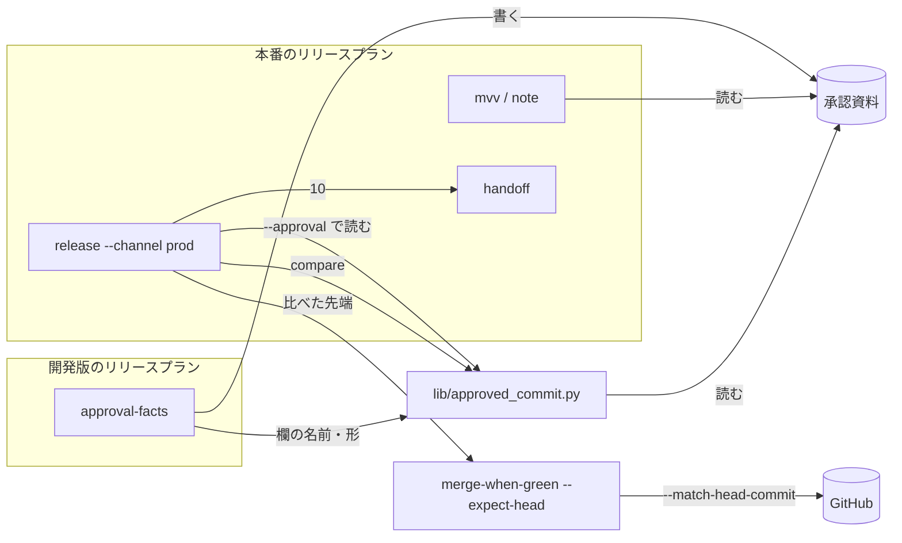
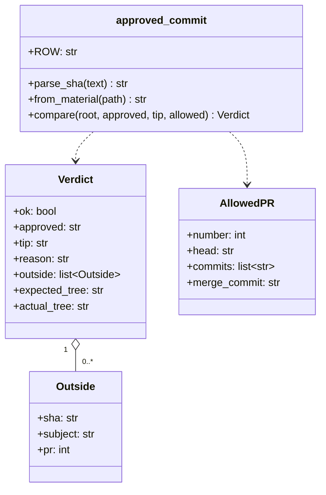
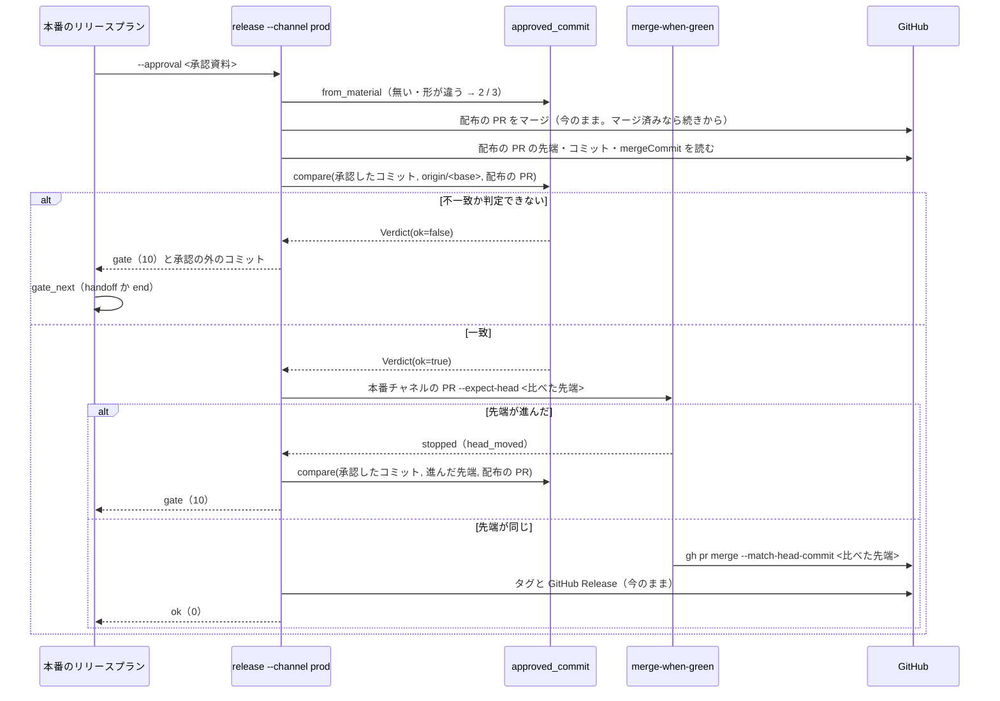

# release: 本番への配布の承認の後にベースブランチへ入った変更が、承認を経ずに本番チャネルへ届く → 承認したコミットを控え、本番チャネルへ入れる直前に承認の外の変更があれば止まる（#815）

## 目的

- **何が壊れているか**: 本番への配布の承認（ゲート 2）は承認した時点のベースブランチの中身を前提にするが、`release-steps.py` は承認した中身をコミットで控えず、本番チャネルへ入れる直前に比べない
- **誰が困るか**: 本番の利用者（承認していない変更が検証を経ずに届く）と、承認する人（承認が守られたかを差分の数え直しでしか確かめられない）
- **直すと何が成り立つか**: 承認したコミットの後に配布の PR の外の変更がベースブランチへ入っていれば、本番チャネルの PR・タグ・GitHub Release のどれも作らずに承認ゲートで止まる

## 適用範囲

- **働く範囲**: 配布先のリポジトリでも働く。リリースの形 `package-plugin` の `release-steps.py approval-facts` / `release --channel prod` と、それを呼ぶ本番のリリースプラン（`supervise.py new release --channel prod`。`--mvv` 付きを含む）
- **プロジェクトごとに違うもの**: ベースブランチ・本番チャネル・プラグイン名は今と同じく宣言（`.ndf/worktree.json` / `.ndf/supervise.json`）と引数から読む。配布の PR のマージの方法（merge / squash / rebase）は設定で受けず、どの方法でも同じ判定が成り立つ形にする（決定 1）
- **当たるモード**: どのモードでも、本番への配布（`release --channel prod`）を通るときだけ働く。`--channel dev` と昇格の経路（`merged-steps.py promote`）には働かない

## あるべき姿の根拠

| 根拠 | 種類 | 何を示すか |
| --- | --- | --- |
| ndf 10.16.0 の配布で、承認（2026-09-22T14:36Z）の 6 分後に PR #806 が `develop` へ入り、配布物の差分が 119 → 124 ファイルに増えた（#815 の依頼の原文） | 実測 | 承認と公開の間に別の変更が入ることが現に起き、手順の上では止まらなかった |
| `git merge-tree --write-tree <承認したコミット> <配布の PR の先端>` の木が、merge / squash / rebase のどの方法で入れた結果の木とも一致し、外の変更が配布の PR の前に入っても後に入っても一致しなくなる（git 2.53.0 の一時リポジトリで実測。下の「決定 1」） | 実測 | マージの方法ごとに分岐せず、木の比較 1 つで判定できる |
| `gh pr merge --match-head-commit <SHA>` は、PR の先端が SHA と違えばマージしない（`gh pr merge --help`） | 外部の一次情報 | 比べた先端だけをマージする約束を GitHub 側で守らせられる |
| `release-steps.py deploy-facts` は承認資料に「ベースブランチの先頭」の SHA を書き、本番へ届けるのをそのコミットに限る（`release_lib/deploy.py`） | 既存の形 | 承認資料にコミットを書いて本番の範囲を縛る形は、手で反映する経路で既に使っている |

要求と受け入れ条件は #815 の本文にある（コピーは `issues/issue-815-requirements.md`）。この文書は「どう作るか」だけを扱う。

## ドメインモデル

### コンテキスト

| コンテキスト | 何の語が 1 つの意味に決まるか |
| --- | --- |
| NDF のリリース（`ndf-release`） | 承認したコミット・配布の PR・本番チャネル・承認資料・承認ゲート 2 |

1 つのコンテキストに収まる。MVV 判定（`mvv-gate.py`）は承認資料を読むだけで、判定の中身は変えない。

### 集約

| 集約 | 持ち主（書き換えてよいもの） | 根 | エンティティ | 値オブジェクト |
| --- | --- | --- | --- | --- |
| 承認資料 | `release-steps.py approval-facts`（書く）。`notes --approval` は既存の欄だけを書く | 承認資料（`issues/approval-<プラグイン>-v<版>.md`） | — | 承認したコミット・前のタグ・比較の URL |
| 本番の配布 | `release-steps.py release --channel prod` | 本番の配布（版 1 つ） | 配布の PR・本番チャネルの PR | 承認したコミット・比べた先端・承認の外のコミット |

本番の配布は承認資料を承認したコミットの値として受け取るだけで、承認資料を書き換えない（集約の間は値で参照する）。

### 不変条件

| # | 集約 | 条件 | 破れたときの扱い |
| --- | --- | --- | --- |
| I1 | 本番の配布 | 承認したコミットを受け取っていない本番の配布は、配布の PR も本番チャネルの PR もマージしない | `stopped`・終了コード 2（引数が無い・形が違う）か 3（承認資料に欄が無い） |
| I2 | 本番の配布 | 承認したコミットは比べた先端の祖先である | `gate`・終了コード 10。本番チャネルの PR をマージしない |
| I3 | 本番の配布 | 承認したコミットから配布の PR の先端までのコミットは、すべて配布の PR のコミットである | `gate`・終了コード 10。外のコミットを `items[]` に並べる |
| I4 | 本番の配布 | 比べた先端の木は、承認したコミットに配布の PR の変更だけを足した木（`merge-tree` の結果）と等しい | `gate`・終了コード 10。外のコミットを `items[]` に並べる |
| I5 | 本番の配布 | 本番チャネルへマージするのは比べた先端のコミットだけである | マージしない。先端が進んでいれば進んだ分で I4 を判定し直し、`gate`・終了コード 10 |
| I6 | 本番の配布 | 判定できない（`merge-tree` が衝突する・コミットを読めない・配布の PR のコミットを読めない）ときは通さない | `gate`・終了コード 10 |
| I7 | 本番の配布 | MVV 判定の承認では、I2〜I6 の承認ゲートを通さない | 本番のリリースプランは承認ゲート 2 の記録（`by: mvv`）を外して承認ゲートで終える |
| I8 | 承認資料 | 承認資料の「承認したコミット」は、`approval-facts` を打った時点の `origin/<ベースブランチ>` の SHA（40 桁）で、比較の URL と題の SHA と同じ | 書く側が 1 か所でしか値を作らない（構成要素の表）。テストで縛る |

### ドメインイベント

| # | イベント | 発生元 | 受け手 |
| --- | --- | --- | --- |
| E1 | 承認資料を書いた（承認したコミットを含む） | `approval-facts` | 承認する人・MVV 判定（`mvv-gate.py`）・本番のリリースプラン（`--approval` で読む） |
| E2 | ゲート 2 を承認した | 人か MVV 判定（`pace: fast` / `auto`） | conductor（本番のリリースプランを流す） |
| E3 | ほかの変更がベースブランチへマージされた | 利用者か別のプラン | 本番の配布（E6 で見つける） |
| E4 | 本番の配布が承認したコミットを受け取った | `release --channel prod` の引数の解釈 | 本番の配布（E6 で使う） |
| E5 | この版の配布の PR をベースブランチへマージした | `release --channel prod` | 本番の配布（E6 の配布の PR の先端とコミットを読む） |
| E6 | 承認したコミットからベースブランチの先端までを比べた | `lib/approved_commit.py` の `compare` | `release --channel prod`（一致なら E7、不一致なら承認ゲート） |
| E7 | 比べた先端を本番チャネルへマージした | `merged-steps.py merge-when-green --expect-head` | `release --channel prod`（E8 へ進む） |
| E8 | タグと GitHub Release を作った | `release --channel prod` | 利用者・リリース後テスト（今のまま） |

### 用語

| 用語 | 意味 | 用語集への反映 |
| --- | --- | --- |
| 承認したコミット | ゲート 2 の承認資料が対象にした、ベースブランチの先端のコミットの SHA（40 桁）。本番チャネルへ入れてよい中身の上限を示す | 追加（`ndf-release`。要求の工程で足した。出所をこの設計文書へ移す） |
| 比べた先端 | 本番の配布が承認したコミットと比べた時点の `origin/<ベースブランチ>` の SHA。本番チャネルへマージしてよいのはこのコミットだけである | 追加（`ndf-release`） |
| 承認の外のコミット | 承認したコミットから比べた先端までに入ったコミットのうち、この版の配布の PR のものでないもの | 追加（`ndf-release`） |

## 機能一覧

| # | 機能 | 誰が使うか |
| --- | --- | --- |
| F1 | 承認資料と結果 JSON に承認したコミットを載せ、`release --channel prod` の打ち方に添える | 承認する人・MVV 判定・手で打つ人 |
| F2 | 本番の配布が承認したコミットを受け取り、無ければ何もマージせずに止まる | conductor・手で打つ人 |
| F3 | 配布の PR をマージした後、承認の外のコミットがあれば本番チャネルへ入れずに承認ゲートで止まり、その一覧を返す | 承認する人・conductor |
| F4 | 比べた先端だけを本番チャネルへマージし、CI 待ちの間に先端が進めばマージしない | 本番の利用者 |
| F5 | 本番のリリースプランが承認資料を本番の配布へ渡し、承認ゲートで止まったら MVV 判定の承認を外して人へ戻す | conductor |

## 構成要素

| 要素 | 責務 |
| --- | --- |
| `lib/approved_commit.py`（新規） | 承認したコミットの値の扱いを 1 か所に持つ。承認資料の欄の名前（`承認したコミット`）、SHA の形の検査（`parse_sha`）、承認資料からの読み取り（`from_material`）、比較（`compare`）。`compare` は git を読むだけで書かず、終了コードも出力も持たずに判定（`Verdict`）を値で返す。`parse_sha` と `from_material` は読めないときに `ValueError` を投げ、終了コード（2 / 3）への読み替えは `release` が行う。昇格の経路（`merged-steps.py promote`）からも後で呼べる形にする |
| `release-steps.py` の `cmd_approval_facts` | 承認したコミットを `metrics.approved_sha` と承認資料の「2. 承認の判断に使うもの」の表の行に書き、`next` に `--approved-sha <SHA>` を添える。SHA は今の `dev` の変数 1 つから作る（I8） |
| `release-steps.py` の `cmd_release` | `--channel prod` のとき、最初に承認したコミットを `--approved-sha` か `--approval` から受け取る（無ければ 2 / 3）。配布の PR のマージの後に `compare` を呼び、不一致なら `gate`（10）で止まる。一致なら比べた先端を `merge-when-green --expect-head` へ渡す。マージが先端の移動で止まったら、進んだ先端で `compare` をやり直して `gate` で止まる |
| `release-steps.py` の `build_parser` | `release` に `--approved-sha` と `--approval` を足す（排他）。`--channel dev` で渡したら 2 |
| `merged_lib/merge.py` の `merge_when_green` と `merged-steps.py` の `build_parser` | `merge-when-green` に `--expect-head <SHA>` を足す。渡されたら、マージの直前の PR の先端が SHA と違えばマージせずに `stopped`（1）・`items[]` の `result: head_moved` で止まり、`gh pr merge --match-head-commit` に SHA を渡す |
| `supervise_lib/release_templates.py` の `_release_verify_steps` | 本番の `release` のステップのコマンドに `--approval <承認資料>` を足し、`gate_next` を置く（`--mvv` 付きは `handoff`、無しは `end`） |
| `skills/release/SKILL.md` と `skills/release/references/release-steps.md` | 公開前の提示と承認・手順 4 に、承認したコミットを渡すことと、終了コード 10 で止まったときの読み方を書く |
| `skills/development-workflow/references/approval-request.md` | リリースの「対象を開くもの」に承認したコミットを足す |



図に含めない要素: `build_parser`（引数の定義で、`release` と `merge-when-green` の一部として描く）と、文書 3 つ（`SKILL.md`・`release-steps.md`・`approval-request.md`）。

システムの文脈と配置は変わらない。スクリプトは今と同じく作業場所（`release/v<版>` の worktree）で動き、git と `gh` だけを外部に持つ。

パッケージ構成（変える所だけ）:

```text
plugins/ndf/scripts/
├── lib/
│   └── approved_commit.py        # 新規。欄の名前・形の検査・承認資料からの読み取り・比較
├── release-steps.py              # approval-facts・release・build_parser
├── merged-steps.py               # merge-when-green に --expect-head
├── merged_lib/merge.py           # merge_when_green
├── supervise_lib/release_templates.py
└── tests/
    ├── test_approved_commit.py   # 新規
    ├── test_release_steps.py
    ├── test_sprint_close_merge_green.py
    └── test_supervise_new.py
```

## 構造



- `reason` は `match` / `not_ancestor` / `unknown_commit` / `outside_commits` / `tree_differs` / `undecidable` のどれか。`ok` は `match` のときだけ真
- `allowed` は 0 個以上の `AllowedPR`。本番の配布は配布の PR の 1 つを渡す。昇格の経路は 0 個を渡す（先端の木が承認したコミットの木と等しいかになる）
- `pr` は分かったときだけ入る。`compare` は git だけを読むため空で返し、`release` が止まるときに `gh api repos/<owner>/<name>/commits/<SHA>/pulls` の先頭で埋める（読めなければ空のまま）

## 入出力の契約

API を持たないため、コマンドの約束を表で書く（`interface-api.md` の「API 以外」）。

### `release-steps.py approval-facts`

| 項目 | 書くこと |
| --- | --- |
| 入力 | 変わらない |
| 出力（`gate`・10） | `metrics.approved_sha` を足す（40 桁）。承認資料の「2. 承認の判断に使うもの」の表の先頭に `\| 承認したコミット \| <40 桁> \|` を足す。題の先頭 8 桁と比較の URL は今のまま。`next` は `利用者の承認を得たら release-steps.py release --version <版> --channel prod --approved-sha <40 桁>` |
| 失敗の形 | 変わらない（前のタグを決められない → 3） |
| 互換性 | `metrics` と表に行が増えるだけで、既存の読み手（`notes --approval`・`mvv-gate.py`）は欄の名前で読むため壊れない |

### `release-steps.py release`

| 項目 | 書くこと |
| --- | --- |
| 入力 | 足す: `--approved-sha <40 桁の 16 進>` か `--approval <承認資料>`（排他）。`--channel prod` では片方が必須。`--channel dev` では渡さない |
| 出力（`ok`・0） | 今の `items` / `metrics` に `metrics.approved_sha`（承認したコミット）と `metrics.compared_head`（比べた先端）を足す。`--channel dev` の出力は変えない |
| 出力（`gate`・10） | 配布の PR はマージ済み・本番チャネルの PR はマージしない・タグも GitHub Release も作らない。下の表 |
| 失敗の形 | 下の表 |
| 互換性 | `--channel prod` に承認したコミットが必須になる。手で打つ人は承認資料の `next` のコマンドをそのまま使い、本番のリリースプランは `--approval` を渡す。`--channel dev` は変わらない |

`release --channel prod` の止まり方:

| 場合 | 終了コード | `status` | いつ止まるか |
| --- | --- | --- | --- |
| 承認したコミットが渡されない | 2 | `stopped` | 最初（push の前）。`summary` に `--approved-sha か --approval が要る` |
| `--approved-sha` が 40 桁の 16 進でない | 2 | `stopped` | 最初 |
| `--approval` のファイルが無い・「承認したコミット」の欄が無い・欄の値が 40 桁でない | 3 | `stopped` | 最初 |
| `--channel dev` に `--approved-sha` か `--approval` を渡した | 2 | `stopped` | 最初 |
| 承認したコミットを読めない・比べた先端の祖先でない（I2） | 10 | `gate` | 配布の PR のマージの後、本番チャネルの PR の前 |
| 承認の外のコミットがある（I3・I4） | 10 | `gate` | 同上 |
| 判定できない（I6） | 10 | `gate` | 同上 |
| CI 待ちの間に先端が進んだ（I5） | 10 | `gate` | 本番チャネルの PR のマージの直前 |

`gate` のときの結果 JSON:

| 欄 | 中身 |
| --- | --- |
| `summary` | `<プラグイン> v<版> の本番への配布を止めた: 承認したコミット <先頭 8 桁> の後に承認の外のコミットが <N> 件ある`（理由ごとに文を変える） |
| `items[]` | 承認の外のコミット 1 件につき `{"kind": "commit", "name": <40 桁>, "result": "unapproved", "subject": <件名>, "pr": <番号か省く>}`。木だけが違うときは `{"kind": "tree", "name": <比べた先端>, "result": "differs", "expected": <木>, "actual": <木>}`。祖先でない・読めないときは `{"kind": "commit", "name": <承認したコミット>, "result": "not_ancestor" か "unknown"}`。配布の PR の `{"kind": "pr", ..., "result": "merged"}` は今のまま先頭に残る |
| `metrics` | 今の欄に `approved_sha`・`compared_head`・`reason`（`Verdict.reason`）・`outside`（件数）を足す。`main_pr` と `tag` は `null` |
| `next` | `承認資料を作り直して（release-steps.py approval-facts --version <版> --prs <PR番号>...）承認を取り直し、release-steps.py release --version <版> --channel prod --approved-sha <新しい承認したコミット> を打ち直す` |

### `merged-steps.py merge-when-green`

| 項目 | 書くこと |
| --- | --- |
| 入力 | 足す: `--expect-head <SHA>`（任意） |
| 出力 | 渡したとき、マージした `items[]` の `head` は渡した SHA |
| 失敗の形 | 渡したとき、緑を確かめた先端が SHA と違えばマージせずに `stopped`（1）。`items[]` に `{"kind": "pr", "name": "#<番号>", "result": "head_moved", "head": <今の先端>, "expected": <SHA>}` |
| 互換性 | 渡さないときは今のまま（緑を確かめた先端を `--match-head-commit` に渡す） |

### 本番のリリースプラン（`supervise.py new release --channel prod`）

| 項目 | 書くこと |
| --- | --- |
| `release` のステップ | `cmd` に `--approval <承認資料>`（`_material_path(repo, issues/approval-<プラグイン>-v<正式版>.md)`。MVV 判定が読むのと同じファイル）を足す。`gate_next` を置く: `--mvv` 付きは `handoff`、無しは `end` |
| 引数 | 変わらない（承認したコミットはプランの生成時ではなく、ステップの実行時に承認資料から読む。決定 3） |

## 処理の流れ



`compare` の中の順序（A = 承認したコミット、T = 比べた先端、H = 配布の PR の先端）:

1. A と T と H を `git cat-file -e <SHA>^{commit}` で確かめる。A を読めなければ `unknown_commit`、T か H を読めなければ `undecidable`
2. `git merge-base --is-ancestor A T` が 0 でなければ `not_ancestor`
3. `git rev-list A..H` のコミットのうち、配布の PR のコミット（`gh pr view --json commits`）に無いものを集める。あれば `outside_commits`（配布のブランチが承認の後の先端から切られた場合を拾う。決定 2）
4. `git merge-tree --write-tree A H` の木と `T^{tree}` を比べる。`merge-tree` が 0 以外なら `undecidable`、等しければ `match`
5. 等しくなければ、`git rev-list --no-merges A..T --not H` から配布の PR の `mergeCommit`（squash の 1 コミット）と、`git patch-id` が配布の PR のコミットと同じもの（rebase で作り直されたコミット）を除いて `outside_commits` に並べる。並ぶものが無ければ `tree_differs`

## 非機能の実現方式

| 大項目 | 要求の条件 | 実現方式 | 確かめ方 |
| --- | --- | --- | --- |
| 運用・保守性 | 止まったときの結果 JSON だけで、承認していないコミットの SHA と、承認したコミット・比べた先端が読める（LLM が git を追加で照会しなくてよい） | `gate` の `items[]` に承認の外のコミットの SHA・件名・PR 番号、`metrics` に `approved_sha`・`compared_head`・`reason` を載せる | 外の変更を入れた一時リポジトリで `release` を打ち、結果 JSON の欄だけで 3 つが読めることをテストで見る |
| セキュリティ | 承認していない変更が本番チャネル・タグ・GitHub Release へ届かない | 比べるのを本番チャネルの PR のマージの直前に置き、マージを `--match-head-commit <比べた先端>` で縛る。判定できないときは止まる側へ倒す（I6） | 外の変更・先端の移動・祖先でない・判定できないの各場合に、本番チャネルの PR のマージとタグ作成の `gh` / `git` が呼ばれないことをテストで見る |
| システム環境 | ベースブランチ・本番チャネル・プラグイン名は宣言と引数から読み、`develop` / `main` を既定に埋め込まない | `release_decl` の戻り値（`base` / `prod` / `plugin`）だけを `compare` と `next` の文に使う。`approved_commit.py` はブランチ名を受け取らず SHA だけを受け取る | 宣言のブランチ名を `develop` / `main` 以外にしたテストで通る |

`git merge-tree --write-tree` は git 2.38 から使える。使えない git では 0 以外を返すため、I6 で止まる側へ倒れる。

## 決定の記録

### 決定 1: マージの方法によらず判定するため、コミットではなく木で比べる

比べた先端の木が「承認したコミットに配布の PR の先端を `merge-tree` で合わせた木」と等しいかで判定する。merge / squash / rebase のどれで配布の PR を入れても、外の変更が無ければ木は一致し（実測: 3 方式とも同じ木 `daeb6458…`）、外の変更が配布の PR の前に入っても後に入っても一致しない。利用者へ届くのは木の中身であり、コミットの形ではない。

本線（first-parent）のコミットを配布の PR の `mergeCommit` と突き合わせる案は採らない。rebase では 1 つの PR が本線に複数のコミットを作り、方法ごとの分岐が要る。コミットごとに GitHub の PR を照会して判定する案も採らない。直接 push されたコミットは PR を持たず、照会の上限に判定が左右される（PR 番号の照会は、止まったときの表示にだけ使う）。

根拠: Value 6 / Value 5（MVV 版 2）

### 決定 2: 承認の後の先端から切られた配布のブランチを拾うため、木の比較の前に配布の PR のコミットを確かめる

本番のリリースプランは配布のブランチを `origin/<ベースブランチ>` から切る。承認の後・プランの開始の前に外の変更が入ると、配布の PR の先端がその変更を祖先に持ち、木の比較だけでは一致してしまう。そこで「承認したコミットから配布の PR の先端までのコミットが、すべて配布の PR のコミットである」（I3）を先に確かめる。外の変更は GitHub が PR のコミットに数えないため、ここで外れる。

根拠: Value 6（MVV 版 2）

### 決定 3: 承認したコミットの正本を 1 か所にするため、承認資料の欄から読み、プランはステップの実行時に `--approval` で渡す

`pace: fast` / `auto` の本番のリリースプランは、スプリントの計画の時点で組まれる（`sprint_waves.plan_mvv_release`）。この時点では `approval-facts` がまだ走っておらず、承認したコミットをプランの生成時の引数で渡せない。承認資料は MVV 判定も人も読む資料で、承認したものそのものである。資料の欄を正本にし、プランの `release` のステップは同じファイルを `--approval` で渡す。手で打つ人のために `--approved-sha` も受ける（承認資料の `next` がこの形を出す）。

状態ファイルへ写す案は採らない。承認資料と状態ファイルの 2 か所に同じ値ができ、食い違ったときにどちらが承認されたかが決まらない。

根拠: Value 7 / Value 2（MVV 版 2）

### 決定 4: 比べた先端だけを本番チャネルへ入れるため、`merge-when-green` に `--expect-head` を足す

本番チャネルの PR の先端はベースブランチそのもので、CI を待つ間にも進む。`merge-when-green` は今「緑を確かめた先端」を `--match-head-commit` に渡すため、待ちの間に進めば進んだ先端が緑になってマージされる。比べた先端を渡し、それ以外ならマージしない。止まったら `release` が進んだ先端で比べ直して承認ゲートで止まる（進んだ分は配布の PR の後に入ったものなので、必ず承認の外である）。

マージした後に比べ直して戻す案は採らない。マージした時点で本番チャネルへ届いている。

根拠: Value 6（MVV 版 2）

### 決定 5: 比べる時点を 1 つにするため、配布の PR のマージの後だけで比べる

配布の PR はベースブランチ（開発版のチャネル）へ入るだけで、本番へは届かない。配布の PR のマージの前にも比べると、判定の時点が 2 つになり、マージの前に一致して後で不一致になる場合の扱いが要る。承認したコミットの形と有無だけは最初に確かめ、何もマージせずに止まる（I1）。

根拠: Value 1 / Value 4（MVV 版 2）

### 決定 6: MVV 判定で通した承認を外すため、`--mvv` 付きのプランは承認ゲートで `handoff` へ進む

MVV 判定が承認したのは承認資料の中身であり、承認の外のコミットは判定の材料に入っていない。`--mvv` 付きの本番のリリースプランでは、`release` のステップの `gate_next` を既存の `handoff` にし、承認ゲート 2 の `by: mvv` の記録を外して承認ゲートで終える。人が承認の外のコミットを見てから承認し直す。`--mvv` の無いプランは `end` で終える。

`gate_next` を置かない案は採らない。今の `release` のステップは `next` が `verify` で、承認ゲートの 10 を受けると `next` へ進み、配っていない版の導入を確かめに行く。

根拠: Vision / Value 2（MVV 版 2）

### 決定 7: 昇格の経路からも使うため、比べる関数を `lib/` に置く

`merged-steps.py promote` にも同じ欠けがある（要求の前提 5）。比べる関数を `release-steps.py` の中に置くと、promote を直すときに同じ役割の関数が 2 つになる。`lib/approved_commit.py` に置き、`allowed` を 0 個にすれば promote の判定（先端の木が承認したコミットの木と等しいか）になる形にする。promote を直す課題はゲート 1 の承認を得てから起こす（要求の未決）。

根拠: Value 6（MVV 版 2）

### 決定 8: 承認を守る側へ倒すため、判定できないときは承認ゲートで止まる

`merge-tree` の衝突・古い git・コミットを読めない・配布の PR のコミットを読めない場合、通すと承認の外の変更を見落としうる。承認ゲート（10）で人へ戻す。失敗（1）にすると、本番のリリースプランの judge が直す（fix）か同じステップをもう一度（retry）を選び、人の承認を経ずに打ち直されうる。

根拠: Value 2 / 共通原則の優先順位（MVV 版 2）

## テスト設計

| 受け入れ条件・不変条件 | どの振る舞いで縛るか | どう壊したら落ちるべきか |
| --- | --- | --- |
| 受け入れ条件 1・I8 | `approval-facts` の `metrics.approved_sha` が打った時点の `origin/<base>` の 40 桁で、比較の URL と承認資料の欄と同じ | `approved_sha` を `HEAD` から読むよう壊す・先頭 8 桁にする |
| 受け入れ条件 2 | 承認資料に「承認したコミット」の欄があり `from_material` で読み戻せる。`next` に `--approved-sha <40 桁>` がある | 欄の名前を書く側だけ変える・`next` から引数を落とす |
| 受け入れ条件 3 | 承認したコミットの後が配布の PR だけのとき、merge / squash / rebase のそれぞれで `ok`（0）・本番チャネルの PR をマージ・`metrics.approved_sha` が入る | 比較を merge の方法でしか通らないように壊す（squash で `mergeCommit` を除かない等） |
| 受け入れ条件 4・I1 | `--channel prod` で承認したコミットが無い・形が違う・資料に欄が無いと、`gh pr merge` も `git push` も呼ばれずに 2 / 3、`summary` に `--approved-sha` | 引数の検査を配布の PR のマージの後へ動かす |
| 受け入れ条件 5・I3・I4 | 外の PR が配布の PR の前に入った場合と後に入った場合の両方で `gate`（10）、`items[]` に外のコミットの SHA、タグも Release も作らない、`next` に承認資料の作り直し | 木の比較を外す・I3 の確かめを外す（前に入った場合が通る） |
| 受け入れ条件 6・I5 | 比べた後に先端が進むと、本番チャネルの PR をマージせず `gate`（10）。`merge-when-green --expect-head` は先端が違えば `head_moved` で止まり `gh pr merge` を呼ばない | `--expect-head` を渡さない・`merge-when-green` が緑の先端で上書きする |
| 受け入れ条件 7・I2・I6 | 履歴にない SHA・祖先でない SHA・`merge-tree` が衝突する場合に `gate`（10）。形の誤りは 2 | 読めない SHA を 1（失敗）で返す・衝突を一致として扱う |
| 受け入れ条件 8・I7 | 本番のリリースプランの `release` のステップが `--approval <承認資料>` を持ち、`--mvv` 付きは `gate_next: handoff`、無しは `gate_next: end`。終了コード 10 でプランの結果が承認ゲートになり `verify` へ進まない | `gate_next` を落とす（`verify` へ進む）・`--mvv` 付きで `end` にする（`by: mvv` が残る） |
| 受け入れ条件 9 | `--channel dev` の引数・`items`・`metrics` が今のテストのまま通る。`--channel prod` で配布の PR がマージ済みのとき、打ち直しで続きから進み一致すれば `ok` | dev の結果に `approved_sha` を足す・マージ済みの PR で比較が先端を取り違える |
| 受け入れ条件 10 | `SKILL.md` と `release-steps.md` に書いたコマンドを実行して確かめる（文言のテストは書かない） | — |

`compare` は `test_approved_commit.py` で一時の git リポジトリに対して直接縛り、`release` のテストは `gh` の差し替えで本番チャネルの PR のマージとタグの作成が呼ばれたかを見る。

## 設計の結果

| 課題 | 扱い | 取り込み先 | 触るファイル |
| --- | --- | --- | --- |
| #815 | 実装する | — | `plugins/ndf/scripts/lib/approved_commit.py`、`plugins/ndf/scripts/release-steps.py`、`plugins/ndf/scripts/merged-steps.py`、`plugins/ndf/scripts/merged_lib/merge.py`、`plugins/ndf/scripts/supervise_lib/release_templates.py`、`plugins/ndf/scripts/tests/`、`plugins/ndf/skills/release/`、`plugins/ndf/skills/development-workflow/references/approval-request.md`、`docs/glossary/glossary.json`、`docs/glossary.md` |

## 未確認のまま残ること

| 項目 | 内容 |
| --- | --- |
| 承認の後の承認資料の書き換え | 承認の後に同じ版の開発版のリリースプランを流し直すと、`approval-facts` が承認資料を新しい SHA で書き直す。その場合は新しい承認ゲート 2 が出るが、承認を取らずに本番のリリースプランを流すと新しい SHA で比べる。承認資料の書き換えを止める仕組みはこの変更に入れない |
| rebase で入れた配布の PR の `mergeCommit` | rebase のときに GitHub が返す `mergeCommit` を実物で確かめていない。判定（木の比較）は `mergeCommit` を使わず、外のコミットの一覧から除くのにだけ使う。違っていても一覧に配布の PR のコミットが余分に並ぶだけで、通す・止めるは変わらない |
| 配布の PR のコミット数の上限 | `gh pr view --json commits` が返すコミットの上限（GitHub の PR のコミット一覧は 250 件まで）を超える配布の PR では I3 が外のコミットと誤る。配布の PR は bump・changelog・説明文・消費の記録の数件である |
| 昇格の経路の課題 | `merged-steps.py promote` を直す課題を起こすかは、ゲート 1 の承認で決める（要求の未決）。承認を得たら `out-of-scope` で起こす |
| 次の本番の配布での確かめ | 承認資料に承認したコミットが載り、`release --channel prod --approval` が通ることは、次の本番の配布のリリース後テストで確かめる |
