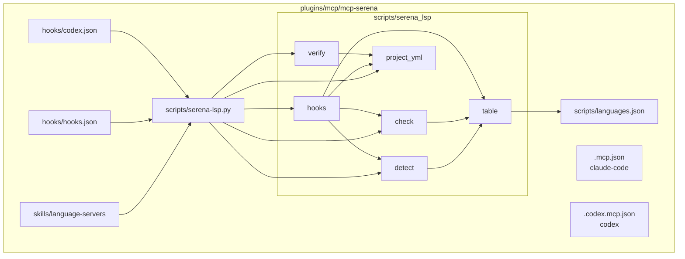
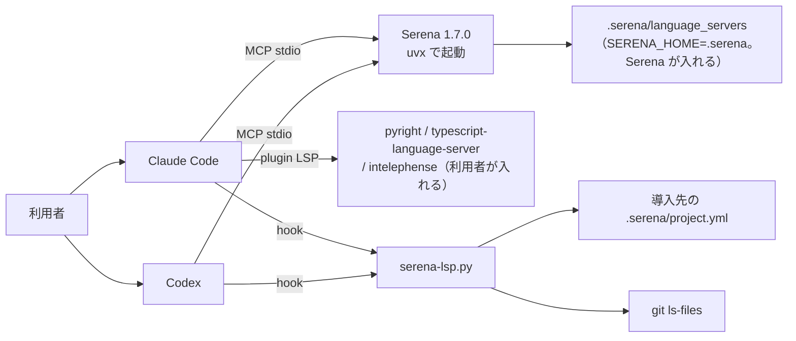
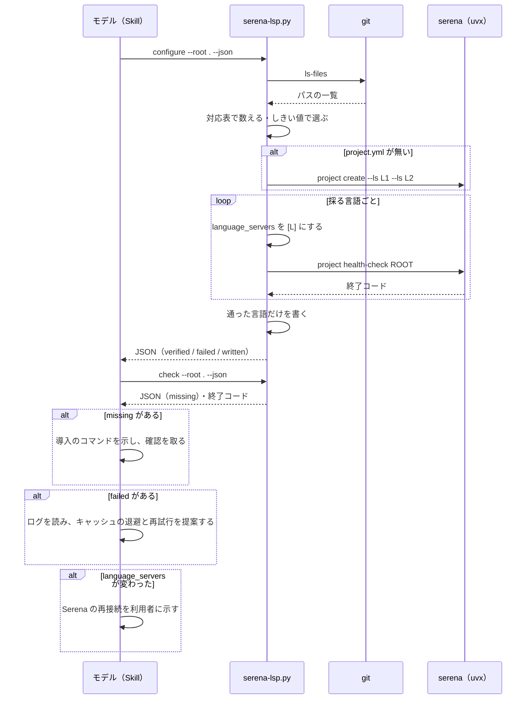
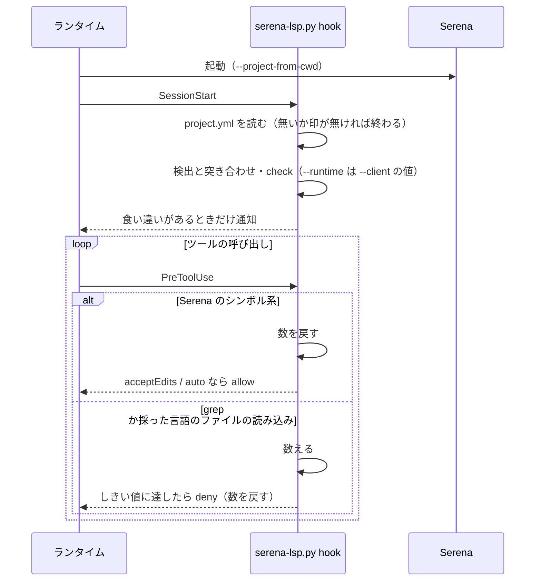

# #818: Claude Code と Codex で言語サーバを使えるようにする — 設計

要求と受け入れ条件は [issue-818-requirements.md](issue-818-requirements.md) にある。決定の理由は
[issue-818-design-decisions.md](issue-818-design-decisions.md)、テスト設計は
[issue-818-design-tests.md](issue-818-design-tests.md) にある。この文書は「どう作るか」だけを扱う。

## 例: このリポジトリで導入の Skill を 1 回通すと

`/mcp-serena:language-servers` を実行すると、Skill は次の 3 行を順に打ち、出力を読んで判断だけをする。

```bash
python3 "$ROOT/scripts/serena-lsp.py" configure --root . --json   # 検出 → 書く → 1 言語ずつ検証
python3 "$ROOT/scripts/serena-lsp.py" check --root . --json       # Claude Code の導入の検査
python3 "$ROOT/scripts/serena-lsp.py" configure --root . --gitignore  # 利用者が「追跡しない」を選んだときだけ
```

`$ROOT` は mcp-serena のプラグインルートで、SKILL.md の冒頭で決める（「Skill の契約」）。

1 行目の出力（要点）:

```json
{"detected": [{"language": "python", "files": 321, "share": 0.81},
              {"language": "bash", "files": 71, "share": 0.18}],
 "skipped": [{"language": "typescript", "files": 4, "share": 0.01, "reason": "below_threshold"}],
 "verified": ["python", "bash"], "failed": [],
 "written": {"language_servers": ["python", "bash"], "ignored_paths_added": [".worktrees/**"]}}
```

2 行目は、`pyright-lsp` が未導入なら次の要素を `missing` に載せ、終了コード 1 で終わる。

```json
{"language": "python", "item": "plugin", "install": "claude plugin install pyright-lsp@claude-plugins-official"}
```

Skill は導入のコマンドを利用者に示し、確認を取ってから打つ。**判断はここだけである。** `language_servers` が変わったときは、Serena の再接続を利用者に示す（「処理の流れ: 導入」）。

## 機能一覧

| # | 機能 | 誰が使うか |
| --- | --- | --- |
| F1 | Serena を固定した版・プロジェクトの自動の有効化・ランタイムに合う文脈で起動する | Claude Code / Codex の利用者（自動） |
| F2 | リポジトリの言語を検出し、Serena の設定を書き、1 言語ずつ起動を確かめる | 導入する利用者（Skill） |
| F3 | Claude Code の LSP（公式プラグインと本体）の導入の欠けを知らせる | 導入する利用者（Skill）と、セッションの開始（hook） |
| F4 | セッションの開始で、設定と実際の言語の食い違いを知らせる | Claude Code / Codex の利用者（hook） |
| F5 | grep やコードファイルの読み込みが続いたとき、シンボル単位の手順へ誘導する | モデル（hook） |
| F6 | 許可のモードが緩いとき、Serena のツールを自動で許可する | Claude Code の利用者（hook） |
| F7 | コード改変系の Skill とエージェント定義が、Serena の正しいツール名と手順を示す | モデル |

## 役割の分担（Claude Code）

| 機能 | 担うもの | 理由 |
| --- | --- | --- |
| 編集の後の診断 | 公式 LSP プラグイン | 次の手番に自動で届く（#818 §4）。呼ぶ手間が無い |
| シンボルの把握・参照・編集 | Serena | `replace_symbol_body` など編集まで持つ。LSP の `LSP` ツールは読むだけ |
| Bash の診断 | Serena（bash-language-server + shellcheck） | 公式の Bash 向け LSP プラグインが無い |

`LSP` ツールと Serena の `get_diagnostics_for_file` はどちらも遅延読み込みで、一覧に載っても文脈はほとんど増えない（#818 §3）。一覧から外す手段は持たず、誘導の文と Skill の 1 行でどちらを使うかを示す（決定 11）。

## スクリプトにする範囲

| 手順 | 担うもの | 理由 |
| --- | --- | --- |
| 拡張子を数える・しきい値で選ぶ | スクリプト | 規則だけで決まる |
| `project.yml` を書く・1 言語ずつ検証する・失敗を外す | スクリプト | 同上。失敗の判定は終了コードで決まる |
| 導入の検査（プラグイン・本体・TypeScript の版・shellcheck） | スクリプト | 同上 |
| 食い違いの通知・誘導・自動許可 | スクリプト（hook） | 同上 |
| 導入のコマンドを打つか | モデル（利用者に確認） | 利用者の環境へ書き込み、ネットワークへ出る |
| `.serena/project.yml` を追跡するか | モデル（利用者に確認） | リポジトリの方針で決まる |
| 検証に失敗した言語の原因と次の手（キャッシュの退避・再試行・諦める） | モデル | ログの読み方が失敗ごとに違う |
| 検出の誤りを名指しで直すか（`--only`） | モデル | 生成物や vendoring の扱いはリポジトリで違う |

## 効果の見積もり（持ち場ごと）

**式:** 減らした量 × (1 + 0.05k + 1.25m)。入力の単価に換算する（#818 §13）。

**数えた値:** 2026-09-19〜09-24 の記録（ndf 10.15.1〜10.17.5、35 会話・441 起動）。層と持ち場は `scripts/token-usage.py` の判定をそのまま使った。

| 値 | 数え方 |
| --- | --- |
| コードの読み込み | `Read` と、`cat` / `sed -n` などでの `.py` / `.ts` / `.sh` などの読み込み。size_i はその結果のトークン |
| k_i | その読み込みの後の、同じ起動の呼び出しの回数 |
| m_i | その読み込みの後の、全体の書き直しの回数（#954 の定義） |
| 重み付きの読み込み | 起動ごとの Σ size_i × (1 + 0.05k_i + 1.25m_i) |

**減らせる割合 r = 0.6** と置いた。#818 §3 で、指示したときの増分が素の状態 29k に対し Serena 11.4k・LSP 10k だった（0.61 / 0.66 減）。**誘導がすべての読み込みに効いた場合の上限である。** 効いた割合は AC26 で測り、AC27 で置き換える。

**費用の側:** Serena の `initial_instructions`（9,208 文字、約 2.6k トークン）を、コードを読む起動で 1 度読むとした。費用 = 2.6k × (1 + 0.05 × 呼び出しの中央値 + 1.25 × 書き直しの平均) × 読み込みのある起動の割合。

| 層 | 持ち場 | 起動 | 呼び出し 中央値 | 書き直し 平均 | 重み付きの読み込み（平均・全起動） | 減る量（× 0.6） | 費用 | 差し引き |
| --- | --- | ---: | ---: | ---: | ---: | ---: | ---: | ---: |
| conductor | - | 35 | 41 | 1.97 | 27.6k | 16.6k | 6.2k | **+10.4k** |
| supervisor | 設計 | 28 | 112 | 4.64 | 83.2k | 49.9k | 31.0k | **+19.0k** |
| supervisor | 実装 | 34 | 66 | 1.74 | 83.5k | 50.1k | 13.3k | **+36.8k** |
| supervisor | 検査 | 33 | 71 | 7.88 | 19.0k | 11.4k | 27.3k | **−15.9k** |
| supervisor | 仕上げ | 10 | 61 | 2.20 | 4.2k | 2.5k | 15.9k | **−13.4k** |
| supervisor | 取り込み | 17 | 62 | 1.94 | 5.4k | 3.2k | 5.9k | **−2.7k** |
| supervisor | その他 | 41 | 36 | 0.80 | 14.9k | 8.9k | 6.0k | **+2.9k** |
| worker | 修正 | 154 | 13 | 0.98 | 11.2k | 6.7k | 4.0k | **+2.8k** |
| worker | 調査 | 35 | 28 | 0.97 | 27.0k | 16.2k | 7.2k | **+9.0k** |
| worker | 検証 | 23 | 16 | 0.78 | 12.2k | 7.3k | 4.1k | **+3.2k** |
| worker | 集計 | 7 | 16 | 1.00 | 1.4k | 0.8k | 1.1k | **−0.3k** |
| worker | その他 | 24 | 20 | 1.29 | 15.9k | 9.5k | 7.4k | **+2.1k** |

- **効くのは設計・実装の supervisor と、conductor・調査の worker である。** 実装の 1 起動で約 37k（Opus 5.5 の入力 $4 / MTok で約 $0.15）
- **検査・仕上げ・取り込みは持ち出しになる見込みである。** コードをあまり読まないのに、書き直しの多さ（検査は起動あたり 7.88 回、うち 6.52 回が 5 分超の待ちの後。#954）が固定費を膨らませる。`initial_instructions` を読むかはモデルが決めるため、これらの持ち場で読まれるかを AC26 と同じ記録で確かめる（未確認 U6）
- **`standard` の Pull Request 1 本あたり**（conductor 1・設計 1・実装 1・検査 1・仕上げ 1・取り込み 1・修正の worker 5・調査 1・検証 1 と置く）の差し引きは約 +60k（約 $0.24）。読み込みの無い起動を 0 とした平均で見積もっている
- 限界: 読み込みのトークンは文字数からの推定で、行番号の接頭辞を含むため多めに出る。`grep -n` の抜粋・`git show` での表示は数えていない

## 構成要素

| 要素 | 区分 | 責務 |
| --- | --- | --- |
| `plugins/mcp/mcp-serena/.mcp.json` | 変える | Claude Code と Kiro の起動定義。`--context claude-code` |
| `plugins/mcp/mcp-serena/.codex.mcp.json` | 新設 | Codex の起動定義。`--context codex` |
| `.codex-plugin/plugin.json` | 変える | `mcpServers` を `./.codex.mcp.json`、`hooks` を `./hooks/codex.json` へ。`skills` を足す |
| `.claude-plugin/plugin.json` | 変える | 説明の更新だけ（版は配布の工程が決める） |
| `scripts/languages.json` | 新設 | 対応表。唯一の正本 |
| `scripts/serena-lsp.py` | 新設 | 入口。サブコマンド `detect` / `configure` / `check` / `hook` |
| `scripts/serena_lsp/table.py` | 新設 | 対応表を読み、拡張子 → 言語の対応を返す |
| `scripts/serena_lsp/detect.py` | 新設 | `git ls-files` を数え、しきい値で言語を選ぶ（純粋な判定と、`git` を呼ぶ薄い層に分ける） |
| `scripts/serena_lsp/project_yml.py` | 新設 | `.serena/project.yml` の `language_servers` / `ignored_paths` を行単位で読み書きする |
| `scripts/serena_lsp/verify.py` | 新設 | 1 言語ずつ `serena project health-check` を走らせる |
| `scripts/serena_lsp/check.py` | 新設 | 導入の検査（公式 LSP プラグイン・本体・TypeScript の版・shellcheck） |
| `scripts/serena_lsp/hooks.py` | 新設 | SessionStart の通知と、PreToolUse の誘導・自動許可 |
| `hooks/hooks.json` | 変える | Claude Code の hook。echo 1 行を置き換える |
| `hooks/codex.json` | 新設 | Codex の hook |
| `skills/language-servers/SKILL.md` | 新設 | 導入と検査の Skill。呼び出しと判断だけを持つ |
| `README.md` / `docs/serena-guide.md` | 変える | 公式の `serena` と併用しないこと・違い・Codex への導入・役割の分担 |
| `tests/` | 新設 | スクリプトのテスト |
| `dev.kiro/install.sh` | 生成物 | `scripts/build-runtime-plugins.sh` が作り直す（手で変えない） |
| `.serena/project.yml`（このリポジトリ） | 変える | `configure` を打った結果。`python` + `bash`、`.worktrees/**` |
| NDF の `refactoring` / `problem-solving` / `tdd-cycle` の `SKILL.md` | 変える | シンボル単位の手順を 1 行ずつ |
| NDF の `agents/corder.md` / `qa.md` / `director.md` / `debugger.md` | 変える | Serena の行だけ（名前空間・memory の記述） |
| `.claude-plugin/marketplace.json` | 変える | mcp-serena の説明の更新 |

## 構成と配置

### 構成要素図



### システムの文脈と配置



- Serena はランタイムごとに 1 プロセスで、セッションの間だけ動く。起動は `uvx`（2 回目以降 0.8 秒、#818 §10）
- `serena-lsp.py` は hook と Skill から毎回起動し、状態は hook の数の記録だけを持つ（後述）

### パッケージ構成

```text
plugins/mcp/mcp-serena/
├── .mcp.json                      # Claude Code / Kiro
├── .codex.mcp.json                # Codex（新設）
├── .claude-plugin/plugin.json
├── .codex-plugin/plugin.json
├── hooks/
│   ├── hooks.json                 # Claude Code（Kiro の installer もこれを読む）
│   └── codex.json                 # Codex（新設）
├── scripts/
│   ├── languages.json
│   ├── serena-lsp.py
│   └── serena_lsp/{__init__,table,detect,project_yml,verify,check,hooks}.py
├── skills/language-servers/SKILL.md
├── tests/
├── docs/serena-guide.md
├── README.md
└── dev.kiro/install.sh            # 生成物
```

## データ構造

### 対応表（`scripts/languages.json`）

言語を足すときに変えるのはこのファイルだけである。ただし、既にある種類の追加の検査で足りない言語は、`check.py` に検査の関数を 1 つ足す（`extra_checks`）。スクリプトは言語の名前で分岐しない。

```json
{
  "version": 1,
  "threshold": {"min_files": 10, "min_share": 0.05},
  "languages": [
    {"serena": "python", "extensions": [".py", ".pyi"],
     "claude_plugin": "pyright-lsp@claude-plugins-official",
     "binaries": [{"command": "pyright-langserver", "install": "npm install -g pyright"}],
     "extra_checks": []},
    {"serena": "typescript", "extensions": [".ts", ".tsx", ".js", ".jsx", ".mts", ".cts", ".mjs", ".cjs"],
     "claude_plugin": "typescript-lsp@claude-plugins-official",
     "binaries": [{"command": "typescript-language-server",
                   "install": "npm install -g typescript-language-server typescript@5"}],
     "extra_checks": ["typescript_major_5"]},
    {"serena": "php", "extensions": [".php"],
     "claude_plugin": "php-lsp@claude-plugins-official",
     "binaries": [{"command": "intelephense", "install": "npm install -g intelephense"}],
     "extra_checks": []},
    {"serena": "bash", "extensions": [".sh", ".bash"],
     "claude_plugin": null, "binaries": [], "extra_checks": ["shellcheck"]}
  ]
}
```

| フィールド | 型 | 空の扱い |
| --- | --- | --- |
| `serena` | 文字列。Serena の `Language` の値 | 必須 |
| `extensions` | 小文字の拡張子の配列。言語をまたいで重ならない | 必須・1 件以上 |
| `claude_plugin` | 公式 LSP プラグインの ID | `null` なら Claude Code の LSP を検査しない（Bash は公式が無い） |
| `binaries` | 本体のコマンドと導入のコマンド | 空なら本体を検査しない |
| `extra_checks` | 名前の付いた追加の検査。`check.py` が名前ごとに 1 つの関数を持つ。知らない名前は対応表の破損として `check` を終了コード 2 で止める | 空でよい |

最初の版で載せるのは上の 4 言語と、公式 LSP プラグインがある `go` / `ruby` / `rust` / `java` / `kotlin` / `csharp` / `swift` / `lua` / `cpp`（`clangd-lsp`）である。拡張子と公式プラグインの名前は、`claude-plugins-official` の `marketplace.json` の `lspServers.extensionToLanguage` から写す（2026-09-24 に確認）。

### `.serena/project.yml` で書き換えるキー

| キー | 書き方 | 他のキー |
| --- | --- | --- |
| `language_servers` | 採った言語を、検出の件数の多い順に並べたブロックの配列で置き換える | 触らない。注釈も保つ |
| `ignored_paths` | `.worktrees/**` が無く、`.worktrees/` が存在するときだけ足す。既存の要素は消さない | 同上 |
| `mcp_serena_excluded` | 外した言語を `<言語> <理由>` の要素で書く（無ければ `[]`）。`configure` が毎回書く | 同上 |

**外した言語は最上位のキー `mcp_serena_excluded` に残す。** 理由は `failed.reason` の値か、`--only` で名指しされなかった `not_selected` である。**このキーがあることが「`configure` で設定した」印である。** Serena 1.7.0 は `--project-from-cwd` で開いた根に `project.yml` が無ければ自動で作る（`ProjectConfig.autogenerate`）ため、ファイルの有無では判定しない。SessionStart の突き合わせは、検出した言語から `language_servers` とこのキーの言語を除いた残りを「設定に無い言語」とする。逆向き（`language_servers` にあってしきい値に届かない言語。`--only` の名指し）は知らせない（決定 9）。

**`project.local.yml` の `language_servers` は `project.yml` を上書きする**（Serena 1.7.0 の `ProjectConfig.load`）。`check` と hook は、そこに `language_servers` があればその値を採った言語として読む。印と外した言語（`mcp_serena_excluded`）は常に `project.yml` から読む。`configure` はそこに `language_servers` を見つけたら書かずに終了コード 3 で止め、理由を出力に載せる。

- 無いときは `serena project create --ls <言語> ... --name <ディレクトリ名> <root>` で作る（非対話。#818 §8）。作った後に同じ書き換えを通す。環境と cwd は `health-check` と同じにする（「処理の流れ: 導入」）
- 書き換えは行単位で行う。対象のキーの行からインデントの無い次のキーまでを 1 ブロックとして置き換える。ブロックの形（`key: []` / `key:` の後に `- 値` の行）以外（流れの形の非空の配列・アンカー）を見つけたら書かずに終了コード 3 で止める

### hook の数の記録

| 項目 | 値 |
| --- | --- |
| 置き場所 | `${XDG_STATE_HOME:-$HOME/.local/state}/mcp-serena/hooks/<session_id>.json` |
| 中身 | `{"grep": 0, "read": 0, "mixed": 0, "last_grep": null, "last_read": null, "last_mixed": null, "last_deny": null}`（`last_*` は UNIX 秒） |
| 消す時点 | 書くたびに、同じディレクトリの 1 日より古いファイルを消す。SessionEnd の hook は置かない |
| 壊れているとき | 無いものとして 0 から数え直す |

## 入出力の契約: スクリプト

### `serena-lsp.py` のサブコマンド

| サブコマンド | 引数 | 書くもの | 終了コード |
| --- | --- | --- | --- |
| `detect` | `--root DIR` `--json` | 無し | 0 検出できた（採る言語が 0 でも 0）/ 2 `git` が使えない・リポジトリでない |
| `configure` | `--root DIR` `--json` `--dry-run` `--gitignore` `--serena-gitignore` `--only LANG,...` `--serena CMD` | `.serena/project.yml`、`--gitignore` のときだけ `.gitignore`、`--serena-gitignore` のときだけ `.serena/.gitignore` | 0 書いた（外した言語があっても 0）/ 1 検証を通った言語が 0 / 2 `git` か `uvx` が使えない / 3 `project.yml` の形が読めない・`project.local.yml` が `language_servers` を持つ |
| `check` | `--root DIR` `--json` `--runtime claude-code\|codex` | 無し | 0 揃っている / 1 欠けがある / 2 読めない（`project.yml` が無い・対応表が壊れている・`installed_plugins.json` が JSON として読めない） |
| `hook session-start` | `--client claude-code\|codex` | 無し | 常に 0 |
| `hook pre-tool-use` | `--client claude-code\|codex` | 数の記録 | 常に 0 |

- `--only` は、検出は走らせたうえで採る言語だけを名指しで置き換える（検出の誤りを利用者が直すとき）。検出された言語のうち名指しされなかったものを `not_selected` として `mcp_serena_excluded` に書く
- `--serena` は Serena の起動の前半を差し替える（既定 `uvx --from serena-agent==1.7.0 serena`）。テストは偽のコマンドを渡す
- `--runtime codex` の `check` は、Claude Code の LSP の項目を飛ばし、Bash の shellcheck だけを見る（Codex は Serena が言語サーバを入れる）。`installed_plugins.json` も読まない
- `installed_plugins.json` が無いときは、どのプラグインも入っていないとして終了コード 1 にする。あるのに JSON として読めないときは、欠けを判定できないので 2 にする
- `--serena-gitignore` は `.serena/.gitignore` に `/serena_config.yml` `/logs` `/language_servers` `/cache` のうち無い行だけを足す。Serena 1.7.0 が作る `.serena/.gitignore` は `/cache` と `/project.local.yml` の 2 行だけで、`SERENA_HOME=.serena` で作られる `serena_config.yml`・`logs/`・`language_servers/` は追跡の候補に残る（2026-09-24、空のリポジトリで `project create` と `health-check` を打って実測）

### `configure` / `check` の JSON

```json
{"root": "/abs/path",
 "detected": [{"language": "python", "files": 321, "share": 0.81}],
 "skipped": [{"language": "typescript", "files": 4, "share": 0.01, "reason": "below_threshold"}],
 "verified": ["python"],
 "failed": [{"language": "bash", "reason": "health_check_exit_1", "log": "/abs/.serena/logs/health-checks/..."}],
 "written": {"created": false, "language_servers": ["python"], "excluded": ["bash"], "ignored_paths_added": [],
             "gitignore": false, "serena_gitignore_added": ["/serena_config.yml", "/logs"]},
 "missing": [{"language": "python", "item": "plugin", "name": "pyright-lsp@claude-plugins-official",
              "install": "claude plugin install pyright-lsp@claude-plugins-official"}]}
```

- `skipped.reason` は `below_threshold`（件数か割合が足りない）だけである
- `failed.reason` は `health_check_exit_<n>` / `timeout`（1 言語 120 秒）/ `serena_unavailable`
- `missing.item` は `plugin` / `binary` / `typescript_major_5` / `shellcheck`
- `detect` は `detected` と `skipped` だけ、`check` は `missing` だけを持つ
- `--serena-gitignore` を渡さないときも、`serena_gitignore_added` に「足せば足す行」を載せる。Skill はこれが空でなければ利用者に確認を取る

## 入出力の契約: hook と起動定義

### hook の入出力

| hook | 入力（標準入力の JSON） | 出力 |
| --- | --- | --- |
| SessionStart（Claude Code） | `cwd` | 通知があるとき `{"hookSpecificOutput": {"hookEventName": "SessionStart", "additionalContext": "<通知>"}}`。無ければ何も出さない |
| SessionStart（Codex） | `cwd` | 同じ形。Codex が読まなければ標準出力の行として残る（未確認 U2） |
| PreToolUse（Claude Code） | `session_id` `tool_name` `tool_input` `permission_mode` `cwd` | 拒否 `{"hookSpecificOutput": {"hookEventName": "PreToolUse", "permissionDecision": "deny", "permissionDecisionReason": "<誘導>"}}`、許可は `"allow"`、どちらでもなければ何も出さない |
| PreToolUse（Codex） | `session_id` `tool_name`（`Bash` / `shell` など）`tool_input.command` `cwd` | 拒否だけ。許可は返さない |

**数える呼び出し:**

| 種類 | Claude Code | Codex |
| --- | --- | --- |
| grep | `Grep`、Serena の `search_for_pattern`、または `Bash` のコマンドの先頭の語が `grep` / `rg` / `ag` / `ack` | コマンドの先頭の語が `grep` / `rg` / `ag` / `ack`、または `search_for_pattern` |
| 読み込み | `Read` の `file_path` の拡張子が採った言語のもの、または `Bash` で右の列と同じ形のもの | 先頭の語が `cat` / `head` / `tail` / `sed` / `less` / `nl` で、引数のどれかの拡張子が採った言語のもの |
| 混在 | grep と読み込みのどちらでも 1 増える（grep 2 回と読み込み 2 回で 4。Serena 1.7.0 の `hooks.py` の `n_recent_non_symbolic_uses` と同じ） | 同じ |
| 数を戻す | Serena のシンボル系のツール（名前に `serena` を含み、`pattern` / `read` / `diagnostics` / `memory` / `onboarding` / `config` / `list_file` / `find_file` / `shell` / `dashboard` / `restart_language_server` のどれも含まない。Serena 1.7.0 の `hooks.py` と同じ 11 個）の呼び出し | 同じ |

- 閾値と待ちは Serena 公式の `serena-hooks remind` と同じ（grep 3・読み込み 3・混在 4・拒否の後 120 秒）。数には有効期間があり、前回の同じ種類から grep と読み込みは 1000 秒、混在は 2000 秒を過ぎたら 1 から数え直す
- **`configure` の印（`mcp_serena_excluded`）の無いリポジトリでは何も数えない**。Serena が自動で作った `project.yml` も数えない
- 誘導の文（`permissionDecisionReason`）は 3 行に収める。読む手順は `get_symbols_overview` → `find_symbol`（`include_body`）→ `find_referencing_symbols`、編集は `replace_symbol_body` と、ツール名で示す
- 数を戻したので続けてよいことも、同じ文に書く

**通知の文（SessionStart）:** 食い違いと欠けを 1 項目 1 行で出し、最後に Skill の名前を 1 行出す。

```text
[mcp-serena] 設定に無い言語があります: typescript（97 ファイル）
[mcp-serena] Claude Code の LSP が足りません: pyright-lsp（プラグイン）
[mcp-serena] /mcp-serena:language-servers で直せます
```

### 起動定義

```json
{"mcpServers": {"serena": {"type": "stdio", "command": "uvx",
  "args": ["--from", "serena-agent==1.7.0", "serena", "start-mcp-server",
           "--context", "claude-code", "--project-from-cwd",
           "--add-mode", "no-memories", "--add-mode", "no-onboarding",
           "--enable-web-dashboard", "False"],
  "env": {"SERENA_HOME": ".serena"}}}}
```

`.codex.mcp.json` は `--context codex` だけが違う。起動したときのツールの数は次のとおりだった（2026-09-24、MCP の `tools/list` で実測）。

| 定義 | ツール | 無いもの |
| --- | ---: | --- |
| Claude Code（`claude-code`） | 14 | `activate_project`・memory の 6 ツール・`onboarding`・`get_current_config`・`search_for_pattern`（10 個） |
| Codex（`codex`） | 23 | `replace_content`（1 個）。Serena 1.7.0 の `codex` 文脈はモードでツールを絞らない（決定 3） |

差の 9 は、`codex` にだけある 10 個から `claude-code` にだけある 1 個を引いた数である。

**`SERENA_HOME` は今の値（`.serena`）を保つ（決定 16）。** 作業ツリーごとに言語サーバを取得し直す費用を受け入れる。

### Skill の契約（`skills/language-servers/SKILL.md`）

Skill は Claude Code・Codex・Kiro へ同じファイルを配る。`${CLAUDE_PLUGIN_ROOT}` を置き換えるのは Claude Code だけなので、冒頭の bash で `$ROOT` を NDF の Skill と同じ手順で決める（`plugins/ndf/skills/fix/SKILL.md` の「コメントの取得」）。

| 順 | 候補 | 当たるランタイム |
| --- | --- | --- |
| 1 | `PLUGIN_ROOT='${CLAUDE_PLUGIN_ROOT}'`。`$` で始まったまま（置き換えられなかった）なら空にする | Claude Code |
| 2 | `<この Skill のディレクトリ>` の 2 つ上。モデルがランタイムから渡された Skill の実際のパスへ置き換えてから打つ | Codex |
| 3 | `.kiro/skills/language-servers` の 2 つ上 | Kiro（installer の symlink） |

- 候補は `cd -P` で実体へ解決してから 2 つ上がる（symlink のまま上がると `.kiro/` を指す）。`scripts/serena-lsp.py` がある最初の候補を採り、どれも当たらなければ止まる
- 打つ順は「例」の 3 行。`serena_gitignore_added` が空でなければ確認を取り、`--serena-gitignore` をつけて打ち直す
- `configure` は言語の数 × 120 秒かかり得るため、Bash ツールの上限を指定して打つ（Claude Code は `timeout` に 600000）
- `language_servers` が変わったら、Serena の再接続を示す（Claude Code は `/mcp` の再接続かセッションのやり直し、Codex はセッションのやり直し）。起動中の Serena は起動時の `project.yml` の言語で動いている

### hook 定義

| ファイル | イベント | matcher | コマンド |
| --- | --- | --- | --- |
| `hooks/hooks.json` | SessionStart | `startup` | `python3 "${PLUGIN_ROOT:-${CODEX_PLUGIN_ROOT:-${CLAUDE_PLUGIN_ROOT}}}/scripts/serena-lsp.py" hook session-start --client claude-code` |
| `hooks/hooks.json` | PreToolUse | `Grep\|Read\|Bash\|mcp__plugin_mcp-serena_serena__.*` | 同じ入口で `hook pre-tool-use --client claude-code` |
| `hooks/codex.json` | SessionStart | （無し） | `sh -c 'if [ -n "$PLUGIN_ROOT" ]; then python3 "$PLUGIN_ROOT/scripts/serena-lsp.py" hook session-start --client codex; fi; exit 0'` |
| `hooks/codex.json` | PreToolUse | `Bash\|shell\|exec_command\|local_shell\|mcp__.*serena.*` | 同じ形で `hook pre-tool-use --client codex` |

プラグインルートのプレースホルダの形は NDF の hook と同じにする。Kiro の installer がこの形を symlink の絶対パスへ置き換え、`SessionStart` を `agentSpawn` へ写す（`build-runtime-plugins.sh`）。**`--client claude-code` の hook は、環境に `CLAUDE_PLUGIN_ROOT` が無ければ何も出さずに 0 で終わる**（Kiro は置かない。決定 15）。

## 処理の流れ: 導入（Skill）




- 終了コード 3 の検査（`project.local.yml` の `language_servers`・読めない形）は、書き換えの `try` / `finally` に入る前に済ませて返す。3 で止まるときは `finally` を通らず、何も書かない
- 検証の間、`project.yml` を 1 言語ずつ書き換える。**終わったら必ず最後の値を書く**（例外でも `finally` で、通った言語だけを書く。通った言語が 0 なら `language_servers: []` と、失敗した言語を `mcp_serena_excluded` に書く）。SIGTERM / SIGINT は例外へ変えて同じ `finally` を通す。SIGKILL で 1 言語のまま残っても、SessionStart が「設定に無い言語」として知らせ、`configure` の打ち直しで直る
- `configure` が起動する `serena` のすべて（`project create` と `health-check`）に、起動定義と同じ `SERENA_HOME=.serena` を渡し、cwd を `--root` にする。既定の `~/.serena` で走らせると利用者の全体の設定を書き換え得る。これで、検証する言語サーバのキャッシュが、ランタイムが起動した Serena の使うもの（`<root>/.serena/language_servers/`）と一致する
- 1 言語の検証に 120 秒の上限を置く。上限に達したら失敗として外す
- `health-check` は `.serena/logs/health-checks/` にログを書く。Serena 1.7.0 の `.serena/.gitignore` は `/logs` を外さないため、追跡から外すのは `--serena-gitignore` である

## 処理の流れ: セッション



- 2 つの図に現れない要素は、文書と定義の変更である（`README.md`・`serena-guide.md`・`SKILL.md`・エージェント定義・`plugin.json`・`marketplace.json`・生成物の `dev.kiro/install.sh`）。`table` と `languages.json` は `detect` と `check` の中で読まれる
- SessionStart は `--client` の値をそのまま `check` の `--runtime` に渡す（`codex` なら Claude Code の LSP の項目を見ない）。`check` が 2 を返したときは導入の欠けの行を出さない
- SessionStart の検査は PATH と `installed_plugins.json` を読むだけで、`claude` も `serena` も起動しない（AC23）
- hook の中で例外が出たら、何も出さずに 0 で終わる

## 非機能の実現方式

| 大項目 | 実現方式 |
| --- | --- |
| 性能 | SessionStart は `git ls-files -z` を 1 回と、設定のファイル（`project.yml`・`project.local.yml`・対応表・`--runtime claude-code` のときだけ `installed_plugins.json`）を読むだけにする。PreToolUse は `project.yml`（あれば `project.local.yml`）と数の記録を読むだけにし、`git` を呼ばない。採った言語の拡張子は `project.yml` の `language_servers` と対応表から毎回求める（キャッシュを持たない） |
| 可用性 | 1 言語ずつの検証で、壊れた言語を設定から外す（AC7）。hook は例外を握りつぶして 0 で終わる |
| 運用・保守性 | 言語の追加は `languages.json` の 1 要素。追加の検査だけは `check.py` に名前付きの関数を足す |
| 移行性 | mcp-serena の更新は `project.yml` を書き換えない。既存の利用者は、SessionStart の通知を見て Skill を 1 度打つ |
| セキュリティ | 導入のコマンドは出力に載せるだけで、スクリプトは打たない。`.gitignore` は `--gitignore`、`.serena/.gitignore` は `--serena-gitignore` のときだけ書く。`serena_config.yml` を追跡の候補から外す手段を Skill が示す |
| システム環境 | スクリプトは Python 3 の標準ライブラリだけを使う。`uvx` が無いときの `configure` は終了コード 2 で止める。hook は `uvx` を呼ばない |
