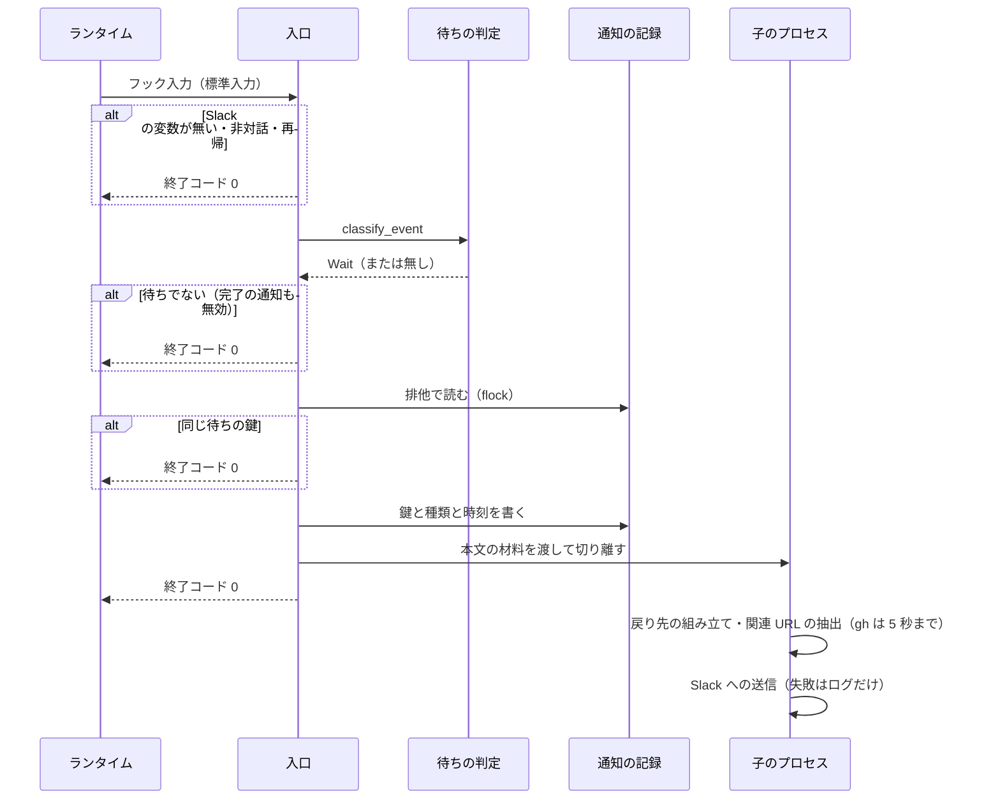
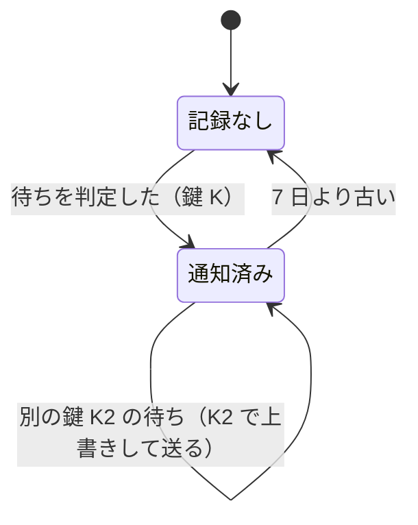

# #821: 待ちの通知の処理の流れと決定

[issue-821-wait-notify-design.md](issue-821-wait-notify-design.md) の続きである。処理の流れ・非機能の実現方式・
決定の記録・テスト設計・未確認のまま残ることを持つ。語と構成要素はそちらの定義による。

## 処理の流れ

子のプロセスの中の 3 要素（戻り先の組み立て・関連 URL の抽出・Slack への送信）は、1 つの参加者に
まとめて描く。

**記録を送る前に書く。** 送った後に書くと、6 秒ほど離れて届く 2 つの事象（`ExitPlanMode` の
`PermissionRequest` と `permission_prompt`）の両方が、書かれる前の記録を読みうる。送信に失敗すると
その待ちは通知されないまま鍵が残るが、次の待ちは鍵が変わるため止まらない。

**待ちの鍵は transcript の末尾から取る。** 末尾から読み、最後の `type: user` の項目の `uuid` を
鍵にする。利用者が答えるか許可すると、ツールの結果か指示の user の項目が足され、鍵が変わる。
transcript が読めないときは `<セッションの ID>:window` を鍵にし、記録の `sent_at` から 60 秒の内だけ
同じ鍵を止める（決定 5）。Claude の鍵に事象の名前を入れないのは、同じ待ちに届く 2 つの事象で名前が
違うためである。Codex と Kiro の鍵は決定 5 の表のとおりランタイムごとに組む。

### 通知の記録の状態

## 非機能の実現方式

| 大項目 | 実現方式 |
| --- | --- |
| 性能 | 入口は判定と記録だけを同期で行い、`PreToolUse` / `PermissionRequest` / `Stop` を 1 秒以内に返す。モデルの呼び出し（現行は最大 60 秒）を無くす。transcript は末尾の 1 MB だけを読む |
| 可用性 | どの失敗も終了コード 0。フックの上限を超えても利用者の操作は止まらない（`continueOnError`） |
| セキュリティ | bot トークンはログにも本文にも書かない。本文に載るのは抜粋（200 字）と URL だけで、現行の要約（最終応答から作る）より送る量は減る。子へは本文の材料だけを引数で渡し、トークンは環境から読む |
| 機密 | 判定の実例（`wait_notice_corpus.json`）は、このリポジトリ（公開）のセッションだけから作る。ほかのリポジトリの transcript は利用者の顧客の情報を含みうるため、実例に入れない（決定 12） |

## 決定の記録

### 決定 1: 文での待ちは規則で判定し、モデルを呼ばない

判定に要るのは最後の数文の形だけで、規則で決まる。モデルを呼ぶと 1 回ごとに数秒から 60 秒かかり、
トークンを使う（マイルストーンの Value 1「決定論が先」）。2026-09-25 に手元の対話のセッション
（`CLAUDE_CODE_ENTRYPOINT=cli`）から、利用者の入力の直前で終わった応答 344 件を抜き、無作為の 60 件を
規則の試作に当てて手で確かめた。待ちと判定した 25 件のうち誤検知は 3 件（適合率 88%）、待ちだった
26 件のうち見逃しは 4 件（再現率 85%）だった。設計文書の「本文の判定」はこの 7 件を見て語を足したものである。

haiku による分類は採らない。要約と 1 回にまとめても、応答の終わりのたびにモデルを起動することは
変わらない。語の並びをプロジェクトの宣言で変える形も採らない。判定するのは NDF とランタイムが書く
日本語の文の形で、プロジェクトごとに分かれるものではない。

### 決定 2: 要約をやめ、判定に当たった文を抜粋として載せる

利用者が通知で知りたいのは「何を求められているか」で、判定に当たった文がそのものである。要約は
その文を言い換えるだけで、モデルの呼び出しが要る。

### 決定 3: 通知を Python の 1 本へまとめ、2 本の JS を消す

判定・抽出・抑止は純粋な処理が大半で、テストはこのリポジトリの pytest で書ける。JS の 2 本は
Claude Code / Kiro 用と Codex 用で、Slack への送信と `.env` の読み込みを別々に持つ。1 本にまとめると
方針を 3 ランタイムで揃える場所が 1 つになる。ほかのフックは bash と python3 で書かれており、node への
依存も無くなる。

JS のまま直す案は採らない。テストの仕組みが無く、2 本に同じ判定を足すことになる。Kiro の生成済みの
定義は旧いパスを指したまま残り、通知が止まる。README の Kiro の節に「`install.sh --with-slack` を
打ち直す」を書く。

### 決定 4: `idle_prompt` を捉えない

応答の終わりから約 60 秒で必ず届き、回答待ちか完了かを区別できない。文での待ちは `Stop` の判定が
先に捉えるため、`idle_prompt` を足すと同じ待ちを 2 度送る経路が増えるだけになる。

### 決定 5: 待ちの鍵を transcript の最後の user の `uuid` にする

同じ待ちに届く複数の事象（`ExitPlanMode` の `PermissionRequest` と `permission_prompt` など）は、
どれも同じ user の項目（指示・ツールの結果）の後で起きる。利用者が応じると次の user の項目が足される
ため、鍵は待ちごとに変わる。当初は最後の assistant の `uuid` を鍵にする案だったが、実測（2.1.282）で
`PreToolUse`・`PermissionRequest`・`Stop` の起動の時点ではその応答の assistant の項目がまだ書かれて
おらず、1 つ前の応答の項目を鍵にしてしまうため退けた。時間の窓だけで抑える案は、窓の内に続いた別の待ち（許可した直後の次の許可）を落とすため、
transcript が読めないときの受け皿に限る。`PostToolUse` と `UserPromptSubmit` で待ちを閉じる案は、
すべてのツールの実行のたびにプロセスを起動することになるため採らない。

transcript を持たない Codex と Kiro は、入力から取れるもので鍵を組む。

| ランタイム | 鍵 | 窓 | 取れないとき |
| --- | --- | --- | --- |
| Claude Code | transcript の最後の user の `uuid` | なし | `<セッションの ID>:window`（60 秒） |
| Codex | `<turn_id>:<事象の名前>:<tool_input のハッシュ>` | なし | `<セッションの ID>:window`（60 秒） |
| Kiro | `<セッションの ID>:<応答本文のハッシュ>` | 60 秒 | `<応答本文のハッシュ>:window`（60 秒） |

Codex の鍵に事象の名前を入れるのは、同じ turn の内で `PermissionRequest` と `Stop` が別の待ちとして
続くためである。Codex には Claude の `permission_prompt` のように同じ待ちへ重ねて届く事象が無く、名前で
分けても 2 度送らない。Kiro のセッションの ID は、stop の標準入力（`hook_event_name`・`cwd`・
`assistant_response` だけ）には無く、環境変数 `KIRO_SESSION_ID` から取る（`worktree-guard.sh` と同じ）。
Kiro の鍵はどちらも窓で扱う。Kiro には Claude の user の項目のように応じると変わる値が無く、窓なしでは
同じセッションで答えた後に同じ文面で問われた 2 件目が期限なく止まる。取れないときの鍵に応答本文のハッシュを
残すのは、同じ cwd で続いた別の問いを止めず、連続した同じ文面を 60 秒止めるためである（記録は 1 セッションに最後の 1 鍵だけで、間に別の文面が入ると止まらない）。戻り先の
`kiro-cli chat --resume-id` も同じ `KIRO_SESSION_ID` から組む。

### 決定 6: 非対話の実行では送らない

`claude -p`（`CLAUDE_CODE_ENTRYPOINT` が `sdk-cli` など）のセッションには、利用者が戻って答える画面が
無い。NDF の 3 層の worker と supervisor、中継の下の `claude -p` がこれに当たり、送ると応答の終わりごとの
通知が形を変えて残る。

### 決定 7: 応答の終わりごとの通知を `NDF_SLACK_NOTIFY_DONE` で残す

作業の完了を知りたい利用者はいる。既定を待ちだけにし、選んだ利用者にだけ「完了」を送る。本文は
最後の段落の先頭 200 字で、要約は作らない（決定 2）。

### 決定 8: Redmine は `REDMINE_URL` で見分ける

Redmine の URL の形はリポジトリから決まらない。本文中の URL をすべて採る案は、Redmine 以外の URL を
課題として載せる。課題追跡の抽象化（マイルストーン 08）の宣言ができたら、そちらを読む形へ移す。

### 決定 9: `#番号` は origin から組み立て、PR の補いだけ `gh` を呼ぶ

`#番号` を URL にするには owner と repo が分かれば足り、`git remote` で取れる。`gh` はネットワークを
使うため、本文に無い PR を補うときだけ、子のプロセスで上限を付けて呼ぶ。

### 決定 10: Codex と Kiro は同じ入口を使い、取れる範囲で揃える

| ランタイム | 文での待ち | 承認の画面 | 選択式の問い | 戻り先 |
| --- | --- | --- | --- | --- |
| Claude Code | `Stop` | `permission_prompt`・`ExitPlanMode` | `AskUserQuestion` | URL か `claude --resume` |
| Codex | `Stop` | `PermissionRequest` | 対象外（捉えるフックが無い） | `codex resume <ID>` |
| Kiro | `stop` | 対象外（捉えるフックが無い） | 対象外 | `kiro-cli chat --resume-id` か `--resume` |

Codex の `PermissionRequest` は Codex 0.157.0 の本体に事象の名前があることまでを確かめた。発火と入力の
形は実装の最初に実測し、発火しなければ Codex の承認の画面は対象外として README に書く。

### 決定 11: セッションの URL は環境変数から組み立てる

Claude Code 2.1.282 の本体では、フック入力の型（`Stop` / `Notification` / `PermissionRequest`）に
`session_url` が無い。`session_url` は Remote Control の接続の状態と、クラウドの `-p` の結果にだけ
現れる。本体が URL を組み立てる関数は `https://claude.ai/code/` に互換形の ID（`cse_` を `session_` へ
変えたもの）を付けており、同じ形にする。

### 決定 12: 判定の実例はこのリポジトリのセッションだけから作る

決定 1 の 344 件には、ほかのリポジトリ（利用者の顧客の業務）の会話が含まれていた。実例はテストの
ファイルとして公開リポジトリへコミットするため、ai-plugins のセッションの応答だけを使い、個人名と
他のリポジトリの名前を除く。

## テスト設計

テストは `plugins/ndf/scripts/tests/test_wait_notify.py` に置く。入口は、`https://slack.com` の代わりに
記録用の偽の送信先（`NDF_SLACK_API_BASE` を試験のときだけ読む）と偽の `gh`・`git` を `PATH` の先頭に置いて
起動する。

| 受け入れ条件・不変条件 | 何で確かめるか |
| --- | --- |
| 作業完了の報告では通知しない | 実例の「待ちでない」の全件で `classify_text` が待ちでないを返す割合が 90% 以上。`Stop` の入口に完了の報告を渡し、偽の送信先へ 1 件も届かない |
| 権限確認・`AskUserQuestion`・`ExitPlanMode` で通知する | 3 つの事象の入力を入口へ渡し、それぞれ 1 件届き、種類が表どおり |
| 文での回答・承認の待ちで通知する（誤検知・見逃しを実例で） | 実例（60 件以上。回答待ち・承認待ち・待ちでないの 3 つの正解付き）で、適合率と再現率がそれぞれ 85% 以上。数えた値を実装 PR の本文に載せる |
| 種類の印を付ける | 本文の先頭が `【回答待ち】` / `【承認待ち】` / `【完了】` のどれか（I6） |
| Remote Control 中・クラウドで URL が載る | `CLAUDE_CODE_BRIDGE_SESSION_ID=cse_x` で `https://claude.ai/code/session_x`、`CLAUDE_CODE_REMOTE_SESSION_ID=session_y` で `…/code/session_y`。開くと当該セッションへ行くことは実機で 1 回確かめる |
| Remote Control なしで `claude --resume` とホスト名・cwd が載る | 2 つの変数を消して起動し、`再開: claude --resume <session_id>` と `host:` `cwd:` の行 |
| 回答待ちに issue / Redmine の URL が載る | 本文に `#821`・`https://github.com/o/r/issues/5`・`Redmine #14952`（`REDMINE_URL` あり）を置き、3 行とも載る。`REDMINE_URL` なしで Redmine の行が無い |
| 承認待ちに PR の URL が載る（無ければ現在のブランチ） | 本文の PR を採る場合と、偽の `gh` が返す URL を採る場合と、`gh` が失敗して行を省く場合の 3 つ（I8） |
| 二重に通知しない | 同じ transcript で `PermissionRequest`（`ExitPlanMode`）と `permission_prompt` を続けて渡し、届くのは 1 件。transcript に項目を足した後の次の待ちは届く（I1） |
| description・引数・README を実際の発火に合わせる | `hooks/claude.json` に `session_end` と「exits」が無く、入口を指すことをテストで見る。README は `plan-to-spec` の前の文書の検査とレビューで見る（文言を照合するテストは書かない） |
| Codex / Kiro の扱いを決め README に書く | 決定 10 の表を README へ写す。`--runtime codex` と `--runtime kiro` の `Stop` の入力で待ちが届き、戻り先が表どおり |
| Kiro の待ちの鍵をセッションで分ける（決定 5） | 同じ文面を `KIRO_SESSION_ID` の違う 2 つのセッションで渡し、2 件とも届く。戻り先はそれぞれ `kiro-cli chat --resume-id <ID>` |
| Kiro の同じセッションの同じ文面は 60 秒の窓で止める（決定 5） | 同じ `KIRO_SESSION_ID` と文面で、窓の内の 2 件目は届かず、記録の送信時刻を窓の外へ動かした後の 2 件目は届く |
| Kiro でセッションの ID が無いときは同じ文面だけを止める（決定 5） | ID 無しで同じ文面を 2 回と別の文面を 1 回渡し、届くのは 2 件。記録の鍵は `<本文のハッシュ>:window` |
| Kiro の窓は連続した同じ文面だけを止める（決定 5） | 同じ `KIRO_SESSION_ID` で文面 A・B・A を窓の内に渡し、3 件とも届く |
| `KIRO_SESSION_ID` を Kiro 以外の鍵に混ぜない（決定 5） | 環境変数が残った状態で Codex の `Stop` を渡し、記録の名前と鍵にその値が入らない |
| I2 待ちでないなら送らない | `NDF_SLACK_NOTIFY_DONE` なしで完了の報告を渡し、届かない |
| I3 フラグがあれば「完了」で送る | `NDF_SLACK_NOTIFY_DONE=true` で完了の報告を渡し、「完了」で届く |
| I4 非対話では待ちを作らない | `CLAUDE_CODE_ENTRYPOINT=sdk-cli` で、問いの応答でも届かず、記録も作らない |
| I5 再帰では待ちを作らない | `stop_hook_active: true` で、問いの応答でも届かず、記録も作らない |
| I7 戻り先を 1 つ持つ | セッションの ID を消したフック入力で、`host:` `cwd:` の行だけが戻り先として載る |
| I9〜I12 外の系の失敗でフックを失敗させない | 標準入力が空（I9）・transcript が壊れている（I10）・`gh` が無い（I11）・送信先が 500 を返す（I12）の 4 つで、それぞれ終了コード 0 と標準出力が空 |
| 入口が 1 秒以内に戻る | 送信先が 5 秒待たせる設定で `Stop` を起動し、入口のプロセスが 1 秒以内に終わる |

導入の確かめ（`tests/runtime-smoke`）は、Claude Code と Codex の入口を `hook-stop.json` で起動し、終了
コード 0 を見る。

## 未確認のまま残ること

| 項目 | 内容 |
| --- | --- |
| `PermissionRequest` の無出力の扱い | 標準出力が空で終了コード 0 のとき、`ExitPlanMode` の許可の画面がそのまま出るか。実装の最初に実機で確かめる |
| URL で開けるか | `cse_` を `session_` へ変えた URL が、Remote Control とクラウドの両方で当該セッションを開くか。実装 PR の検証で 1 回ずつ開く |
| Codex の `PermissionRequest` | 発火の条件と入力の形（決定 10） |
| Kiro の `stop` の起動 | 標準入力にセッションの ID が無いことは決定 5 に書いた。`KIRO_SESSION_ID` が stop の起動でも入るかを実機で確かめる。入らなければ鍵は受け皿（60 秒の窓）になり、戻り先は `kiro-cli chat --resume` の行だけにする |
| Kiro の旧いパスの失敗 | 打ち直す前の定義が消えた `slack-notify.js` を起動して失敗したとき、Kiro が操作を止めないか。実装の検証で 1 回確かめ、止めるなら同じ変更で `slack-notify.js` を入口へ渡すだけの薄い写しを残す |
| `worker_permission_prompt` と `agent_needs_input` | 本体 2.1.282 の通知の種類にあるが、発火の場面を確かめていないため捉えない。利用者から見逃しの報告があれば足す |
| Codex と Kiro の非対話の実行 | `codex exec` と `kiro-cli chat --no-interactive` で `Stop` が発火するか、見分ける値があるか。発火して見分けられなければ、その 2 つは README に「非対話では通知が出うる」と書く |
| 中継の下で判断を求める報告 | 中継の下の `claude -p` は決定 6 で送らない。中継が利用者の判断を待つ時点の通知は、中継の側の課題として扱う |
