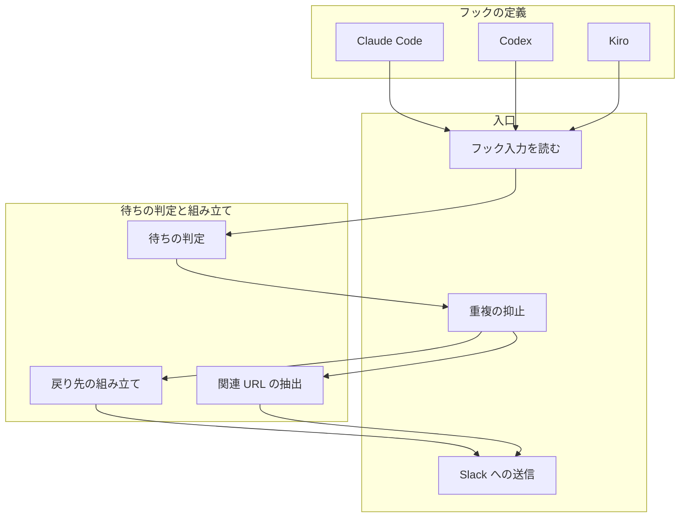
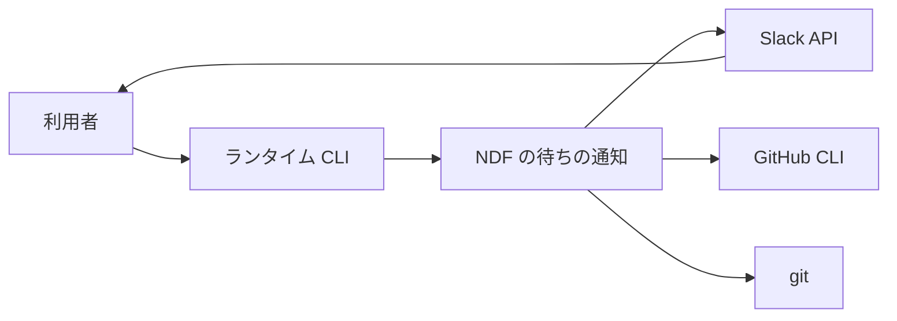
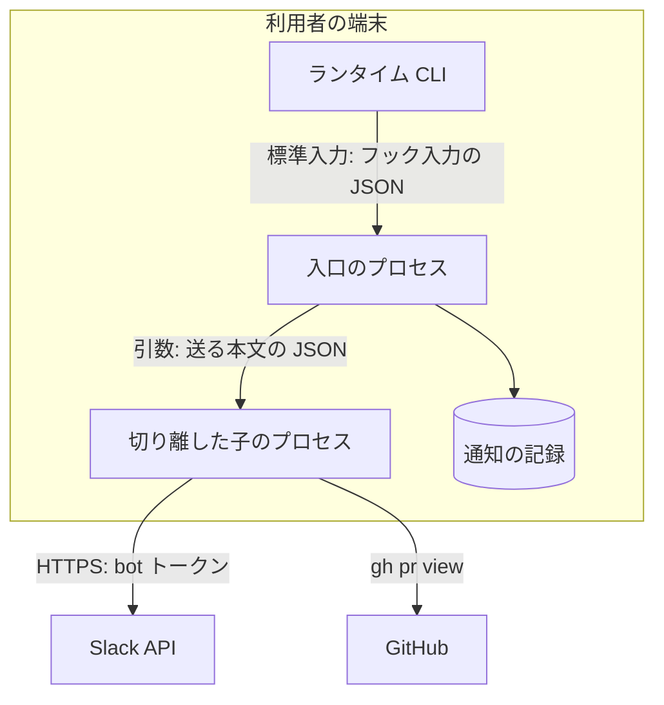
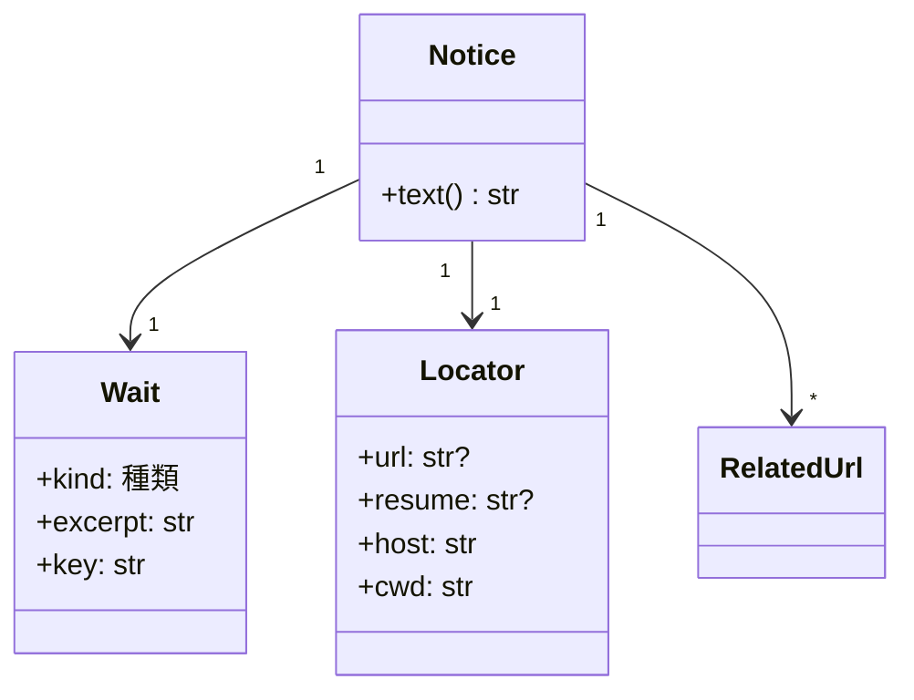

# #821: Slack 通知を回答・承認待ちのときだけ送り、セッションと issue / PR の URL を載せる

要求と受け入れ条件は #821 の本文にある（写しは [issue-821-requirements.md](issue-821-requirements.md)）。
この文書は「どう作るか」だけを扱う。設計は 2 本に分けた。

| ファイル | 持つ節 |
| --- | --- |
| この文書 | 具体例・ドメインモデル・機能一覧・構成要素・構造・データ構造・入出力の契約 |
| [issue-821-wait-notify-design-decisions.md](issue-821-wait-notify-design-decisions.md) | 処理の流れ・非機能の実現方式・決定の記録・テスト設計・未確認のまま残ること |

**仕様の「対象範囲（含まない）」に無い省略はここに書く。** 画面と API の仕様記述（OpenAPI）は作らない。
呼び出される約束はフックのコマンド・環境変数・Slack へ送る本文だけで、形は `interface-api.md` の
コマンドの表で書く。ER 図は作らない。永続データは待ちの通知の記録 1 種だけで、関連を持たない。

## 具体例: 設計 PR の承認を求めて応答を終える

Remote Control 中のローカル CLI で、conductor が次の文で応答を終えたとする。

```text
設計 PR を出しました。https://github.com/devbasex/ai-plugins/pull/1150
モデルの段と詳細の段のレビューが通りました。この設計でマージしてよいですか。
```

| 時点 | 今 | この設計の後 |
| --- | --- | --- |
| 応答が終わる | `Stop` が `slack-notify.js session_end` を起動する | `Stop` が `wait-notify.py --runtime claude` を起動する |
| 待ちかどうか | 見ない。応答の終わりごとに送る | 最後の 3 行の文「この設計でマージしてよいですか。」が問いの形で、承認の語「マージしてよい」を持つ。種類は **承認待ち** |
| 本文を作る | `claude --model haiku -p` を起動して 40 文字の要約を作る（最大 60 秒） | 判定に当たった文をそのまま抜く。モデルを呼ばない |
| 戻り先 | 載らない | 環境変数 `CLAUDE_CODE_BRIDGE_SESSION_ID` から `https://claude.ai/code/session_…` を組み立てる |
| 関連 URL | 載らない | 本文の `…/pull/1150` を採る。本文に無ければ現在のブランチの PR を `gh pr view` で補う |
| 二重の抑止 | cwd ごとのロックと 5 秒のクールダウン | 待ちの鍵（transcript の最後の user の `uuid`）が前回の通知と同じなら送らない |

Slack には次の本文が届く（`SLACK_USER_MENTION` があれば、メンション付きを送って消す現行の手順を残す）。

```text
【承認待ち】[ai-plugins] この設計でマージしてよいですか。
セッション: https://claude.ai/code/session_01AbCdEf
host: devbase-01 / cwd: /work/ai-plugins
PR: https://github.com/devbasex/ai-plugins/pull/1150
```

同じ応答が「設計 PR を出しました。レビューの結果を待ちます。」で終わった場合は、問いの文が無いため
種類は **待ちでない** になり、何も送らない。

## ドメインモデル

### コンテキスト

| コンテキスト | 何の語が 1 つの意味に決まるか |
| --- | --- |
| NDF の Slack 通知（`ndf-notification`） | 利用者の手を待つ時点・その種類・通知の本文と戻り先 |

1 つのコンテキストで閉じる。ランタイムのフックの事象（`Notification` の `notification_type`・
`PermissionRequest`・`Stop` の本文）は外部の系のモデルで、待ちの判定がこのコンテキストの語（待ちの種類）へ
訳す。訳しは `classify_event` の対応表だけが持ち、フックの事象の名前を判定や本文の組み立てへ持ち込まない
（腐敗防止層の形。相手がコンテキストではなく外部の系のため、コンテキストマップの関係は宣言しない）。

### 集約

| 集約 | 持ち主（書き換えてよいもの） | 根 | エンティティ | 値オブジェクト |
| --- | --- | --- | --- | --- |
| 待ち | 待ちの判定 | 待ち | — | 待ちの種類・抜粋・待ちの鍵 |
| 通知の本文 | 本文の組み立て | 通知の本文（`Notice`） | — | 待ち・戻り先・関連 URL |
| 通知の記録 | 重複の抑止 | 通知の記録（セッションの ID ごと） | — | 待ちの鍵・送った時刻 |

**待ちと通知の本文はフックの 1 回の起動の中だけで生きる。** 保存しない。保存するのは通知の記録だけで、
待ちの鍵を ID として参照する。

**戻り先と関連 URL は待ちに入れず、通知の本文に入れる。** 待ちの判定に要らないためである。戻り先の
組み立てと関連 URL の抽出が作った値を、本文の組み立てが受けて通知の本文にする。本文・戻り先・PR の
URL を縛る条件（I6〜I8）は、この集約が持つ。

### 不変条件

| # | 集約 | 条件 | 破れたときの扱い |
| --- | --- | --- | --- |
| I1 | 通知の記録 | 1 つの待ちの鍵につき、送る通知は高々 1 回 | 同じ鍵の 2 回目は送らずに終わる |
| I2 | 待ち | `NDF_SLACK_NOTIFY_DONE=true` でないとき、種類が「待ちでない」なら送らない | 送らずに終わる |
| I3 | 待ち | `NDF_SLACK_NOTIFY_DONE=true` のとき、種類が「待ちでない」なら種類を「完了」に置き換えて送る | 「完了」の印で送る |
| I4 | 待ち | 非対話の実行（`CLAUDE_CODE_ENTRYPOINT` が `sdk-` で始まる）では待ちを作らない | 判定の前に終わる |
| I5 | 待ち | `stop_hook_active` が真の再帰では待ちを作らない | 判定の前に終わる |
| I6 | 通知の本文 | 本文は種類の印（`【回答待ち】` / `【承認待ち】` / `【完了】`）で始まる | 印を引けない種類では本文を作らずに終わる |
| I7 | 通知の本文 | 本文は戻り先を 1 つ持つ。戻り先は `host: <ホスト名> / cwd: <cwd>` の行と、作れればセッションの URL か再開のコマンドの行 | URL も再開のコマンドも作れないときは、ホスト名と cwd の行だけを戻り先とする |
| I8 | 通知の本文 | 承認待ちで PR が見つかるなら、本文に PR の URL が載る | 本文から取れなければ現在のブランチの PR を補う。どちらも無ければ PR の行を省く |

**外の系の失敗は集約の状態ではないため、フックの終了コードとログを決める入口が受け持つ。** 依存先ごとに
扱いを分ける。どれも終了コード 0 で終わり、`DEBUG_SLACK_NOTIFY=true` のときだけログへ理由を書く。

| # | 持ち主 | 条件 | 失敗したときの扱い |
| --- | --- | --- | --- |
| I9 | 入口 | 標準入力が空か JSON でなくてもフックを失敗させない | 判定の前に終わる |
| I10 | 入口 | transcript が読めなくてもフックを失敗させない | 待ちの鍵を作れないため送らずに終わる |
| I11 | 入口 | `git`・`gh` が無いか失敗してもフックを失敗させない | 補う行（`#番号` の URL・現在のブランチの PR）を省いて送る |
| I12 | 入口 | Slack への送信が失敗してもフックを失敗させない | 切り離した子が失敗を捨てる。入口は送信を待たずに戻る |

### ドメインイベント

| # | イベント | 発生元 | 受け手 |
| --- | --- | --- | --- |
| E1 | 待ちが始まった | ランタイムのフック（待ちの判定が訳す） | 待ちの判定 |
| E2 | 待ちを通知すると決めた | 重複の抑止（通知の記録を書いた後） | Slack への送信 |

要求の本文はドメインイベントの番号を持たないため、この文書で振る。

### 用語

| 用語 | 意味 | 用語集への反映 |
| --- | --- | --- |
| 待ちの通知 | 利用者の回答か承認が無いと進まない時点で、Slack へ送る知らせ | 追加（`ndf-notification`） |
| 回答待ち | 利用者に問いへの答え（選択・情報・指示）を求めている待ち | 追加（`ndf-notification`） |
| 承認待ち | 利用者に操作の許可（ツールの実行・計画・マージ・配布など）を求めている待ち | 追加（`ndf-notification`） |
| 待ちの鍵 | 1 つの待ちを見分ける値。transcript の最後の user の項目の `uuid` | 追加（`ndf-notification`） |
| 戻り先 | 通知から当該セッションへ戻る手段。ホスト名・cwd の行と、作れればセッションの URL か再開のコマンド | 追加（`ndf-notification`） |

## 機能一覧

| # | 機能 | 誰が使うか |
| --- | --- | --- |
| F1 | ツールの権限確認・`ExitPlanMode` の承認・MCP の入力フォーム・`AskUserQuestion` で待つと通知する | 対話のセッションの利用者 |
| F2 | 文で回答か承認を求めて応答を終えると通知し、それ以外の応答の終わりでは通知しない | 対話のセッションの利用者 |
| F3 | 通知から当該セッションへ戻る（URL を開く、または再開のコマンドを打つ） | 通知を受けた利用者 |
| F4 | 通知に出た issue / Redmine / PR の URL から、待たれている対象を開く | 通知を受けた利用者 |
| F5 | 応答の終わりごとの通知を選んで残す（`NDF_SLACK_NOTIFY_DONE=true`） | 作業の完了も知りたい利用者 |
| F6 | Codex と Kiro でも同じ方針で通知する（取れる範囲は決定 10） | Codex / Kiro の利用者 |

## 構成要素

| 要素 | 責務 | 置き場 |
| --- | --- | --- |
| フックの定義（Claude Code） | `Stop`・`Notification`・`PermissionRequest`・`PreToolUse` から入口を起動する | `plugins/ndf/hooks/claude.json`（変更） |
| フックの定義（Codex） | `Stop`・`PermissionRequest` から入口を起動する。`NDF_CODEX_SLACK_NOTIFY=true` のときだけ動く | `plugins/ndf/hooks/codex.json`（変更） |
| フックの定義（Kiro） | `--with-slack` のとき `stop` から入口を起動する | `plugins/ndf/dev.kiro/install.sh`（変更） |
| 入口 | 標準入力と transcript の末尾を読んで判定へ渡す。判定・抑止を同期で済ませ、送信を切り離した子へ渡して戻る。外の系の失敗を受け止め、終了コードとログを決める（I9〜I12） | `plugins/ndf/scripts/wait-notify.py`（新設） |
| 待ちの判定 | ランタイムの事象を待ちの種類へ訳し、本文から種類と抜粋を決める。入出力を持たない純粋な処理（transcript は入口が読んで渡す） | `plugins/ndf/scripts/lib/wait_notice.py`（新設） |
| 本文の組み立て | 待ち・戻り先・関連 URL から通知の本文を作る（`Notice.text()`）。純粋な処理 | 同上 |
| 戻り先の組み立て | 環境変数とフック入力から戻り先を作る。環境変数とホスト名を引数で受ける純粋な処理 | 同上 |
| 関連 URL の抽出 | 本文から issue / Redmine / PR の URL を抜く。`#番号` は origin の URL から組み立てる | 同上（抽出）と入口（`git` / `gh` を呼ぶ補い） |
| 重複の抑止 | 通知の記録を読み書きし、同じ待ちの鍵の 2 回目を止める | 入口 |
| Slack への送信 | メンション付きを送り、メンション無しを送り、メンション付きを消す（現行の手順） | 入口 |
| 実例の集め | 判定の誤検知・見逃しを数える実例。このリポジトリのセッションだけから作る | `plugins/ndf/scripts/tests/fixtures/wait_notice_corpus.json`（新設） |
| 旧来の通知 | 応答の終わりごとの要約と通知。入口へ置き換える | `plugins/ndf/scripts/slack-notify.js` / `codex-slack-notify.js`（削除） |
| 文書 | 発火の時点・種類・戻り先・環境変数・ランタイムごとの扱い | `plugins/ndf/README.md`・`README.md`・`docs/ndf-plugin-reference.md`・`docs/specifications/ndf-knowledge-and-kiro.md`（変更） |
| 導入の確かめ | フックの定義から通知の入口を起動して終了コード 0 を見る | `tests/runtime-smoke/assertions/assert-hook-fixtures.sh`（変更） |
| 用語集 | コンテキスト `ndf-notification` とドメインモデルの「用語」の 5 語 | `docs/glossary/glossary.json`・`docs/glossary.md`（変更） |

**既存の規則のうち、新しい事象に当てはまらないものを 2 つ変える。**

| 規則 | 当てはまらない理由 | 変え方 |
| --- | --- | --- |
| 導入の確かめが `node …/slack-notify.js session_end` と `node …/codex-slack-notify.js` を起動する | 起動するファイルが無くなる | `python3 …/wait-notify.py --runtime claude` と `--runtime codex` に置き換える |
| Kiro の生成が `stop` の上限を 70 秒にしている | haiku の要約（最大 60 秒）が無くなる | 15 秒へ縮める |

### 構成要素図

**図には通知の実行の中で動く要素だけを描く。** 実例の集め・旧来の通知・文書・導入の確かめ・用語集は
実行の外にあるため含めない。



### システムの文脈



ランタイム・Slack・GitHub・git は外部の系で、この変更では変えない。

### 配置



**入口はフックの上限の内に戻り、ネットワークは子が担う。** `PreToolUse` と `PermissionRequest` は
戻るまで問いと許可の画面が出ない。Slack への 3 回の送信と `gh` を入口で待つと、その分だけ利用者の
画面が遅れる。子は `start_new_session=True` で切り離し、標準入出力を閉じる。

### 置き場所

```text
plugins/ndf/
├── hooks/
│   ├── claude.json                         # 変更
│   └── codex.json                          # 変更
├── dev.kiro/install.sh                     # 変更
└── scripts/
    ├── wait-notify.py                      # 新設（入口・抑止・送信）
    ├── slack-notify.js                     # 削除
    ├── codex-slack-notify.js               # 削除
    ├── lib/wait_notice.py                  # 新設（判定・戻り先・URL の抽出）
    └── tests/
        ├── test_wait_notify.py             # 新設
        └── fixtures/wait_notice_corpus.json  # 新設
```

## 構造



- `Wait.kind` は `回答待ち` / `承認待ち` / `完了` / `待ちでない` の 4 値
- `Wait`・`Locator`・`Notice` は `lib/wait_notice.py` の `dataclass(frozen=True)` にする（値オブジェクト）
- `RelatedUrl` は `(label, url)` の組。label は `issue` / `Redmine` / `PR`
- 判定の関数は `classify_event(runtime, hook_input) -> Wait | None` と `classify_text(text) -> (kind, excerpt)` の 2 つ。
  前者が事象の訳しを持ち、本文の判定は後者へ渡す

## データ構造

**通知の記録はセッションごとに 1 ファイルの JSON にする。** 置き場は
`${XDG_STATE_HOME:-~/.local/state}/ndf/wait-notify/<セッションの ID>.json`。ID は英数字・`-`・`_` 以外を
`_` に置き換える。

| 項目 | 型 | 空を許すか | 意味 |
| --- | --- | --- | --- |
| `key` | 文字列 | 許さない | 最後に通知した待ちの鍵 |
| `kind` | 文字列 | 許さない | その待ちの種類 |
| `sent_at` | 数値（UNIX 秒） | 許さない | 送ると決めた時刻 |

**上書きしてよい。** 抑止に要るのは直前の 1 件だけで、過去の通知は Slack のチャンネルが持つ。
入口は起動のたびに、7 日より古い記録のファイルを消す。

| 機能 | 通知の記録 |
| --- | --- |
| F1・F2・F5 | 読む・作る・更新する |
| F3・F4・F6 | — |

## 入出力の契約

### 入口のコマンド

| 項目 | 書くこと |
| --- | --- |
| 名前 | `python3 <プラグイン>/scripts/wait-notify.py --runtime claude\|codex\|kiro` |
| 入力 | 標準入力のフック入力の JSON（下の表）。環境変数（下の表） |
| 出力 | 標準出力へは何も書かない（`PermissionRequest` の判断に使われないようにする） |
| 失敗の形 | 常に終了コード 0。引数の誤りも 0 で終わり、`DEBUG_SLACK_NOTIFY=true` のときだけ `~/.claude/logs/wait-notify-<日付>.log` へ理由を書く |
| 互換性 | `slack-notify.js` と `codex-slack-notify.js` を消す。フックの定義は同じ変更で置き換えるため、プラグインを更新した利用者は壊れない。Kiro は `install.sh --with-slack` を打ち直すまで旧いパスを指し、そのファイルが無いため通知が止まる（決定 3） |

### フックの事象から待ちの種類への訳し

| ランタイム | 事象 | matcher / 判定 | 種類 | 抜粋 |
| --- | --- | --- | --- | --- |
| Claude Code | `Notification` | `permission_prompt` | 承認待ち | 入力の `message` |
| Claude Code | `Notification` | `elicitation_dialog` / `elicitation_url_dialog` | 回答待ち | 入力の `message` |
| Claude Code | `PermissionRequest` | `ExitPlanMode` | 承認待ち | 「計画の承認」と `tool_input.plan` の最初の見出しか行 |
| Claude Code | `PreToolUse` | `AskUserQuestion` | 回答待ち | `tool_input.questions[0].question`。2 問以上なら「ほか N 問」を添える |
| Claude Code | `Stop` | `last_assistant_message`（無ければ transcript の最後の assistant の本文）を `classify_text` へ | 判定の結果 | 判定に当たった文 |
| Codex | `PermissionRequest` | すべて | 承認待ち | `tool_name` と「の実行の承認」 |
| Codex | `Stop` | `last_assistant_message` を `classify_text` へ | 判定の結果 | 判定に当たった文 |
| Kiro | `stop` | `assistant_response` を `classify_text` へ | 判定の結果 | 判定に当たった文 |

**`idle_prompt` は捉えない。** 回答待ちか完了かを区別できず、`Stop` の判定と二重になる（決定 4）。

### 本文の判定（`classify_text`）

1. コードのブロック（```` ``` ```` で囲んだ範囲）・引用（`>` で始まる行）・表の行・見出しの行を除く
2. 残りの最後の 3 行を、`。` `？` `?` `！` の後ろで文に割る。文の末尾の括弧書きを除く
3. **待ちの文**: 末尾が `？` / `?` / `ですか` / `ますか` / `でしょうか` / `ませんか` / `ましょうか`、または
   `ください` / `お願いします` / `いただければ` を含む文。ただし最後の文が `待ちます` / `待っています` で
   終わるときは、背景の作業を待つ報告として待ちの文から外す
4. 待ちの文が無ければ **待ちでない**。待ちの文のどれかが承認の語（`承認` / `許可` / `マージ` /
   `てよいですか` / `てよければ` / `てよろしいですか` / `でよいですか` / `進めて` / `approve`）を持てば
   **承認待ち**、持たなければ **回答待ち**
5. 抜粋は待ちの文を先頭から 200 字まで

語の並びは `lib/wait_notice.py` の定数に置く。プロジェクトごとに変える宣言は持たない（決定 1）。

### 戻り先の組み立て

| 条件（上から順に最初に当たったもの） | 戻り先の行 |
| --- | --- |
| Claude Code で `CLAUDE_CODE_BRIDGE_SESSION_ID` か `CLAUDE_CODE_REMOTE_SESSION_ID` がある | `セッション: https://claude.ai/code/<ID>`。ID が `cse_` で始まるなら `session_` に置き換える |
| Claude Code で上が無い | `再開: claude --resume <session_id>` |
| Codex | `再開: codex resume <session_id>` |
| Kiro でフック入力にセッションの ID がある | `再開: kiro-cli chat --resume-id <ID>` |
| Kiro で上が無い | `再開: kiro-cli chat --resume`（cwd で打つ） |

Claude Code と Codex でフック入力にセッションの ID が無いときは、再開の行を作らない（I7）。

**どの場合も `host: <ホスト名> / cwd: <cwd>` の行を足す。** URL を持つ場合も足すのは、URL を開けない
端末から戻るときの手がかりになるためである。

### 関連 URL の抽出

| 種類 | 採る URL | 上限 |
| --- | --- | --- |
| 回答待ち | issue（GitHub の `/issues/<n>`、`#<n>`）・Redmine | 3 件 |
| 承認待ち | PR（`/pull/<n>`。本文に無ければ `gh pr view --json url`）を先頭に、issue・Redmine | 3 件 |

- 探す本文は、`Stop` なら最後の応答、ほかの事象は抜粋の元と transcript の最後の assistant の本文
- `#<n>` は `git remote get-url origin` が GitHub を指すときだけ `https://github.com/<owner>/<repo>/issues/<n>` にする。
  GitHub は PR の番号でも `/issues/<n>` から PR へ移す
- Redmine は `REDMINE_URL` が指すホストの URL をそのまま採り、`Redmine #<n>` は `<REDMINE_URL>/issues/<n>` にする。
  `REDMINE_URL` が無ければ Redmine の行を作らない
- `gh pr view` は子のプロセスで 5 秒を上限に打つ。失敗・上限・PR 無しは行を省く

### 環境変数

| 変数 | 必須か | 意味 |
| --- | --- | --- |
| `SLACK_BOT_TOKEN` / `SLACK_CHANNEL_ID` | 必須 | 現行どおり。無ければ何もしない |
| `SLACK_USER_MENTION` | 任意 | 現行どおり。あればメンション付きを送って消す |
| `NDF_CODEX_SLACK_NOTIFY` | Codex だけ必須 | 現行どおり。`true` のときだけ Codex で動く |
| `NDF_SLACK_NOTIFY_DONE` | 任意（新設） | `true` なら待ちでない応答の終わりも「完了」として送る |
| `REDMINE_URL` | 任意（新設） | Redmine の URL を見分けるホスト |
| `DEBUG_SLACK_NOTIFY` | 任意 | 現行どおり。ログを書く |
| `NDF_SLACK_API_BASE` | 試験だけ（新設） | 送信先の根（既定 `https://slack.com`）。テストが偽の送信先へ向けるために使う |

`.env` は cwd から git のトップまで上へ探し、無ければスクリプトの置き場から上へ探す（2 本の現行の探し方を
つないだもの）。既に環境にある値を上書きしない。

### フックの定義の変更

| ランタイム | 追加・変更するもの | 上限 |
| --- | --- | --- |
| Claude Code | `Stop` の 1 つ目を入口へ置き換え、description を「NDF: notify Slack when the reply ends waiting for an answer or approval」にする | 15 秒 |
| Claude Code | `Notification`（matcher `permission_prompt\|elicitation_dialog\|elicitation_url_dialog`）を新設 | 10 秒 |
| Claude Code | `PermissionRequest`（matcher `ExitPlanMode`）を新設 | 10 秒 |
| Claude Code | `PreToolUse` の `AskUserQuestion` の組の 2 つ目に足す | 10 秒 |
| Codex | `Stop` を入口へ置き換え、`PermissionRequest` を新設。statusMessage を待ちの通知に合わせる | 15 秒 |
| Kiro | `stop` を入口へ置き換える | 15 秒 |

どの定義も `sh -c` で `PLUGIN_ROOT` / `CLAUDE_PLUGIN_ROOT` が無ければ 0 で抜け、Claude Code の定義には
`continueOnError: true` を付ける（現行の書き方に合わせる）。

