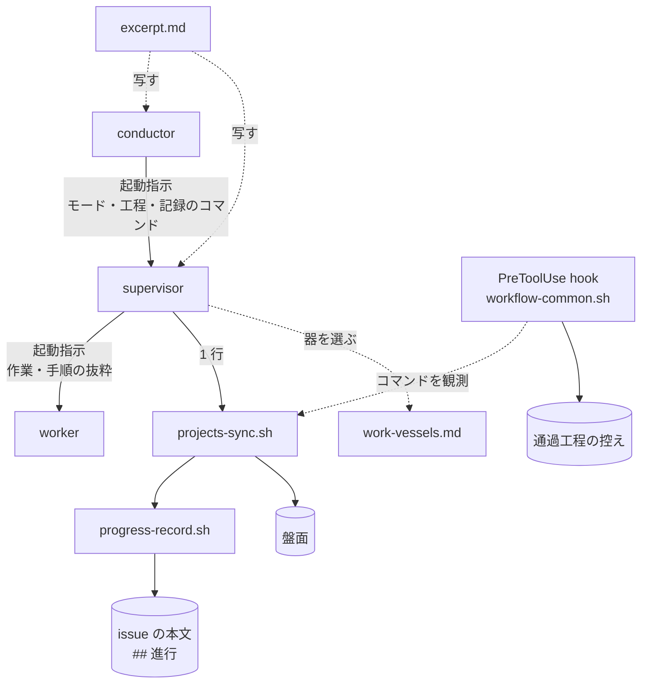
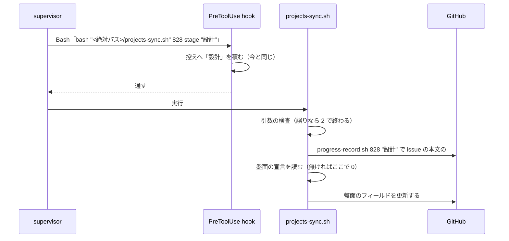
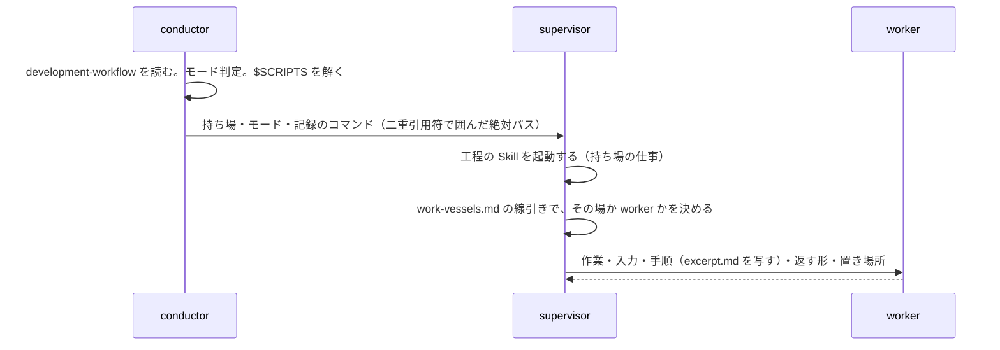

# #828 / #680: サブエージェントに Skill 本文を丸ごと読ませず、仕事を分ける器を比べて選ぶ — 設計

要求と受け入れ条件は [issue-828-680-requirements.md](issue-828-680-requirements.md) にある。この文書は「どう作るか」だけを扱う。
決定の理由と採らなかった案は [issue-828-680-design-decisions.md](issue-828-680-design-decisions.md) にある。

## 例: 設計の持ち場の supervisor が 1 工程を記録するまで

**いまの形。** conductor が設計の supervisor に「工程に入った時点で `progress-tracking` を呼ぶ」と
指示する。supervisor は `/ndf:progress-tracking` を起動し、本文（約 7,600 トークン）を文脈へ
載せる。使うのは次の 2 行だけである。

```bash
bash "$SCRIPTS/progress-record.sh" 828 "設計" --mode standard
bash "$SCRIPTS/projects-sync.sh" 828 stage "設計"
```

さらに `$SCRIPTS` を決めるために `scripts-lookup.md`（約 150 行）を読む。`development-workflow` の
本文（約 10,700 トークン）を読んでモードと工程表を確かめる supervisor もいる（#827 の実測で
28 回）。**本文は持ち場が終わるまで文脈に残り、以後の呼び出しのたびに読み直される。**

**変更後の形。** conductor が起動指示の「記録のコマンド」の項目に、絶対パスを解いたコマンドの頭と、
キーごとの打つ時点の表を書いて渡す。パスは二重引用符で囲む。

```text
記録のコマンド: bash "/home/u/.claude/plugins/cache/ai-plugins/ndf/10.17.1/scripts/projects-sync.sh" <課題番号> <キー> "<値>"
```

| キー | 打つ時点 | 値 |
| --- | --- | --- |
| `stage` | 工程に入るたび（課題ごと） | 工程名 |
| `mode` | 持ち場の最初の工程で 1 度 | 起動指示の「モード」の値 |
| `worktree` | 作業場所の用意の後に 1 度 | 作業ツリーのパス |
| `plan` | 計画の後に 1 度 | 計画ファイルのパス |

打つのはその工程を行った supervisor である。いずれも 1 回の Bash 実行に 1 件とする。
issue の本文の `## 進行` と盤面の両方に残り、`stage` は通過工程の控えにも積まれる。**`progress-tracking` も `development-workflow` も
起動しない。** モードと通す工程は起動指示の「モード」「持ち場」の項目が既に持っている。

## 機能一覧

| # | 機能 | 誰が使うか |
| --- | --- | --- |
| F1 | 記録のコマンド 1 行（issue の本文と盤面と控えに同時に残る） | supervisor / 対話の会話 / 工程の Skill |
| F2 | supervisor の起動指示の雛形（`development-workflow` と `progress-tracking` を読ませない） | conductor |
| F3 | worker の起動指示の雛形（Skill を起動させず、手順を抜粋で渡す） | supervisor |
| F4 | 抜粋の形と置き場所（`progress-tracking` の抜粋を見本として 1 つ） | 起動指示を書く側、#855 の検査、#845 の子 |
| F5 | 仕事を分ける器の比較表 | conductor / supervisor（器を選ぶとき）、新しい Skill を書く人 |
| F6 | 小さな作業にサブエージェントを起こさない線引き | supervisor（worker を起こす前） |

## 構成要素

| 要素 | 変更 | 責務 |
| --- | --- | --- |
| `plugins/ndf/scripts/projects-sync.sh` | 変える | **記録のコマンドの入口。** `stage` / `mode` / `worktree` / `plan` のキーでは、盤面の宣言の有無にかかわらず先に `progress-record.sh` を呼んで issue の本文を更新し、その後で盤面を更新する（F1） |
| `plugins/ndf/scripts/progress-record.sh` | 変える | issue の本文の `## 進行` の更新。工程名に `-` を受け、チェックリストを変えずに見出し行（モード・作業ツリー・計画ファイル）だけを更新する（F1） |
| `development-workflow/references/agent-layers.md` | 変える | 起動指示の雛形（F2 / F3）。「委譲の線」から器の比較表と線引きを指す |
| `development-workflow/references/work-vessels.md` | 新設 | 器の比較表と選び方（F5）、小さな作業の線引き（F6） |
| `development-workflow/references/context-window.md` | 変える | 「委譲する対象と、しない対象」から `work-vessels.md` を指す（写さない） |
| `development-workflow/references/stage-completeness.md` | 変える | 用語「進行の記録」の説明に、同じ 1 回で issue の本文も更新されることを足す（控えの読み方は変えない） |
| `progress-tracking/SKILL.md` | 変える | 「呼び方」を記録のコマンド 1 行にする。抜粋を指す |
| `progress-tracking/references/excerpt.md` | 新設 | 抜粋の見本（F4） |
| `plugins/ndf/agents/worker.md` | 新設 | worker のエージェント定義（`ndf:worker`）。frontmatter の `disallowedTools` で Skill と Agent のツールを外す（F3）。agy へは `dev.agy/agents` の symlink で同じファイルが配られる |
| エージェントの数を書く説明（`AGENTS.md` / `README.md` / `plugins/ndf/README.md` / `docs/ndf-plugin-reference.md`） | 変える | 「8 個の専門エージェント」に worker を足す |
| `plugins/ndf/skills/AUTHORING.md` | 変える | 抜粋の形と置き場所の規約（F4）。#855 の検査が読む目印 |
| 工程の Skill の末尾の記録の文（20 ファイル） | 変える | 「`/ndf:progress-tracking` を呼ぶ」を記録のコマンド 1 行へ（AC7） |
| `development-workflow/SKILL.md` | 変える | conductor が起動指示へ記録のコマンドを書くこと（`$SCRIPTS` を解いてから渡す） |
| テスト（`test_projects_sync*` ほか） | 足す | F1 の振る舞い（AC6 / AC8） |

変えないもの: 通過工程の控えの読み方（`workflow-common.sh` の `projects-sync.sh` の照合）、
`progress-record.sh --repo`（他のリポジトリの課題。盤面を書かない経路はそのまま残る）、
`progress-tracking` の「まとまりを閉じる」の手順（終わりの工程で 1 度だけ本文を読む）。

**図は実行の時に読み書きされる関係だけを描く。** 文面だけを変える要素は描かない。当たるのは `context-window.md` / `stage-completeness.md` / `progress-tracking/SKILL.md` / `AUTHORING.md` / 工程の Skill の末尾の文 / `development-workflow/SKILL.md` / テストである。`agent-layers.md` は起動指示の矢印（C → S → W）の中身として現れる。



## 入出力の契約

### 記録のコマンド（F1）

```text
projects-sync.sh <課題番号> <キー> <値>
  キー: stage | mode | status | worktree | plan
```

| キー | issue の本文（`progress-record.sh`） | 盤面 | 控え（hook） |
| --- | --- | --- | --- |
| `stage` | `progress-record.sh <課題> "<値>"`（チェックを付ける） | 工程のフィールド | 工程を積む（今と同じ） |
| `mode` | `progress-record.sh <課題> - --mode <値>`（見出し行だけ） | モードのフィールド | モードを書く（今と同じ） |
| `worktree` | `progress-record.sh <課題> - --worktree <値>` | 作業ツリーのフィールド | 読まない（今と同じ） |
| `plan` | `progress-record.sh <課題> - --plan <値>` | 計画ファイルのフィールド | 読まない（今と同じ） |
| `status` | 書かない | Status（「まとまりを閉じる」だけが使う） | 読まない |

| 条件 | 終了コード | 出力 |
| --- | --- | --- |
| 記録できた | 0 | `#<課題> 進行 = <工程>`（issue の本文）と、盤面の行（今と同じ） |
| 盤面の宣言が無い | 0 | issue の本文の行だけ（**今は何も出さずに抜けていた**） |
| `gh` が無い | 0 | 出力なし。issue の本文も盤面も書かない（今の 2 スクリプトと同じ） |
| issue を取得できない（issue の本文だけ更新できない） | 0 | issue の本文の行は出ない。盤面の更新は続けるため、盤面の宣言があれば盤面の行が出る |
| 盤面が上限・盤面にアイテムを追加できない | 0 | NOTE の 1 行（今の `projects-sync.sh` と同じ） |
| 知らないキー・工程表に無い値・引数の不足 | 2 | ERROR の行。issue の本文も盤面も書かない |

**引数の検査を先に行う。** 値の誤りで 2 を返すときに、issue の本文だけが書かれた状態を作らない。
`progress-record.sh` を呼ぶのは検査を通った後である。

**`progress-record.sh` を直接呼ぶ経路は残す。** `--repo` で他のリポジトリの課題へ書くとき
（盤面へは書かない）と、`--note` を足すときに使う。呼び出しの形は変えない。

### supervisor の起動指示（F2）

`agent-layers.md` の「conductor → supervisor」の `prompt` に必ず入れる項目を 8 から 9 にする。

| 項目 | 中身 | 変更 |
| --- | --- | --- |
| 持ち場 | 持ち場の名前と、通す工程の一覧 | そのまま |
| 課題 / モード / 作業場所 / 前の持ち場の報告 / 承認 / 到達点 / 提示物の置き場所 | — | そのまま |
| **記録のコマンド** | コマンドの頭 `bash "<絶対パス>/projects-sync.sh" <課題番号> <キー> "<値>"` と、キーごとの打つ時点の表（「例」の節の表）。**conductor が `$SCRIPTS` を解いた絶対パスを二重引用符で囲んで書く** | 足す |

**パスを二重引用符で囲むのは、空白を含むパスで語が割れないためである。** 通過工程の控えは
引用符を外した語を読むため、囲んでも記録として観測される（今の `"$SCRIPTS/projects-sync.sh"` と同じ）。

supervisor が守る規則の変更:

| # | いま | 変更後 |
| --- | --- | --- |
| 3 | 工程に入った時点で `progress-tracking` を呼ぶ。記録のコマンドは 1 回の Bash 実行に 1 件 | 工程に入った時点で**起動指示の「記録のコマンド」を課題ごとに 1 回打つ**。記録のコマンドは 1 回の Bash 実行に 1 件。**`development-workflow` を起動しない**（モードと工程は起動指示が持つ）。**まとまりを閉じるときだけ `progress-tracking` を起動して本文の手順に従う** |
| 7 | 委譲してよい作業は worker へ出す。委譲しない 5 つは自分で行う | 同じ文に「**小さな作業は worker へ出さずにその場で行う**（`work-vessels.md` の線引き）」を足す |

**規則の数は 10 のまま変えない。** conductor の起動指示と、それを写した既存の手順
（`handoff` の起動指示など）が「10 個」を数えているためである。

### worker の起動指示（F3）

`agent-layers.md` の「supervisor → worker」の引数を 2 つ変える。

| 引数 | いま | 変更後 |
| --- | --- | --- |
| `subagent_type` | 省く（`general-purpose`） | **`ndf:worker`**（下の「worker の定義で塞ぐ」） |
| `prompt` | 4 項目 | 5 項目（「手順」を足す） |


| 項目 | 中身 | 変更 |
| --- | --- | --- |
| 作業 / 入力 / 返す形 / 置き場所 | — | そのまま |
| **手順** | 作業に要る手順の抜粋（呼び出し 1 行・結果の読み方・判断の基準）。**抜粋の元の Skill の `references/excerpt.md` を写す。** 抜粋が無い Skill の手順が要るときは、supervisor が要る段落だけを写す | 足す |

「委譲の線」の表の `修正` の説明を「レビューの指摘の修正と push」から「レビューの指摘の修正と
コミット。送るのは起動した側」へ直す。`fix` と `cross-review` は担当が送らない形で既に動いており
（`cross-review/docs/02-fix-and-rotation.md` の Step 5）、抜粋もその形で書く。

worker が守る規則に 6 を足す。

> 6. **Skill を起動しない。`SKILL.md` を読まない。** 手順は起動指示の「手順」に従う。手順が
>    足りないときは `結果: 判断が要る` で返す。**起動指示が Skill の起動そのものを手順として
>    渡したときだけ、その 1 つを起動してよい**

**例外は、手順として Skill の起動を渡された場合の 1 つだけである。** 当たるのは今
`cross-review` の修正（Step 5 / 7.5 の `/ndf:fix`。`fix/SKILL.md` が「サブエージェント側では
この SKILL.md を読み込んで」と定める）だけで、`fix` の本文を縮める #859 がこの経路を抜粋へ
置き換える。worker が自分の判断で工程の Skill を起動すると、その Skill の進行の記録・確認の段・
関門の判断が worker の文脈で動く。worker が持たない責務（進行の記録・収束の判定）を持つことになる。
そのため、起動してよいかは worker ではなく起動指示を書く側が決める。

### worker の定義で塞ぐ（F3）

**規則 6 を文面だけにせず、worker のエージェント定義で Skill のツールを外す。** 定義は
`plugins/ndf/agents/worker.md` に置き、起動指示は `subagent_type: ndf:worker` で指す。

```markdown
---
name: worker
description: NDF の 3 層の worker。1 つの作業（調査・修正・検証・集計）を行い、作業の報告で返す
disallowedTools: Skill, Agent
---
```

**Agent も外す。** Skill だけを外した定義でも、子が Agent ツールで起こした `general-purpose` の
孫は Skill を使えた（下の表の H）。worker は葉であるという規則（`agent-layers.md` の「3 層の
責務」）も、同じ 1 行で定義が守る。

**許可の一覧（`tools`）ではなく拒否の一覧（`disallowedTools`）で書く。** 許可の一覧で書くと、
一覧に書いた `Grep` / `Glob` が子に現れなかった（表の B）。拒否の一覧なら、外した 2 つ以外は
親と同じ道具が残る。

**例外の経路は定義を分けて通す。** 定義の中では Skill を 1 つだけ許す書き方ができない
（表の F / G。`Skill(ndf:fix)` と書いても Skill のツール全体が入るか消えるかになる）。
`cross-review` の修正（Step 5 / 7.5）は今の `general-purpose` のまま起動し、`ndf:worker` を
使わない。#859 が `fix` を抜粋へ置き換えた時点で `ndf:worker` へ移す。

実測（2026-09-23、Claude Code。使い捨てのリポジトリで `claude -p` の子プロセスの中で起動）:

| # | 起動の仕方 | Skill のツール | `SKILL.md` の Read | 根拠 |
| --- | --- | --- | --- | --- |
| A | 定義に `disallowedTools: Skill` | 使えない | 読める | `ToolSearch select:Skill` → `No matching deferred tools found.` |
| B | 定義に `tools: Read, Grep, Glob, Bash, Edit, Write` | 使えない | 読める | 子の道具は Read / Bash / Edit / Write の 4 つ（Grep / Glob が出ない） |
| C | 制限の無い定義（比較） | 使える | 読める | `Launching skill: ndf:progress-tracking` |
| E | A に `/ndf:progress-tracking` を文面で渡す | 本文は載らない | — | 子の報告「Skill 本文は文脈に載っていません」 |
| F | 定義に `tools: Read, Bash, Skill(ndf:fix)` | すべて使える | — | `ndf:progress-tracking` も起動した |
| G | 定義に `disallowedTools: Skill(ndf:progress-tracking)` | すべて使えない | — | `ndf:fix` も使えなかった |
| H | A の子が Agent で `general-purpose` を起こす | 孫は使える | — | 孫で `Launching skill: ndf:progress-tracking` |

**塞がないものが 1 つある。** `SKILL.md` を Read で読むことは定義では止まらない（表の A）。
worker は抜粋（`references/excerpt.md`）を読むために `skills/` 配下の Read を要し、Read を
パスで分ける手段は定義に無い。これは規則 6 の文面で縛り、起動指示の「手順」に抜粋を写して
渡すことで読む理由を無くす。

**CLI の worker（#760）で使える手段も実測した。** 今の 3 層は CLI の worker を使わないため、
この変更では定義しない。#760 と #888（ランタイムの可搬性）の入力として残す。

| ランタイム | 手段 | 結果 |
| --- | --- | --- |
| claude CLI | `--disable-slash-commands` | Skill のツール・一覧・スラッシュの展開がすべて止まる |
| claude CLI | `--disallowedTools Skill` | ツールは消えるが、`/ndf:<Skill>` の文面は本文へ展開される（塞げない） |
| claude CLI | `--permission-mode dontAsk --allowedTools 'Skill(ndf:fix)'` | `ndf:fix` だけが通る（例外の通し方） |
| codex | `-c skills.include_instructions=false` | Skill の一覧は消える。`SKILL.md` をシェルで読むことは止めない |
| kiro | エージェント定義の `tools` / `resources` | 塞げない（一覧が載り、本文を読んだ）。候補の設定は利用者単位で、エージェント単位に効かない |

`--disallowedTools` と `--allowedTools` は値を複数取るため、後ろに置いたプロンプトを値として
読む（終了コード 1）。プロンプトは標準入力で渡す。

### 抜粋の形（F4）

抜粋は `plugins/ndf/skills/<Skill名>/references/excerpt.md` に置く。**1 つの Skill に 1 ファイル。**

```markdown
<!-- ndf-excerpt: progress-tracking -->
# progress-tracking の抜粋

## 呼び出し

bash "$SCRIPTS/projects-sync.sh" <課題番号> stage "<工程名>"

## 結果の読み方

| 出力・終了コード | 意味 | 次にすること |
| --- | --- | --- |

## 判断の基準

- （呼ぶ時点・呼ばない条件・本文を読むべき場面を箇条書きで）
```

| 規約 | 内容 | 理由 |
| --- | --- | --- |
| 目印 | 1 行目の `<!-- ndf-excerpt: <Skill名> -->` | #855 の検査が抜粋を見つけ、本文との一致を確かめる起点にする |
| 見出し | `## 呼び出し` / `## 結果の読み方` / `## 判断の基準` の 3 つだけ、この順 | #845 の接点 9 と同じ形にする |
| 分量 | 40 行以内かつ 2,000 文字以内（目印・見出し・空行を含む） | 下の「抜粋の中身と上限」の実測で、8 件が 28〜39 行・792〜1,595 文字に収まった。行だけでは 1 行を長くして収められるため、文字数も縛る |
| 本文から指す | `SKILL.md` に「呼ぶ側へ渡す抜粋は `references/excerpt.md`」の 1 行を置く | 本文を直す人の目に抜粋が入る（非機能の運用・保守性） |
| 置かないこと | 本文に無い規則 | 抜粋は写しであり、正本は本文である |

**この変更で作る抜粋は `progress-tracking` の 1 つだけである。** 他の Skill の抜粋は、#845 の子が
`SKILL.md` を縮めるときに作る（要求の前提 2）。作る Skill と、作る課題は下の表が決める。

### 抜粋の中身と上限（F4）

**上限は中身の規則で守り、数で確かめる。** 中身の規則に従えば上限に収まることを、種類の違う
8 つの Skill の下書きで確かめた。数の上限は、規則が守られたかを機械で見るための値である。

| 入れる | 入れない |
| --- | --- |
| worker（または supervisor）がその作業で打つコマンド | 上の層の責務（進行の記録・push・投稿・起票・関門の判断） |
| 結果の読み方（出力・終了コード・結果ファイルの形） | 対話の確認（利用者へ問う段）。worker では「行わない」側に読み替えて書く |
| その作業の中で下す判断の基準 | 値を解決するコード（`$SCRIPTS` / `$SKILL_DIR` / 起点ブランチ / 起票先）。上の層が解いた値を起動指示の「入力」で渡す |
| | 例・図・チェックリスト・理由の説明（本文を読めば分かる） |
| | 他の Skill の抜粋と重なる内容。その Skill の名前だけを書く |

**上限を超えたときは、抜粋を割らない。** 1 つの Skill に 1 ファイルのまま、次の順で扱う。

1. 「入れない」に当たるものを外す
2. それでも超えるなら、超えさせた手順（長いコマンドの列・分岐の多い判断）をスクリプトへ出す。
   これは本文を縮める #845 の子の仕事であり、その課題の受け入れ条件へ足す
3. スクリプトへ出るまでは抜粋を置かず、supervisor が要る段落を起動指示の「手順」へ写す
   （worker の起動指示の表の「手順」の行と同じ扱い）

**下書きの実測**（2026-09-23。各 Skill の本文から worker の作業で要る部分だけを 3 見出しで書いた）:

| Skill | 種類 | 使う相手 | 行 | 文字 | 本文（`SKILL.md`） | 作る課題 |
| --- | --- | --- | ---: | ---: | ---: | --- |
| progress-tracking | 記録 | supervisor・conductor | 30 | 954 | 24,270 バイト | この変更 |
| fix | 修正 | worker `修正` | 34 | 1,390 | 23,852 バイト | #859 |
| cross-review | 修正（Step 5 / 7.5 の分） | worker `修正` | 34 | 1,595 | 33,428 バイト | #870 |
| markdown-writing | 文書の規則 | worker `修正`・`調査` | 37 | 1,262 | 19,353 バイト | #873 |
| quality-gates | 検証 | worker `検証` | 30 | 928 | 11,242 バイト | #871 |
| tdd-cycle | 検証・修正 | worker `修正` | 34 | 860 | 7,912 バイト | #871 |
| pr-review | レビュー | worker `調査` | 39 | 962 | 21,622 バイト | #860 |
| out-of-scope | 起票の下調べ | worker `調査` | 28 | 792 | 9,142 バイト | #865 |

| Skill | 抜粋を作らない理由 |
| --- | --- |
| worktree | 作業場所の用意は supervisor の工程である。検証の worker が要るテスト環境のコマンドは、supervisor が環境を立ててから「入力」で渡す |
| pr | push の前に同意が要り、worker は人へ問えない。supervisor が呼ぶ |

**収めるために使った手は 3 つで、いずれも「入れない」の規則に当たる。** 20〜30 行の値の解決
コードを外した、表を箇条書きに畳んだ、例と理由を外した、の 3 つである。`fix` と `cross-review` の
下書きは 4 項目が重なった。同じ修正の worker の手順を 2 つの Skill が持つためで、`cross-review` の
抜粋は `fix` の名前を書いて重ねない。

## 仕事を分ける器（F5 / F6）

`work-vessels.md` の中身の設計である。**置き場所は `development-workflow/references/` で、
`agent-layers.md` の「委譲の線」から指す**（#680 で規則の置き場所に決まった位置）。

### 比べる器

| 器 | 何か | #845 の段 |
| --- | --- | --- |
| その場 | いまの会話の文脈で行う | 段 3（その会話の LLM） |
| サブエージェント | ホストの Agent ツールで別の窓を起こし、報告を受け取る | 段 3 |
| CLI 実行 | codex / agy / kiro-cli / claude を別プロセスで起動し、結果ファイルを読む | 段 3（別の LLM） |
| 最小構成の `claude -p` | 道具と指示を絞った 1 回の判断（#841） | 段 2（分類の判断） |
| スクリプト | 決まった手順を bash / Python で実行する。長いものは背景で起動して完了通知を待つ | 段 1 |

### 比べる観点と表

| 観点 | その場 | サブエージェント | CLI 実行 | 最小構成の `claude -p` | スクリプト |
| --- | --- | --- | --- | --- | --- |
| 上の層の文脈 | 読んだ量がそのまま残る | 報告の量だけ残る | 結果ファイルを読んだ量だけ | 判断の出力だけ | 出力を読んだ量だけ |
| 固定費 | 無し | 起こすたびに払う（指示・規約・道具の定義） | 起こすたびに払う。親の課金には載らない | 小さい（道具と指示を絞る） | 無し |
| 確実性 | 手順を読んだ本人が行う | 報告と実物が食い違うことがある（#585）。「必須」の手順が置き換わる（#676） | CLI ごとに完了の判定と終了コードの癖が違う | 出力の形を検査で縛れる | 手順どおりに動く。書いた範囲しか扱えない |
| 止まりにくさ | 待ちで応答を終えると止まる | 待ちで応答を終えると止まる（#656）。本体が落ちると全員止まる | 本体と別プロセスで動く | 1 回で終わる | 実行環境の上限を背景の起動で越えられる |
| 独立性 | 無し | 同じモデル・別の窓 | 別のモデル・別の視点 | 同じモデル・判断 1 つ | — |
| 資源 | 本体のメモリ | 本体のメモリ。並行の本数に数える（`parallel-work.md` の下限 6） | 別プロセスのメモリ。外部の利用上限 | 別プロセス | 実行する処理による |
| 観測性 | 会話の記録に残る | 会話の記録に残る（`skill-stats --agents`） | 結果ファイルと実行の記録（`run_metrics.py`） | 出力を残せば読める | 出力と終了コード |
| 手順の従いやすさ | 読んだ本文に従う | 渡した指示に従う。Skill を読ませると本文の全体に従おうとする | 渡したプロンプトに従う | 1 つの問いに答える | 従う必要が無い |

**可搬性の列は置かない。** 4 ランタイムでの扱いは切り出した課題が決める（決定の記録の決定 7）。

### 仕事ごとの選び方

| 仕事 | 器 | 根拠（表の観点） |
| --- | --- | --- |
| 決まった手順（進行の記録・集計・検査の実行・待ち） | スクリプト | 固定費も判断も要らない。LLM を起こさない |
| 小さな読解・1 コマンドの実行（下の線引きに当たるもの） | その場 | 固定費が読む量を上回る |
| 読む量が大きく返す量が小さい読解（探索・全文の読解・ログの集計） | サブエージェント（worker の `調査` / `集計`） | 上の層の文脈に残るのが報告だけになる |
| 作業ツリーを書き換える修正 | サブエージェント（worker の `修正`） | `agent-layers.md` の「委譲の線」と同じ（写さない） |
| 別の視点のレビュー・提案 | CLI 実行 | 独立性 |
| 分類の判断 1 つ | 最小構成の `claude -p`（#841 の後） | #841 が入るまでは選ばず、その場で行う |
| 600 秒を超える待ち | スクリプトを背景で起動して完了通知を待つ | `waiting.md` と同じ（写さない） |

**supervisor のスクリプト駆動（#827 の方針）はこの表の上で「工程の進行をスクリプトへ、判断を
最小構成の `claude -p` へ」と位置づける。** 採否は #827 が決める。

### 小さな作業にサブエージェントを起こさない（F6）

**起こす前に 1 件ごとに判定する。** 次のどちらかに当たる作業は worker へ出さず、その場で行う。

| # | 条件 | 例 |
| --- | --- | --- |
| 1 | **読む量の見込みが、worker の固定費を下回る** | 1 つのファイルの数十行を読む、`gh issue view` を 1 回打つ、記録のコマンドを打つ |
| 2 | **返す量が読む量と変わらない**（結果を上の層がそのまま読む） | 1 つのコマンドの出力を全部読む必要がある確認、短い差分の確認 |

- **固定費の値は書かない。** `context-window.md` の「固定費の値を規約へ書かない」に従い、
  導入した先で `skill-stats --agents` が測った値を使う。測っていなければ「起こす会話の最初の
  1 回の読み込みの量」を目安にする
- **読む量が見込めないときは、その場で量だけを測ってから決める**（`wc -l` や件数の問い合わせ）
- **この判定は起こす前の見込みである。** 起こした後の測定で、持ち場の中の小さな worker を
  束ねるか決めるのは #773 の候補 2 である。線引きは #773 の測定の入力になるが、#773 の判定を
  置き換えない

## 処理の流れ

### 記録のコマンド



図は `stage` の例である。`mode` / `worktree` / `plan` も同じ流れを通り、控えへは積まない。
打つ時点は「例」の節の表に従い、担い手はその工程を行った supervisor である。

### 起動指示を組む



## 非機能の実現方式

| 条件 | 実現方式 |
| --- | --- |
| 記録のコマンドが今の 2 コマンドより遅くならない | 盤面への問い合わせは今と同じ回数。issue の本文の取得と更新は今の `progress-record.sh` と同じ 2 回 |
| 抜粋が本文を直す人の目に入る | 抜粋を同じ Skill の `references/` に置き、`SKILL.md` から 1 行で指す |
| 記録の失敗で工程を止めない | `progress-record.sh` の終了コードが 0 以外でも `projects-sync.sh` は盤面の更新へ進み、今の終了コードの契約（誤りだけ 2）を守る |

## 決定の記録

[issue-828-680-design-decisions.md](issue-828-680-design-decisions.md) に 10 件ある。

## テスト設計

| 受け入れ条件 | 何で確かめるか |
| --- | --- |
| AC1 / AC3 / AC4 | `agent-layers.md` の差分のレビュー（cross-review）。雛形の項目の表と規則の文を読む |
| AC14 | 定義の検査: `plugins/ndf/agents/worker.md` の frontmatter の `disallowedTools` に `Skill` と `Agent` がある（テストで読む）。実機: `ndf:worker` を起動し、`ToolSearch select:Skill` が `No matching deferred tools found.` を返すことと、Agent を持たないことを確かめて #828 に残す（手順は「worker の定義で塞ぐ」の表 A / H と同じ） |
| AC2 | 同上。加えて、実装の後の最初の `/goal` で supervisor が `progress-tracking` / `development-workflow` を起動していないことを `skill-stats --agents` で見る |
| AC1 / AC3（雛形の検査） | `grep -n "progress-tracking\|development-workflow" plugins/ndf/skills/development-workflow/references/agent-layers.md` の結果を、表の後の「雛形の検査で残ってよい行」と突き合わせる。**「起動の指示」の節（2 つの雛形）の中で、下の「残ってよい行」（a / b / c）を除き、これらを起動・読み込みさせる文が 0 件**なら合格 |
| AC5 / AC6 | `projects-sync.sh` のテストに足す: 宣言なしで `stage` を呼ぶと issue の本文だけが更新される / 宣言ありで両方が更新される / `mode` で見出し行だけが変わる / 知らない工程名で 2 を返し本文を書かない / `stage` / `mode` / `worktree` / `plan` の 4 キーそれぞれで、issue の本文の見出し行・チェックリストと盤面のフィールドが今の 2 コマンドの組と同じになる（`gh` は既存のテストと同じ偽物で置き換える） |
| AC7 | `grep -rn "この工程に入ったら.*progress-tracking" plugins/ndf/skills/*/SKILL.md` が 0 件で、`design/SKILL.md` の「進行を記録する」の節も記録のコマンドの形になっている（今は 19 件の定型文と `design` の 2 件、計 20 Skill・21 件） |
| AC8 | 既存の `test_stage_check.py` / `test_workflow_guard.py` が変更なしで通る |
| AC15 | 設計の「抜粋の中身と上限」の規則と上限が `AUTHORING.md` にあること（差分のレビュー）。`progress-tracking` の抜粋が 40 行かつ 2,000 文字に収まること（`wc -l` と文字数） |
| AC9 | `progress-tracking/references/excerpt.md` の 1 行目の目印と見出し 3 つ。検査の実装は #855 |
| AC10 / AC11 | `work-vessels.md` の差分のレビュー。`agent-layers.md` と `context-window.md` から指されていること（`grep -n "work-vessels.md"`） |
| AC12 | 配布の後、`release-verification` で #827 の計測を同じ条件で回す（比べる前の値は下の「AC12 の比べる前の値」）。`progress-tracking` の読み込みは、まとまりを閉じる持ち場（取り込み / 仕上げ）の 1 回ずつが残る見込み |
| AC13 | 決定の記録の決定 7 と、起票した課題の番号 |

雛形の検査で残ってよい行:

| # | 位置 | 残る理由 |
| --- | --- | --- |
| a | 冒頭の「対話で `/ndf:development-workflow` を呼んだとき」の段落 | conductor 側の説明で、雛形ではない |
| b | 「3 層の責務」の表の conductor の行（`development-workflow` と `issue-plan-strategy` 以外を起動しない） | conductor の責務で、雛形ではない |
| c | supervisor の規則 3 の「`development-workflow` を起動しない」と、規則 3 の「まとまりを閉じるときだけ `progress-tracking` を起動して本文の手順に従う」例外（「起動の指示」の節の中にある） | 起動を禁じる文と、AC3 が認める唯一の例外である。例外は起動させる文だが、0 件の数から除く |

AC12 の比べる前の値（#827、2026-09-20 以降、5 リポジトリ、サブエージェント 156 件）:

| 値 | 変更前 |
| --- | ---: |
| Skill を読み込んだサブエージェント | 102 / 156 件 |
| サブエージェント内の Skill の読み込み | 371 回・約 230 万トークン |
| 持ち越し量に占める Skill 本文 | 16% |
| `progress-tracking` の読み込み | 40 回（1 回 7,649） |
| `development-workflow` の読み込み | 28 回（1 回 10,679） |
| `progress-tracking` のサブエージェント 1 件あたりの読み込み | 40 / 156 = 0.256 回 |
| `development-workflow` のサブエージェント 1 件あたりの読み込み | 28 / 156 = 0.179 回 |

**減ると見込むのは `progress-tracking` と `development-workflow` の 2 行である。** 他の 4 つ
（`markdown-writing` / `cross-review` / `fix` / `pr`）は、この変更では減らない（要求の前提 1）。
supervisor が起動する工程の Skill と、その下で呼ばれる Skill だからである。#845 の子が縮める。`fix` の
33 回は `cross-review` の修正の worker が起動する経路で、worker の規則 6 の例外に当たる（#859）。

## 未確認のまま残ること

| 項目 | 内容 |
| --- | --- |
| 対話の会話での記録 | 工程の Skill の末尾の文を 1 行にしたことで、対話の会話も `progress-tracking` を読まなくなる。`$SCRIPTS` の決め方は `scripts-lookup.md` を読む必要が残る（#847 が 1 コマンドにする） |
