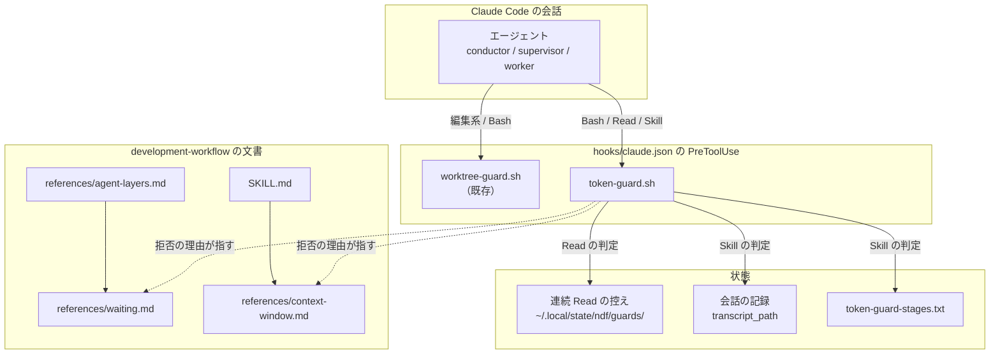
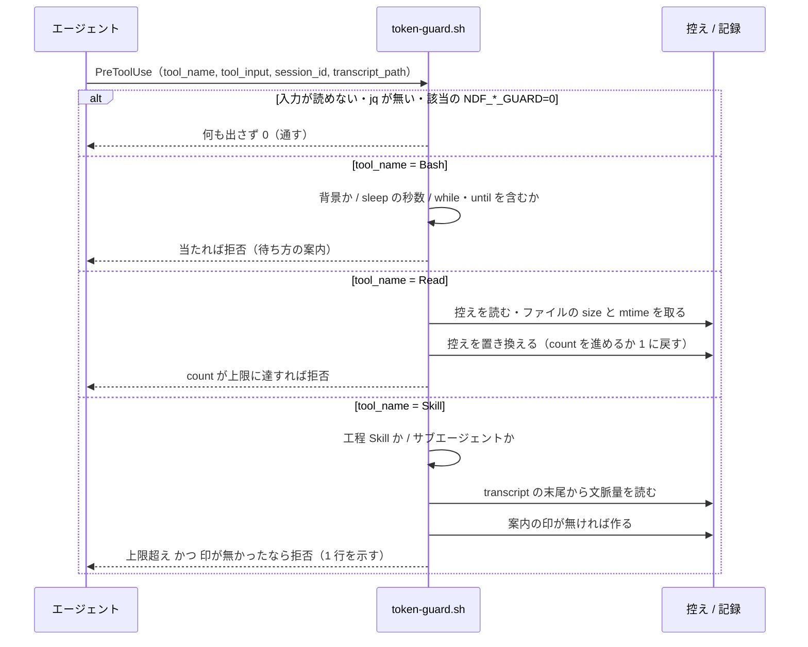
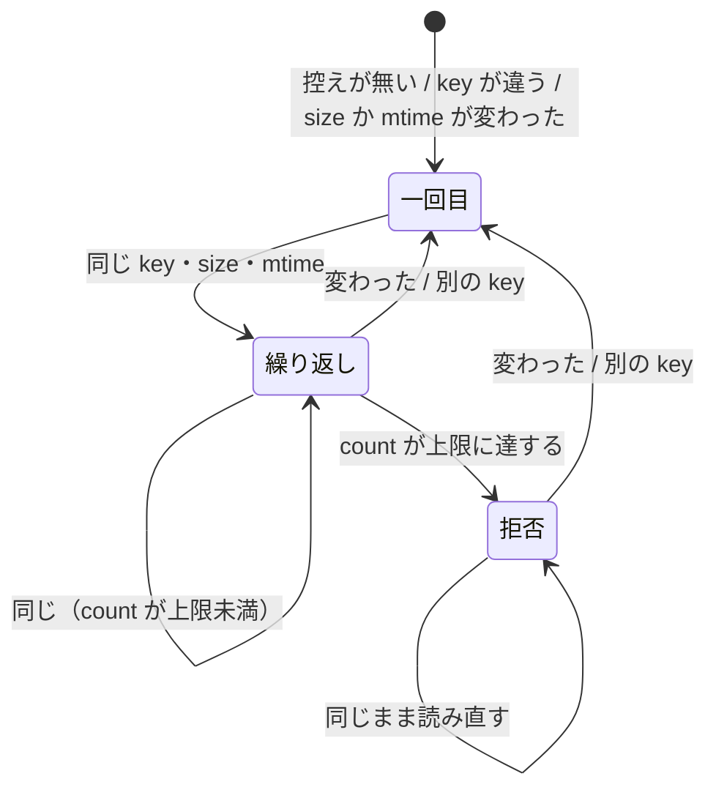

# #829 / #830: 待つ間の問い合わせをやめ、conductor の会話を工程の切れ目で切る — 設計

要求と受け入れ条件は [issue-829-830-requirements.md](issue-829-830-requirements.md) にある。
この文書は「どう作るか」だけを扱う。

**実装は 1 本の Pull Request にまとめる**（決定 1）。hook の入口と登録、状態の置き場所、
拒否の返し方を 2 つの課題で共有するためである。

## 何が変わるか（例）

**#829 の例。** サブエージェントが `codex exec` を背景で起動し、`sleep 60 && tail -5 /tmp/x.log`
を 30 回繰り返すと、30 回とも文脈の全体を読み直す。変更後は、1 回目の `sleep 60 && tail` を
hook が拒否し、理由の欄で「待ちの条件を until ループにして `run_in_background` で起動し、完了通知を待つ」よう案内する。

**#830 の例。** conductor の文脈が 41 万のまま `/ndf:design` を起動すると、変更後は hook が
起動を 1 度拒否し、「新しい会話で `/ndf:development-workflow #829` を打つ」と案内する。
conductor はその 1 行を利用者へ示して止まる。

## 機能一覧

| # | 機能 | 誰が使うか |
| --- | --- | --- |
| F1 | 待ち方の規約を 1 か所で読む | supervisor / worker / conductor |
| F2 | 前景で `sleep` を使って待つ Bash（ループの待ちと長い `sleep`）を止め、代わりの待ち方を知らせる | Claude Code のエージェント（全層） |
| F3 | 変わっていないファイルの同じ範囲を続けて読み直す Read を止め、代わりの待ち方を知らせる | 同上 |
| F4 | 文脈が上限を超えた conductor の工程 Skill の起動を 1 度止め、新しい会話で打つ 1 行を知らせる | conductor と、それを見る利用者 |
| F5 | 工程を 1 つ終えるたびに、次の工程を始める 1 行を出す | conductor（全ランタイム） |
| F6 | その 1 行から始めた新しい会話で、モード・作業ツリー・現在の工程を戻す | conductor（全ランタイム） |
| F7 | hook を種類ごとに止める・上限を変える | 利用者 |

## 構成要素

| 要素 | 新設 / 変更 | 責務 |
| --- | --- | --- |
| `plugins/ndf/scripts/token-guard.sh` | 新設 | PreToolUse の入口。`tool_name` で 3 つの判定（sleep / 連続 Read / 文脈量）へ振り分け、拒否か通過を返す |
| `plugins/ndf/scripts/lib/token-guard-stages.txt` | 新設 | 工程 Skill の名前の一覧（1 行 1 名）。F4 がこの一覧に無い Skill を見ない |
| `plugins/ndf/hooks/claude.json` | 変更 | PreToolUse に matcher `Bash\|Read\|Skill` で `token-guard.sh` を登録する |
| `development-workflow/references/waiting.md` | 新設 | 待ち方の規約の唯一の置き場所（F1） |
| `development-workflow/references/agent-layers.md` | 変更 | supervisor の規則 4 と worker の規則に、`waiting.md` への参照を 1 行ずつ足す |
| `development-workflow/references/context-window.md` | 変更 | 「前提: 実測ではない」を #827 の実測へ置き換える。hook の上限と引き継ぎの 1 行の節を足す |
| `development-workflow/SKILL.md` | 変更 | 工程を終えるたびに 1 行を出す規約と、新しい会話で戻す手順への参照（F5 / F6） |
| `release/references/completion-check.md` | 変更 | 前景の待ちのループの直前に「Claude Code では `run_in_background` で起動する（`waiting.md`）」の 1 行を足す |
| `plugins/ndf/scripts/tests/test_token_guard.py` | 新設 | F2〜F4 と F7 の判定を、入力 JSON と transcript の見本で確かめる |
| `plugins/ndf/README.md` | 変更 | hook の一覧に `token-guard.sh` を足し、4 ランタイムでの扱いを表で示す |



図にはテスト（`test_token_guard.py`）と `README.md`、`completion-check.md` を含めない。どちらも実行の経路に現れない。

### 配置

**hook は Claude Code の配布物にだけ登録する**（決定 5）。

| ランタイム | 待ち方（#829） | 会話を切る（#830） | 根拠 |
| --- | --- | --- | --- |
| Claude Code | hook（`token-guard.sh`）＋ 規約 | hook ＋ 引き継ぎの 1 行 | 代わりの待ち方（`Monitor` / `run_in_background` の通知）と `transcript_path` を持つ |
| Codex | 規約だけ | 引き継ぎの 1 行だけ | `hooks/codex.json` は変えない。背景の起動と完了通知が無く、1 回の前景のループが待ち方になる |
| Kiro | 規約だけ | 引き継ぎの 1 行だけ | 実行前の hook は拒否（exit 2）しか返せず、既存の設計も実行前の hook を置いていない |
| agy | 規約だけ | 引き継ぎの 1 行だけ | 実行前の hook は案内を控えへ積む形で、拒否の口を使っていない |

### パッケージ構成

```text
plugins/ndf/
├── hooks/claude.json                       … 登録を 1 つ足す
├── scripts/
│   ├── token-guard.sh                      … 新設
│   ├── lib/token-guard-stages.txt          … 新設
│   └── tests/test_token_guard.py           … 新設
├── skills/development-workflow/
│   ├── SKILL.md                            … 引き継ぎの 1 行
│   └── references/
│       ├── waiting.md                      … 新設
│       ├── agent-layers.md                 … 参照を 2 行
│       └── context-window.md               … 実測値・上限・引き継ぎ
├── skills/release/references/completion-check.md … waiting.md を指す 1 行
└── README.md                               … hook の一覧と 4 ランタイムの表
```

## データ構造

**連続 Read の控えを、会話ごとに 1 つの小さなファイルへ持つ。** 置き場所は
`${XDG_STATE_HOME:-$HOME/.local/state}/ndf/guards/read-<session_id>.json`。既存の通過工程の控え
（`~/.local/state/ndf/stages/`）と同じ親に置く。

| キー | 型 | 意味 |
| --- | --- | --- |
| `key` | 文字列 | 直前の Read の `file_path` と `offset` と `limit` を `\t` でつないだもの |
| `size` | 整数 | 直前の Read の時点のファイルの大きさ（バイト）。無いファイルは `-1` |
| `mtime` | 整数 | 同じく更新時刻（秒） |
| `count` | 整数 | `key` と `size` と `mtime` が変わらないまま続いた Read の回数 |

- **書き込みは置き換えで行う**（一時ファイルへ書いて `mv`）。途中で落ちても壊れた JSON を残さない
- **7 日より古い控えは、書き込みのついでに消す**（`find -mtime +7 -delete`）。会話が終わった合図を
  hook は受け取らないため
- **文脈量の案内を出した印** は `guards/context-<session_id>` の空ファイルで持つ（F4 の 2 回目を
  通すため。決定 7）

## 入出力の契約

### hook の入力（Claude Code の PreToolUse）

| キー | 使う判定 | 無いとき |
| --- | --- | --- |
| `tool_name` | 振り分け（`Bash` / `Read` / `Skill`） | 通す |
| `tool_input.command` / `tool_input.run_in_background` | sleep | 通す |
| `tool_input.file_path` / `offset` / `limit` | 連続 Read | 通す |
| `tool_input.skill` / `tool_input.args` | 文脈量 | 通す |
| `session_id` | 連続 Read の控え・案内の印 | 通す |
| `transcript_path` | 文脈量 | 通す |
| `agent_id`（サブエージェントで付く） | 文脈量（付いていれば見ない） | conductor とみなす。`transcript_path` が `/subagents/` を含めばサブエージェントとみなす |

### hook の出力

**拒否は `permissionDecision: deny` と理由の欄で返し、終了コードは常に 0 にする。** 通すときは
何も出さない。

```json
{"hookSpecificOutput":{"hookEventName":"PreToolUse","permissionDecision":"deny",
 "permissionDecisionReason":"<下の表の文面>"}}
```

| 判定 | 拒否する条件 | 理由の欄の文面（要旨） |
| --- | --- | --- |
| sleep | `run_in_background` が真でなく、`command` が `\bsleep\s+[0-9]` に当たり、かつ次のどちらかに当たる: `\b(while\|until)\b` を含む / `sleep` に渡した秒数のどれかが上限（既定 5）を超える | 「前景で `sleep` を使って待つと、待つ呼び出しのたびに文脈を読み直す。同じ条件の until ループを `run_in_background: true` で起動し、完了通知を待つ（通知は 1 回）。出来事を 1 つずつ受けるなら `Monitor`。規約: `development-workflow/references/waiting.md`」 |
| 連続 Read | 直前の Read と `key`・`size`・`mtime` が同じで、`count + 1` が上限（既定 3）に達する | 「同じファイルの同じ範囲を、変わらないまま <n> 回続けて読もうとした。書き終わりを待つなら `until [ -s <ファイル> ]; do sleep 1; done` を `run_in_background: true` で起動するか、背景の処理の完了通知を待つ。サブエージェントの `tasks/*.output` は読まずに完了通知を待つ。規約: 同上」 |
| 文脈量 | 工程 Skill で、conductor で、文脈量が上限（既定 200,000）を超え、この会話で案内の印が無い | 「文脈が <n> で上限 <limit> を超えた。この工程は新しい会話で始める。利用者へ次の 1 行を示して応答を終える: `/ndf:development-workflow <課題>`。このまま続けると利用者が決めたら、同じ Skill をもう一度起動すると通る。規約: `context-window.md`」 |

**`<課題>` は次の順で決める。** 先に当たったものを使う。

| 順 | 読むもの | 取り出す値 |
| --- | --- | --- |
| 1 | Skill の `args` | `#<数>` と数だけの語 |
| 2 | このリポジトリの通過工程の控え（`~/.local/state/ndf/stages/<所有者>__<リポジトリ>__<番号>.json`） | 更新時刻が最も新しい控えの番号 |
| 3 | どちらも無い | `<課題番号>` の文字のまま |

### 環境変数

| 変数 | 既定 | 意味 |
| --- | --- | --- |
| `NDF_SLEEP_GUARD` | `1` | `0` で sleep の判定を止める |
| `NDF_SLEEP_MAX_SEC` | `5` | ループの外で通す `sleep` の秒数の上限 |
| `NDF_READ_REPEAT_GUARD` | `1` | `0` で連続 Read の判定を止める |
| `NDF_READ_REPEAT_LIMIT` | `3` | 連続 Read を拒否する回数 |
| `NDF_CONTEXT_GUARD` | `1` | `0` で文脈量の判定を止める |
| `NDF_CONTEXT_LIMIT` | `200000` | 文脈量の上限（トークン） |

### 文脈量の読み方

**`transcript_path` の末尾 200 行から、最後の assistant 行の `message.usage` を読み、
`input_tokens + cache_read_input_tokens + cache_creation_input_tokens` を文脈量とする。**
`transcript_agents.py` の `_input_total` と `statusline.sh` と同じ足し方である。末尾だけを読むのは、
50 MB の記録でも 1 秒以内に終えるためである（非機能の条件）。

### 引き継ぎの 1 行（F5 / F6）

**形は `/ndf:development-workflow #<課題> [#<課題> ...]` とする**（決定 8）。Claude Code と agy の
起動の書き方である。Codex と Kiro では、それぞれの README が示す Skill の起動の書き方に読み替える。

**新しい会話の `development-workflow` は、次の順で状態を戻す。** 手順は `context-window.md` の
新しい節に置き、`SKILL.md` からはそこを指す。

| # | 読むもの | 戻すもの |
| --- | --- | --- |
| 1 | 課題の本文の `## 進行` | モード・作業ツリー・計画ファイル・通った工程 |
| 2 | `stage-check.sh report <番号>` | 通過工程の控え（本文と食い違えば控えを正とする） |
| 3 | `gh pr list --search "<番号>" --state all` | 設計・実装の Pull Request と状態 |
| 4 | 1〜3 から、チェックの付いていない最初の必須の工程 | 次に起動する工程 Skill |

### 文書の中身

**`waiting.md`（新設）** は次の 5 つを持つ。他の文書は写さずにここを指す。

| 節 | 中身 |
| --- | --- |
| 待ちの費用 | 呼び出し 1 回ごとに文脈の全体を読み直す。#827 の実測（全体の 16%）と決定 3 の表 |
| 許す待ち方 | Claude Code: 条件の until ループを `run_in_background` で起動して完了通知を 1 回受ける / 出来事を 1 つずつ受けるなら `Monitor` / サブエージェントは完了通知。他の 3 ランタイム: 1 回の前景の until ループ（600 秒を超えるなら `bg-wait.sh`） |
| 禁じる待ち方 | `sleep` を挟んだ呼び出しの繰り返し / 出力ファイルの繰り返しの読み直し / サブエージェントの `tasks/*.output` を読むこと |
| 待つ相手ごとの手 | サブエージェント → 完了通知。背景の CLI → CLI そのものを `run_in_background` で起動する。既に起動したプロセス → `until` で終わりを待つループを `run_in_background` で。Pull Request の検査 → `gh pr checks --watch` を `run_in_background` で。新しいコメントを 1 件ずつ → `Monitor` |
| hook | `token-guard.sh` の条件と止め方（環境変数）。4 ランタイムの表 |

**`context-window.md`（変更）** は 3 か所を変える。

| 場所 | 変え方 |
| --- | --- |
| 「前提: 実測ではない」（:41-42） | #827 の実測に置き換える: conductor の最大文脈は 2026-09-20 以降 7 件中 4 件で 20 万超・最大 68 万、ai-plugins の 30 日間で 45 件中 37 件が 20 万超・平均 41 万、工程の開始ごとに切れば再読込量が 58%（30 日間 62%）減る。出典は #827 |
| 新しい節「上限を超えたら hook が止める」 | 上限の既定（200,000）と `NDF_CONTEXT_LIMIT`・1 度だけ止めること・続けたいときの手 |
| 新しい節「新しい会話で戻す」 | 引き継ぎの 1 行の形と、戻す手順の表（上の 4 行） |

**`SKILL.md`（変更）** は「工程は 1 つの context window で通し切らなくてよい」の段落に 2 文を足す。
工程を 1 つ終えるたびに引き継ぎの 1 行を出すこと、戻す手順は `context-window.md` にあること。

**`agent-layers.md`（変更）** は supervisor の規則 4 の後ろに「待ち方は `waiting.md` に従う」を足し、
worker の規則に同じ 1 行を 5 番目として足す。

## 処理の流れ



連続 Read の控えの状態:



**拒否した Read も控えの `count` を進める。** 進めないと、拒否された後に同じ Read を続けても
拒否の回数が増えるだけで、状態が変わらない（どちらでも拒否が続くため振る舞いは同じだが、控えの
値が「試みた回数」を表すようにそろえる）。

## 非機能の実現方式

| 大項目 | 条件 | 実現方式 |
| --- | --- | --- |
| 性能・拡張性 | 50 MB の記録でも 1 秒以内 | 記録は `tail -n 200` の範囲だけを読む。Bash と Read の判定は記録を読まない。登録の `timeout` は 5 秒 |
| 運用・保守性 | 理由の欄だけで次の手が分かる | 理由の欄に代わりの手段と規約の場所を必ず書く（出力の表） |
| 可用性 | hook の失敗で実行を止めない | 入力が読めない・`jq` が無い・控えが書けない・記録が読めないときは何も出さず 0。登録に `continueOnError: true` |

## 決定の記録

### 決定 1: 2 つの課題を 1 本の実装 Pull Request にまとめる

hook の入口・登録・状態の置き場所・拒否の返し方が同じで、分けると `hooks/claude.json` と
テストの土台を 2 本が同時に触る。2 本に分ける形は採らない。後に入る側が土台の食い違いを解く
手間が、分けて読みやすくなる利点を上回る。

### 決定 2: 待ち方の規約は `development-workflow/references/waiting.md` の新しいファイルに置く

`agent-layers.md` は #828（持ち場ごとの抜粋）も同時に触る。待ち方の規約は、
#731（`bg-wait.sh` を共通層へ移す）と external-ai / cross-review の文書からも参照される。
同じファイルの節にすると、参照するたびに 3 層の規約の全体を読ませる。`agent-layers.md` と `parallel-work.md` の節に置く形は
採らない。`parallel-work.md` は待ち方の道具に触れておらず、そこへ足す理由が無い。

### 決定 3: sleep の判定は「前景で、`while` / `until` のループを含むか、5 秒を超える `sleep`」を拒否する

ループの中の `sleep` を通すと、費用の大半を見逃す。2026-08-23 以降の全プロジェクトの記録
（6,713 本、Bash 74,223 件）では、`sleep <数>` を含む前景の Bash は次のとおりだった。

| 形 | 件数 | 費用（input 換算） |
| --- | ---: | ---: |
| 前景・ループの中（`while [ $n -lt 40 ]; do ...; sleep ...; done` など） | 1,543 | 67.3M |
| 前景・ループなし（`sleep 30 && tail x` など） | 743 | 9.9M |
| 背景（`run_in_background`） | 441 | 5.3M |

ループの 1 回の呼び出しは 600 秒で打ち切られ、待ちが長いと呼び直しが続く。同じループを背景へ移せば、
待つ時間の長さによらず完了通知 1 回で済む。ループなしの形の半数（382 件）は 5 秒以下で、サーバの起動を
待つような短い間であるため通す。`for` のループで 5 秒以下の `sleep` を挟む形（API の照会の
間隔を空ける使い方）も通す。

ループの中の `sleep` をすべて通す形は採らない。前景の `sleep` の費用の 87% を占める形が残る。`sleep` を含む
Bash をすべて拒否する形も採らない。短い間と照会の間隔まで止めると、代わりの手段が無い。
配布物の文書にある前景の待ちのループも拒否に当たる。理由の欄が「同じループを
`run_in_background: true` で」と案内するため、Claude Code ではループを書き換えずに 1 回の回り道で済む。

| 文書 | ループ | 書き換える変更 |
| --- | --- | --- |
| `external-ai/references/cli-codex.md` / `cli-agy.md` | `until ! ps -p ...; do sleep 30; done` | #731 |
| `qa-security-scan/03-report-template.md` | `until grep -q ...; do sleep 30; done` | #731 |
| `release/references/completion-check.md` | `while :; do ...; sleep 5; done` | この変更（`waiting.md` を指す 1 行） |

### 決定 4: 連続 Read は「同じ範囲・変わらないファイル・3 回目」で拒否する

hook は実行の前に呼ばれ、読んだ中身を知らない。そのため「空ファイル」ではなく「前回から
大きさと更新時刻が変わっていない」で判定する。空ファイルの読み直しはこれに含まれ、書き込みが
進むログの読み直しは含まれない。`offset` と `limit` を鍵に入れるのは、大きなファイルを範囲を
変えて読み進める正当な使い方を止めないためである。

3 回目にするのは、2026-08-23 以降の記録の実測による。同じ引数の Read が 3 回以上続いたのは 6 本で、
うち 5 本が `tasks/*.output` の読み直し（最長 1,168 回）だった。残る 1 本は画像を見直す 3 回である。
2 回目で止めると、正当な見直しに当たる機会が増える。間に他のツールが挟まったら数え直す形は
採らない。hook は Read の呼び出しにしか登録されず、間のツールを見られない。

### 決定 5: hook は Claude Code にだけ登録し、他の 3 ランタイムは規約で守る

拒否の理由が案内する代わりの手段（`Monitor` / `run_in_background` の通知）は Claude Code にしか
無い。文脈量も Claude Code の `transcript_path` からしか読めない。#827 の実測も Claude Code の
記録だけで、Codex / Kiro / agy の消費は測っていない。3 ランタイムへも登録する形は採らない。
Kiro は拒否すると代わりの口を持たず、agy は案内を控えへ積む形で、どちらも同じ案内を出せない。
CLI 側の消費を測った後（#827 の次の手順）に改めて決める。

### 決定 6: 文脈量の判定は conductor の工程 Skill の起動だけに掛ける

supervisor は 1 つの持ち場の中で複数の工程を通すため、工程の起動で止めると持ち場が途中で
途切れる。supervisor の切れ目は #768 / #773 が測ってから決める。工程でない Skill
（`markdown-writing` / `progress-tracking` など）の起動で止める形も採らない。工程の途中で起動
されるため、切れ目にならない。

### 決定 7: 文脈量の案内は会話ごとに 1 度だけ拒否し、2 回目は通す

利用者が「このまま続ける」と決めたときに、環境変数を設定し直さずに続けられるようにする。
毎回拒否する形は採らない。関門の直前など、切ると判断の材料を失う場面で進めなくなる。
拒否せずに案内だけを足す形（`additionalContext`）も採らない。#827 の実測で、`context-window.md`
に書いた規定は守られていなかった。1 度は止めないと、案内は読み流される。

### 決定 8: 引き継ぎの 1 行は `development-workflow` を起動する形にする

工程 Skill を直接起動する形（`/ndf:design #829`）は採らない。工程 Skill はモード・作業ツリー・
承認の状態を戻す手順を持たず、戻す手順を持つのは `development-workflow` の側だからである。
`development-workflow` を経由すると固定費に 1 回分の読み込み（約 1 万トークン）が足されるが、
切る前の会話の文脈（#827 で平均 41 万）に比べて小さい。

### 決定 9: 上限の既定は 200,000 にし、`skill-stats` の既定と同じ値にする

`context-window.md` の「遅くとも 20 万」と、`skill-stats.py` の `DEFAULT_WINDOW_LIMIT` が同じ値を
持つ。hook だけ別の値にすると、測る側と止める側の上限が食い違う。10 万（目安の側）にする形は
採らない。#827 で固定費だけで約 4 万あり、1 工程の途中で止まる回数が増える。

### 決定 10: 1 回で足りる待ちは `Monitor` ではなく `run_in_background` の until ループにする

#829 は「`Monitor` の until で 1 回だけ待つ」を挙げた。一方、Claude Code 2.1.280 の `Monitor` の
説明は、道具を次のように使い分ける。

| 待ち方 | 使う道具 |
| --- | --- |
| 通知が 1 回で足りる（終わるのを待つ） | `run_in_background` の until ループ |
| 出来事を 1 つずつ受ける | `Monitor` |
`Monitor` は既定 5 分・最長 30 分で打ち切られ、張り直しが要る。
`Monitor` を 1 回の待ちの既定にする形は採らない。張り直しのたびに呼び出しが増える。

## テスト設計

| 受け入れ条件 | 何で確かめるか |
| --- | --- |
| AC1〜AC4 | 文書の検査（`test_token_guard.py`）: `waiting.md` があり、許す待ち方の節が `Monitor` と `run_in_background` を挙げる。`agent-layers.md` の supervisor と worker の規則が `waiting.md` を参照する。`waiting.md` と `agent-layers.md` のコード例に、前景の `while` / `until` と `sleep` を組み合わせた Claude Code 向けの例が無い |
| AC5 | 単体: `sleep 30 && tail -5 x.log`・`while ! test -s x; do sleep 5; done`・`until ...; do sleep 1; done` で deny と理由の欄に `run_in_background` と `waiting.md` |
| AC6 | 単体: `run_in_background: true` の `sleep 30 && tail`・`python3 -m http.server & sleep 2`・`for p in 1 2; do gh api ...; sleep 1; done`・`echo sleep`・`tool_name: Monitor` で出力なし |
| AC7 | 単体: 一時ファイルに対し Read を 3 回 → 3 回目で deny。2 回目の後にファイルへ追記 → 数え直し。`offset` を変える → 数え直し |
| AC8 | AC5〜AC7 のテストが `uv run --with pytest pytest plugins/ndf/scripts/tests/test_token_guard.py -q` で通る |
| AC9 | 単体: 壊れた JSON・`jq` を外した `PATH`・書けない `XDG_STATE_HOME` で、出力なしと終了コード 0 |
| AC10 | 単体: `NDF_SLEEP_GUARD=0` と `NDF_READ_REPEAT_GUARD=0` で、それぞれの拒否だけが消える |
| AC11 | 実機: サブエージェントの中で `codex exec` を `run_in_background` で起動し、他の作業が無いまま応答を終える。ターンを終えずに次の段へ進んだことを、そのサブエージェントの記録で確かめて #829 に残す |
| AC12 | 単体: 文脈量 250,000 の transcript の見本と `tool_input.skill: "ndf:design"`、`args: "#829"` で deny と理由の欄に `/ndf:development-workflow #829` |
| AC13 | 単体: 同じ入力に `agent_id` を足す、または `transcript_path` を `/subagents/` の下にする → 出力なし |
| AC14 | 単体: `ndf:markdown-writing` → 出力なし。`token-guard-stages.txt` の名前が `SKILL.md` の工程表の Skill の列と一致することを文書テストで確かめる |
| AC15 | 単体: 同じ `session_id` で 2 回 → 1 回目 deny、2 回目は出力なし。`NDF_CONTEXT_GUARD=0` で 1 回目も出力なし |
| AC16 | 単体: `transcript_path` が無い・`usage` の無い記録 → 出力なし |
| AC17 | AC12〜AC16 のテストが通る |
| AC18 / AC19 | 文書の検査: `SKILL.md` に 1 行を出す規約があり、`context-window.md` に戻す手順の表がある |
| AC20 | 実機: 実装の Pull Request の途中で会話を切り、1 行だけで新しい会話を始め、モード・作業ツリー・次の工程が戻ったことを #830 に残す |
| AC21 / AC22 | 文書の検査: 「実測ではない」の文面が消え、#827 への参照と数値があり、上限の値が `NDF_CONTEXT_LIMIT` の既定と一致する |
| AC23 | 文書の検査: README に 4 ランタイムの表がある |
| AC24 | 既存: `plugins/ndf/skills/worktree/tests/` と `scripts/tests/test_agy_install_hooks.py` が通る |
| AC25 / AC26 | 配布後: `release-verification` で #827 の `measure.py` / `poll.py` / `extra.py` を変更前と同じ引数で回し、変更前の値（全体の 16%、conductor の最大 683k・再読込の削減見込み 58%）と並べて各 issue に残す |

## 未確認のまま残ること

| 項目 | 内容 | いつ決まるか |
| --- | --- | --- |
| サブエージェントの hook 入力 | Claude Code 2.1.280 の PreToolUse の入力に `agent_id` が付くか、`transcript_path` がサブエージェントの記録を指すか。どちらも付かなければ conductor とサブエージェントを区別できない | 実装の最初のタスクで、入力を書き出すだけの hook を登録して確かめる |
| 記録の書き込みの時点 | PreToolUse が呼ばれた時点で、その Skill を呼んだ assistant 行が記録に書かれているか。書かれていなければ 1 つ前の呼び出しの文脈量を読む（差は 1 回分の出力と結果） | 同上 |
| Codex / Kiro の起動の書き方 | 引き継ぎの 1 行を、各ランタイムでどう書くか | 実装で各 README の記載に合わせる |
| 通知の届き方 | サブエージェントが背景の処理を残したまま応答を終えたとき、完了通知で再開されるか、親へ完了として返るか（AC11）。Agent の完了通知の注記「背景の子を持たずに止まるたびに通知する」からは再開されると読めるが、Bash の背景の処理で確かめていない | 実装の Pull Request の実機確認 |
| 背景の Bash の上限 | `run_in_background` の Bash に 600 秒の打ち切りが掛かるか。掛かるなら 600 秒を超える待ちは `bg-wait.sh`（#731） | 同上 |
| 効果の数値 | ポーリングの割合と conductor の再読込量がどれだけ下がるか | 配布後の `release-verification` |
