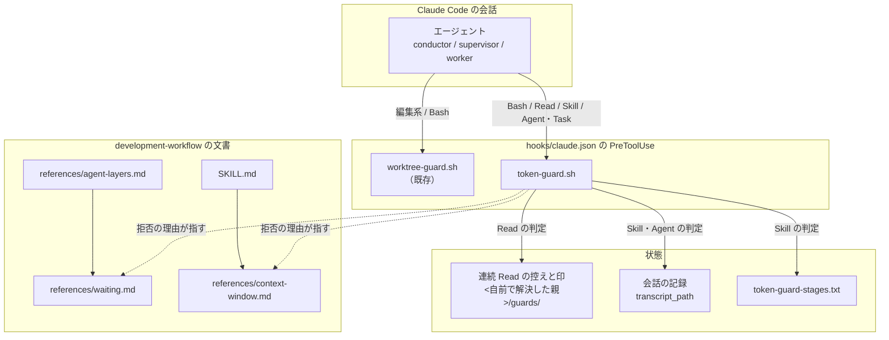
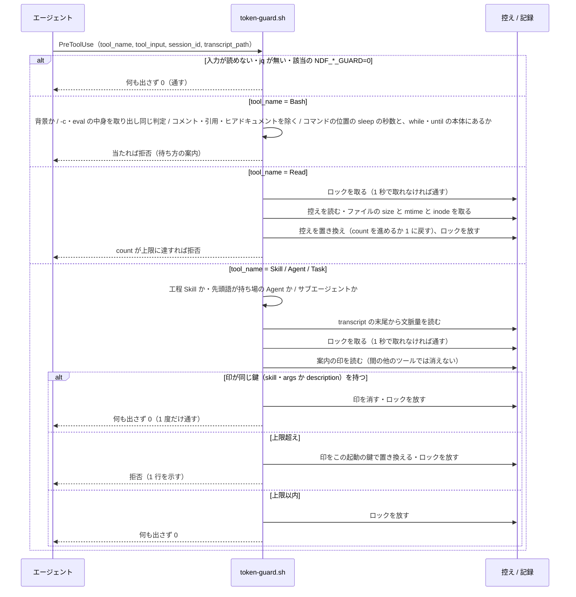
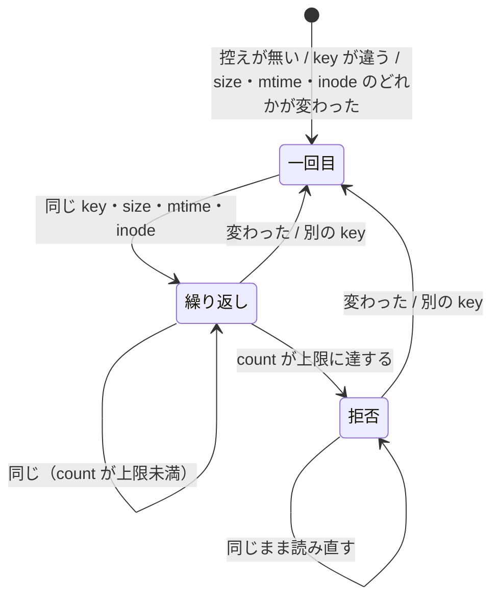

# #829 / #830: 待つ間の問い合わせをやめ、conductor の会話を工程の切れ目で切る — 設計

要求と受け入れ条件は [issue-829-830-requirements.md](issue-829-830-requirements.md) にある。
この文書は「どう作るか」だけを扱う。
決定の記録は [issue-829-830-design-decisions.md](issue-829-830-design-decisions.md) にある。

**実装は 1 本の Pull Request にまとめる**（決定 1）。hook の入口と登録、状態の置き場所、
拒否の返し方を 2 つの課題で共有するためである。

## 何が変わるか（例）

**#829 の例。** サブエージェントが `codex exec` を背景で起動し、`sleep 60 && tail -5 /tmp/x.log`
を 30 回繰り返すと、30 回とも文脈の全体を読み直す。変更後は、1 回目の `sleep 60 && tail` を
hook が拒否し、理由の欄で「待ちの条件を until ループにして `run_in_background` で起動し、完了通知を待つ」よう案内する。

**#830 の例。** conductor の文脈が 41 万のまま `/ndf:implementation-plan` を起動する（3 層では `実装:` の
supervisor を起動する）と、変更後は hook が起動を 1 度拒否し、「新しい会話で `/ndf:development-workflow #829` を打つ」と案内する。
conductor はその 1 行を利用者へ示して止まる。

## 機能一覧

| # | 機能 | 誰が使うか |
| --- | --- | --- |
| F1 | 待ち方の規約を 1 か所で読む | supervisor / worker / conductor |
| F2 | 前景で `sleep` を使って待つ Bash（ループの待ちと長い `sleep`）を止め、代わりの待ち方を知らせる | Claude Code のエージェント（全層） |
| F3 | 変わっていないファイルの同じ範囲を続けて読み直す Read を止め、代わりの待ち方を知らせる | 同上 |
| F4 | 文脈が上限を超えた conductor が工程へ入る起動（対話の経路は工程 Skill、3 層の経路は持ち場の supervisor の Agent）を 1 度止め、新しい会話で打つ 1 行を知らせる | conductor と、それを見る利用者 |
| F5 | `context-window.md` の 4 つの切れ目（ドキュメントレビューのマージの後 / 構造改善と実装レビューの前後 / Pull Request を出した後 / 配布の後）と、文脈量の hook が拒否したときに、次の工程を始める 1 行を出す。持ち場の報告が `結果: 関門` なら、関門の承認と取り込みの後に出す | conductor（全ランタイム） |
| F6 | その 1 行から始めた新しい会話で、モード・作業ツリー・現在の工程を戻す | conductor（全ランタイム） |
| F7 | hook を種類ごとに止める・上限を変える | 利用者 |

## 構成要素

| 要素 | 新設 / 変更 | 責務 |
| --- | --- | --- |
| `plugins/ndf/scripts/token-guard.sh` | 新設 | PreToolUse の入口。`tool_name` で 3 つの判定（`Bash` → sleep / `Read` → 連続 Read / `Skill`・`Agent`・`Task` → 文脈量）へ振り分け、拒否か通過を返す。排他は既存の `scripts/lib/lock-common.sh` を読み込んで使う |
| `plugins/ndf/scripts/lib/token-guard-stages.txt` | 新設 | 工程 Skill の名前の一覧（1 行 1 名）。下の「工程 Skill の一覧」の表の 13 個を正とする。F4 がこの一覧に無い Skill を見ない |
| `plugins/ndf/hooks/claude.json` | 変更 | PreToolUse に matcher `Bash\|Read\|Skill\|Agent\|Task` で `token-guard.sh` を登録する |
| `development-workflow/references/waiting.md` | 新設 | 待ち方の規約の唯一の置き場所（F1） |
| `development-workflow/references/agent-layers.md` | 変更 | supervisor の規則 4 と worker の規則に、`waiting.md` への参照を 1 行ずつ足す |
| `development-workflow/references/context-window.md` | 変更 | 「前提: 実測ではない」を #827 の実測へ置き換える。hook の上限と引き継ぎの 1 行の節を足す |
| `development-workflow/SKILL.md` | 変更 | `context-window.md` の 4 つの切れ目で conductor が 1 行を出す規約と、新しい会話で戻す手順への参照（F5 / F6） |
| `external-ai/references/cli-codex.md`・`cli-agy.md`・`qa-security-scan/03-report-template.md`・`release/references/completion-check.md` | 変更 | 前景の待ちのループの直前に「Claude Code では、このループを `run_in_background: true` で実行して完了通知を待つ（`development-workflow/references/waiting.md`）」の 1 行を足す（決定 3） |
| `plugins/ndf/scripts/tests/test_token_guard.py` | 新設 | F2〜F4 と F7 の判定を、入力 JSON と transcript の見本で確かめる |
| `plugins/ndf/README.md` | 変更 | hook の一覧に `token-guard.sh` を足し、4 ランタイムでの扱いを表で示す |

### 工程 Skill の一覧

`token-guard-stages.txt` は工程表から機械的に抽出しない。この表を正とする。
`context-window.md` の 4 つの切れ目の直後に始まる工程の Skill と、入口の 2 つだけを載せる（合計 13 個）。

| 切れ目 | 直後に始まる工程の Skill |
| --- | --- |
| 1 ドキュメントレビューのマージの後 | `implementation-plan` / `document-drafting` |
| 2 構造改善と実装レビューの前後 | `cross-refactoring` / `cross-review` / `pr-review` / `quality-gates` |
| 3 Pull Request を出した後 | `plan-to-spec` / `merged` |
| 4 配布の後 | `layout-review` / `release-verification` / `retrospective` |
| 入口 | `development-workflow` / `issue-plan-strategy` |

`worktree` など切れ目の内側の工程は含めない（理由は決定 6）。
`cross-review` は切れ目 1 の前（ドキュメントレビュー）でも起動される。その時点で上限を超えていれば止めてよいので含める。



図にはテスト（`test_token_guard.py`）と `README.md`、案内の 1 行を足す 4 文書を含めない。いずれも実行の経路に現れない。

### 配置

**hook は Claude Code の配布物にだけ登録する**（決定 5）。

| ランタイム | 待ち方（#829） | 会話を切る（#830） | 根拠 |
| --- | --- | --- | --- |
| Claude Code | hook（`token-guard.sh`）＋ 規約 | hook ＋ 引き継ぎの 1 行 | 代わりの待ち方（`Monitor` / `run_in_background` の通知）と `transcript_path` を持つ |
| Codex | 規約だけ | 引き継ぎの 1 行だけ | `hooks/codex.json` は変えない。背景の起動と完了通知が無く、1 回の前景のループが待ち方になる |
| Kiro | 規約だけ | 引き継ぎの 1 行だけ | 実行前の hook は拒否（exit 2）しか返せず、既存の設計も実行前の hook を置いていない |
| agy | 規約だけ | 引き継ぎの 1 行だけ | 実行前の hook は案内を控えへ積む形で、拒否の口を使っていない |

### パッケージ構成

```text
plugins/ndf/
├── hooks/claude.json                       … 登録を 1 つ足す
├── scripts/
│   ├── token-guard.sh                      … 新設
│   ├── lib/token-guard-stages.txt          … 新設
│   └── tests/test_token_guard.py           … 新設
├── skills/development-workflow/
│   ├── SKILL.md                            … 引き継ぎの 1 行
│   └── references/
│       ├── waiting.md                      … 新設
│       ├── agent-layers.md                 … 参照を 2 行
│       └── context-window.md               … 実測値・上限・引き継ぎ
├── skills/external-ai/references/
│   ├── cli-codex.md                        … waiting.md を指す 1 行
│   └── cli-agy.md                          … waiting.md を指す 1 行
├── skills/qa-security-scan/03-report-template.md … waiting.md を指す 1 行
├── skills/release/references/completion-check.md … waiting.md を指す 1 行
└── README.md                               … hook の一覧と 4 ランタイムの表
```

## データ構造

**連続 Read の控えを、会話ごとに 1 つの小さなファイルへ持つ。** 置き場所は `guards/read-<session_id>.json`。

**`guards/` の場所は `token-guard.sh` が自前で解決する。** 次の順で先に使えたものの下に置く。
順は `wf_state_dir` と同じで、テストが確かめる（AC9）。`workflow-common.sh` は読み込まない。末尾で通信の層まで読み込むため毎回の hook には重く、その層の変更が hook へ波及する。

1. `$CLAUDE_PLUGIN_DATA`
2. `$XDG_STATE_HOME/ndf`
3. `$HOME/.local/state/ndf`
4. `${TMPDIR:-/tmp}`（このときだけ `ndf-guards` の名前で置く）

**`guards/` を作れないときは Read と文脈量の判定を通す。** sleep の判定は状態を持たないので続ける。

| キー | 型 | 意味 |
| --- | --- | --- |
| `key` | 文字列 | 直前の Read の `file_path` と `offset` と `limit` を `\t` でつないだもの |
| `size` | 整数 | 直前の Read の時点のファイルの大きさ（バイト）。無いファイルは `-1` |
| `mtime` | 文字列 | 同じく更新時刻（ナノ秒の精度。GNU の `stat -c %.9Y`、BSD の `stat -f %Fm`） |
| `inode` | 整数 | 同じく inode 番号（GNU の `stat -c %i`、BSD の `stat -f %i`）。無いファイルは `-1` |
| `count` | 整数 | `key`・`size`・`mtime`・`inode` が変わらないまま続いた Read の回数 |

- **書き込みは置き換えで行う**（一時ファイルへ書いて `mv`）。途中で落ちても壊れた JSON を残さない
- **読み・判定・書き込みは session ごとのロック `guards/<session_id>.lock` の中で行う。** 同じ session の
  hook が並列に走ると、置き換えだけでは `count` の更新や印が失われる。控えと印の両方に当てる
- ロックは `lock-common.sh` の `ndf_lock_acquire <dir> 1` / `ndf_lock_release` で取る。`flock` を
  使わない仕組みで、排他の手順はリポジトリでそこ 1 か所にある。標準出力へ書かず hook の JSON に混ざらない
- **1 秒で取れなければ判定せず通す**（可用性。AC9 と同じ扱い。待ちの上限を 1 秒にして非機能の 2 秒に収める）。sleep の判定はロックを取らない
- **7 日より古い控えは、書き込みのついでに消す**（`find -mtime +7 -delete`）。会話が終わった合図を
  hook は受け取らないため
- **文脈量の案内を出した印** は `guards/context-<session_id>.json` に、拒否した起動の鍵を持つ。
  鍵は Skill なら `skill` と `args`、Agent なら `description` である（決定 6）。
  工程へ入る次の起動が同じ鍵なら 1 度だけ通し、印を消す。
  間に他のツールや工程でない Skill・Agent が挟まっても印は残る。次の起動が別の鍵なら、
  上限を超えていれば印を置き換えて再び拒否する。工程の切れ目ごとに 1 度ずつ止まる（決定 7）

## 入出力の契約

### hook の入力（Claude Code の PreToolUse）

| キー | 使う判定 | 無いとき |
| --- | --- | --- |
| `tool_name` | 振り分け（`Bash` / `Read` / `Skill` / `Agent`・旧名 `Task`） | 通す |
| `tool_input.command` / `tool_input.run_in_background` | sleep | 通す |
| `tool_input.file_path` / `offset` / `limit` | 連続 Read | 通す |
| `tool_input.skill` / `tool_input.args` | 文脈量（対話の経路） | 通す |
| `tool_input.description` | 文脈量（3 層の経路。先頭語が持ち場の語彙か） | 通す |
| `session_id` | 連続 Read の控え・案内の印 | 通す |
| `transcript_path` | 文脈量 | 通す |
| `agent_id`（サブエージェントで付く） | 文脈量（付いていれば見ない） | conductor とみなす。`transcript_path` が `/subagents/` を含めばサブエージェントとみなす |

### hook の出力

**拒否は `permissionDecision: deny` と理由の欄で返し、終了コードは常に 0 にする。** 通すときは
何も出さない。

```json
{"hookSpecificOutput":{"hookEventName":"PreToolUse","permissionDecision":"deny",
 "permissionDecisionReason":"<下の表の文面>"}}
```

| 判定 | 拒否する条件 | 理由の欄の文面（要旨） |
| --- | --- | --- |
| sleep | `run_in_background` が真でない。判定の前に `command` からコメント（引用の外の `#` 以降）・引用文字列（`'…'` と `"…"`）・ヒアドキュメントの本文を取り除く。取り除く前に、`bash -c` / `sh -c` / `zsh -c` / `eval` の実行される引数（`timeout <秒> bash -c` のように前に `timeout` / `nohup` / `env` が付く形も含む）を取り出し、その中身へ同じ判定を当てる（入れ子も同じ規則で 1 段ずつ）。残りで `sleep <数>` が**コマンドの位置**（行頭・`;` `&&` `\|\|` `\|` `&` `(` `do` `then` `else` の直後）にあり、次のどちらかに当たる: その `sleep` が `while` / `until` のループの本体（`do` と対応する `done` の間）にある / その秒数が上限（既定 5）を超える。本体の外の `sleep` は秒数の上限だけで見る | 「前景で `sleep` を使って待つと、待つ呼び出しのたびに文脈を読み直す。同じ条件の until ループを `run_in_background: true` で起動し、完了通知を待つ（通知は 1 回）。出来事を 1 つずつ受けるなら `Monitor`。規約: `development-workflow/references/waiting.md`」 |
| 連続 Read | 直前の Read と `key`・`size`・`mtime`・`inode` が同じで、`count + 1` が上限（既定 3）に達する | 「同じファイルの同じ範囲を、変わらないまま <n> 回続けて読もうとした。書き終わりを待つなら `until [ -s <ファイル> ]; do sleep 1; done` を `run_in_background: true` で起動するか、背景の処理の完了通知を待つ。サブエージェントの `tasks/*.output` は読まずに完了通知を待つ。規約: 同上」 |
| 文脈量 | conductor が工程へ入る起動（対話の経路: 工程 Skill の `Skill`。3 層の経路: `description` の先頭語が `設計` / `実装` / `検査` / `取り込み` / `仕上げ` の `Agent`）で、文脈量が上限（既定 200,000）を超え、案内の印が同じ鍵を持たない（印は工程へ入る次の起動まで残り、間の他のツールでは消えない） | 「文脈が <n> で上限 <limit> を超えた。この工程は新しい会話で始める。利用者へ次の 1 行を示して応答を終える: `/ndf:development-workflow <課題>`。3 層の経路では、新しい会話で `/goal` に同じ 1 行を渡す。`<課題>` が `<課題番号>` のままなら、進めている課題の番号を補って示す。このまま続けると利用者が決めたら、同じ起動をもう一度行うと 1 度だけ通る。規約: `context-window.md`」 |

**`<課題>` は次の順で決める。** 先に当たったものを使う。

| 順 | 読むもの | 取り出す値 |
| --- | --- | --- |
| 1 | Skill の `args`（3 層の経路では Agent の `description`） | `#<数>` と数だけの語 |
| 2 | 1 に番号が無い | `<課題番号>` の文字のまま（推測しない） |

**通過工程の控えから番号を推測しない。** 並行して別の課題を進めていると、最新の控えは別の課題を指す。

### 環境変数

| 変数 | 既定 | 意味 |
| --- | --- | --- |
| `NDF_SLEEP_GUARD` | `1` | `0` で sleep の判定を止める |
| `NDF_SLEEP_MAX_SEC` | `5` | `sleep` の秒数の上限（ループの本体の外ではこれだけで見る） |
| `NDF_READ_REPEAT_GUARD` | `1` | `0` で連続 Read の判定を止める |
| `NDF_READ_REPEAT_LIMIT` | `3` | 連続 Read を拒否する回数 |
| `NDF_CONTEXT_GUARD` | `1` | `0` で文脈量の判定を止める |
| `NDF_CONTEXT_LIMIT` | `200000` | 文脈量の上限（トークン） |

### 文脈量の読み方

**`transcript_path` の末尾 200 行から、最後の assistant 行の `message.usage` を読み、
`input_tokens + cache_read_input_tokens + cache_creation_input_tokens` を文脈量とする。**
`transcript_agents.py` の `_input_total` と `statusline.sh` と同じ足し方である。末尾だけを読むのは、
50 MB の記録でも 1 秒以内に終えるためである（非機能の条件）。

### 引き継ぎの 1 行（F5 / F6）

**形は `/ndf:development-workflow #<課題> [#<課題> ...]` とする**（決定 8）。Claude Code と agy の
起動の書き方である。Codex と Kiro では、それぞれの README が示す Skill の起動の書き方に読み替える。

**新しい会話の `development-workflow` は、次の順で状態を戻す。** 手順は `context-window.md` の
新しい節に置き、`SKILL.md` からはそこを指す。

| # | 読むもの | 戻すもの |
| --- | --- | --- |
| 1 | 課題の本文の `## 進行` | モード・作業ツリー・計画ファイル・通った工程 |
| 2 | `stage-check.sh report <番号>` | 通過工程の控え（本文と食い違えば控えを正とする） |
| 3 | 1 の作業ツリー（`.worktrees/<ブランチ名>`）のブランチ名で `gh pr list --head <ブランチ名> --state all`。実装の Pull Request は `gh issue view <番号> --json closedByPullRequestsReferences` でも引く | 設計・実装の Pull Request と状態 |
| 4 | 1〜3 から、チェックの付いていない最初の必須の工程 | 次に起動する工程 Skill |

**Pull Request は番号の全文検索で引かない。** 同じ番号に触れただけの別の Pull Request も返すためである。
設計の Pull Request は閉じる語を持たないため、課題との結び付きでは引けず、ブランチ名で引く。

### 文書の中身

**`waiting.md`（新設）** は次の 5 つを持つ。他の文書は写さずにここを指す。

| 節 | 中身 |
| --- | --- |
| 待ちの費用 | 呼び出し 1 回ごとに文脈の全体を読み直す。#827 の実測（全体の 16%）と決定 3 の表 |
| 許す待ち方 | Claude Code: 条件の until ループを `run_in_background` で起動して完了通知を 1 回受ける / 出来事を 1 つずつ受けるなら `Monitor` / サブエージェントは完了通知。他の 3 ランタイム: 1 回の前景の until ループ（600 秒を超えるなら `bg-wait.sh`） |
| 禁じる待ち方 | `sleep` を挟んだ呼び出しの繰り返し / 出力ファイルの繰り返しの読み直し / サブエージェントの `tasks/*.output` を読むこと |
| 待つ相手ごとの手 | サブエージェント → 完了通知。背景の CLI → CLI そのものを `run_in_background` で起動する。既に起動したプロセス → `until` で終わりを待つループを `run_in_background` で。Pull Request の検査 → `gh pr checks --watch` を `run_in_background` で。新しいコメントを 1 件ずつ → `Monitor` |
| hook | `token-guard.sh` の条件と止め方（環境変数）。4 ランタイムの表 |

**`context-window.md`（変更）** は 4 か所を変える。

| 場所 | 変え方 |
| --- | --- |
| 「前提: 実測ではない」（:41-42） | #827 の実測に置き換える: conductor の最大文脈は 2026-09-20 以降 7 件中 4 件で 20 万超・最大 68 万、ai-plugins の 30 日間で 45 件中 37 件が 20 万超・平均 41 万、工程の開始ごとに切れば再読込量が 58%（30 日間 62%）減る。出典は #827 |
| 新しい節「上限を超えたら hook が止める」 | 上限の既定（200,000）と `NDF_CONTEXT_LIMIT`・工程の切れ目ごとに 1 度止めること・続けたいときの手 |
| 新しい節「新しい会話で戻す」 | 引き継ぎの 1 行の形と、戻す手順の表（上の 4 行） |
| 「復元の手順を持つのは各工程の Skill であって、この文書ではない」（:46-47） | 「新しい会話で戻す手順は、この文書の「新しい会話で戻す」節が持つ」へ改める |

**`SKILL.md`（変更）** は「工程は 1 つの context window で通し切らなくてよい」の段落に 3 文を足す。
1 つ目は、`context-window.md` の 4 つの切れ目で conductor が引き継ぎの 1 行を出すこと。
2 つ目は、3 層では conductor が `## 持ち場の報告` を受け取った時点で出し、supervisor は出さないこと。
supervisor の持ち場の境がこの切れ目に当たるためである。文脈量の hook が拒否したときも出す。
ただし報告が `結果: 関門` なら受け取った時点では出さず、関門の承認と取り込み（設計 Pull Request のマージなど）の後に出す。
関門の前に会話を切らないためで、切れ目 1 はこの形で満たす。
3 つ目は、戻す手順が `context-window.md` にあること。

**`agent-layers.md`（変更）** は supervisor の規則 4 の後ろに「待ち方は `waiting.md` に従う」を足し、
worker の規則に同じ 1 行を 5 番目として足す。

## 処理の流れ



連続 Read の控えの状態:



**拒否した Read も控えの `count` を進める。** 進めないと、拒否された後に同じ Read を続けても
拒否の回数が増えるだけで、状態が変わらない（どちらでも拒否が続くため振る舞いは同じだが、控えの
値が「試みた回数」を表すようにそろえる）。

## 非機能の実現方式

| 大項目 | 条件 | 実現方式 |
| --- | --- | --- |
| 性能・拡張性 | 50 MB の記録でも、競合しないとき 1 回 1 秒以内。ロックを待つときは待ちの上限 1 秒を足した 2 秒以内 | 記録は `tail -n 200` の範囲だけを読む。Bash と Read の判定は記録を読まない。ロック待ちの上限は 1 秒（`ndf_lock_acquire <dir> 1`）。登録の `timeout` は 5 秒のままでよい（最長の 2 秒に余裕がある） |
| 運用・保守性 | 理由の欄だけで次の手が分かる | 理由の欄に代わりの手段と規約の場所を必ず書く（出力の表） |
| 可用性 | hook の失敗で実行を止めない | 入力が読めない・`jq` が無い・控えが書けない・記録が読めないときは何も出さず 0。`guards/` を作れない・ロックを 1 秒で取れないときは Read と文脈量の判定を通し、sleep の判定だけを続ける。登録に `continueOnError: true` |

決定の記録は [issue-829-830-design-decisions.md](issue-829-830-design-decisions.md) にある。

## テスト設計

| 受け入れ条件 | 何で確かめるか |
| --- | --- |
| AC1〜AC4 | 文書の検査（`test_token_guard.py`）: `waiting.md` があり、許す待ち方の節が `Monitor` と `run_in_background` を挙げる。`agent-layers.md` の supervisor と worker の規則が `waiting.md` を参照する。`waiting.md` と `agent-layers.md` のコード例に、前景の `while` / `until` と `sleep` を組み合わせた Claude Code 向けの例が無い |
| AC5 | 単体: `sleep 30 && tail -5 x.log`・`while ! test -s x; do sleep 5; done`・`until ...; do sleep 1; done`・`bash -c 'sleep 30'`・`timeout 590 bash -c "until [ -s f ]; do sleep 5; done"`・`sh -c 'until test -s x; do sleep 1; done'`・`for i in 1 2; do sleep 10; done`（`for` の本体は秒数だけで見るので 10 秒で拒否）・`while a; do while b; do sleep 1; done; done`（内側の `while` の本体）で deny と理由の欄に `run_in_background` と `waiting.md` |
| AC6 | 単体: `run_in_background: true` の `sleep 30 && tail`・`while read l; do echo "$l"; done < f; sleep 1`・`python3 -m http.server & sleep 2`・`for p in 1 2; do gh api ...; sleep 1; done`・`for i in 1 2; do sleep 3; done`・`echo sleep 30`・`git commit -m "sleep 60"`・`# sleep 30` のコメント行・`echo "while x; do sleep 9; done"`・`cat <<'EOF'`〜`sleep 60`〜`EOF` のヒアドキュメント・`tool_name: Monitor` で出力なし |
| AC7 | 単体: 一時ファイルに対し Read を 3 回 → 3 回目で deny。2 回目の後にファイルへ追記 → 数え直し。`offset` を変える → 数え直し。同じ大きさの内容で置き換えた（`mv`）ファイル → 数え直し。同じ session で Read の hook を 2 本並列に起動しても count が 2 進む（更新が失われない） |
| AC8 | AC5〜AC7 のテストが `uv run --with pytest pytest plugins/ndf/scripts/tests/test_token_guard.py -q` で通る |
| AC9 | 単体: 壊れた JSON・`jq` を外した `PATH`・書けない `XDG_STATE_HOME` で、出力なしと終了コード 0。ロックを他が持ったまま 1 秒を超えると出力なしで 0。同じ環境変数の下で `guards/` の親が `wf_state_dir` の親と一致する（4 段それぞれ） |
| AC10 | 単体: `NDF_SLEEP_GUARD=0` と `NDF_READ_REPEAT_GUARD=0` で、それぞれの拒否だけが消える。閾値: `NDF_SLEEP_MAX_SEC=30` で `sleep 10` は出力なし・`sleep 40` は deny、`NDF_READ_REPEAT_LIMIT=2` で 2 回目に deny、`NDF_CONTEXT_LIMIT=300000` で文脈量 250,000 は出力なし |
| AC11 | 実機: サブエージェントの中で `codex exec` を `run_in_background` で起動し、他の作業が無いまま応答を終える。ターンを終えずに次の段へ進んだことを、そのサブエージェントの記録で確かめて #829 に残す |
| AC12 | 単体: 文脈量 250,000 の transcript の見本と `tool_input.skill: "ndf:implementation-plan"`、`args: "#829"` で deny と理由の欄に `/ndf:development-workflow #829`。3 層: `tool_name: Agent`、`description: "設計: #829 #830"` で deny と `/ndf:development-workflow #829 #830`。args に番号が無ければ `<課題番号>` のまま（控えが複数あっても推測しない） |
| AC13 | 単体: AC12 の Skill と Agent の入力に `agent_id` を足す、または `transcript_path` を `/subagents/` の下にする → 出力なし |
| AC14 | 単体: `ndf:markdown-writing` と `ndf:worktree` → 出力なし。`description` の先頭語が `調査:` の Agent → 出力なし。文書テスト: `token-guard-stages.txt` の名前が設計の「工程 Skill の一覧」の 13 個と一致し、どれも `plugins/ndf/manifests/` の Skill 一覧にある |
| AC15 | 単体: 同じ `session_id` で 1 回目 deny → 同じ skill・args で 2 回目は出力なし → 3 回目の別の工程 Skill（例 `ndf:merged`）で再び deny。拒否の後に Bash と Read を挟んでも、次の同じ起動は通る。Agent: `description: "設計: #829"` で 1 回目 deny → 同じ description で 2 回目は出力なし → 3 回目の `実装: #829` で deny。`NDF_CONTEXT_GUARD=0` で 1 回目も出力なし。同じ起動の 2 回目の hook を 2 本並列に起動すると、通るのは 1 本だけ |
| AC16 | 単体: `transcript_path` が無い・`usage` の無い記録 → 出力なし |
| AC17 | AC12〜AC16 のテストが通る |
| AC18 / AC19 | 文書の検査: `SKILL.md` に 4 つの切れ目と hook の拒否で conductor が 1 行を出す規約（3 層では `## 持ち場の報告` を受け取った時点。`結果: 関門` なら関門の承認と取り込みの後）があり、`context-window.md` に戻す手順の表がある |
| AC20 | 実機: 実装の Pull Request の途中で会話を切り、1 行だけで新しい会話を始め、モード・作業ツリー・次の工程が戻ったことを #830 に残す |
| AC21 / AC22 | 文書の検査: 「実測ではない」の文面が消え、#827 への参照と数値があり、上限の値が `NDF_CONTEXT_LIMIT` の既定と一致する |
| AC23 | 文書の検査: README に 4 ランタイムの表がある |
| AC24 | 既存: `plugins/ndf/skills/worktree/tests/` と `scripts/tests/test_agy_install_hooks.py` が通る |
| AC25 / AC26 | 配布後: `release-verification` で #827 の `measure.py` / `poll.py` / `extra.py` を変更前と同じ引数で回し、変更前の値（全体の 16%、conductor の最大 683k・再読込の削減見込み 58%）と並べて各 issue に残す |

## 未確認のまま残ること

| 項目 | 内容 | いつ決まるか |
| --- | --- | --- |
| サブエージェントの hook 入力 | Claude Code 2.1.280 の PreToolUse の入力に `agent_id` が付くか、`transcript_path` がサブエージェントの記録を指すか。どちらも付かなければ conductor とサブエージェントを区別できない | 実装の最初のタスクで、入力を書き出すだけの hook を登録して確かめる |
| 記録の書き込みの時点 | PreToolUse が呼ばれた時点で、その Skill を呼んだ assistant 行が記録に書かれているか。書かれていなければ 1 つ前の呼び出しの文脈量を読む（差は 1 回分の出力と結果） | 同上 |
| Codex / Kiro の起動の書き方 | 引き継ぎの 1 行を、各ランタイムでどう書くか | 実装で各 README の記載に合わせる |
| 通知の届き方 | サブエージェントが背景の処理を残したまま応答を終えたとき、完了通知で再開されるか、親へ完了として返るか（AC11）。Agent の完了通知の注記「背景の子を持たずに止まるたびに通知する」からは再開されると読めるが、Bash の背景の処理で確かめていない | 実装の Pull Request の実機確認 |
| 背景の Bash の上限 | `run_in_background` の Bash に 600 秒の打ち切りが掛かるか。掛かるなら 600 秒を超える待ちは `bg-wait.sh`（#731） | 同上 |
| 効果の数値 | ポーリングの割合と conductor の再読込量がどれだけ下がるか | 配布後の `release-verification` |
